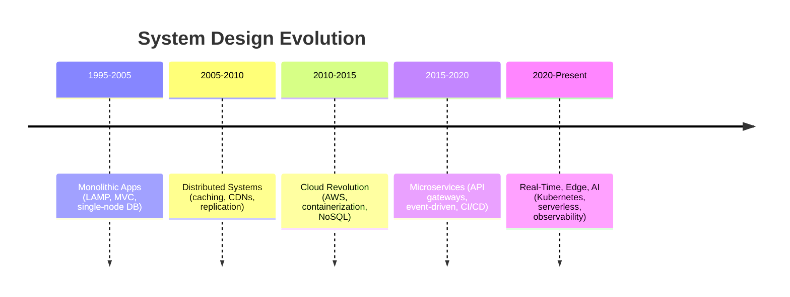
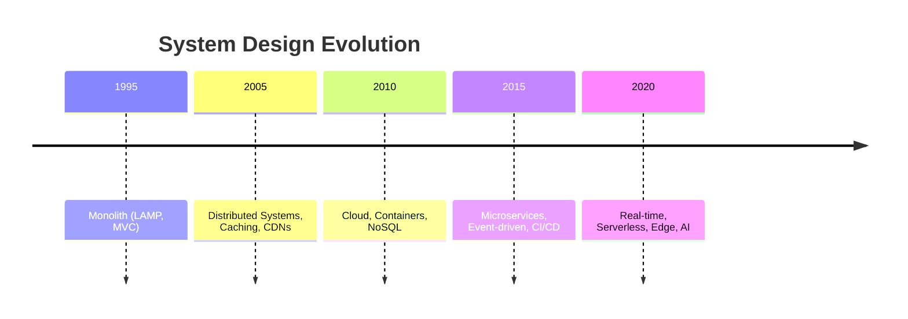
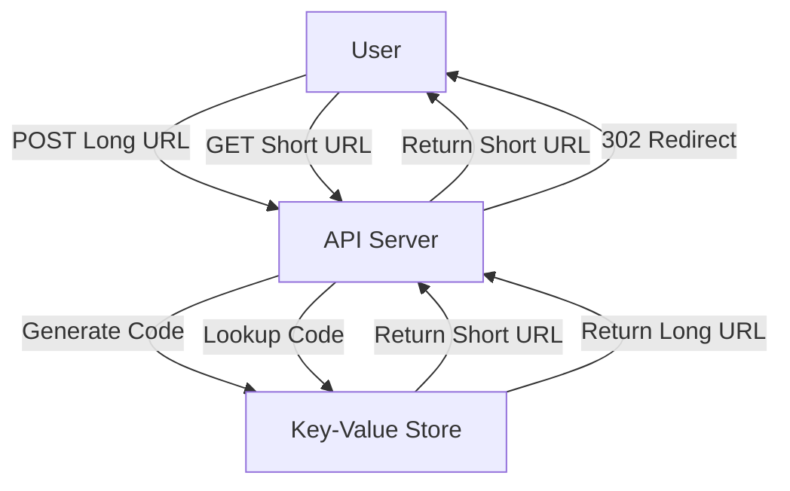
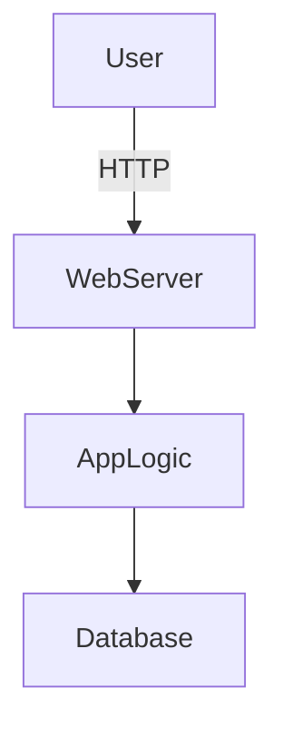
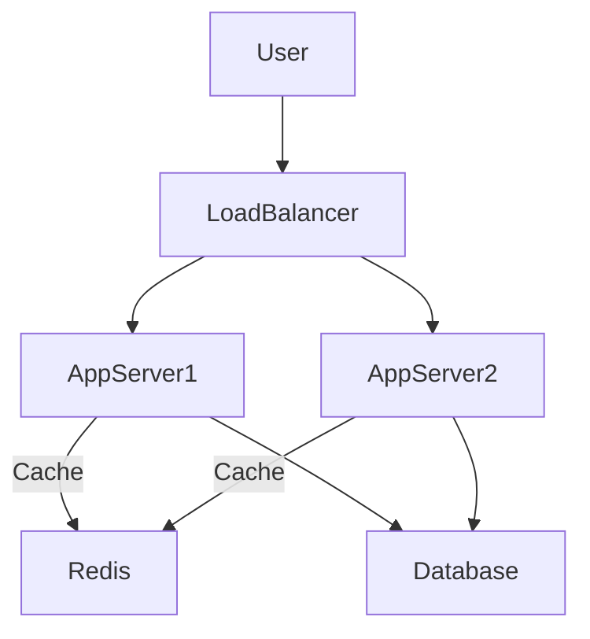
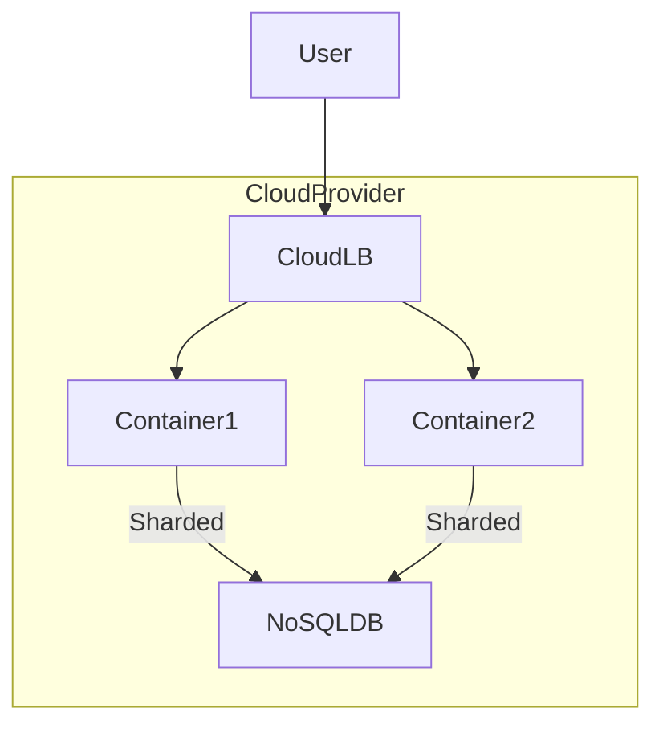
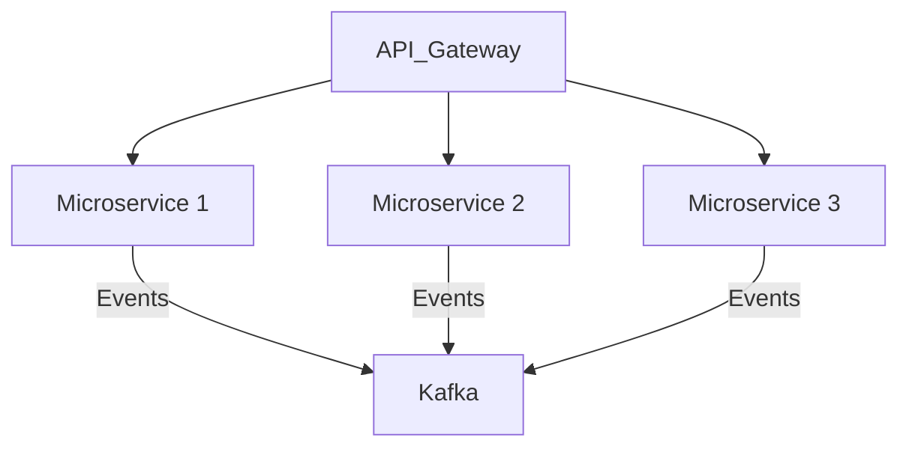
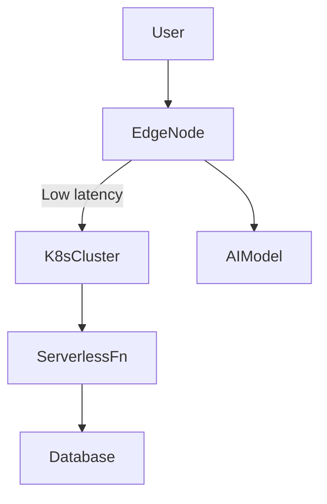
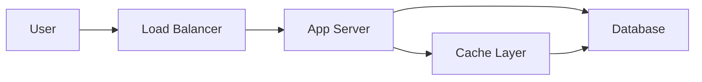

# Section 1

Certainly! Here’s a detailed **Markdown blog section** that integrates the provided transcript and slides, weaving in code snippets, diagrams (using [Mermaid](https://mermaid-js.github.io/mermaid/) for architecture), and a "Tips and Tricks" section.

---

# Mastering System Design: From Basics to Cracking Interviews

---

Welcome to your journey in **Mastering System Design**! Whether you’re new to system design or preparing for those tough interviews, this guide will help you build a rock-solid foundation and give you the tools to design robust, scalable systems.

---

## What is System Design?

> "**System Design is the process of defining the architecture, components, modules, interfaces, and data flow for a system to meet specific requirements.**"

System design is all about making high-level decisions regarding how different pieces of your application interact. This includes:

- **Architecture**: Monoliths, microservices, serverless, etc.
- **Components**: Databases, caches, message queues, etc.
- **Interfaces**: REST APIs, gRPC, GraphQL, etc.
- **Data Flow**: How information travels between components.

### Why Does It Matter?

- **Scalability & Reliability**: Supports millions of users, handles failures gracefully.
- **Career Growth**: Essential for senior engineers, architects, and technical leaders.
- **Real-World Impact**: Enables you to build systems like WhatsApp, Netflix, or Uber.

---

## The Evolution of System Design (Last 25 Years)

Let’s quickly visualize how system design has evolved:



Each leap brought new challenges and solutions around scalability, reliability, and speed.

---

## Course Structure

This is how you’ll master system design:

1. **Introduction**: Understand the landscape and importance.
2. **System Design Fundamentals**: Dive into core patterns and architecture.
3. **Scalability**: Caching, load balancing, sharding.
4. **Storage**: SQL vs NoSQL, distributed databases.
5. **Performance**: Optimize latency and throughput.
6. **Reliability**: Fault tolerance, availability, recovery.
7. **Security**: Best practices for data protection.
8. **Comprehensive Design**: Real-world system blueprints.
9. **Frameworks & Methodologies**: Structured approaches for interviews.
10. **Case Studies**: Deep dives into Netflix, WhatsApp, Uber, and more.
11. **Interview Tips**: Crack system design interviews with confidence.

---

## System Design Example: High-Level Architecture

Let’s look at a sample **high-level web application architecture**:

```mermaid
graph TD
  User[User]
  LB[Load Balancer]
  WS[Web Servers]
  Cache[Cache (Redis/Memcached)]
  DB[Database (SQL/NoSQL)]
  MQ[Message Queue]
  SVC[Microservices]
  
  User --> LB
  LB --> WS
  WS --> Cache
  WS --> SVC
  SVC --> DB
  WS --> MQ
  MQ --> SVC
```

**Explanation**:
- **Load Balancer**: Distributes traffic to web servers.
- **Cache**: Stores frequently accessed data to reduce DB load.
- **Microservices**: Modularize business logic.
- **Database**: Stores persistent data.
- **Message Queue**: For async processing (e.g., order processing, emails).

---

## Code Snippet: Simple Caching Example (Python + Redis)

```python
import redis

# Connect to Redis
cache = redis.StrictRedis(host='localhost', port=6379, db=0)

def get_user_profile(user_id):
    # Check cache first
    profile = cache.get(f"user:{user_id}")
    if profile:
        return profile
    
    # If not in cache, fetch from DB (simulated)
    profile = fetch_from_db(user_id)
    cache.set(f"user:{user_id}", profile, ex=60*5)  # cache for 5 minutes
    return profile

def fetch_from_db(user_id):
    # Simulate DB fetch
    return {"user_id": user_id, "name": "John Doe"}
```

---

## Tips and Tricks for Mastering System Design

**1. Build from Fundamentals**  
Don’t just memorize patterns—understand *why* they exist.

**2. Use the 4-Step Design Framework**
- **Requirements Clarification** (Functional & Non-functional)
- **High-Level Design** (Draw block diagrams)
- **Detailed Components** (Databases, caching, scaling, etc.)
- **Bottlenecks & Tradeoffs** (Discuss pros/cons, alternatives)

**3. Simulate Real-World Scenarios**  
Use case studies (Netflix, WhatsApp, etc.) to see how theory meets practice.

**4. Practice Trade-offs**
Every decision (SQL vs NoSQL, monolith vs microservices) has trade-offs. Always justify your choices.

**5. Don’t Skip the Details**
Dive into network protocols, database indexing, consistency models, and more.

**6. Revisit & Revise**
Topics are interconnected. Revisit sections to deepen your understanding.

**7. Prepare for Interviews Methodically**
Practice explaining your design, drawing diagrams, and defending your choices.

---

## Conclusion

Mastering system design is not just about cracking interviews—it's about building scalable, reliable, and maintainable software that powers the world’s largest applications.

Ready to dive in? Let’s start this journey together!

---

**Next up:** [System Design Fundamentals →](#)  
**Have questions?** Comment below or join our discussion forum!

---

# Section 2

# Mastering System Design: From Basics to Cracking Interviews

*By Rahul Rajat Singh*

---

System design is a cornerstone skill for software engineers, architects, and anyone building large-scale, robust software solutions. In this section, we’ll break down what system design is, why it has become so crucial in the tech industry, how it has evolved, and practical ways to master it—whether you’re aiming for interviews or building real-world applications.

---

## What is System Design?

**System design** is the process of defining the architecture, components, modules, interfaces, and data flow of a system to meet specific requirements. It’s much more than just drawing boxes and arrows on a whiteboard—it’s about making critical high-level decisions that determine not only how a system works, but also how it scales, performs, and remains reliable and maintainable.

> “System design isn’t just about diagrams. It’s about thinking through architecture—making trade-offs that impact both functional and non-functional requirements like scalability, reliability, performance, and maintainability.”


### Key Aspects of System Design

- **Architecture:** Overall structure, including how components interact.
- **Components/Modules:** Building blocks that make up the system.
- **Interfaces:** How different parts of the system communicate.
- **Data Flow:** How information moves through the system.
- **Scalability:** Can the system handle a growing number of users?
- **Reliability & Performance:** Can the system recover from failure and remain fast?
- **Maintainability:** How easy is it to update or fix the system?

#### Example: High-Level Diagram

```mermaid
flowchart TD
    User[User]
    LB[Load Balancer]
    App[Application Servers]
    Cache[Cache (Redis/Memcached)]
    DB[(Database)]
    
    User --> LB
    LB --> App
    App --> Cache
    App --> DB
    Cache <--> DB
```

This classic web application architecture illustrates how a load balancer distributes traffic to multiple servers, which use caching and a database to serve requests efficiently.

---

## Why is System Design Important?

System design skills are essential for several reasons:

- **Scalability & Reliability:** Build systems that handle millions of users without failing.
- **Architectural Thinking:** Move beyond coding to making decisions about trade-offs (e.g., SQL vs. NoSQL, CAP theorem).
- **Career Growth:** Required for senior engineering or architect roles.
- **Real-World Problem Solving:** Design systems that solve actual business needs, not just interview questions.
- **Trade-Offs & Decision Making:** Balance cost, speed, complexity, and scalability.
- **Future-Proofing:** Prevent bottlenecks and technical debt.

> **Note:** Deeply understanding system design makes interviews easier, but more importantly, it enables you to architect effective, scalable solutions.

---

## The Evolution of System Design (1995–Present)

System design is not static—it has evolved rapidly over the last 25 years:

| Era               | Key Developments |
|-------------------|-----------------|
| **1995–2005**     | Monolithic apps (LAMP), stateless servers, simple MVC |
| **2005–2010**     | Caching (Memcached, Redis), CDNs, horizontal scaling |
| **2010–2015**     | Cloud (AWS, Azure, GCP), containers, NoSQL databases |
| **2015–2020**     | Microservices, API gateways, event-driven (Kafka), CI/CD |
| **2020–Present**  | Real-time, AI-driven systems, serverless, edge computing, Kubernetes, security & observability |

#### Evolution Diagram



---

## How This Course is Structured

1. **Introduction** – Overview & importance in the real world
2. **System Design Fundamentals** – Core concepts, patterns, trade-offs
3. **Scalability** – Load balancing, caching, sharding
4. **Storage** – SQL vs. NoSQL, distributed DBs, partitioning
5. **Performance** – Optimizing latency, throughput, efficiency
6. **Reliability** – Fault tolerance, high availability, disaster recovery
7. **Security** – Authentication, authorization, data protection
8. **Putting It All Together** – Designing real-world systems
9. **Approach for System Design** – Frameworks, methodologies
10. **Case Studies** – Netflix, WhatsApp, Uber architectures
11. **Interview Tips** – Strategies for interviews

---

## Practical Example: Designing a URL Shortener

Let’s look at a simplified example—designing a URL shortener like bit.ly.

**Requirements:**
- Shorten URLs
- Redirect users to original URLs
- Handle high read/write traffic
- Analytics (optional)

**High-Level Steps:**
1. Generate a unique short code for each URL.
2. Store mapping in a database.
3. Redirect incoming requests to the original URL.

#### Pseudocode (Python-like)

```python
import hashlib

def shorten_url(long_url):
    # Generate a short code using hash
    code = hashlib.md5(long_url.encode()).hexdigest()[:6]
    db.save(code, long_url)
    return f"https://sho.rt/{code}"

def redirect(code):
    long_url = db.get(code)
    if long_url:
        return redirect_to(long_url)
    else:
        return 404
```

#### Diagram



**Trade-offs to Consider:**
- Use a key-value store (e.g., Redis or DynamoDB) for high throughput.
- Add caching for popular short URLs.
- Partition database based on code prefix for scalability.

---

## Tips and Tricks for Mastering System Design

- **Start with Fundamentals:** Don’t skip basics—understand architectural patterns, data flow, and trade-offs.
- **Use Frameworks:** Apply a 4-step design framework: requirements, high-level design, deep-dive on components, bottlenecks/trade-offs.
- **Practice Case Studies:** Analyze real-world systems (Netflix, Uber, WhatsApp) to see principles in action.
- **Draw Diagrams:** Communicate your design visually—use sequence diagrams, flowcharts, and component diagrams.
- **Think in Trade-offs:** There’s never a perfect solution—always justify your choices (latency vs. consistency, cost vs. reliability).
- **Simulate Interviews:** Practice explaining your design process out loud.
- **Review & Iterate:** After each design, review for scalability, reliability, performance, and maintainability.
- **Stay Updated:** Follow trends—cloud, serverless, edge computing, and security are fast-evolving areas.

---

> **Pro Tip:** When approaching any system design problem, start by clarifying requirements and constraints. Ask questions, outline assumptions, and only then move to the architecture. This mirrors how real-world engineering happens.

---

## Navigating This Course Effectively

- **Start with Fundamentals**—build depth and clarity before jumping to advanced topics.
- **Case Studies**—simulate interview discussions and learn from real-world designs.
- **Apply the 4-Step Design Framework** for structured thinking.
- **Don’t Skip Details**—pause, research, and revisit as needed.
- **Understand Interconnections**—system design topics are highly interrelated.

---

**Remember:** System design goes beyond interviews—it's about building scalable, reliable, and efficient software that powers the world’s biggest platforms. Mastering it will set you apart as an engineer and problem solver.

---

*Next up: Why is system design important for your career and the software industry at large? Stay tuned!*

# Section 3

# Mastering System Design: More Than Just Interview Prep

System design is often viewed through the narrow lens of interview preparation. However, as both the transcript and the course slides emphasize, system design is **fundamental** to building scalable, reliable, and efficient software systems. In this post, we’ll integrate key insights from the transcript and slides, explore real-world examples, and provide actionable tips to help you truly master system design—whether you’re aiming to ace interviews or architect robust solutions.

---

## What is System Design?

System design is the process of **defining the architecture, components, modules, interfaces, and data flow** for a system to meet specific requirements. This involves making high-level decisions about:

- **Scalability**
- **Reliability**
- **Performance**
- **Maintainability**

You’ll encounter system design in real-world applications like scalable web apps, distributed systems, databases, and cloud infrastructures.

---

## Why is System Design Important?

Let’s break down the core reasons, combining the transcript’s narrative with the slide points:

### 1. **Scalability & Reliability**

> *“Think about modern applications we are using daily. These platforms handle millions, even billions of users without any problem. A good system design is crucial for such systems.”*

A well-designed system ensures high availability, fault tolerance, and seamless scaling. Imagine a system that crashes during peak load—good design prevents this scenario.

**Example: Load Balancing**

```plaintext
                    +-------------+
                    |  Load       |
   Clients  --->    |  Balancer   |  --->  Multiple App Servers
                    +-------------+
```

**Code Snippet: NGINX Load Balancer Config**
```nginx
http {
  upstream app_servers {
    server appserver1.example.com;
    server appserver2.example.com;
  }
  server {
    listen 80;
    location / {
      proxy_pass http://app_servers;
    }
  }
}
```

---

### 2. **Architectural Thinking**

> *“When you study system design, you are actually going beyond coding. You are thinking at an architectural level.”*

This means making informed decisions and trade-offs, such as:

- SQL vs. NoSQL databases
- Microservices vs. Monolith architectures
- Consistency vs. Availability (CAP theorem)

**Trade-off Example: CAP Theorem**

```plaintext
+----------------------+
|       CAP Theorem    |
+----------------------+
| C: Consistency       |
| A: Availability      |
| P: Partition Tolerance|
+----------------------+
Pick any two.
```

---

### 3. **Career Growth**

> *“It is also important to become a senior level engineer or architect to focus on system design.”*

Junior engineers focus on code; senior engineers design for scalability, maintainability, and system health. Mastery of system design is a must for tech leads and architects.

---

### 4. **Real-World Problem Solving**

> *“System design is about solving real-world engineering challenges and not just passing interviews.”*

Memorizing patterns isn’t enough. You must deeply understand why certain design choices are made.

---

### 5. **Trade-Offs & Decision Making**

> *“There is no such thing as a perfect system design. Only well-reasoned trade-offs are there in a good system design.”*

You must balance scalability, cost, speed, and complexity. For example, the choice between SQL and NoSQL depends on your application’s consistency and scalability needs.

---

### 6. **Future-Proofing**

> *“Poorly designed systems become bottlenecks over time. A well-designed system ... can adapt to growing traffic, new features and emerging technologies.”*

Netflix and eBay, for instance, started with monolithic architectures but migrated to microservices as they scaled.

---

## The Evolution of System Design (A 25-Year Timeline)

| Year          | Key Trends                                  | Technologies & Patterns                      |
|---------------|---------------------------------------------|----------------------------------------------|
| 1995-2005     | Early monolithic web apps                   | LAMP stack, MVC, server-side rendering       |
| 2005-2010     | Distributed systems, scaling challenges     | Memcached, Redis, CDNs, database replication|
| 2010-2015     | Cloud revolution                            | AWS, Azure, GCP, containers, NoSQL           |
| 2015-2020     | Microservices & event-driven architectures  | Kafka, RabbitMQ, CI/CD, service meshes       |
| 2020-Present  | Real-time, AI-driven & edge computing       | Serverless, Kubernetes, streaming, security  |

---

## A Basic System Design Example: URL Shortener

### High-Level Architecture Diagram

```plaintext
        +--------+        +-----+       +-----------+
User -> |  API   | <----> | DB  | <---- | Cache     |
        +--------+        +-----+       +-----------+
```

### Simplified Code Snippet: Generating a Short URL

```python
import hashlib

def generate_short_url(original_url):
    return hashlib.md5(original_url.encode()).hexdigest()[:6]
```

### Key Trade-Offs

- DB choice: SQL for transactions, NoSQL for scalability
- Cache: To reduce DB reads
- High availability: Multiple API servers behind a load balancer

---

## Tips and Tricks for Mastering System Design

**1. Build from Fundamentals**
   - Start with core concepts: scalability, consistency, availability, partition tolerance, etc.

**2. Practice the 4-Step Design Framework**
   1. **Clarify requirements:** Functional and non-functional
   2. **Define high-level architecture:** Draw diagrams
   3. **Deep-dive components:** Databases, load balancers, caches
   4. **Discuss trade-offs:** Cost, latency, consistency, etc.

**3. Use Real-World Case Studies**
   - Analyze architectures of companies like Netflix, WhatsApp, and Uber.

**4. Don’t Skip the Details**
   - Understand how components interact—study patterns like sharding, replication, and failover.

**5. Simulate Interview Discussions**
   - Practice articulating your design decisions and trade-offs.

**6. Revisit and Iterate**
   - System design is interconnected. Revisit topics and improve your understanding over time.

---

## Conclusion

System design isn’t just a checkbox for interviews. It’s a core engineering skill that will make you a better developer, problem solver, and architect. By mastering system design, you’ll be equipped to build scalable, efficient, and future-proof systems—while also naturally excelling in interviews.

---

**Ready to level up? Start with the fundamentals, practice real-world examples, and remember: great design is about *informed trade-offs*, not memorized patterns.**

---

> _“If you deeply understand system design principles, interviews will naturally become easier for you to crack. But more importantly, you will be able to architect real world solutions effectively.”_

---

### Further Reading

- [System Design Primer (GitHub)](https://github.com/donnemartin/system-design-primer)
- [Designing Data-Intensive Applications by Martin Kleppmann](https://dataintensive.net/)

---

**Happy designing!**

# Section 4

Certainly! Here’s a detailed **Markdown blog section** that integrates the transcript and slides, presents the evolution of system design, includes code snippets/diagrams, and concludes with a useful **Tips and Tricks** section.

---

# 🏗️ Mastering System Design: From Basics to Modern Architectures

*By Rahul Rajat Singh*

---

## What is System Design?

**System Design** is the process of defining the architecture, components, modules, interfaces, and data flow for a system to meet specific requirements. It’s not just about writing code—it’s about making high-level decisions that affect scalability, reliability, performance, and maintainability.

> “Understanding the evolution of system design helps us appreciate why certain choices are made today.”  
> — Rahul Rajat Singh

---

## Why is System Design Important?

- **Scalability & Reliability:** Ensures systems handle millions of users without failure.
- **Architectural Thinking:** Involves trade-offs (e.g., CAP theorem, SQL vs. NoSQL).
- **Career Growth:** Essential for senior engineers & architects.
- **Real-World Problem Solving:** Goes beyond interviews; enables building actual systems.
- **Trade-Offs & Decision Making:** Balances scalability, cost, speed, and complexity.
- **Future-Proofing:** Prevents bottlenecks and supports software evolution.

> 💡 *Many learners study system design to crack interviews, but truly understanding it is key to building scalable, reliable, and efficient systems.*

---

## ⚙️ The Evolution of System Design (1995–Present)

Let’s trace the journey of system design over the past 25 years, highlighting key architectural shifts and technologies.

### 1. **1995–2005: Early Monolithic Web Applications**

- **Stack:** LAMP (Linux, Apache, MySQL, PHP)
- **Architecture:** Monolithic — front-end, back-end, and DB bundled together
- **Features:** Stateless servers, server-side rendering, no real-time interactions

**Diagram:**  


**Example: PHP Hello World**
```php
<?php
echo "Hello, World!";
?>
```

---

### 2. **2005–2010: Distributed Systems & Scaling**

- **Challenges:** Social media, e-commerce scale (e.g., Facebook, Amazon)
- **Solutions:**  
    - Caching (Memcached, Redis)
    - Content Delivery Networks (CDNs)
    - Database replication
    - Load balancers

**Diagram:**  


**Sample: Simple Load Balancer (Python)**
```python
import random

servers = ['app_server_1', 'app_server_2', 'app_server_3']

def handle_request(request):
    server = random.choice(servers)
    print(f"Forwarding {request} to {server}")
```

---

### 3. **2010–2015: The Cloud Revolution**

- **Cloud Providers:** AWS, Azure, GCP
- **Deployment:** Virtualized, containerized (Docker)
- **Databases:** NoSQL (MongoDB, Cassandra)
- **Techniques:** Database sharding, on-demand scaling

**Diagram:**  


**Sample: Dockerfile**
```dockerfile
FROM node:18
WORKDIR /app
COPY . .
RUN npm install
CMD ["node", "server.js"]
```

---

### 4. **2015–2020: Microservices & Event-Driven Architectures**

- **Shift:** Monoliths → Microservices
- **Tech:** API gateways, service meshes, event brokers (Kafka, RabbitMQ)
- **Practices:** CI/CD pipelines

**Diagram:**  


**Sample: Kafka Producer (Node.js)**
```js
const { Kafka } = require('kafkajs');
const kafka = new Kafka({ clientId: 'my-app', brokers: ['kafka1:9092'] });
const producer = kafka.producer();

async function sendMessage() {
  await producer.connect();
  await producer.send({ topic: 'logs', messages: [{ value: 'Hello Kafka' }] });
  await producer.disconnect();
}
sendMessage();
```

---

### 5. **2020–Present: Real-Time, AI-Driven, and Edge Computing**

- **Demands:** Low latency, real-time, AI recommendations, streaming, instant messaging
- **Tech:** Serverless, Kubernetes, edge computing, observability, security, compliance

**Diagram:**  


**Sample: Serverless Function (AWS Lambda, Python)**
```python
def lambda_handler(event, context):
    return {
        'statusCode': 200,
        'body': 'Hello from the Edge!'
    }
```

---

## 🧭 Course Structure Overview

- **Introduction:** System design fundamentals & importance
- **Core Concepts:** Patterns, trade-offs, scalability, storage, performance, reliability, security
- **Case Studies:** Real architectures (Netflix, WhatsApp, Uber)
- **Interview Tips:** Frameworks, methodologies, and strategies

---

## 📝 Tips and Tricks for Mastering System Design

1. **Start with Fundamentals:** Grasp core concepts before diving into advanced topics.
2. **Use the 4-Step Design Framework:**  
    1. Requirements clarification  
    2. High-level design  
    3. Deep dive into components  
    4. Trade-off discussion
3. **Practice Case Studies:** Simulate real interview scenarios.
4. **Don’t Rush:** Pause, research, and resume if you hit roadblocks.
5. **Revisit & Iterate:** System design is interconnected; revisit topics to deepen understanding.
6. **Stay Curious:** The field evolves—keep learning about new technologies and paradigms.

---

> **Remember:**  
> System design isn’t about memorizing buzzwords—it’s about understanding the “why” behind every architectural choice.  
>  
> *Keep learning, keep building!*

---

**Next:** [Course Structure & Agenda →](#course-structure-overview)

---

*For more, follow the full course or check out the next section on deep-diving into system design fundamentals!*

# Section 5

Certainly! Here’s a detailed **Markdown blog section** that seamlessly integrates the transcript and slide content, includes diagrams as ASCII art (since Markdown doesn’t directly support images without external files), a code snippet (to illustrate API design), and a useful **Tips and Tricks** section.

---

# 📚 Mastering System Design: From Basics to Architecting Real-World Systems

**By Rahul Rajat Singh**

---

## 🚀 Introduction to System Design

System design is the backbone of building software that scales, performs, and is maintainable in the real world. Whether you aspire to ace interviews at top tech companies or architect reliable solutions for millions of users, understanding system design is a must-have skill.

> **System Design is the process of defining the architecture, components, modules, interfaces, and data flow for a system to meet specific requirements.**

It goes beyond just code — it’s about making high-level decisions concerning scalability, reliability, performance, and maintainability.

---

## 🏗️ Why Is System Design Important?

- **Scalability & Reliability:** Enables systems to handle millions of users without downtime.
- **Architectural Thinking:** Forces you to think in terms of trade-offs (e.g., CAP theorem, SQL vs. NoSQL).
- **Career Growth:** Essential if you aim to become a senior engineer, architect, or tech lead.
- **Real-World Problem Solving:** Helps you build robust systems, not just pass interviews.
- **Decision Making:** Involves balancing speed, cost, complexity, and future growth.
- **Future-Proofing:** Prevents bottlenecks and enables smooth software evolution.

> **Note:** Many learners approach system design as an interview hurdle, but its true value is in building scalable, reliable, and efficient software. Master it for real-world impact, and interviews will naturally become easier.

---

## ⏳ The Evolution of System Design (Past 25 Years)

```plaintext
1995-2005   2005-2010   2010-2015   2015-2020   2020+
|-----------|-----------|-----------|-----------|-----------|
Monolith    Distributed Cloud       Micro-      Real-time,
LAMP stack  Caching,    Revolution  services,   AI-driven,
MVC         Replication AWS, GCP,   Event       Edge,
            CDNs        NoSQL       Driven      Serverless
```

### Timeline Highlights

- **1995-2005:** Monolithic web apps (LAMP), simple MVC, no real-time.
- **2005-2010:** Need for scaling; introduction of caching, CDNs, load balancing.
- **2010-2015:** Cloud revolution, virtualized deployments, rise of NoSQL.
- **2015-2020:** Microservices, event-driven systems, CI/CD pipelines.
- **2020-Present:** Real-time streaming, AI, edge computing, serverless, security focus.

---

## 🗺️ Course Roadmap & Structure

This course is designed to take you from beginner to confident architect:

1. **Introduction** — Importance in real-world, career, and interviews.
2. **System Design Fundamentals** — Core concepts, architecture patterns (monolith, microservices, event-driven), and API design.
3. **Networking & Communication** — IP, DNS, proxies, load balancers, API gateways, CDNs, protocols (UDP, TCP, HTTP, WebSockets, gRPC).
4. **Scalability** — Horizontal vs. vertical scaling, auto-scaling, load balancing.
5. **Storage** — SQL vs. NoSQL, distributed storage, object storage, big data architecture.
6. **Performance** — Caching, message queues, concurrency, sharding, indexing.
7. **Reliability** — High availability, fault tolerance, failover, disaster recovery.
8. **Security** — Authentication, authorization, encryption, HTTPS, firewalls, best practices.
9. **Putting It All Together** — System design frameworks, breaking down problems, technology choices.
10. **Approach to System Design** — Requirement gathering, structured methodologies.
11. **Case Studies** — Real-world systems (Uber, Netflix, WhatsApp, Airbnb, TinyURL, Google Search).
12. **Interview Tips** — Strategies for system design interviews.

---

## ⚙️ A Glimpse at Architectural Patterns

### Monolithic vs Microservices Architecture

```plaintext
+------------------------------+         +-----------+    +-----------+
|   Monolithic Application     |         | Service A |    | Service B |
+------------------------------+         +-----------+    +-----------+
| UI | Business Logic | DB     |   vs    (own DB,    )... (own DB,    )
+------------------------------+         (own logic)     (own logic)
```

- **Monolith:** Single codebase, tight coupling, easy to start, hard to scale.
- **Microservices:** Decomposed, independent deployability, language agnostic, scales better.

---

## 🛰️ Example: Simple REST API Design

A well-designed API is crucial for communication between system components.

```python
# Example: Flask REST API for a TinyURL service

from flask import Flask, request, jsonify
app = Flask(__name__)

url_map = {}

@app.route('/shorten', methods=['POST'])
def shorten():
    original_url = request.json['url']
    short_id = str(hash(original_url))[:6]
    url_map[short_id] = original_url
    return jsonify({'short_url': f"https://tiny.url/{short_id}"})

@app.route('/<short_id>')
def redirect(short_id):
    original_url = url_map.get(short_id)
    if original_url:
        return f"Redirecting to {original_url}"
    return "URL not found", 404

if __name__ == "__main__":
    app.run()
```

- **API Design**: RESTful endpoints, stateless, scalable.
- **Data Management**: Hashing for short URL, in-memory store (for illustration).

---

## 📈 Performance Boosters

- **Caching:** Use Redis or Memcached to speed up repeated requests.
- **Message Queues:** Offload processing using Kafka or RabbitMQ.
- **Database Sharding:** Split big databases for better throughput.
- **CDNs:** Serve static assets closer to users for lower latency.

---

## 🔒 Security Essentials

- **Authentication & Authorization:** OAuth, JWT, role-based access.
- **Encryption:** HTTPS, data at rest encryption.
- **Firewalls & API Gateways:** Control access and mitigate attacks.

---

## 💡 Tips and Tricks

1. **Start with Fundamentals:** Don’t rush into case studies; build a solid foundation.
2. **Use a 4-Step Design Framework:**
   - Gather requirements (functional & non-functional)
   - Define high-level architecture
   - Detail critical components (databases, caches, queues)
   - Address trade-offs (scalability, reliability, cost)
3. **Practice Real-World Case Studies:** Design systems like Uber, Netflix, WhatsApp.
4. **Draw Diagrams:** Visualize components, data flow, and interactions.
5. **Pause & Research:** Don’t skip over unclear topics; revisit and deepen understanding.
6. **Think in Trade-Offs:** Every choice impacts scalability, performance, or cost.
7. **Security First:** Never treat security as an afterthought.
8. **Prepare for Interviews:** Practice explaining your design rationale and trade-offs.
9. **Iterate & Revisit:** System design is never “done”—keep learning and improving.

---

## 📌 Conclusion

Mastering system design is a journey. Whether you’re prepping for interviews or aiming to build world-class products, this skill will set you apart. Dive deep, practice often, and always keep the big picture in mind.

> **By the end of this course, you’ll be ready to design scalable systems and ace any system design interview.**

---

**Ready to get started? Let’s dive into the fundamentals in the next section! 🚀**

---

**_PS: Bookmark this blog. Each section will be updated with more diagrams, code, and real-world examples as you progress!_**

---

# Section 6

```markdown
# Mastering System Design: A Comprehensive Guide

System design is one of the most essential skills for modern software engineers, whether you’re building scalable backends, prepping for interviews, or architecting the next big thing. In this article, we’ll walk through the fundamentals, the evolution of system design, and a practical approach for learning and applying these concepts. 

---

## What Is System Design?

System design is the process of **defining the architecture, components, modules, interfaces, and data flow** required for a system to meet specific requirements.

It’s about answering questions such as:

- How do we make this system **scalable**?
- What trade-offs are needed for **reliability vs. consistency**?
- Which database type should we use: **SQL or NoSQL**?
- How do we ensure **performance** and **maintainability**?

System design goes beyond just coding—it’s about seeing the big picture, making architectural decisions, and understanding how different pieces interact.

---

## Why Is System Design Important?

- **Scalability & Reliability:** Ensures your systems can handle millions of users without failure.
- **Architectural Thinking:** Requires understanding of trade-offs (e.g., CAP theorem, SQL vs. NoSQL).
- **Career Growth:** Fundamental for advancing to senior engineering or architect roles.
- **Real-World Problem Solving:** Lets you build actual systems, not just pass interviews.
- **Trade-Offs & Decision Making:** Balances scalability, cost, speed, and complexity.
- **Future-Proofing:** Helps avoid bottlenecks and enables smooth evolution of software.

> **Note:** Many learners approach system design to crack interviews, but its real value lies in being able to architect robust, scalable, and efficient systems in production.

---

## The Evolution of System Design (1995–Present)

System design is not static—it has dramatically evolved over the last 25 years:

| Era                | Key Trends                                                                                              |
|--------------------|--------------------------------------------------------------------------------------------------------|
| 1995–2005          | Monolithic web apps (LAMP stack), stateless servers, MVC, single-node databases                        |
| 2005–2010          | Caching (Memcached, Redis), CDNs, database replication, horizontal scaling, load balancing              |
| 2010–2015          | Cloud adoption (AWS, Azure, GCP), virtualization, containers, NoSQL databases                          |
| 2015–2020          | Microservices, API gateways, event-driven systems (Kafka, RabbitMQ), CI/CD pipelines                   |
| 2020–Present       | Real-time, AI-driven, edge computing, serverless, Kubernetes, security, compliance, observability      |

 <!-- Placeholder for a simple timeline diagram -->

---

## How This Course (and This Guide) Is Structured

1. **Introduction:** System design basics and real-world importance
2. **Fundamentals:** Core concepts, architecture patterns, and trade-offs
3. **Scalability:** Handling growth, load balancing, caching, sharding
4. **Storage:** SQL vs. NoSQL, distributed databases, partitioning
5. **Performance:** Latency, throughput, efficiency
6. **Reliability:** Fault tolerance, high availability, disaster recovery
7. **Security:** Authentication, authorization, data protection
8. **Putting It All Together:** Designing real-world systems
9. **Approach & Frameworks:** Structured methodologies
10. **Case Studies:** Deep dives (Netflix, WhatsApp, Uber)
11. **Interview Tips:** Strategies for excelling in system design interviews

---

## How to Approach System Design for Maximum Value

**1. Start with Fundamentals:**  
Whether it’s protocols, APIs, consistency models, or scaling techniques, building a strong foundation is critical. You'll develop the vocabulary and mental models needed for deep-dive interview questions or real-world problem-solving.

**2. Dive into Case Studies:**  
Practice with interactive, exploratory case studies that mimic real interview discussions. Rather than jumping straight into diagrams, talk through requirements, constraints, and assumptions.

**3. Use a 4-Step Design Framework:**

```text
1. Understand the requirements
2. Estimate the scale
3. Design high-level components
4. Make strategic technology decisions
```

**4. Sketch High-Level Diagrams:**  
Start simple—capture the “big picture” before drilling into details.



*Example: A typical web app architecture with load balancing and caching.*

**5. Embrace Iteration:**  
System design is interconnected: caching affects performance, which affects scalability, which links to load balancing, and so on. Revisit and refine your designs as you learn more.

---

## Sample Code: Load Balancer (Python Pseudocode)

Here’s a simple round-robin load balancer to illustrate distributing incoming requests:

```python
class LoadBalancer:
    def __init__(self, servers):
        self.servers = servers
        self.index = 0

    def get_server(self):
        server = self.servers[self.index]
        self.index = (self.index + 1) % len(self.servers)
        return server

# Usage
lb = LoadBalancer(['AppServer1', 'AppServer2', 'AppServer3'])
for _ in range(6):
    print(lb.get_server())
```
*Output:*
```
AppServer1
AppServer2
AppServer3
AppServer1
AppServer2
AppServer3
```

---

## Tips and Tricks for Mastering System Design

- **Don’t Memorize—Understand:** Focus on underlying principles, not just patterns.
- **Pause and Research:** If you hit an unfamiliar term (like *TF-IDF* in search systems), pause and read up before continuing.
- **Practice Out Loud:** Simulate interviews by explaining your thought process and diagrams to a peer or yourself.
- **Iterate:** Do the course (or walkthrough) twice. The second run fills gaps you missed the first time.
- **Connect the Dots:** Realize how components like caching, load balancing, and sharding interrelate.
- **Ask "Why?" Often:** For every decision, know the trade-offs (latency vs. consistency, cost vs. performance, etc.).
- **Diagram First, Details Later:** High-level diagrams help you communicate the architecture before you dive into specifics.
- **Stay Curious:** System design is vast—keep exploring new architectures, tools, and case studies.

---

## Final Thoughts

System design isn’t just about acing interviews—it’s about building scalable, reliable, and maintainable systems. With a structured approach, a focus on fundamentals, and plenty of practice, you’ll be able to tackle both interview questions and real-world challenges with confidence.

**Ready to master system design?**  
Begin with the fundamentals, embrace the interconnections, and start designing—one thoughtful step at a time.

---

*See you in the next section!*

```
*Diagrams (like the Mermaid example) can be rendered in supported Markdown viewers or replaced with hand-drawn versions if using pen and paper during interviews.*
```

