# Section 1
---

# 🛡️ Security in System Design: A Deep Dive

Security is not just a feature—it's a **core pillar** of reliable, scalable, and trustworthy system architecture. In this section, we’ll explore security for distributed systems, drawing from fundamental principles, real-world attacks, best practices, and interview-ready explanations.  
Let’s break down the essentials, from **the CIA triad** and **threat modeling** to **authentication, encryption, and cloud security**.

---

## Table of Contents

1. [Why Security Matters](#why-security-matters)
2. [Security in Distributed Systems](#security-in-distributed-systems)
3. [The CIA Triad](#the-cia-triad)
4. [Threat Modeling & Attack Vectors](#threat-modeling-and-attack-vectors)
5. [Authentication & Authorization](#authentication-and-authorization)
6. [Data Protection & Secure Communication](#data-protection-and-secure-communication)
7. [Network & Infrastructure Security](#network-and-infrastructure-security)
8. [Best Practices & SDLC Integration](#best-practices-and-sdlc-integration)
9. [Tips and Tricks](#tips-and-tricks)
10. [Sample Interview Questions](#sample-interview-questions)

---

## Why Security Matters

> _“Security is a non-functional requirement, but it’s critical for user trust, data protection, and system reliability.”_

- **User Trust**: Users won’t share data with insecure platforms.
- **Data Protection**: Prevent leaks, theft, and accidental exposure.
- **System Reliability**: Systems under attack can’t perform well.

**Real-world breaches** (e.g., Equifax, Facebook) show that neglecting security can lead to massive financial and reputational damage.

---

## Security in Distributed Systems

Distributed architectures = more components, more entry points, more vulnerabilities.

**Key considerations:**
- Data protection **in transit** and **at rest**
- Robust **authentication/authorization**
- **Secure APIs**: Input validation, rate limiting, exploit protection
- **Node & network protection**: Segmentation, firewalls, monitoring

> 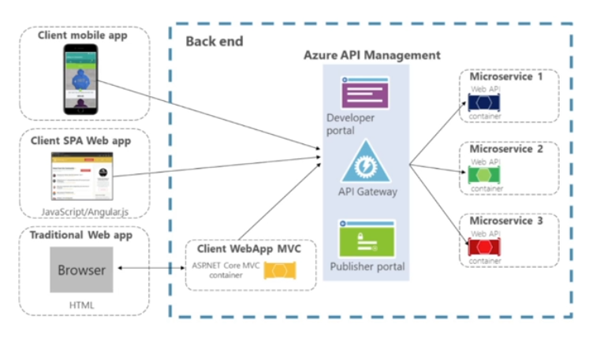
>
> *Diagram: Security must be enforced at every layer: API, service, data, infrastructure.*

---

## The CIA Triad

The backbone of security:

| Principle        | Goal                                       | Techniques                                    |
|------------------|--------------------------------------------|-----------------------------------------------|
| **(C) Confidentiality** | Prevent unauthorized data access              | Encryption (at rest/in transit), access control |
| **(I) Integrity**        | Prevent data tampering                       | Hashing, digital signatures                   |
| **(A) Availability**     | Ensure system/data are accessible when needed | Redundancy, DDoS protection, failover         |

**Diagram:**

> 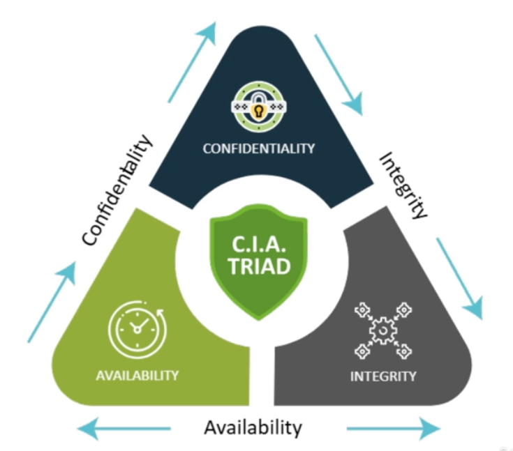
---

## Threat Modeling and Attack Vectors

**Threat modeling** helps you think like an attacker.

### Steps:
- **Identify attack surface**: Exposed APIs, UIs, network endpoints
- **Entry points**: Vulnerable integrations, user errors
- **Assets to protect**: Sensitive data, financial transactions, IP

**STRIDE Model**:  

- **S**poofing
- **T**ampering
- **R**epudiation
- **I**nformation Disclosure
- **D**enial of Service
- **E**levation of Privilege

> 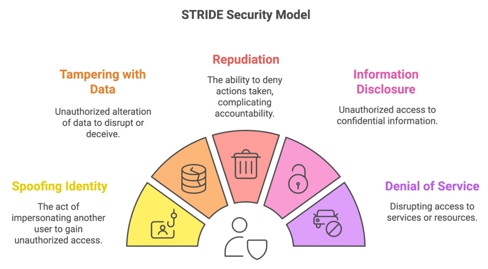


### Common Attack Vectors

How Attackers get in:

| Vector              | Description                                 | Defense                                  |
|---------------------|---------------------------------------------|------------------------------------------|
| Insecure APIs       | Poor validation, lack of auth                | Input validation, auth, rate limiting    |
| Misconfigured Servers| Defaults, missing patches                   | Config management, regular audits        |
| Poor Authentication | Weak passwords, no 2FA, session flaws        | Strong auth, MFA, secure token handling  |
| Open Ports/Services | Unnecessary or exposed ports                 | Firewalls, segmentation, port closure    |

---

## **Common Attacks**

<table>
<tr>
<td width="50%" valign="top">

### 🛑 **DDoS (Distributed Denial of Service)**
- **Description:** Flooding system with traffic to disrupt service.  
- **Target:** Availability  
- **Mitigation:**  
  - Rate limiting  
  - Traffic scrubbing (e.g., Cloudflare)  
  - Autoscaling and failover strategies  

---

### 🔒 **Man-in-the-Middle (MITM) Attack)**
- **Description:** Attacker intercepts communication.  
- **Targets:** Confidentiality & Integrity  
- **Protection:**  
  - HTTPS (TLS)  
  - Certificate pinning  
  - VPNs  

</td>
<td width="50%" valign="top">

### 💉 **Injection Attacks (e.g., SQL Injection)**
- **Description:** Attacker sends malicious input to execute unwanted commands.  
- **Impacts:** Data integrity, confidentiality  
- **Mitigation:**  
  - Input validation  
  - Parameterized queries  
  - WAF (Web Application Firewall)  

---

### 🎭 **Spoofing Attacks**
- **Description:** Impersonation of another user or system.  
- **Types:** IP spoofing, email spoofing, DNS spoofing  
- **Defense:**  
  - Multi-factor authentication  
  - Token-based authentication  
  - IP whitelisting  

</td>
</tr>
</table>


---

## **Security in the Software Development Lifecycle (SDLC)**

### **• Embed security from the start (Shift Left)**

> Integrate security practices early in the development process to prevent vulnerabilities instead of fixing them later.

---

### **• Phases:**

* **Requirements:** Threat modeling

  > Identify and assess potential security threats before development begins.

* **Design:** Secure architecture

  > Create system designs that minimize attack surfaces and enforce least privilege.

* **Development:** Secure coding

  > Follow coding standards and best practices to avoid introducing vulnerabilities.

* **Testing:** Security tests, fuzzing

  > Detect and fix vulnerabilities through automated and manual security testing.

* **Deployment:** Secrets management

  > Protect credentials, keys, and sensitive configurations in production environments.

* **Maintenance:** Patch management

  > Continuously update and patch systems to address newly discovered vulnerabilities.

---


## Authentication and Authorization

### Authentication
_Verifying identity._

- **Basic Auth**: Simple, not scalable
- **OAuth2**: Delegated access, widely used
- **OpenID Connect**: SSO, built on OAuth2
- **JWT (JSON Web Token)**: Stateless, for APIs/microservices

### Authorization
_What actions/resources a user can access._

- **RBAC**: Role-Based (e.g., Admin, User)
- **ABAC**: Attribute-Based (e.g., department, project)
- **DAC/MAC**: Owner/centralized policy

---

## Data Protection and Secure Communication

### Encryption

- **At Rest**: Disk, DB, backup encryption
- **In Transit**: TLS/SSL for API, web traffic


### Hashing & Salting Passwords

### Public Key Infrastructure (PKI)

- **Certificate Authorities** issue digital certificates.
- **TLS/SSL** uses PKI for secure handshakes.

---

## Network and Infrastructure Security

- **Firewalls**: Block/allow traffic by IP/port/protocol
- **Reverse Proxies**: Hide backend, add security (e.g., NGINX)
- **Rate Limiting & Throttling**: API abuse prevention

#### Example: NGINX Rate Limiting

- **Network Segmentation**: Separate zones (e.g., DMZ, internal)
- **Zero Trust**: Never trust, always verify. Authenticate every request, even internal.

---

## Best Practices and SDLC Integration

**Security is not a one-time task—embed it throughout the Software Development Lifecycle (SDLC):**

* **Adopt security by design**

  > Integrate security principles into every stage of system design and development.

* **Use encryption (TLS, at-rest)**

  > Protect data during transmission and while stored to prevent unauthorized access.

* **Harden infrastructure (firewalls, VPCs)**

  > Secure servers and networks by limiting exposure and controlling access points.

* **Validate inputs and sanitize outputs**

  > Prevent injection and cross-site attacks by ensuring all data is clean and safe.

* **Monitor and log activity**

  > Continuously track system events to detect anomalies and respond to threats quickly.

---

## Tips and Tricks

### General
- **Shift Left**: Start thinking about security early in your project.
- **Automate security checks**: Use CI tools to catch issues early.
- **Principle of Least Privilege**: Give only the permissions needed.

### Authentication & Authorization
- Always use **multi-factor authentication (MFA)** where possible.
- Store sensitive tokens/secrets in **vaults** (AWS Secrets Manager, HashiCorp Vault).

### Data Protection
- Use **parameterized queries** to prevent SQL injection.
- Always **salt** and **hash** passwords—never store them in plaintext.

### Network Security
- Regularly **scan for open ports** and **unused services**.
- Use **security groups** and **VPCs** in the cloud for isolation.

### Monitoring & Logging
- Log **all security events** and review them regularly.
- Set up **alerting** for suspicious activities.

---

## Sample Interview Questions

1. **How would you design a secure authentication system for a distributed application?**
2. **Explain how the CIA triad applies to system design.**
3. **What are common security threats in a microservices architecture, and how would you mitigate them?**
4. **How would you protect your system from a DDoS attack?**
5. **What role does TLS/HTTPS play in system security?**
6. **How would you implement certificate management at scale?**
7. **How can you ensure secure data storage in a cloud-based system?**
8. **What is threat modeling and how would you incorporate it into your design process?**

---

## 📚 Summary

- **Security** is ongoing. It must be built into every phase and layer of your system.
- **CIA triad**: Confidentiality, Integrity, Availability.
- **Threat modeling** and awareness of **common attack vectors** are critical.
- Use **modern authentication & access control** strategies (OAuth2, JWT, RBAC/ABAC).
- **Encrypt data everywhere**—at rest and in transit.
- **Harden your network** with firewalls, segmentation, zero trust, and monitoring.

> _Building secure systems isn’t a checkbox—it’s the foundation of good architecture._

---

**What’s Next:**  
Dive deeper into [Authentication & Authorization →](#authentication-and-authorization)

---

**Feel free to reuse, expand, or integrate this Markdown section into your blog, course notes, or technical documentation!**

# Section 2

---

# Authentication & Authorization in System Design

Designing secure systems starts with **identity**—knowing who your users are and what they are allowed to do. In this section, we'll demystify **Authentication** and **Authorization**, explore common patterns and protocols, and provide practical guidance for robust, scalable security in distributed systems.

---

## Table of Contents

1. [Authentication vs. Authorization](#authentication-vs-authorization)
2. [Common Authentication Methods](#common-authentication-methods)
3. [Session-Based vs Token-Based Authentication](#session-based-vs-token-based-authentication)
4. [Access Control Models](#access-control-models)
5. [Single Sign-On (SSO) & Identity Federation](#single-sign-on-sso--identity-federation)
6. [Code Examples](#code-examples)
7. [Diagrams](#diagrams)
8. [Tips and Tricks](#tips-and-tricks)

---

## Authentication vs. Authorization

| Concept          | What is it?                                     | Example                           | Mnemonic                |
|------------------|------------------------------------------------|-----------------------------------|-------------------------|
| **Authentication** | Verifying *who* the user is                     | Logging in with password/MFA      | "Who are you?"          |
| **Authorization**  | Deciding *what* the authenticated user can do   | Accessing admin dashboard         | "What can you do here?" |

**Key Point:**  
You *authenticate* first, then the system *authorizes* your actions.

---

## Common Authentication Methods

### 1. Basic Authentication

- **Simple:** Username and password sent with every request (use only with HTTPS!).
- **Example:**  
  ```http
  GET /protected HTTP/1.1
  Authorization: Basic dXNlcjpwYXNz
  ```

### 2. OAuth 2.0

- **Delegated Access:** Third-party apps access user data without seeing credentials.
- **Example:** "Login with Google" or "Login with Facebook".

### 3. OpenID Connect

- **Built on OAuth2:** Adds an identity layer for authentication.
- **Use Case:** Single Sign-On (SSO) across multiple apps.

### 4. JWT (JSON Web Token)

- **Stateless:** Server issues a signed token after login; client sends it with each request.
- **Example Payload:**
  ```json
  {
    "sub": "1234567890",
    "name": "John Doe",
    "role": "admin",
    "exp": 1711234567
  }
  ```

---

## Session-Based vs Token-Based Authentication

| Feature            | Session-Based                  | Token-Based (e.g., JWT)          |
|--------------------|-------------------------------|----------------------------------|
| **Storage**        | Server memory/database         | Client-side (token)              |
| **Scalability**    | Challenging in distributed env | Scales easily in microservices   |
| **State**          | Stateful                       | Stateless                        |
| **Security Concerns** | Session hijacking, CSRF        | Token theft, token expiry        |

**Session-Based Flow:**
1. User logs in.
2. Server creates a session, sends session ID cookie.
3. Client sends cookie with each request.
4. Cons - Scalabulut challenges in distrubuted systems

**Token-Based Flow:**
1. User logs in.
2. Server issues signed JWT.
3. Client sends JWT in `Authorization` header.
4. Cons - Requires secure token storage and handling.
---

## Autherization - Access Control Models

### 1. **RBAC**: Role-Based Access Control

- Assign permissions to roles, roles to users.
- **Example Roles:** `admin`, `editor`, `viewer`.
- **Pros:** Simple, scalable for standard teams.
- **Cons:** Not granular for complex orgs.

### 2. **ABAC**: Attribute-Based Access Control

- Access based on user attributes (department, project, clearance).
- **Pros:** Fine-grained control.
- **Cons:** Harder to manage at scale.

### 3. **DAC**: Discretionary Access Control

- Resource owners set access permissions.
- **Example:** File-sharing apps.

### 4. **MAC**: Mandatory Access Control

- Central authority enforces strict policies.
- **Example:** Military/government systems.

---

## Single Sign-On (SSO) & Identity Federation

- **SSO:** User logs in once, gains access to multiple apps/services without re-authenticating.
- **Identity Federation:** Trust external identity providers (Google, Facebook, Microsoft) for authentication across organizational boundaries.
- **Benefit:** Fewer passwords, less friction, better user experience.

---

## Code Examples

### JWT Authentication with Node.js/Express

```javascript
const jwt = require('jsonwebtoken');

// Issue JWT after login
app.post('/login', (req, res) => {
  // ...validate user
  const token = jwt.sign({ userId: user.id, role: user.role }, process.env.JWT_SECRET, { expiresIn: '1h' });
  res.json({ token });
});

// Verify JWT on protected route
function authenticateJWT(req, res, next) {
  const authHeader = req.headers.authorization;
  if (authHeader) {
    const token = authHeader.split(' ')[1];
    jwt.verify(token, process.env.JWT_SECRET, (err, user) => {
      if (err) return res.sendStatus(403);
      req.user = user;
      next();
    });
  } else {
    res.sendStatus(401);
  }
}
```

### RBAC Middleware Example

```javascript
function authorizeRoles(...allowedRoles) {
  return (req, res, next) => {
    if (req.user && allowedRoles.includes(req.user.role)) {
      next();
    } else {
      res.sendStatus(403); // Forbidden
    }
  }
}

// Usage:
app.get('/admin', authenticateJWT, authorizeRoles('admin'), (req, res) => {
  res.send('Welcome, admin!');
});
```

---

## Diagrams

### Authentication & Authorization Flow

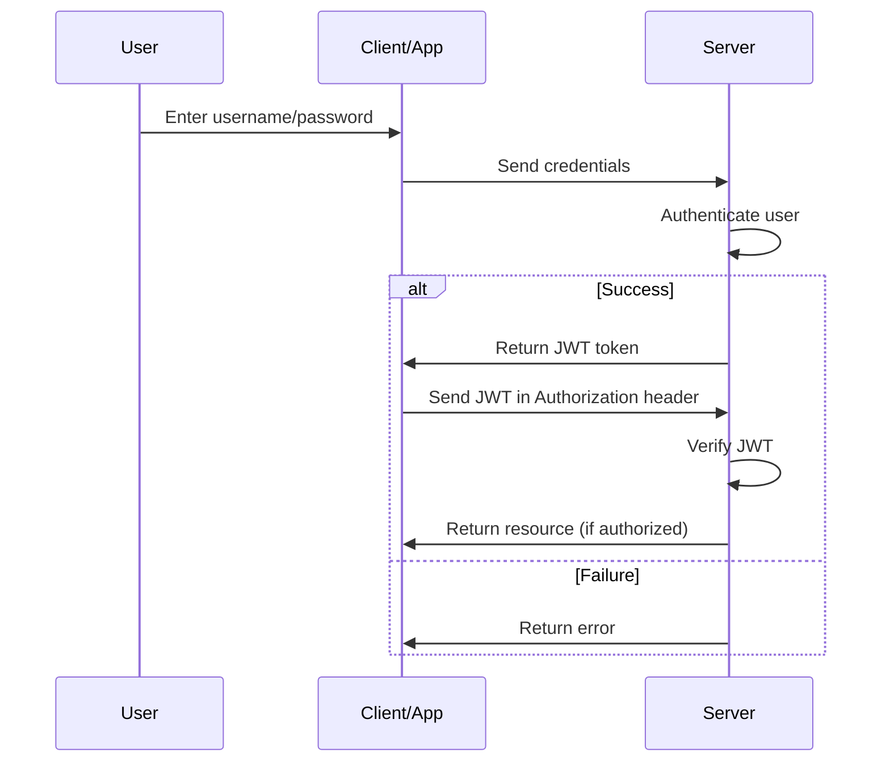

### RBAC Model

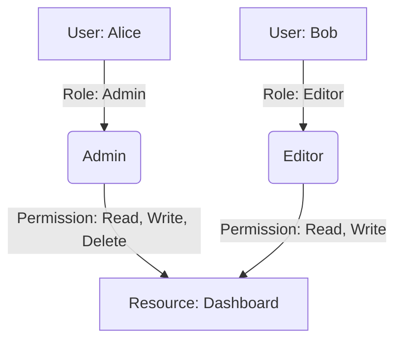

---

## Tips and Tricks

- **Always use HTTPS:** Even for development, to prevent token/session hijacking.
- **Keep JWTs short-lived:** Use refresh tokens for longer sessions.
- **Never store sensitive data in JWTs:** Tokens can be decoded by anyone.
- **Secure cookies:** Set `HttpOnly`, `Secure`, and `SameSite` attributes.
- **Centralize session/token invalidation:** To handle logout and token revocation.
- **Use established libraries:** Don't roll your own crypto/auth code.
- **Implement rate limiting:** Protect authentication endpoints from brute-force attacks.
- **Audit permissions regularly:** Remove unused roles/permissions (principle of least privilege).
- **Log authentication events:** For auditing and intrusion detection.
- **Educate users:** Encourage strong passwords and enable MFA.

---

## Summary

- **Authentication**: Who are you? (identity)
- **Authorization**: What can you do? (permissions)
- Use **OAuth2/OpenID/JWT** for modern, scalable auth.
- Choose **RBAC** for simplicity, **ABAC** for flexibility.
- **SSO** and **Identity Federation** greatly improve user experience and security.
- Design for **security by default**—not as an afterthought!

---

**Next up:** [Data Protection & Secure Communication](#)

---

*References:*
- [OWASP Authentication Cheat Sheet](https://cheatsheetseries.owasp.org/cheatsheets/Authentication_Cheat_Sheet.html)
- [JWT.io Introduction](https://jwt.io/introduction)
- [OAuth 2.0 and OpenID Connect](https://auth0.com/docs/get-started/authentication-and-authorization-protocols/oauth-2-0-and-openid-connect)

---

*Happy building secure systems!* 🚀

# Section 3

# Data Protection & Secure Communication in System Design

In today’s interconnected digital ecosystem, **data protection and secure communication** are at the very core of building trustworthy, reliable, and regulation-compliant distributed systems. This article dives deep into the **principles, mechanisms, and best practices** that safeguard your data—whether it’s being stored, transmitted, or exposed via APIs.

---

## Why Data Protection Matters

- **Threats are everywhere:** From high-profile breaches (Equifax, Facebook) to man-in-the-middle attacks and accidental leaks, data is always at risk.
- **Legal requirements:** Regulations like **GDPR** and **HIPAA** strictly mandate how data should be handled.
- **User trust:** If users don’t trust your platform, they won’t use it.

---

## The Basics of Data Security

### The CIA Triad

| Principle         | What it Means                                             |
|-------------------|----------------------------------------------------------|
| Confidentiality   | Prevent unauthorized access (keep secrets secret)         |
| Integrity         | Prevent data tampering (ensure data is accurate)          |
| Availability      | Ensure data is always accessible when needed              |

---

## Encryption: The Heart of Data Protection

### What is Encryption?

Encryption is the process of converting readable data (**plaintext**) into an unreadable format (**ciphertext**) using a secret key. Only someone with the correct key can decrypt the ciphertext back to plaintext.

**Diagram: Basic Encryption Flow**
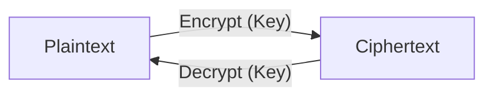

### Symmetric vs Asymmetric Encryption

| Symmetric Encryption         | Asymmetric Encryption              |
|-----------------------------|------------------------------------|
| Single key (shared)         | Key pair: Public + Private         |
| Fast, efficient              | Slower, but more secure for key exchange |
| Used for large data         | Used for identity, digital signatures, key exchange |
| Challenge: secure key sharing | Challenge: computational overhead  |

**Example: Using Python's `cryptography` library for symmetric encryption**
```python
from cryptography.fernet import Fernet

# Generate a key
key = Fernet.generate_key()
cipher = Fernet(key)

# Encrypt
plaintext = b'secret data'
ciphertext = cipher.encrypt(plaintext)

# Decrypt
decrypted = cipher.decrypt(ciphertext)
assert decrypted == plaintext
```

**TLS Handshake Example (Simplified):**
1. **Client Hello:** Client proposes cipher suites.
2. **Server Hello:** Server selects cipher suite, sends certificate (with public key).
3. **Key Exchange:** Client encrypts a random symmetric key with server’s public key.
4. **Secure Session:** Both use the symmetric key for fast, secure data transfer.

---

## Encryption Data at Rest & Data in Transit

| Encryption at Rest                            | Encryption in Transit             |
|-----------------------------------------------|-----------------------------------|
| Protects stored data (disks, DBs, backups)    | Protects data moving across network|
| Techniques: Full-disk, field-level encryption | Techniques: TLS/SSL (HTTPS)       |
| Use Cases: Cloud storage, user files, logs    | Use Cases: APIs, login sessions   |

**Diagram: Data Protection Coverage**
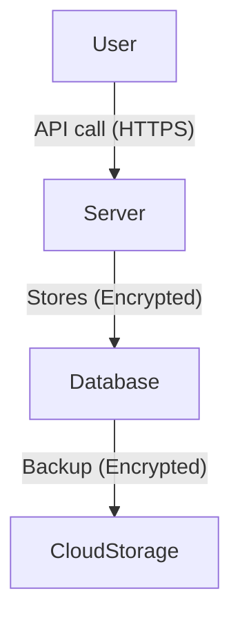


---

## **Symmetric vs. Asymmetric Encryption**

### **Symmetric Encryption**

* Uses **one key** for both encryption and decryption.
* **Fast** and efficient — ideal for encrypting **large amounts of data**.
* Example algorithms: **AES**, **DES**, **Blowfish**.

---

### **Asymmetric Encryption**

* Uses a **key pair** — one **public key** (for encryption) and one **private key** (for decryption).
* Enables **secure key exchange** and **digital signatures**.
* Example algorithms: **RSA**, **ECC**, **Diffie-Hellman**.

---

### **Combined Usage**

* Often used **together**, e.g., in **TLS handshakes**:

  * Asymmetric encryption secures key exchange.
  * Symmetric encryption is then used for data transmission.

---
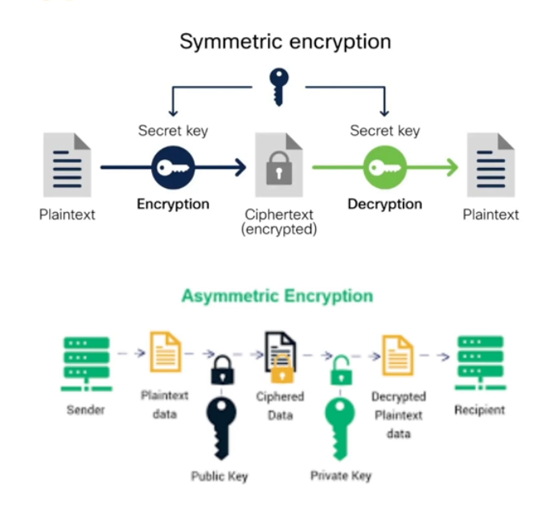


---

## **TLS/SSL and HTTPS**

* **HTTPS = HTTP over TLS**

  > Adds a secure encryption layer (TLS) on top of HTTP for secure communication.
  > TLS stands for Transport Layer Security
  > Secure Sockets Layer (SSL)

* **Ensures confidentiality, integrity, and authenticity**

  > Protects data from being read, altered, or spoofed during transmission.

* **TLS Handshake: key exchange + cipher negotiation**

  > Establishes a secure session by exchanging encryption keys and agreeing on cipher methods.


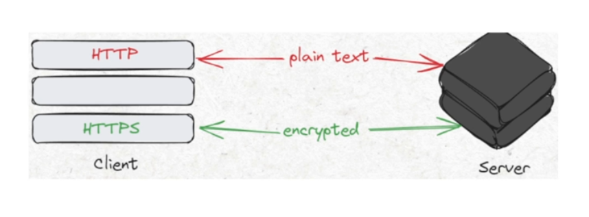
---


## Hashing & Salting: Secure Password Storage

### **🔐 Hashing**

> Hashing is the process of converting input data (e.g., a password) into a fixed-length string using a mathematical algorithm.
> It is a **one-way** operation — you cannot retrieve the original data from the hash.

#### **✅ Pros**

* **Irreversible:** Protects original data even if hashes are leaked.
* **Efficient:** Quick to compute and compare during authentication.
* **Fixed output size:** Consistent length regardless of input size.
* **Good for integrity checks:** Detects if data has been tampered with.

#### **⚠️ Cons**

* **Vulnerable to rainbow table attacks:** Precomputed hash databases can reveal common passwords.
* **Identical inputs = identical hashes:** Enables pattern recognition if no extra protection (like salting) is used.

---

### **🧂 Salting**

> Salting involves adding a **unique random value (salt)** to each password **before hashing**.
> This ensures even identical passwords produce **different hashes**.

#### **✅ Pros**

* **Prevents rainbow table attacks:** Each password hash is unique.
* **Increases security:** Makes brute-force attacks more difficult.
* **Protects common passwords:** “123456” will not have the same hash for every user.

#### **⚠️ Cons**

* **Requires storage for salts:** Each salt must be stored securely with the hash.
* **Adds computational overhead:** Slightly increases the time for hashing and verification.
* **Not encryption:** It doesn’t allow password recovery — only verification.

---

### **🧩 Common Secure Hash Algorithms**

* **SHA-256**, **SHA-512**, **bcrypt**, **scrypt**, **Argon2** (preferred for password storage).

---

### **💡 Summary**

| Technique   | Purpose                       | Reversible | Security Level | Example Use               |
| ----------- | ----------------------------- | ---------- | -------------- | ------------------------- |
| **Hashing** | Converts data into fixed hash | ❌ No       | Moderate       | Data integrity, checksums |
| **Salting** | Adds randomness to hashes     | ❌ No       | High           | Password storage          |

---


**Hashing Example (with Salt):**
```python
import bcrypt

password = b"supersecret"
# Generate salt and hash
hashed = bcrypt.hashpw(password, bcrypt.gensalt())

# To verify:
bcrypt.checkpw(password, hashed)  # Returns True
```


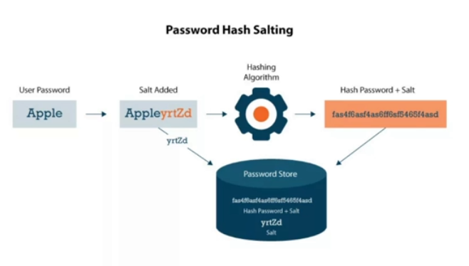
---

## 🔑 Public Key Infrastructure (PKI) & Digital Certificates

PKI is the backbone of secure communication on the internet.

### **What is PKI?**

> **Public Key Infrastructure (PKI)** is a framework that manages **digital certificates** and **public-key encryption** to enable secure communication, authentication, and data integrity over untrusted networks.

PKI provides the foundation for **HTTPS**, **digital signatures**, **email encryption**, and **secure user/device authentication**.

---

### **🧩 Key Components**

* **Certificate Authority (CA):** Issues and verifies digital certificates.
* **Registration Authority (RA):** Verifies identities before certificate issuance.
* **Public/Private Key Pair:** Used for encryption and decryption or signing and verification.
* **Digital Certificates:** Bind public keys to verified identities.
* **Certificate Revocation List (CRL):** Tracks invalid or compromised certificates.

---

### **✅ Pros of PKI**

* **Strong Security:** Enables encryption, authentication, and data integrity.
* **Scalability:** Supports secure communication across large distributed systems.
* **Trust Framework:** Certificates issued by trusted authorities enhance reliability.
* **Non-repudiation:** Digital signatures prove the origin and authenticity of data.
* **Automation Support:** Modern systems allow automated certificate renewal and management.

---

### **⚠️ Cons of PKI**

* **Complex Setup and Management:** Requires proper configuration, key rotation, and certificate lifecycle management.
* **High Cost:** Involves infrastructure, licensing, and operational expenses.
* **Single Point of Trust:** Compromise of a Certificate Authority (CA) can impact many users.
* **Revocation Challenges:** Certificate revocation lists or OCSP responses may be slow or unavailable.
* **User Mismanagement:** Improper key handling (e.g., lost private keys) can compromise security.

---

### **💡 Common Use Cases**

* **HTTPS (SSL/TLS):** Secure web communication.
* **Email Encryption:** Protects message content (S/MIME).
* **Code Signing:** Verifies authenticity of software.
* **VPNs and Zero Trust Networks:** Ensures secure device and user access.

---

### **🔐 Summary Table**

| Aspect              | Description                                                     |
| ------------------- | --------------------------------------------------------------- |
| **Purpose**         | Enable secure communication through encryption and certificates |
| **Core Mechanism**  | Public/Private key pairs + Certificate Authorities              |
| **Main Strengths**  | Authentication, encryption, non-repudiation                     |
| **Main Weaknesses** | Complexity, cost, and dependency on CA trust                    |

---

**Certificate Chain Diagram:**
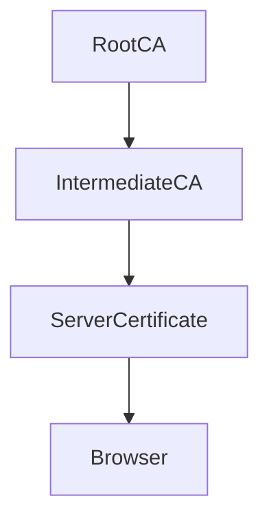
- **Digital Signatures:** Ensure authenticity and integrity of data.

---


## **🔐 Secure API Communication**

### **What It Means**

> **Secure API communication** ensures that data exchanged between clients and servers is protected from unauthorized access, tampering, and misuse.
> It involves **encryption**, **authentication**, **authorization**, and **integrity verification** across API endpoints.

---

### **🧩 Key Techniques**

* **HTTPS (TLS):** Encrypts data in transit between client and server.
* **API Keys:** Identify and authenticate API consumers.
* **OAuth 2.0 / OpenID Connect:** Provide secure delegated authorization.
* **JWT (JSON Web Tokens):** Enable stateless authentication and authorization.
* **HMAC (Hash-based Message Authentication Code):** Ensures message integrity and authenticity.
* **Rate Limiting & Throttling:** Prevent abuse or denial-of-service attacks.
* **Input Validation:** Protects against injection and data corruption attacks.

---

### **✅ Pros**

* **Data Confidentiality:** Prevents sensitive data exposure via encryption (TLS).
* **Data Integrity:** Guarantees that data isn't altered during transmission.
* **Authentication & Authorization:** Ensures only trusted clients access APIs.
* **Scalability:** Secure frameworks (OAuth, JWT) scale well for microservices and third-party integrations.
* **User Trust:** Builds credibility by protecting user data and complying with standards like GDPR, HIPAA, etc.

---

### **⚠️ Cons**

* **Added Complexity:** Security layers (OAuth, JWT) increase setup and management overhead.
* **Performance Overhead:** Encryption/decryption and token verification can slow down high-traffic systems.
* **Key Management Risks:** API keys, tokens, and secrets must be stored and rotated securely.
* **Misconfiguration Risks:** Poor implementation (e.g., weak tokens or exposed endpoints) can negate security benefits.
* **Maintenance Burden:** Frequent updates, audits, and policy enforcement are needed to maintain strong security posture.

---

### **💡 Best Practices**

* Always use **HTTPS** (disable plain HTTP).
* Implement **strong authentication** (OAuth 2.0, API keys, or mutual TLS).
* Apply **rate limiting**, **monitoring**, and **logging**.
* Rotate and expire **tokens/keys** regularly.
* Use **WAFs (Web Application Firewalls)** to filter malicious traffic.

---

### **🔁 Summary Table**

| Aspect          | Pros                                         | Cons                                     |
| --------------- | -------------------------------------------- | ---------------------------------------- |
| **Security**    | Strong encryption, integrity, authentication | Complex configuration, key mismanagement |
| **Performance** | Protects critical data efficiently           | Adds latency from TLS and token checks   |
| **Scalability** | Works across distributed APIs                | Requires robust infrastructure           |
| **Compliance**  | Meets standards like GDPR, HIPAA             | Needs regular audits and updates         |

**JWT Example (Python, using PyJWT):**
```python
import jwt
SECRET = 'your-secret-key'

# Encode
token = jwt.encode({'user': 'alice'}, SECRET, algorithm='HS256')

# Decode/verify
payload = jwt.decode(token, SECRET, algorithms=['HS256'])
```
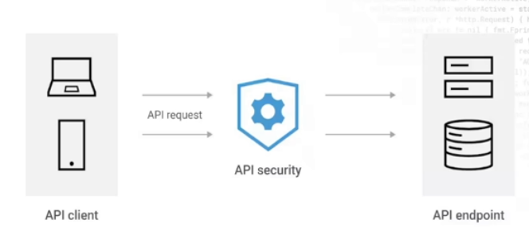
---

## Tips & Tricks

- **Encrypt everywhere:** Both at rest and in transit—never skip one!
- **Hash, don’t encrypt, passwords:** And always salt them.
- **Rotate keys regularly:** Old keys are a liability.
- **Automate certificate renewal:** Use tools like [Let's Encrypt](https://letsencrypt.org/) with auto-renewal.
- **Enable logging and monitoring:** Know when and where breaches or anomalies happen.
- **Harden your APIs:** Use rate limiting, IP filtering, input validation, and strong authentication.
- **Trust but verify:** Use mTLS, certificate pinning, and threat modeling to understand your attack surface.

---

## Summary Table: Cheat Sheet

| Concept            | What to Use/Do                       | Why                        |
|--------------------|--------------------------------------|----------------------------|
| Data at Rest       | Full-disk, DB encryption             | Protects stored data       |
| Data in Transit    | TLS/SSL, HTTPS                       | Prevents eavesdropping     |
| Passwords          | Hash + Salt (bcrypt, Argon2)         | Not reversible, secure     |
| Communication Auth | PKI, CA-signed certificates          | Verifies identity          |
| APIs               | HTTPS, JWT/OAuth2, rate limiting     | Secure, prevent abuse      |
| Certificate Mgmt   | Automate renewal, use strong CAs     | Avoid expired/weak certs   |

---

## Interview Questions To Practice

- What is the difference between hashing and encryption?
- Why is asymmetric encryption slower than symmetric?
- How does PKI build trust online?
- How would you secure data at rest and in motion?
- How do you protect APIs from abuse and unauthorized access?

---

## Conclusion

Data protection and secure communication aren’t just checkboxes—they’re fundamental to reliable, trustworthy, and compliant system design. By **encrypting at every layer**, **using robust authentication**, **hashing passwords**, and **securing your APIs**, you build the foundation for a resilient distributed system.

**Next up:** Dive into network and infrastructure security—covering firewalls, VPCs, VPNs, and more!

---

*Stay safe. Encrypt everything. Design for trust.*

# Section 4

# Network and Infrastructure Security in System Design

*Mastering system security for distributed, cloud-native, and modern applications.*

---

Security is **not optional**—it's the backbone of reliable, trustworthy, and resilient systems. This blog dives deep into **Network and Infrastructure Security**, integrating insights from both lecture-style explanations and concise slide content, with practical examples, code snippets, diagrams, and actionable tips.

---

## Table of Contents

1. [Why Network Security Matters](#why-network-security-matters)
2. [Core Principles: The CIA Triad](#core-principles-the-cia-triad)
3. [Common Threats & Attack Vectors](#common-threats--attack-vectors)
4. [Key Security Components](#key-security-components)
    - [Firewalls](#firewalls)
    - [Reverse Proxies](#reverse-proxies)
    - [API Protection: Rate Limiting, Throttling, IP Filtering](#api-protection-rate-limiting-throttling-ip-filtering)
5. [Network Segmentation & Isolation](#network-segmentation--isolation)
6. [Zero Trust Security Model](#zero-trust-security-model)
7. [Securing Cloud Environments](#securing-cloud-environments)
8. [Serverless & Container Security](#serverless--container-security)
9. [Security in Microservices](#security-in-microservices)
10. [Common Vulnerabilities: OWASP Top 10](#common-vulnerabilities-owasp-top-10)
11. [Summary Best Practices](#summary-best-practices)
12. [Tips and Tricks](#tips-and-tricks)

---

## Why Network Security Matters

- **External Threats:** DDoS, intrusion attempts, IP spoofing, etc.
- **Internal Risks:** Misconfiguration, lateral movement after a breach.
- **Cloud-Native Expansion:** More exposure, new attack surfaces.
- **Business Impact:** Reliability, uptime, user trust, and data protection.

> **Security is fundamental to reliability and user trust.**

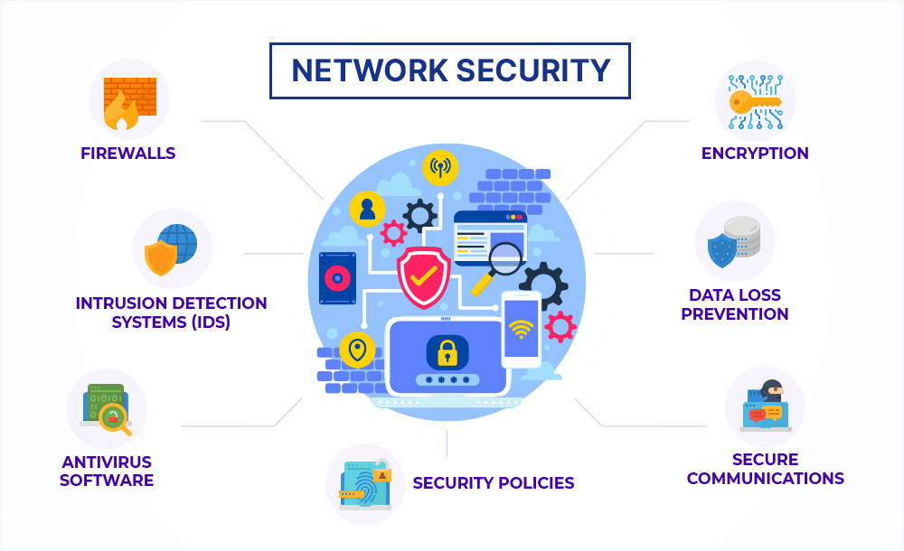

[Soucre](https://www.extnoc.com/learn/computer-security/network-security) 

---

## Core Principles: The CIA Triad

| Principle        | Description                                 |
|------------------|---------------------------------------------|
| **Confidentiality** | Prevent unauthorized access to data       |
| **Integrity**        | Prevent tampering or modification        |
| **Availability**     | Ensure uptime and accessibility          |

**Diagram: CIA Triad**

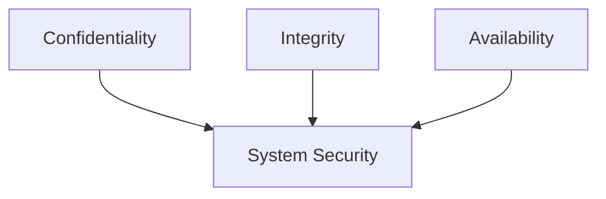

---

## Common Threats & Attack Vectors

- **DDoS:** Flood system to cause downtime.
- **Man-in-the-Middle:** Intercept and alter traffic.
- **Injection Attacks:** Malicious input (e.g., SQL Injection).
- **Spoofing:** IP, DNS, email impersonation.
- **Misconfiguration:** Open ports, default creds.
- **Insecure APIs:** Exposed endpoints.

**Slide Recap:**
- Emphasize secure APIs, input validation, firewalls, and least privilege.

---

## Key Security Components

### Firewalls

**Purpose:** Filter traffic based on IP, port, protocol.

- **Types:**
    - **Network-based:** Protects entry points (e.g., perimeter gateway).
    - **Host-based:** Secures individual servers/devices.
    - **Cloud Firewalls:** Tailored for cloud resources (e.g., AWS Security Groups).

**Example: AWS Security Group (Firewall) Rule**

```hcl
# Terraform example
resource "aws_security_group" "web_sg" {
  name        = "web_sg"
  description = "Allow HTTP and HTTPS"

  ingress {
    from_port   = 80
    to_port     = 80
    protocol    = "tcp"
    cidr_blocks = ["0.0.0.0/0"]
  }
  ingress {
    from_port   = 443
    to_port     = 443
    protocol    = "tcp"
    cidr_blocks = ["0.0.0.0/0"]
  }
  egress {
    from_port   = 0
    to_port     = 0
    protocol    = "-1"
    cidr_blocks = ["0.0.0.0/0"]
  }
}
```

---

### Reverse Proxies

**Purpose:** Route incoming requests, mask backend identities, add security layers (e.g., SSL termination, load balancing).

**Popular Tools:** NGINX, AWS ALB, HAProxy.

**Basic NGINX Reverse Proxy Example:**

```nginx
server {
    listen 80;
    server_name example.com;

    location / {
        proxy_pass http://backend-service:8080;
        proxy_set_header Host $host;
        proxy_set_header X-Real-IP $remote_addr;
    }
}
```

**Diagram: Reverse Proxy**

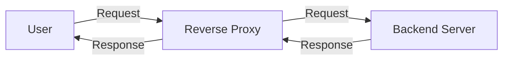
---

## **🧱 Firewall vs 🌀 Reverse Proxy**

### **🔐 1. Firewall**

> A **firewall** is a **security barrier** that filters **incoming and outgoing network traffic** based on defined security rules.
> It protects internal systems from unauthorized access and malicious traffic.

#### **✅ Pros**

* Blocks **unauthorized traffic** and prevents **network-level attacks**.
* Can enforce policies based on **IP, port, protocol, and packet state**.
* Helps prevent **malware**, **DDoS**, and **brute-force** attacks.
* Supports **network segmentation** (e.g., DMZ separation).

#### **⚠️ Cons**

* Can’t inspect **application-level payloads** deeply (unless it’s an NGFW).
* Needs **constant rule updates** and fine-tuning.
* Doesn’t provide **caching or load balancing** for apps.

---

### **🌀 2. Reverse Proxy**

> A **reverse proxy** sits in front of web servers and acts as an **intermediary** for client requests.
> It forwards requests to backend servers, often adding caching, SSL termination, and load balancing.

#### **✅ Pros**

* **Hides internal server identities** (adds anonymity and security).
* **Load balancing** — distributes traffic across multiple backend servers.
* **SSL/TLS termination** — offloads encryption work from servers.
* **Caching** — speeds up responses for repeated requests.
* Can integrate **WAF** and **authentication** features.

#### **⚠️ Cons**

* Adds **complexity** to the network architecture.
* A **single point of failure** if not designed redundantly.
* Slight **latency** due to processing overhead.
* If misconfigured, can expose internal systems.

---

### **🧩 3. Comparison Table**

| Feature             | **Firewall**                                   | **Reverse Proxy**                                   |
| ------------------- | ---------------------------------------------- | --------------------------------------------------- |
| **Primary Purpose** | Block unauthorized network traffic             | Handle and manage web traffic to backend servers    |
| **OSI Layer**       | Network (Layer 3/4)                            | Application (Layer 7)                               |
| **Direction**       | Controls traffic *into and out of* the network | Handles traffic *into* web servers                  |
| **Security Role**   | Network perimeter defense                      | Application-level protection and traffic management |
| **Functions**       | Filtering, monitoring, blocking                | Load balancing, SSL termination, caching, routing   |
| **Visibility**      | Sees IPs, ports, and protocols                 | Sees HTTP/HTTPS requests and responses              |
| **Example Tools**   | pfSense, Cisco ASA, Fortinet                   | Nginx, HAProxy, Apache HTTPD, Cloudflare            |

---

### **🧠 Summary**

> 🔸 **Firewalls** protect the **network layer** by filtering malicious or unwanted connections.
> 🔸 **Reverse proxies** protect the **application layer** by managing, optimizing, and securing HTTP traffic.

Both are **complementary** — in modern architectures, they’re often used **together**:

* **Firewall** filters traffic at the perimeter.
* **Reverse Proxy** handles traffic routing and application security behind it.

---

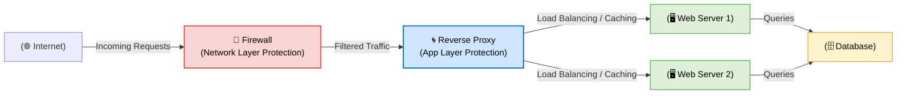
---

### API Protection: Rate Limiting, Throttling, IP Filtering

Here’s a complete, structured **Markdown summary** on **Rate Limiting, Throttling, and IP Filtering** — including definitions, use cases, and pros/cons 👇

---

## **⚙️ API Traffic Control Techniques**

These mechanisms help protect systems and APIs from **abuse, overload, and malicious activity**, ensuring **availability**, **fair usage**, and **security**.

---

### **🚦 1. Rate Limiting**

> **Rate limiting** controls how many requests a client (IP, user, or API key) can make within a specified time period.

#### **💡 Example**

* A user may make **100 requests per minute**.
* Exceeding this limit results in a **429 – Too Many Requests** response.

#### **✅ Pros**

* Prevents **DDoS attacks** and **API abuse**.
* Ensures **fair usage** among multiple clients.
* Helps manage **server load** efficiently.
* Protects against **brute-force login attempts**.

#### **⚠️ Cons**

* Can block legitimate bursts of activity.
* Adds **latency** if implemented at gateways.
* Requires proper tracking and state management.

#### **🧩 Common Tools**

* **Nginx**, **Kong Gateway**, **Cloudflare**, **AWS API Gateway**

---

### **⏳ 2. Throttling**

> **Throttling** slows down the rate of requests instead of blocking them.
> It’s a **softer version** of rate limiting — rather than rejecting excess requests, it **queues or delays** them.

#### **💡 Example**

* After 100 requests/min, additional requests are processed **slower** (e.g., 1 per second).

#### **✅ Pros**

* Prevents system overload gracefully.
* Improves **user experience** compared to hard blocking.
* Useful for **streaming** or **real-time systems** that can tolerate minor delays.

#### **⚠️ Cons**

* Adds **response latency**.
* More complex to implement than rate limiting.
* Might not fully protect against **massive spikes**.

#### **🧩 Use Cases**

* Payment gateways
* File uploads / video streaming
* Real-time APIs

---

### **🛡️ 3. IP Filtering**

> **IP filtering** allows or blocks traffic based on the **source IP address**.
> It acts as a **first layer of defense** at the **network or application level**.

#### **💡 Example**

* Only allow requests from specific corporate IPs (`192.168.0.0/24`).
* Block known malicious IPs or geographic regions.

#### **✅ Pros**

* Simple and effective for **basic access control**.
* Reduces **attack surface**.
* Works well with **firewalls**, **proxies**, and **load balancers**.

#### **⚠️ Cons**

* Ineffective against **spoofed IPs** or **botnets** using distributed IPs.
* **Static allowlists** need frequent updates.
* Not suitable for **mobile clients** or **cloud environments** with dynamic IPs.

#### **🧩 Typical Implementation**

* **Firewall rules** (e.g., AWS Security Groups, NACLs)
* **Reverse proxies** (e.g., Nginx, Cloudflare)
* **API Gateways** with IP-based policies

---

### **📊 Summary Table**

| Technique         | Purpose                                 | Behavior               | Pros                           | Cons                        |
| ----------------- | --------------------------------------- | ---------------------- | ------------------------------ | --------------------------- |
| **Rate Limiting** | Restrict total requests per time window | Blocks excess requests | Prevents abuse, DDoS           | May block legitimate spikes |
| **Throttling**    | Slow down excess requests               | Queues or delays       | Smooth handling, user-friendly | Adds latency                |
| **IP Filtering**  | Allow/block based on IPs                | Drops or denies        | Simple, low-cost security      | Hard to manage dynamic IPs  |

---

```mermaid
flowchart LR
    Client["💻 Client Application"]
    Gateway["🛡️ API Gateway"]
    IPFilter["🌐 IP Filtering<br/>(Allow/Deny based on IP)"]
    RateLimit["🚦 Rate Limiter<br/>(Limit requests per time window)"]
    Throttle["⏳ Throttler<br/>(Delay excess requests)"]
    Backend["(⚙️ Backend Service)"]
    Logs["(📜 Monitoring & Logs)"]

    Client -->|Request| Gateway
    Gateway --> IPFilter
    IPFilter -->|Allowed| RateLimit
    IPFilter -.->|Blocked IPs| Logs
    RateLimit -->|Within limit| Throttle
    RateLimit -.->|429 Too Many Requests| Logs
    Throttle -->|Processed| Backend
    Backend -->|Response| Client
    Backend --> Logs

    %% Styling
    style Client fill:#d9e1f2,stroke:#0070c0,stroke-width:1.5px,color:black;
    style Gateway fill:#e2f0d9,stroke:#70ad47,stroke-width:2px,color:black;
    style IPFilter fill:#fff2cc,stroke:#ffc000,stroke-width:2px,color:black;
    style RateLimit fill:#fce4d6,stroke:#e26b0a,stroke-width:2px,color:black;
    style Throttle fill:#ddebf7,stroke:#5b9bd5,stroke-width:2px,color:black;
    style Backend fill:#d5f5e3,stroke:#4CAF50,stroke-width:2px,color:black;
    style Logs fill:#f4cccc,stroke:#c00000,stroke-width:1.5px,color:black;

```


---

## Network Segmentation & Isolation

Nice — here’s a clean, copy-ready **Markdown** note on **Network Segmentation & Isolation**, with a short definition, benefits, techniques, pros/cons, implementation checklist, and a simple **Mermaid** diagram you can drop into your docs.

---

## **Network Segmentation & Isolation**

### **What it is**

**Network segmentation** is the practice of dividing a network into smaller logical or physical subnetworks (segments) to limit lateral movement, enforce granular security policies, and improve performance. **Isolation** means enforcing strict controls (often via firewalls or access control) so that one segment cannot freely access another.
<details>
<summary>🕵️‍♂️ Lateral Movement </summary>

  Definition

  Lateral Movement refers to the technique attackers use to move within a network after gaining initial access — typically moving from one compromised system to others, in search of sensitive data, credentials, or critical assets.

  In simple terms:

  Once hackers enter your network (say, via a phishing attack or vulnerable system), they don’t stop there — they move sideways (laterally) to explore, escalate privileges, and reach high-value targets.
</details>


---

### **Why it matters**

* Reduces blast radius when a system is compromised.
* Enforces least-privilege access between services.
* Improves performance and traffic management.
* Helps meet compliance and audit requirements (PCI, HIPAA, etc.).

---

### **Common segmentation patterns**

* **Perimeter (Internet) → DMZ → Application → Database**
* **VLAN-based segmentation** (L2 segmentation inside LANs)
* **Subnet + ACLs** (IP subnets with routing/access control lists)
* **Zone-based firewalling** (separate security zones)
* **Microsegmentation** (host-level segmentation using software agents, e.g., with service mesh, cloud security groups)
* **Zero Trust segmentation** (authenticate & authorize every connection, regardless of network location)

---

### **Techniques / Tools**

* **VLANs** (switch-level segmentation)
* **Subnets + routing** (logical segments)
* **Firewalls / NGFWs** (policy enforcement between segments)
* **Security groups / NACLs** (cloud-native segmentation)
* **VPNs and private links** (isolate management and inter-datacenter traffic)
* **Service mesh / sidecars** (mTLS, policies between microservices)
* **Host-based firewalls** (iptables, Windows Firewall)
* **Network access control (NAC)** and identity-aware proxies

---

### **Pros**

* Limits lateral movement and attack surface.
* Better compliance and auditability.
* Fine-grained policy control (who can talk to what).
* Can improve network performance (reduce broadcast domains, localize traffic).

### **Cons / Trade-offs**

* Increased management complexity (many rules to maintain).
* Misconfiguration risk (overly permissive rules or gaps).
* Potential for operational overhead (network changes require coordination).
* Can add latency if traffic must traverse multiple enforcement points.

---

### **Best practices**

* Start with a **clear segmentation plan**: categorize assets by sensitivity & function.
* Apply **least privilege**: default deny between segments; allow only required flows.
* Use **defense-in-depth**: combine perimeter controls, segment firewalls, and host controls.
* **Centralize policy management** (IaC for network/firewall rules).
* **Document** allowed flows and maintain an up-to-date network map.
* **Automate** audits and drift detection (CI/CD for network policies).
* **Use monitoring & IDS/IPS** per segment to detect suspicious lateral movement.
* Test via **chaos/attack simulations** and penetration testing.

---

### **Implementation checklist**

* [ ] Inventory assets and classify by sensitivity (prod, dev, management, public)
* [ ] Define required flows (source → dest: ports/protocols) and document them
* [ ] Design segments (DMZ, app, db, management, monitoring, CI/CD)
* [ ] Implement segmentation (VLANs/subnets, security groups, NGFW rules)
* [ ] Harden management plane (separate network + MFA for admin access)
* [ ] Deploy host-based protections & microsegmentation if required
* [ ] Configure logging & monitoring per segment (flow logs, IDS)
* [ ] Set up automated policy tests and regular audits
* [ ] Plan for incident response (how to quarantine a segment)

---

### **Simple architecture (Mermaid)**

Drop this into a Markdown file that supports Mermaid to visualize a typical segmented layout:

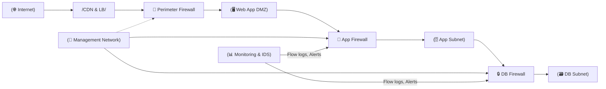

---

### **When to use microsegmentation**

* Highly dynamic, east-west traffic heavy environments (K8s, microservices).
* Environments with strict compliance or where host-level compromise risk is high.
* When you need policy tied to identity/service, not to network addresses.

---

### **Pitfalls to avoid**

* Over-segmentation causing operational headache.
* Relying on network segmentation alone (forget host-level controls).
* Not version-controlling network policies.
* Ignoring management plane isolation — admin interfaces must be segmented and protected.


---


## 🔒 **Zero Trust Security Model**

### **Definition**

> **Zero Trust Security** is a cybersecurity framework based on the principle:
> **“Never trust, always verify.”**

It assumes that **no user, device, or application** — whether inside or outside the network — should be automatically trusted.
Every access request must be **authenticated, authorized, and continuously validated** before granting or maintaining access to resources.

---

### 🧭 **Core Idea**

> The traditional perimeter-based security model is obsolete — threats can come from **inside** the network too.
> Zero Trust enforces **identity-based, context-aware** access control for every interaction.

---

## **🧩 Key Principles of Zero Trust**

| Principle                                    | Description                                                                                                          |
| -------------------------------------------- | -------------------------------------------------------------------------------------------------------------------- |
| **1. Verify Explicitly**                     | Always authenticate and authorize every request using **all available data** (identity, device, location, behavior). |
| **2. Least Privilege Access**                | Give users and applications **only the minimum required access** — nothing more.                                     |
| **3. Assume Breach**                         | Design systems as if they are already compromised. Continuously **monitor**, **inspect**, and **segment** traffic.   |
| **4. Microsegmentation**                     | Divide the network into isolated zones so that attackers cannot move laterally.                                      |
| **5. Continuous Monitoring**                 | Use real-time analytics and telemetry to **detect anomalies** and **re-evaluate trust** dynamically.                 |
| **6. Strong Identity and Device Management** | Use **MFA**, **SSO**, and device posture checks (e.g., OS version, security patches).                                |

---

### ⚙️ **How Zero Trust Works**

1. **User/Device requests access** → identity verified (via SSO/MFA).
2. **Policy Engine** evaluates context (who, what, where, how).
3. **Access granted** only to the specific resource, for a specific session.
4. **Session continuously monitored** for anomalies (behavioral analytics).
5. **Access revoked** if the session or device becomes non-compliant.

---

### 🏗️ **Zero Trust Architecture (ZTA)** Components

| Component                          | Function                                                                |
| ---------------------------------- | ----------------------------------------------------------------------- |
| **Identity Provider (IdP)**        | Authenticates users (e.g., Azure AD, Okta).                             |
| **Policy Engine**                  | Decides access based on identity, device, risk score, and context.      |
| **Policy Enforcement Point (PEP)** | Enforces decisions (e.g., reverse proxy, gateway, endpoint agent).      |
| **Telemetry & Analytics**          | Collects logs, detects anomalies, provides continuous trust evaluation. |
| **Microsegmented Network**         | Isolates systems and limits lateral movement.                           |

---

### ✅ **Advantages**

* Prevents unauthorized access — even if attackers breach the network.
* Reduces **lateral movement** and **insider threat impact**.
* Improves compliance (e.g., NIST SP 800-207, ISO 27001).
* Scales well across cloud, hybrid, and remote environments.
* Enhances visibility across all access points.

---

### ⚠️ **Challenges**

* Complex to implement in legacy networks.
* Requires **identity centralization** and **strong IAM policies**.
* Continuous monitoring can increase operational overhead.
* Needs integration across identity, network, endpoint, and application layers.

---

### 🧠 **Comparison: Traditional vs Zero Trust**

| Aspect          | Traditional Security         | Zero Trust Security               |
| --------------- | ---------------------------- | --------------------------------- |
| **Trust Model** | “Trust but verify”           | “Never trust, always verify”      |
| **Perimeter**   | Network boundary (firewall)  | Identity & device-centric         |
| **Access**      | Implicit once inside network | Explicit, per request/session     |
| **Focus**       | Keep outsiders out           | Protect resources everywhere      |
| **Visibility**  | Limited                      | Continuous monitoring & analytics |

---

### 🧱 **Zero Trust Architecture Diagram**

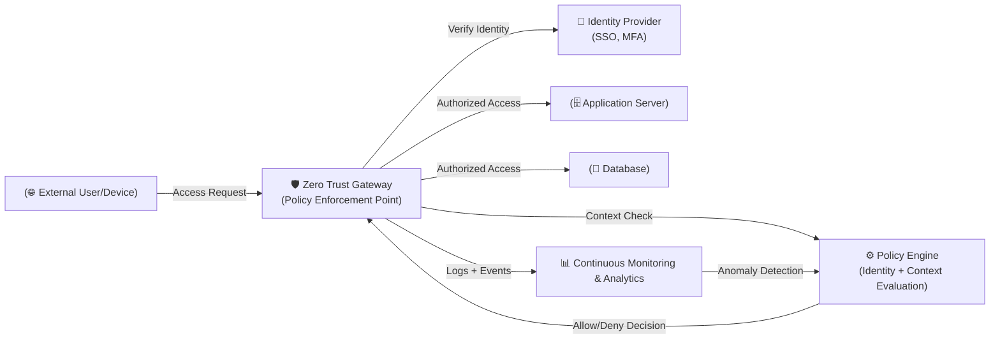

---

### 🧩 **Zero Trust in Practice**

* Use **SSO + MFA** for all users and admins.
* Enforce **device posture checks** before granting access.
* Apply **microsegmentation** at network and workload level.
* Implement **just-in-time (JIT)** privileged access.
* Integrate with **SIEM/SOAR** tools for active monitoring.
* Continuously **evaluate session risk** and revoke access dynamically.

---

### 💬 **Analogy**

> Think of Zero Trust like airport security —
> Every traveler (user/device) must show ID (authenticate), get screened (policy check),
> and can only enter specific gates (authorized resources).
> Even inside, behavior is continuously monitored.

---

### ✅ **Summary**

| Aspect             | Description                                    |
| ------------------ | ---------------------------------------------- |
| **Model Name**     | Zero Trust Security Model                      |
| **Core Principle** | Never trust, always verify                     |
| **Goal**           | Minimize breach impact and unauthorized access |
| **Key Enablers**   | MFA, IAM, microsegmentation, monitoring        |
| **Applicable To**  | Cloud, hybrid, on-prem, and remote systems     |

---


## ☁️ **Securing Cloud Environments**

### **1. Shared Responsibility Model**

> Security in the cloud is a **shared responsibility** between the **cloud provider** and the **customer**.

| Responsibility     | Description                                                                                            |
| ------------------ | ------------------------------------------------------------------------------------------------------ |
| **Cloud Provider** | Secures physical infrastructure, hardware, network, and foundational services (e.g., AWS, Azure, GCP). |
| **Customer**       | Secures data, identity, access, and configurations within the cloud environment.                       |

---

### **2. Key Cloud Security Practices**

| Practice                                         | Description                                                                                                                                |
| ------------------------------------------------ | ------------------------------------------------------------------------------------------------------------------------------------------ |
| **🔐 IAM (Identity & Access Management)**        | Enforce **role-based access control (RBAC)**, **least privilege**, and **multi-factor authentication (MFA)**.                              |
| **🧩 Encryption**                                | Encrypt **data at rest** (e.g., EBS, S3, Cloud Storage) and **data in transit** (via TLS/HTTPS).                                           |
| **📜 Audit Logging**                             | Enable detailed audit trails (e.g., **AWS CloudTrail**, **Azure Monitor**, **GCP Audit Logs**) to detect and investigate unusual activity. |
| **🛠️ CSPM (Cloud Security Posture Management)** | Continuously scan cloud resources for **misconfigurations**, **policy violations**, and **compliance gaps**.                               |

---

### **3. AWS IAM Policy Example**

```json
{
  "Version": "2012-10-17",
  "Statement": [
    {
      "Effect": "Allow",
      "Action": ["s3:GetObject"],
      "Resource": ["arn:aws:s3:::mybucket/*"]
    }
  ]
}
```

> ✅ This IAM policy grants **read-only access** to all objects in the S3 bucket `mybucket`.

---

### **4. Additional Cloud Security Best Practices**

* **Network Segmentation:** Use VPCs, subnets, and security groups to isolate workloads.
* **Zero Trust Principles:** Verify each access request — don’t assume trust inside your network.
* **Key Management:** Use managed services like **AWS KMS**, **Azure Key Vault**, or **GCP KMS** for secure key lifecycle management.
* **Monitoring & Alerting:** Use **SIEM tools** (e.g., AWS GuardDuty, Azure Sentinel) for threat detection.
* **Backup & Recovery:** Automate snapshots, versioning, and cross-region backups for disaster recovery.
* **Compliance Automation:** Use **CSPM** and **CIEM** (Cloud Infrastructure Entitlement Management) to maintain governance.

---

### **5. Summary**

| Aspect                      | Best Practice                            |
| --------------------------- | ---------------------------------------- |
| **Access Management**       | RBAC, least privilege, MFA               |
| **Data Protection**         | Encryption (in transit & at rest)        |
| **Visibility & Monitoring** | Logging, threat detection, and alerts    |
| **Configuration Security**  | CSPM & automated policy enforcement      |
| **Resilience**              | Regular backups, versioning, DR planning |


---

## 🛡️ **Serverless & Container Security**

Modern cloud-native applications often rely on **serverless functions** and **containers** — both demand unique security controls since traditional perimeter defenses don’t apply.

---

### ⚙️ **Serverless Security**

> Serverless functions (like AWS Lambda, Azure Functions, GCP Cloud Functions) abstract away infrastructure, but **security of the code and configurations** remains your responsibility.

| Practice                           | Description                                                                                                    |
| ---------------------------------- | -------------------------------------------------------------------------------------------------------------- |
| **🔐 IAM Roles (Least Privilege)** | Assign narrowly scoped IAM roles — each function should only access the resources it truly needs.              |
| **⏳ Timeouts & Execution Limits**  | Set strict runtime limits to prevent resource abuse or infinite loops.                                         |
| **🧱 API Gateway Security**        | Front serverless functions with **API Gateways** that enforce authentication, rate limiting, and IP filtering. |
| **🧮 Input Validation**            | Sanitize and validate inputs to prevent injection attacks.                                                     |
| **📜 Logging & Monitoring**        | Use services like **AWS CloudWatch Logs** or **Azure Monitor** for visibility and anomaly detection.           |
| **💣 Dependency Management**       | Regularly scan third-party libraries for vulnerabilities (e.g., via AWS CodeGuru or Snyk).                     |

---

### 🐳 **Container Security**

> Containers (like Docker and Kubernetes workloads) package apps with dependencies — but they share the host kernel, requiring **strong isolation and image hygiene**.

| Practice                             | Description                                                                                       |
| ------------------------------------ | ------------------------------------------------------------------------------------------------- |
| **🔍 Image Scanning**                | Scan container images using tools like **Trivy**, **Clair**, or **Anchore** to detect known CVEs. |
| **🚫 Run as Non-Root**               | Prevent privilege escalation by running containers under non-root users.                          |
| **🔒 Limit Privileges**              | Use minimal capabilities (`--cap-drop=ALL`) and read-only file systems.                           |
| **🌐 Network Policies (Kubernetes)** | Use **NetworkPolicies** to restrict pod-to-pod communication and block lateral movement.          |
| **📦 Image Signing**                 | Use **Notary** or **Cosign** to verify image authenticity before deployment.                      |
| **🛠️ Runtime Protection**           | Employ tools like **Falco** or **AppArmor** to detect abnormal container activity.                |
| **🔄 Patch & Update**                | Regularly rebuild and update images with the latest OS and library patches.                       |

---

### 🔁 **Summary Table**

| Area           | Key Security Measures                                                   | Tools/Services                                                                        |
| -------------- | ----------------------------------------------------------------------- | ------------------------------------------------------------------------------------- |
| **Serverless** | IAM least privilege, input validation, API Gateway protection           | AWS Lambda + CloudWatch, Azure Functions + Defender, GCP Functions + Security Scanner |
| **Containers** | Image scanning, non-root execution, network policies, runtime hardening | Trivy, Clair, Falco, AppArmor, Kubernetes NetworkPolicies                             |

---

### 🧠 **Best Practices Across Both**

* Adopt the **Principle of Least Privilege** everywhere.
* Automate security checks in **CI/CD pipelines**.
* Use **Infrastructure as Code (IaC)** scanning tools (e.g., Checkov, tfsec).
* Continuously **monitor logs and metrics** for anomalies.
* Rotate and securely store **secrets** using KMS or Vault.


---

## 🧩 **Security in Microservices**

Modern applications often use a **microservices architecture**, where multiple independent services communicate over APIs.
Because of this distributed nature, **network-based trust isn’t enough** — each service must be **securely authenticated, authorized, and monitored**.

---

### **1. Service-to-Service Authentication**

> Each microservice must verify the identity of the other before sharing data.

* Use **JWT (JSON Web Tokens)** for stateless authentication and authorization.
* Use **Mutual TLS (mTLS)** to authenticate both client and server using digital certificates.
* Rotate tokens and certificates regularly to reduce exposure.
* Store secrets securely (e.g., in **AWS Secrets Manager**, **HashiCorp Vault**).

✅ *Example:*
Service A → includes JWT in request → Service B verifies signature and claims.

---

### **2. API Gateway**

> Acts as a **central entry point** for all external traffic into your microservices.

* Enforces **authentication**, **authorization**, and **input validation**.
* Implements **rate limiting**, **IP filtering**, and **request logging**.
* Hides internal services from external exposure (adds a protective abstraction layer).
* Integrates with **IAM** or **OAuth 2.0** providers for user identity management.

✅ *Example:*
API Gateway verifies OAuth token before routing request to internal services.

---

### **3. Service Mesh**

> A **service mesh** (like **Istio**, **Linkerd**, or **Consul**) adds security, observability, and traffic management between microservices without changing application code.

* Provides **fine-grained traffic policies** and **mTLS encryption** for all inter-service communication.
* Implements **zero-trust** principles inside the cluster — every connection is verified.
* Enables **access control**, **telemetry**, and **automatic certificate rotation**.
* Offloads network security from developers — handled by **sidecar proxies** (e.g., Envoy).

✅ *Example:*
Service A ↔ Service B communication is automatically encrypted and authenticated by the service mesh.

---

### **🧠 Summary Table**

| Layer                       | Security Focus                         | Techniques / Tools                   |
| --------------------------- | -------------------------------------- | ------------------------------------ |
| **Edge (External)**         | Secure user access                     | API Gateway, OAuth 2.0, WAF          |
| **Service-to-Service**      | Authenticate internal requests         | JWT, mTLS, Service Accounts          |
| **Intra-Service (Network)** | Encrypted and controlled communication | Service Mesh (Istio, Linkerd)        |
| **Secrets Management**      | Protect credentials and tokens         | HashiCorp Vault, AWS Secrets Manager |
| **Monitoring & Auditing**   | Detect abnormal behavior               | Prometheus, OpenTelemetry, SIEM      |

---

### **🔐 Secure Microservices Architecture (Mermaid Diagram)**

```mermaid
flowchart LR
    User[(👤 User)]
    APIGW[🛡️ API Gateway<br/>(Auth, Rate Limit, Validation)]
    SvcA[(🧩 Service A)]
    SvcB[(🧩 Service B)]
    SvcC[(🧩 Service C)]
    Mesh[🔄 Service Mesh<br/>(mTLS, Policy, Observability)]
    Vault[🔑 Secrets Manager]
    Monitor[📊 Monitoring & Logging]

    User -->|Authenticated Request| APIGW
    APIGW -->|JWT / OAuth Token| SvcA
    SvcA -->|mTLS + Policy| SvcB
    SvcB -->|mTLS + Policy| SvcC
    SvcA -.-> Vault
    SvcB -.-> Vault
    SvcC -.-> Vault
    Mesh --> SvcA
    Mesh --> SvcB
    Mesh --> SvcC
    SvcA --> Monitor
    SvcB --> Monitor
    SvcC --> Monitor

    %% Styling
    style APIGW fill:#d9ead3,stroke:#6aa84f,stroke-width:2px,color:black;
    style Mesh fill:#d0e6ff,stroke:#1155cc,stroke-width:2px,color:black;
    style Vault fill:#fff2cc,stroke:#e69138,stroke-width:2px,color:black;
    style Monitor fill:#f4cccc,stroke:#cc0000,stroke-width:2px,color:black;
    style SvcA fill:#ddebf7,stroke:#5b9bd5,stroke-width:1.5px,color:black;
    style SvcB fill:#ddebf7,stroke:#5b9bd5,stroke-width:1.5px,color:black;
    style SvcC fill:#ddebf7,stroke:#5b9bd5,stroke-width:1.5px,color:black;
```

---

### **📋 Key Takeaways**

* Apply **Zero Trust**: authenticate and encrypt *every* service call.
* Use **API Gateways** for edge protection, and **Service Meshes** for internal trust.
* Automate **certificate and token management**.
* Continuously **monitor, log, and analyze** inter-service communication.


---

## Common Vulnerabilities: OWASP Top 10

- **Injection:** SQL, NoSQL, OS command injection.
- **Broken Authentication:** Weak or no authentication.
- **Sensitive Data Exposure:** Unencrypted data.
- **Security Misconfiguration:** Default creds, open ports.
- **XSS, CSRF, SSRF:** Client-side and server-side threats.

**Mitigation:**
- Input validation.
- Secure authentication.
- Encrypt sensitive data.
- Harden configuration.

---

## Summary Best Practices

- Use **firewalls** and **network segmentation**.
- Apply **rate limiting**, **IP filtering**, **reverse proxies**.
- Embrace **Zero Trust**; **encrypt everywhere**.
- Secure APIs, services, containers, and serverless functions.
- Stay vigilant about **OWASP Top 10** vulnerabilities.

---

## Tips and Tricks

1. **Automate Security Checks:** Integrate security tests and vulnerability scans into CI/CD pipelines.
2. **Principle of Least Privilege:** Always default to minimal permissions—expand only as needed.
3. **Rotate Keys and Secrets:** Use secret managers (AWS Secrets Manager, Vault) and automate rotation.
4. **Monitor and Alert:** Set up real-time monitoring and alerting for suspicious activity.
5. **Patch Early, Patch Often:** Stay on top of OS, library, and container image updates.
6. **Log Everything (Securely):** Centralize logs and protect them with encryption.
7. **Embrace CSPM:** Use tools to continuously assess your cloud security posture.
8. **Practice Incident Response:** Regularly test your recovery and incident response plans.
9. **Educate Your Team:** Security awareness is everyone’s job—train developers and ops.
10. **Review Regularly:** Security is an ongoing process, not a one-time setup.

---

## Conclusion

Network and infrastructure security is multifaceted—spanning firewalls, segmentation, zero trust, cloud, serverless, containers, and more. By systematically applying these principles and staying updated with best practices, you can build distributed systems that are robust, reliable, and ready for modern threats.

---

> **Next Up:** Deep dive into authentication & authorization, and designing secure distributed systems!

---

**References:**
- [OWASP Top 10](https://owasp.org/www-project-top-ten/)
- [NIST Cybersecurity Framework](https://www.nist.gov/cyberframework)
- [AWS Security Best Practices](https://aws.amazon.com/architecture/security-identity-compliance/)

---

*Feel free to share your questions or scenarios in the comments!*

# Section 5

Certainly! Here is a detailed Markdown blog section, integrating both your transcript and slides, complete with explanations, code snippets, diagrams (ASCII), and a “Tips & Tricks” section.

---

# Security in System Design: Principles, Threats, and Best Practices

Security sits at the heart of robust system design, especially in today's distributed and cloud-native architectures. In this section, we’ll synthesize core concepts, practical approaches, and actionable strategies for designing secure systems—integrating foundations, real-world threats, authentication, data protection, network security, and more.

---

## 1. Why Security Matters

Security is a **non-functional requirement** that underpins user trust, regulatory compliance, and the reliability of any distributed system.

- **User Trust:** Data breaches erode customer confidence (e.g., Equifax, Facebook).
- **Reliability:** Attacks can cripple system availability.
- **Compliance:** Laws like GDPR or HIPAA mandate strong data protection.

---

## 2. Core Principles: The CIA Triad

Security in system design is grounded in the **CIA Triad**:

| Principle        | Definition                          | Example                                         |
|------------------|-------------------------------------|-------------------------------------------------|
| Confidentiality  | Prevent unauthorized data access    | Encrypt user data at rest and in transit         |
| Integrity        | Prevent unauthorized data changes   | Use digital signatures, checksums, versioning    |
| Availability     | Ensure data/systems are accessible  | DDoS protection, redundancy, failover            |


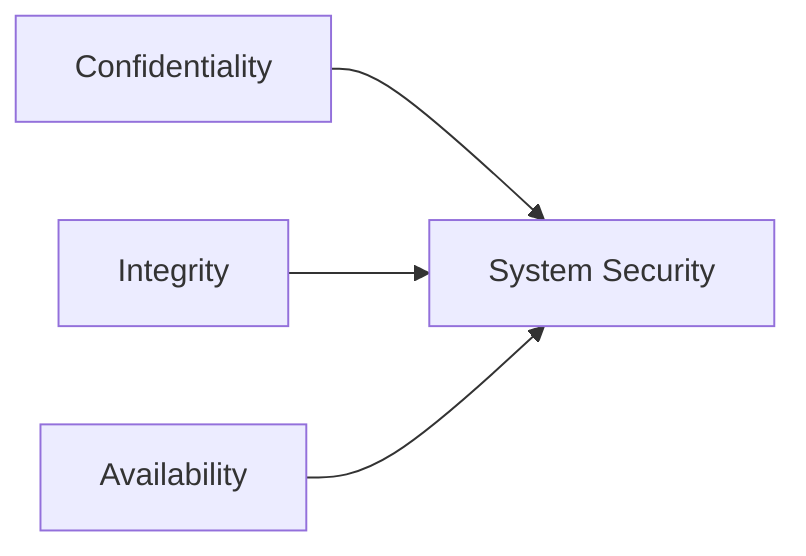

---

## 3. Threat Landscape & Attack Vectors

Distributed systems expose more surfaces to attackers. Common threats include:

- **DDoS:** Overwhelming services to reduce uptime.
- **Man-in-the-Middle (MITM):** Eavesdropping or tampering with traffic.
- **Injection (SQL, XSS):** Injecting malicious code via inputs.
- **Spoofing:** Impersonating users, IPs, or services.

**Threat Modeling** is essential—define what you’re defending, from whom, and how.

> **STRIDE Model:** Spoofing, Tampering, Repudiation, Information Disclosure, Denial of Service, Elevation of Privilege

**ASCII Diagram: Attack Surface**
```
   +------------+      +-------------+      +-------------+
   |  Internet  |----->|   Firewall  |----->| Web Service |
   +------------+      +------+------+      +------+------+  
                                 |                 |
                                 v                 v
                         [Database]       [Internal APIs]
```
Attackers probe every interface—APIs, open ports, misconfigured servers.

---

## 4. Authentication & Authorization

### Authentication

**Who are you?**  
Common methods:
- **Basic Auth:** Username/password (not recommended alone)
- **OAuth2:** Delegated access (e.g., login with Google)
- **OpenID Connect:** Identity layer on top of OAuth2
- **JWT (JSON Web Tokens):** Stateless, scalable tokens

**Sample JWT Validation (Node.js):**
```js
const jwt = require('jsonwebtoken');
function authenticate(req, res, next) {
  const token = req.header('Authorization').replace('Bearer ', '');
  try {
    const payload = jwt.verify(token, process.env.JWT_SECRET);
    req.user = payload;
    next();
  } catch (err) {
    res.status(401).json({error: 'Unauthorized'});
  }
}
```

### Authorization

**What can you do?**  
Models:
- **RBAC:** Role-Based (simple, scalable for most apps)
- **ABAC:** Attribute-Based (fine-grained, dynamic)
- **SSO & Federation:** Authenticate across services seamlessly

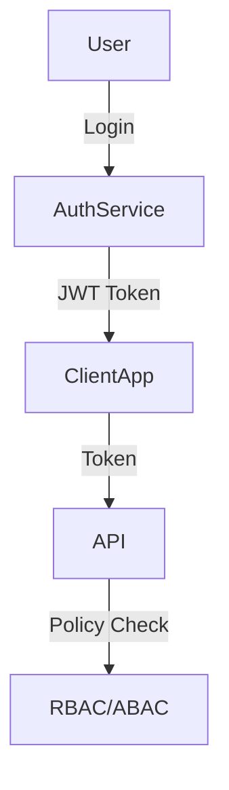

---

## 5. Data Protection & Secure Communication

### Encryption

- **At Rest:** Disk/database/file encryption (e.g., AES-256)
- **In Transit:** TLS/SSL for all HTTP(S) traffic

**Sample HTTPS (Express.js):**
```js
const https = require('https');
const fs = require('fs');
const app = require('./app');
const options = {
  key: fs.readFileSync('key.pem'),
  cert: fs.readFileSync('cert.pem')
};
https.createServer(options, app).listen(443);
```

### Hashing & Salting Passwords

- **Hash:** One-way transformation (bcrypt, Argon2)
- **Salt:** Random data added to prevent rainbow table attacks

**Sample Password Hashing (Python):**
```python
import bcrypt

password = b"supersecret"
salt = bcrypt.gensalt()
hashed = bcrypt.hashpw(password, salt)
# Store hashed in DB, never store raw password!
```

### Public Key Infrastructure (PKI)

- **Certificates:** Prove server identity
- **CA (Certificate Authority):** Signs and verifies certificates

---

## 6. Network & Infrastructure Security

### Firewalls & Reverse Proxies

- **Firewalls:** Block/allow based on IP, port, protocol
- **Reverse Proxies:** Shield backends, provide SSL termination (e.g., NGINX, AWS ALB)

**NGINX Reverse Proxy Example:**
```nginx
server {
    listen 443 ssl;
    server_name example.com;
    ssl_certificate /etc/ssl/cert.pem;
    ssl_certificate_key /etc/ssl/key.pem;

    location / {
        proxy_pass http://backend:8080;
    }
}
```

### Rate Limiting & Throttling

- **Prevent abuse:** Limit requests per user/IP
- **Graceful degradation:** Throttle heavy users

**ASCII Diagram: Rate Limiting**
```
[User]-->(API Gateway)--(Token Bucket)-->[Backend Service]
```

### Zero Trust Model

- **Principle:** "Never trust, always verify"
- **Every request authenticated and authorized**
- **Microservices:** Use mutual TLS, strict API gateways

### Cloud & Container Security

- **IAM:** Fine-grained permissions (least privilege)
- **Encryption:** For S3, EBS, RDS, etc.
- **Audit Logging:** Track every action (CloudTrail, Stackdriver)
- **Kubernetes:** Use OPA, network policies, runtime scanning (e.g., Falco)

---

## 7. Common Vulnerabilities (OWASP Top 10)

- **Injection**
- **Broken Authentication**
- **Sensitive Data Exposure**
- **Security Misconfiguration**
- **XSS, CSRF, SSRF**

Mitigation: Validate inputs, secure defaults, encrypt everywhere, strong auth.

---

## 8. Tips & Tricks

- **Shift Left:** Embed security early in SDLC (threat modeling, secure design)
- **Automate:** Linting, static analysis, dependency checks
- **Monitor:** Log everything, use SIEM tools for anomaly detection
- **Patch Regularly:** Keep dependencies up-to-date
- **Principle of Least Privilege:** Grant minimum permissions needed
- **Red Team Exercises:** Regularly test your defenses

---

## 9. Conclusion

Security is not a checkbox—it’s an ongoing, evolving process. By building on the CIA triad, understanding your threat landscape, enforcing strong authentication/authorization, encrypting data, and hardening infrastructure, you can create resilient, trustworthy distributed systems.

**Up next:** Dive into the [System Design Blueprint](#) to systematically approach any system design interview scenario.

---

## Quick Reference

| Layer             | Key Controls                           |
|-------------------|----------------------------------------|
| App/API           | Input validation, auth, rate limiting   |
| Data              | Encryption, hashing, access controls    |
| Network           | Firewalls, segmentation, Zero Trust     |
| Cloud/Infra       | IAM, audit, secure defaults             |

---

*Stay secure, design smart!*

---

