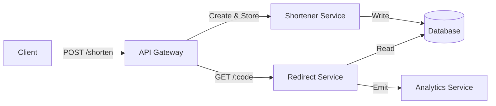

# Section 1

# Mastering System Design: The 4-Step Blueprint for Scalable Systems

Welcome back to our System Design series! In this section, we’re shifting gears from core theory to practical application. We’ll break down a proven **4-step system design approach**—a blueprint you can follow to tackle any real-world system design problem, from initial requirements to strategic technical decisions.

---

## What Is System Design?

Before we dive into the framework, let’s recap what system design means in practice:

- **System design** is the process of defining a system’s architecture, components, and interactions to meet requirements such as *scalability*, *performance*, and *maintainability*.
- It’s about **building solutions** that are robust, scalable, and sustainable—not just working software.
- System design is full of **trade-offs**: performance vs. cost, complexity vs. simplicity, and more. Every decision must align with long-term vision and business goals.

---

## The 4-Step System Design Process

Here’s the high-level process we’ll use for every case study:

```
+---------------------+      +-------------------------+      +-----------------------+      +-----------------------------+
| 1. Problem & Scope  | ---> | 2. Estimating Scale &   | ---> | 3. High-Level Design  | ---> | 4. Tech & Infra Decisions   |
|                     |      |    Identifying Bottlenecks |    |  (Services, APIs)    |      | (Stack, Performance, etc.) |
+---------------------+      +-------------------------+      +-----------------------+      +-----------------------------+
```

Let’s dig into each step:

---

### **Step 1: Understanding the Problem & Defining Scope**

1. **Functional Requirements**
   - What should the system do?
   - *Example:* For a URL shortener: create short URLs, redirect to the original, track analytics.
2. **Non-Functional Requirements**
   - Performance (latency, throughput)
   - Scalability (handle millions of requests)
   - Security, Reliability, Compliance, etc.
3. **Constraints**
   - Time, budget, team, regulatory, and technical limitations.

```markdown
#### Example: URL Shortener
- Functional: Shorten URLs, redirect, analytics
- Non-Functional: < 100ms latency, 99.99% uptime, GDPR compliance
- Constraints: Launch in 3 months, AWS only, $1000/mo budget
```

---

### **Step 2: Estimating Scale & Identifying Bottlenecks**

1. **Estimate Traffic**
   - What’s the expected peak load? How fast will it grow?
   - *Example:* 10M requests/day, 2x annual growth.
2. **Identify Bottlenecks**
   - Which parts could fail under load? (DB, CPU, network, etc.)
3. **Capacity Planning**
   - Estimate storage, bandwidth, and compute needs to avoid failure.

```python
# Example: Rough Traffic Estimation
DAILY_REQS = 10_000_000
BYTES_PER_REQ = 1_000  # e.g., analytics payload, overhead
bandwidth_needed = DAILY_REQS * BYTES_PER_REQ / (24 * 3600)  # bytes/sec
print(f"Required bandwidth: {bandwidth_needed/1024:.2f} KB/s")
```

---

### **Step 3: High-Level Design: Services, APIs & Communication**

1. **Core Services**
   - Break into logical components (e.g., shortener service, analytics service).
2. **API Design**
   - Define endpoints and request/response formats.
3. **Communication Patterns**
   - Synchronous (REST) vs. Asynchronous (queues, events).
4. **Service Interaction**
   - How do services talk? Direct, via API Gateway, or through message queues?



```python
# Example: API Endpoint (Flask)
from flask import Flask, request, jsonify, redirect

app = Flask(__name__)

@app.route('/shorten', methods=['POST'])
def shorten():
    original_url = request.json['url']
    code = generate_code(original_url)
    store_url(code, original_url)
    return jsonify({'short_url': f'https://sho.rt/{code}'})

@app.route('/<code>', methods=['GET'])
def redirect_url(code):
    original_url = get_original_url(code)
    log_hit(code)
    return redirect(original_url)
```

---

### **Step 4: Making Tech & Infrastructure Decisions Strategically**

1. **Tech Stack**
   - SQL or NoSQL? In-memory cache (e.g., Redis)? Message queues?
2. **Scalability & Availability**
   - Load balancing, auto-scaling, replication.
3. **Performance**
   - Caching, latency vs. throughput, CDN, etc.
4. **Trade-Offs**
   - Performance vs. cost, simplicity vs. flexibility, etc.

```markdown
#### Example Choices
- **DB:** NoSQL (Cassandra) for fast writes, high scalability.
- **Cache:** Redis to store hot URLs.
- **LB:** AWS ALB for HTTP routing.
- **Scaling:** Auto-Scaling Groups.
```

```python
# Example: Redis Caching
import redis

r = redis.Redis(host='localhost', port=6379)

def get_original_url(code):
    url = r.get(code)
    if url:
        return url
    # fallback: fetch from DB, then cache it
    url = db.fetch_url(code)
    r.setex(code, 3600, url)
    return url
```

---

## Tips and Tricks for System Design Interviews

- **Always start with requirements:** Don’t jump to solutions; clarify what’s needed.
- **Think in trade-offs:** There’s no perfect design—always state what you’re optimizing for.
- **Draw diagrams:** Visuals help clarify architecture and component interactions.
- **Estimate with numbers:** Even rough calculations (requests/sec, data size) show your depth.
- **Consider failure modes:** Think about what happens when a component fails (DB down? Cache miss?).
- **Justify tech choices:** Explain *why* you picked a tool or architecture.
- **Iterate:** Revise your design as you find new bottlenecks or constraints.

---

## Conclusion: Your Blueprint for Success

- **Start with clear requirements and constraints.**
- **Use scale and bottleneck analysis to guide architecture.**
- **Create a high-level design balancing performance, cost, and complexity.**
- **Make informed infrastructure and tech choices to ensure scalability and availability.**

By following this four-step process, you’ll build systems that are robust, reliable, and ready for real-world growth.

---

**Next up:** We’ll apply this blueprint to real-world case studies. Stay tuned and start thinking about how you’d break down your next big system!

---

### Further Reading

- [System Design Primer (GitHub)](https://github.com/donnemartin/system-design-primer)
- [Designing Data-Intensive Applications by Martin Kleppmann](https://dataintensive.net/)
- [AWS Architecture Center](https://aws.amazon.com/architecture/)

---

*Feel free to share your own design tips or questions in the comments!*

