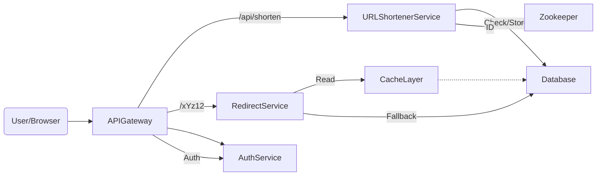
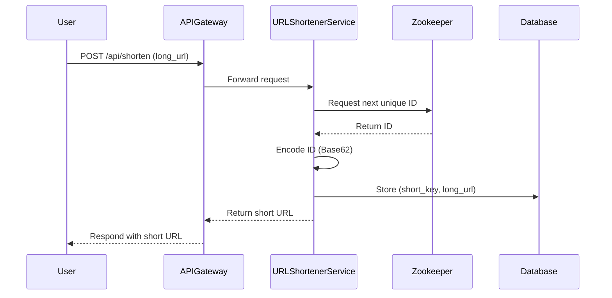
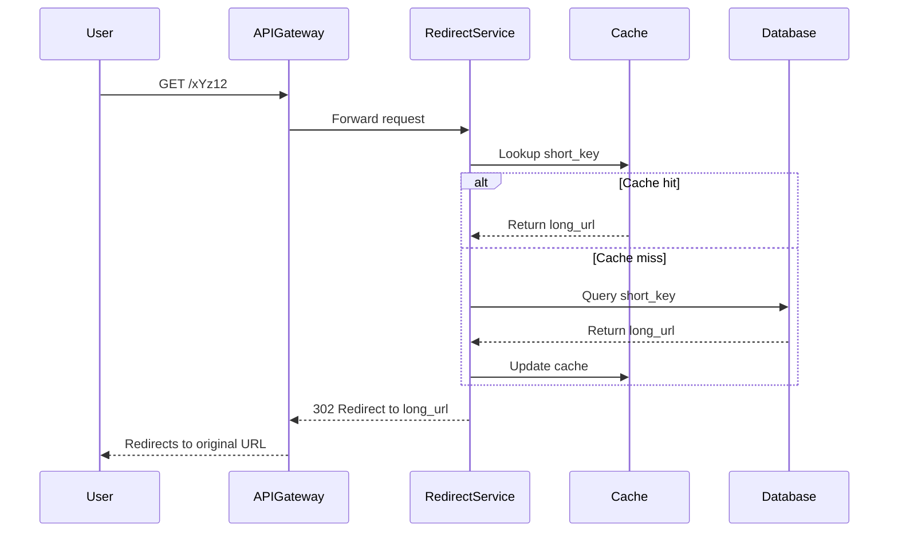
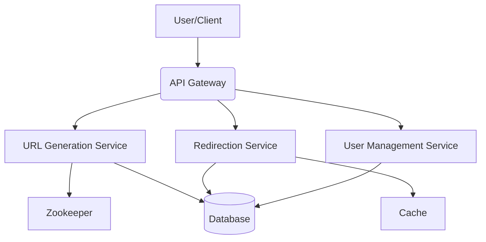
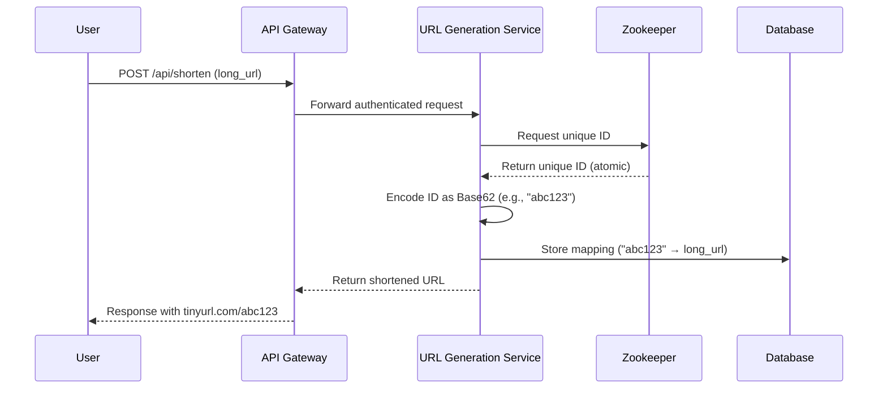
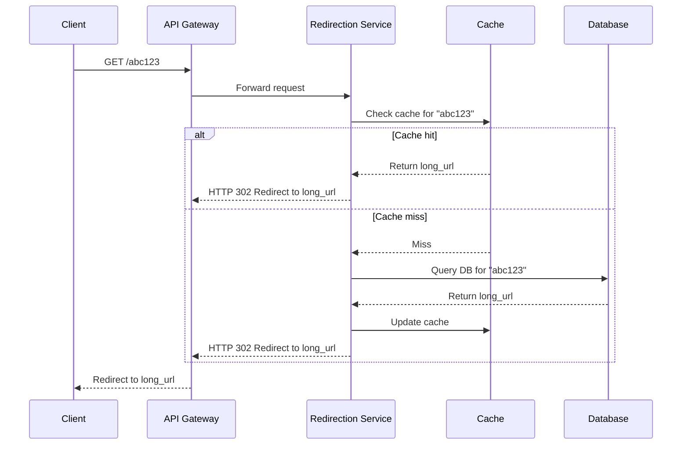
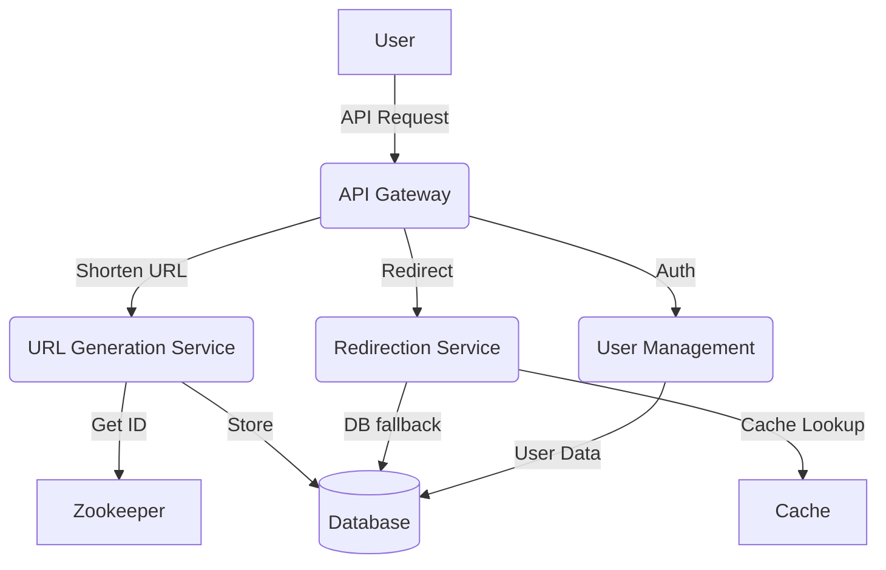

# Section 1

# Designing a URL Shortener (TinyURL) – A System Design Deep Dive

Welcome to our comprehensive guide on designing a **URL shortener service** like [TinyURL](https://tinyurl.com/) from the ground up. We'll cover everything from **requirements gathering** to **high-level system architecture**, with code snippets, diagrams, and practical tips.

---

## Table of Contents

- [Introduction](#introduction)
- [Functional Requirements](#functional-requirements)
- [Non-Functional Requirements](#non-functional-requirements)
- [Unique Key Generation Strategies](#unique-key-generation-strategies)
- [Estimating Scale & Bottlenecks](#estimating-scale--bottlenecks)
- [API Design](#api-design)
- [High-Level System Architecture](#high-level-system-architecture)
- [Distributed Collision Handling with Zookeeper](#distributed-collision-handling-with-zookeeper)
- [Tech Stack & Infrastructure Decisions](#tech-stack--infrastructure-decisions)
- [Final Design Flow](#final-design-flow)
- [Tips and Tricks](#tips-and-tricks)

---

## Introduction

A **URL shortener** transforms a long, complex URL into a short, unique, and manageable link, e.g.:

```
https://www.example.com/very/long/path/to/resource
→ https://tinyurl.com/abc123
```

### Why Build a URL Shortener?

- **Compact Links:** Ideal for Twitter, SMS, or anywhere with length limits.
- **Enhanced UX:** Clean, readable, and easy to share.
- **Click Tracking:** Analytics for link performance.
- **Branding:** Custom domains for businesses.
- **Cross-Channel Friendly:** Works across emails, chat, and even print.

#### How Does It Work?

1. **User submits a long URL.**
2. **System generates a unique short key.**
3. **Stores the mapping (short key → original URL) in a database.**
4. **When the short URL is accessed, the system redirects to the original URL.**


# Unique URL Generation Strategies  
  
- **Random String Generation**: Creates a fixed-length string from random characters  
  - ✅ Unpredictable, no obvious pattern  
  - ⚠️ Risk of collisions, requires collision handling  
  - 🔍 Okay for unpredictability, but adds complexity  
  
- **UUID (Universally Unique Identifier)**: 128-bit globally unique identifier (e.g., 123e4567-e89b-12d3-a456…)  
  - ✅ Guaranteed uniqueness, no central coordination  
  - ⚠️ Very long, not user-friendly  
  - 🔍 Not ideal for TinyURL due to length  
  
- **Hashing with Salt**: Hashes the original URL (e.g., SHA-256 + salt)  
  - ✅ Unique, secure, hard to reverse  
  - ⚠️ May not be short, collision possible, needs mapping storage  
  - 🔍 Useful for security-focused cases, but not optimal for shortening  
  
- **Base62 Encoding**: Converts incrementing ID to Base62 (0-9, a-z, A-Z)  
  - ✅ Short, compact, deterministic, easy to implement  
  - ⚠️ Needs counter management to avoid collisions  
  - 🔍 **Recommended for TinyURL (fast, scalable)**  
  
---  
  
*Step 1: Understanding the Problem & Defining the Scope*  

---

## Functional Requirements

1. **Shorten a URL:** Accept a valid long URL and return a shortened URL.
   - _If the same URL is submitted, return the same short URL (unless a custom alias is used)._
2. **Redirect to Original URL:** On accessing the short URL, redirect to the original URL.
3. **Prevent Duplicate Short URLs:** Avoid multiple short URLs for the same long URL by default.
4. **User Authentication:** Allow user registration/login to manage URLs, view analytics, set expiration, and delete links.

---

## Non-Functional Requirements

- **High Availability:** 24/7 uptime, >99.9%.
- **Performance & Low Latency:** Redirections in milliseconds; URL shortening near-instantaneous.
- **Scalability:** Support millions to billions of URLs. High read volume (redirects); moderate write volume (new URLs).
- **Reliability:** No data loss even during failures; use durable storage, replication, and backups.

---

## Unique Key Generation Strategies

Key generation is critical for uniqueness, compactness, and scalability.

| Strategy                  | Pros                                    | Cons                                  | Suitability for TinyURL |
|---------------------------|-----------------------------------------|---------------------------------------|------------------------|
| **Random String**         | Unpredictable, simple                   | Collisions, requires handling         | ❌                      |
| **UUID**                  | Globally unique                         | Long, not user-friendly               | ❌                      |
| **Hashing+Salt**          | Unique, secure, hard to reverse         | Not always short, collision possible  | ❌                      |
| **Base62 Encoding (ID)**  | Short, compact, deterministic, scalable | Needs counter management              | ✅                      |

### Recommended: **Base62 Encoding**

- Use an incrementing ID, encode in Base62 (`0-9`, `a-z`, `A-Z`) for short, unique keys.
- Requires a globally unique counter (see [Zookeeper](#distributed-collision-handling-with-zookeeper)).

```python
import string

BASE62 = string.digits + string.ascii_letters

def encode_base62(num):
    if num == 0: return BASE62[0]
    arr = []
    while num:
        num, rem = divmod(num, 62)
        arr.append(BASE62[rem])
    arr.reverse()
    return ''.join(arr)

# Example usage:
print(encode_base62(123456))  # Output: 'w7e'
```

---

## Estimating Scale & Bottlenecks

| Metric               | Estimate                              |
|----------------------|---------------------------------------|
| Daily Active Users   | ~10 million                           |
| Monthly Active Users | ~300 million                          |
| New Short URLs/day   | ~100,000                              |
| Redirects/day        | ~50 million                           |
| Hot URL Cache Size   | 1 million mappings (~500 MB RAM)      |
| Storage Growth       | ~50 MB/day; ~50 GB/year (with indexes)|

### Bottlenecks

- **High Read Volume:** Optimize caching and DB reads.
- **Latency Sensitivity:** Instant redirects needed.
- **Write Consistency:** Manage moderate writes for URL generation.
- **Burst Traffic:** Autoscale and use CDN for resilience.

---

## API Design

### 1. Create Short URL

```http
POST /api/shorten
Content-Type: application/json

{
  "long_url": "https://example.com/article?id=1234"
}
```

**Response:**
```json
{
  "short_url": "https://tinyurl.com/xYz12",
  "short_key": "xYz12"
}
```

### 2. Redirect to Original URL

```http
GET /xYz12
```
- **Behavior:** 302 Redirect to the original URL.

### 3. Delete a Short URL (Authenticated)

```http
DELETE /api/url/xYz12
Authorization: Bearer <access_token>
```

---

### 4. User Authentication APIs

- **Register:** `POST /api/auth/register`
- **Login:** `POST /api/auth/login`
- **All sensitive endpoints secured with JWT Bearer tokens**

---

## High-Level System Architecture



- **API Gateway:** Entry point, handles routing, rate limiting, and authentication.
- **URL Shortener Service:** Handles key generation, duplicate checks, manages aliases.
- **Redirect Service:** High-speed resolver for short keys.
- **Database:** Stores mappings, users, and metadata.
- **Cache Layer:** Caches hot URLs for fast redirects.
- **Auth Service:** Manages user authentication (JWT tokens).
- **Zookeeper:** Distributed, atomic counter for ID generation.

---

## Distributed Collision Handling with Zookeeper

**Problem:** In a distributed system, multiple URL shortener instances must generate unique IDs without collisions.

**Solution:** Use [Apache Zookeeper](https://zookeeper.apache.org/) for distributed coordination.

**Flow:**
1. **Service requests next unique ID from Zookeeper.**
2. **Zookeeper increments the global counter atomically.**
3. **Service encodes the ID with Base62, forms short URL.**
4. **Mapping is stored in DB.**

```python
# Pseudocode for atomic ID generation
def get_next_id():
    # Connect to Zookeeper and increment the global counter atomically
    return zookeeper.increment_counter("global_url_id")

new_id = get_next_id()
short_key = encode_base62(new_id)
```

**Advantages:**
- Each instance gets a unique ID.
- Supports horizontal scaling.
- No risk of collision.

---

## Tech Stack & Infrastructure Decisions

- **Database:**
  - SQL (PostgreSQL with auto-increment IDs) for strong consistency
  - NoSQL (DynamoDB, Cassandra) for massive scalability
- **Cache:** Redis or Memcached for fast lookups
- **Zookeeper:** For distributed atomic counter
- **API Gateway:** Kong, NGINX, AWS API Gateway
- **Load Balancer:** NGINX/ELB to distribute traffic
- **Authentication:** JWT tokens, OAuth for user sessions

---

## Final Design Flow

### 1. **URL Generation Flow**



### 2. **Redirection Flow**



---

## Tips and Tricks

- **Cache Hot URLs:** Store top N most accessed URLs in Redis/Memcached to drastically cut down read latency.
- **Prevent Duplicates:** Hash the long URL; if already present, reuse the existing short key.
- **Autoscaling:** Use container orchestration (Kubernetes, ECS) to handle burst traffic.
- **CDN Integration:** Offload static asset delivery and some redirect logic to CDN for global low-latency.
- **Monitoring:** Instrument metrics for response times, error rates, traffic spikes, and cache hit/miss ratios.
- **Security:** Rate-limit API, sanitize inputs, and use HTTPS everywhere.
- **Backups:** Regularly back up your mapping database; replicate across regions for disaster recovery.
- **Expiration Policies:** Allow users to set expiration dates for their short URLs, and periodically clean up expired entries.

---

## Conclusion

Building a scalable, reliable, and high-performance URL shortener requires careful design choices at every layer—from unique key generation to distributed systems coordination and robust API design. By adopting best practices in caching, database selection, and distributed counter management, you can deliver a production-grade service like TinyURL that stands up to real-world demands.

---

**Happy Designing!**

---

<details>
<summary>References & Further Reading</summary>

- [Apache Zookeeper](https://zookeeper.apache.org/)
- [Redis](https://redis.io/)
- [Base62 Encoding](https://en.wikipedia.org/wiki/Base62)
- [System Design Primer](https://github.com/donnemartin/system-design-primer)
</details>


# Section 2

Certainly! Here’s a detailed, **integrated Markdown blog section** that leverages your transcript and slides, formatted for clarity, depth, and engagement—including code snippets, diagrams (ASCII), and a practical “Tips and Tricks” section.

---

# Designing a Scalable URL Shortener (TinyURL): Step 2 Deep Dive

Welcome to the second step of designing a scalable URL shortener like TinyURL! In this section, we'll focus on **estimating the scale** of the system, **identifying architectural bottlenecks**, and laying the groundwork for robust high-level design. Let’s turn real-world constraints into actionable system requirements.

---

## 1. Understanding TinyURL: What Are We Building?

A URL shortener takes a long web address and returns a short, unique link that’s easy to share and track.  
**Example:**  
`https://www.example.com/very/long/path/to/resource` → `https://tinyurl.com/abc123`

**Why build it?**

- **Compact Links:** Great for social media, SMS, QR codes
- **Analytics:** Track how often links are clicked
- **Branding:** Custom domains for enterprises
- **Cross-Platform:** Works in chat, email, print, etc.

---

## 2. Step 2: Estimating Scale & Identifying Bottlenecks

Before picking a database or thinking about code, we **quantify** what the system must handle. This helps us make _smart_ choices about caching, storage, and scaling.

### **User Traffic Estimates**

| Metric                          | Estimate                                      |
|----------------------------------|-----------------------------------------------|
| **Daily Active Users (DAU)**     | 10 million                                    |
| **Monthly Active Users (MAU)**   | 300 million                                   |
| **New Short URLs/day**           | 100,000 (1% of DAU)                           |
| **Redirect Requests/day**        | 50 million (avg. 5 per user)                  |

### **Memory for Hot URL Cache**

We want redirects to be lightning-fast for popular URLs.

- **Cache Top 1M URLs:** 1,000,000
- **Each Mapping:** ~500 bytes (short key, long URL, metadata)
- **Total Cache Memory:** 1M × 500B = **~500 MB**

### **Network Bandwidth (Redirects)**

- **Redirects/day:** 50 million
- **Payload/redirect (headers + body):** ~700 bytes
- **Total/day:** 50M × 700 = **35 GB/day**
- **Avg. throughput:** ≈ 0.4–0.5 MB/sec  
- **Peak throughput:** ≈ 5 MB/sec

### **Storage Requirements**

- **New URLs/day:** 100,000 × 500 bytes = **~50 MB/day**
- **Year:** ~18 GB raw; plan for **~50 GB/year** (including indexes, logs, backup)

---

**Diagram: Data Flow and Hot Path**

```plaintext
[User] --> [API Gateway] --> [URL Shortener Service] --> [Database]
                                     |
                                     v
                                [Cache Layer]
                                     ^
                                     |
[User] <-- [Redirect Service] <------+
```
- **Hot Path:** Redirect checks Cache first; DB on miss.
- **Write Path:** New short URLs go to DB and may pre-warm Cache.

---

## 3. Where Are the Bottlenecks?

Identifying bottlenecks early helps guide your design and technology choices.

### **A. High Read Volume**

- **Problem:** 50M+ redirects/day = tons of reads!
- **Solution:**  
  - **Cache the most popular URLs** (e.g., Redis/Memcached)
  - **Optimize DB for fast lookups** (indexes, sharding if needed)

### **B. Moderate Write Throughput**

- **Problem:** 100K short URLs/day is not huge, but must be consistent.
- **Solution:**  
  - **Strong consistency** for writes (avoid duplicate keys).
  - **Write-optimized DB** (append-only, batched writes).

### **C. Latency Sensitivity**

- **Problem:** Redirects must feel instant (<50ms ideally).
- **Solution:**  
  - **Low-latency infra** (cache, fast DB).
  - **CDN** for edge delivery.
  - **Optimize network paths**.

### **D. Burst Traffic & Scaling**

- **Problem:** Viral links can spike traffic 10× or 100×.
- **Solution:**  
  - **Autoscaling** backend instances.
  - **Use CDN** for static redirect handling.
  - **Load balancer** in front of services.

---

## 4. Technical Choices & Strategies

### **URL Generation: How to Create Unique Short Keys?**

| Strategy           | Pros                              | Cons                    |
|--------------------|-----------------------------------|-------------------------|
| **Random String**  | Unpredictable, simple             | Collisions possible     |
| **UUID**           | Globally unique                   | Too long for URLs       |
| **Hashing+Salt**   | Secure, unique                    | Collisions/can be long  |
| **Base62 Encoding**| Short, compact, deterministic     | Needs ID coordination   |

**Recommended:**  
`Base62(ID)` where `ID` is from a **centralized counter** (e.g., PostgreSQL auto-increment or Zookeeper).

#### **Distributed ID Generation with Zookeeper**

- **Why?** If you have multiple services generating keys, you need a global, collision-free counter.
- **How?**  
  - Each service requests next `ID` from Zookeeper
  - Encode `ID` as Base62 (e.g., `abc123`)
  - Store mapping: `short_key → long_url`

**ASCII Diagram: Zookeeper-based ID Generation**

```plaintext
+---------------------+
| URL Shortener Svc 1 | --+
+---------------------+   |
                          |   +-------------+
+---------------------+   +-->| Zookeeper   |
| URL Shortener Svc 2 | --+   | (Counter)   |
+---------------------+       +-------------+
                               |
                               v
                    [Global Unique ID for Base62]
```

---

### **Sample Code: Short Key Generation (Python)**

```python
import string

BASE62 = string.digits + string.ascii_letters

def encode_base62(num):
    """Encodes a number to a Base62 string."""
    if num == 0:
        return BASE62[0]
    arr = []
    base = len(BASE62)
    while num:
        num, rem = divmod(num, base)
        arr.append(BASE62[rem])
    arr.reverse()
    return ''.join(arr)

# Example usage:
url_id = 12345678  # ID from centralized counter
short_key = encode_base62(url_id)
print(short_key)  # e.g., 'BkQmR'
```

---

## 5. Example API Endpoints

**Shorten a URL**
```http
POST /api/shorten
Content-Type: application/json

{
  "long_url": "https://example.com/article?id=1234"
}

Response:
{
  "short_url": "https://tinyurl.com/xYz12"
}
```

**Redirect**
```http
GET /xYz12

HTTP/1.1 302 Found
Location: https://example.com/article?id=1234
```

**Delete (Authenticated)**
```http
DELETE /api/url/xYz12
Authorization: Bearer <token>
```

---

## 6. Tips and Tricks for Real-World Systems

- **Cache Wisely:** Cache the top 1M URLs to reduce DB load by ~90%+.
- **Eviction Policy:** Use LRU (Least Recently Used) or LFU (Least Frequently Used) for hot URL cache.
- **CDN-friendly Redirects:** Serve 302 redirects via CDN for global low-latency.
- **Bulk Pre-warming:** Preload cache with the most popular URLs during off-peak hours.
- **Autoscaling:** Use cloud auto-scaling groups for backend services to handle burst traffic.
- **Monitoring:** Set up dashboards for cache hit/miss ratio, DB latency, redirect latency, error rates.
- **Data Retention:** Periodically archive or delete old/expired URLs to keep storage lean.
- **Security:** Protect against misuse (phishing links, abuse) with link scanning and user reports.
- **Custom Aliases:** Allow users to set custom short keys with collision check logic.
- **Atomic Operations:** Always generate IDs atomically (e.g., via Zookeeper or DB sequences) to avoid key collisions.
- **Backup Regularly:** Automate DB and cache snapshot backups to prevent data loss.

---

## 7. Next Steps: High-Level Design

With our scale and bottlenecks mapped out, we’re ready to move into API design and high-level system architecture.  
Stay tuned for **Step 3**: API Design and High-Level System Architecture!

---

**Summary Table: Key Numbers**

| Resource        | Estimate         |
|-----------------|-----------------|
| Cache           | 500 MB (1M hot) |
| Bandwidth       | 35 GB/day       |
| Storage (1yr)   | 50 GB           |
| Peak Throughput | 5 MB/sec        |

---

**Diagram: End-to-End Flow**

```plaintext
+--------+      +-----------+      +-------------------+      +---------+
| Client | ---> | API GW    | ---> | URL Shortener Svc | ---> | DB/Cache|
+--------+      +-----------+      +-------------------+      +---------+
       \                 ^                       |                   ^
        \                |                       v                   |
         \----------> [Redirect Service] <---- [Cache Layer] <-------+
```

---

# 🚀 **Design smart, scale sharp, and always measure first!**

---

**Further Reading:**
- [Designing Data-Intensive Applications](https://dataintensive.net/)
- [System Design Primer (GitHub)](https://github.com/donnemartin/system-design-primer)
- [Zookeeper Official Docs](https://zookeeper.apache.org/doc/)

---

*Ready for Step 3? [API Design and High-Level Architecture →](#)*

---

# Section 3

Certainly! Here’s a comprehensive blog section that integrates the transcript and slides, combining explanation, API/code snippets, diagrams (in Markdown/ASCII), and a **Tips & Tricks** section. The aim is to be educational, clear, and practical.

---

# Designing a Scalable URL Shortener: APIs, Components & Collision Handling

URL shorteners like [TinyURL](https://tinyurl.com) are deceptively simple on the surface but pose interesting challenges when you want to design them at scale. In this section, we’ll walk through the **API design**, core **system components**, and how to handle **ID collisions** in a distributed environment using **Zookeeper**.

---

## Table of Contents
- [Functional & Non-Functional Requirements](#functional--non-functional-requirements)
- [API Design](#api-design)
  - [Shorten URL (POST /api/shorten)](#shorten-url-post-apishorten)
  - [Redirect (GET /:short_key)](#redirect-get-short_key)
  - [Delete Short URL (DELETE /api/url/:short_key)](#delete-short-url-delete-apiurlshort_key)
  - [User Auth APIs](#user-auth-apis)
- [High-Level System Components](#high-level-system-components)
- [Collision Handling with Zookeeper](#collision-handling-with-zookeeper)
- [System Design Diagram (ASCII Art)](#system-design-diagram-ascii-art)
- [Tips & Tricks](#tips--tricks)

---

## Functional & Non-Functional Requirements

### Functional

- **Shorten a URL**: Accept a valid long URL, return a short unique URL.
- **Redirect**: When a short URL is accessed, redirect to the original long URL.
- **Prevent Duplicates**: Same long URL yields same short URL (unless custom alias).
- **User Authentication**: Register/login to manage URLs, view analytics, set expiration.

### Non-Functional

- **High Availability**: >99.9% uptime, 24/7.
- **Performance**: Redirection in milliseconds; near-instant URL creation.
- **Scalability**: Support millions/billions of URLs; high read (redirect) volume.
- **Reliability**: No data loss, durable storage, regular backups.

---

## API Design

Let’s define the core APIs for our URL shortener.

### Shorten URL (POST /api/shorten)

**Endpoint:**  
`POST /api/shorten`

**Request:**
```json
{
  "long_url": "https://www.example.com/very/long/path/to/resource"
}
```

**Response:**
```json
{
  "short_url": "https://tinyurl.com/abc123"
}
```

**Notes:**
- Should check for duplicates: if the same long URL is submitted, return the same short URL.
- Should be fast (sub-100ms typical).

---

### Redirect (GET /:short_key)

**Endpoint:**  
`GET /:short_key` (e.g., `/abc123`)

**Flow:**
1. Lookup the original long URL using the `short_key`.
2. Return a `302 HTTP Redirect` to the original URL.

**Example Response:**
```http
HTTP/1.1 302 Found
Location: https://www.example.com/very/long/path/to/resource
```

---

### Delete Short URL (DELETE /api/url/:short_key)

**Endpoint:**  
`DELETE /api/url/:short_key`

**Headers:**
```
Authorization: Bearer <access_token>
```

**Behavior:**
- Deletes the short URL mapping if the authenticated user owns it.
- Returns error if unauthorized.

**Example cURL:**
```bash
curl -X DELETE https://tinyurl.com/api/url/abc123 \
  -H "Authorization: Bearer <access_token>"
```

---

### User Auth APIs

- **User Registration:**  
  `POST /api/auth/register`
- **Login (returns token):**  
  `POST /api/auth/login`

**Token usage:**  
All create/delete APIs require the Bearer token from login (`Authorization: Bearer <access_token>`).

---

## High-Level System Components

Here’s a breakdown of the system’s major building blocks:

| Component           | Responsibility                                                                              |
|---------------------|--------------------------------------------------------------------------------------------|
| **API Gateway**     | Entry point; handles routing, authentication, rate-limiting.                               |
| **URL Shortener**   | Generates short keys, checks for duplicates, validates custom aliases.                     |
| **Redirect Service**| Resolves short keys to long URLs, optimized for speed.                                     |
| **Database**        | Persists all mappings (Short URL → Long URL), user data, metadata.                         |
| **Cache Layer**     | In-memory cache (Redis/Memcached) for top N most-accessed URLs to reduce DB load.          |
| **Auth Service**    | User registration, authentication, session/token management.                               |
| **Zookeeper**       | Distributed coordination for unique ID generation, preventing key collisions at scale.      |

---

## Collision Handling with Zookeeper

In a horizontally scaled environment (many instances), ID collisions can happen if each instance independently generates short keys. **Zookeeper** solves this by providing:

- **Atomic Counters**: Each service instance requests the next unique ID from Zookeeper.
- **Distributed Locks**: Serializes ID generation; ensures global uniqueness.

**Short Key Generation Flow:**
1. URL Shortener requests next ID from Zookeeper.
2. Zookeeper increments a global counter atomically.
3. The ID is Base62-encoded (to get compact short keys).
4. Short key is stored in the database along with the long URL.

**Sample Python Pseudocode:**

```python
def generate_short_key(long_url):
    # Check if long_url already exists in DB
    existing = db.get_short_key(long_url)
    if existing:
        return existing

    # Request next ID from Zookeeper for uniqueness
    unique_id = zookeeper.get_next_id()  # e.g., returns 123456789
    short_key = base62_encode(unique_id)  # e.g., returns "abc123"
    
    # Store mapping
    db.save_mapping(short_key, long_url)
    return short_key
```

---

## System Design Diagram (ASCII Art)

```
          ┌──────────────┐
          │   Clients    │
          └──────┬───────┘
                 │
          ┌──────▼───────┐
          │ API Gateway  │
          └─────┬────────┘
     ┌──────────┼─────────────┬───────────────┐
     │          │             │               │
┌────▼───┐ ┌────▼────┐   ┌────▼────┐      ┌──▼─────────┐
│ Auth   │ │URL      │   │Redirect │      │ Zookeeper  │
│Service │ │Shortener│   │Service  │      │ (ID Gen)   │
└────┬───┘ └────┬────┘   └────┬────┘      └────▲───────┘
     │         │             │                   │
     │         │             │                   │
┌────▼─────────▼─────────────▼───────────────────┴──────┐
│         Database & Cache (Redis/Memcached)            │
└───────────────────────────────────────────────────────┘
```

**Flow:**
- **User** hits **API Gateway** for any API.
- **Shortener Service** handles create; requests unique IDs from **Zookeeper**.
- **Redirect Service** handles lookup (checks **Cache** first, else **DB**).
- **Auth Service** manages users & tokens.

---

## Tips & Tricks

- **Cache Hot URLs**: Use Redis/Memcached to cache top N URLs (most traffic goes to a small % of URLs).
- **Base62 Encoding**: Compact, URL-safe, and deterministic for encoding IDs.
- **Rate Limiting**: Prevent abuse (spamming shorteners) at the API Gateway.
- **Horizontal Scalability**: Run multiple instances behind load balancers for each service.
- **Use Zookeeper for Coordination**: Avoids ID collisions in distributed environments.
- **Bearer Token Auth**: Secure endpoints (delete, user management) with JWT tokens.
- **Graceful Expiry/Deletion**: Allow users to set expiration, and support secure deletion with owner checks.
- **Analytics**: (Optional) Track clicks for each short URL for insights.
- **CDN for Redirects**: Serve redirects from edge locations for low latency at global scale.

---

## Wrapping Up

Designing a URL shortener like TinyURL involves more than just mapping a long URL to a short one. It requires careful API design, robust infrastructure for speed and reliability, and distributed coordination to avoid ID collisions at scale. Zookeeper is a critical piece for distributed ID generation, ensuring uniqueness as your service grows.

With the above design, you’re well on your way to building a scalable, production-ready URL shortening service!

---

**Further Reading:**
- [Apache Zookeeper](https://zookeeper.apache.org/)
- [Base62 Encoding in Python](https://gist.github.com/nikhilkumarsingh/6b9d9b89ee4f9a7c5c21e5bc893a3f09)
- [JWT.io: JSON Web Tokens](https://jwt.io/)

---

Let us know your thoughts or questions in the comments below! 🚀

# Section 4

Certainly! Here’s a detailed, integrated **Markdown blog section** on designing a scalable, high-performance URL Shortener (like TinyURL), drawing from the transcript and slides. This will include code snippets, architecture diagrams (as ASCII), and a 'Tips and Tricks' section.

---

# 🚀 Designing a Scalable URL Shortener (TinyURL): Architecture, APIs & Best Practices

URL shorteners like [TinyURL](https://tinyurl.com) have become essential tools for sharing long URLs in a compact, user-friendly, and trackable manner. In this guide, we'll break down how to design such a service at scale, covering system components, tech choices, critical trade-offs, and code snippets to illustrate key aspects.

---

## 📌 Why Build a URL Shortener?

- **Compact Links**: Shareable on platforms with character limits (e.g., Twitter, SMS).
- **Enhanced UX**: Clean, readable, and less error-prone.
- **Analytics**: Click tracking and performance monitoring.
- **Branding**: Custom domains for organizations.
- **Cross-Channel**: Easy sharing via chat, email, or print.

---

## 🏗️ High-Level System Design

### **Key Functional Components**

- **API Gateway**: Handles authentication, routing, rate limiting.
- **URL Generation Service**: Generates unique short keys, manages duplicates, validates aliases.
- **Redirect Service**: Resolves short URLs to original URLs, optimized for speed.
- **Database**: Persistent storage for mappings, users, and metadata.
- **Cache Layer**: For "hot" (frequently accessed) URLs.
- **Auth Service**: Manages user identities and tokens.

### **System Diagram**

```ascii
                ┌──────────────┐
                │   Clients    │
                └─────┬────────┘
                      │
              ┌───────▼────────┐
              │  API Gateway   │
              └─────┬──────────┘
        ┌───────────┴───────────┐
        │                       │
┌───────▼────────┐     ┌────────▼───────┐
│ URL Shortener  │     │ Redirect       │
│   Service      │     │ Service        │
└──────┬─────────┘     └───────┬────────┘
       │                       │
       └──────────┬────────────┘
                  │
         ┌────────▼─────────┐
         │   Cache (Redis)  │
         └────────┬─────────┘
                  │
           ┌──────▼──────┐
           │  Database   │
           │ (SQL/NoSQL) │
           └─────────────┘
```

---

## 🔑 Unique URL Generation Strategies

| Strategy              | Pros                        | Cons                        | Notes                         |
|-----------------------|-----------------------------|-----------------------------|-------------------------------|
| Random String         | Unpredictable, simple       | Collisions, needs handling  | Secure but needs checks       |
| UUID                  | Guaranteed unique           | Too long for URLs           | Not user-friendly             |
| Hashing (SHA + Salt)  | Secure, unique-ish          | Not short, collisions       | Good for security, less for UX|
| **Base62 + Counter**  | Short, deterministic, fast  | Needs counter mgmt          | **Recommended**               |

**Atomic Counter with Zookeeper:**
To prevent collisions in distributed environments, use a global counter (with [Zookeeper](https://zookeeper.apache.org/)) and encode it in Base62:

```python
import base64

def encode_base62(num):
    chars = "0123456789abcdefghijklmnopqrstuvwxyzABCDEFGHIJKLMNOPQRSTUVWXYZ"
    base = len(chars)
    result = []
    while num > 0:
        num, rem = divmod(num, base)
        result.append(chars[rem])
    return ''.join(reversed(result))

# Example: ID 125 generates short key
print(encode_base62(125))  # '21'
```

---

## 🗃️ Database & Caching Choices

### **Relational Database (SQL)**
- Good for structured data: users, URL mappings.
- Example: **PostgreSQL** with auto-increment IDs.

### **NoSQL & Cache**
- **Redis/Memcached**: For caching frequently used mappings (hot URLs).
- (Optionally) **DynamoDB**: For scalable, serverless storage.

### **Hybrid Approach**
- Use SQL for data integrity, Redis for speed.

---

## ⚡ Performance, Scalability & High Availability

1. **Horizontal Scaling:**  
   Deploy multiple instances of the URL Shortener and Redirect services to handle traffic surges.

2. **Load Balancers:**  
   Distribute requests evenly, prevent overloading a single instance.

3. **Replication & Failover:**  
   Use DB replication (primary-replica setup) and managed cloud services for high availability.

4. **Caching:**  
   Cache top N URLs in memory (Redis), serving most requests instantly.

---

## 📬 API Design (Sample Endpoints)

### 1. Create Short URL

```http
POST /api/shorten
Content-Type: application/json
Authorization: Bearer <token>

{
  "long_url": "https://example.com/my-article"
}
```
**Response:**
```json
{ "short_url": "https://tinyurl.com/xYz12" }
```

### 2. Redirect

```http
GET /xYz12
```
**Behavior:**  
Returns `302 Found` with `Location: https://example.com/my-article`

### 3. Delete Short URL (optional)

```http
DELETE /api/url/xYz12
Authorization: Bearer <token>
```
Deletes the mapping if permitted.

---

## 🧩 Handling Collisions in a Distributed Setup

If you horizontally scale the URL generation logic, naive counters can collide.  
**Solution:** Use a distributed coordination system (like Zookeeper):

```plaintext
1. Service requests next ID from Zookeeper's global counter.
2. Zookeeper atomically increments and returns the ID.
3. Service encodes ID to Base62.
4. Store mapping in DB.
```

---

## 🔥 Tips and Tricks

- **Cache Wisely:**  
  Store the top 1 million most accessed URLs (500MB in Redis for 1M x 500B mappings).

- **Optimize Hot Path:**  
  Redirects should check cache first; only hit DB if not cached.

- **Monitor & Autoscale:**  
  Use cloud monitoring to autoscale service instances during traffic spikes.

- **Prevent Abuse:**  
  Rate-limit API Gateway and use authentication for sensitive endpoints.

- **Reliable Storage:**  
  Backup your DB regularly. Use managed DBs with automatic failover.

- **ID Generation:**  
  For high concurrency, avoid random short keys unless you can guarantee uniqueness.

- **Replication:**  
  Ensure DB replicas are in sync, and have failover infrastructure.

---

## ✅ Final Design Flow

### **URL Generation**
1. User submits long URL via API.
2. API Gateway authenticates & rate limits.
3. URL Generation Service requests next global ID (Zookeeper).
4. Encodes ID to Base62, creates short key.
5. Stores mapping in DB.
6. Returns short URL.

### **Redirection**
1. User visits short URL.
2. API Gateway forwards to Redirect Service.
3. Service checks Redis cache for mapping.
4. If not found, queries DB and updates cache.
5. Responds with HTTP 302 redirect.

---

## 📈 Scale Estimates

- **Users:** 10M DAU, 300M MAU.
- **New URLs/day:** 100K
- **Redirect requests/day:** 50M
- **Memory for hot cache:** 500MB (1M URLs).
- **Storage/year:** ~50GB (with index, logs, backups).

---

## 💡 Conclusion

Designing a robust, high-availability URL shortener involves balancing storage, speed, and reliability. By combining SQL and in-memory caching, distributed ID generation, and cloud-native scaling, you can build a service that handles billions of redirects efficiently.

---

### **Want a downloadable diagram or sample code?**  
[Check out this repo for a starter template!](#) (Replace with your link)

---

**Happy Designing!** 🚀

# Section 5

Sure! Here’s a detailed **Markdown blog section** integrating the transcript and slides, including **architecture diagrams (in ASCII or Mermaid)**, **code snippets**, and a **"Tips and Tricks"** section.

---

# 🏗️ Designing a Scalable URL Shortener (TinyURL) – System Design Case Study

URL shortening services like [TinyURL](https://tinyurl.com) and [Bitly](https://bitly.com) are essential for condensing long URLs into compact, shareable links—crucial for platforms with character limits or for branding and analytics. In this section, we’ll dissect the system design for a robust, scalable URL shortening service, integrating architectural best practices, API design, and operational tips.

---

## 🧐 Problem Overview

**TinyURL** converts lengthy URLs into short, unique links:
- **Input:** `https://www.example.com/very/long/path/to/resource`
- **Output:** `https://tinyurl.com/abc123`

### Why Build a URL Shortener?
- **Compact Links:** Great for Twitter, SMS, print media.
- **Easy UX:** Readable, easy to share.
- **Analytics:** Track who clicks what.
- **Branding:** Custom domains.
- **Cross-platform:** Works everywhere.

---

## 🎯 Functional & Non-Functional Requirements

### Functional
- **Shorten URL:** Accept long URL, return short URL.
- **Redirect:** Redirect short URL to original.
- **Prevent Duplicates:** Same long URL gives same short URL (unless custom alias).
- **User Authentication:** Register/login, manage links, analytics, expiration.

### Non-Functional
- **High Availability:** >99.9% uptime.
- **Low Latency:** Redirect in milliseconds.
- **Scalability:** Handle 100k new URLs/day, 50M redirects/day.
- **Reliability:** No data loss, strong backups.

---

## 🏹 Core Architecture

Let’s visualize the high-level components and their responsibilities:



- **API Gateway:** Handles all incoming requests, authentication, rate limiting, and routes traffic to services.
- **URL Generation Service:** Creates short URLs, manages uniqueness via Zookeeper, stores mappings.
- **Redirection Service:** Resolves short keys to long URLs, uses cache for speed.
- **User Management Service:** Registration, login, and authentication.
- **Zookeeper:** Guarantees globally unique IDs for short keys.
- **Database:** Stores URL mappings, user data.
- **Cache:** (Redis/Memcached) Stores hot URLs for ultra-fast redirects.

---

## 🔗 Critical Flows

### 1. URL Generation Flow

1. User submits a long URL.
2. API Gateway authenticates, limits abuse.
3. URL Generation Service requests a unique ID from Zookeeper.
4. ID is Base62 encoded (short and user-friendly).
5. Mapping (`short_key` → `long_url`) stored in the DB.
6. Short URL returned to user.



#### **Sample Code: Generate Short URL (Python/Flask Example)**
```python
@app.route('/api/shorten', methods=['POST'])
def shorten_url():
    data = request.get_json()
    long_url = data['long_url']
    user_id = get_current_user_id()

    # 1. Request a unique ID from Zookeeper (pseudo-code)
    unique_id = zookeeper.get_next_id()

    # 2. Encode unique ID as Base62
    short_key = base62_encode(unique_id)

    # 3. Store mapping in DB
    db.insert({'short_key': short_key, 'long_url': long_url, 'user_id': user_id})

    # 4. Return shortened URL
    return jsonify({'short_url': f'https://tinyurl.com/{short_key}'})
```

### 2. Redirection Flow (Fast Path & Cold Path)

1. User clicks short URL (e.g., `tinyurl.com/abc123`).
2. API Gateway routes request to Redirection Service.
3. Redirection Service:
    - Checks Cache (fast-path). If hit, redirect immediately.
    - If miss, queries Database (cold-path), updates cache, then redirects.
4. Returns HTTP 302 Redirect to the original URL.



#### **Sample Code: Redirect Handler**
```python
@app.route('/<short_key>')
def redirect_short_url(short_key):
    # 1. Check cache first
    long_url = cache.get(short_key)
    if not long_url:
        # 2. Fallback to database
        mapping = db.find_one({'short_key': short_key})
        if mapping:
            long_url = mapping['long_url']
            cache.set(short_key, long_url)
        else:
            abort(404)

    # 3. Redirect user
    return redirect(long_url, code=302)
```

---

## 🧠 Unique ID Generation & Collision Handling

**Challenge:** Multiple services generating short keys in parallel can collide!

**Solution:** Use [Apache Zookeeper](https://zookeeper.apache.org/) as a distributed global counter.
- Each service requests next ID from Zookeeper.
- Zookeeper increments a global counter atomically.
- Service encodes the ID as a Base62 string (`0-9a-zA-Z`) for compactness.

**Why Base62?**
- Short, URL-safe, deterministic.
- Easy to implement, no collisions if counter is unique.

**ASCII Diagram:**
```
+------------------------+
| URL Generation Service |
+------------------------+
           |
           v
+----------------------+
|  Zookeeper Counter   |  ---[Atomic ID: 1234567]--->
+----------------------+
           |
           v
+----------------------+
| Base62 Encode (e.g., |
| "abc123")            |
+----------------------+
```

---

## 📐 System Design Diagram



---

## 🛡️ API Design

### Create Short URL

```http
POST /api/shorten
Authorization: Bearer <token>
Content-Type: application/json

{
  "long_url": "https://www.example.com/very/long/path"
}
```
**Response:**
```json
{
  "short_url": "https://tinyurl.com/abc123"
}
```

### Redirect

```http
GET /abc123
```
*Returns:* HTTP 302 Redirect to original URL.

### Delete (Optional)

```http
DELETE /api/url/abc123
Authorization: Bearer <token>
```

---

## 📊 Scaling Considerations

- **Traffic Estimates:** 10M DAU, 100K new URLs/day, 50M redirects/day.
- **Hot URL Cache:** Top 1M URLs need ~500MB RAM.
- **Storage:** ~50GB/year for all mappings, including backups.

---

## 💡 Tips and Tricks

- **Cache Top URLs:** Use Redis/Memcached to serve popular redirects in <1ms.
- **Atomic Counter:** Always use a distributed lock or Zookeeper for unique short key generation.
- **API Rate Limits:** Protect your service from abuse with throttling at the API Gateway.
- **Replicate Everything:** Both DB and cache should be replicated for high availability.
- **Monitor and Auto-scale:** Use cloud-managed services to auto-scale under burst traffic.
- **Analytics:** Store access logs for each short URL for click tracking and analytics.
- **Custom Domains:** Let enterprises use their own branded domains for shortened URLs.
- **Expiration:** Allow users to set expiry dates for ephemeral links.
- **Security:** Use JWT tokens for authentication and authorization on all management APIs.

---

## 🚀 Conclusion

Designing a scalable URL shortener like TinyURL involves more than just mapping long URLs to short keys. By leveraging distributed ID generation (Zookeeper), cache for hot URLs, robust API design, and best practices in high availability, you can build a system that delivers low-latency redirects and high reliability at scale.

**Happy Building!** 🛠️

---

*For a deeper dive, check out the [official Apache Zookeeper docs](https://zookeeper.apache.org/) and [Redis caching strategies](https://redis.io/docs/management/cache/).*

---

**Next up:** [Advanced Analytics & Custom Domains for URL Shorteners →](#)

