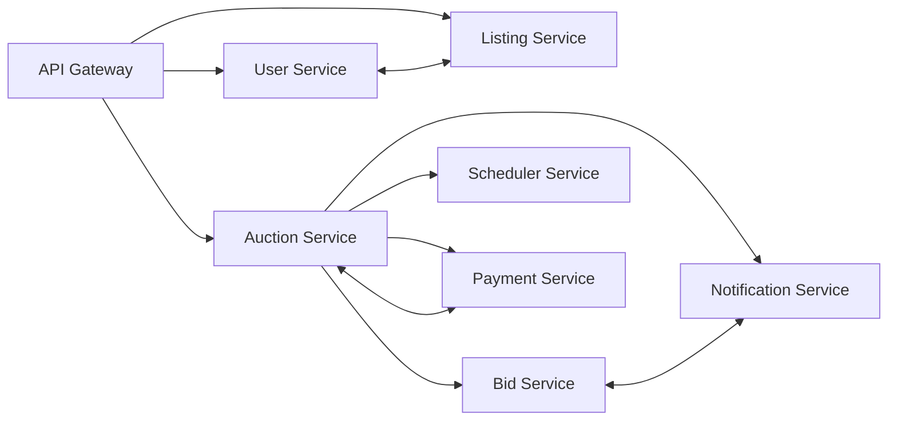
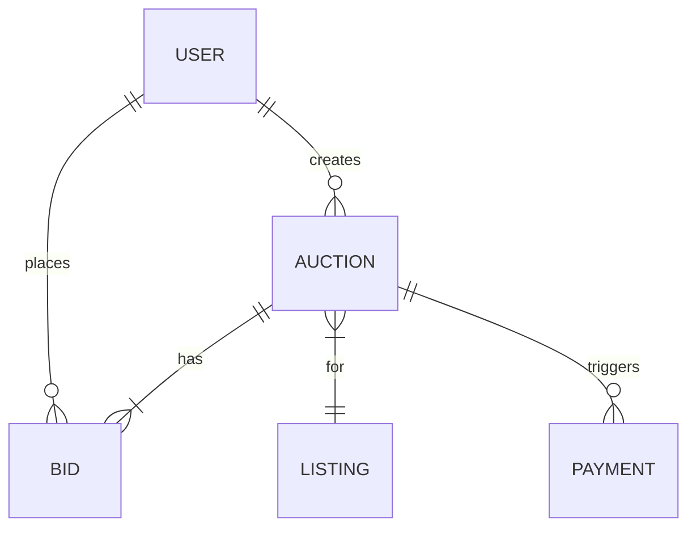
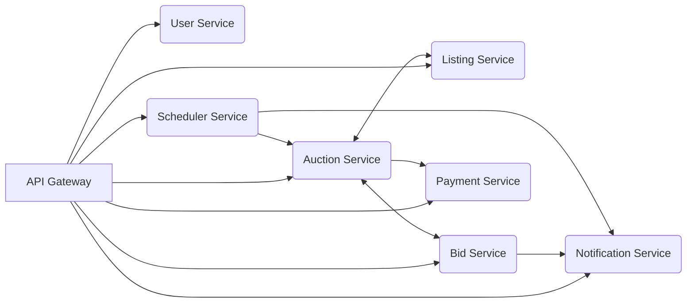
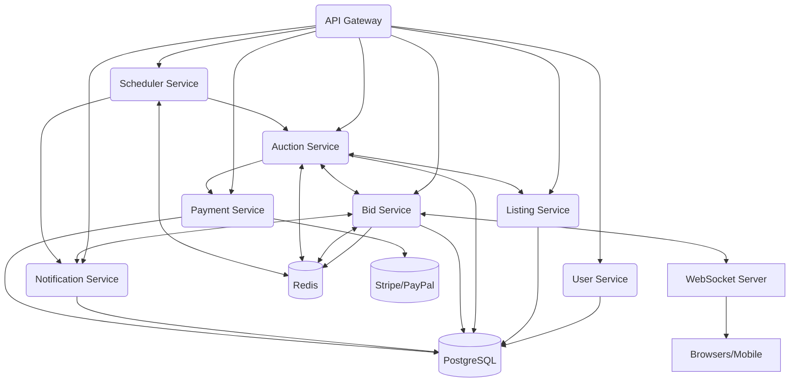

# Section 1

# Designing a Modern Real-Time Auction Platform: Case Study & System Design

Building a scalable, fair, and real-time auction platform is a fascinating challenge that touches on many core system design principles—latency, concurrency, real-time updates, and user trust. In this blog section, we’ll walk through the architectural blueprint for such a platform, integrating insights from lectures and slides. We'll cover requirements, bottlenecks, architecture, and practical implementation snippets, with diagrams and a curated **Tips & Tricks** section at the end.

---

## 1. What is an Auction Platform?

At its core, an auction platform is a digital marketplace where **sellers list items** and **buyers place bids** within a defined auction window. The system manages:

- Real-time bid tracking and updates
- Strict timing and auction state transitions
- Fair winner determination and payment processing
- Notifications for all critical auction events

Key goals: **Security, fairness, scalability, and low-latency real-time experience**.

---

## 2. Functional & Non-Functional Requirements

### Functional Requirements

- **User Registration & Authentication:** Secure sign-up/login for buyers and sellers.
- **Item Listing:** Sellers can create listings with auction parameters (start/end time, reserve price, buy-it-now).
- **Real-Time Bidding:** Instant bid placement, validation, and feedback.
- **Auction Lifecycle:** Automated transitions (scheduled → active → ended), winner determination.
- **Payment Processing:** Integration with payment providers (e.g., Stripe, PayPal).
- **Notifications:** Outbid alerts, auction won, payment pending/complete.

### Non-Functional Requirements

- **Performance:** Sub-second latency for bid placement & updates.
- **Scalability:** Support 1M+ concurrent auctions, 10K+ users in a single auction.
- **Security:** Strong authentication, encrypted payments, anti-bot.
- **High Availability:** Especially during auction closings.
- **Observability:** Real-time monitoring, event logging, anomaly detection.

---

## 3. Core Actors & Use Cases

| Actor   | Role/Actions                                                                |
|---------|----------------------------------------------------------------------------|
| Seller  | Lists items, sets auction parameters                                        |
| Bidder  | Places bids, receives instant updates                                      |
| System  | Manages auction rules, timing, and payments                                |
| Admin   | Monitors platform, handles fraud/disputes                                  |

**Example Use Case:**  
A seller lists a gaming console for a 3-day auction. Bidders compete in real-time. On closure, the system determines the winner and triggers payment.

---

## 4. High-Level Architecture

```plaintext
+-------------------+
|    API Gateway    |
+--------+----------+
         |
         v
+---------------+      +-------------+      +-----------------+
| User Service  |----->| Listing Svc |----->| Auction Service  |
+---------------+      +-------------+      +-----------------+
                                  |                  |
                                  v                  v
                        +----------------+   +-------------+
                        |   Bid Service  |<->| Scheduler   |
                        +----------------+   +-------------+
                                  |                  |
                                  v                  v
                        +----------------+   +--------------+
                        | Payment Svc    |   | Notification |
                        +----------------+   +--------------+
```

**Key Components:**
- **API Gateway:** Entry point, routing, rate limiting
- **User Service:** Auth, profiles
- **Listing Service:** Item metadata
- **Auction Service:** Lifecycle, rules, winner logic
- **Bid Service:** Real-time bids, concurrency control
- **Scheduler:** Timed auction transitions
- **Payment Service:** Integrates with Stripe/PayPal
- **Notification Service:** Outbid, win/loss, payment alerts

---

## 5. Data Model (Simplified)

```sql
-- User Table
CREATE TABLE users (
  id SERIAL PRIMARY KEY,
  email VARCHAR(255) UNIQUE,
  password_hash TEXT,
  role ENUM('buyer','seller','admin'),
  created_at TIMESTAMP
);

-- Listing Table
CREATE TABLE listings (
  id SERIAL PRIMARY KEY,
  seller_id INTEGER REFERENCES users(id),
  title VARCHAR(255),
  description TEXT,
  image_url TEXT,
  category VARCHAR(100),
  created_at TIMESTAMP
);

-- Auction Table
CREATE TABLE auctions (
  id SERIAL PRIMARY KEY,
  listing_id INTEGER REFERENCES listings(id),
  start_time TIMESTAMP,
  end_time TIMESTAMP,
  reserve_price NUMERIC,
  status ENUM('scheduled','active','ended'),
  winner_id INTEGER REFERENCES users(id),
  created_at TIMESTAMP
);

-- Bid Table
CREATE TABLE bids (
  id SERIAL PRIMARY KEY,
  auction_id INTEGER REFERENCES auctions(id),
  bidder_id INTEGER REFERENCES users(id),
  amount NUMERIC,
  created_at TIMESTAMP
);

-- Payment Table
CREATE TABLE payments (
  id SERIAL PRIMARY KEY,
  auction_id INTEGER REFERENCES auctions(id),
  user_id INTEGER REFERENCES users(id),
  status ENUM('pending','completed','failed'),
  payment_provider VARCHAR(50),
  transaction_id VARCHAR(100),
  created_at TIMESTAMP
);
```

---

## 6. API Design – Key Endpoints

```http
# User APIs
POST   /signup
POST   /login
GET    /user/profile

# Auction APIs
POST   /auctions                  # create new auction
GET    /auctions/{id}             # view auction details
POST   /auctions/{id}/bids        # place a bid
GET    /auctions/{id}/bids        # view bid history
GET    /auctions/active           # list active auctions

# Payment APIs
POST   /payments/initiate
GET    /payments/{id}/status
```

---

## 7. Real-Time Bid Delivery (WebSockets)

Why WebSockets?  
- For instant, low-latency updates to all auction watchers.

**How it works:**

1. User connects to `wss://auction-platform.com/ws`
2. Subscribes to channel, e.g., `auction:123456`
3. On valid bid, server broadcasts new bid event to all connected clients.

**Sample Node.js WebSocket Handler:**

```javascript
const WebSocket = require('ws');
const wss = new WebSocket.Server({ port: 8080 });

const auctionChannels = {}; // { auctionId: Set of WebSocket clients }

wss.on('connection', (ws) => {
  ws.on('message', (msg) => {
    const { action, auctionId, bid } = JSON.parse(msg);
    if (action === 'subscribe') {
      if (!auctionChannels[auctionId]) auctionChannels[auctionId] = new Set();
      auctionChannels[auctionId].add(ws);
    } else if (action === 'place_bid') {
      // Bid validation logic...
      // On success:
      auctionChannels[auctionId].forEach(client => {
        client.send(JSON.stringify({ event: 'new_bid', bid }));
      });
    }
  });
});
```

---

## 8. Handling Auction Timers & Closures

**Scheduler Service**: Ensures auctions start/end precisely.

**Design Options:**
- Dedicated cron/queue-based service
- Delayed jobs in message queues (e.g., SQS, Kafka, BullMQ)
- Redis with TTL/polling for expirations

**Idempotency & Reliability:**
- Ensure end-of-auction logic can be safely retried (no double winners)
- Log all timer events; alert on missed or failed closures

**Sample Pseudocode:**

```python
def close_auction(auction_id):
    auction = db.get_auction(auction_id)
    if auction.status != 'ended':
        highest_bid = db.get_highest_bid(auction_id)
        auction.status = 'ended'
        auction.winner_id = highest_bid.bidder_id
        db.save(auction)
        notify_winner(highest_bid.bidder_id, auction_id)
        trigger_payment(highest_bid.bidder_id, auction_id)
```

---

## 9. Service Communication Patterns

- **Sync (REST/gRPC):** For user, listing, and payment API calls.
- **Async (Pub/Sub):** For bid events, auction ended, payment status, notifications.

**Event Topics Example:**

| Topic             | Payload                              |
|-------------------|--------------------------------------|
| `bid.placed`      | {auction_id, bid_id, amount, user_id}|
| `auction.ended`   | {auction_id, winner_id}              |
| `payment.failed`  | {payment_id, reason}                 |

---

## 10. Scaling and Performance

- **Horizontal Partitioning:** Shard bids and auctions by auction ID.
- **Redis Caching:** Store hot auction data for fast access.
- **Load Balancers & Auto-scaling:** For handling traffic spikes, especially end-of-auction surges.
- **Observability:** Centralized logging, real-time dashboards (e.g., Grafana + Prometheus).

---

## 11. Tips & Tricks

- **Prevent Race Conditions:** Use atomic DB operations or distributed locks on bid placement.
- **Idempotency:** All payment, closure, and notification triggers should be idempotent.
- **Mitigate “Hot Auction” Skew:** Special-case handling for auctions with thousands of watchers/bidders (dedicated nodes, in-memory pub/sub).
- **Bot & Sniping Protection:** CAPTCHA for bid burst, randomize auction end time slightly, or add anti-sniping extensions.
- **Graceful Degradation:** If real-time fails, fallback to polling for updates.
- **Retry & Fallback:** For all external calls (payments, notifications), use robust retry with exponential backoff.
- **Logging & Alerts:** Proactive monitoring for stuck auctions, payment failures, or high-latency bids.

---

## 12. Example Sequence Diagram

```plaintext
Bidder                API Gateway           Auction Service           Bid Service         Notification
  |                        |                      |                        |                   |
  |-- Place Bid ---------->|                      |                        |                   |
  |                        |-- Validate Auction ->|                        |                   |
  |                        |<-- Auction OK ------ |                        |                   |
  |                        |--- Place Bid ------->|--- Concurrency Check ->|                   |
  |                        |<-- Bid Accepted ---- |                        |                   |
  |                        |--- Broadcast --------|----------------------->|--- Push Outbid -->|
  |<-- Bid Accepted -------|                      |                        |                   |
```

---

## 13. Final Design Diagram

```plaintext
+----------------+      +-----------------+      +-------------------+
| API Gateway    | ---> | Auction Service | ---> | Bid Service       |
+----------------+      +-----------------+      +-------------------+
         |                      |                      |
         v                      v                      v
+---------------+     +-----------------+     +-------------------+
| User Service  |     | Listing Service |     | Scheduler Service  |
+---------------+     +-----------------+     +-------------------+
         |                      |                      |
         v                      v                      v
+----------------+     +-----------------+     +-------------------+
| Payment Service|     | Notification    |     | Analytics/Logging |
+----------------+     +-----------------+     +-------------------+
```

---

## 14. Conclusion

Designing a real-time auction platform is a multi-disciplinary effort that demands not just feature-rich development, but also careful handling of timing, concurrency, and fairness. The best platforms combine robust backend services, real-time communication channels, and a developer mindset that’s always preparing for race conditions, sudden load spikes, and the creative mischief of determined users.

---

**Happy designing and bidding!**

# Section 2

Certainly! Below is a detailed **Markdown blog section** that integrates the transcript and the provided slides, synthesizing them into a cohesive, instructive post. It includes illustrative diagrams (as ASCII/Markdown), code snippets, and a practical 'Tips and Tricks' section for system design interviews or real-world implementation.

---

# Designing a High-Scale Real-Time Auction Platform (eBay-Style)

Building a real-time auction platform that scales to millions of users and supports high-concurrency, low-latency bidding—while ensuring fairness and reliability—is a classic system design challenge. Let’s walk through how to estimate scale, identify bottlenecks, and architect such a system with practical strategies, sample APIs, and real-world tips.

---

## 1. Understanding the Auction Platform

An auction platform enables users to list items and bid in real time. The highest bid at closing wins. Such platforms must efficiently handle:

- **Item listings**
- **Bid tracking**
- **Real-time updates**
- **Auction lifecycle management**
- **Payment processing**

**Key Objective:** Deliver a secure, fair, and scalable real-time bidding experience, from listing through payment.

---

## 2. Functional & Non-Functional Requirements

### Functional Requirements

- User registration & authentication
- Item listing (with auction parameters)
- Real-time bid placement & updates
- Auction state transitions (`scheduled → active → ended`)
- Payment processing after auction ends
- Outbid, win, and payment notifications

### Non-Functional Requirements

- **Performance:** Sub-second latency for bids/updates
- **Scalability:** Support thousands of concurrent auctions/users
- **Security:** Secure auth, data protection, anti-bot
- **Availability:** High uptime during peak auctions
- **Observability:** Event logging, monitoring dashboards

---

## 3. Scale Estimation & Traffic Patterns

Let’s estimate the expected scale and identify pressure zones:

| Metric                           | Value                    |
|-----------------------------------|--------------------------|
| Registered Users                  | 5 million                |
| Daily Active Users                | 500,000                  |
| Concurrent Auctions (Active)      | 1 million                |
| Avg. Bids per Auction             | 10                       |
| Total Bids per Day                | 10 million               |
| Completed Auctions (per day)      | 100,000                  |
| Peak Concurrent Users (hot auction)| 10,000                   |
| Payment Transactions (per day)    | 100,000                  |

**Traffic Patterns:**
- **Read-heavy:** Viewing auctions, item details, bid history
- **Write-sensitive:** Bid placements, auction creation, auction close
- **Real-time pressure:** Last-minute bidding, fan-out updates, precise scheduling, payment triggers

> **Takeaway:** The system must scale for massive reads, but remain fast and strongly consistent for critical writes—especially during last-second bidding frenzies.

---

## 4. Identifying System Bottlenecks

#### Key Bottlenecks and Mitigation Strategies

- **Heavy Service Loads:** Predict & isolate high-load services (e.g., Bid Service, Payment Service).
- **Hot Auctions:** Handle sudden, skewed loads from popular items.
- **Real-Time Updates:** Use WebSockets and pub/sub for fan-out to watchers.
- **Consistency vs. Latency:** Use async processing (e.g., for notifications) where possible; ensure strong consistency for bids/payments.
- **Horizontal Scaling:** Partition high-volume data (bids, listings) across servers/shards.

---

## 5. High-Level Architecture

```plaintext
                           +-----------------+
                           |   API Gateway   |
                           +--------+--------+
                                    |
           +----------+-------------+-------------+----------+
           |          |             |             |          |
      +----v--+   +---v---+     +---v---+     +---v---+  +---v---+
      | User  |   |Auction|     |Listing|     |  Bid  |  |Payment|
      |Service|   |Service|     |Service|     |Service|  |Service|
      +-------+   +-------+     +-------+     +-------+  +-------+
           |          |             |             |          |
           +----------+------+------v-------------+----------+
                               |
                        +------v------+
                        | Notification|
                        |   Service   |
                        +-------------+
                               |
                        +------v------+
                        |  Scheduler  |
                        |   Service   |
                        +-------------+
```

**Component Responsibilities:**

- **API Gateway:** Entry point, routing, rate-limiting.
- **User Service:** Authentication, profiles.
- **Auction Service:** Auction logic, state transitions.
- **Listing Service:** Item metadata, media.
- **Bid Service:** Real-time bid processing, concurrency control.
- **Payment Service:** Post-auction payments.
- **Notification Service:** Bid events, outbid/win alerts.
- **Scheduler Service:** Precise auction start/end management.

---

## 6. Key API Design

```http
# User APIs
POST /signup
POST /login
GET  /user/profile

# Auction APIs
POST /auctions                 # Create auction
GET  /auctions/{id}            # View auction
POST /auctions/{id}/bids       # Place bid
GET  /auctions/{id}/bids       # Bid history
GET  /auctions/active          # List active auctions

# Payment APIs
POST /payments/initiate        # Trigger post-auction payment
GET  /payments/{id}/status     # Payment status

# Notification Triggers (Internal)
# On auction ending: notify winner
# On new highest bid: notify previous top bidder
```

---

## 7. Real-Time Bid Delivery

To handle real-time bid updates:

```plaintext
Client --WebSocket--> Bid Service --Pub/Sub--> WebSocket Server --Fan Out--> Watchers
```

**Sample (Node.js + Socket.IO):**

```javascript
// On the server
io.on('connection', (socket) => {
  socket.on('join-auction', (auctionId) => {
    socket.join(`auction:${auctionId}`);
  });
  socket.on('place-bid', async (data) => {
    // Validate and process bid...
    io.to(`auction:${data.auctionId}`).emit('bid-update', { /* new bid info */ });
  });
});
```

---

## 8. Data Model (Simplified)

```sql
-- Users
CREATE TABLE users (
  id SERIAL PRIMARY KEY,
  username TEXT,
  hashed_password TEXT,
  ...);

-- Listings
CREATE TABLE listings (
  id SERIAL PRIMARY KEY,
  title TEXT,
  description TEXT,
  seller_id INT REFERENCES users(id),
  ...);

-- Auctions
CREATE TABLE auctions (
  id SERIAL PRIMARY KEY,
  listing_id INT REFERENCES listings(id),
  start_time TIMESTAMP,
  end_time TIMESTAMP,
  status TEXT, -- scheduled, active, ended
  ...);

-- Bids
CREATE TABLE bids (
  id SERIAL PRIMARY KEY,
  auction_id INT REFERENCES auctions(id),
  bidder_id INT REFERENCES users(id),
  amount NUMERIC,
  created_at TIMESTAMP,
  ...);

-- Payments
CREATE TABLE payments (
  id SERIAL PRIMARY KEY,
  auction_id INT REFERENCES auctions(id),
  payer_id INT REFERENCES users(id),
  amount NUMERIC,
  status TEXT, -- pending, complete, failed
  ...);
```

---

## 9. Auction Timers & Closures

**Auction lifecycle managed by a Scheduler Service:**

- **Responsibilities:**
  - Start auction at `start_time`
  - End at `end_time`
  - Determine winner, notify, trigger payment

**Design Options:**
- Dedicated Scheduler Service (cron/queue-based)
- Delayed jobs in queue (e.g., SQS Delay, BullMQ)
- Redis-based polling/expiration
- Ensure idempotency and retries

---

## 10. Tips and Tricks for Real-Time Auction Platforms

**System Design Interview Tips:**

- **Estimate Scale Early:** Know your read/write ratios and peak concurrency.
- **Isolate Critical Paths:** Keep real-time and non-critical async paths separate.
- **Design for Hotspots:** Plan for “hot” auctions—partition, cache, and pre-allocate resources.
- **Strong Consistency for Bids:** Use optimistic concurrency control or atomic DB operations to prevent race conditions.
- **WebSockets for Real-Time:** Prefer WebSockets (or gRPC streams) for bid updates; scale with sharded pub/sub.
- **Scheduler Robustness:** Use persistent job queues, retries, and idempotent logic for auction closures.
- **Observe and Alert:** Log auction events and set up real-time dashboards/alerts.
- **Graceful Payment Handling:** Handle third-party payment timeouts/failures with retries and user alerts.

---

## 11. Example: Placing a Bid (End-to-End)

```python
# Pseudocode for bid placement (Python/Flask-like)
@app.route('/auctions/<auction_id>/bids', methods=['POST'])
def place_bid(auction_id):
    user = authenticate(request)
    bid_amount = request.json['amount']
    # Transactional check: is auction active? Is bid higher than current?
    with db.transaction():
        auction = db.query('SELECT * FROM auctions WHERE id = %s FOR UPDATE', auction_id)
        if auction.status != 'active' or now() > auction.end_time:
            return error('Auction not active')
        current_highest = db.query('SELECT MAX(amount) FROM bids WHERE auction_id = %s', auction_id)
        if bid_amount <= current_highest:
            return error('Bid too low')
        db.insert('bids', { 'auction_id': auction_id, 'bidder_id': user.id, 'amount': bid_amount })
    # Publish event for real-time update
    pubsub.publish(f"auction.{auction_id}.bid_placed", { 'user': user.id, 'amount': bid_amount })
    return success('Bid placed')
```

---

## 12. Conclusion

Designing a scalable, reliable auction platform requires careful scale estimation, real-time communication infrastructure, and robust handling of consistency and concurrency. With the right partitioning, service isolation, and async/event-driven design, you can ensure smooth operation even during the most intense bidding wars.

---

### **Further Reading**
- [eBay Architecture Principles](https://www.ebayinc.com/tech/)
- [WebSockets at Scale](https://ably.com/concepts/websockets)
- [Distributed Scheduling Patterns](https://martinfowler.com/articles/patterns-of-distributed-systems/scheduled-job.html)

---

## 🚀 Tips and Tricks Recap

- Estimate and partition for both average and peak loads.
- Use WebSockets (or similar) for live bid fan-out.
- Separate real-time vs. async/less-critical flows for better scaling.
- Ensure strong consistency for critical operations (last-second bids, payments).
- Proactively monitor “hot” auctions and autoscale infrastructure.
- Plan for retries and idempotency in job scheduling and payments.

---

**Happy designing—and may the highest bidder win!**

# Section 3

# Building a Modern Auction Platform: High-Level System Design

Designing an online auction platform like eBay is a classic system design challenge, combining real-time requirements, strong consistency, and high scalability. In this post, we'll walk through the **core architecture, services, APIs, data model, communication patterns, and real-time mechanisms** used to deliver a fair, robust, and competitive bidding experience.

---

## 🎯 What is an Auction Platform?

An auction platform enables users to list items and bid in real time within a defined window.
- **Competitive Pricing:** Highest bid at closing wins.
- **Core Workflows:** Listing, bid tracking, real-time updates, auction lifecycle orchestration, payment processing.
- **Key Objective:** Secure, fair, and scalable end-to-end experience — from listing to payment.

---

## 📋 Functional & Non-Functional Requirements

**Functional:**
- User registration & authentication
- Item listing with auction parameters (start/end time, reserve price)
- Real-time bid placement and updates
- Auction state transitions (scheduled → active → ended)
- Payment processing (Stripe, PayPal, etc.)
- Notifications (outbid, auction won, payment status)

**Non-Functional:**
- Sub-second bid placement & update latency
- Scalability to 1M active auctions, 10K concurrent users per auction
- Secure authentication & payments, anti-bot
- High availability, observability (logging, monitoring)

---

## 🗺️ High-Level Architecture



**Key Components:**
- **API Gateway:** Entry point, routing, rate limiting.
- **User Service:** Auth, profiles, roles (buyer/seller).
- **Listing Service:** Item metadata, categories, media.
- **Auction Service:** Auction lifecycle, rules, bid validation.
- **Bid Service:** Real-time bid handling, concurrency control.
- **Payment Service:** Post-auction payments, payment status.
- **Notification Service:** Real-time bid events, auction outcomes.
- **Scheduler Service:** Accurate auction start/end, closure orchestration.
- **Analytics & Logging (optional):** Usage tracking, performance monitoring.

---

## 🚦 API Design – Key Endpoints

```http
# User APIs
POST /signup
POST /login
GET /user/profile

# Auction APIs
POST /auctions             # Create new auction
GET /auctions/{id}         # View auction
POST /auctions/{id}/bids   # Place bid
GET /auctions/{id}/bids    # Bid history
GET /auctions/active       # List active auctions

# Payment APIs
POST /payments/initiate
GET /payments/{id}/status
```

- **Notifications** are triggered internally, e.g.:
    - Auction ending ➔ notify winner
    - New highest bid ➔ notify previous leader

---

## 🔗 Service-to-Service Communication

- **Synchronous (REST/gRPC):**
    - User authentication
    - Listing fetch
    - Auction → Bid → Payment trigger (immediate responses)
- **Asynchronous (Pub/Sub, Event Bus):**
    - New bid placed ➔ broadcast to watchers
    - Auction ended ➔ notify winner, trigger payment
    - Payment failed ➔ retry, alert

**Sample Event Topics:**
- `auction.ended`
- `bid.placed`
- `payment.failed`
- `user.registered`

**Benefits:** Decoupling, better retries, graceful failure handling.

---

## ⚡ Real-Time Bid Delivery with WebSockets

Traditional HTTP polling can't meet the low-latency demands of real-time bidding. **WebSockets** establish a persistent, full-duplex connection ideal for pushing bid updates and auction status changes instantly.

**How it Works:**
1. **Client subscribes** to an auction channel: `auction:{id}`
2. **Bid Service** validates & accepts bid → publishes event.
3. **WebSocket Server** fans out updates to all connected clients.

**Scaling Challenge:** Must support horizontal scaling for high concurrency (e.g., 10K+ watchers on a hot auction).

**Sample Node.js WebSocket Snippet:**

```javascript
const WebSocket = require('ws');
const wss = new WebSocket.Server({ port: 8080 });

const auctionChannels = {};

wss.on('connection', (ws, req) => {
  ws.on('message', (msg) => {
    const { action, auctionId } = JSON.parse(msg);
    if (action === 'subscribe') {
      auctionChannels[auctionId] = auctionChannels[auctionId] || [];
      auctionChannels[auctionId].push(ws);
    }
  });
});

function broadcastBidUpdate(auctionId, bid) {
  (auctionChannels[auctionId] || []).forEach(ws => {
    ws.send(JSON.stringify({ type: 'bid_update', bid }));
  });
}
```

---

## 🗄️ Data Model (Simplified)



**Tables:**
- **USER:** Buyer/Seller info, credentials, roles
- **LISTING:** Item details, categories, media
- **AUCTION:** Auction rules, timings, reserve price, FK to listing
- **BID:** Bids with user ID, auction ID, amount, timestamp
- **PAYMENT:** Auction ID, buyer ID, amount, status

**Example Table Definitions (PostgreSQL):**

```sql
CREATE TABLE users (
    id SERIAL PRIMARY KEY,
    email VARCHAR UNIQUE,
    password_hash VARCHAR,
    role VARCHAR CHECK (role IN ('buyer', 'seller')),
    ...
);

CREATE TABLE listings (
    id SERIAL PRIMARY KEY,
    seller_id INT REFERENCES users(id),
    title VARCHAR,
    description TEXT,
    category VARCHAR,
    media_url TEXT[],
    ...
);

CREATE TABLE auctions (
    id SERIAL PRIMARY KEY,
    listing_id INT REFERENCES listings(id),
    start_time TIMESTAMP,
    end_time TIMESTAMP,
    reserve_price NUMERIC,
    status VARCHAR CHECK (status IN ('scheduled', 'active', 'ended')),
    ...
);

CREATE TABLE bids (
    id SERIAL PRIMARY KEY,
    auction_id INT REFERENCES auctions(id),
    user_id INT REFERENCES users(id),
    amount NUMERIC,
    created_at TIMESTAMP DEFAULT now()
);

CREATE TABLE payments (
    id SERIAL PRIMARY KEY,
    auction_id INT REFERENCES auctions(id),
    buyer_id INT REFERENCES users(id),
    amount NUMERIC,
    status VARCHAR,
    ...
);
```

---

## ⏲️ Handling Auction Timers & Closures

Precise and reliable auction closure is **crucial**:
- **Start/End:** Auctions must start/end at the correct time.
- **Closure:** Determine winner, notify parties, trigger payment.

### **Design Options**
- **Dedicated Scheduler Service:** Polls for auctions to start/end using cron or job queues.
- **Delayed Jobs:** Use message queues (e.g., AWS SQS, Kafka) with delay or scheduled processing.
- **Redis-based Timers:** Store auction timers in Redis; use key expiration or polling to trigger events.

### **Reliability**
- **Retries:** On failure, closure jobs are retried.
- **Idempotency:** Ensure repeated closure (due to retries) does not double-notify or re-trigger payments.
- **Logging/Alerts:** All lifecycle events are logged, with alerts for missed timers or job errors.

**Sample Pseudocode for Auction Closure:**
```python
def close_auction(auction_id):
    auction = db.get_auction(auction_id)
    if auction.status != 'ended':
        winner_bid = db.get_highest_bid(auction_id)
        auction.status = 'ended'
        db.update_auction(auction)
        notify_winner(winner_bid.user_id, auction_id)
        trigger_payment(winner_bid.user_id, auction_id, winner_bid.amount)
```

---

## 🛠️ Technology Choices

| Layer     | Tech Examples                             | Why?                                   |
|-----------|------------------------------------------|----------------------------------------|
| Frontend  | React, Vue                               | Dynamic, real-time UI                  |
| Backend   | Node.js, Java (Spring Boot)              | Async, scalable APIs                   |
| Database  | PostgreSQL                               | Strong consistency, relational data    |
| Caching   | Redis                                    | Fast access to hot data, timers        |
| Real-Time | WebSockets (Socket.io/ws), Redis PubSub  | Low-latency bid updates                |
| Scheduler | Dedicated Service, BullMQ, SQS, Kafka    | Accurate, scalable job handling        |
| Payments  | Stripe, PayPal API                       | Secure, reliable transactions          |
| Security  | OAuth2, SSL/TLS                          | Secure login, encrypted communication  |
| Cloud     | AWS/GCP/Azure, Autoscaling, Load Balancer| Elastic, cost-efficient infrastructure |

---

## 💡 Tips and Tricks

1. **Idempotency Matters:** All critical workflows (e.g., auction closure, payment triggers) must be idempotent to handle retries gracefully.
2. **WebSockets at Scale:** Use sticky sessions or stateful connection managers, and consider Redis or Kafka for pub-sub across WebSocket server instances.
3. **Partition Bids:** Hot auctions can create write hotspots. Shard bids by auction ID for scalable storage and retrieval.
4. **Observe Everything:** Log all auction and payment events, and set up real-time monitoring to catch anomalies or missed timers.
5. **Graceful Degradation:** If real-time updates are delayed (due to load), ensure auction state is always correct in the backend, and inform users appropriately.
6. **Anti-Bot & Fairness:** Use CAPTCHAs, rate limits, and bot detection on critical endpoints, especially near auction end.
7. **Consistent Time Source:** Always use a single time reference (e.g., UTC from your DB or a time service) for auction state to avoid drift.
8. **Payment Retries:** Decouple payment processing from closure; use async retries and user notifications for failures.

---

## 📦 Final Thoughts

By combining **modular services**, **real-time communication**, **robust scheduling**, and **scalable infrastructure**, you can deliver a world-class auction experience. This architecture supports thousands of auctions, millions of bids, and delivers fairness, speed, and reliability — exactly what's needed in the competitive world of online auctions.

---

**Happy designing!**  
*Questions or feedback? Drop a comment below!*

# Section 4

Certainly! Here’s a comprehensive blog section, integrating both your transcript and slides, written in Markdown. It features detailed explanations, illustrative diagrams (in text/mermaid), code snippets, and a practical 'Tips and Tricks' section for designing a scalable **Auction Platform**.

---

# Mastering System Design: Building a Scalable Real-Time Auction Platform

Modern online auction platforms (like eBay) require a robust, scalable architecture to deliver a fair, real-time bidding experience to millions of users. This post walks you through the end-to-end system design, integrating business requirements, real-time constraints, technology stack choices, and practical implementation tips.

---

## 🏗️ What is an Auction Platform?

An **auction platform** enables users to list items and bid in real-time within defined time windows. The highest bid at closing time wins. The platform must handle:

- **Item listings**
- **Bid tracking**
- **Real-time updates**
- **Auction lifecycle management**
- **Payment processing**

**Key Objective:**  
Deliver a secure, fair, and scalable real-time bidding experience from listing to payment.

---

## 🔍 Functional & Non-Functional Requirements

### Functional

- **User authentication & registration**
- **Item listings with auction parameters**
- **Real-time bid placement and updates**
- **Auction state transitions:** scheduled → active → ended
- **Payment processing** (Stripe/PayPal)
- **Notifications:** Outbid, auction won, payment status

### Non-Functional

- **Performance:** Sub-second bid updates
- **Scalability:** Thousands of concurrent auctions/users
- **Security:** Secure authentication, payment data protection, anti-bot
- **Availability:** High uptime, especially during peak
- **Observability:** Logging, dashboards

---

## 👥 Actors & Use Cases

- **Seller:** Lists items, sets auction rules
- **Bidder:** Places bids, gets real-time notifications
- **System:** Manages auction rules, timing, payments
- **Admin:** Monitors, handles fraud/disputes

---

## 📏 Scale & Challenges

- **5M registered users**, **500K DAU**
- **1M ongoing auctions** at any moment
- **10M bids/day**
- **10K concurrent users** on hot auctions
- **100K payments/day**

### Key Technical Challenges

- **Sub-second bid updates** (especially last-second "sniping")
- **Concurrency conflicts** on simultaneous writes
- **Massive read-fanout** for hot auctions
- **Precise auction closure and payment triggers**
- **Fairness and anti-bot**

---

## 🏗️ High-Level System Architecture

Below is a conceptual breakdown of the high-level system:



**Key Components:**

- **API Gateway:** Entry point, routing, rate limiting
- **User Service:** Auth, profile, roles
- **Listing Service:** Item metadata, media
- **Auction Service:** Manages auction state & rules
- **Bid Service:** Real-time bid intake, concurrency control
- **Payment Service:** Post-auction payment flows
- **Notification Service:** Alerts, real-time updates
- **Scheduler Service:** Timed auction start/end

---

## 🔧 Technology & Infrastructure Decisions

> **Note:** Below are indicative choices. Any equivalent technology may be used as long as the core capabilities are met.

| Layer         | Technology Choices               | Reasoning                                                  |
|---------------|----------------------------------|------------------------------------------------------------|
| **Frontend**  | React, Vue                       | Fast, interactive, real-time UI                            |
| **Backend**   | Node.js, Spring Boot (Java), ASP.NET | Scalable, async request handling                        |
| **Database**  | PostgreSQL                       | Robust relational storage for core data                    |
| **Cache**     | Redis                            | Ultra-fast caching, real-time bid state, pub/sub           |
| **Real-time** | WebSockets                       | Low-latency, bi-directional bid updates                    |
| **Auth**      | OAuth2                           | Secure, modern authentication                              |
| **Encryption**| SSL/TLS                          | Data-in-transit protection                                 |
| **Cloud**     | AWS, Azure, GCP                  | Managed, pay-as-you-go, elastic scaling                    |
| **Scaling**   | Load Balancers, Autoscaling      | High availability, fault tolerance                         |

---

### Example: Backend Service Skeleton (Node.js + Express)

```js
// Bid Service - Place Bid Endpoint (Node.js/Express)
app.post('/auctions/:id/bids', authenticateUser, async (req, res) => {
  const auctionId = req.params.id;
  const { amount } = req.body;
  try {
    // 1. Validate auction is active
    // 2. Check bid > current highest
    // 3. Write bid atomically (use DB or Redis transaction)
    // 4. Publish event to WebSocket channel
    await placeBid(auctionId, req.user.id, amount);

    // Notify via WebSocket (pseudo)
    websocketServer.publish(`auction:${auctionId}`, { newBid: amount });
    res.status(200).json({ success: true });
  } catch (err) {
    res.status(400).json({ error: err.message });
  }
});
```

---

### Example: Real-Time Bid Fan-out (WebSocket Pseudocode)

```js
// On valid bid, publish to Redis Pub/Sub
redis.publish(`auction:${auctionId}`, JSON.stringify({ bid: ... }));

// WebSocket server subscribes, fans out to all connected clients
redis.on('message', (channel, message) => {
  const clients = websocketClientsForChannel(channel);
  clients.forEach(ws => ws.send(message));
});
```

---

## 📋 Data Model (Simplified)

| Entity   | Fields/Responsibilities                                                                   |
|----------|------------------------------------------------------------------------------------------|
| USER     | UserID, profile, role (seller/buyer), credentials                                         |
| LISTING  | ListingID, item details, media, category                                                  |
| AUCTION  | AuctionID, listingRef, startTime, endTime, status, reservePrice, currentHighestBid        |
| BID      | BidID, auctionRef, userRef, amount, timestamp                                             |
| PAYMENT  | PaymentID, auctionRef, status, transaction details                                        |

---

## ⏱️ Handling Auction Timers & Closures

**Key:** Precise, scalable, fault-tolerant auction closure is *critical*.

**Design Options:**

- **Dedicated Scheduler Service:** Maintains all timers, triggers start/end
- **Delayed Jobs (e.g., SQS, Kafka, BullMQ):** Push closure jobs to queue with delay
- **Redis Expiry/Keyspace Notifications:** Store auction end as TTL key, trigger on expiry

**Reliability Measures:**

- Retry failed closures
- Idempotent closure logic
- Logging & alerting for missed timers

---

### Example: Auction Closure Job (Node.js Pseudocode)

```js
async function closeAuction(auctionId) {
  // 1. Mark auction as ended (idempotent)
  // 2. Determine highest valid bid
  // 3. Trigger payment for winner
  // 4. Notify winner and seller
}
```

---

## 🔒 Security Considerations

- **OAuth2.0:** All endpoints protected via secure tokens
- **SSL/TLS:** All data in transit encrypted
- **Rate limiting:** Prevent brute-force and abuse
- **Anti-bot:** CAPTCHAs, suspicious activity monitoring

---

## 💸 Cost Optimization

- Use **cloud pay-as-you-go** models (AWS, GCP, Azure)
- **Autoscaling:** Dynamically match resources to demand
- Cache hot auctions in Redis to minimize DB reads

---

## 🌟 Tips and Tricks

- **Design for “hot” auctions:** Partition data, use Redis pub/sub for real-time fanout
- **Isolate real-time components:** Decouple WebSocket servers from main APIs for scalability
- **Async where possible:** Notifications, payment receipts, and emails can be handled out-of-band
- **Idempotency:** Ensure auction closures, payment triggers, and notifications are idempotent
- **Observability:** Monitor auction closure jobs, bid latency, and system health with real-time dashboards
- **Graceful Degradation:** If real-time fails, fall back to polling
- **Testing:** Simulate last-second bid storms and payment failures

---

## 🖼️ Final System Design Diagram



---

## 🚀 Conclusion

By combining a modular, service-oriented architecture with real-time messaging (WebSockets, Redis), robust storage (PostgreSQL), and cloud-native infrastructure, you can build an auction platform that's **scalable, responsive, and resilient**—ready to deliver a fair, secure, and delightful experience for millions of bidders and sellers.

---

**Ready to design your own auction platform? Start by modeling the data, defining API contracts, and prototyping real-time bid flows. Happy bidding!**

# Section 5

# Designing a Scalable Real-Time Auction Platform: A System Design Deep Dive

Building a modern auction platform (think eBay) is a great system design challenge. You must blend real-time bid processing, concurrency control, strong consistency, and seamless user experience — all while keeping scalability, security, and reliability at the core.

In this section, we’ll walk through the high-level architecture, core components, data models, and technical strategies behind such a platform, integrating both the detailed transcript and the design slides. You’ll also find sample API definitions, illustrative diagrams, and actionable tips for real-world implementation.

---

## 🏗️ High-Level Architecture Overview

The platform is composed of modular, independently scalable services, each handling a key function in the auction lifecycle.

```mermaid
flowchart LR
    User([User (Web/Mobile App)])
    APIGW([API Gateway])
    UserService([User Service])
    AuctionService([Auction Service])
    ListingService([Listing Service])
    BidService([Bid Service])
    PaymentService([Payment Service])
    NotificationService([Notification Service])
    SchedulerService([Scheduler Service])
    DB[(Database: Postgres)]
    Cache[(Cache: Redis)]
    WebSocket([WebSocket Server])
    MQ([Message Queue])
    PaymentGateway([External Payment Gateway])

    User -- HTTP/WebSocket --> APIGW
    APIGW -- REST/gRPC --> UserService
    APIGW -- REST/gRPC --> AuctionService
    APIGW -- REST/gRPC --> ListingService
    APIGW -- REST/gRPC --> BidService
    APIGW -- REST/gRPC --> PaymentService

    AuctionService -- REST/gRPC --> BidService
    AuctionService -- REST/gRPC --> ListingService
    AuctionService -- REST/gRPC --> PaymentService
    BidService -- PubSub --> WebSocket
    SchedulerService -- MQ --> NotificationService
    PaymentService -- REST --> PaymentGateway

    UserService -- DB
    AuctionService -- DB
    ListingService -- DB
    BidService -- DB
    PaymentService -- DB

    BidService -- Cache
    AuctionService -- Cache
    ListingService -- Cache

    NotificationService -- MQ

    WebSocket -- Push --> User
```

> **Key Patterns:**  
> - **API Gateway** decouples clients from backend complexity  
> - **WebSocket Server** for real-time bid updates  
> - **Message Queue** for async event propagation  
> - **Redis** for hot data and concurrency-safe bid validation  
> - **Horizontally scalable** microservices

---

## 🧩 Core System Components

**1. API Gateway**  
- Single entry point for all client requests
- Handles routing, authentication, rate limiting, and basic validation

**2. User Service**  
- Registration, login, profile management, and role (buyer/seller) assignment

**3. Listing Service**  
- Handles item metadata, categories, images, and exposes search/filter endpoints

**4. Auction Service**  
- Orchestrates auction lifecycle: scheduling, starting, ending, cancellation
- Enforces business rules (min bid increments, time windows, auction state transitions)

**5. Bid Service**  
- Real-time bid processing, concurrency control, race condition prevention
- Integrates with WebSocket for live updates (e.g., "you have been outbid!")

**6. Payment Service**  
- Triggered post-auction, initiates payment workflow via external providers (Stripe, PayPal)
- Handles payment status, refunds, and failure scenarios

**7. Notification Service**  
- Sends bid/auction/payment updates via async channels (email, push, SMS)
- Consumes events from the message queue

**8. Scheduler Service**  
- Time-based actions (start/end auctions), idempotent and reliable
- Can use Redis, cron, or delayed job queues

**9. Infrastructure Components**
- **Postgres**: Structured, relational data store
- **Redis**: Caching, session management, concurrency-safe counters
- **WebSocket Server**: Low-latency real-time updates
- **Message Queue (Kafka/SQS/RabbitMQ)**: Loose coupling, async flows

---

## ⚙️ API Design: Key Endpoints

```http
# User APIs
POST /signup
POST /login
GET  /user/profile

# Auction APIs
POST /auctions
GET  /auctions/{auctionId}
POST /auctions/{auctionId}/bids
GET  /auctions/{auctionId}/bids
GET  /auctions/active

# Payment APIs
POST /payments/initiate
GET  /payments/{paymentId}/status

# WebSocket Channel (pseudo)
CONNECT ws://.../auctions/{auctionId}/subscribe
```

**Sample: Place a Bid**

```http
POST /auctions/12345/bids
Authorization: Bearer <token>
Content-Type: application/json

{
  "amount": 205.00
}
```

**Response (Success):**

```json
{
  "status": "ok",
  "currentHighestBid": 205.00,
  "message": "Bid accepted!"
}
```

---

## 📊 Simplified Data Models

```sql
-- User Table
CREATE TABLE users (
    id SERIAL PRIMARY KEY,
    username VARCHAR(50) UNIQUE NOT NULL,
    password_hash TEXT NOT NULL,
    role VARCHAR(10), -- 'buyer', 'seller'
    ...
);

-- Listing Table
CREATE TABLE listings (
    id SERIAL PRIMARY KEY,
    seller_id INT REFERENCES users(id),
    title VARCHAR(255),
    description TEXT,
    category VARCHAR(50),
    image_url TEXT,
    ...
);

-- Auction Table
CREATE TABLE auctions (
    id SERIAL PRIMARY KEY,
    listing_id INT REFERENCES listings(id),
    start_time TIMESTAMP,
    end_time TIMESTAMP,
    reserve_price DECIMAL,
    status VARCHAR(10), -- 'scheduled', 'active', 'ended'
    ...
);

-- Bid Table
CREATE TABLE bids (
    id SERIAL PRIMARY KEY,
    auction_id INT REFERENCES auctions(id),
    user_id INT REFERENCES users(id),
    amount DECIMAL,
    created_at TIMESTAMP DEFAULT NOW()
);

-- Payment Table
CREATE TABLE payments (
    id SERIAL PRIMARY KEY,
    auction_id INT REFERENCES auctions(id),
    user_id INT REFERENCES users(id),
    status VARCHAR(20), -- 'pending', 'completed', 'failed'
    ...
);
```

---

## 🔄 Real-Time Bid Delivery

**How does the system broadcast new bids to all watchers instantly?**

- **Clients connect via WebSocket** and subscribe to `auction:{id}` channel
- **Bid Service** validates and persists the new bid
- **Bid Service** publishes `bid.placed` event to the WebSocket server
- **WebSocket Server** fans out updates to all connected clients

**Sample WebSocket Event:**

```json
{
  "event": "bid.placed",
  "auctionId": 12345,
  "newHighestBid": 205.00,
  "bidder": "alice"
}
```

---

## ⏰ Handling Auction Timers & Closures

Accurate auction start/end is critical. There are several design options for scheduling:

- **Dedicated Scheduler Service**: Periodically checks for auctions to start/end and triggers appropriate actions.
- **Delayed Jobs in Queue**: When an auction is created, push a delayed message (e.g., SQS delay, BullMQ) to trigger closure.
- **Redis Expiry + Polling**: Store timer keys in Redis and poll/subscribe to expiry events.

> **Reliability:** All closure logic must be idempotent (safe to retry), with logging and alerting for missed timers.

---

## 🚦 Service-to-Service Communication Patterns

| Pattern    | Use Case                                        |
|------------|-------------------------------------------------|
| Sync (REST/gRPC) | User auth, listing fetch, placing bids         |
| Async (Pub/Sub)  | Bid placed → broadcast, auction ended → notify, payment failed → alert |

**Sample Event Topics:**
- `auction.ended`
- `bid.placed`
- `payment.failed`
- `user.registered`

---

## 🛠️ Code Snippet: Concurrency-Safe Bid Placement (with Redis Lua Script)

```lua
-- Lua script for atomic bid placement (simplified)
local auctionKey = "auction:" .. KEYS[1]
local currentBid = tonumber(redis.call("GET", auctionKey))

if tonumber(ARGV[1]) > currentBid then
    redis.call("SET", auctionKey, ARGV[1])
    return "ACCEPTED"
else
    return "REJECTED"
end
```

> **Usage:** Ensure only higher bids are accepted, preventing race conditions.

---

## 📈 Scaling Patterns

- **Horizontal Scaling:** All services can scale out independently.
- **Cache Hot Data:** Store active auctions, top bids, and sessions in Redis.
- **Partitioning:** Shard bid and auction tables for massive scale.
- **Async Processing:** Use message queues for notifications, payments, analytics.
- **Plan for “Hot Auctions”:** Use WebSocket clusters, partitioned queues, and localized caching.

---

## 💡 Tips and Tricks

- **Race Conditions:** Always use atomic operations (e.g., Redis Lua or DB transactions) for bid placement.
- **WebSockets at Scale:** Use sticky sessions or distributed pub/sub (like Redis Streams, Kafka) to scale out real-time updates.
- **Idempotency:** All auction closure/payment triggers should be idempotent for reliability.
- **Observability:** Log all auction state changes, bid events, and payment outcomes. Use monitoring for scheduler lags and missed events.
- **Security:** Use strong authentication (OAuth2), encrypt all traffic (TLS), and implement DDoS/bot protection.
- **Payment Handling:** Always treat payment as an eventual process — support retries, status polling, and manual dispute workflows.
- **Failover:** Replicate databases, use cloud managed services for auto-healing, and design for geo-redundancy.

---

## 🎯 Conclusion

A real-time auction platform is a showcase for modern distributed system design:

- **Microservices** for modular growth and scalability
- **WebSockets** and **event-driven messaging** for instant feedback
- **Atomic concurrency controls** for bid integrity
- **Async workflows** for notifications and payment integration
- **Caching** and **partitioning** for performance under load

With these building blocks, you’ll be well-equipped to design, prototype, and scale an auction system that’s both robust and delightful for users.

---

*Ready for the next system design challenge? Stay tuned!*

