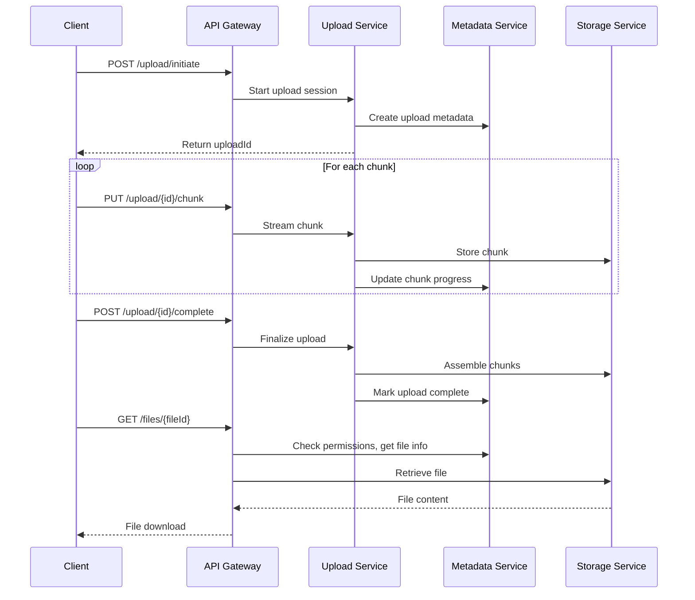
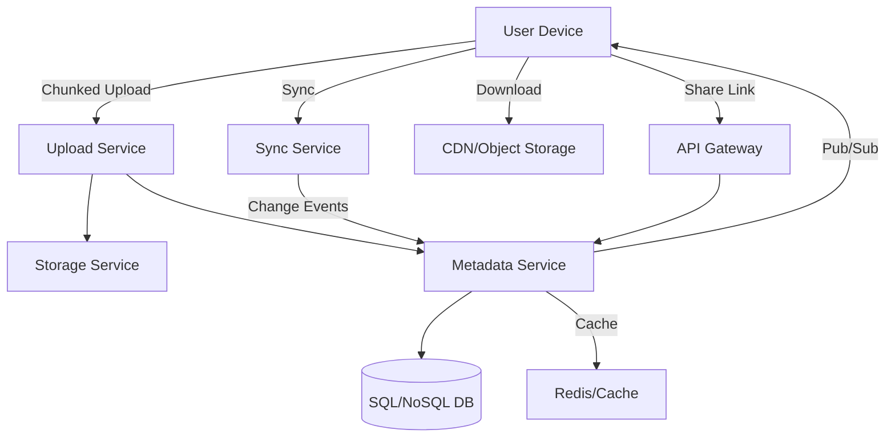
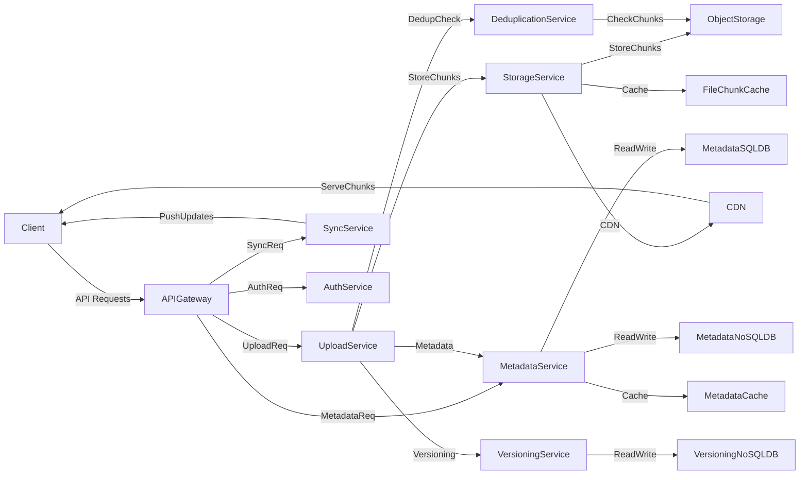
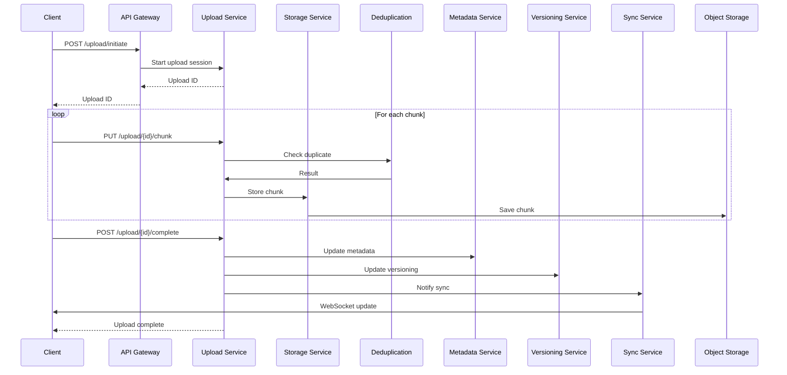

# Section 1

Certainly! Below is a detailed Markdown blog section that integrates the transcript and slide content, adding explanatory details, summary diagrams (in text art where appropriate), code snippets, and a practical 'Tips and Tricks' section for designing a cloud storage system.

---

# Designing a Cloud Storage System (Like Google Drive or Dropbox)

Cloud storage services such as **Google Drive** and **Dropbox** support billions of files, real-time sync, complex permissions, and must deliver blazing performance at massive scale. This section walks through a practical system design approach, highlighting requirements, architecture, API design, and optimization strategies.

---

## 1. Problem Definition & Requirements

### **What Are We Building?**

A distributed, cloud-based file storage platform with:
- **File upload and storage** (all types, securely)
- **Cross-device sync** (real-time updates)
- **Secure sharing and collaboration** (fine-grained access)
- **Massive scalability** (millions of users, petabytes of data)
- **File versioning and recovery**

---

### **Functional Requirements**

| Feature                | Description                                                                |
|------------------------|----------------------------------------------------------------------------|
| File Upload/Download   | Any file type, fast, resumable uploads                                     |
| Multi-Device Sync      | Instant reflection of updates across desktop, mobile, web                  |
| File Organization      | Folders, nested directories, tags                                          |
| Sharing & Collaboration| Public/private links, permissions (view/edit/comment), shared folders      |
| File Versioning        | Maintain and restore previous versions                                     |
| Soft Delete & Restore  | Trash bin, restore before permanent deletion                               |

---

### **Non-Functional Requirements**

| Quality                  | Why It Matters                                           |
|--------------------------|---------------------------------------------------------|
| Scalability              | Must support millions of users, billions of files       |
| High Availability        | Files should never disappear (11 nines durability)      |
| Low Latency              | Instant uploads, downloads, and sync                    |
| Security                 | End-to-end encryption, strict access control            |
| Cost Efficiency          | Deduplication, storage lifecycle management             |
| Observability/Monitoring | Track usage, errors, delays, API failures               |

> **Trade-Offs:** Improving one quality (e.g., durability) can affect others (e.g., cost, latency).  
> **Design is all about balancing these.**

---

### **Key Assumptions & Constraints**

- Files can be large (up to 5GB) ⟶ need chunked, resumable uploads
- Users access files from multiple devices ⟶ real-time sync
- Use cloud object storage (e.g., AWS S3) ⟶ metadata/content separation
- Auth handled externally ⟶ focus on storage & permissions

**Constraints:**
- Uploads are resumable (session & chunk tracking)
- File sync latency < 5s (push/event-driven updates)
- Storage must be cost-efficient (deduplication/lifecycle policies)
- Fine-grained access control (robust permission/ACL model)

---

## 2. Estimating Scale & Access Patterns

### **Key Metrics**

- **Users:** 10 million active
- **Files/User:** 500 (average)
- **Total Files:** ~5 billion
- **Average File Size:** 2MB
- **Total Data:** ~10PB
- **Upload Rate:** ~2,000/sec (peak)
- **Sync Events:** ~10,000/sec (peak)

**Implication:**  
Requires horizontally scalable object storage, distributed metadata, and robust sync pipelines.

---

### **Access Patterns**

- **Write-heavy:** Large uploads (chunked), frequent sync, versioning (multiple writes)
- **Read-heavy:** Multi-device downloads, metadata reads, shared link accesses

**Optimization Focus:**  
Efficient upload flow (chunking, retries), low-latency metadata access (caching), fast permission checks.

---

## 3. High-Level System Architecture

Below is a simplified architecture diagram:

```
+------------------+     +-----------------+     +-------------------+
|  Client Devices  +<--->+  API Gateway    +<--->+  Auth Service     |
| (Web/Mobile/Desktop)   +-----------------+     +-------------------+
        |                         |
        |                         v
        |                 +--------------------+
        |                 |  Upload Service    |
        |                 +--------------------+
        |                         |
        |                         v
        |                 +--------------------+
        |                 |  Metadata Service  |<----+
        |                 +--------------------+     |
        |                         |                  |
        v                         v                  |
+-------------------+     +-------------------+      |
|  Sync Service     |<--->+  Storage Service  +<-----+
+-------------------+     +-------------------+
        |
        v
+-------------------+
| Notification/Push |
+-------------------+
```

**Key Components:**

- **Upload Service:** Handles chunked, resumable file uploads.
- **Metadata Service:** Stores file/folder structure, permissions, versioning info.
- **Sync Service:** Pushes real-time changes to clients.
- **Storage Service:** Interfaces with cloud object storage.
- **Deduplication Service:** Eliminates redundant file chunks.
- **Versioning Service:** Manages file version history and deleted files.

---

## 4. API Design (with Code Snippets)

### **Chunked File Upload**

```http
# 1. Initiate upload session
POST /upload/initiate
Content-Type: application/json

{
  "fileName": "report.pdf",
  "fileSize": 10485760,
  "mimeType": "application/pdf"
}
# Response: { "uploadId": "abc123" }

# 2. Upload chunks (parallelizable)
PUT /upload/abc123/chunk
Content-Type: application/octet-stream
Headers: { "Chunk-Index": 0, "Checksum": "..." }
# Body: <binary chunk data>

# 3. Complete upload
POST /upload/abc123/complete
```

### **File Retrieval & Metadata**

```http
# Download file (with access control)
GET /files/{fileId}

# Fetch metadata, version history, permissions
GET /files/{fileId}/metadata
```

### **Sharing & Collaboration**

```http
# Create a shareable link
POST /files/{fileId}/share
Body: { "access": "view", "expiresIn": 604800 }

# Access file via shared link (token-based)
GET /files/shared/{token}
```

### **Sync & Change Tracking**

```http
# Real-time updates for client sync
GET /sync/updates?since=timestamp
# Returns: stream or array of changes (new/updated/deleted files)
```

---

## 5. Handling Chunked Uploads

### **Why Chunking?**
- Efficient for large files
- Enables resumability (network interruptions don’t restart whole upload)
- Allows parallel uploads for speed

### **Workflow:**

1. **Split file** into fixed-size chunks (e.g., 5MB).
2. **Upload each chunk** individually (with checksum).
3. **Track upload progress** in Metadata Service.
4. **On completion, assemble** chunks into file in Storage Service.

**Chunk Tracking Example (Pseudocode):**

```python
# Pseudocode: Track uploaded chunks
upload_progress = {}
def upload_chunk(upload_id, chunk_idx, data):
    store_chunk(upload_id, chunk_idx, data)
    upload_progress.setdefault(upload_id, set()).add(chunk_idx)

def is_upload_complete(upload_id, total_chunks):
    return len(upload_progress.get(upload_id, set())) == total_chunks
```

---

## 6. File Versioning

### **Why?**
- Rollback to previous states
- Track history for collaboration

### **Versioning Flow:**

1. Each update creates a new version (if content changes).
2. Store metadata: version ID, timestamp, checksum.
3. Allow users to restore any version.

**Versioning API Example:**

```http
# List all versions for a file
GET /files/{fileId}/versions

# Restore specific version
POST /files/{fileId}/restore
Body: { "versionId": "v2" }
```

---

## 7. Storage & Metadata Strategies

- **Object Storage:** For file chunks (scalable, redundant)
- **SQL/NoSQL:**  
    - **SQL:** Users, file/folder structure, permissions  
    - **NoSQL:** Chunk tracking, flexible metadata

**Example Table:**

| Data         | DB Type   | Why                   |
|--------------|-----------|-----------------------|
| Users        | SQL       | Strong relationships  |
| File Metadata| SQL/NoSQL | Structured, scalable  |
| Chunk Info   | NoSQL     | High write throughput |
| Permissions  | SQL       | Relational integrity  |
| Audit Logs   | NoSQL     | High volume           |

---

## 8. Caching & Performance

- **Metadata Cache:** In-memory (e.g., Redis) for file/folder info
- **File Content Cache:** CDN for frequently accessed files/shared links
- **Sync & Consistency:** Event queues (e.g., Kafka) for updates, cache invalidation

---

## 9. Tech & Infra Stack

| Layer         | Technology          |
|---------------|--------------------|
| Architecture  | Microservices, Containers (Docker/K8s) |
| Storage       | AWS S3, MinIO      |
| DB            | PostgreSQL, MongoDB|
| Caching       | Redis, CDN         |
| API Gateway   | Kong, NGINX        |
| Scaling       | Auto-scaling groups|

---

## 10. Tips and Tricks

- **Design for Failure:** Assume network and storage failures, design for resumable/retryable uploads.
- **Partition Metadata:** Avoid single metadata DB hotspots by sharding/partitioning by user or file ID.
- **Chunk Size Tuning:** Balance between upload efficiency and memory usage (e.g., 5-10MB chunks).
- **Event-Driven Sync:** Use pub/sub (Kafka, SQS, etc.) for real-time updates and sync pipelines.
- **Optimize for Reads:** Metadata caching is key for low-latency file listings and access.
- **Deduplicate Early:** Run deduplication on chunks before storage to cut costs.
- **Version Only on Change:** Only create new file versions when content actually changes (hash comparison).
- **Monitor Everything:** Track uploads, download times, errors, and API performance for quick issue detection.
- **Secure by Default:** Enforce strict access controls, encrypt data at rest and in transit, and audit all access.

---

## 11. Example Sequence: Upload to Download



---

## 12. Conclusion

Designing a cloud storage backend is a challenging, rewarding system design exercise. By understanding both the user-facing **features** and the deep **architectural tradeoffs**, you can build platforms that scale to millions of users and petabytes of data—while remaining fast, secure, and robust.

---

**Happy designing!**  
Have questions or want to see a deep dive on any subsystem? Let me know in the comments.

---

# Section 2

Certainly! Here’s a **detailed Markdown blog section** that integrates your transcript and slides, with diagrams, code snippets, and a “Tips and Tricks” section. This is ideal for someone studying system design for cloud storage (à la Google Drive, Dropbox).

---

# Step 2: Capacity Planning and Bottlenecks in Cloud Storage System Design

When designing a cloud storage platform like Google Drive or Dropbox, the foundation of a scalable, robust system is laid during **capacity planning** and **bottleneck identification**. In this section, we’ll walk through the process — integrating real-world scale estimates, analyzing access patterns, surfacing architectural bottlenecks, and providing actionable strategies with illustrative code and diagrams.

---

## 1. Estimating Scale: How Big Is “Big”?

Making informed architectural choices depends on knowing the **magnitude** of what you’re building for.

**Key Metrics:**

| Metric                     | Value                        |
|----------------------------|-----------------------------|
| Active Users               | 10 million                  |
| Average Files per User     | 500                         |
| Total Files                | ~5 billion                  |
| Average File Size          | 2 MB                        |
| Total Data Stored          | ~10 PB                      |
| Peak Upload Rate           | ~2,000 uploads/sec          |
| Peak Sync Events           | ~10,000 updates/sec         |

> **Implication:**  
> You need object storage for durability, a distributed metadata service, and horizontally scalable sync/notification pipelines.

---

## 2. Access Patterns: What Hits Your System, and How?

Understanding **read** and **write** behaviors is crucial.

- **Write-heavy:**  
  - Chunked uploads (large payloads)
  - Frequent sync events upon file changes
  - Versioning (multiple writes per file)
- **Read-heavy:**  
  - Downloads from many device types
  - Folder listings and metadata lookups
  - Shared link/file previews

> **Design Takeaway:**  
> Optimize both the write flow (chunking, session management) and the metadata read flow (low-latency, caching).

---

## 3. Bottleneck Analysis: Where Things Break

Identifying bottlenecks early prevents scaling issues later:

| Bottleneck                         | Why It’s Painful                                    | Solution Direction                   |
|-------------------------------------|-----------------------------------------------------|--------------------------------------|
| Single Metadata DB                  | Hotspot, limits throughput and scalability          | Partition by user/folder; hybrid DBs |
| Large File Uploads                  | Timeouts, failures, especially on mobile            | Chunked, resumable uploads           |
| Real-Time Sync                      | Risk of stale data, race conditions                 | Pub/Sub sync, event sourcing         |
| Permission Checks                   | Can slow down access on shared content              | Caching, precomputed ACLs            |
| High-Volume Shared Links            | Spike in unauthenticated traffic                    | CDN caching, rate limiting           |

---

## 4. Architectural Strategies

### a. **Partitioned Metadata**

Split metadata storage:

- **Structured data:** SQL (e.g., PostgreSQL)
- **Dynamic/unstructured:** NoSQL (e.g., MongoDB)

**Partitioning Example:**

```sql
-- Postgres: Partition file metadata by user_id
CREATE TABLE file_metadata (
    id BIGSERIAL PRIMARY KEY,
    user_id BIGINT NOT NULL,
    file_name TEXT,
    ...
) PARTITION BY HASH (user_id);
```

### b. **Chunked & Resumable Uploads**

Break large files into 5MB chunks, each tracked and uploaded independently.

**Chunk Upload API Example (REST):**

```http
POST /upload/initiate
# Response: { "uploadId": "abc123" }

PUT /upload/abc123/chunk?index=0
# Body: <binary chunk data>

POST /upload/abc123/complete
```

**Chunk Tracking (NoSQL Example):**

```json
{
  "uploadId": "abc123",
  "userId": 42,
  "fileId": "file789",
  "chunks": [
    { "index": 0, "status": "complete", "checksum": "..." },
    { "index": 1, "status": "pending" }
  ],
  "status": "in_progress"
}
```

### c. **Pub/Sub for Real-Time Sync**

When a file changes, notify all subscribed devices:

```python
# Pseudo-code: Publish event
event = {
    "type": "FILE_UPDATED",
    "file_id": "file789",
    "user_id": 42,
    "timestamp": 1710000000
}
pubsub.publish("sync_updates", event)
```

### d. **Caching for Scale**

- **Metadata**: Redis or Memcached for hot data.
- **Content**: CDN for public/shared files.

```python
# Python pseudo-code: Cache metadata
redis.set(f"file_meta:{file_id}", json.dumps(metadata), ex=300)  # 5-min expiry
```

---

## 5. System Architecture Diagram

Here’s a conceptual diagram illustrating key components and flows:



---

## 6. Tips and Tricks for Cloud Storage Design

- **Estimate conservatively**: Always plan for higher-than-expected peaks.
- **Separate metadata and file content**: Use object storage for files, databases for metadata.
- **Chunk everything**: Not just uploads, but also downloads for large files.
- **Make uploads resumable**: Track chunk progress and implement retry logic.
- **Partition by user/folder**: It distributes load and eases scaling.
- **Cache aggressively**: Especially for metadata and shared/public content.
- **Use pub/sub for sync**: Event-driven updates scale better than polling.
- **Design for observability**: Log sync delays, upload failures, and API errors.
- **Automate scaling**: Use Kubernetes or equivalent for auto-scaling services.
- **Secure by default**: Enforce access control and encrypt at rest/in transit.

---

## 7. Sample API Design

```http
# Upload Initiation
POST /upload/initiate
# Response: { "uploadId": "xyz" }

# Upload a Chunk
PUT /upload/xyz/chunk?index=2

# Complete Upload
POST /upload/xyz/complete

# Download a File
GET /files/{fileId}

# Share a File
POST /files/{fileId}/share
```

---

## 8. Key Takeaways

- **Capacity planning** drives every major architectural decision.
- **Access patterns** (read vs write) should inform your optimizations.
- **Early bottleneck identification** (e.g., metadata DB hotspots, upload failures) lets you engineer robust solutions, not patchwork fixes.
- **Hybrid storage models** (SQL + NoSQL + object storage) are essential at scale.
- **Chunking, caching, partitioning**, and **event-driven sync** are your best friends.

---

> **In the next section**, we’ll dive into high-level component design: Upload Service, Metadata Service, Sync Service, and more!

---

**Stay tuned for the architecture deep-dive!**

# Section 3

Below is a **comprehensive, detailed blog section** for designing a cloud storage system (like Google Drive or Dropbox), integrating insights from your transcript and slides. It includes component explanations, code snippets, a high-level architecture diagram (in Mermaid), and actionable tips.

---

# Designing a Scalable Cloud Storage System (Google Drive/Dropbox Style)

Cloud storage platforms like Google Drive and Dropbox have redefined how users manage, share, and sync files across the globe. Building such a system from scratch is a massive engineering challenge, blending distributed storage, real-time synchronization, access control, and cost-efficient scaling. In this article, we'll walk through a high-level design of a cloud storage platform—integrating service breakdowns, API design, storage/caching/database strategies, and implementation tips.

---

## 1. System Overview

**Key Features:**
- Upload, store, and retrieve files of any type
- Sync files across devices (web, mobile, desktop)
- Versioning and recovery
- Secure sharing and collaboration
- Massive scale: millions of users, petabytes of data

---

### **High-Level Architecture Diagram**

```mermaid
flowchart LR
    subgraph Client
        A1[Web/Mobile/Desktop]
    end
    subgraph API Gateway
        B1(API Gateway)
    end
    subgraph Services
        C1[Upload Service]
        C2[Metadata Service]
        C3[Auth Service]
        C4[Sync Service]
        C5[Storage Service]
        C6[Deduplication Service]
        C7[Versioning Service]
    end
    subgraph Storage
        D1[Object Storage (S3, MinIO)]
        D2[SQL DB (Postgres)]
        D3[NoSQL DB (MongoDB)]
        D4[Redis Cache]
        D5[CDN]
    end

    A1-->|REST/gRPC|B1
    B1-->|REST/gRPC|C1
    B1-->|REST/gRPC|C2
    B1-->|REST/gRPC|C3
    B1-->|REST/gRPC|C4
    C1-->|chunks|D1
    C1-->|metadata|C2
    C1-->|dedup info|C6
    C2-->|SQL|D2
    C2-->|NoSQL|D3
    C2-->|cache|D4
    C3-->|auth/check|D2
    C4-->|event|C2
    C4-->|event|D4
    C5-->|file ops|D1
    C6-->|dedup|D1
    C7-->|version|D2
    C7-->|large ver|D3
    D1-->|edge content|D5
```

---

## 2. **Core Services & Responsibilities**

| Service                | Responsibility                                                                 |
|------------------------|-------------------------------------------------------------------------------|
| **Upload**             | Handles chunked, resumable file uploads, manages upload sessions              |
| **Metadata**           | Stores file/folder structure, ownership, permissions, chunk & version info    |
| **Auth**               | Validates user identity, checks permissions (read/write/share)                |
| **Sync**               | Pushes near real-time updates to connected devices                            |
| **Storage**            | Interfaces with object storage (e.g., S3) for file chunks                     |
| **Deduplication**      | Eliminates duplicate file chunks (saves cost/bandwidth)                       |
| **Versioning**         | Maintains version history, supports rollback and restore                      |

---

## 3. **API Design**

All APIs are **RESTful**, secure, and idempotent. Uploads are resumable and support chunking.

### **Upload & File Management**

```http
POST /upload/initiate
# Starts a new upload session, returns upload ID

PUT /upload/{uploadId}/chunk
# Uploads a chunk for the given upload ID

POST /upload/{uploadId}/complete
# Finalizes upload, assembles file, triggers post-processing
```

### **File Retrieval & Metadata**

```http
GET /files/{fileId}
# Downloads file with access control

GET /files/{fileId}/metadata
# Returns file metadata, versions, permissions
```

### **Sharing & Collaboration**

```http
POST /files/{fileId}/share
# Creates shareable (public/private) link

GET /files/shared/{token}
# Access file via token (unauthenticated)
```

### **Sync & Change Tracking**

```http
GET /sync/updates
# Streams/polls real-time file/folder changes (WebSocket/long-poll)
```

---

## 4. **Service Communication Patterns**

- **REST/gRPC:** Synchronous service-to-service calls (fast, low latency)
- **Pub/Sub Queues:** For asynchronous processing (sync events, post-upload tasks)
- **WebSockets:** Real-time push notifications to clients for file/folder changes
- **Event Sourcing:** For triggering sync and versioning updates

#### **Example: Async Event Publish (Node.js + RabbitMQ)**

```js
// Publish a sync update event
channel.assertQueue('sync-events');
const event = { userId, fileId, eventType: 'UPDATED', timestamp: Date.now() };
channel.sendToQueue('sync-events', Buffer.from(JSON.stringify(event)));
```

---

## 5. **Chunked Uploads & Large File Handling**

- **Why Chunking?**
    - Efficient upload for large files (e.g., up to 5 GB)
    - Resumable: If interrupted, resume from last successful chunk
    - Parallel uploads: Faster transfer

#### **Upload Flow:**

1. **Initiate Session:**  
   `POST /upload/initiate` → returns Upload ID

2. **Upload Chunks:**  
   `PUT /upload/{id}/chunk` (e.g., 5MB per chunk, each with checksum)

3. **Complete Upload:**  
   `POST /upload/{id}/complete` triggers assembly and post-processing

#### **Pseudocode: Chunk Upload Logic**

```python
# Example: Python Flask endpoint for chunk upload
@app.route('/upload/<upload_id>/chunk', methods=['PUT'])
def upload_chunk(upload_id):
    chunk_data = request.files['file'].read()
    chunk_idx = int(request.form['chunk_idx'])
    checksum = request.form['checksum']

    # Verify checksum
    if md5(chunk_data) != checksum:
        return {'error': 'Checksum mismatch'}, 400

    # Store chunk in object storage
    object_storage.put(f"{upload_id}/chunk_{chunk_idx}", chunk_data)
    # Update metadata service
    metadata_service.update_chunk_status(upload_id, chunk_idx, 'uploaded')

    return {'status': 'ok'}
```

#### **Retry/Resumable Logic:**
- If a chunk fails, client retries upload
- On session resume, server returns missing chunks so client uploads only those

---

## 6. **File Versioning & Restore**

- **Every file update generates a new version (if content changed)**
- **Version metadata**: timestamp, version number, version ID
- **Restore any version** via API:  
   `GET /files/{fileId}/version/{versionId}`

#### **Change Detection Example:**

```python
def is_new_version(file_id, new_chunks):
    old_chunks = get_file_chunks(file_id)
    return hash(new_chunks) != hash(old_chunks)
```

---

## 7. **Storage & Database Strategy**

### **a. Object Storage**
- Stores file chunks (S3, MinIO, GCS)
- Enables parallel/chunked uploads and high durability via replication

### **b. SQL vs. NoSQL**
| Use Case                | Database      |
|-------------------------|--------------|
| User profiles, permissions, file structure | **SQL (PostgreSQL)** |
| Chunk tracking, version metadata, logs     | **NoSQL (MongoDB)**  |

#### **Sample Table (SQL): File Metadata**

```sql
CREATE TABLE files (
  file_id UUID PRIMARY KEY,
  owner_id UUID,
  name TEXT,
  size BIGINT,
  created_at TIMESTAMP,
  updated_at TIMESTAMP,
  current_version_id UUID
);

CREATE TABLE file_versions (
  version_id UUID PRIMARY KEY,
  file_id UUID REFERENCES files(file_id),
  created_at TIMESTAMP,
  chunk_ids TEXT[], -- Array of chunk IDs
  checksum TEXT
);
```

#### **Sample Document (NoSQL): Chunk Metadata**

```json
{
  "upload_id": "abc-123",
  "chunk_idx": 5,
  "status": "uploaded",
  "location": "s3://bucket/abc-123/chunk_5",
  "checksum": "md5hash"
}
```

---

## 8. **Caching Strategy**

- **Metadata Caching:** In-memory (Redis) for fast access to file info, permissions
- **File Content Caching:** CDN (e.g., CloudFront) for hot files, global edge delivery
- **Cache Invalidation:** Event-driven (e.g., message queues) to keep cache fresh on file changes

---

## 9. **Tips and Tricks**

- **Design for Failure:** Use retries, chunked uploads, and resumable sessions to minimize data loss during network failures.
- **Optimize Hot Paths:** Cache metadata aggressively; profile query patterns to avoid DB hotspots.
- **Event-Driven Sync:** Use message queues and WebSockets for real-time updates and cache invalidation.
- **Deduplicate Early:** Run file chunk deduplication asynchronously after upload completion to save storage.
- **Enforce Idempotency:** All APIs, especially for uploads and sync, must be idempotent to handle client retries safely.
- **Hybrid DB Model:** Use SQL for structured, relational data and NoSQL for high-scale, flexible, or dynamic metadata.
- **Version Only on Change:** Avoid storing new versions if file content hasn't changed (use chunk/hash comparison).
- **Secure Everything:** Always validate permissions and user identity before any file operation or sharing.
- **Monitor and Scale:** Build in observability (metrics, logs, tracing) and autoscaling for both stateless services and storage.

---

## 10. **Conclusion**

Designing a robust, scalable cloud storage service demands careful layering of microservices, efficient API design, a hybrid storage model, and resilient communication patterns. By chunking uploads, separating metadata from file content, leveraging both SQL and NoSQL, and using event-driven sync, you can build a system with low latency, high durability, and seamless user experience.

---

**Further Reading:**  
- [Dropbox Tech Blog: Magic Pocket Architecture](https://dropbox.tech/infrastructure/magic-pocket-architecture)
- [Google Cloud Storage System Design](https://cloud.google.com/storage/docs/architecture)
- [AWS S3 Best Practices](https://docs.aws.amazon.com/AmazonS3/latest/userguide/best-practices.html)

---

**Ready to build?** Start with the API skeleton and chunked upload logic, then iterate layer by layer!

---

*Feel free to adapt the above blog section to your audience, or extend it with more detailed code, diagrams, or specific technology choices (e.g., Kubernetes manifests, CDN configs, etc.).*

# Section 4

Certainly! Here’s a detailed Markdown blog post section that integrates the transcript and slide content, with code snippets, a conceptual diagram, and practical tips.

---

# Designing a Cloud Storage System: From Principles to Practice

Cloud storage platforms like Google Drive and Dropbox serve millions of users, storing petabytes of data, and enabling seamless file synchronization and secure sharing. In this section, we’ll walk through the architecture, strategic tech decisions, and practical considerations for designing a scalable, reliable, and high-performance cloud storage system.

---

## Architecture Overview

The backbone of our system is a **microservices architecture**. By breaking down the platform into independent, loosely coupled services, we gain:

- **Scalability**: Scale services independently based on demand.
- **Maintainability**: Isolate failures, roll out features faster.
- **Deployment Flexibility**: Use containers (Docker) orchestrated by Kubernetes for portability and automated scaling.

**High-Level Component Diagram:**

```mermaid
graph TD
    Client[User Devices] -->|REST/gRPC| API[API Gateway]
    API --> UploadService[Upload Service]
    API --> MetadataService[Metadata Service]
    API --> SyncService[Sync Service]
    API --> VersioningService[Versioning Service]
    UploadService --> StorageService[Storage Service]
    StorageService --> S3[Object Storage (S3/MinIO)]
    MetadataService --> SQLDB[(PostgreSQL)]
    MetadataService --> NoSQLDB[(MongoDB)]
    MetadataService --> Redis[In-memory Cache (Redis)]
    API --> CDN[Content Delivery Network]
    API -->|Auth| AuthService[Auth Service]
    SyncService --> Client
```

---

## Core Technologies & Infrastructure

Let’s break down the key technology and infrastructure choices that power our system:

### 1. **Microservices & Containerization**

- **Containers:** Docker for packaging, Kubernetes for orchestration.
- **Benefits:** Easy scaling, fast deployments, environment consistency.

```yaml
# Example: Kubernetes Deployment for Upload Service
apiVersion: apps/v1
kind: Deployment
metadata:
  name: upload-service
spec:
  replicas: 4
  selector:
    matchLabels:
      app: upload-service
  template:
    metadata:
      labels:
        app: upload-service
    spec:
      containers:
      - name: upload-service
        image: myrepo/upload-service:latest
        ports:
        - containerPort: 8080
```

---

### 2. **Storage Layer**

- **Object Storage:** Amazon S3 (or MinIO for on-prem). Stores file chunks, ensures durability (“eleven nines”).
- **Chunked Uploads:** Large files split into 5MB chunks, supporting resumable and parallel uploads.

```python
# Pseudo-code for Chunked Upload
for chunk in file.chunks():
    upload_chunk_to_s3(chunk_id, chunk)
    record_chunk_metadata(upload_id, chunk_id, status='uploaded')
if all_chunks_uploaded(upload_id):
    assemble_chunks(upload_id)
```

---

### 3. **Database Design**

- **Structured Metadata:** PostgreSQL for relational data (users, file hierarchy, permissions).
- **Scalable Metadata:** MongoDB for flexible attributes, logs, chunk tracking.
- **Caching:** Redis for frequently accessed metadata, reducing DB load.

```sql
-- File Metadata Table (PostgreSQL)
CREATE TABLE files (
    file_id UUID PRIMARY KEY,
    user_id UUID REFERENCES users(user_id),
    name TEXT,
    size BIGINT,
    created_at TIMESTAMP,
    updated_at TIMESTAMP,
    permissions JSONB
);

-- Chunk Metadata (NoSQL - MongoDB Example)
{
  "upload_id": "abc123",
  "chunk_id": 1,
  "status": "uploaded",
  "checksum": "sha256:abcd...",
  "timestamp": "2024-06-01T12:34:56Z"
}
```

---

### 4. **API Gateway & Communication**

- **API Gateway**: NGINX (or Kong) for request routing, authentication, rate limiting, load balancing.
- **Communication:** REST/gRPC for synchronous calls, Pub/Sub queues for events (sync, post-upload processing).

---

### 5. **Content Delivery & Caching**

- **CDN:** Files cached at edge locations for low-latency downloads worldwide.
- **Event-driven Sync:** WebSockets or long polling to push file/folder changes; cache invalidation via events.

---

### 6. **Auto-Scaling**

- **Dynamic Scaling:** Kubernetes Horizontal Pod Autoscaler scales services up/down by monitoring CPU, memory, or custom metrics (like upload QPS).

```yaml
# Kubernetes Horizontal Pod Autoscaler Example
apiVersion: autoscaling/v2
kind: HorizontalPodAutoscaler
metadata:
  name: upload-service-hpa
spec:
  scaleTargetRef:
    apiVersion: apps/v1
    kind: Deployment
    name: upload-service
  minReplicas: 2
  maxReplicas: 20
  metrics:
  - type: Resource
    resource:
      name: cpu
      target:
        type: Utilization
        averageUtilization: 70
```

---

## Example User Flow: Chunked File Upload

1. **Initiate Upload:**  
   `POST /upload/initiate` → returns `upload_id`.
2. **Upload Chunks:**  
   `PUT /upload/{upload_id}/chunk` for each chunk.
3. **Complete Upload:**  
   `POST /upload/{upload_id}/complete` assembles chunks, triggers processing.
4. **Metadata Update:**  
   Metadata Service updates file info, versioning, permissions.
5. **Sync Service:**  
   Notifies other devices of new/changed file.

---

## Tips and Tricks

- **Chunk Resumability:** Always track chunk upload progress and allow clients to retry failed chunks without restarting the whole upload.
- **Metadata Hotspots:** Use in-memory caching (e.g., Redis) for folder listings and shared link lookups to avoid database bottlenecks.
- **Permission Checks:** Cache access control lists (ACLs) in Redis to speed up frequent permission validations.
- **Versioning Optimization:** Use content hashes to detect if a new upload is different before creating a new file version.
- **Observability:** Instrument all services with logging and metrics (e.g., Prometheus, ELK stack) to quickly detect issues like sync latency or API failures.
- **Cost Control:** Apply storage lifecycle policies to delete old versions or trash after a retention period, and deduplicate identical chunks across files.
- **API Idempotency:** Design upload and sync APIs to be idempotent so clients can safely retry requests.

---

## Conclusion

By combining a microservices architecture, robust object storage, hybrid SQL/NoSQL databases, aggressive caching, and dynamic scaling, we meet both the functional and non-functional requirements of a modern cloud storage system. The architecture is flexible—equivalent technologies can be swapped in as needed to suit specific business or operational constraints.

In the next section, we’ll visualize the complete design diagram and step through the user flow for file upload, making the abstract concrete!

---

**Stay tuned for a full walkthrough of the end-to-end system diagram and an in-depth file upload journey!**

# Section 5

Certainly! Here’s a detailed **Markdown blog section** that integrates both your transcript and slide content, organized for clarity and depth. Code snippets and diagrams are included where appropriate. The **Tips and Tricks** section distills actionable insights for candidates or engineers designing similar systems.

---

# Mastering System Design: Building a Scalable Cloud Storage System (Google Drive, Dropbox)

Designing a robust, scalable, and user-friendly cloud storage platform (like Google Drive or Dropbox) is a classic system design interview question—and a real-world engineering challenge. In this post, we’ll walk through the architecture, major components, and critical flows, integrating practical design decisions and technical considerations. By the end, you’ll have a comprehensive understanding and actionable tips for designing such a system.

---

## Table of Contents

1. [Understanding the Problem](#understanding-the-problem)
2. [Key Requirements](#key-requirements)
    - [Functional](#functional-requirements)
    - [Non-Functional](#non-functional-requirements)
3. [System Architecture Overview](#system-architecture-overview)
    - [Major Components](#major-components)
    - [Service Interactions](#service-interactions)
4. [Critical User Flow: File Upload & Sync](#critical-user-flow-file-upload--sync)
5. [Storage, Caching, and Scalability](#storage-caching-and-scalability)
6. [Sample API Design](#sample-api-design)
7. [Tips and Tricks](#tips-and-tricks)

---

## Understanding the Problem

> **Goal:** Enable users to upload, store, organize, share, and sync files (any type, any size) securely and efficiently across multiple devices.

Key aspects:
- **File upload/download**: Any type, up to 5GB or more.
- **Multi-device sync**: Instant availability across web, desktop, mobile.
- **Sharing & Collaboration**: Secure links, folder sharing, access controls.
- **Massive scale**: Millions of users, billions of files, petabytes of data.
- **Versioning & Recovery**: Rollback, undelete.

---

## Key Requirements

### Functional Requirements

- **File Upload & Download**: Reliable, resumable uploads; efficient downloads.
- **Multi-Device Sync**: Real-time sync with <5s latency.
- **File Organization**: Support for folders, directories, tags.
- **Sharing/Collaboration**: Public/private links, shared folders, permissioned editing.
- **Versioning**: Retain/revert previous file versions.
- **Soft Delete & Restore**: Trash bin with restore before permanent deletion.

### Non-Functional Requirements

- **Scalability**: Handle 10M+ users, 5B+ files, 10PB+ data.
- **High Availability & Durability**: "Eleven nines" durability (99.999999999%).
- **Low Latency**: Fast uploads/downloads (even for large files).
- **Security**: End-to-end encryption, access control, secure sharing.
- **Cost Efficiency**: Minimize storage/bandwidth waste (via deduplication, lifecycle policies).
- **Observability**: Usage, errors, sync delays, API failures monitored.

---

## System Architecture Overview

Here’s a high-level architecture diagram (textual representation):



**Key Microservices & Data Stores:**

- **API Gateway:** Entry point, routes all requests, handles authentication, rate limiting.
- **Upload Service:** Handles chunked/resumable uploads, splits files, manages upload sessions.
- **Storage Service:** Interfaces with object storage (e.g., AWS S3), manages file chunks.
- **Metadata Service:** Manages structured metadata (file/folder structure, permissions, ownership).
- **Deduplication Service:** Eliminates redundant chunks for cost efficiency.
- **Versioning Service:** Maintains file histories, enables rollback and restore.
- **Sync Service:** Real-time change propagation to all devices (via WebSocket/push).
- **Auth Service:** Validates permissions, enforces access control.
- **Caches:** Fast metadata and chunk access (e.g., Redis).
- **Databases:**
    - **SQL**: Structured metadata (files, folders, permissions, users).
    - **NoSQL**: Flexible/dynamic metadata, chunk tracking, versioning.
    - **Object Storage**: Persistent file chunks.
- **CDN:** Edge caching for low-latency downloads.

---

## Major Components

| Component            | Responsibilities                                                                   |
|----------------------|------------------------------------------------------------------------------------|
| **API Gateway**      | Request routing, authentication, rate limiting                                     |
| **Upload Service**   | Handles chunked, resumable uploads, splits files, manages sessions                 |
| **Storage Service**  | Stores/retrieves file chunks from object storage                                   |
| **Metadata Service** | Stores file/folder structure, ownership, permissions, search                       |
| **Deduplication**    | Avoids storing duplicate file chunks                                               |
| **Versioning**       | Tracks and restores previous file versions, soft delete                            |
| **Sync Service**     | Pushes file changes to connected devices in near real-time                         |
| **Auth Service**     | Validates user permissions for every action                                        |
| **Caches**           | Metadata cache, file chunk cache for fast read                                     |
| **CDN**              | Caches file chunks near users                                                      |
| **Message Queues**   | Decouples upload, sync, deduplication, versioning flows                            |

---

## Service Interactions

- **REST/gRPC** for synchronous service calls (e.g., API Gateway → Metadata Service).
- **Pub/Sub Queues** for:
    - Sync notifications
    - Post-upload processing (deduplication, versioning)
    - Ordered chunk processing
- **WebSockets** for real-time file/folder updates to clients.

---

## Critical User Flow: File Upload & Sync

Let’s walk through a file upload, step by step:

1. **Client → API Gateway**: Initiates file upload.
2. **API Gateway → Upload Service**: Begins upload session, returns Upload ID.
3. **Client → Upload Service**: Uploads file in parallel chunks (resumable, each chunk has checksum).
4. **Upload Service**:
    - Validates/authenticates via Auth Service.
    - Splits file, tracks chunk progress.
    - Sends chunks to Storage Service (which stores in Object Storage).
    - Publishes chunk tasks to Upload Queue for orderly processing.
5. **Deduplication Service**: Checks for redundant chunks before storage.
6. **Upload Service → Metadata Service**: Updates file metadata (name, owner, permissions) in SQL DB.
7. **Upload Service → Versioning Service**: Updates file version info in NoSQL DB.
8. **Caches**: Metadata and chunk caches updated for fast access.
9. **Sync Service**: Publishes change event to Sync Queue. Pushes updates via WebSocket to all devices.
10. **Client**: Receives confirmation after upload, deduplication, metadata, and sync complete.

**Diagram: (File Upload Flow)**


---

## Storage, Caching, and Scalability

**Object Storage** (e.g., AWS S3, MinIO)
- Stores file chunks as objects.
- Ensures high durability, resilience, and scalability.

**SQL Database** (e.g., PostgreSQL)
- Stores structured metadata: file info, folder structure, permissions, user info.

**NoSQL Database** (e.g., MongoDB, DynamoDB)
- Stores flexible or dynamic metadata: chunk tracking, versioning, logs.

**Caching**
- **Metadata Cache** (e.g., Redis): Frequently accessed metadata for fast lookup.
- **Chunk Cache**: Hot file chunks cached for quick retrieval (especially for popular files).
- **CDN**: Edge cache for file content, minimizes latency and central storage load.

**Scalability**
- All services are built to scale horizontally (stateless, containerized, orchestrated via Kubernetes).
- Message queues (e.g., Kafka, RabbitMQ) decouple services for elasticity and resilience.

---

## Sample API Design

```http
# Initiate an upload session (resumable)
POST /upload/initiate
Content-Type: application/json
Authorization: Bearer <token>

{
  "filename": "myphoto.jpg",
  "size": 5000000,
  "folderId": "abc123"
}
```

**Response:**
```json
{
  "uploadId": "xyz789",
  "chunkSize": 5242880
}
```

```http
# Upload a chunk
PUT /upload/xyz789/chunk
Content-Type: application/octet-stream
Content-Range: bytes 0-5242879/5000000
Authorization: Bearer <token>
(binary chunk data)
```

```http
# Complete upload and assemble file
POST /upload/xyz789/complete
Authorization: Bearer <token>
```

```http
# Download a file (after access check)
GET /files/{fileId}
Authorization: Bearer <token>
```

```http
# Restore a previous version
POST /files/{fileId}/restore
Content-Type: application/json
{
  "versionId": "ver123"
}
```

---

## Tips and Tricks

### 1. **Think in Microservices**
- Decompose by domain (upload, metadata, versioning, sync).
- Each service should scale independently and be stateless where possible.

### 2. **Chunking is Essential**
- Use chunked uploads for large files (5MB–100MB per chunk).
- Ensure uploads are resumable (track progress/status via metadata).

### 3. **Optimize for Both Reads and Writes**
- Read-heavy: Use caching (metadata, CDN) for fast access.
- Write-heavy: Use queues for upload, sync, deduplication to decouple flows.

### 4. **Deduplication Saves Real Money**
- Check chunk hashes before storage.
- Store only unique chunks; maintain reference counts for garbage collection.

### 5. **Versioning and Recovery**
- Store version history in a scalable NoSQL DB.
- Provide APIs for restoring and browsing previous versions; soft delete before permanent removal.

### 6. **Sync is Event-Driven**
- Use pub/sub or change feeds for real-time sync.
- Push changes to clients via WebSockets (or long polling as fallback).

### 7. **Separate Metadata and Content**
- Store small, structured metadata in SQL for transactional consistency.
- Store flexible, large, or dynamic metadata (like chunk progress) in NoSQL.

### 8. **Secure Everything**
- Always check permissions in the Auth Service.
- Support secure sharing (public/private links, access tokens, ACLs).

### 9. **Design for Scale from Day 1**
- Plan for sharding/partitioning of metadata DBs.
- Use object storage for infinite file scalability.

### 10. **Monitor and Observe**
- Log all uploads, downloads, syncs, and errors.
- Expose metrics for usage, delays, API failures.

---

## Conclusion

This architecture delivers a **robust, scalable, and efficient cloud storage solution**—ready to handle large file uploads, instant sync across devices, secure sharing, and resilient versioning. The separation of metadata and file content, event-driven sync, chunked/resumable uploads, and aggressive caching/CDN strategies are all essential for high performance at scale.

**Want to practice more?** Try sketching out the architecture for additional features like collaborative editing, offline sync, or deeper analytics!

---

**Further Reading:**
- [Dropbox Tech Blog: Magic Pocket](https://dropbox.tech/infrastructure/magic-pocket-part-1)
- [Google Drive Engineering](https://ai.googleblog.com/2012/02/building-google-drive.html)
- [AWS S3 Best Practices](https://docs.aws.amazon.com/AmazonS3/latest/userguide/best-practices.html)

---

*This concludes this case study. Stay tuned for the next one!*

---

