# Section 1

Certainly! Here’s a detailed Markdown blog section that integrates both the transcript and the slides on **Networking & Communication Fundamentals for System Design**. This section is self-contained and includes explanations, diagrams (as ASCII/mermaid for Markdown), code snippets, and a 'Tips and Tricks' section for learners.

---

# Networking & Communication Fundamentals in System Design

## Introduction

Networking forms the backbone of every large-scale system. Whether you’re building a web application, a distributed microservice, or a cloud-native service, understanding how data flows between components is key to creating scalable, high-performance, and resilient architectures.

In this section, we’ll break down the most essential networking and communication concepts every system designer must know:

- IP addresses (IPv4 & IPv6, public vs private)
- DNS and domain name resolution
- Client-server model
- Proxies (forward & reverse)
- Load balancing strategies
- API Gateways
- Content Delivery Networks (CDNs)

---

## Why Networking Matters in System Design

- **Seamless Communication:** All system components must exchange data efficiently.
- **Scalability:** Well-designed networks can handle millions of users and high traffic.
- **Reliability & Performance:** Good networking minimizes downtime and latency.
- **Security:** Protects data and infrastructure from unauthorized access.

**Key Networking Areas:**
- **Communication:** Client-server, server-database, microservice-to-microservice.
- **Load Balancing:** Preventing overload and distributing traffic.
- **Security:** Firewalls, private networks, DDoS protection.
- **Efficiency:** Optimizing latency and throughput.

---

## 1. Understanding IP Addresses

### What is an IP Address?

An **IP address** is a unique numerical label assigned to each device on a network, enabling identification and communication across the Internet.

There are two major versions:

- **IPv4:** 32-bit (e.g., `192.168.1.1`), ~4.3 billion addresses
- **IPv6:** 128-bit (e.g., `2001:0db8:85a3::8a2e:0370:7334`), virtually unlimited addresses

There are two main categories:

- **Public IPs:** Globally unique, used for Internet communication (assigned by ISPs)
- **Private IPs:** Used inside local networks, not accessible directly from the Internet

**Private IP Ranges (IPv4):**
- `10.0.0.0` – `10.255.255.255`
- `172.16.0.0` – `172.31.255.255`
- `192.168.0.0` – `192.168.255.255`

---

### IPv4 vs IPv6 (Quick Comparison)

| Feature              | IPv4                 | IPv6                                      |
|----------------------|---------------------|--------------------------------------------|
| Address Length       | 32 bits             | 128 bits                                  |
| Address Format       | `192.168.1.1`       | `2001:0db8:85a3::8a2e:0370:7334`          |
| Address Space        | ~4.3 billion        | 340 undecillion (virtually unlimited)      |
| Security             | Optional (IPSec)    | Built-in (IPSec mandatory)                 |
| Use Cases            | Legacy/Current Web  | IoT, new networks, future scalability      |

---

### Why Do We Need Private IPs and NAT?

- **Conserves public IPv4 addresses**
- **Enhances security** (not routable from the Internet)
- **Enables Network Address Translation (NAT)**, so multiple devices share one public IP

**Example:**

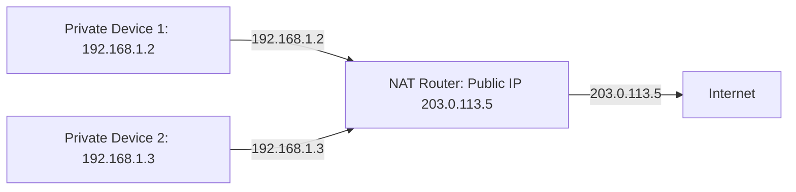

---

#### Code Snippet: Checking Your IP Address in Python

```python
import socket

hostname = socket.gethostname()
local_ip = socket.gethostbyname(hostname)
print(f"Local IP Address: {local_ip}")
```

---

## 2. How DNS Works

The **Domain Name System (DNS)** is the Internet’s "phonebook", translating human-friendly domain names (like `google.com`) into machine-readable IP addresses.

### DNS Resolution Process

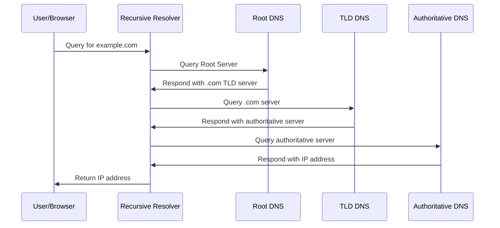

#### Where does DNS caching happen?
- Browser cache
- OS cache (e.g., `/etc/hosts`)
- Recursive resolver cache (ISP level)

**TTL (Time-To-Live)** determines how long a DNS record stays cached.

---

### DNS in Large-Scale Systems

- **Load balancing:** DNS can distribute traffic across servers.
- **Anycast DNS:** Serves users from the nearest DNS server for faster resolution.
- **CDN integration:** Directs users to the closest edge node.
- **Security:** Needs protection against DNS poisoning and DDoS.

---

## 3. The Client-Server Model

A foundational architecture where **clients** request services and **servers** respond.

**Examples:**
- Web: Browser (client) ↔ Web server
- API: Mobile app (client) ↔ Backend API server
- Database: App server (client) ↔ Database (server)

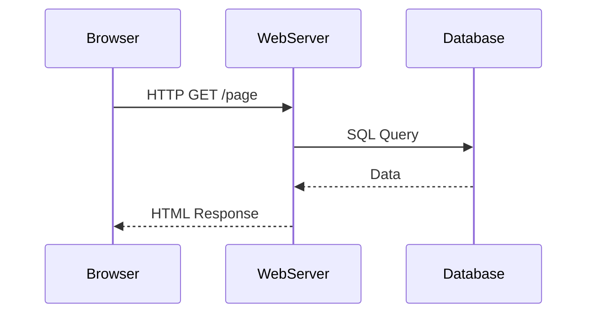

### Communication Patterns

- **Synchronous:** Client waits for a response (e.g., REST APIs)
- **Asynchronous:** Client proceeds without waiting (e.g., WebSockets, messaging)

### Stateless vs Stateful

- **Stateless:** Each request is independent (e.g., HTTP)
- **Stateful:** Session is maintained (e.g., WebSocket chat, multiplayer games)

---

## 4. Proxies: Forward vs Reverse

### What is a Proxy?

An intermediary server between clients and servers, used for security, caching, or routing.

#### Forward Proxy

- Sits **in front of clients**
- Hides user’s IP, filters requests, can cache responses
- Used for anonymity, content filtering, bypassing geo-blocks

#### Reverse Proxy

- Sits **in front of servers**
- Hides backend servers, handles load balancing, SSL offloading, caching
- Used for security, DDoS protection, performance

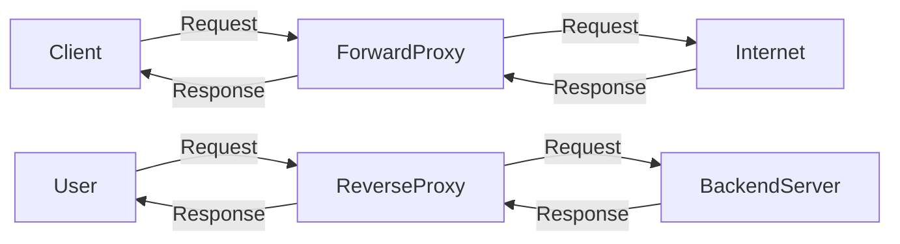

---

## 5. Load Balancing

Ensures system reliability, scalability, and high performance by distributing incoming traffic across multiple servers.

### Types

- **Layer 4 (Transport):** Distributes based on IP/port (TCP/UDP)
- **Layer 7 (Application):** Distributes based on content (URL, cookies)

### Strategies

- **Round Robin:** Sequentially rotates among servers
- **Least Connections:** Chooses server with fewest active connections
- **Weighted:** Assigns weights based on server capacity
- **IP Hashing:** Directs based on client IP

#### Example: Nginx Load Balancer Config

```nginx
http {
    upstream backend {
        server backend1.example.com weight=3;
        server backend2.example.com weight=1;
    }

    server {
        listen 80;
        location / {
            proxy_pass http://backend;
        }
    }
}
```

---

## 6. API Gateway

A centralized entry point for all API requests in modern microservices architectures.

### Key Functions

- **Authentication & Authorization** (OAuth, JWT, API keys)
- **Rate Limiting & Throttling**
- **Routing & Load Balancing**
- **Caching**
- **Request/Response Transformation**
- **Logging & Monitoring**

#### Diagram: API Gateway as Reverse Proxy

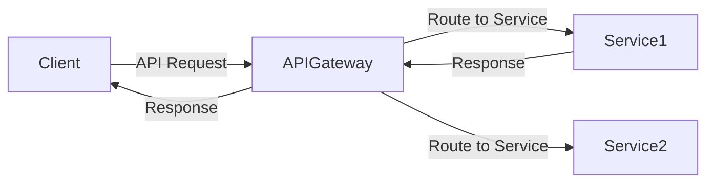

---

## 7. Content Delivery Networks (CDNs)

A **CDN** is a globally distributed network of servers designed to deliver content (static files, videos, APIs) efficiently.

### Why Use a CDN?

- Reduces latency (serves users from nearby edge nodes)
- Offloads origin servers
- Handles massive traffic & DDoS
- Optimizes bandwidth and cost

### How a CDN Works

1. User requests content (e.g., image, video)
2. CDN routes the request to the nearest edge server (PoP)
3. If cached (cache hit), content is delivered instantly
4. If not cached (cache miss), content fetched from origin and cached

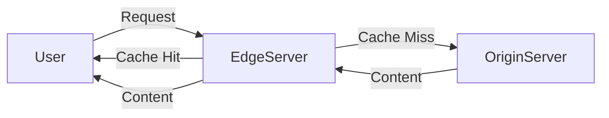

### Key Features

- **Caching & Replication:** Stores frequently accessed content at edge nodes
- **Load Balancing:** Across multiple PoPs
- **Compression:** Gzip, Brotli, image optimization
- **Security:** DDoS protection, SSL/TLS offloading

---

## Tips & Tricks for System Design Interviews

- **Always clarify requirements.** Ask about traffic volume, latency tolerance, security needs, etc.
- **Draw diagrams.** Visuals help communicate architecture clearly.
- **Discuss trade-offs.** E.g., stateful vs stateless, Layer 4 vs Layer 7 load balancers.
- **Plan for failure.** Include redundancy, failover, and fallback mechanisms.
- **Mention scalability strategies.** Use CDNs, load balancers, and microservices.
- **Highlight security.** Propose private IPs, reverse proxies, API gateways, and SSL.
- **Know your tools.** Be familiar with Nginx, HAProxy, AWS/GCP/Azure networking options, Cloudflare, etc.
- **Practice with real-world scenarios.** E.g., “How would you design a scalable chat app like WhatsApp?”

---

## Summary

- Networking is foundational to system design: enables communication, scalability, and security.
- Understanding IPs, DNS, client-server models, proxies, load balancers, API gateways, and CDNs is crucial for modern architectures.
- These concepts not only help in building robust systems but are also common topics in technical interviews.

---

**Next Up:** Deep dive into networking protocols – TCP, UDP, HTTP, and more!

---

*Have questions or want to see more code/diagram examples? Let us know in the comments!*

---

# Section 2

Certainly! Below is a **detailed Markdown blog section** that integrates the transcript and slides, focusing on **"Understanding IP Addresses in System Design"**. The section includes explanations, diagrams (in ASCII/Markdown format), code snippets, and a practical 'Tips and Tricks' section.

---

# Understanding IP Addresses in System Design

> _"Imagine trying to send a letter without an address. The postal service wouldn't know where to deliver it, and your letter would never reach its destination. The same principle applies to the internet. Every device needs an address to send and receive data. This is where IP addresses come in."_  

## What is an IP Address?

An **IP address (Internet Protocol address)** is a unique numerical label assigned to each device connected to a computer network that uses the Internet Protocol for communication. Think of it as a home address for your computer or phone—without it, your device would never receive the data you request!

**Key Purposes:**
- Identifies a device on a network.
- Enables routing of data between devices.

## Why Are IP Addresses Important in System Design?

- **Foundation of all networking**: Without IP addresses, devices couldn't locate or communicate with each other.
- **Crucial for scalability**: Managing and segmenting networks using IPs enables systems to grow.
- **Security and management**: Allows for isolation between internal and external systems, vital for cloud and corporate environments.

---

## IPv4 vs IPv6: The Two Versions

### IPv4 (Internet Protocol Version 4)

- **Most widely used addressing system**.
- **32-bit address format** (e.g., `192.168.1.1`).
- **~4.3 billion unique addresses**.
- Used in traditional networking, web servers, most internet devices.
- **Limitations**: Address exhaustion, fragmentation, and some security concerns.

#### IPv4 Address Format

```
+----+----+----+----+
|192 |168 | 1  | 15 |
+----+----+----+----+
```
Each group is called an **octet** (8 bits), separated by dots.

```python
# Python: Get local IPv4 address
import socket
hostname = socket.gethostname()
local_ip = socket.gethostbyname(hostname)
print(f"My IPv4 address: {local_ip}")
```

---

### IPv6 (Internet Protocol Version 6)

- **Next-generation IP**.
- **128-bit address format** (e.g., `2001:0db8:85a3:0000:0000:8a2e:0370:7334`).
- **340 undecillion (virtually unlimited) addresses**.
- Designed for IoT, mobile networks, future scalability.
- **Key benefits**: Larger address space, improved security, efficient routing.

#### IPv6 Address Format

```
2001:0db8:85a3:0000:0000:8a2e:0370:7334
```
Eight groups of four hexadecimal digits, separated by colons.

```bash
# Linux: Show IPv6 addresses
ip -6 addr show
```

---

### IPv4 vs. IPv6: At a Glance

| Feature       | IPv4                     | IPv6                                      |
|---------------|--------------------------|--------------------------------------------|
| Address Size  | 32 bits                  | 128 bits                                   |
| Example       | 192.168.1.1              | 2001:0db8:85a3:0000:0000:8a2e:0370:7334    |
| Address Space | ~4.3 billion              | 340 undecillion (3.4×10^38)                |
| Format        | Dotted decimal           | Colon-separated hexadecimal                |
| NAT Needed?   | Yes (for address sharing)| Not required (enough addresses for all)    |
| Security      | Optional (IPSec)         | Built-in security features                 |
| Deployment    | Universal                | Rapidly increasing, especially in IoT/cloud|

#### Diagram: Address Space Visualization

```
IPv4: [ 00000000.00000000.00000000.00000000 ] (32 bits)
IPv6: [ 0000:0000:0000:0000:0000:0000:0000:0000 ] (128 bits)
```

---

## Public vs. Private IP Addresses

### Public IP Addresses

- **Assigned by ISPs**.
- **Globally unique**; used to communicate over the Internet.
- Example: `192.203.23.45`.

### Private IP Addresses

- **Used within local networks** (homes, offices, data centers).
- **Not routable on the public Internet**; reusable in different networks.
- Typical ranges:
  - `10.0.0.0` – `10.255.255.255`
  - `172.16.0.0` – `172.31.255.255`
  - `192.168.0.0` – `192.168.255.255`

#### ASCII Diagram: Home Network Example

```
           [Internet]
                |
          [Public IP: 203.0.113.5]
                |
             [Router]
          /     |      \
[192.168.1.2] [192.168.1.3] [192.168.1.4]
   Laptop        TV           Phone
 (Private IPs - not visible to Internet)
```

- All devices inside the home share the same public IP for internet access, but each has a unique private IP within the local network.

---

## Why Do We Need Private IPs?

- **Address Conservation**: Allows reuse of IP ranges, avoiding exhaustion of public IPv4 space.
- **Enhanced Security**: Devices with private IPs are not directly accessible from the internet.
- **Efficient Network Management**: Internal communication is separated from external exposure.
- **Cost-Effective**: Reduces the number of public IPs needed.

---

### Network Address Translation (NAT) in Action

NAT is a mechanism that translates private IP addresses to a public IP for internet communication.

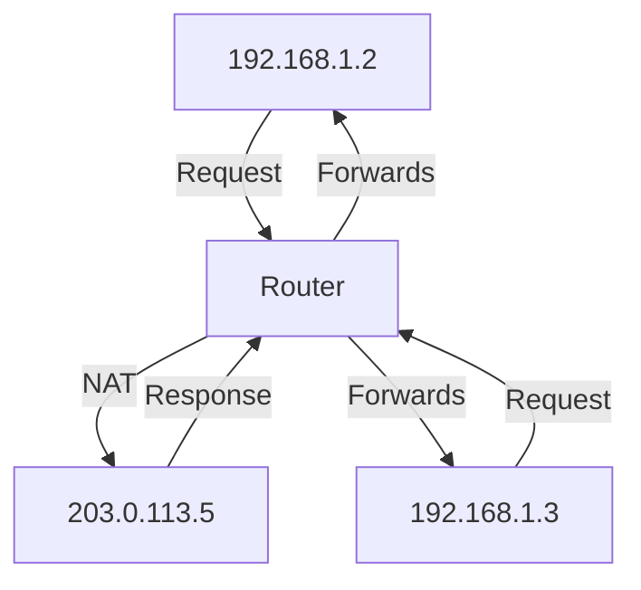

- Multiple devices share one public IP via NAT.

---

## Role of IPs in System Design

- **Scalability**: Use private IPs to create large, distributed, multi-region architectures (e.g., microservices in the cloud).
- **Security**: Isolate internal services with firewalls and VPNs using private IPs.
- **Load Balancing**: Use IPs to distribute traffic among servers.
- **Cloud Networking**: Manage both public and private IPs for flexible and secure deployments (AWS, GCP, Azure).
- **Microservices**: Internal services communicate using private IPs, exposed to the internet via public IPs and load balancers.

---

## Practical Code Snippet: Checking Your IP Addresses

### Get Your Local (Private) IP Address

```python
# Python: Get all local (private) IP addresses
import socket

def get_local_ips():
    hostname = socket.gethostname()
    ips = socket.gethostbyname_ex(hostname)[2]
    return ips

print("Local (private) IP addresses:", get_local_ips())
```

### Get Your Public IP Address

```bash
# Bash: Get your public IP address (requires curl)
curl ifconfig.me
```

---

## Tips and Tricks for System Design Interviews

- **Always clarify**: Are you being asked about public or private IPs? Their roles differ significantly.
- **Remember ranges**: Know the standard private IP ranges (10.x.x.x, 172.16-31.x.x, 192.168.x.x).
- **Mention NAT**: For IPv4, highlight how NAT enables homes/offices to share a single public IP.
- **IPv6 is the future**: Stress that IPv6 solves the address exhaustion problem and brings better security and performance.
- **Design for scalability**: Use private IPs internally and public IPs only where needed (e.g., front-end load balancers).
- **Security first**: Keep internal services on private IPs; control access with firewalls and VPNs.
- **Draw diagrams**: Visually represent network topology in interviews or documentation.

---

## Key Takeaways

- **IPv4 vs. IPv6**: IPv4 is common but limited; IPv6 offers vast address space and new features.
- **Public vs. Private**: Public IPs are unique and internet-facing; private IPs are internal and reusable.
- **System Design**: Correct IP management is crucial for scalability, security, and performance in modern distributed systems.

---

> **Next Up:** How do human-friendly domain names map to these machine-friendly IP addresses? Stay tuned for our deep dive into the Domain Name System (DNS)!

---

**References & Further Reading:**
- [IETF RFC 1918: Address Allocation for Private Internets](https://datatracker.ietf.org/doc/html/rfc1918)
- [What is IPv6? (Cloudflare)](https://www.cloudflare.com/learning/network-layer/what-is-ipv6/)
- [AWS VPC Documentation](https://docs.aws.amazon.com/vpc/latest/userguide/VPC_Subnets.html)

---

**Want to master more system design topics?**  
[Subscribe for the next section: DNS, Proxies, Load Balancers, API Gateways, and CDNs!]

---

**Diagram Key:**  
- Boxes with brackets represent devices or network nodes.  
- IP addresses in examples are for illustration; use real addresses in practice.

---

## FAQ

**Q: Can two devices on the global internet have the same public IP?**  
A: No. Public IP addresses are unique globally. However, many devices can share the same public IP behind a NAT within a private network.

**Q: Is IPv6 backward compatible with IPv4?**  
A: No. IPv6 and IPv4 are separate protocols. Devices and networks often run both in parallel (dual stack).

---

**Happy System Designing!** 🚀

---

# Section 3

# How DNS Works in System Design: Deep Dive with Code, Diagrams, and Best Practices

In the world of distributed systems and web-scale applications, **networking** is the backbone that connects clients, servers, APIs, and services. Among the foundational networking components, the **Domain Name System (DNS)** is critical for usability, scalability, and performance. This blog post integrates detailed transcript explanations and key slide concepts to demystify DNS—exploring how it works, why it matters, how it’s optimized, and what you need to consider for system design and interviews.

---

## Table of Contents

1. [What is DNS?](#what-is-dns)
2. [Types of DNS Servers](#types-of-dns-servers)
3. [DNS Caching and Performance](#dns-caching-and-performance)
4. [DNS Resolution: Step-by-Step](#dns-resolution-step-by-step)
5. [DNS in Large-Scale Systems](#dns-in-large-scale-systems)
6. [DNS Security Considerations](#dns-security-considerations)
7. [Code Snippet: Querying DNS in Python](#code-snippet-querying-dns-in-python)
8. [Diagrams: DNS Architecture & Resolution Flow](#diagrams-dns-architecture--resolution-flow)
9. [Tips and Tricks for System Design and Interviews](#tips-and-tricks-for-system-design-and-interviews)

---

## What is DNS?

DNS (Domain Name System) is often called the **phone book of the Internet**. Its main job is to translate **human-readable domain names** (like `google.com`) into **machine-friendly IP addresses** (`142.250.190.78`), enabling seamless connectivity.

### Why is DNS Critical?

- **Usability:** Without DNS, users would need to remember numeric IP addresses for every website.
- **Scalability:** DNS provides a hierarchical, distributed system that can handle billions of devices.
- **Performance:** Through caching and geographic distribution, DNS speeds up website access.
- **Foundation for Modern Networking:** Key for load balancing, CDNs, failover, and cloud architectures.

---

## Types of DNS Servers

DNS resolution is a collaborative process involving several specialized servers:

| Server Type                 | Role                                                                                           |
|-----------------------------|------------------------------------------------------------------------------------------------|
| **Root Name Servers**       | Direct queries for TLDs (e.g., `.com`, `.org`) to the correct TLD name servers.               |
| **TLD Name Servers**        | Manage domains under a specific TLD (e.g., `google.com`, `amazon.com`).                       |
| **Authoritative Name Servers** | Store actual DNS records (A, CNAME, MX, etc.) and resolve domains to IP addresses.           |
| **Recursive Resolvers**     | Provided by ISPs or organizations; perform lookups on behalf of clients and cache results.    |

---

## DNS Caching and Performance

### Why is Caching Important?

- **Reduces Latency:** Cached records allow instant DNS resolution.
- **Lowers Server Load:** Fewer queries hit the authoritative servers.
- **Improves User Experience:** Faster page loads, especially for repeat visits.

### Where Does DNS Caching Happen?

1. **Browser Cache**
2. **Operating System Cache**
3. **Recursive Resolver Cache (ISP Level)**
4. **Authoritative Server Cache (optional for negative responses)**

### The Role of TTL (Time-to-Live)

- **TTL** determines how long a DNS record stays in cache.
    - **Short TTL:** Faster updates, higher traffic to DNS servers.
    - **Long TTL:** Lower DNS traffic, but slower propagation of record changes.

---

## DNS Resolution: Step-by-Step

Here’s what happens when you type `google.com` in your browser:

1. **Browser Cache Check:** Is the IP address already cached? If yes, use it.
2. **OS Cache Check:** If not in browser, the OS checks its own cache.
3. **Query to Recursive Resolver:** If the OS doesn’t know, it asks the local DNS resolver (usually at your ISP).
4. **Cache Check at Resolver:** If resolver has it cached, it responds immediately.
5. **Root Server Query:** If not, resolver queries a root name server.
6. **TLD Server Query:** Root server directs to the relevant TLD name server.
7. **Authoritative Name Server Query:** TLD server directs to the authoritative name server for `google.com`.
8. **IP Address Returned:** Authoritative server responds with the IP address.
9. **Caches Populated:** Every layer caches the response for future requests.
10. **Browser Connects to IP:** Browser uses the IP to fetch the website.

---

## DNS in Large-Scale Systems

DNS is a keystone in **scalable, resilient architectures**:

- **DNS Load Balancing:** Distributes user requests across multiple servers (e.g., round-robin DNS, geo-based routing).
- **Anycast DNS:** Multiple DNS servers share the same IP; users are routed to the nearest, fastest server.
- **Failover:** Primary and secondary DNS servers ensure availability if one goes down.
- **Content Delivery Networks (CDN):** DNS routes users to the nearest edge server for fast content delivery.

---

## DNS Security Considerations

DNS is a frequent target for cyber attacks:

- **DNS Cache Poisoning:** Attackers inject false records into DNS caches, redirecting users to malicious sites.
- **DDoS Attacks:** Overwhelm DNS servers with requests, making websites unreachable.
- **Mitigation:** Use DNSSEC (DNS Security Extensions), monitoring, and secure configurations to protect infrastructure.

---

## Code Snippet: Querying DNS in Python

Want to see DNS in action? Here’s a quick Python example using [dnspython](https://www.dnspython.org/):

```python
import dns.resolver

def resolve_domain(domain):
    try:
        result = dns.resolver.resolve(domain, 'A')
        for ipval in result:
            print(f"{domain} has IP address: {ipval.to_text()}")
    except Exception as e:
        print(f"Could not resolve {domain}: {e}")

resolve_domain('google.com')
```

**Output:**
```
google.com has IP address: 142.250.190.78
```

---

## Diagrams: DNS Architecture & Resolution Flow

### DNS Server Hierarchy

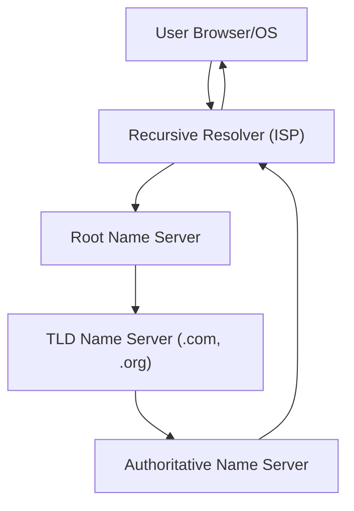

### DNS Resolution Flow

```
User (Browser) 
  |
  v
Browser Cache --> OS Cache --> Recursive Resolver (ISP) --> Root Server --> TLD Server --> Authoritative Server
                                                                                               |
                                                                                               v
                                                                               IP Address Response
```

---

## Tips and Tricks for System Design and Interviews

### DNS Best Practices

- **Set Appropriate TTLs:** Balance between freshness and efficiency. Short TTLs for frequently updated records, longer for static domains.
- **Use Multiple DNS Providers:** Improve redundancy with primary and secondary DNS providers.
- **Monitor DNS Health:** Use health checks and alerts for failover.
- **Leverage Anycast for Global Scale:** Deploy DNS servers in multiple regions for faster resolution.
- **Implement DNSSEC:** Protect against cache poisoning and DNS spoofing.
- **Optimize Caching Layers:** Educate on cache hierarchies—browser, OS, resolver.
- **Document DNS Changes:** Keep detailed records for auditing and rollback.

### Common Interview Questions

- Explain the DNS resolution process step by step.
- What is the difference between authoritative and recursive DNS servers?
- How does DNS caching improve performance? Where does it occur?
- What is TTL in DNS, and why is it important?
- How does DNS-based load balancing work in large-scale systems?
- What are common DNS-related security threats, and how can they be mitigated?

---

## Summary

DNS is far more than a simple lookup service—it’s a critical enabler of performance, scalability, and security in modern systems. Understanding its architecture, caching mechanisms, and role in large-scale infrastructures is essential for system design, operations, and security. Whether you’re prepping for interviews or designing next-generation web apps, mastering DNS fundamentals will serve you well.

**Next up:** Deep dive into the Client-Server Model and how it powers everything from web browsing to cloud computing.

---

**Further Reading:**

- [RFC 1035: Domain Names Implementation and Specification](https://www.rfc-editor.org/rfc/rfc1035)
- [Google Public DNS Documentation](https://developers.google.com/speed/public-dns/docs/using)
- [DNSSEC – DNS Security Extensions](https://www.icann.org/resources/pages/dnssec-what-is-it-why-important-2019-03-05-en)

---

> **Want more system design insights?** Stay tuned for the next article on the Client-Server Model and practical networking architecture patterns!


# Section 4

Certainly! Below is a **detailed Markdown blog section** that integrates both the **transcript** and the **slides** you provided, covering the **Client-Server Model** as part of a system design series. It includes clear explanations, diagrams (using [Mermaid](https://mermaid-js.github.io/mermaid/), which can render in many Markdown viewers), code snippets, and a practical 'Tips and Tricks' section.

---

# Mastering System Design: The Client-Server Model Explained

## Introduction

In the world of modern computing, **networking and communication** form the backbone of scalable, high-performance systems. Whether you’re browsing the web, using your favorite app, or streaming a movie, you interact with the **client-server model** every day. Understanding this model is fundamental for developers, architects, and anyone preparing for system design interviews.

This section covers:

- What the client-server model is
- How clients and servers communicate
- Real-world applications and patterns (synchronous vs. asynchronous, stateless vs. stateful)
- Request-response cycle (with code examples)
- Tips and tricks for system design interviews

---

## What is the Client-Server Model?

The **client-server model** is a distributed application structure that separates tasks between service requesters (clients) and service providers (servers).

**Diagram: Client-Server Model**

```mermaid
graph TD
  C[Client<br>(Browser, App, Device)] -- Request --> S[Server<br>(Web Server, DB, API)]
  S -- Response --> C
  note over C,S: Communication happens over a network (Internet, LAN, Wi-Fi, etc.)
```

**Key Components:**

- **Client:** The user-facing application (web browser, mobile app, API consumer) that initiates a request.
- **Server:** Processes the request and sends back a response (web server, database server, mail server).
- **Network:** The medium (Internet, LAN, Wi-Fi, 5G, etc.) that connects clients and servers.

---

## Why is the Client-Server Model Important?

- **Resource Management:** Centralizes computation, storage, and management on powerful servers rather than individual devices.
- **Scalability:** Easy to add or remove resources at the server side as demand changes.
- **Seamless Communication:** Standardizes data exchange between diverse devices and platforms.
- **Real-World Applications:** Powers everything from web browsing and email to cloud services, APIs, and IoT.

---

## How Clients and Servers Communicate

### The Basic Request-Response Cycle

Every digital action—opening a website, sending an email, fetching an API—follows a basic pattern:

1. **Client sends a request** (GET, POST, SQL query, etc.)
2. **Network transmits the request** to the server
3. **Server processes the request** (fetches data, computes results)
4. **Server sends a response** back
5. **Client processes the response** (displays webpage, updates UI, etc.)

**Mermaid Sequence Diagram:**

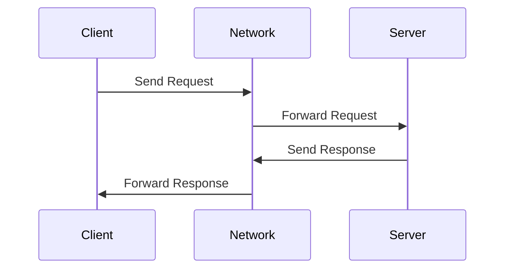

---

### Types of Communication

#### 1. **Request-Response (Synchronous)**
- **Pattern:** Client sends a request and waits for the server’s response before proceeding.
- **Examples:** HTTP requests, REST APIs, form submissions.

#### 2. **Persistent Connection (Asynchronous)**
- **Pattern:** Client and server maintain an open connection for real-time, two-way communication.
- **Examples:** WebSockets (live chat, notifications), FTP sessions, multiplayer games.

---

## Example: HTTP Request-Response Cycle

Let’s walk through what happens when you load a website (`https://example.com`) in your browser.

1. **DNS Lookup:** Browser resolves domain to an IP address.
2. **Browser sends HTTP GET request** to the web server.
3. **Server processes request:** Queries database, generates HTML.
4. **Server responds:** Sends HTML, CSS, JS files, status code (200 OK or 404 Not Found).
5. **Browser processes response:** Renders the page.

**Code Example: Simple HTTP Client in Python**

```python
import requests

response = requests.get('https://example.com')
print(response.status_code)  # 200
print(response.text)         # HTML content of the page
```

---

## Synchronous vs. Asynchronous Communication

| Feature           | Synchronous                         | Asynchronous                     |
|-------------------|-------------------------------------|----------------------------------|
| Client Waits?     | Yes                                 | No                               |
| Typical Pattern   | Blocking (waits for response)       | Non-blocking (can do other work) |
| Example           | REST API call, form submission      | WebSocket chat, AJAX, polling    |

**Analogy:**  
- *Synchronous*: Calling a friend and waiting for them to answer before hanging up.  
- *Asynchronous*: Sending a text message and doing other things while waiting for a reply.

---

## Stateless vs. Stateful Servers

| Feature             | Stateless                          | Stateful                          |
|---------------------|------------------------------------|-----------------------------------|
| Session Memory?     | No memory of past requests         | Maintains session info            |
| Scalability         | High (easy to distribute/caching)  | Harder (sessions must be tracked) |
| Example             | REST APIs, HTTP servers            | WebSockets, online games, banking |

**Practical Example:**

- **Stateless:**  
  Every API call to a REST service must include all needed information (e.g., authentication token), because the server does not remember previous requests.
- **Stateful:**  
  A WebSocket server remembers each user’s connection, allowing for real-time chat or game state to persist.

---

## Real-World Examples

- **Web Browsing:**  
  Browser (client) requests pages from a web server.
- **API Calls:**  
  Mobile app (client) fetches data from backend APIs (server).
- **Database Queries:**  
  Application server (client) queries a database server.
- **Messaging:**  
  WhatsApp or Slack uses WebSockets to maintain a persistent connection for real-time communication.

---

## Code Snippet: Simple HTTP Server

Here’s how you could implement a minimal HTTP server in Python:

```python
from http.server import HTTPServer, BaseHTTPRequestHandler

class SimpleHandler(BaseHTTPRequestHandler):
    def do_GET(self):
        self.send_response(200)
        self.end_headers()
        self.wfile.write(b'Hello, Client-Server World!')

if __name__ == '__main__':
    server_address = ('', 8000)
    httpd = HTTPServer(server_address, SimpleHandler)
    print("Serving on port 8000...")
    httpd.serve_forever()
```

**Test it:**  
Open your browser to `http://localhost:8000` and see the response.

---

## Tips and Tricks for System Design Interviews

1. **Clarify Requirements:**  
   Ask whether the system needs to be stateless or stateful. Stateless systems scale more easily; stateful ones are required for sessions and personalization.

2. **Consider Scalability:**  
   Use stateless servers and load balancers for large-scale systems. For real-time features (chat), stateful or persistent connections are needed.

3. **Network Efficiency:**  
   Minimize data transfer. Use compression, caching (CDN, HTTP cache), and optimize request/response payloads.

4. **Security First:**  
   Always authenticate and authorize requests. Use HTTPS for all communications.

5. **Choose the Right Protocol:**  
   HTTP is great for request-response. Use WebSockets or gRPC for real-time, bi-directional communication.

6. **Logging and Monitoring:**  
   Implement request/response logging, error tracking, and metrics to monitor system health.

7. **Handle Failures Gracefully:**  
   Design with retries, fallbacks, and error handling for network failures or server downtime.

---

## Sample System Design Interview Questions

- What is the client-server model, and how does it work?
- How does a browser load a webpage? Walk through the request-response cycle.
- Explain the difference between stateless and stateful servers. When would you use each?
- How can you design a scalable client-server architecture for millions of users?
- What are the security challenges in the client-server model?
- How does WebSocket communication differ from REST APIs?
- How would you implement load balancing in a client-server system?

---

## Conclusion

The **client-server model** is at the heart of most modern computing systems. Mastering its principles—request/response cycles, synchronous vs. asynchronous communication, stateless vs. stateful servers—will help you design, build, and scale reliable applications. Whether you’re prepping for interviews or architecting next-gen systems, these fundamentals are essential building blocks.

**Next Up:**  
We’ll dive deeper into **Forward Proxy vs. Reverse Proxy**, exploring how intermediaries can optimize security, load balancing, and performance.

---

*Keep exploring, keep learning, and stay tuned for the next section in our System Design Fundamentals series!*

---

**Resources:**  
- [Python http.server Documentation](https://docs.python.org/3/library/http.server.html)
- [MDN Web Docs: HTTP Overview](https://developer.mozilla.org/en-US/docs/Web/HTTP/Overview)
- [Mermaid Live Editor](https://mermaid-js.github.io/mermaid-live-editor/)

---

# Section 5

Certainly! Below is a **detailed Markdown blog section** that integrates the transcript and slides on **Forward Proxy vs Reverse Proxy**, including explanations, diagrams (in Markdown/ASCII), code snippets, and a 'Tips and Tricks' section. The content is tailored for developers and system design interview prep.

---

# Forward Proxy vs Reverse Proxy in System Design

In modern distributed architectures, **proxies** play a crucial role in securing, optimizing, and managing network traffic. However, not all proxies are created equal. Two fundamental types—**forward proxies** and **reverse proxies**—serve very different purposes. Understanding their differences, use cases, and implementation strategies is essential for designing scalable, secure, and high-performance systems.

---

## What is a Proxy?

A **proxy server** acts as an intermediary between a client (browser, app, etc.) and a server (web server, API, etc.). Instead of clients communicating directly with servers, requests pass through a proxy, which can inspect, modify, or redirect them.

**Key Benefits of Proxies:**
- Security: Protect clients and servers from threats.
- Caching: Store frequently accessed content to reduce latency.
- Traffic Control: Efficiently distribute requests, preventing overload.
- Anonymity: Mask client IPs to maintain privacy.

---

## Forward Proxy

A **forward proxy** sits between the client and the internet. It acts on behalf of the client, forwarding client requests to servers.

### How It Works

```
[Client] ---> [Forward Proxy] ---> [Internet/Server]
```

**Flow:**
1. Client sends a request to the forward proxy.
2. Proxy evaluates the request (may filter or log).
3. Proxy forwards the request to the destination server.
4. Server responds to the proxy.
5. Proxy returns the response to the client.

### Use Cases

- **Content Filtering:** Restrict access to certain sites (e.g., in companies or schools).
- **Anonymity:** Hide client IPs (VPNs, TOR).
- **Bypass Geo-restrictions:** Access blocked content from other regions.
- **Caching:** Reduce bandwidth and accelerate web access.

### Example: Python Requests via Forward Proxy

```python
import requests

proxies = {
    "http": "http://forward-proxy.example.com:3128",
    "https": "http://forward-proxy.example.com:3128",
}

response = requests.get("http://example.com", proxies=proxies)
print(response.text)
```

---

## Reverse Proxy

A **reverse proxy** sits in front of backend servers. Clients interact with the reverse proxy, which in turn communicates with the servers.

### How It Works

```
[Client] ---> [Reverse Proxy] ---> [Backend Servers]
```

**Flow:**
1. Client sends a request to the reverse proxy.
2. Reverse proxy evaluates, authenticates, or manipulates the request.
3. Proxy forwards the request to the appropriate backend server.
4. Server responds to the proxy.
5. Proxy returns the response to the client.

### Use Cases

- **Load Balancing:** Distribute incoming requests across multiple servers.
- **Caching:** Store frequently requested resources to improve performance.
- **Security & DDoS Protection:** Hide backend servers, filter malicious traffic.
- **SSL Termination:** Offload SSL/TLS encryption from backend servers.

### Example: NGINX as a Reverse Proxy

**nginx.conf**
```nginx
server {
    listen 80;

    location / {
        proxy_pass http://backend_servers;
        proxy_set_header Host $host;
        proxy_set_header X-Real-IP $remote_addr;
    }
}

upstream backend_servers {
    server app1.internal:8080;
    server app2.internal:8080;
}
```

---

## Forward Proxy vs Reverse Proxy: Key Differences

| Aspect           | Forward Proxy                      | Reverse Proxy                              |
|------------------|-----------------------------------|--------------------------------------------|
| Placement        | In front of clients                | In front of backend servers                |
| Protects         | Clients                           | Servers                                    |
| Use Case         | Anonymity, filtering, caching     | Load balancing, security, caching          |
| Common Users     | Individuals, organizations        | Web apps, APIs, cloud services             |
| Examples         | Squid, VPN, Tor                   | NGINX, HAProxy, Cloudflare, AWS ELB        |
| Visibility       | Hides client from server          | Hides server from client                   |

---

## Diagram: Proxy Placement in Network

```ascii
          [Client]
              |
      -----------------
      |               |
[Forward Proxy]   (Direct, no proxy)
      |
  [Internet]
      |
[Reverse Proxy]
      |
[Backend Servers]
```

---

## Tips and Tricks for System Design Interviews

- **When to use a Forward Proxy?**  
  - Use when clients need anonymity, content filtering, or must bypass restrictions.
  - Example: Corporate environment restricting social media access.

- **When to use a Reverse Proxy?**  
  - Use when you need to scale backend services, balance load, add security layers, or centralize SSL.
  - Example: Deploying an e-commerce platform serving millions of users.

- **Common Pitfalls:**
  - Don’t confuse direction: Forward proxy = client-side; Reverse proxy = server-side.
  - Avoid exposing backend servers directly—always use a reverse proxy for public-facing services.
  - Remember caching exists in both, but for different reasons and different content.

- **Interview Ready Phrases:**
  - “A forward proxy is client-facing, mainly for outbound traffic; a reverse proxy is server-facing, mainly for inbound traffic.”
  - “Reverse proxies enable seamless scaling and high availability by distributing requests across backend servers.”

- **Real-World Examples:**
  - Forward Proxy: Corporate web proxy, VPN, Tor exit node.
  - Reverse Proxy: NGINX as load balancer, Cloudflare for DDoS protection, API Gateway.

---

## Quick Code: Testing Forward Proxy with cURL

```bash
curl -x http://proxy.example.com:8080 http://example.com
```

## Quick Code: Testing Reverse Proxy (NGINX)

```nginx
location /api/ {
    proxy_pass http://api-backend.internal/;
}
```

---

## Conclusion

Both forward and reverse proxies are vital tools in the system designer’s toolkit. They act as intermediaries, but **serve very different roles**—forward proxies protect and manage client requests, while reverse proxies optimize and secure backend services.

**Mastering these concepts enables you to:**
- Enhance system security and privacy
- Optimize performance and scalability
- Design robust, resilient network architectures

---

## Further Reading

- [NGINX Reverse Proxy Documentation](https://docs.nginx.com/nginx/admin-guide/web-server/reverse-proxy/)
- [Squid Forward Proxy](http://www.squid-cache.org/)
- [Cloudflare: What is a Reverse Proxy?](https://www.cloudflare.com/learning/cdn/glossary/reverse-proxy/)

---

**Up Next:**  
📚 _Dive deeper into load balancers, API gateways, and CDN architectures!_

---

# Section 6

Certainly! Here's a detailed Markdown blog section that integrates both the **transcript** and **slides** about Load Balancing within the broader context of Networking & Communication in System Design, complete with code snippets, diagrams (as ASCII), and a 'Tips and Tricks' section.

---

# Mastering Load Balancing in System Design

Load balancing is a foundational building block in scalable, reliable, and high-performing system architectures. Whether you're designing for millions of users or just want smooth user experiences, understanding load balancing—its types, strategies, and real-world applications—is non-negotiable for any aspiring system designer.

---

## Why Load Balancing Matters

Modern applications must handle fluctuating traffic, minimize downtime, and ensure fast response times. **Load balancers** sit between clients and backend servers, distributing requests efficiently to prevent any one server from being overwhelmed.

### Key Benefits

- **High Availability:** Keeps systems running even during traffic spikes or server failures.
- **Traffic Distribution:** Spreads requests evenly, so no single server bears excessive load.
- **Failure Handling:** Automatically redirects traffic if a server becomes unhealthy.
- **Improved Performance:** Reduces latency by routing requests to the least busy or fastest server.
- **Scalability:** Easily add servers as your application grows—load balancers distribute requests automatically.

> **Real-World Example:**  
> Consider a high-traffic e-commerce platform during a sale. Without load balancing, a single server could easily be swamped, causing slow performance or downtime. With load balancing, requests are smoothly distributed, ensuring a seamless experience for all users.

---

## Types of Load Balancers

Load balancers can be categorized by **network layer** and **deployment model**.

### 1. By Network Layer

#### Layer 4 Load Balancers (Transport Layer)
- Operate at TCP/UDP level.
- Make routing decisions based on IP addresses and ports.
- **Very fast, ideal for raw network traffic.**
- **Example:** AWS Network Load Balancer, HAProxy (L4 mode).

#### Layer 7 Load Balancers (Application Layer)
- Operate at HTTP/HTTPS level.
- Inspect the actual content—HTTP headers, cookies, URLs.
- Can route requests based on content (e.g., send `/checkout` to a different server pool).
- **Example:** AWS Application Load Balancer, NGINX.

```text
+-------------------+
|   Client Request  |
+---------+---------+
          |
          v
    +-----+------+
    | Load       |   Layer 4:  IP/Port based
    | Balancer   |   Layer 7:  Content-aware
    +-----+------+
          |
   +------+------+------+
   |             |      |
+--+--+       +--+--+ +--+--+
| S1 |       | S2 | | S3 |
+-----+       +-----+ +-----+
```

### 2. By Deployment Model

- **Hardware Load Balancers:** Dedicated devices for enterprises and data centers. (e.g., F5 BIG-IP)
- **Software Load Balancers:** Run on general servers or VMs. Flexible and cost-effective. (e.g., NGINX, HAProxy, Envoy)
- **Cloud-Based Load Balancers:** Managed by cloud providers, offer auto-scaling and easy integration. (e.g., AWS ELB, GCP Load Balancer, Azure Load Balancer)

---

## Load Balancing Strategies

The strategy you choose impacts performance, reliability, and cost. Strategies are broadly classified as **static** or **dynamic**.

### Static Load Balancing

#### 1. Round Robin
Distributes requests sequentially across servers.

```python
# Round Robin Example (Python)
servers = ['S1', 'S2', 'S3']
request_count = 0
def get_next_server():
    global request_count
    server = servers[request_count % len(servers)]
    request_count += 1
    return server
```

#### 2. Least Connections
Routes new requests to the server with the fewest active connections.

#### 3. IP Hashing
Routes requests based on a hash of the client’s IP, providing session persistence.

```python
# IP Hashing Example
import hashlib
def get_server_by_ip(client_ip, servers):
    index = int(hashlib.sha256(client_ip.encode()).hexdigest(), 16) % len(servers)
    return servers[index]
```

### Dynamic Load Balancing

#### 1. Least Response Time
Routes to the server with the fastest current response.

#### 2. Adaptive Load Balancing
Dynamically adjusts based on real-time metrics (CPU, memory, health).

#### 3. Weighted Load Balancing
Assigns more traffic to higher-capacity servers.

```python
# Weighted Round Robin Example
servers = [('S1', 3), ('S2', 1)]  # (server, weight)
def weighted_round_robin(request_id):
    flat_list = [s for s, w in servers for _ in range(w)]
    return flat_list[request_id % len(flat_list)]
```

---

## Load Balancers in Action (ASCII Diagram)

```text
                       +--------------+
                       |    Client    |
                       +------+-------+
                              |
                              v
                       +------+-------+
                       |  Load        |
                       |  Balancer    |
                       +----+---+-----+
                            |   |
                 +----------+   +----------+
                 |                         |
          +------+-----+            +------+-----+
          |   Server 1 |            |   Server 2 |
          +------+-----+            +------+-----+
                 \                          /
                  +------------------------+
                    (More backend servers)
```

**How it works:**  
- Client sends a request to the Load Balancer.
- Load Balancer chooses a backend server based on the configured strategy.
- If a server fails, the Load Balancer reroutes traffic to healthy servers.

---

## Choosing the Right Load Balancer

**Considerations:**
- **Layer:** L4 for speed, L7 for content-aware routing.
- **Scalability:** Will you need auto-scaling? Use cloud-based solutions.
- **Security:** Need SSL termination or DDoS protection?
- **Cost & Flexibility:** Software load balancers are more flexible, hardware for enterprise performance.
- **Use Case:** API gateways, microservices, high-traffic web apps, etc.

---

## Tips and Tricks for Load Balancing

- **Monitor Health:** Always enable health checks for backend servers.
- **Sticky Sessions:** Use session persistence (IP hash, cookies) if user state is needed.
- **SSL Offloading:** Terminate SSL at the load balancer to reduce backend load.
- **Auto Scaling:** For cloud setups, integrate load balancers with auto-scaling groups.
- **Rate Limiting:** Prevent abuse by integrating rate limiting at the load balancer or API gateway.
- **Failover:** Design for graceful failover—use multiple load balancers or DNS-based failover.
- **Logging & Monitoring:** Track traffic, errors, and latency at the load balancer for troubleshooting and analytics.
- **Security:** Use WAFs (Web Application Firewalls) and DDoS protection features available on most advanced load balancers.

---

## Interview Quick Reference

- **What is load balancing and why is it important?**  
Distributes traffic to ensure high availability, performance, and reliability.

- **Layer 4 vs. Layer 7 Load Balancers?**
    - L4: Fast, IP/Port-based.
    - L7: Content-aware, supports complex rules.

- **Static vs. Dynamic strategies?**
    - Static: Predefined rules, simple.
    - Dynamic: Adapt to real-time load/health.

- **How does a load balancer improve security?**
    - Can perform SSL/TLS termination, DDoS filtering, hide backend servers.

---

## Further Reading

- [NGINX as a Load Balancer](https://docs.nginx.com/nginx/admin-guide/load-balancer/http-load-balancer/)
- [AWS Elastic Load Balancing](https://aws.amazon.com/elasticloadbalancing/)
- [HAProxy Documentation](https://www.haproxy.org/)
- [Kubernetes Ingress Controllers](https://kubernetes.io/docs/concepts/services-networking/ingress-controllers/)

---

**Next up:**  
We'll dive into **API Gateways**—their role in system design, how they relate to load balancers, and best practices for microservices.

---

**Stay tuned for more on system design networking essentials!** 🚀

# Section 7

Certainly! Here’s a detailed Markdown blog section that integrates the **API Gateway** and **Content Delivery Networks (CDN)** topics, drawing from your transcript and slides. This section will include explanations, diagrams (in ASCII/Markdown), code snippets, and a **Tips and Tricks** section.

---

# API Gateways & CDNs: Modern System Design Essentials

In today’s world of distributed systems and microservices, delivering fast, secure, and reliable applications is a challenge. Two critical components help architects meet these demands: **API Gateways** and **Content Delivery Networks (CDNs)**. Understanding them is fundamental for mastering system design.

---

## 1. What is an API Gateway?

An **API Gateway** is a server that acts as a centralized entry point for all client requests to your backend services. It is responsible for request routing, composition, protocol translation, authentication, rate limiting, caching, logging, and more.

**Key Functions:**
- **Security**: Authentication, authorization, DDoS protection, SSL termination.
- **Routing**: Forwards requests to the correct backend service.
- **Traffic Control**: Rate limiting, throttling, and load balancing.
- **Caching**: Stores common responses to reduce backend load and response time.
- **Transformation**: Modifies request/response formats.
- **Monitoring**: Centralized logging and metrics.

### **API Gateway Diagram**

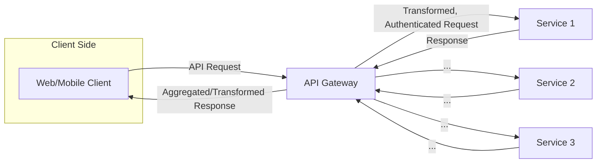

---

### **Sample API Gateway Implementation (Node.js with Express & http-proxy-middleware)**

```js
const express = require('express');
const { createProxyMiddleware } = require('http-proxy-middleware');
const rateLimit = require('express-rate-limit');
const app = express();

// Rate Limiting
const limiter = rateLimit({
  windowMs: 1 * 60 * 1000, // 1 minute window
  max: 60 // limit each IP to 60 requests per windowMs
});
app.use(limiter);

// Simple auth middleware
app.use((req, res, next) => {
  if (req.headers['x-api-key'] !== 'your-api-key') {
    return res.status(401).send('Unauthorized');
  }
  next();
});

// Proxy setup
app.use('/service1', createProxyMiddleware({ target: 'http://localhost:5001', changeOrigin: true }));
app.use('/service2', createProxyMiddleware({ target: 'http://localhost:5002', changeOrigin: true }));

app.listen(3000, () => console.log('API Gateway running on port 3000'));
```

---

## 2. What is a Content Delivery Network (CDN)?

A **CDN** is a globally distributed network of edge servers that cache and deliver content (static and sometimes dynamic) closer to your users, reducing latency and improving load times.

**Key CDN Features:**
- **Caching & Replication**: Stores content at edge locations for quick delivery.
- **Load Balancing & Failover**: Directs traffic to the best-performing edge, reroutes on failure.
- **Compression & Optimization**: Reduces file sizes (images, JS, CSS) for faster loading.
- **Security**: DDoS mitigation, SSL/TLS termination, and bot protection.

### **CDN Architecture Diagram**

```plaintext
           +-----------------+
           | Origin Server   |
           +-----------------+
                |
        +-------+---------+
        |                 |
+----------------+  +----------------+
| Edge Server 1  |  | Edge Server 2  | ... More PoPs
+----------------+  +----------------+
      |                   |
   User 1              User 2
(Requests routed to nearest edge server)
```

---

### **How a CDN Works (Step-by-Step)**

1. **User** requests content (e.g., image, video, API data).
2. **CDN** routes the request to the nearest edge server.
3. **Cache Hit**: If content is cached, edge server returns it instantly.
4. **Cache Miss**: Edge server fetches from origin, then caches for future use.

---

## 3. API Gateway vs CDN: When & How To Use Them

| Functionality          | API Gateway                                     | CDN                                     |
|-----------------------|-------------------------------------------------|-----------------------------------------|
| Main Use Case         | API traffic management/routing/security         | Fast, reliable content delivery         |
| Caching               | API responses (short-lived or dynamic)          | Static (and some dynamic) content       |
| Security              | API auth, rate limiting, DDoS, bot protection   | DDoS, SSL/TLS, WAF                     |
| Placement             | Entry point for API requests                    | Sits between clients and origin servers |
| Aggregation           | Yes (API composition)                           | No (serves files as-is)                 |
| Example Tools         | Kong, NGINX, AWS API Gateway, Traefik, Apigee   | Cloudflare, Akamai, AWS CloudFront      |

**In large systems, you often use both:**
- The **API Gateway** manages and secures your APIs.
- The **CDN** accelerates delivery of static assets and sometimes API responses.

---

## 4. Integrating API Gateway with CDN

A common design is to put the CDN in front of the API Gateway for caching API responses and absorbing DDoS attacks, then let the API Gateway handle authentication, routing, and business logic.

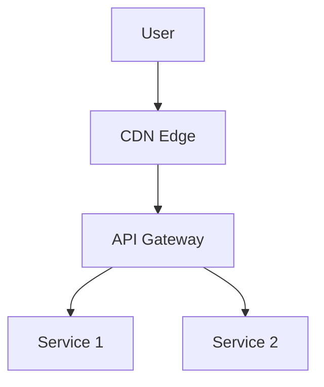

---

## 5. Tips and Tricks

### API Gateway

- **Use JWT/OAuth2** for robust authentication and authorization.
- **Implement rate limiting** at the gateway to prevent abuse.
- **Aggregate requests** in the gateway to reduce client-server roundtrips (API composition).
- **Monitor logs** for suspicious activity and performance bottlenecks.
- **Cache GET responses** for expensive, non-sensitive data.

### CDN

- **Set appropriate cache headers** (`Cache-Control`, `ETag`, `Expires`) in your API/gateway responses to control CDN caching.
- **Use edge caching** for high-traffic API endpoints that serve the same data to many users.
- **Purge CDN cache** immediately on deployment of new content or API changes to avoid serving stale data.
- **Enable SSL/TLS termination** at the CDN for better security and performance.
- **Monitor CDN analytics** for usage patterns and anomalies.

---

## 6. Interview Questions Cheat Sheet

**API Gateway**
- What is an API gateway and why is it important?
- How does an API gateway differ from a load balancer?
- How would you implement rate limiting and authentication in an API gateway?
- Describe a scenario where API aggregation/composition is beneficial.

**CDN**
- What is a CDN and how does it improve performance?
- What is a cache hit vs. cache miss? How does a CDN handle them?
- How does a CDN provide DDoS protection?
- How would you design a CDN strategy for a video streaming platform?

---

## 7. Conclusion

API Gateways and CDNs are essential tools for building scalable, secure, and high-performance systems. API Gateways manage, secure, and optimize API traffic, while CDNs ensure your content is delivered quickly and reliably to users worldwide. Mastering both is crucial for modern system design.

---

**Next up:** Dive deeper into CDN internals, advanced caching strategies, and edge computing!

---

**Happy designing! 🚀**

# Section 8

# Content Delivery Networks (CDN) in System Design: A Practical Guide

---

Content Delivery Networks (CDNs) are a cornerstone of modern web architecture. They enable global scalability, ultra-fast content delivery, and robust security for everything from static websites to complex API-driven applications. In this guide, we'll take a detailed look at CDNs, how they work, why they're crucial for system design, and how to leverage them effectively. We'll also tie in networking fundamentals, provide diagrams, code snippets, and offer actionable tips for interviews and real-world implementation.

---

## Table of Contents

1. [What is a CDN?](#what-is-a-cdn)
2. [Why Do We Need CDNs?](#why-do-we-need-cdns)
3. [CDN Architecture & Components](#cdn-architecture--components)
4. [How a CDN Handles Requests](#how-a-cdn-handles-requests)
5. [Key CDN Features & Benefits](#key-cdn-features--benefits)
6. [Caching Strategies in CDNs](#caching-strategies-in-cdns)
7. [Request Routing, Load Balancing, and Failover](#request-routing-load-balancing-and-failover)
8. [Compression, Minification, and Optimization](#compression-minification-and-optimization)
9. [Security Features](#security-features)
10. [CDN Use Cases](#cdn-use-cases)
11. [Sample Code: CDN Integration Example](#sample-code-cdn-integration-example)
12. [Diagrams](#diagrams)
13. [Tips and Tricks](#tips-and-tricks)
14. [Interview Questions](#interview-questions)

---

## What is a CDN?

A **Content Delivery Network (CDN)** is a globally distributed network of servers (also called Points of Presence, or PoPs) designed to deliver content (web pages, images, videos, APIs, etc.) to users efficiently, reliably, and securely. By caching content closer to users, CDNs reduce latency, enhance availability, and offload traffic from origin servers.

**Key Points:**
- **Edge Servers/PoPs:** Servers placed close to end-users.
- **Origin Server:** The source of truth for your content.
- **Request Routing:** Directs users to the optimal edge server.

---

## Why Do We Need CDNs?

Without a CDN, every client request must travel the entire distance to the origin server (which could be on another continent), resulting in:
- **High latency** due to geographical distance.
- **Overloaded origin servers** under heavy traffic.
- **Bandwidth bottlenecks** and slow load times.

CDNs solve these problems by:
- Serving content from the nearest edge server.
- Distributing user load across many servers.
- Caching and optimizing content to reduce bandwidth and cost.

---

## CDN Architecture & Components

### Main Components

| Component         | Description                                                                 |
|-------------------|-----------------------------------------------------------------------------|
| **Origin Server** | Central server hosting the original content.                                 |
| **Edge Server/PoP** | Distributed servers caching and serving content closer to users.         |
| **Request Routing** | Logic that directs traffic to the optimal edge server (geo, latency, load). |

**Diagram: Basic CDN Architecture**

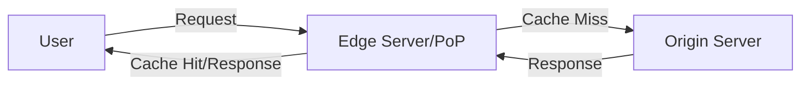

---

## How a CDN Handles Requests

1. **User Requests Content:** A user tries to load a resource (e.g., image, video, API data).
2. **CDN Resolves to Nearest Edge Server:** DNS and routing logic direct the request to the best PoP (based on geography, latency, load).
3. **Cache Hit:** If the content is cached at the edge, it is served instantly.
4. **Cache Miss:** If not cached, the edge server fetches from the origin, caches it for future requests, and serves the user.
5. **Subsequent Requests:** Future users benefit from the cached content, improving speed and reliability.

---

## Key CDN Features & Benefits

| Feature               | Benefit                                           |
|-----------------------|--------------------------------------------------|
| **Caching & Replication** | Reduces latency and origin server load.        |
| **Load Balancing**        | Handles massive traffic, provides high availability. |
| **Compression & Optimization** | Reduces bandwidth, speeds up delivery.             |
| **Security**               | DDoS mitigation, SSL/TLS, bot filtering.         |

---

## Caching Strategies in CDNs

CDNs cache frequently accessed content at the edge servers. Key concepts:

- **Cache Expiration (TTL):**  
  Determines how long an object stays cached before being refreshed.

    ```http
    Cache-Control: public, max-age=86400
    ```

- **Cache Invalidation:**  
  Techniques to ensure freshness:
    - **Manual Purge:** Explicitly remove/refresh objects.
    - **Stale-While-Revalidate:** Serve stale content while fetching the latest version asynchronously.
    - **Cache-Control Headers:** Fine-tune caching via HTTP headers.

**Example: Setting Cache-Control Headers in Express.js**

```js
app.get('/static/*', (req, res) => {
  res.set('Cache-Control', 'public, max-age=86400'); // Cache for 1 day
  res.sendFile(...);
});
```

---

## Request Routing, Load Balancing, and Failover

CDNs use intelligent algorithms for:

- **Geo-Based Routing:** Directs users to the geographically nearest PoP.
- **Latency-Based Routing:** Picks the PoP with the fastest response time.
- **Load-Aware Routing:** Avoids sending requests to overloaded PoPs.

**Failover Handling:**  
If a PoP fails, traffic is rerouted to the next closest or most responsive PoP, ensuring high availability.

---

## Compression, Minification, and Optimization

CDNs further optimize content delivery by:

- **Compression:**  
  - Gzip/Brotli for text files (HTML, CSS, JS)
  - Image compression (WebP, AVIF)

- **Minification:**  
  - Remove whitespace, comments from JS/CSS.

- **Bundling:**  
  - Combine multiple files into one to reduce HTTP requests.

**Example: Enable Gzip Compression in Node.js**

```js
const express = require('express');
const compression = require('compression');

const app = express();
app.use(compression());
```

---

## Security Features

- **DDoS Protection:** Rate limiting, traffic filtering, anomaly detection.
- **SSL/TLS Offloading:** Edge servers handle encryption, reducing load on origin.
- **Bot Mitigation:** Block malicious bots before reaching origin.
- **Web Application Firewall (WAF):** Protects against common web threats.

---

## CDN Use Cases

- **Static Content Delivery:** Images, CSS, JS, videos, HTML.
- **Dynamic Content Optimization:** API responses, personalized pages (with careful caching).
- **API Acceleration:** Edge caching of API responses for speed.
- **Edge Computing:** Run lightweight computation at the edge (e.g., video transcoding, A/B testing).

---

## Sample Code: CDN Integration Example

### 1. **Using a CDN with HTML Assets**

```html
<!-- Using Cloudflare CDN for jQuery -->
<script src="https://cdnjs.cloudflare.com/ajax/libs/jquery/3.6.0/jquery.min.js"></script>
```

### 2. **Setting Cache Headers for CDN in Express.js**

```js
app.use('/static', express.static('public', {
  maxAge: '7d', // Cache static files for 7 days
  setHeaders: function (res, path) {
    res.setHeader('Cache-Control', 'public, max-age=604800');
  }
}));
```

### 3. **Configuring a CDN (Pseudocode Example)**

```yaml
cdn:
  origin: https://mywebsite.com
  edge_servers:
    - location: us-east
    - location: eu-west
    - location: asia
  cache:
    ttl: 86400 # 24 hours
    stale_while_revalidate: true
  security:
    ddos_protection: true
    ssl: enabled
```

---

## Diagrams

### CDN Request Flow

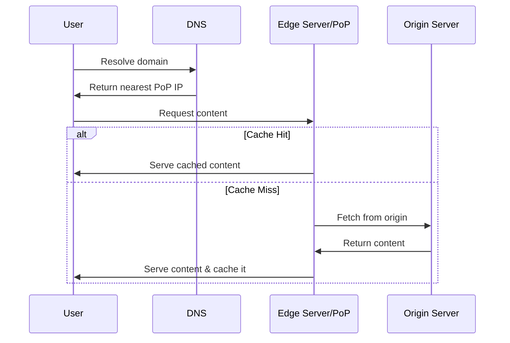

---

## Tips and Tricks

- **Set Appropriate TTLs:**  
  - Static assets: Longer TTL (days/weeks).
  - Dynamic content: Shorter TTL or no caching.
- **Use Versioning:**  
  Change asset filenames when deploying updates to avoid stale caches.
- **Purge Carefully:**  
  Only purge what’s necessary to avoid cache stampedes.
- **Leverage Compression & Minification:**  
  Serve compressed/minified assets to reduce bandwidth and speed up delivery.
- **Secure Your CDN:**  
  Enforce HTTPS, enable DDoS protection, and configure WAF rules.
- **Monitor Edge Cache Hit Ratio:**  
  Optimize your caching strategy for the highest possible hit ratio.
- **Edge Computing:**  
  Use edge functions for lightweight logic (A/B testing, geofencing, etc.).
- **API Caching:**  
  Use with care—define cache keys and invalidation logic for APIs to avoid stale data.

---

## Interview Questions

- **Basics:**
    - What is a CDN, and how does it work?
    - Why do we need CDNs in modern system design?
    - What are the key benefits of using a CDN?
- **Architecture:**
    - Explain the difference between an origin server and an edge server in a CDN.
    - What is a PoP in a CDN?
    - How does request routing work in a CDN?
- **Caching:**
    - What is the difference between a cache hit and a cache miss?
    - How does cache expiration (TTL) work in a CDN?
    - Describe cache invalidation strategies in a CDN.
- **Load Balancing & Failover:**
    - How do CDNs use load balancing?
    - What happens if a CDN PoP fails?
- **Optimization:**
    - What compression and minification techniques do CDNs use?
    - How does API acceleration work in a CDN?
- **Security:**
    - How does a CDN protect against DDoS attacks?
    - What is SSL/TLS offloading, and why is it useful?
- **Advanced:**
    - What is edge computing in the context of CDNs?
    - How would you design a CDN for a large-scale video streaming platform?
    - How do CDNs help in real-time applications like online gaming or stock trading?

---

## Conclusion

CDNs are powerful tools that dramatically enhance web performance, scalability, reliability, and security. Mastering CDN concepts, architecture, and best practices is essential for anyone preparing for system design interviews or building modern, large-scale applications. Combine your understanding of networking fundamentals—IP addressing, DNS, proxies, load balancing, and API gateways—with CDN strategies for robust, high-performance systems.

---

**What's next?**  
Deep dive into networking protocols and further system design best practices!

---

**References & Further Reading:**
- [Cloudflare CDN Docs](https://developers.cloudflare.com/cdn/)
- [AWS CloudFront](https://aws.amazon.com/cloudfront/)
- [Google Cloud CDN](https://cloud.google.com/cdn/)
- [Akamai CDN](https://www.akamai.com/)

---

*Happy building and good luck with your interviews!* 🚀

# Section 9

Certainly! Here is a detailed Markdown blog section that integrates both your transcript and slides. It includes explanations, diagrams (using Mermaid where appropriate), code snippets, and a practical 'Tips and Tricks' section.

---

# Networking & Communication: The Backbone of System Design

Modern system design hinges on a solid understanding of networking and communication fundamentals. Whether you're building cloud-native applications, scaling microservices, or designing large-scale distributed systems, networking forms the critical backbone that ensures performance, reliability, and security.

In this section, we’ll recap key networking concepts essential for any aspiring system designer, weaving together practical insights, diagrams, and actionable tips.

---

## Why Networking Matters in System Design

Every system relies on data exchange between components. Networking enables this by allowing communication between clients, servers, databases, and other services. It’s not just about connectivity—it’s about ensuring:

- **Scalability** (serving millions of users concurrently)
- **Reliability** (handling failures gracefully)
- **Performance** (reducing latency and boosting responsiveness)
- **Security** (protecting data in transit)

**Slide Summary:**
> “Networking forms the backbone of modern system architecture. Performance, scalability, and security all depend on robust networking practices.”

---

## Key Networking Concepts Recap

Here’s a systematic walk-through of fundamental concepts, as covered in both transcript and slides.

### 1. **IP Addresses: IPv4 vs. IPv6, Public vs. Private**

- **IPv4**: 32-bit, e.g., `192.168.1.1`, ~4.3 billion addresses.
- **IPv6**: 128-bit, e.g., `2001:0db8:85a3:...`, virtually unlimited.
- **Public IPs**: Routable on the internet, unique globally.
- **Private IPs**: Used within LANs, not routable on the internet; enable NAT.

#### _Diagram: IPv4 vs IPv6 Address Space_

```mermaid
flowchart LR
    A[IPv4 Address<br>32 bits<br>e.g., 192.168.1.1] -->|Limited (~4.3B)| B(Internet)
    C[IPv6 Address<br>128 bits<br>e.g., 2001:0db8:... ] -->|Vast| B
```

#### _Code Snippet: Checking IP Address Type in Python_

```python
import ipaddress

def ip_type(ip):
    ip_obj = ipaddress.ip_address(ip)
    if ip_obj.is_private:
        return "Private"
    else:
        return "Public"

print(ip_type("192.168.1.1"))       # Private
print(ip_type("8.8.8.8"))           # Public
print(ip_type("2001:4860:4860::8888"))  # Public (IPv6)
```

---

### 2. **How DNS Works**

DNS (Domain Name System) translates human-readable domain names (like `google.com`) into IP addresses.

#### _DNS Resolution Flow_

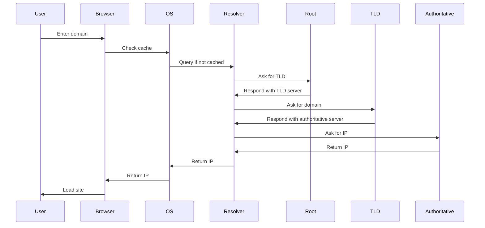

#### _Why Caching Matters?_

- **Reduces latency** (browser/OS/ISP resolver caches)
- **Improves resilience** (TTL determines cache duration)

---

### 3. **Client-Server Model**

The client-server model underpins most modern systems—from web browsing to APIs.

- **Client**: User-facing, sends requests (e.g., browsers, mobile apps)
- **Server**: Processes requests, sends responses (e.g., web servers, databases)
- **Network**: Medium that connects them (Internet, LAN, etc.)

#### _Diagram: Client-Server Request-Response_

```mermaid
graph LR
    A[Client<br>(e.g., Browser)] -- HTTP Request --> B[Server<br>(Web Server)]
    B -- HTTP Response --> A
```

- **Request/Response:** Standard (HTTP, REST)
- **Persistent Connections:** For real-time (WebSocket, FTP)

#### _Code Snippet: Simple HTTP Client in Python_

```python
import requests

response = requests.get('https://jsonplaceholder.typicode.com/posts/1')
print(response.json())
```

---

### 4. **Proxies: Forward vs. Reverse**

- **Forward Proxy:** Sits between client and internet.
  - Use cases: privacy, content filtering, caching
- **Reverse Proxy:** Sits in front of backend servers.
  - Use cases: load balancing, DDoS protection, SSL offloading

#### _Diagram: Proxy Types_

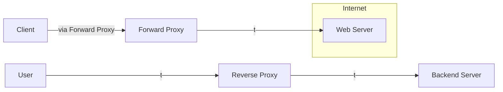

---

### 5. **Load Balancing**

Distributes incoming traffic across multiple servers to:

- **Enhance availability**
- **Prevent overload**
- **Improve response times**

**Types:**  
- **Layer 4 (Transport):** TCP/UDP
- **Layer 7 (Application):** HTTP/HTTPS

**Strategies:**
- Round Robin, Least Connections, IP Hashing
- Weighted, Adaptive

#### _Diagram: Load Balancer in Action_

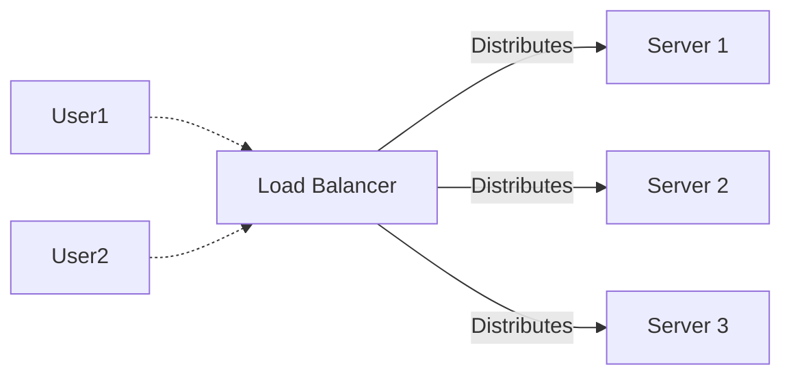

---

### 6. **API Gateway**

Central entry point for all API requests in microservices architectures.

- Handles authentication, rate limiting, caching, logging, and routing.
- Protects backend services from direct exposure.

#### _Diagram: API Gateway Role_

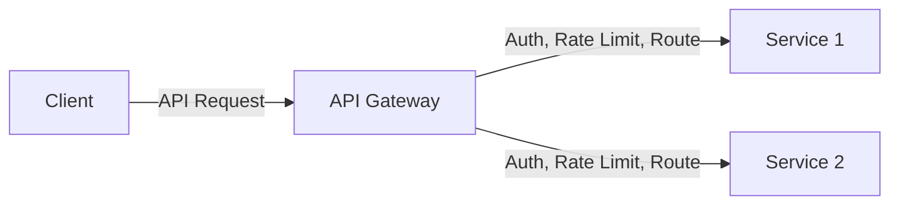

---

### 7. **Content Delivery Networks (CDNs)**

CDNs are globally distributed networks of edge servers that cache and serve content closer to users.

**Benefits:**
- Lower latency
- Offload origin servers
- DDoS protection
- Faster global delivery

#### _Diagram: CDN Request Flow_

```mermaid
graph LR
    User --> Edge[CDN Edge Server]
    Edge -- Cache Hit --> User
    Edge -- Cache Miss --> Origin[Origin Server]
    Origin --> Edge
```

---

## Tips & Tricks for System Designers

- **Use Private IPs and NAT** to conserve public addresses and enhance security in internal networks.
- **Leverage DNS TTL settings** for optimal balance between fast updates and reduced query load.
- **Choose reverse proxies (e.g., Nginx, HAProxy)** for SSL termination, load balancing, and security.
- **Implement health checks** in load balancers to detect and reroute around failed servers.
- **Set up API gateways** for microservices to centralize authentication, rate limiting, and monitoring.
- **Utilize CDN edge caching** for static content and API acceleration, especially for global audiences.
- **Monitor and log all networking layers**–from DNS queries to API gateway access–for proactive troubleshooting.
- **Understand protocol choices:** HTTP for RESTful APIs, WebSockets for real-time, gRPC for high-performance RPC, etc.

---

## Conclusion

Mastering these networking concepts empowers you to design systems that are scalable, secure, and highly available. From understanding IP addressing and DNS, to implementing load balancers, API gateways, and CDNs—these are the pillars supporting modern web and cloud architectures.

> **Next up:** A deep dive into essential communication protocols—TCP, UDP, HTTP, REST, WebSockets, gRPC, and GraphQL.

Stay tuned, and keep building!

---

**Have questions or want to see real-world examples? Drop a comment below!**

---

