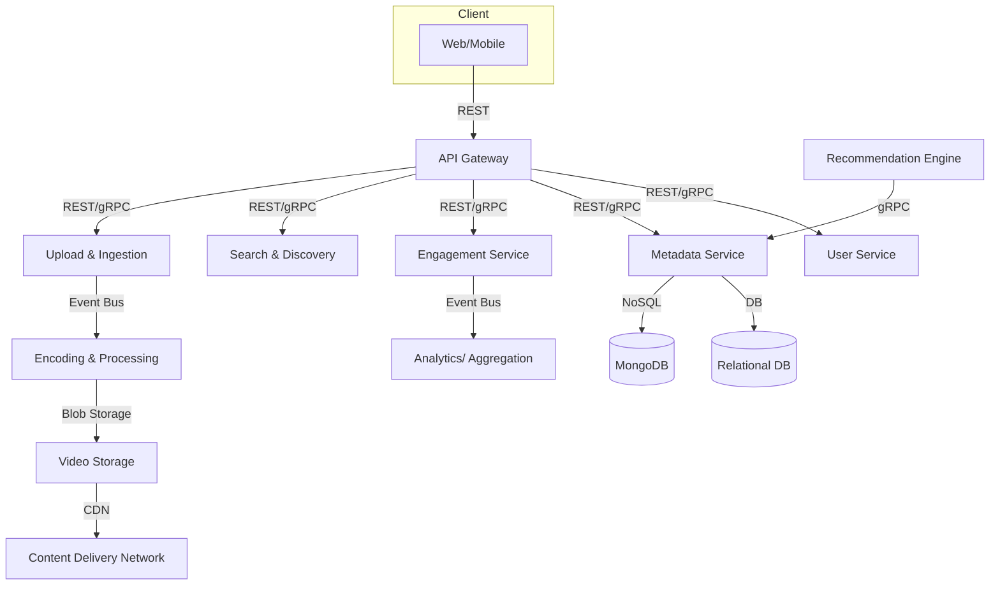
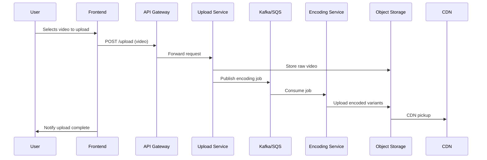
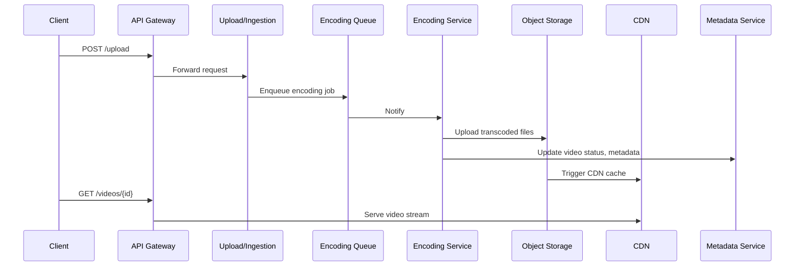

# Section 1

Certainly! Here’s a detailed, structured **Markdown blog section** that integrates the provided transcript and slides, complete with code snippets, diagrams (as Markdown/explanation), and a practical ‘Tips & Tricks’ section. The content is focused on the initial steps of designing a **YouTube-like video sharing platform**.

---

# 🚀 Designing a Scalable Video Sharing Platform (Like YouTube) — A System Design Deep Dive

Welcome to our Mastering System Design series! In this article, we’ll walk through the **first steps in designing a massive-scale, media-rich platform** — think YouTube or Dailymotion. We’ll cover requirements, architecture, storage, and more, blending theory with real-world best practices (and a few code snippets too).

## 📌 What Are We Building?

We’re designing a platform where users can:

- **Upload and watch videos**
- **Like, comment, and share**
- **Search and browse content**
- **Subscribe to channels**
- **View personalized recommendations**

### Core User Workflows

| Workflow              | Description                                                                                 |
|-----------------------|--------------------------------------------------------------------------------------------|
| **Upload a Video**    | Chunked upload → Processing (encoding, thumbnail) → Storage → Ready for playback           |
| **Watch a Video**     | Stream from CDN using adaptive bitrate (HLS/DASH) based on device/network                  |
| **Search & Browse**   | Filter and discover content by tags, categories, or popularity                             |
| **Engagement**        | Like, comment, share, subscribe — social actions that boost stickiness                     |

---

## ⚙️ Functional Requirements

To serve both creators and consumers, the system must:

1. **User registration and authentication** (OAuth2/JWT)
2. **Upload large video files** (chunked, resumable)
3. **Encode videos to multiple resolutions** (240p–4K)
4. **On-demand adaptive streaming** (HLS/DASH protocols)
5. **Metadata management** (title, description, tags, timestamps)
6. **Engagement tracking** (likes, comments, views, subscriptions)
7. **Powerful search & discovery**
8. **Personalized home/feed (recommendations)**

---

## 🏗️ Non-Functional Requirements

These define quality-of-service at scale:

- **Low latency streaming** (instant video start, smooth seek)
- **High availability** (24/7, geo-replicated, fault-tolerant)
- **Horizontal scalability** (support billions of videos/users)
- **Efficient storage & cost management** (tiered, object storage)
- **Global delivery** (CDN-backed, regional routing)
- **Security and abuse prevention** (secure uploads, spam/copyright/DoS filters)

---

## 🧑‍💻 Architecture Overview

Here’s a **high-level block diagram** (in Markdown):

```
[Client Apps]
     |
     v
[API Gateway] <--------> [User Service]
     |                      |
     |                      +----> [Engagement Service]
     |                      |
     v                      +----> [Metadata Service]
[Upload & Ingestion]------> [Encoding Pipeline]-----> [Blob Storage/S3/GCS]---> [CDN]
     |
     +----> [Event Queue (Kafka/SQS)] ------> [Async Processing]
     |
     +----> [Search & Discovery] <----> [Recommendation Engine]
```

---

### 🗂️ Core Components

- **API Gateway**: Entrypoint for all requests (auth, rate limiting)
- **Upload & Ingestion**: Handles chunked uploads, triggers encoding jobs via event bus
- **Encoding & Processing**: Transcodes videos (multi-resolution, thumbnails, HLS/DASH packaging)
- **Blob Storage & CDN**: Stores video chunks, manifests; delivers globally via CDN
- **Metadata Service**: Stores and indexes video info (search/filtering)
- **User & Engagement Services**: Manages user accounts, subscriptions, likes, comments, anti-abuse moderation
- **Search & Recommendation**: Real-time indexing and personalized feeds

---

## 📊 Scale Assumptions

Let’s design for **100M users, 10M uploads/day, 500M daily views**.

- **Avg video**: 10 min, ~50MB per upload
- **Storage needs**: 10M × 50MB = **500TB/day raw** (×3 for encoded variants)
- **Bandwidth**: 300M hrs/day × 0.45GB/hr ≈ **135PB/day egress**
- **Peak concurrency**: 10M streams @ 1Mbps = **10Tbps egress**
- **Engagement**: 100M new likes/comments/shares per day

---

## 🗄️ Storage & Caching Design

### Video Files

- **Object Storage**: AWS S3, Google Cloud Storage, Azure Blob
- **CDN**: Cloudflare, Akamai, AWS CloudFront for global edge caching

### Metadata & Engagement

- **Relational DB**: PostgreSQL/MySQL for structured metadata
- **NoSQL**: MongoDB for flexible user preferences, recommendations
- **Cache**: Redis/Memcached for hot data (sessions, metadata)

**Example: Video Metadata Table**
```sql
CREATE TABLE videos (
  video_id UUID PRIMARY KEY,
  user_id UUID REFERENCES users(user_id),
  title VARCHAR(200),
  description TEXT,
  upload_date TIMESTAMP,
  status VARCHAR(20),
  thumbnail_url TEXT
);
```

---

## 📦 Microservices Communication

- **Synchronous (REST/gRPC)**: For fetching metadata, user info, search queries
- **Asynchronous (Event Bus)**: For uploads, encoding jobs, engagement event logging

**Example: Upload Flow (Pseudocode/Node.js)**
```js
// Client uploads video chunks
POST /upload { chunk, chunkNumber, videoId, ... }

// API Gateway verifies JWT, forwards to Upload Service
// Upload Service stores chunk in S3, triggers encoding on final chunk

// Encoding Service listens for new upload events via Kafka/SQS
// Processes video, stores encoded versions back to S3, updates metadata
```

---

## 🏷️ Example API Endpoints

| Endpoint                | Method | Description                        |
|-------------------------|--------|------------------------------------|
| `/api/register`         | POST   | User registration                  |
| `/api/login`            | POST   | Issue JWT token                    |
| `/api/upload`           | POST   | Initiate video upload (chunked)    |
| `/api/videos/{id}`      | GET    | Fetch video metadata & stream URLs |
| `/api/like`             | POST   | Like a video                       |
| `/api/search`           | GET    | Search videos by keyword/tags      |

**JWT Authentication Example (Express.js)**
```js
const jwt = require('jsonwebtoken');
app.post('/api/upload', authenticateJWT, (req, res) => {
  // Handle video upload
});

function authenticateJWT(req, res, next) {
  const token = req.headers.authorization?.split(' ')[1];
  if (token) {
    jwt.verify(token, process.env.JWT_SECRET, (err, user) => {
      if (err) return res.sendStatus(403);
      req.user = user;
      next();
    });
  } else {
    res.sendStatus(401);
  }
}
```

---

## 🧭 Tips & Tricks for System Design Interviews

1. **Start with the user journey.** Map out core workflows before jumping to tech.
2. **Quantify everything.** Estimate users, uploads, storage, bandwidth.
3. **Prioritize non-functional requirements.** Latency, availability, and scalability drive your infra decisions.
4. **Embrace asynchronous processing.** Use queues for uploads, encoding, and engagement events.
5. **Use tiered storage.** Hot/warm/cold storage cuts costs for older/less-viewed content.
6. **Leverage CDNs.** Global delivery isn’t optional for video at scale.
7. **Model for both reads and writes.** Hot content is read-heavy; engagement is write-heavy.
8. **Optimize for cost.** Storage, egress, and compute costs balloon rapidly at scale.
9. **Design for abuse prevention.** Rate limiting, spam/copyright filters, and moderation tools are must-haves.
10. **Always draw diagrams.** Even ASCII diagrams help clarify your architecture in interviews.

---

## 📚 Further Reading

- [YouTube Architecture (High Scalability)](http://highscalability.com/blog/2012/3/12/you-tube-architecture.html)
- [AWS Reference: Video Streaming at Scale](https://aws.amazon.com/solutions/case-studies/video-streaming/)
- [CDNs Explained](https://www.cloudflare.com/learning/cdn/what-is-a-cdn/)

---

**Stay tuned for Step 2: Estimating Scale and Identifying Bottlenecks!**

---

*Did you enjoy this breakdown? Share your thoughts or questions in the comments!*

---

# Section 2

Certainly! Here’s a detailed **blog section** that integrates the transcript and slides into a cohesive, instructive, and practical write-up, with code snippets, diagrams (using [Mermaid](https://mermaid-js.github.io/)), and a “Tips and Tricks” section.

---

# Designing a Scalable Video Sharing Platform: Scale Estimation & Bottleneck Analysis

Building a global-scale video sharing platform (think **YouTube**) isn’t just about streaming videos—it’s a game of anticipating massive scale, identifying architectural bottlenecks, and making smart infrastructure decisions. Before jumping into the high-level design, let’s walk through detailed scale estimation, bottleneck identification, and the key architectural implications.

## 1. Understanding Scale: The Numbers That Shape Your Architecture

Your technical decisions must be data-driven. Here are the assumptions we’ll use:

| Metric                            | Assumption                                    |
| ---------------------------------- | --------------------------------------------- |
| Registered Users                   | 100 million                                   |
| Daily Video Uploads                | 10 million                                    |
| Daily Video Views                  | 500 million                                   |
| Daily Engagement Events            | 100 million (likes, comments, shares, etc.)   |
| Average Video Length               | 10 minutes                                    |
| Video Metadata Size                | ~1 KB per video                               |
| Engagement Event Size              | ~500 bytes/event                              |

### Why These Numbers Matter

- **Authentication and Profile Management** must scale to millions of users.
- **Ingestion Pipeline** must handle concurrent uploads and multi-format transcoding.
- **Streaming** requires massive CDN bandwidth for half a billion daily views.
- **Storage** must efficiently handle raw and encoded video, plus metadata and engagement logs.
- **Metadata and Engagement** drive read/write loads and require real-time indexing.

---

## 2. Storage Estimation: How Many Petabytes?

### Raw Video Storage

- **Average Upload:** 10 minutes × 5 MB/minute = **50 MB/video**
- **Daily Uploads:** 10M × 50 MB = **500 TB/day** raw ingestion
- **Temporary Buffer:** Retain for 30 days → **15 PB/month** rolling buffer (for moderation/retries)

### Encoded Versions

- **4-5 Resolutions:** Storage multiplies ~3× (240p, 480p, 720p, 1080p)
- **Daily Storage:** 1.5 PB/day (including transcoded versions)
- **Monthly Storage:** 1.5 PB × 30 = **45 PB/month** (permanent, durable storage)

```python
# Sample code: Estimate storage needs
def estimate_storage(avg_mb_per_video, uploads_per_day, days, encoding_multiplier):
    return avg_mb_per_video * uploads_per_day * encoding_multiplier * days / 1024 / 1024  # in PB

# 50 MB/video, 10 million uploads, 30 days, 3x (encoded)
permanent_storage_pb = estimate_storage(50, 10_000_000, 30, 3)
print(f"Estimated permanent storage: {permanent_storage_pb:.2f} PB")
# Output: Estimated permanent storage: 45.00 PB
```

---

## 3. Network & Bandwidth Estimation

### Daily Video Streaming Egress

- **Active Users:** 100M × 3 videos/day = 300M video views
- **Total Watch Time:** 300M × 10 min = 3B minutes = **50M hours/day**
- **Average Streaming Rate:** 1 Mbps (~0.45 GB/hour)
- **Egress:** 50M hours × 0.45 GB = **22.5 PB/day**  
  (Note: The transcript uses higher numbers due to different assumptions; always sanity-check your calculations!)

### Peak Load

- **Peak Concurrent Streams:** 10M users × 1 Mbps = **10 Tbps** egress

---

## 4. Metadata & Engagement Scale

- **Video Metadata:** 10M new rows/day (~1 KB each)
- **Engagement Events:** 100M/day (~500 bytes each) → ~50 GB/day
- **Indexing:** Real-time updates for search and feed freshness.
- **Read Patterns:** Hot content triggers thousands of queries/sec.

---

## 5. Bottleneck Identification & Architectural Implications

### Table: Scale Impacts & Solutions

| Area             | Bottleneck / Challenge                            | Solution(s)                        |
| ---------------- | ------------------------------------------------ | ----------------------------------- |
| Storage          | Petabyte-scale video & variants                   | Tiered blob storage (S3, GCS); lifecycle policies; cold storage |
| Processing       | Encoding 10M uploads/day × multi-res              | Autoscaling GPU workers; distributed queue (Kafka/SQS)           |
| Network/CDN      | 100s of PB egress, 10M concurrent streams         | Global CDN, edge caching, adaptive bitrate streaming              |
| Engagement Data  | 100M+ writes/day, real-time analytics/aggregation | Event queues, sharded counters, async aggregation                 |
| Search/Discovery | Real-time indexing, high QPS                      | Distributed search (Elasticsearch/Meilisearch), in-memory cache   |

---

## 6. High-Level System Architecture

```mermaid
flowchart TD
    Client-->|REST/HTTP|APIGateway
    APIGateway-->|POST /upload|Ingestion
    Ingestion-->|Event|Encoding
    Encoding-->|Store|ObjectStorage
    ObjectStorage-->|CDN sync|CDN
    APIGateway-->|GET /videos/{id}|MetadataService
    APIGateway-->|POST /like|EngagementService
    EngagementService-->|Event Bus|AnalyticsService
    APIGateway-->|GET /search|SearchService
    MetadataService-->|DB|MetadataDB
    EngagementService-->|DB|EngagementDB
    SearchService-->|Index|SearchIndex
    RecommendationEngine-->|Feed|APIGateway
```

**Core Components:**
- **API Gateway:** Entry point; routes, authenticates, rate-limits.
- **Upload & Ingestion:** Handles chunked uploads, temp storage, triggers jobs.
- **Encoding:** Transcodes video, generates thumbnails, prepares streaming formats.
- **Object Storage + CDN:** Scalable storage, edge-cached global delivery.
- **Metadata/Engagement/Search:** Dedicated services and horizontally scalable DBs.
- **Recommendation Engine:** Personalized feeds using user history and collaborative filtering.

---

## 7. Example: Service Communication and API Endpoints

**Synchronous (HTTP/gRPC):**
- Fetch metadata, user info, search queries.

**Asynchronous (Queue/Event Bus):**
- Video upload triggers encoding.
- Engagement events (like, comment) flow into analytics.

```http
POST /upload
Authorization: Bearer <JWT>
Content-Type: multipart/form-data

# Request: Video chunks, metadata fields

200 OK
{
  "video_id": "abc123",
  "status": "processing"
}
```

**Async trigger (pseudo-code):**

```python
# Upload Service
def handle_upload(file, metadata):
    video_id = generate_id()
    store_temp(file, video_id)
    publish_event("encoding_requested", {"video_id": video_id, ...})
```

---

## 8. Strategic Tech & Infra Choices

| Layer             | Suggested Tech                                     |
| ----------------- | ------------------------------------------------- |
| Frontend          | React.js / Vue.js                                 |
| Backend           | Node.js + Express                                 |
| Video Storage     | AWS S3 / GCS, multi-region                        |
| CDN               | Cloudflare / CloudFront                           |
| DB (Metadata)     | PostgreSQL / MySQL                                |
| DB (NoSQL)        | MongoDB (user prefs, feed cache)                  |
| Search            | Elasticsearch / Meilisearch                       |
| Event Processing  | Kafka / SQS                                       |
| Orchestration     | Kubernetes                                        |
| Auth              | OAuth2 / JWT                                      |

---

## 9. Tips and Tricks for Scaling Video Platforms

- **Cold Storage Policies:** Automatically move old, rarely accessed videos to cheaper storage.
- **Chunked Uploads:** Allow for resumable uploads and prevent server overloads.
- **Autoscale Encoders:** Use serverless or Kubernetes autoscaling for encoding jobs, and leverage GPU acceleration.
- **Edge Caching:** Place hot videos near users using CDN edge nodes to reduce latency and egress costs.
- **Sharded Counters:** For views/likes, use sharded counters to avoid single-point bottlenecks.
- **Asynchronous Aggregation:** Aggregate stats like views and likes in the background, not on write path.
- **Eventual Consistency:** Not all counters (views, likes) need strong consistency; eventual is often enough.
- **Real-Time Indexing:** Use background workers to update search indexes as new content arrives.
- **Monitoring:** Track ingestion, processing, and streaming metrics to quickly spot and fix bottlenecks.
- **Abuse Prevention:** Implement spam/copyright detection in the upload pipeline to prevent malicious content.

---

## 10. Conclusion

Designing a video sharing platform at this scale requires a laser focus on the realities of massive load, storage, bandwidth, and user engagement. By quantifying scale early and identifying bottlenecks, you can make architectural decisions that keep your platform resilient, performant, and cost-effective—ready for a global audience.

**Next Step:** Dive into the high-level design and component breakdown for a production-grade video sharing system.

---

**Stay tuned for the next post in this series: “High-Level System Design for a Video Sharing Platform.”**

# Section 3

Certainly! Below is a **detailed Markdown blog section** that synthesizes the provided transcript and slides into a comprehensive system design walkthrough for a YouTube-like video sharing platform. This includes diagrams (in markdown mermaid format), code snippets, and a 'Tips and Tricks' section.

---

# Designing a Scalable Video Sharing Platform (YouTube Clone)

In this section, we walk through the **high-level design** of a modern video sharing platform—think YouTube at scale. We’ll break down the core services, communication patterns, storage strategies, and database schema, sprinkle in some code, and close with actionable tips for success.

---

## 🏗️ Core Architecture & Service Breakdown

At YouTube scale, **modular, independently scalable services** are critical. Here’s a high-level breakdown:

### **Core Components**

- **API Gateway**: Entry point for all client requests. Handles routing, authentication, rate limiting.
- **Upload & Ingestion Service**: Receives file uploads, generates unique video IDs, stores temporarily, triggers encoding.
- **Encoding & Processing Service**: Transcodes videos (multi-resolution), generates thumbnails, prepares for streaming.
- **Video Storage & CDN**: Stores final video files and manifests (e.g., HLS/DASH); serves content globally via CDN.
- **Metadata Service**: Handles video info (title, tags, uploader, etc.), mapping video IDs to storage, and search/filter features.
- **User Service**: Manages user accounts, authentication, subscriptions, and preferences.
- **Engagement Service**: Tracks views, likes, comments, shares; supports moderation and anti-abuse.
- **Search & Discovery**: Real-time search for videos/channels using tags, trends, etc.
- **Recommendation Engine**: Personalizes feed via behavioral data and collaborative filtering.

---

### 🖼️ System Design Diagram



---

## 🔄 Communication Patterns

A **hybrid model** ensures both responsiveness and scalability:

- **Synchronous (REST/gRPC)**: For real-time interactions (metadata fetch, user info, search).
    - **Client ↔ API Gateway**: REST (OAuth2/JWT secured)
    - **Service ↔ Service**: gRPC favored for speed and type safety
- **Asynchronous (Event Bus/Queue)**: For background processing (uploads, encoding, engagement).
    - **Examples**: Video upload triggers an event; encoding processes queue asynchronously; engagement events logged via event bus.

---

## 📦 Storage & Caching Strategy

- **Video Files**: Object storage (AWS S3, GCS, Azure Blob). Chunked for scalable delivery.
- **CDN**: Edge caching for global, low-latency streaming.
- **Metadata**: 
    - **Structured**: Relational DB (PostgreSQL/MySQL)
    - **Flexible**: NoSQL (MongoDB) for user preferences/recommendations
- **Caching**: In-memory (Redis/Memcached) for hot data (popular video metadata, user sessions)
- **Backups**: Regular, geo-distributed backups for durability and disaster recovery.

---

## 🗃️ Sample Database Schema

Here’s a simplified relational schema (using PostgreSQL syntax):

```sql
-- Users
CREATE TABLE users (
    user_id SERIAL PRIMARY KEY,
    email VARCHAR(255) UNIQUE NOT NULL,
    username VARCHAR(64) UNIQUE NOT NULL,
    password_hash VARCHAR(255) NOT NULL,
    join_date TIMESTAMP DEFAULT NOW(),
    profile_picture TEXT
);

-- Videos
CREATE TABLE videos (
    video_id SERIAL PRIMARY KEY,
    user_id INT REFERENCES users(user_id),
    title VARCHAR(255),
    description TEXT,
    upload_date TIMESTAMP DEFAULT NOW(),
    status VARCHAR(32),
    thumbnail_url TEXT
);

-- Likes
CREATE TABLE likes (
    like_id SERIAL PRIMARY KEY,
    user_id INT REFERENCES users(user_id),
    video_id INT REFERENCES videos(video_id),
    timestamp TIMESTAMP DEFAULT NOW()
);

-- Comments
CREATE TABLE comments (
    comment_id SERIAL PRIMARY KEY,
    video_id INT REFERENCES videos(video_id),
    user_id INT REFERENCES users(user_id),
    comment_text TEXT,
    timestamp TIMESTAMP DEFAULT NOW()
);

-- Watch History
CREATE TABLE watch_history (
    history_id SERIAL PRIMARY KEY,
    user_id INT REFERENCES users(user_id),
    video_id INT REFERENCES videos(video_id),
    watch_timestamp TIMESTAMP DEFAULT NOW()
);

-- Video Analytics (aggregated)
CREATE TABLE video_analytics (
    video_id INT REFERENCES videos(video_id),
    views BIGINT,
    likes BIGINT,
    shares BIGINT,
    dislikes BIGINT,
    comments_count BIGINT,
    PRIMARY KEY (video_id)
);
```

---

## 🔐 Sample REST API Endpoints

**Client → API Gateway (REST, OAuth2/JWT)**

```http
POST /api/upload
Authorization: Bearer <token>
Content-Type: multipart/form-data
Body: { video_file, title, description }

GET /api/videos/{id}
Authorization: Bearer <token>

POST /api/like
Authorization: Bearer <token>
Body: { video_id }
```

**Internal Asynchronous Event Example (Kafka, Node.js)**

```js
// Upload Service: publish encoding job
producer.send({
  topic: 'video-uploads',
  messages: [
    { key: videoId, value: JSON.stringify({ videoId, tempLocation }) }
  ]
});

// Encoding Service: subscribe to encoding jobs
consumer.subscribe({ topic: 'video-uploads' });
consumer.run({
  eachMessage: async ({ message }) => {
    const job = JSON.parse(message.value);
    await transcodeAndStore(job.videoId, job.tempLocation);
  }
});
```

---

## ⚡ Performance & Scaling Considerations

- **Chunked Uploads**: Support resumable uploads for large files.
- **Parallel Encoding**: Use GPU-enabled instances and job queues for fast transcoding.
- **Object Storage Tiering**: Hot, warm, cold tiers; apply lifecycle policies to control costs.
- **CDN Integration**: Use signed URLs for secure, expiring access.
- **Sharding & Partitioning**: For both metadata (by user/video ID) and engagement events.
- **Async Aggregation**: Use event queues for engagement data; aggregate in background.

---

## 💡 Tips and Tricks

- **Separate Reads and Writes**: Employ CQRS (Command Query Responsibility Segregation) for heavy analytics.
- **Optimize for Hot Content**: Pre-cache popular videos and metadata; use CDN edge prefetching.
- **Autoscale Everything**: Encoding, API, and event processing pods/nodes should auto-scale based on workload.
- **Abuse Prevention**: Rate limit at API Gateway, moderate comments via ML models, and filter uploads for spam/content violations.
- **Data Consistency**: Use eventual consistency for engagement data; strict consistency for user auth and video metadata.
- **Monitoring**: Instrument services with distributed tracing (Jaeger), metrics (Prometheus), and alerting for failures.
- **Secure Video URLs**: Use signed URLs with short TTL for playback links to prevent unauthorized access.

---

## 🚀 Conclusion

By **modularizing services, leveraging both synchronous and asynchronous communication, and optimizing storage/caching**, you can build a robust, scalable video platform. This design supports billions of videos, low-latency streaming, global delivery, and rich user engagement—just like YouTube.

---

#### Next Steps

In the next section, we’ll dive into key technical and infrastructure decisions—think choosing between managed cloud services, container orchestration, and deep dives into encoding pipeline optimization.

---

*Happy building!*

---

**References:**
- [YouTube Architecture 101](https://www.infoq.com/articles/YouTube-Architecture/)
- [AWS Video on Demand Solution](https://aws.amazon.com/solutions/implementations/video-on-demand-on-aws/)
- [Microservices Patterns](https://microservices.io/)

---

# Section 4

Certainly! Here’s a **detailed Markdown blog section** integrating the transcript and slides, including context, code snippets, architectural diagrams (using [Mermaid](https://mermaid-js.github.io/mermaid/)), and a practical **Tips and Tricks** section.

---

# 🚀 Building a Scalable Video Sharing Platform: Tech Stack, Infra, and Best Practices

Designing a system like YouTube from scratch is a classic system design challenge, involving thoughtful tech stack selection, infrastructure planning, and awareness of real-world scale. In this section, we’ll walk through the key technology choices, architectural decisions, and implementation tips for a robust video sharing platform.

---

## 1. **Tech Stack Choices and Rationale**

Let’s break down the stack for each layer of our platform:

### **Frontend**

- **Frameworks**: `React.js` or `Vue.js`
    - *Why?* Both are component-based, enabling modular, maintainable code and responsive UIs.
    - *Alternatives*: `Angular` or any SPA framework your team excels at.

```jsx
// React: Video Upload Component (simplified)
import React, { useState } from "react";

function VideoUpload() {
  const [file, setFile] = useState(null);

  const handleChange = (e) => setFile(e.target.files[0]);
  const handleSubmit = async (e) => {
    e.preventDefault();
    const formData = new FormData();
    formData.append('video', file);
    await fetch('/api/upload', { method: 'POST', body: formData });
  };

  return (
    <form onSubmit={handleSubmit}>
      <input type="file" onChange={handleChange} accept="video/*" />
      <button type="submit">Upload</button>
    </form>
  );
}
```

---

### **Backend**

- **Framework**: `Node.js` with `Express`
    - *Why?* Asynchronous, event-driven, and scalable for high concurrency.
    - *Alternatives*: `Java (Spring Boot)`, `ASP.NET Core`, or others.

```js
// Express: Upload Endpoint (simplified)
const express = require('express');
const multer = require('multer');
const upload = multer({ dest: 'uploads/' });
const app = express();

app.post('/api/upload', upload.single('video'), (req, res) => {
  // Process file, trigger encoding, etc.
  res.json({ status: 'uploaded', file: req.file });
});
```

---

### **Databases**

- **Metadata**: `PostgreSQL` or `MySQL`
    - *Why?* ACID compliance, relational querying for structured data (titles, tags, users).
- **NoSQL**: `MongoDB`
    - *Why?* Schema-less, flexible for user preferences, recommendations.

```sql
-- Example: Videos Table (PostgreSQL)
CREATE TABLE videos (
  video_id SERIAL PRIMARY KEY,
  user_id INT REFERENCES users(user_id),
  title VARCHAR(255),
  description TEXT,
  upload_date TIMESTAMP,
  status VARCHAR(20),
  thumbnail_url VARCHAR(255)
);
```

---

### **Storage & CDN**

- **Video Files**: `AWS S3` / `Google Cloud Storage`
    - *Why?* Scalable, durable object storage.
- **CDN**: `Cloudflare` / `AWS CloudFront`
    - *Why?* Global, low-latency streaming via edge caching.

---

### **Authentication**

- **OAuth2 + JWT**
    - *Why?* Modern, secure, token-based, stateless auth.

```js
// Issue a JWT (simplified)
const jwt = require('jsonwebtoken');
const token = jwt.sign({ userId: 123 }, 'SECRET', { expiresIn: '1h' });
```

---

### **Event Processing**

- **Kafka** / `AWS SQS`
    - *Why?* Decouples heavy tasks (encoding, analytics), reliable async processing.

---

### **Infrastructure & Orchestration**

- **Cloud**: `AWS`, `GCP`, or `Azure`
    - *Why?* Managed compute, storage, networking. Global reach.
- **Kubernetes**
    - *Why?* Automates deployment, scaling, management of microservices.

---

## 2. **High-Level Architecture Diagram**

```mermaid
graph TD
    A[Client (Web/Mobile)] --> B(API Gateway)
    B --> C1[Upload & Ingestion Service]
    B --> C2[Metadata Service]
    B --> C3[User Service]
    B --> C4[Engagement Service]
    B --> C5[Search Service]
    C1 --> D1[Encoding & Processing]
    D1 --> D2[Video Storage (S3/GCS)]
    D2 --> E[CDN (Cloudflare/CloudFront)]
    C2 --> F[Relational DB (PostgreSQL/MySQL)]
    C3 --> F
    C4 --> G[NoSQL DB (MongoDB)]
    C4 --> H[Kafka/SQS]
    C5 --> I[Search Index (Elasticsearch)]
    E -.-> Client
```

---

## 3. **Core Component Interactions**

- **API Gateway**: Central entry for all client requests; handles routing, authentication (OAuth2/JWT), rate limiting.
- **Upload & Ingestion**: Handles chunked video uploads; triggers encoding via event queue.
- **Encoding & Processing**: Transcodes to multiple resolutions, generates thumbnails, stores in object storage.
- **Video Storage & CDN**: Durable storage of videos, integrated with CDN for fast global delivery.
- **Metadata/Engagement/Search Services**: Manage user, video, and engagement data; power recommendations and search.

---

### **Sample Upload Workflow**



---

## 4. **Tips and Tricks for Real-World Implementation**

1. **Chunked Uploads**: For large files, implement chunked uploads (using [Tus](https://tus.io/) or S3 multipart).
2. **Autoscale Encoding**: Use Kubernetes jobs with GPU support for parallel video encoding.
3. **Async Aggregation**: Likes/views should be counted asynchronously for performance; use Redis for hot counters.
4. **Cold Storage Policies**: Move old/rarely accessed videos to cheaper storage tiers to control costs.
5. **Security**: Use signed URLs for uploads/downloads, validate all user data, and rate-limit APIs.
6. **Search Optimization**: Use Elasticsearch or Meilisearch with real-time indexing for snappy video search.
7. **Monitoring & Logging**: Integrate with Prometheus and Grafana for metrics; use centralized logging (ELK stack).
8. **CDN Cache Invalidation**: When a video is updated, trigger CDN cache purge to ensure users get the latest version.
9. **API Versioning**: Plan for forward/backward compatibility by versioning your API endpoints.
10. **User Privacy & Abuse Prevention**: Implement content moderation pipelines, spam filters, and privacy controls.

---

## 5. **Conclusion**

By carefully selecting modular, battle-tested technologies and embracing async, scalable cloud patterns, you can architect a video sharing platform that meets demanding requirements for latency, scalability, and global reach. Always adapt choices to your team's strengths, project constraints, and evolving needs.

**Next Up:** We’ll visualize the full design in a comprehensive architecture diagram!

---

**Feel free to adapt these decisions as per your organizational standards, team expertise, or specific business constraints!**

# Section 5

Certainly! Below is a comprehensive blog section in **Markdown** format, integrating the transcript narrative and the slide content. It covers the architecture, workflows, design decisions, and includes code snippets, diagrams (in Mermaid), and a 'Tips and Tricks' section for system design interviews or real-world projects.

---

# Designing a Scalable Video Sharing Platform (YouTube-Style): Architecture Deep Dive

## Introduction

In today’s world, video sharing platforms like YouTube handle **hundreds of millions of users**, **billions of videos**, and **petabytes of daily traffic**. Building such a platform requires not only robust functional design, but also careful attention to scalability, performance, reliability, and cost.

In this section, we’ll walk through the **end-to-end architecture** of a modern video sharing platform, understand each core component, detail a typical user workflow, and highlight key design choices using code snippets and diagrams. We’ll finish with actionable tips for both interview preparation and real-world systems.

---

## 🚦 System Requirements (Functional & Non-Functional)

**Functional Requirements:**
- User registration, authentication
- Upload videos (≤ 15 minutes, multiple resolutions)
- Watch/stream videos (adaptive bitrate)
- Likes, comments, views, subscriptions
- Search, browse, filter videos (tags, categories, popularity)
- Personalized recommendations

**Non-Functional Requirements:**
- **Low-latency streaming**
- **High-availability** for videos and metadata
- **Scalability** to billions of videos
- **Global** delivery (CDN)
- **Efficient storage** & cost management
- **Security** & abuse prevention

---

## 🗺️ High-Level Architecture Diagram

```mermaid
flowchart LR
    Client[Client (Web/Mobile App)]
    APIGW(API Gateway)
    Upload(Upload & Ingestion Service)
    Queue(Encoding Job Queue)
    Encode(Encoding & Processing Service)
    ObjectStore[Video Object Storage]
    CDN[CDN (Global Edge Delivery)]
    Metadata(Metadata Service)
    Search(Search & Discovery)
    Reco(Recommendation Engine)
    User(User Service)
    Engage(Engagement Service)
    Cache1[(Metadata Cache)]
    Cache2[(Search Cache)]
    Cache3[(Recommendation Cache)]

    Client -- REST/gRPC --> APIGW
    APIGW -- REST --> Upload
    Upload -- async msg --> Queue
    Queue -- triggers --> Encode
    Encode -- stores --> ObjectStore
    ObjectStore -- serves --> CDN
    CDN -- streams --> Client

    APIGW -- REST --> Metadata
    Metadata -- updates --> Cache1
    Metadata -- updates --> Search
    Search -- updates --> Cache2
    APIGW -- REST --> User
    APIGW -- REST --> Engage
    Engage -- events --> Metadata

    APIGW -- REST --> Reco
    Reco -- updates --> Cache3
    Engage -- events --> Reco

    style Queue fill:#f9f,stroke:#333,stroke-width:2px
    style CDN fill:#bbf,stroke:#333,stroke-width:2px
```

**Key:**  
- **Purple:** Asynchronous communication (queues)  
- **Blue:** Storage/Delivery components  
- **Caches**: Speed up access for hot data

---

## 🧩 Core Components Explained

| Component                | Role                                                                                      |
|--------------------------|------------------------------------------------------------------------------------------|
| **API Gateway**          | Entry point; routes requests, enforces authentication, rate-limits, logs                 |
| **Upload & Ingestion**   | Handles file uploads, stores temp files, triggers encoding jobs via queue                |
| **Encoding Service**     | Transcodes video to multiple resolutions, generates thumbnails, prepares HLS/DASH        |
| **Video Storage & CDN**  | Stores video blobs; CDN serves videos globally with low latency                          |
| **Metadata Service**     | Stores video info (title, tags), provides mapping between ID and location                |
| **User Service**         | Manages user profiles, authentication, subscriptions                                     |
| **Engagement Service**   | Tracks views, likes, comments, anti-abuse logic, async event logging                     |
| **Search & Discovery**   | Real-time search for videos/channels using tags, titles, trends                          |
| **Recommendation Engine**| Personalizes feeds using behavior, collaborative filtering, ML models                    |
| **Caches**               | Redis/Memcached for metadata, recommendations, search fast-paths                         |

---

## 🔄 End-to-End Video Upload Workflow

Let's walk through a typical **video upload**—a process that exercises nearly every component.

1. **User Initiates Upload**
   - Client app sends a `POST /upload` request (chunked upload for reliability) to the **API Gateway**.
2. **Upload & Ingestion**
   - API Gateway routes to Upload Service, which temporarily stores the video.
   - Generates a unique `video_id`.
   - Triggers an encoding job by sending a message to the **Encoding Job Queue**.
3. **Encoding & Processing**
   - The **Encoding Service** picks up the job, transcodes the video into multiple formats (e.g., 240p–4K).
   - Generates thumbnails, manifests (HLS/DASH), stores results in **Object Storage**.
4. **Final Storage & CDN**
   - The processed video is uploaded to **object storage** (e.g., AWS S3, GCS).
   - CDN (e.g., Cloudflare, Akamai) automatically ingests from storage for global edge serving.
5. **Metadata Update**
   - **Metadata Service** stores video title, description, tags, uploader, status.
   - Updates the search index (**Search Service**) and caches.
6. **Ready for Search/Playback**
   - User can now search for the video (`GET /search?q=...`), view recommendations, or play the video (streamed via CDN).
7. **Engagement Tracking**
   - Likes, comments, views are sent as async events to the **Engagement Service** for logging, moderation, and analytics.

### **Sequence Diagram (Mermaid)**


---

## 💻 Example: Encoding Job Queue (Python Pseudocode)

```python
# Pseudocode for handling encoding jobs (using AWS SQS & ffmpeg)
import boto3
import subprocess

sqs = boto3.client('sqs')
QUEUE_URL = 'https://sqs.us-west-2.amazonaws.com/123/video-encode'

def process_jobs():
    while True:
        messages = sqs.receive_message(QueueUrl=QUEUE_URL, MaxNumberOfMessages=1)
        for msg in messages.get('Messages', []):
            job = json.loads(msg['Body'])
            video_path = download_temp_file(job['temp_url'])
            for res in [240, 480, 720, 1080]:
                out_path = f'/tmp/{job["video_id"]}_{res}p.mp4'
                subprocess.run(['ffmpeg', '-i', video_path, '-s', f'{res}x{res//9*16}', out_path])
                upload_to_s3(out_path, f'videos/{job["video_id"]}/{res}p.mp4')
            update_metadata(job['video_id'], status='READY')
            sqs.delete_message(QueueUrl=QUEUE_URL, ReceiptHandle=msg['ReceiptHandle'])
```

---

## 📦 Data Storage Decisions

| Data Type        | Storage Layer                       | Tech Examples                  |
|------------------|-------------------------------------|-------------------------------|
| Video Files      | Object Storage + CDN                | AWS S3, GCS + Cloudflare      |
| Metadata         | Relational DB & Cache               | PostgreSQL/MySQL, Redis       |
| User Profiles    | Relational/NoSQL DB                 | PostgreSQL, MongoDB           |
| Engagement Data  | Event Queue + NoSQL/Cache           | Kafka/SQS, Redis, Cassandra   |
| Search Index     | Distributed Search Engine           | Elasticsearch, Meilisearch    |

---

## 🔍 Scaling for Search & Discovery

- **Real-time indexing**: As soon as videos are uploaded, metadata is indexed for search.
- **Distributed search infra**: Use Elasticsearch for sharded, full-text, and filtered queries.
- **Caching**: Hot queries/results (trending, popular) cached in Redis.

**Example: Search API Endpoint (Node.js/Express + Elasticsearch)**
```js
app.get('/search', async (req, res) => {
  const query = req.query.q;
  const results = await elastic.search({
    index: 'videos',
    body: {
      query: {
        multi_match: {
          query, fields: ['title', 'description', 'tags']
        }
      }
    }
  });
  res.json(results.hits.hits);
});
```

---

## 🛡️ Security & Abuse Prevention

- **Authentication:** OAuth2/JWT for all client requests.
- **Secure Uploads:** Signed URLs for direct client uploads to storage.
- **Rate Limiting:** API Gateway enforces per-user/IP quotas.
- **Abuse Detection:** Asynchronous moderation jobs for spam/copyright/explicit content.

---

## 🛠️ Tips and Tricks for System Design Interviews & Real-World Projects

1. **Always Separate Hot and Cold Paths**  
   Use object storage and CDN for hot content; move old/rarely accessed videos to cold storage to cut costs.

2. **Decouple Processing with Queues**  
   All heavy processing (like encoding) should be async via queues. This allows elastic scaling and failure isolation.

3. **Horizontal Scalability Is Key**  
   Design every stateless service to scale horizontally behind a load balancer.

4. **Cache Aggressively**
   Use Redis/Memcached for hot metadata, search results, and personalized feeds.

5. **Global Delivery Needs CDN**  
   Never stream large files directly from your origin—always integrate with a CDN for global reach and low latency.

6. **Batch & Shard Engagement Data**  
   Likes, views, comments: process in batches and store in sharded stores to avoid bottlenecks (e.g., per-video, per-user).

7. **Real-Time Indexing for Search**  
   Use event-driven updates (Kafka → Elasticsearch) for instant searchability of new content.

8. **Monitor, Autoscale, and Optimize Cost**  
   Use cloud-native autoscaling and monitoring (K8s, CloudWatch). Implement retention and deletion policies for storage.

9. **Schema Design Matters**  
   Plan for append-only and high-write tables. Use time-based or hash-based sharding for massive growth.

10. **Prepare for Failure**  
    Graceful degradation: even if encoding or recommendation fails, the rest of the platform should function.

---

## 🎬 Conclusion

By combining **microservices**, **object storage**, **CDN**, **caching**, and **event-driven processing**, this architecture ensures that your video sharing platform will be **scalable, reliable, and performant**. Each service is easily maintainable, independently deployable, and can scale to billions of videos and users.

Whether preparing for a system design interview or architecting a real-world solution, remember: **modularity, decoupling, and scalability** should drive your design decisions.

---

**Next Steps:**  
Stay tuned for our next case study, where we’ll tackle a different large-scale system design challenge!

---

*Got questions, suggestions, or want to see more code? Drop a comment below!*

