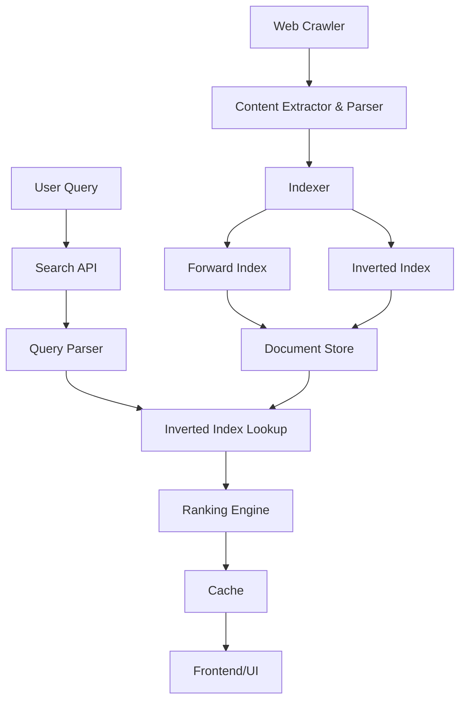
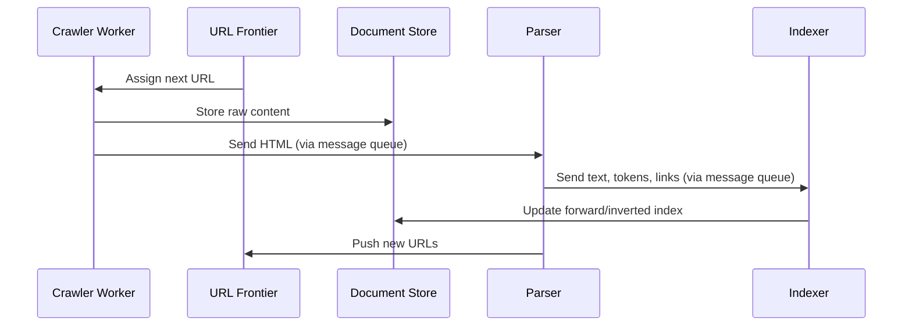
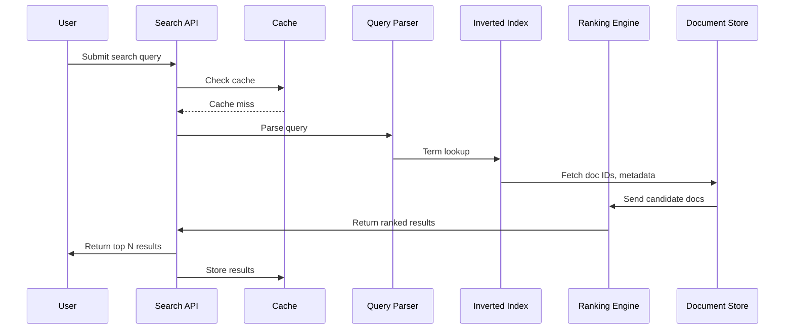
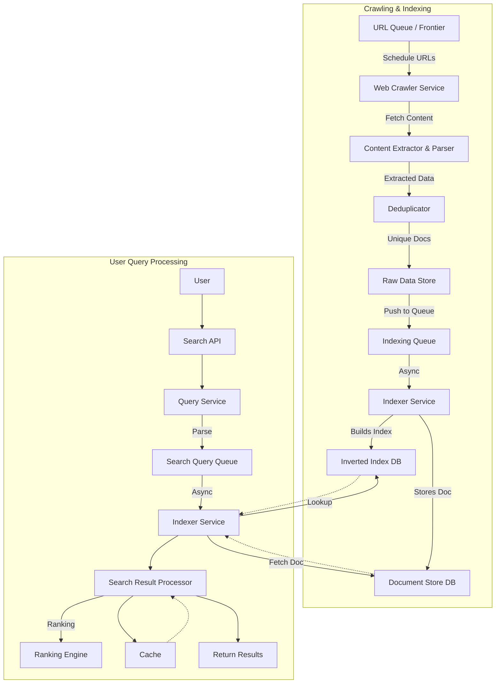
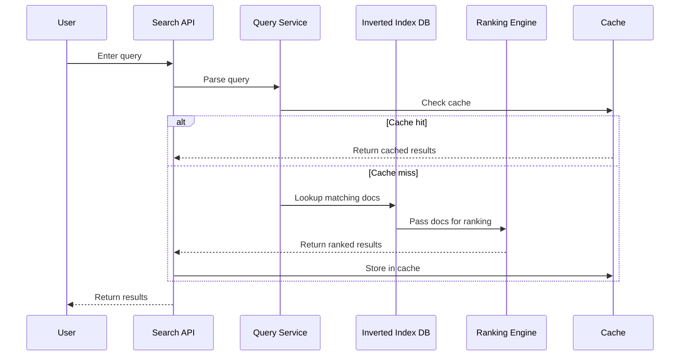

# Section 1

Certainly! Below is a detailed, **integrated Markdown blog section** on designing a large-scale search engine, combining narrative, slides, code snippets, diagrams (in ASCII for Markdown), and a "Tips and Tricks" section.

---

# 🚀 Designing a Large-Scale Search Engine (Like Google): System Design Deep Dive

Building a search engine is one of the pinnacles of system design—where distributed computing, data engineering, and algorithmic ranking collide. In this post, we'll walk through designing a search engine from first principles, synthesizing key insights from lecture-style explanations **and** concise reference slides. We'll cover architecture, core components, major challenges, and sprinkle in real-world tips, diagrams, and code snippets.

---

## 🏗️ **What Are We Building?**

Our goal: **A search engine that can crawl and index billions of web pages, serve keyword-based queries in real-time, and keep results fresh and relevant.**

**Key Users:**
- **General users:** Seeking fast, relevant search results.
- **Internal analytics teams:** Querying data for insights and improvements.

---

## 🔑 **Functional Building Blocks**

| #   | Component       | Description                                                                 |
|-----|----------------|-----------------------------------------------------------------------------|
| 1   | Web Crawling   | Discover and fetch web pages at internet scale.                             |
| 2   | Indexing       | Extract, normalize, and structure text for fast querying.                   |
| 3   | Keyword Search | Accept keyword queries; retrieve relevant documents.                        |
| 4   | Ranking        | Score and sort results by relevance (TF-IDF, PageRank, freshness).          |
| 5   | Re-indexing    | Periodically refresh index to keep content up-to-date.                      |

---

## ⚙️ **Non-Functional Requirements**

- **Performance:** < 200ms query response time.
- **Scalability:** Billions of pages, 50,000 QPS.
- **Freshness:** Update index within hours of content changes.
- **Fault Tolerance:** No single point of failure.
- **Storage Efficiency:** Deduplication, compression for petabytes of data.

---

## 🧩 **Core Components: Architecture Overview**

```
+-------------------+        +----------------+        +--------------------+
|   User / API      |<------>|   Query Layer  |<------>|   Index Storage    |
+-------------------+        +----------------+        +--------------------+
         ^                            ^                        ^
         |                            |                        |
         |                            |                        |
         v                            |                        |
+-------------------+        +----------------+        +--------------------+
|   Cache Layer     |        | Ranking Engine |        | Forward/Inverted   |
+-------------------+        +----------------+        | Indexes            |
         ^                            ^                +--------------------+
         |                            |
         v                            v
+-------------------+        +----------------+        +--------------------+
|  Crawler Service  |<------>| URL Frontier   |------->| Document Store     |
+-------------------+        +----------------+        +--------------------+
```

**Component descriptions:**
- **Crawler Service:** Fetches web pages, obeys rate limits & robots.txt.
- **URL Frontier & Scheduler:** Prioritizes next URLs to crawl.
- **Content Extractor & Parser:** Cleans HTML, extracts text/links.
- **Indexer:** Builds forward and inverted indexes, extracts ranking features.
- **Inverted Index Store:** Maps terms to docIDs for fast lookup.
- **Query Service:** Parses incoming queries, fetches & ranks results.
- **Ranking Engine:** Scores documents (TF-IDF, PageRank, freshness).
- **Cache & Frontend:** Caches frequent queries, handles UI/API requests.

---

## 📊 **Scale & Bottlenecks: By The Numbers**

- **Webpages to index:** 100+ billion (MVP: 100M)
- **Avg. page size:** 100KB → 10 TB for 100M pages (raw), 3–5 TB tokenized
- **Index size:** Inverted index ~500–800 GB, Forward index ~5 TB
- **Crawling rate:** 100M pages in 7 days ⇒ ~170 pages/sec
- **Query load:** 10M users × 5 queries/day = 50M queries/day (~1,000 peak QPS)

### **Major Bottlenecks & Solutions**

| Layer         | Bottleneck                       | Solution                                      |
|---------------|----------------------------------|-----------------------------------------------|
| Crawling      | Bandwidth, duplicate content     | Distributed crawling, deduplication, politeness|
| Indexing      | Memory & I/O pressure            | Segment-based indexing, compression           |
| Query         | Latency at high QPS              | Sharded indexes, caching, in-memory lookups   |
| Storage       | Petabyte-scale data              | Distributed FS (HDFS/S3), cold/hot separation |
| Freshness     | High update frequency            | Adaptive re-crawling, prioritization          |

---

## 🛠️ **Sample Code Snippets**

### **1. Deduplication with SimHash (Python)**

```python
import simhash

def is_duplicate(new_page_content, existing_hashes, threshold=3):
    new_hash = simhash.Simhash(new_page_content)
    for h in existing_hashes:
        if new_hash.distance(h) < threshold:
            return True
    return False
```

### **2. Simple Inverted Index (Python)**

```python
from collections import defaultdict

def build_inverted_index(docs):
    index = defaultdict(list)
    for doc_id, content in docs.items():
        for word in set(content.split()):
            index[word].append(doc_id)
    return index

# Example usage
docs = {1: "search engine design", 2: "system design interview"}
inverted_index = build_inverted_index(docs)
print(inverted_index['design'])  # [1, 2]
```

### **3. Query Processing Flow (Pseudocode)**

```plaintext
function process_query(query):
    tokens = tokenize_and_normalize(query)
    candidate_docs = set()
    for token in tokens:
        candidate_docs |= inverted_index[token]
    scored_docs = rank(candidate_docs, query)
    return format_results(top_k(scored_docs))
```

---

## 🧠 **Key Design Decisions**

- **Sharded architecture:** Partition index by term hash for scalability.
- **Replication:** Replicate index/data for fault tolerance.
- **Segmented Indexing:** Build indexes in segments to manage load and speed up merges.
- **Distributed Crawler:** Hash URLs by domain for politeness and parallelism.
- **Caching:** Use Redis/Memcached for hot queries.

---

## 💡 **Tips and Tricks**

- **Politeness:** Always respect `robots.txt` and crawl-delay to avoid bans.
- **Deduplication:** Use SimHash or fingerprinting to prevent re-crawling same/similar content.
- **Compression:** Store indexes using delta encoding, front-coding for space savings.
- **Adaptive Recrawling:** Prioritize high-change sites for freshness; use sitemaps/change frequency signals.
- **Query Caching:** Cache frequent/popular queries for instant retrieval.
- **Monitoring:** Track crawl success rates, index update lag, query latency in real time.
- **Backoff Strategies:** Exponential backoff for failed fetches to avoid hammering flaky sites.
- **Cold/Hot Storage:** Archive old/rarely accessed docs to cheap storage; keep hot data in fast SSD-backed stores.

---

## 🏁 **Conclusion: Bringing It All Together**

Designing a web-scale search engine is a tour-de-force in distributed systems, data engineering, and algorithmic ranking. By breaking the problem into manageable blocks—crawling, indexing, querying, ranking—and rigorously addressing scale, performance, and reliability, you can architect a system that not only works, but works at **web scale**.

---

### **Further Reading**

- [Google File System](https://research.google/pubs/pub51/)
- [MapReduce](https://research.google/pubs/pub62/)
- [Elasticsearch Architecture](https://www.elastic.co/guide/en/elasticsearch/reference/current/index.html)

---

**Ready for the next step?** In future sections, we'll deep-dive into each subsystem (crawling, indexing, ranking) with diagrams and code examples!

---

## (ASCII) Diagram: End-to-End Data Flow

```
   +----------+      +----------+      +----------+      +----------+
   |  Crawler |----->|  Parser  |----->| Indexer  |----->|  Storage |
   +----------+      +----------+      +----------+      +----------+
                                                |
                                                v
                                         +-------------+
                                         |  Query/API  |
                                         +-------------+
                                                |
                                                v
                                          +-----------+
                                          |  Ranking  |
                                          +-----------+
                                                |
                                                v
                                          +-----------+
                                          |   Cache   |
                                          +-----------+
                                                |
                                                v
                                         +------------+
                                         | User/Client|
                                         +------------+
```

---

**Happy designing!**

# Section 2

Certainly! Here’s a comprehensive **Markdown blog section** that synthesizes the transcript and slides, augmented with code snippets, diagrams (as Mermaid), and a practical 'Tips and Tricks' section for designing a scalable search engine.

---

# Designing a Web-Scale Search Engine: Architecture, Bottlenecks & Best Practices

Building a modern search engine—one that can crawl, index, and search the web at scale—is among the most challenging system design endeavors. In this section, we'll walk through the process of scoping, architecting, and optimizing a search engine like Google, blending theory with practical engineering decisions.

## Table of Contents

- [System Overview](#system-overview)
- [Scale and Traffic Estimation](#scale-and-traffic-estimation)
- [Data and Indexing Architecture](#data-and-indexing-architecture)
- [Core Components and Workflow](#core-components-and-workflow)
- [Key Bottlenecks and Solutions](#key-bottlenecks-and-solutions)
- [Crucial Design Decisions](#crucial-design-decisions)
- [Sample Data Models](#sample-data-models)
- [Tips and Tricks](#tips-and-tricks)

---

## System Overview

**Goal:**  
Design a search engine that can:

- Crawl and index billions of web pages
- Serve keyword-based queries with ranked, relevant results in real-time
- Update its index efficiently for freshness

**Primary Users:**

- General users (web search)
- Internal analytics teams

**Functional Requirements**

| Requirement       | Description                                                     |
|-------------------|-----------------------------------------------------------------|
| Web Crawling      | Discover and fetch web pages at scale                           |
| Indexing          | Extract, normalize, and structure text for fast querying        |
| Keyword Search    | Accept queries and return matching documents                    |
| Ranking           | Score and sort results by relevance                             |
| Re-indexing       | Periodically re-crawl for updated/fresh content                |

**Non-Functional Requirements**

- **Performance:** <200ms query response time
- **Scalability:** Billions of documents, 50K QPS
- **Freshness:** Hourly index updates
- **Fault Tolerance:** No SPOF, retry on failure
- **Storage Efficiency:** Compression, deduplication

---

## Scale and Traffic Estimation

Before architecting, estimate the scale to guide your decisions.

#### Web Size (MVP target):

- **Indexed Pages:** 100M
- **Average Page Size:** 100 KB
- **Raw Storage:** ~10 TB
- **After Processing:** 3–5 TB
- **Inverted Index:** 500–800 GB
- **Forward Index:** ~5 TB
- **Metadata:** 100–200 GB

#### Traffic Load:

- **Active Users:** 10M
- **Queries/User/Day:** 5
- **Total Queries/Day:** 50M
- **Peak QPS:** 1,000–2,000 (with burst handling)
- **Read:Write Ratio:** 95:5

#### Crawling Throughput:

- **Goal:** 100M pages in 7 days
- **Pages/sec needed:** ~170
- **With 500 workers:** ~0.34 pages/sec/worker

---

## Data and Indexing Architecture

**Index Types:**

- **Inverted Index** (term → list of docIDs): For fast keyword search
- **Forward Index** (docID → content/metadata): For efficient ranking and result formatting

**Index Size Estimates (for 100M pages):**

| Component       | Size         |
|-----------------|-------------|
| Raw HTML        | 10 TB       |
| Tokenized Text  | 3–5 TB      |
| Inverted Index  | 500–800 GB  |
| Forward Index   | 5 TB        |
| Metadata        | 100–200 GB  |

---

## Core Components and Workflow

### High-Level Architecture Diagram

```mermaid
flowchart TD
    subgraph Crawl
        A[URL Frontier & Scheduler] --> B[Crawler Workers]
        B --> C[Document Store]
        B --> D[Extracted URLs]
        D --> A
    end
    subgraph Index
        C --> E[Content Extractor & Parser]
        E --> F[Indexer Service]
        F --> G[Forward Index]
        F --> H[Inverted Index]
        F --> I[Metadata]
    end
    subgraph Search
        J[User Query]
        J --> K[Search API]
        K --> L[Cache (Redis/Memcached)]
        L -- miss --> M[Query Parser]
        M --> N[Inverted Index Lookup]
        N --> O[Ranking Engine]
        O --> P[Result Formatter]
        P --> Q[Return Results]
        L -- hit --> Q
    end
```

### Component Descriptions

- **Web Crawler Service:** Distributed workers fetch pages, respect robots.txt/rate limits.
- **URL Frontier & Scheduler:** Prioritizes URLs, manages politeness & domain partitioning.
- **Content Extractor & Parser:** Cleans HTML, tokenizes, extracts metadata/links.
- **Indexer Service:** Builds forward/inverted indexes, computes rank features.
- **Document Store:** Stores raw & parsed content, metadata.
- **Inverted Index Store:** Maps tokens to docIDs.
- **Query Service:** Handles searches, looks up indexes.
- **Ranking Engine:** Scores & sorts candidates (TF-IDF, PageRank, freshness).
- **Search API:** User-facing interface (UI/API Gateway).
- **Cache:** In-memory hot query/result cache.

---

## Key Bottlenecks and Solutions

| Layer            | Bottleneck                                  | Solution(s)                                                      |
|------------------|---------------------------------------------|------------------------------------------------------------------|
| **Crawling**     | Bandwidth, site rate limits, duplication    | Distributed crawling, deduplication filters, crawl scheduling    |
| **Indexing**     | High memory/disk I/O                        | Segment-based indexing, delta/front coding compression           |
| **Query**        | Latency spikes at high QPS                  | Sharded inverted indexes, hot result caching, in-memory lookups  |
| **Storage**      | Petabyte-scale, fault tolerance             | Distributed file systems (HDFS/S3), hot/cold storage separation  |
| **Freshness**    | Web changes rapidly                         | Adaptive re-crawling, prioritize high-change sites, content diffs|

---

## Crucial Design Decisions

1. **Sharded Inverted Index:**  
   Split index by term hash; each shard on a different server, enabling horizontal scaling.

2. **Dual Indexing:**  
   Use both inverted (for search) and forward (for ranking/snippet generation) indexes.

3. **Crawler Partitioning:**  
   Assign crawler workers by domain hash to avoid contention and simplify politeness enforcement.

4. **Replication:**  
   Replicate critical data/index shards across nodes for high availability.

5. **Caching:**  
   Use Redis/Memcached to cache frequent query results, reducing index/database load.

6. **Tech Stack Choices:**  
   - **Crawlers:** Distributed (Celery, Kafka, custom)
   - **Index/Data Store:** NoSQL (MongoDB, DynamoDB), ElasticSearch for full-text search
   - **Storage:** Object (S3/GCS) for raw; distributed file systems for indexes
   - **Query API:** Load-balanced, horizontally scalable

---

## Sample Data Models

**Crawler URL Queue (Relational/NoSQL)**
```sql
CREATE TABLE UrlQueue (
  url VARCHAR(1024) PRIMARY KEY,
  domain_hash INT,      -- For partitioning
  status ENUM('pending','processing','done','failed'),
  last_crawled TIMESTAMP,
  priority INT
);
```

**Forward Index (NoSQL)**
```json
{
  "doc_id": "12345",
  "url": "https://example.com",
  "tokens": ["search", "engine", "design"],
  "metadata": {
    "title": "System Design of Search Engine",
    "pagerank": 0.42,
    "crawl_date": "2024-06-09"
  }
}
```

**Inverted Index (NoSQL)**
```json
{
  "token": "search",
  "doc_ids": [
    {"doc_id": "12345", "positions": [1, 7], "tf": 2},
    {"doc_id": "67890", "positions": [3], "tf": 1}
  ]
}
```

---

## Tips and Tricks

- **Always Design for Peak, Not Average:**  
  Systems must handle traffic spikes gracefully. Base capacity planning on peak QPS, not daily averages.

- **Sharding is Your Friend:**  
  Both crawling and indexing benefit immensely from hashing and partitioning; this enables horizontal scaling and easier failover.

- **Cache Aggressively:**  
  Hot queries often account for a large chunk of load. Use Redis/Memcached for low-latency response and to offload the index.

- **Politeness Wins:**  
  Respect robots.txt, use dynamic backoff and per-domain crawling quotas. This keeps your crawler from being blacklisted.

- **Optimize for Read-Heavy Workloads:**  
  95%+ of operations are reads (searches). Use data structures and storage engines that optimize for fast, concurrent reads.

- **Batch Writes, Stream Reads:**  
  Real-time indexing isn’t always necessary—batch new document processing, but serve queries in real-time.

- **Compression & Deduplication:**  
  Storage can explode at web scale. Use techniques like SimHash for deduplication and delta encoding for compressing indexes.

- **Monitor Everything:**  
  Track crawl rates, index size, search latency, and error rates. Implement dashboards and alerts for early detection.

- **Prioritize Freshness:**  
  Use content diffing and change-rate heuristics to prioritize re-crawling frequently updated sites.

---

## Example: Search Query Flow in Pseudocode

```python
def search(query):
    # 1. Check cache for hot query
    cached_result = redis.get(query)
    if cached_result:
        return cached_result

    # 2. Parse query and tokenize
    tokens = tokenize(query)

    # 3. Fetch relevant documents from inverted index
    doc_candidates = set()
    for token in tokens:
        doc_candidates |= inverted_index.get(token, set())

    # 4. Rank documents
    ranked_docs = ranker.rank(query, doc_candidates)

    # 5. Format result and cache
    results = format_results(ranked_docs)
    redis.set(query, results, ex=60)  # Cache for 1 minute

    return results
```

---

## Conclusion

Designing a web-scale search engine involves carefully estimating scale, architecting for both throughput and latency, and proactively addressing bottlenecks at every layer. By leveraging distributed systems, aggressive caching, and adaptive crawling/indexing, you can build a robust, scalable, and fast search engine capable of serving millions of users and billions of documents.

---

**Next Steps:**  
In the next section, we'll dive into the detailed high-level design and component interactions, including scaling strategies for each subsystem.

---

**_Happy Building!_** 🚀

# Section 3

Certainly! Here is a detailed **Markdown blog section** that integrates both the transcript and the slides, adds illustrative diagrams (in Markdown/ASCII for portability), practical **code snippets**, and a **Tips & Tricks** section for designing a scalable **search engine**.

---

# 🚀 Building a Scalable Search Engine: High-Level Design, Components, and Workflows

Designing a web-scale search engine (think Google, Bing, or DuckDuckGo) is a classic system design challenge. The goal: **crawl and index billions of web pages, serve keyword queries in real-time, and deliver relevant, ranked results—at scale**.

In this section, we'll break down the architecture, core components, workflows, and practical tips for building your own search engine, integrating key concepts from both a detailed technical transcript and concise slide deck.

---

## 🏗️ High-Level Architecture

At a glance, a modern search engine consists of several loosely coupled, horizontally scalable components:



---

## 🧩 Core Components

Let's dive into each component and how they interact.

### 1. 🌐 Web Crawler Service

- **Role:** Continuously fetches and downloads web pages, respecting robots.txt and rate limits.
- **Coordination:** Distributed workers pull from a sharded URL frontier.
- **Duplicate Detection:** Uses content hashes/fingerprints to avoid redundant crawling.

```python
import requests
import hashlib

def fetch_url(url):
    resp = requests.get(url, timeout=3)
    content_hash = hashlib.sha256(resp.content).hexdigest()
    # Store raw content and hash for deduplication
    return resp.content, content_hash
```

### 2. 🧭 URL Frontier & Scheduler

- **Role:** Prioritized queue of URLs to crawl, sharded by domain hash.
- **Scheduler:** Enforces politeness, rate limits, retry logic.

```python
from queue import PriorityQueue

url_frontier = PriorityQueue()
# url_frontier.put((-priority, url))  # Higher priority first
```

### 3. 📝 Content Extractor & Parser

- **Role:** Cleans HTML, extracts visible text, metadata, and outgoing links.
- **Passes structured data to the indexer.**

```python
from bs4 import BeautifulSoup

def extract_content(html):
    soup = BeautifulSoup(html, 'html.parser')
    text = soup.get_text()
    links = [a['href'] for a in soup.find_all('a', href=True)]
    return text, links
```

### 4. 🧠 Indexer Service

- **Role:** Tokenizes, stems, removes stop words, and builds both forward and inverted indexes.

```python
import nltk
from nltk.tokenize import word_tokenize
from nltk.corpus import stopwords

def tokenize_and_index(text, doc_id, inverted_index):
    tokens = word_tokenize(text.lower())
    tokens = [t for t in tokens if t.isalnum()]
    tokens = [t for t in tokens if t not in stopwords.words('english')]
    for token in tokens:
        inverted_index.setdefault(token, set()).add(doc_id)
```

### 5. 📦 Document Store

- **Role:** Stores raw HTML, parsed content, and metadata.
- **Implementation:** NoSQL DB (MongoDB, DynamoDB) or object storage (S3, GCS).

### 6. 📚 Inverted Index Store

- **Role:** Maps tokens to docIDs for fast lookups.
- **Partitioned and replicated** for scalability and fault tolerance.

### 7. 🔍 Query Service

- **Role:** Parses user queries, looks up terms in the inverted index, and fetches candidate documents.
- **Handles synonyms, spelling corrections (optional).**

### 8. 🏆 Ranking Engine

- **Role:** Scores documents using algorithms like TF-IDF, PageRank, and freshness.
- **Returns top N results** for user queries.

### 9. 🛠 Search API

- **Role:** Exposes endpoints for user queries and returns ranked, formatted results.
- **Handles caching** for hot queries.

```python
from fastapi import FastAPI, Query

app = FastAPI()

@app.get("/search")
def search(q: str):
    # 1. Parse query
    # 2. Lookup in inverted index
    # 3. Rank results
    # 4. Return as JSON
    pass
```

### 10. ⚡ Cache & Frontend

- **Role:** In-memory (Redis/Memcached) cache for popular queries; frontend/UI presents results.
- **Ensures sub-200ms response times**.

---

## 🔄 End-to-End Workflow

### 1. **Crawling & Indexing**



### 2. **Query Processing**



---

## 🗃️ High-Level Database Schema

| Table         | Key Fields                        | Description                                 |
|---------------|-----------------------------------|---------------------------------------------|
| UrlQueue      | url, priority, crawl_status, ...  | Sharded, prioritized URL queue              |
| Documents     | docID, url, title, content, ...   | Forward index, metadata, raw/parsed content |
| InvertedIndex | token, [docIDs], positions, freq  | Token → docIDs mapping                      |

---

## ⚙️ Communication Patterns

- **Crawler → Parser → Indexer:** Message queues (Kafka, RabbitMQ).
- **Indexer → Index Store:** Batched writes via queues.
- **Search API → Query Service:** HTTP/gRPC APIs.
- **Cache:** Redis/Memcached for hot queries.
- **Monitoring:** Metrics (Prometheus, Grafana) for crawl, index, and query health.

---

## 🏆 Ranking Algorithms: TF-IDF & PageRank (Simplified)

```python
import math

def tfidf(term, doc, doc_freq, num_docs):
    tf = doc.count(term) / len(doc)
    idf = math.log(num_docs / (1 + doc_freq[term]))
    return tf * idf

def pagerank(graph, d=0.85, num_iter=10):
    # graph: dict {url: [linked_urls]}
    N = len(graph)
    ranks = {url: 1/N for url in graph}
    for _ in range(num_iter):
        new_ranks = {}
        for url in graph:
            rank_sum = sum(ranks[other] / len(graph[other]) for other in graph if url in graph[other])
            new_ranks[url] = (1-d)/N + d * rank_sum
        ranks = new_ranks
    return ranks
```

---

## 📈 Scaling & Fault Tolerance

- **Horizontal Partitioning:** Shard index and URL frontier by hash of domain or token.
- **Replication:** Store multiple copies for high availability.
- **Retry & Failover:** Crawler and indexer workers reassign tasks on failure.

---

## 💡 Tips and Tricks

1. **Respect Crawl Politeness:** Always honor robots.txt and site rate limits to avoid being blacklisted.
2. **Deduplicate Early:** Hash content to avoid storing/crawling duplicates.
3. **Prioritize Fresh Content:** Frequently-changing sites (news, blogs) should be re-crawled more often.
4. **Compress Indexes:** Use techniques like delta encoding or front-coding to reduce storage footprint.
5. **Cache Hot Queries:** Use LRU/Eviction strategies to keep cache effective and memory-efficient.
6. **Monitor Everything:** Set up dashboards/alerts for crawl rate, index build time, query latency, and errors.
7. **Partition by Domain:** Prevent any single domain from overwhelming the system or index.
8. **Graceful Degradation:** If ranking fails, still return results; if cache fails, fall back to index.
9. **Batch Writes:** Indexing is I/O-heavy—batch updates to optimize throughput.
10. **Scale Out, Not Up:** Add more workers/nodes, not just CPU/RAM.

---

## 📦 Example: Minimal Search API with Caching (Python + FastAPI + Redis)

```python
from fastapi import FastAPI, Query
import redis

app = FastAPI()
cache = redis.Redis(host='localhost', port=6379)

@app.get("/search")
def search(q: str):
    cache_key = f"search:{q}"
    cached = cache.get(cache_key)
    if cached:
        return {"results": eval(cached), "source": "cache"}
    # Dummy: Lookup, ranking, formatting
    results = ["Page1", "Page2", "Page3"]
    cache.set(cache_key, str(results), ex=60*10)  # Cache 10 min
    return {"results": results, "source": "live"}
```

---

## 📊 Final Thoughts

A scalable, robust search engine requires careful **componentization**, **horizontal scaling**, **caching**, and **fault tolerance**. While the above system design is simplified, it forms the backbone for production-grade systems powering the world's search experience.

**Next Steps:** Once your MVP is up, iterate on relevance, add real-time indexing, and consider advanced ranking, personalization, and analytics.

---

**Happy Searching!** 🚀

---

**Further Reading:**  
- [Google's Original PageRank Paper](http://ilpubs.stanford.edu:8090/422/1/1999-66.pdf)  
- [Elasticsearch: The Definitive Guide](https://www.elastic.co/guide/en/elasticsearch/guide/current/index.html)  
- [Designing Data-Intensive Applications by Martin Kleppmann](https://dataintensive.net/)  

---

*If you found this useful, share or bookmark for your next system design interview!*

# Section 4

Certainly! Here is a **detailed Markdown blog section** integrating the transcript and slide content for the "Tech and Infra Decisions" stage of designing a web-scale search engine. This section covers decisions, rationale, sample code snippets, a high-level component diagram (in Mermaid), and a 'Tips and Tricks' section.

---

# Step 4: Making Tech & Infrastructure Decisions for a Web-Scale Search Engine

Building a search engine that can crawl, index, and serve billions of web pages in real time is a massive systems challenge. In this step, we’ll walk through the critical technology and infrastructure decisions you need to make to ensure scalability, reliability, and high performance.

## Key Decision Areas

We’ll cover the following architecture areas:

- **Crawler Infrastructure**
- **Storage Strategy**
- **Indexing Engine**
- **Ranking Algorithms**
- **API & Query Optimization**
- **Scalability & Fault Tolerance**

---

### 1. Crawler Infrastructure

**Challenge:** Crawling millions of URLs in parallel without overloading any single machine or violating site rate limits.

**Solution:**  
Adopt a **distributed crawling system**. Use:

- **Task Distribution:** [Apache Kafka](https://kafka.apache.org/) (for reliable messaging/queueing) and [Celery](https://docs.celeryq.dev/) (for distributed task execution)
- **Cloud Providers:** AWS EC2 or Google Cloud Compute for infrastructure that can scale up/down elastically.

**Sample: Distributed Crawl Worker (Python + Celery)**
```python
from celery import Celery

app = Celery('crawler', broker='kafka://localhost:9092')

@app.task
def fetch_url(url):
    # Respect robots.txt, handle rate limits, fetch HTML
    html = download_html(url)
    # Store to document store
    store_raw_content(url, html)
    # Extract links, push to Kafka for further crawling
    links = extract_links(html)
    for link in links:
        app.send_task('crawler.fetch_url', args=[link])
```
---

### 2. Storage Strategy

**Challenge:** Efficiently storing and retrieving petabyte-scale raw and processed data.

**Solution:**

- **NoSQL DBs** (e.g., MongoDB, DynamoDB) for document and inverted indexes — flexible schema and fast lookups.
- **Object Storage** (e.g., AWS S3, Google Cloud Storage) for raw crawled HTML, backups, and large datasets.

**Database Table Example (MongoDB)**
```json
// Document stored in MongoDB's "documents" collection
{
  "_id": "docid123",
  "url": "https://example.com",
  "title": "Example Page",
  "content": "tokenized, normalized content",
  "links": ["https://another.com", ...],
  "last_crawled": "2024-06-07T13:00:00Z"
}
```

---

### 3. Indexing Engine

**Challenge:** Fast, scalable indexing and real-time updates.

**Solution:**

- Use [Elasticsearch](https://www.elastic.co/elasticsearch/) for full-text search and ranking, or build a custom indexer if you need fine-grained control.
- Support **real-time indexing**: As new content is crawled, index it immediately so queries return fresh results.

**Sample: Indexing Document into Elasticsearch (Python)**
```python
from elasticsearch import Elasticsearch

es = Elasticsearch("http://localhost:9200")

def index_document(doc_id, content):
    es.index(index="web_docs", id=doc_id, body={"content": content})
```

---

### 4. Ranking Algorithms

**Challenge:** Returning the most relevant and authoritative results.

**Solution:**

- **TF-IDF** for basic keyword relevance.
- **PageRank** for link-based authority.
- **Freshness Score** for prioritizing recent content.

**Sample: TF-IDF Calculation (Simplified)**
```python
import math

def tf_idf(term, doc, corpus):
    tf = doc.count(term) / len(doc)
    idf = math.log(len(corpus) / (1 + sum(1 for d in corpus if term in d)))
    return tf * idf
```

---

### 5. API & Query Optimization

**Challenge:** Low-latency, high-QPS query serving.

**Solution:**

- **Load Balancing:** AWS ALB or Nginx to distribute queries.
- **Caching:** Use Redis or Memcached for hot queries.

**Sample: Caching Query Results with Redis**
```python
import redis

r = redis.Redis()

def search_query(query):
    cached = r.get(query)
    if cached:
        return cached
    results = perform_search(query)
    r.set(query, results, ex=300)  # Cache for 5 min
    return results
```

---

### 6. Scalability & Fault Tolerance

**Challenge:** Handling growing load and failures gracefully.

**Solution:**

- **Horizontal Scaling:** Add more servers as needed.
- **Replication & Failover:** Use Kafka replication or managed DBs with failover (e.g., AWS RDS Multi-AZ).

---

## Component Diagram: High-Level Architecture

```mermaid
graph TD
    A[User/API] --> B[Load Balancer (Nginx/AWS ALB)]
    B --> C[Search API]
    C --> D[Query Parser]
    D --> E[Inverted Index Store (MongoDB/Elasticsearch)]
    E --> F[Ranking Engine (TF-IDF, PageRank, Freshness)]
    F --> G[Cache Layer (Redis/Memcached)]
    F --> H[Document Store (MongoDB/S3)]
    subgraph "Crawling & Indexing"
      I[Distributed Crawler Workers]
      J[URL Frontier & Scheduler]
      K[Content Extractor & Parser]
      L[Indexer Service]
      M[Kafka / Celery Queue]
      J --> I
      I --> K
      K --> L
      L --> E
      L --> H
      I --> M
      M --> I
    end
```

---

## Tips and Tricks

- **Respect robots.txt and implement politeness policies**: Prevent your crawler from getting banned.
- **Partition crawling by domain hash**: Reduces risk of overloading individual sites and simplifies deduplication.
- **Use compression in storage**: Techniques like delta encoding and front coding can dramatically reduce storage cost.
- **Cache popular queries aggressively**: 70-80% of search traffic is often for a small subset of queries.
- **Sharding and replication**: Both your index and storage layers should be sharded and replicated for fault tolerance and scalability.
- **Monitor everything**: Track crawl rates, index latency, search latency, and error rates using a metrics pipeline.
- **Automate failover**: Ensure backup instances or replica sets can take over seamlessly in case of failure.

---

## Summary

By making strategic tech and infrastructure choices—distributed crawling, NoSQL document stores, real-time indexing, robust ranking, and cloud-based scaling—you can build a search engine that’s fast, scalable, and reliable at web scale. These decisions form the backbone of the system and are essential for delivering a world-class search experience.

> **Note:** The technologies listed (Kafka, Celery, MongoDB, Elasticsearch, etc.) are indicative. Always consider equivalent alternatives that best fit your team's expertise and your specific requirements.

---

In the next section, we’ll put all these decisions together into a unified architecture and discuss how each challenge and requirement is addressed in the final design.

---

# Section 5

Certainly! Here is a detailed **Markdown blog section** that integrates the provided transcript and slides into a comprehensive, educational, and engaging blog post. This section walks through the **final search engine system design**, includes code snippets, diagrams (as Markdown), and a **Tips and Tricks** section.

---

# Search Engine System Design: From Web Crawling to Fast Search

Designing a web-scale search engine—like Google or Bing—is a massive challenge. It requires robust architecture, careful resource management, and clever algorithms to crawl, index, and deliver relevant results from billions of documents in real-time. In this post, we break down the **final system design** for a modern search engine, combining architectural insights, scalable workflows, and hands-on engineering tips.

---

## System Overview: High-Level Architecture

Let's start with the big picture. The search engine comprises two main workflows:

- **Web Crawling & Indexing**: Continuously fetching, processing, and storing web pages at scale.
- **User Query Processing**: Accepting search queries, retrieving documents, ranking, and returning results in real-time.

Here’s a simplified component diagram (in Markdown):



---

## Component Deep Dive

### 1. **URL Frontier & Scheduler**

- **What It Does:** Manages a prioritized queue of URLs to crawl, applying freshness policies and politeness (rate limiting per domain, robots.txt).
- **Scale Tactic:** Sharded queues (e.g., by domain hash) allow distributed crawling.

**Example Pseudocode:**
```python
def get_next_url():
    # Prioritize URLs by freshness, domain, etc.
    url = frontier_queue.pop()
    if obey_robots_txt(url):
        return url
    else:
        return get_next_url()
```

---

### 2. **Web Crawler Service**

- **Role:** Fetches web pages, extracts links, and pushes raw HTML to storage.
- **Resilience:** Fault-tolerant and horizontally scalable (hundreds of workers).

**Python Snippet (using requests):**
```python
import requests

def crawl_url(url):
    try:
        resp = requests.get(url, timeout=5)
        if resp.status_code == 200:
            save_raw_html(url, resp.text)
            links = extract_links(resp.text)
            add_links_to_frontier(links)
    except requests.RequestException as e:
        log_error(url, e)
```

---

### 3. **Content Extractor & Deduplicator**

- **Parser:** Cleans HTML, extracts text, metadata, and outgoing links.
- **Deduplication:** Uses hashing (e.g., SimHash) to avoid storing or indexing duplicates.

**Deduplication Example:**
```python
import hashlib

def is_duplicate(content, hash_set):
    content_hash = hashlib.md5(content.encode()).hexdigest()
    if content_hash in hash_set:
        return True
    hash_set.add(content_hash)
    return False
```

---

### 4. **Raw Data Store & Indexing Queue**

- **Raw Store:** Holds raw HTML and parsed content.
- **Queue:** Asynchronous message queue (Kafka, RabbitMQ) decouples crawling from indexing.

---

### 5. **Indexer Service**

- **Task:** Tokenizes text, applies stemming, builds forward and inverted indexes.
- **Indexes:**
  - **Inverted Index:** term → [docIDs]
  - **Forward Index:** docID → [tokens, metadata]

**Indexing Example:**
```python
from collections import defaultdict

def build_inverted_index(docs):
    index = defaultdict(list)
    for doc_id, tokens in docs.items():
        for token in set(tokens):
            index[token].append(doc_id)
    return index
```

---

### 6. **User Query & Ranking Flow**

- **User Search:** Query API parses input, looks up the inverted index for matching docs.
- **Ranking Engine:** Scores results using TF-IDF, PageRank, and freshness.
- **Cache:** Popular queries/results cached in-memory (Redis/Memcached) for speed.

**Query Flow Diagram:**



---

## Scalability, Performance & Fault Tolerance

### Key Strategies:

- **Sharding:** Both crawling and index storage are sharded for horizontal scalability.
- **Asynchronous Queues:** Decouple slow/fast components, buffer spikes, and enable retry.
- **Load Balancers:** Each service is fronted by a load balancer for high QPS handling.
- **Replication & Failover:** Critical databases and queues are replicated for high availability.

**Infrastructure Choices:**

| Layer         | Tech Example              | Reason                                  |
|---------------|--------------------------|-----------------------------------------|
| Crawling      | Kafka, Celery, AWS EC2   | Scalable, resilient worker pools        |
| Index Storage | MongoDB, DynamoDB, S3    | NoSQL for flexible, fast lookups        |
| Caching       | Redis, Memcached         | Millisecond response for hot queries    |
| API           | NGINX, API Gateway       | Load balancing, rate limiting           |

---

## Storage Estimates (Sample MVP)

- **100M pages × 100KB** per page ≈ **10 TB** raw HTML
- **Processed/tokenized:** 3–5 TB
- **Inverted Index:** 500–800 GB
- **Forward Index:** 5 TB
- **Metadata:** 100–200 GB

---

## Tips and Tricks: Scaling Your Search Engine

- **Partition your crawler** by domain hash to avoid hammering single sites.
- **Use deduplication** at both crawling and indexing—saves bandwidth and storage.
- **Compress your indexes** (delta encoding, front-coding) to fit more in RAM.
- **Cache aggressively:** Hot queries and auto-complete suggestions should live in memory.
- **Monitor everything:** Crawl rates, indexing lag, cache hit ratios, and query latency.
- **Retry with backoff:** For failed fetches/crawls, exponential backoff prevents overload.
- **Async everywhere:** Decouple all slow/fast boundaries with queues (Kafka, RabbitMQ).
- **Horizontal scaling:** All major components (crawlers, indexers, API nodes) should be easy to scale out.

---

## Conclusion

Designing a search engine at scale is a complex but fascinating challenge. The architecture above—built from modular, horizontally scalable components—addresses crawling, indexing, querying, and ranking at web scale, while ensuring high availability and fast responses. By combining distributed systems patterns, efficient data structures, and smart engineering decisions, you can build a search platform capable of serving millions of users and billions of documents.

---

**Next Steps:** Stay tuned for the next case study, where we’ll dive into another large-scale system design!

---

**References:**
- [Designing Data-Intensive Applications – Martin Kleppmann](https://dataintensive.net/)
- [Elasticsearch: The Definitive Guide](https://www.elastic.co/guide/en/elasticsearch/guide/current/index.html)
- [How Search Engines Work](https://www.searchenginejournal.com/how-search-engines-work/)

---

*Happy building!* 🚀

