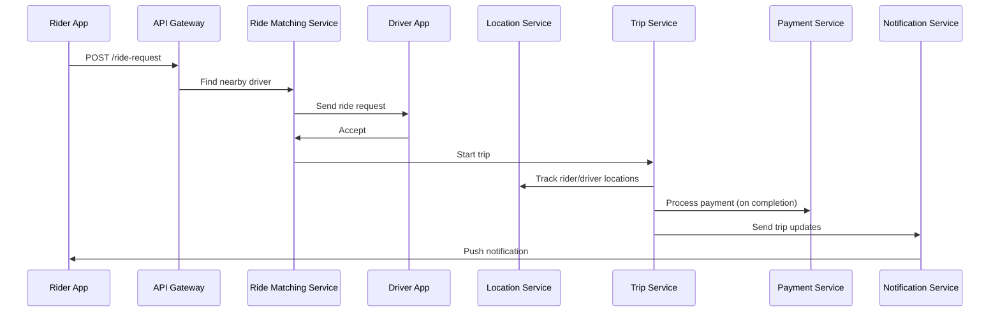
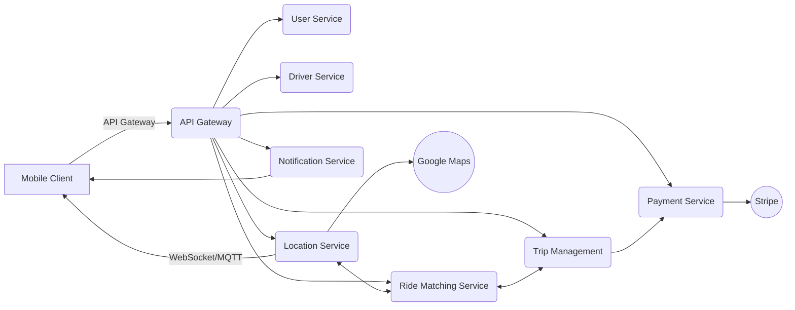
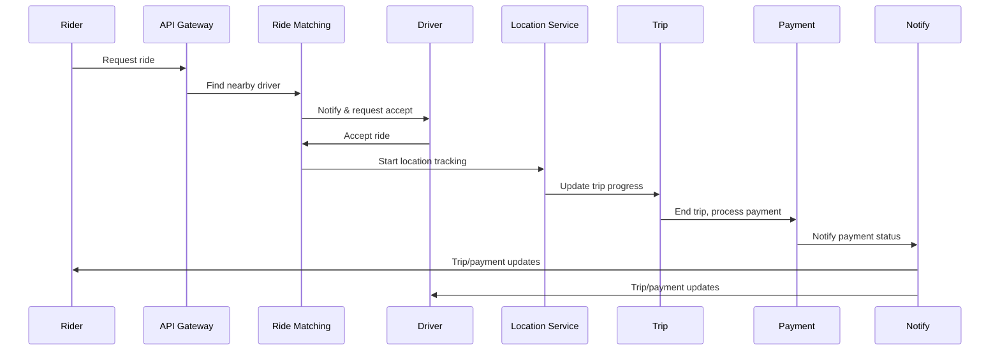
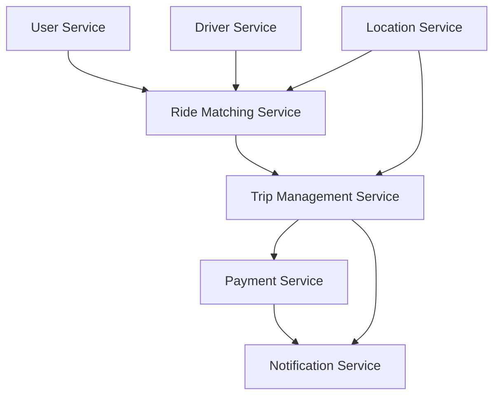
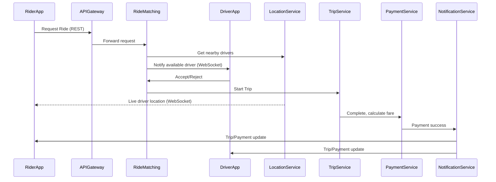
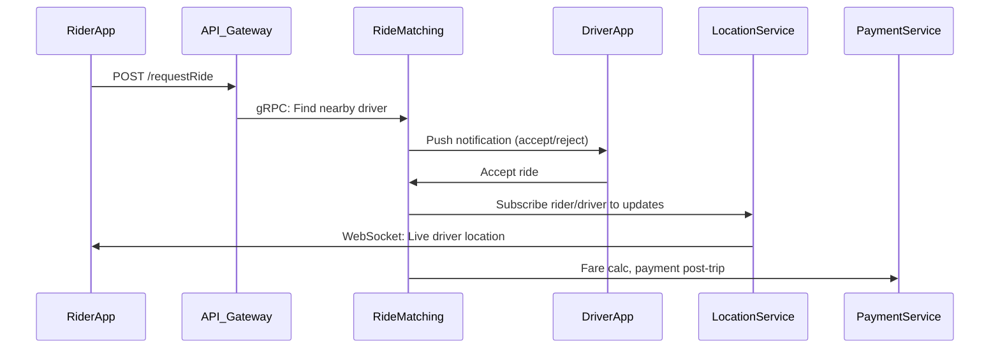
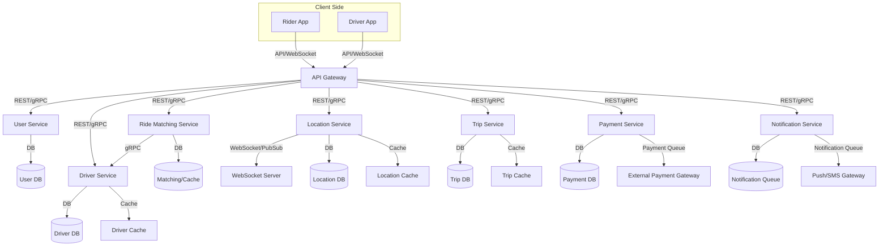
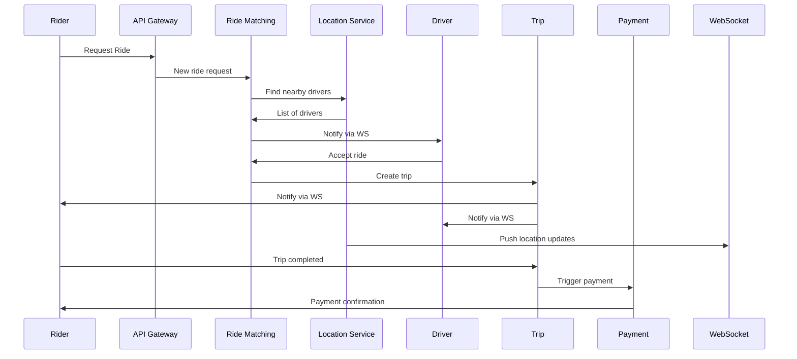

# Section 1

Certainly! Here is a detailed **Markdown blog section** for the "Taxi Hailing App System Design" case study, seamlessly integrating the transcript and slides, with **code snippets**, **ASCII diagrams**, and a **Tips and Tricks** section.

---

# 🚕 Designing a Scalable Taxi Hailing App (Uber-Like) – System Design Deep Dive

Welcome to this comprehensive walkthrough on how to design a taxi-hailing platform, inspired by industry leaders like Uber and Lyft. We’ll cover everything from requirements to architecture, real-time communication, and scaling challenges. Whether you’re prepping for system design interviews or building such a system yourself, this guide is for you!

---

## 1. Understanding The Problem

**Goal:**  
Build a scalable, reliable, and low-latency taxi-hailing platform to match millions of riders and drivers in real-time, process payments, and handle geo-location tracking.

**Core Focus Areas:**

- **Real-time matching** of riders and drivers
- **Geo-location tracking**
- **Payment processing**
- **High concurrency and low latency support**

> **Why is this hard?**  
> - Needs real-time, low-latency, and highly available systems  
> - Involves seamless integration between mobile apps, backend services, and third-party APIs

---

## 2. Functional & Non-Functional Requirements

### 2.1. Functional Requirements (MVP)

- **Rider:**
  - Sign up / login
  - Request a ride (source → destination)
  - Track driver in real time
  - View ETA & trip progress
  - Pay via app

- **Driver:**
  - Sign up / login
  - Go online/offline
  - Accept/reject ride requests
  - Navigate to pickup & drop-off

- **System:**
  - Match riders with nearby available drivers
  - Handle real-time location updates
  - Update ride status (assigned, en route, completed)
  - Calculate fares and process payments

### 2.2. Non-Functional Requirements

- **Scalability:** Handle millions of users and concurrent ride sessions
- **Availability:** 99.99% uptime, especially during peak
- **Low Latency:** <2 seconds to match a ride, instant location updates
- **Data Consistency:** Eventual consistency for location data
- **Security:** Secure authentication, payment, and data privacy

---

## 3. Assumptions & Constraints

### Assumptions

- All users/drivers have GPS-enabled smartphones
- Third-party APIs (e.g., Google Maps, Stripe) are reliable
- MVP launches in a single city/region
- Only in-app digital payments at launch
- WebSockets (or MQTT) are used for real-time comms

### Constraints

- Third-party APIs have rate limits/latency
- Connectivity may be unreliable (tunnels, rural zones)
- Drivers may go offline suddenly
- Limited compute/storage on mobile devices
- Strict expectations for low-latency, high availability

---

## 4. Real-Time, Mapping & System Challenges

- **Real-time system complexity:**  
  - Must match riders and drivers within <2 seconds  
  - Millions of concurrent connections  
  - Location updates every 2-3 seconds

- **Map & Geolocation:**  
  - Live user/driver positions, route recalculation  
  - GPS inaccuracies, map API rate limits  
  - Geocoding and spatial indexing

- **System-level Edge Cases:**  
  - Prevent race conditions in ride assignment  
  - Handle stale/missing location data  
  - Fallbacks for map/payment API failures

---

## 5. Estimating Scale & Usage

| Metric                    | Estimate                        |
|---------------------------|---------------------------------|
| Registered users          | 10 million                      |
| Daily active users (DAU)  | 1 million                       |
| Daily active drivers      | 200,000                         |
| Peak concurrent sessions  | 150,000 (riders + drivers)      |
| Ride requests/day         | 500,000 (~6/sec)                |
| Location updates/sec      | 18/sec                          |
| Map tile views/sec        | 280/sec                         |
| Payment transactions/day  | 100,000 (~1.2/sec)              |

---

## 6. Core Microservices Architecture

```
                +-----------------------+
                |   Mobile Clients      |
                +-----------------------+
                         |
                         v
                +-----------------------+
                |      API Gateway      |<----------------------+
                +-----------------------+                       |
         /         |           |           \                    |
        v          v           v            v                   |
+-----------+ +-----------+ +-----------+ +-----------+         |
| User Svc  | | DriverSvc | | Location  | | Ride Match|         |
+-----------+ +-----------+ |  Service  | |  Service  |         |
                            +-----------+ +-----------+         |
                                             |                  |
                                         +--------+             |
                                         |Payment |             |
                                         |Service |             |
                                         +--------+             |
                                             |                  |
                                      +------------------+      |
                                      | Notification Svc |      |
                                      +------------------+      |
                                                               v
                                               +-----------------------+
                                               |   Third-Party APIs    |
                                               | (Maps, Payments, etc) |
                                               +-----------------------+
```
**Legend:**  
User Svc = User Service  
Driver Svc = Driver Service  
Ride Match = Ride Matching Service

---

### Microservices Breakdown

| Service          | Responsibilities                                        |
|------------------|--------------------------------------------------------|
| **User Service** | Onboarding, authentication, profile management         |
| **Driver Svc**   | Onboarding, vehicle info, availability status          |
| **Location Svc** | Real-time location ingestion, geo-indexing             |
| **Ride Match**   | Proximity-based rider-driver matching                  |
| **Payment**      | Fare calculation, payment processing, refunds          |
| **Trip Mgmt.**   | Trip lifecycle: start, update, complete                |
| **Notification** | Push, SMS, in-app alerts                               |

---

## 7. API Gateway & Communication Patterns

- **External API**: REST/GraphQL via API Gateway
- **Internal Service-to-Service**: gRPC or async messaging (Kafka, NATS)
- **Real-time Events**: WebSockets/MQTT for persistent connections

### API Gateway Responsibilities

- Authentication & Rate Limiting
- Routing to appropriate microservice
- Aggregating responses for frontend

---

## 8. Example API Flows

### 8.1. Rider Requests a Ride



### 8.2. Real-time Location Updates

```python
# Example: WebSocket server for location updates (Python: FastAPI + websockets)
from fastapi import FastAPI, WebSocket
import asyncio

app = FastAPI()

@app.websocket("/ws/location/{user_id}")
async def location_ws(websocket: WebSocket, user_id: str):
    await websocket.accept()
    try:
        while True:
            data = await websocket.receive_json()
            # Forward to Location Service, then notify relevant parties
            process_location_update(user_id, data)
    except Exception as e:
        print(f"Connection closed for {user_id}: {e}")
```

---

## 9. Real-Time Communication Design

- **WebSockets/MQTT**: For persistent, low-latency comms between backend and apps
- **Publish/Subscribe Model**: (e.g., Redis Pub/Sub, Kafka) for location/trip events
- **Fallback**: Polling for unreliable networks

### Scenarios Handled

- Live driver movement on rider map
- Pickup status, in-progress updates, trip completion
- ETA changes, trip cancellation, surge updates

---

## 10. Strategic Tech & Infra Decisions

| Area                | Choices                                    |
|---------------------|--------------------------------------------|
| **Real-Time Comms** | WebSockets vs MQTT                         |
| **Service-to-Svc**  | gRPC (low-latency) vs REST                 |
| **Data Storage**    | SQL (user/trip), NoSQL (logs), Redis/Kafka |
| **Geospatial**      | Geohashing vs H3 for spatial indexing      |
| **Scalability**     | Horizontal scaling, Auto-scaling, K8s      |
| **Fault Tolerance** | Multi-region replication, HA, event streaming|
| **Consistency**     | Strong for ride assignment; eventual for location |

---

## 11. Key Bottlenecks & Scaling Challenges

- **Real-Time Location & Matching:**  
  Write-heavy, low-latency data ingestion; matching engine must scale with driver pool size.

- **Third-Party Dependencies:**  
  Map API rate limits, payment timeouts, and external service latency.

- **Platform Scaling:**  
  Push notifications to millions, state synchronization, and cost-performance tradeoffs.

---

## 12. Tips and Tricks for Taxi Hailing App System Design

### 🚦 Real-time Matching

- Use **spatial indexing** (e.g., Geohash, H3) in Location Service for fast nearby driver lookup.
- Keep driver location in an in-memory, geo-indexed store (like Redis with the GEO* commands).

### 💬 Communication

- Use **WebSockets** or **MQTT** for persistent connections.  
- For unreliable networks, gracefully fallback to HTTP polling.

### 🏎️ Performance

- Decouple **write-heavy** (location updates) and **read-heavy** (map/ETA queries) workloads.
- Use **asynchronous event streaming** (Kafka, NATS) for decoupling microservices and scaling ingestion.

### ⚡ Reliability

- Implement **circuit breakers** and **fallbacks** for third-party APIs.
- Use **idempotency tokens** and **transactional outbox** patterns for payment and ride assignment.

### 🔒 Security

- Always use **OAuth2/JWT** for authentication.
- PCI-compliant payment processing—never store raw card data.

### 📉 Handling Edge Cases

- Prevent **race conditions** in assignment with DB transactions or distributed locks.
- For **missing/stale location data**, interpolate using last known position and timestamp.

### 🚀 Scaling

- **Horizontally scale** stateless services; use distributed caching for hot data.
- Autoscale based on metrics (CPU, request latency, connection count).

---

## 13. Final Thoughts

Designing a highly scalable taxi-hailing app is a classic, multi-faceted system design challenge. It’s a great exercise in balancing **real-time performance, reliability, and third-party integrations**. Focus on clean microservices boundaries, robust real-time communication, and be prepared to handle all sorts of edge cases—both in the happy and unhappy paths.

---

**Want more?**  
Stay tuned for the next section where we’ll dive into **scale estimation and bottleneck identification**—complete with real traffic numbers and system sizing!

---

**References:**  
- [Uber Engineering Blog](https://eng.uber.com/)
- [Google Cloud Architecture: Real-Time Ride Hailing](https://cloud.google.com/architecture/real-time-ride-hailing)
- [Awesome System Design](https://github.com/madd86/awesome-system-design)

---

**Happy Designing!** 🚕🛠️

---

# Section 2

Certainly! Below is a comprehensive Markdown blog section that integrates the transcript and provided slides. It’s structured for clarity, includes diagrams (ASCII or Mermaid), code snippets, and a ‘Tips and Tricks’ section.

---

# 🚕 Designing a Scalable Taxi Hailing App (Uber/Lyft-Style)

Welcome to the definitive guide for designing a taxi-hailing platform at scale, blending real-world usage estimates, bottleneck analysis, and scalable microservices architecture. Whether prepping for a system design interview or building your own product, this guide has you covered!

---

## 1. **Understanding the Problem**

Building a taxi-hailing app is more than just connecting riders and drivers. You must:

- **Match riders and drivers in real-time**
- **Track geo-locations continuously**
- **Process payments securely**
- **Support high concurrency and low latency**

**Why is this hard?**
- Low latency requirements
- High availability
- Complex multi-system integrations
- Mobile and backend reliability

---

## 2. **Functional & Non-Functional Requirements**

### 📱 Functional (MVP)
- **Rider:** Register, request ride, real-time tracking, ETA/progress, pay in-app
- **Driver:** Register, go online/offline, accept/reject rides, navigation
- **System:** Real-time matching, location updates, ride status, fare calculation, payments

### 🔒 Non-Functional
- **Scalability:** Millions of users & concurrent sessions
- **Availability:** No downtime during peak
- **Low latency:** <2s for matching
- **Consistency:** Eventually consistent location data
- **Security:** Data privacy & secure payments

---

## 3. **Assumptions & Constraints**

- **Assumptions:** GPS smartphones; reliable external APIs (Google Maps, Stripe); single-city launch; in-app payments; real-time comms via WebSockets/MQTT.
- **Constraints:** Third-party API rate limits/latency; unreliable mobile networks; drivers may disconnect; limited mobile resources; strict latency/availability.

---

## 4. **Estimating Scale & Usage**

| Metric                         | Estimate                                                                 |
|---------------------------------|--------------------------------------------------------------------------|
| Registered Users                | 10 million                                                              |
| Daily Active Users (DAU)        | 1 million                                                               |
| Active Drivers                  | 200,000                                                                 |
| Peak Concurrent Sessions        | 150,000                                                                 |
| Ride Requests/day               | 500,000 (~6/sec)                                                        |
| Location Updates/sec            | 18 (3x ride requests/sec)                                               |
| Map Tile Views/hour             | 1 million (~280/sec)                                                    |
| Payment Transactions/day        | 100,000 (~1.2/sec)                                                      |

---

## 5. **Key Bottlenecks & Scaling Challenges**

### 🧭 Real-Time Location & Matching
- **Frequent driver updates:** Write-heavy, low-latency
- **Scaling matching engine:** Needs to match in <2s
- **Pushing location to all parties instantly**

### 🗺 Third-Party Dependencies
- **Maps:** Rate limits, costs, external latency
- **Payments:** Timeouts, retries, fraud checks

### ⚠ Platform-Wide Scaling
- **Push notifications at massive scale**
- **Synchronizing state (eventual consistency)**
- **Balancing cost vs. performance (compute, APIs, storage)**

---

## 6. **High-Level Architecture**



### **Microservices Breakdown**
- **User Service:** Authentication, onboarding, profile
- **Driver Service:** Driver onboarding, vehicle info
- **Location Service:** Real-time location ingest & geo-indexing
- **Ride Matching:** Geospatial matching of riders/drivers
- **Payment Service:** Fares, payment, refunds
- **Trip Management:** Start/progress/end of rides
- **Notification Service:** Push/SMS/in-app alerts

---

## 7. **API Gateway & Communication Patterns**

- **API Gateway:** Handles auth, rate limiting, routing.
- **Service-to-service:** gRPC or async messaging (Kafka/NATS).
- **Real-time:** WebSockets or MQTT between client & backend.

```python
# Example: WebSocket real-time location update (Python/Starlette)
from starlette.endpoints import WebSocketEndpoint

class LocationUpdateEndpoint(WebSocketEndpoint):
    encoding = "json"

    async def on_receive(self, websocket, data):
        driver_id = data["driver_id"]
        location = data["location"]
        # Publish to Kafka or Redis Pub/Sub for async processing
        await publish_location_update(driver_id, location)
        await websocket.send_json({"status": "ok"})
```

---

## 8. **Client-Backend Flow**



---

## 9. **Real-Time Communication Design**

- **Tech Stack:** WebSockets or MQTT for persistent comms, Pub/Sub (Redis/Kafka) for event propagation.
- **Fallback:** Mobile polling if connection unreliable.

```python
# Example: Publishing a location update to Kafka (Python)
from kafka import KafkaProducer
import json

producer = KafkaProducer(bootstrap_servers='kafka:9092')
location_update = {'driver_id': 123, 'lat': 37.77, 'lng': -122.41}
producer.send('driver-location-updates', json.dumps(location_update).encode())
```

---

## 10. **Strategic Tech & Infra Decisions**

| Layer                 | Options/Decisions                                      |
|-----------------------|--------------------------------------------------------|
| **Real-Time Comm**    | WebSockets/MQTT; Redis Pub/Sub or Kafka                |
| **Service Comm**      | gRPC for internal, REST/GraphQL for external           |
| **Data Storage**      | SQL (users/payments), NoSQL (ride logs), Redis (cache) |
| **Geo Indexing**      | Geohashing/H3 for proximity search                     |
| **Scaling**           | Kubernetes, cloud auto-scaling, load balancing         |
| **High Availability** | Multi-region, eventual consistency where needed        |

---

## 11. **Tips and Tricks**

- **Use Geohashing for Fast Proximity Search:** Partition city into geo-grids for efficient driver lookup.
- **Batch Location Updates:** Reduce write load by batching frequent updates.
- **Graceful Degradation:** Have fallbacks if Maps/Payments APIs fail (e.g., cached routes, payment retries).
- **Event-Driven Architecture:** Decouple services via event streams (Kafka/NATS) for scale.
- **Push Notification Throttling:** Use a notification queue and exponential backoff for large-scale pushes.
- **Monitor Third-Party API Quotas:** Build dashboards and alerts for rate limit breaches.
- **Optimize for Mobile Networks:** Support both persistent (WebSocket) and polling connections.
- **Cost Management:** Offload rarely accessed data to cheaper storage, cache hot data in Redis.

---

## 12. **Conclusion and Next Steps**

By estimating real-world usage and identifying bottlenecks early, you can architect a robust, scalable, and cost-efficient taxi hailing app. Next, focus on high-level service boundaries, communication patterns, and choose infrastructure that supports auto-scaling and high availability.

*In the next section, we’ll dive deeper into individual service design, communication APIs, and operationalization strategies.*

---

**Happy designing! 🚗🔧**

---

**References:**
- [System Design Primer](https://github.com/donnemartin/system-design-primer)
- [Uber Engineering Blog](https://eng.uber.com/)

---

<details>
<summary>Expand for sample schema: Driver Location</summary>

```sql
CREATE TABLE driver_locations (
    driver_id BIGINT PRIMARY KEY,
    latitude DOUBLE PRECISION,
    longitude DOUBLE PRECISION,
    geohash VARCHAR(12),
    last_updated TIMESTAMP
);

-- To find nearby drivers
SELECT driver_id FROM driver_locations
WHERE geohash LIKE '9q8y%' AND last_updated > NOW() - INTERVAL '1 minute';
```
</details>

<details>
<summary>Expand for sample Event Message (JSON)</summary>

```json
{
    "event": "location_update",
    "driver_id": 123456,
    "latitude": 37.7749,
    "longitude": -122.4194,
    "timestamp": "2024-06-25T18:21:00Z"
}
```
</details>

---

**Diagram Legend:**  
- 🧑: User  
- 🚗: Driver  
- 📍: Location  
- 💳: Payment  
- 📬: Notification  
- 📦: Ride Matching  
- 📊: Trip Management

---

**Got questions? Drop them in the comments below!**

# Section 3

Certainly! Here is a detailed **Markdown blog section** that integrates both the transcript and the slides, including explanations, example code snippets, diagrams (as ASCII/Markdown), and a practical 'Tips and Tricks' section for designing and building a scalable Taxi Hailing App (like Uber). This section is suitable for a technical blog or system design writeup.

---

# 🚖 Designing a Scalable Taxi Hailing App (Uber-like): High-Level System Design

Building a taxi-hailing platform at scale is a classic system design challenge. The system must deliver seamless real-time experiences for riders and drivers while handling millions of users, payments, and location updates. In this section, we'll break down the high-level architecture, core microservices, communication models, and tactical design choices that enable a robust, high-performance taxi ecosystem.

---

## 🏗️ Core Microservices: The Backbone

We start by **identifying the core set of microservices**, each owning a crucial business capability. This "divide and conquer" strategy enables independent scaling, robust fault isolation, and rapid iteration.

### 1. **User Service**
Handles rider and driver accounts, onboarding, authentication, and profile management.

### 2. **Driver Service**
Manages driver onboarding, vehicle info, background checks, and real-time status (online/offline).

### 3. **Location Service**
Ingests real-time location data from mobile clients, geo-indexes drivers and riders, and supports efficient proximity searches.

### 4. **Ride Matching Service**
Implements the matching engine to pair riders with nearby available drivers, factoring in real-time locations and dynamic criteria.

### 5. **Payment Service**
Calculates fares (distance, time, surge), processes in-app payments with third-party gateways, and manages refunds/disputes.

### 6. **Trip Management Service**
Tracks the ride lifecycle: request, acceptance, progress, completion, and trip summaries.

### 7. **Notification Service**
Delivers push, SMS, and in-app notifications for ride updates and payment events.

**Diagram: Microservices Overview**



---

## 🔌 Communication Patterns & API Gateway

Efficient, reliable communication is essential for microservices under real-time loads. Here's how we wire things up:

### **Internal Service-to-Service Communication**

- **gRPC** for high-performance, synchronous calls (e.g., fetching user or driver profile).
- **Kafka (or NATS, AnyQ)** for asynchronous, event-driven flows (e.g., ride status updates, payment events).

```go
// Example: gRPC call from Ride Matching to Driver Service (Go)
driverClient := pb.NewDriverServiceClient(conn)
resp, err := driverClient.GetAvailableDrivers(ctx, &pb.DriverRequest{Location: location})
```

### **External API Exposure**

- **API Gateway**: All client (mobile/web) and third-party requests go through the gateway.
    - Handles authentication, rate limiting, routing, and response aggregation.
- **REST/GraphQL**: REST for standard CRUD, GraphQL for flexible, composite queries.

```yaml
# Sample OpenAPI (Swagger) spec for requesting a ride
paths:
  /rides/request:
    post:
      summary: Request a new ride
      requestBody:
        required: true
        content:
          application/json:
            schema:
              $ref: '#/components/schemas/RideRequest'
      responses:
        '200':
          description: Ride matched
```

### **Real-Time Communication**

- **WebSockets** (or MQTT) for persistent, low-latency connections (e.g., live location and status updates).
- **Publish-Subscribe Model** (Kafka, Redis PubSub): Enables multiple services/clients to subscribe to events (e.g., trip status, ETA changes).

**Fallback:** If connectivity fails (e.g., in tunnels), use **polling** as a backup for updates.

```python
# Python example: Publishing a location update to Kafka
producer.send('location_updates', value=json.dumps({'driver_id': 123, 'lat': 12.34, 'lng': 56.78}))
```

---

## 🛣️ Booking Flow: End-to-End Walkthrough

Let's see how these services interact in the typical **ride booking flow**:



---

## 🌐 Real-Time Updates: WebSockets & Pub/Sub

For a **live map** experience and instant status changes, we combine WebSockets and a publish-subscribe backend:

- **WebSockets**: Persistent connection between client and backend.
- **Kafka/Redis PubSub**: Backend services publish events (e.g., driver moves, trip status changes).
- **WebSocket Gateway**: Subscribes to relevant topics and pushes updates to clients.

```javascript
// JavaScript: WebSocket client receiving driver location
ws.onmessage = (event) => {
    const data = JSON.parse(event.data);
    if (data.type === 'locationUpdate') {
        updateDriverMarker(data.lat, data.lng);
    }
};
```

**Polling Fallback:** On WebSocket disconnect, fallback to periodic REST polling.

---

## 📏 Data Storage & Geospatial Indexing

- **User/Trip Data**: SQL (PostgreSQL, MySQL) for strong consistency.
- **Location & Ride Logs**: NoSQL (MongoDB, Cassandra) for high write throughput.
- **Geospatial Indexing**: Use **Geohashing** or **H3** for efficient proximity queries.

```sql
-- Example: PostGIS to find drivers within a radius
SELECT driver_id FROM drivers
WHERE ST_DWithin(location, ST_MakePoint($1, $2)::geography, 1000);
```

---

## ☁️ Scalability & Fault Tolerance

- **Horizontal scaling**: Use Kubernetes or managed cloud services for auto-scaling and container orchestration.
- **Load Balancing**: Use round-robin or least-connections strategies.
- **Multi-region replication**: For high availability and disaster recovery.
- **Eventual Consistency**: For non-critical updates (e.g., trip logs), accept eventual consistency.

---

## 💡 Tips and Tricks

- **gRPC vs REST**: Use gRPC for internal service calls (speed, type safety), REST for public APIs (compatibility).
- **WebSockets**: Maintain open connections sparingly—scale with connection brokers or use MQTT for even more lightweight persistent comms.
- **Geo-Indexing**: Prefilter drivers with geohashing before calculating precise distances to save compute.
- **Polling Fallback**: Always implement polling as a backup in mobile clients for unreliable connections.
- **Rate Limits**: Respect rate limits for third-party APIs (maps, payments); implement circuit breakers and retries.
- **Data Privacy**: Never expose PII in logs or notifications; secure all sensitive endpoints.
- **Push Notifications**: Use batched delivery and vendor-specific optimizations for iOS/Android at scale.
- **Monitoring**: Implement distributed tracing and real-time metrics for bottlenecks in ride matching and location updates.
- **Testing**: Simulate peak loads with chaos engineering tools to validate system resilience.

---

## 📋 Summary

By **decomposing the platform into core microservices** and leveraging **efficient communication patterns (gRPC, Kafka, WebSockets)**, we build a taxi-hailing system that is scalable, real-time, and resilient. Careful attention to API gateway design, data storage, geospatial indexing, and fault tolerance ensures both high performance and a smooth user experience—even as the platform grows to handle millions of rides daily.

---

**Next Steps:** In the next section, we'll dive deeper into infrastructure choices, strategic tech decisions (cloud, storage, indexing), and draw the detailed architecture diagram for our taxi-hailing app.

---

# Section 4

Certainly! Below is a detailed **Markdown blog section** that integrates the transcript and slides, including code snippets, high-level diagrams (using Mermaid syntax for compatibility), and a practical "Tips and Tricks" section.

---

# 🚖 Designing a Scalable Taxi Hailing App (Uber-Style): Tech, Infra & Architecture Deep-Dive

Building a real-world, scalable taxi hailing platform like Uber is a classic system design challenge. In this section, we’ll walk through the essential **strategic technology and infrastructure choices** for such a system—integrating requirements, constraints, and modern best practices. We'll also include **code snippets**, **architecture diagrams**, and actionable **tips and tricks**.

---

## 🎯 Problem Recap & Key Requirements

Before diving into tech decisions, let's quickly recap the challenge:

### Core Focus Areas

- **Real-time user-driver matching**
- **Geo-location tracking**
- **Payment processing**
- **High concurrency support**

### MVP Functional Requirements

| Actor   | Capabilities                                                                           |
|---------|----------------------------------------------------------------------------------------|
| Rider   | Sign up/login, request ride, track driver, view ETA, pay via app                       |
| Driver  | Sign up/login, go online/offline, accept/reject rides, navigate to pickup/drop-off      |
| System  | Match riders & drivers, handle real-time location, update ride & trip status, payments |

### Non-Functional Requirements

- **Scalability:** Handle millions of users and rides
- **Availability:** High uptime, especially at peak
- **Low Latency:** Real-time matching/updating
- **Consistency:** Strong (payments, trip status), Eventual (locations)
- **Security:** Data privacy and secure payments

---

## 🏗️ Strategic Tech & Infrastructure Choices

Let's break down the **major architectural decisions**:

### 1. Real-Time Communication

- **WebSockets**  
  - Standard for persistent, bi-directional client-server comms.
  - **Pros:** Well-supported, low-latency, works in most environments.
- **MQTT**  
  - Lightweight, ideal for flaky/low-bandwidth networks.
  - **When to prefer:** Rural areas, unreliable networks.

**Example: Node.js WebSocket Server**

```js
const WebSocket = require('ws');
const wss = new WebSocket.Server({ port: 8080 });

wss.on('connection', function connection(ws) {
  ws.on('message', function incoming(message) {
    console.log('received: %s', message);
    // Handle rider/driver messages here
  });
  ws.send('Connection established!');
});
```

---

### 2. Service-to-Service Communication

- **gRPC:**  
  - High-performance, binary protocol, strongly-typed contracts.
  - **Use for:** Internal microservice communication (e.g., matching ↔ location).
- **REST:**  
  - Ubiquitous, easy for external APIs/clients.
  - **Use for:** Exposing APIs to mobile/web clients and 3rd parties.

---

### 3. Data Storage

- **SQL (Postgres/MySQL):**  
  - Use for **user accounts, trip data, payments**—where consistency is vital.
- **NoSQL (MongoDB, Cassandra):**  
  - Use for **ride logs, session data, analytics**—where flexibility and scale are key.
- **Redis:**  
  - For **caching** user sessions, hot data (e.g., active drivers nearby).
- **Kafka:**  
  - For **event streaming**, **decoupled processing** (e.g., trip events, notifications).

---

### 4. Geospatial Indexing

- **GeoHashing:**  
  - Fast, approximate neighbor searches.
- **H3 (Uber's hexagonal index):**  
  - High-precision, ideal for dense urban tracking.

**Example: GeoHash with Redis**

```python
import redis
r = redis.Redis()
# Add driver location (longitude, latitude)
r.geoadd("drivers", (77.5946, 12.9716, "driver_123"))
# Find nearby drivers within 3km
r.georadius("drivers", 77.5946, 12.9716, 3, unit='km')
```

---

### 5. Scalability & Deployment

- **Horizontal Scaling:**  
  - Use managed cloud services (AWS, GCP, Azure) or **Kubernetes** for auto-scaling.
- **Auto-scaling & Load Balancing:**  
  - Required for high availability and cost efficiency.

**Kubernetes Deployment Example:**

```yaml
apiVersion: apps/v1
kind: Deployment
metadata:
  name: ride-matching
spec:
  replicas: 5
  selector:
    matchLabels:
      app: ride-matching
  template:
    metadata:
      labels:
        app: ride-matching
    spec:
      containers:
      - name: ride-matching
        image: taxi-hailing/ride-matching:latest
        ports:
        - containerPort: 8080
```

---

### 6. Fault Tolerance & Consistency

- **Multi-region replication:**  
  - For disaster recovery, geo-redundancy.
- **Consistency models:**  
  - **Eventual:** Location updates
  - **Strong:** Trip status, payments

---

## 🖥️ High-Level System Architecture

```mermaid
graph TD
  A[Mobile App (Rider/Driver)] -- WebSocket/MQTT --> B(API Gateway)
  B -- REST/gRPC --> C[User Service]
  B -- REST/gRPC --> D[Driver Service]
  B -- REST/gRPC --> E[Location Service]
  B -- REST/gRPC --> F[Ride Matching Service]
  B -- REST/gRPC --> G[Trip Management]
  B -- REST/gRPC --> H[Payment Service]
  B -- REST/gRPC --> I[Notification Service]
  E -- Kafka/Redis PubSub --> F
  F -- gRPC --> G
  G -- gRPC --> H
  H -- REST --> External Payment API
  E -- SQL/NoSQL --> DB[(Database)]
  subgraph Microservices
    C
    D
    E
    F
    G
    H
    I
  end
```

---

## ⚡ Real-Time Data Flow Example



---

## 🛠️ Tips and Tricks for Real-World Taxi Hailing Systems

- **Choose WebSockets for simplicity, MQTT for bandwidth-constrained users.**
- **Use gRPC internally for speed; REST externally for compatibility.**
- **Cache hot data (like active drivers) in Redis for ultra-low latency.**
- **Geo-index using H3 for dense cities, simple geohash for smaller regions.**
- **Decouple heavy processing (e.g., notifications, payments) using Kafka.**
- **Always set up auto-scaling, multi-region failover—even at MVP stage.**
- **Fallback to polling on unreliable networks to avoid silent failures.**
- **Enforce strong consistency for payments/trips, eventual for less-critical data.**
- **Monitor API rate limits with 3rd parties (Maps/Payments) and implement retries/fallbacks.**
- **Design for edge cases: offline drivers, stale locations, API downtime.**

---

## 🎬 Conclusion

By making **thoughtful, context-driven tech and infrastructure choices**, you can architect a robust, scalable taxi hailing platform that meets both functional and non-functional requirements. The key is to **balance trade-offs**: performance vs. consistency, cost vs. reliability, and flexibility vs. complexity. Choose what fits your scale, city, and user base.

**Next Steps:**  
Sketch out your own design, adapt choices based on your needs, and always validate with real-world load tests and edge cases!

---

**Happy designing!** 🚕💨

# Section 5

Certainly! Here’s a detailed **blog section** that integrates both the detailed transcript and the slide content, complete with diagrams (using [Mermaid.js](https://mermaid-js.github.io/) syntax for architecture visualization), pseudo-code snippets, and a **Tips & Tricks** section.

---

# 🚖 Designing a Scalable Taxi Hailing App (Uber Clone) – System Design Deep Dive

Building a taxi-hailing platform like Uber isn’t just about connecting drivers and riders. It’s about managing **real-time communication**, **geolocation**, **payments**, and **scaling to millions of users**—all with stringent requirements for latency, reliability, and security. In this blog section, we’ll walk through a robust, production-grade system architecture for a taxi-hailing app, step by step.

---

## 1. Problem Scope & Requirements

### 🎯 **Goal**
Build a scalable taxi-hailing app that ensures:
- **Real-time user-driver matching**
- **Live geolocation tracking**
- **Secure, seamless payment processing**
- **High concurrency and availability**

### 🏗️ **MVP Functional Requirements**
- **Rider:** Sign up/login, request ride, track driver, view ETA, in-app payment
- **Driver:** Sign up/login, go online/offline, accept/reject rides, navigation
- **System:** Matchmaking, status updates, fare calculation, payment

### 📈 **Anticipated Scale**
- 10M registered users, 1M DAU, 200K daily active drivers
- 500K rides/day (~6/sec), 18 location updates/sec, 100K payments/day

---

## 2. High-Level Architecture

Let’s visualize the system using a high-level diagram:



---

## 3. Core Microservices Breakdown

| Service             | Responsibilities                                                    | Storage           | Special Notes                        |
|---------------------|---------------------------------------------------------------------|-------------------|--------------------------------------|
| **API Gateway**     | Auth, rate limiting, routing, aggregation                           | -                 | Entry point for all clients          |
| **User Service**    | Auth, profile management                                            | User DB, Cache    | OAuth/JWT for auth                   |
| **Driver Service**  | Driver registration, status, vehicle info                           | Driver DB, Cache  | Heartbeat for online status          |
| **Location Service**| Real-time location ingestion, geo-indexing                          | Location DB, Cache| Geohash/H3 for spatial queries       |
| **Ride Matching**   | Proximity-based matching, surge pricing                             | Matching DB/Cache | Pulls from Location/Driver services  |
| **Trip Service**    | Trip creation, status updates, fare calc                            | Trip DB, Cache    | Event-driven state machine           |
| **Payment Service** | Fare calculation, payment, refunds                                  | Payment DB        | Async queue, external payment API    |
| **Notification**    | Push/SMS/in-app alerts                                              | Notif Queue       | Handles async delivery               |
| **WebSocket Server**| Real-time comms (rider-driver, trip updates, location)              | -                 | Pub/Sub backbone                     |

---

## 4. End-to-End Ride Booking Flow

Let’s walk through a typical ride booking, step by step:

### **1. Rider requests a trip**
```python
# Pseudocode for requesting a ride
def request_ride(user_id, src, dst):
    # Auth via API Gateway
    # Call Ride Matching Service
    ride_id = ride_matching_service.match(user_id, src, dst)
    return ride_id
```
- Client sends ride request via API Gateway.
- Gateway handles authentication, rate limiting, then forwards to Ride Matching Service.

### **2. Matching Engine & Driver Availability**
```python
# Matching pseudo-logic
def match(user_id, src, dst):
    drivers = location_service.find_nearby_drivers(src)
    available_driver = driver_service.pick_available(drivers)
    if available_driver:
        notify_driver_ws(available_driver, ride_details)
    return ride_id
```
- Location Service uses spatial queries (e.g., **geohashing/H3**) to fetch nearby drivers.
- Driver Service checks status (with **Driver Cache** for low latency).
- Matching Service selects the best driver (proximity, rating, etc).

### **3. Real-Time Communication**
- Matching Service notifies driver (via **WebSocket**).
- Driver accepts/rejects; confirmation triggers Trip Service to create trip record.
- Both rider and driver receive push/in-app notifications (**Notification Service**).

### **4. Live Location Tracking**
- **Location Service** ingests frequent GPS updates (every 2–3 sec).
- Updates ride participants via WebSocket Pub/Sub for low-latency map updates.

### **5. Payment Processing**
```python
# Async payment handling
def complete_trip(trip_id, user_id, driver_id, fare):
    payment_queue.enqueue(trip_id, user_id, fare)
    # Payment Service processes queue
```
- Trip completion triggers Payment Service (often via an async **queue**).
- Payment Service updates Payment DB, talks to external gateway (e.g., Stripe).

### **6. Notifications**
- All status changes (driver found, arrival, trip start, completion) are pushed via **Notification Service** using in-app, push, or SMS as needed.

---

## 5. Handling Real-Time, Scale, and Edge Cases

### **Key Challenges & Solutions**
- **Real-Time Location:** WebSockets + Location Cache for instant updates
- **High Concurrency:** Horizontally scalable stateless microservices (behind load balancers), DB sharding, Redis caches
- **Eventual Consistency:** Trip/Location updates are eventually consistent; strong consistency for payments
- **External API Limits:** Rate limiting, retries, circuit breakers for Maps/Payment APIs
- **Fault Tolerance:** Queues for notification/payment, fallback to polling for unreliable networks

---

## 6. Tech Stack & Strategic Decisions

- **Communication:** REST/gRPC (internal), WebSockets/MQTT (real-time), Kafka/Redis PubSub (event streaming)
- **Storage:** PostgreSQL/MySQL for users/trips/payments; MongoDB/Cassandra for logs; Redis for caching
- **Geospatial Indexing:** [H3](https://h3geo.org/) or Geohash for driver-location queries
- **Infra:** Kubernetes for orchestration, Auto-scaling/load balancing, Multi-region replication

---

## 7. Sample Sequence Diagram



---

## 8. Tips & Tricks for Real-World Implementation

- **Cache Aggressively:** Use Redis/Memcached for driver/location/trip hot data to minimize DB load.
- **Asynchronous Everywhere:** Employ message queues (e.g., Kafka, RabbitMQ) for notifications & payments to decouple and de-risk spikes/failures.
- **WebSockets Scaling:** Use sticky sessions and sharded pub/sub (e.g., Redis Cluster or managed services) for millions of concurrent connections.
- **Spatial Indexing:** Choose the right geospatial library (H3, Geohash) based on your city’s granularity and API needs.
- **API Rate Limiting:** Implement global and per-user limits at the API Gateway to protect against abuse and external API overruns.
- **Fallbacks Matter:** Always build fallback mechanisms (e.g., polling, SMS notifications) for unreliable mobile networks.
- **Monitoring & Alerting:** Set up tracing, metrics (latency, error rates, queue length), and alerting on all critical services.
- **Security First:** Use HTTPS everywhere, encrypt sensitive data at rest and in transit, and integrate with PCI-compliant payment gateways.

---

## 🔚 Conclusion

Designing a taxi-hailing platform is a **prime test of distributed system design**—it requires balancing real-time needs, scalability, fault-tolerance, and user experience. By breaking down requirements, choosing the right tech, and thinking through edge cases, you can architect a system ready for scale.

---

**Stay tuned for our next system design case study!**

---

**Got questions or want to see code for a specific microservice? Drop a comment below!** 🚀

---

