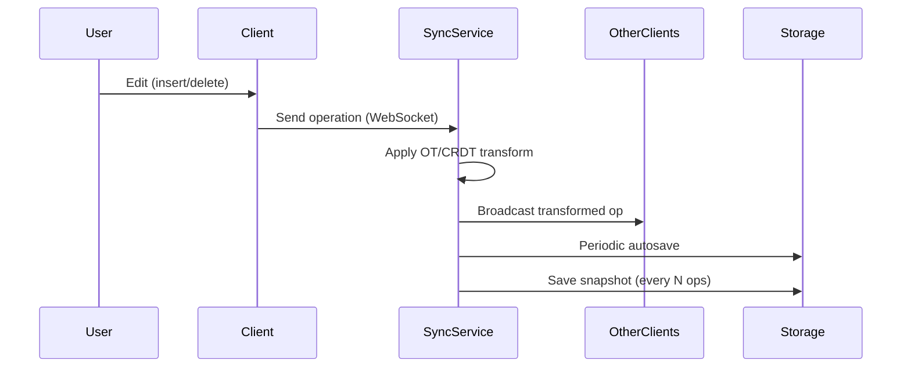
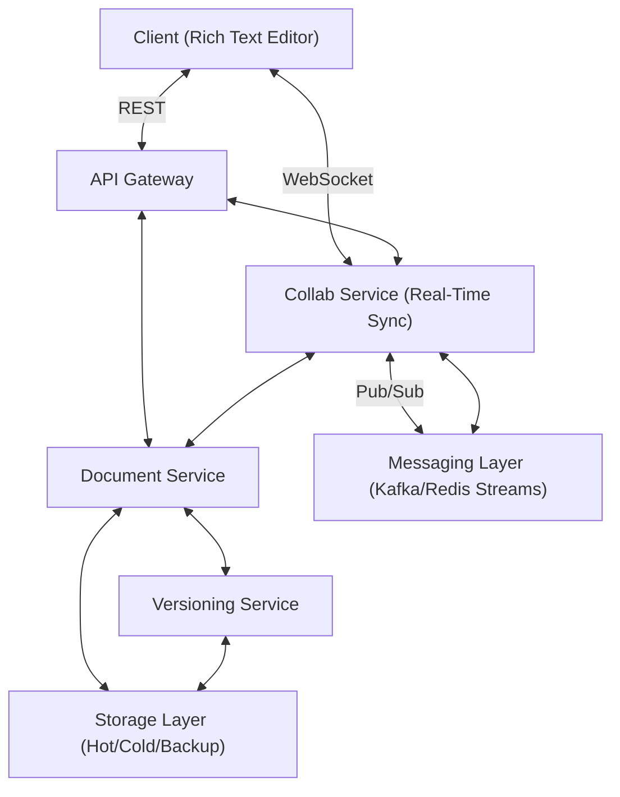
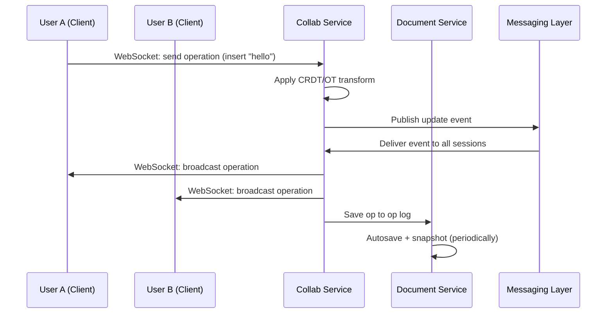
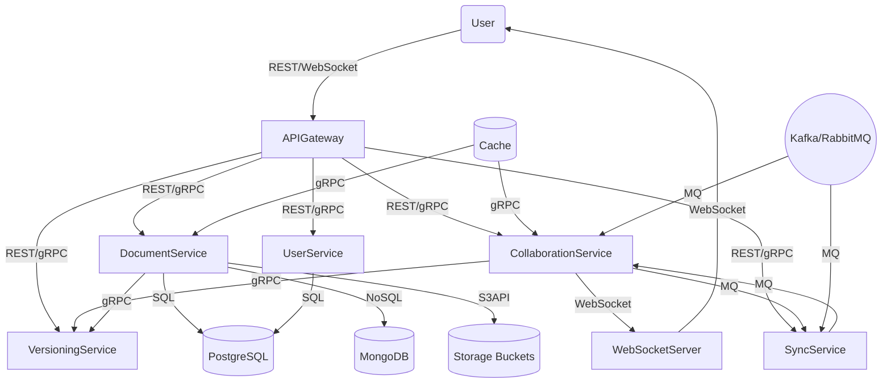
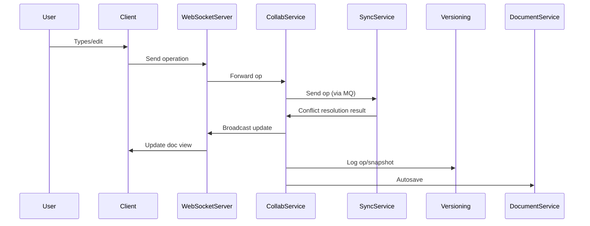

# Section 1

```markdown
# Mastering System Design: Designing a Collaborative Document Editor (Like Google Docs)

Building a collaborative document editor (think Google Docs, Microsoft Word Online, or Notion) is a classic system design challenge. It’s a rich real-world problem that tests your grasp of distributed systems, real-time synchronization, concurrency, scalability, and user experience. In this section, we’ll walk through a detailed design, integrating both conceptual understanding and practical technical choices, with code snippets and diagrams where appropriate.

---

## 📚 Problem Overview

We want to build a **web-based collaborative document editor** that allows **multiple users to edit the same document in real time**. Core requirements include:

- **Real-time collaboration** with instant change reflection for all users.
- **Conflict-free and consistent document state** despite concurrent edits.
- **Document versioning** and **access control** (permissions).
- **Smooth user experience** with low latency and high reliability.

**Examples:** Google Docs, Microsoft Word Online, Notion.

---

## 🔗 Functional Requirements (MVP)

| Feature                                    | Description                                                              |
|--------------------------------------------|--------------------------------------------------------------------------|
| 📝 Create, edit, and delete documents      | Users can CRUD their text documents.                                     |
| 👥 Real-time multi-user collaboration      | Multiple users can edit the same doc simultaneously and see changes live. |
| 🔁 Real-time syncing of edits              | Edits propagate to all clients in (near) real time.                      |
| 🗂 Document version history & change track  | Track changes, rollback to previous versions.                            |
| 🔐 Permission control                      | Read/write access for authorized users only.                             |
| 📨 Invite collaborators                    | Via shareable link or email, simplifying collaboration.                  |

---

## ⚙️ Non-Functional Requirements

- **Performance:** Real-time sync under **100ms** latency.
- **Scalability:** Support **millions of docs/users**.
- **Availability:** **99.9% uptime**, seamless reconnects.
- **Security:** TLS encryption, strong access control, abuse protection.
- **Reliability:** Autosave, crash recovery, **eventual consistency**.
- **Maintainability:** Modular, clean APIs for extensibility.
- **Testability:** Must be testable under real-time load.

---

## 🧩 Assumptions & Constraints

### ✅ Assumptions

- Users have reliable internet connections.
- Clients use modern browsers with WebSocket support.
- Most docs are text-heavy (not rich media).
- Collaboration groups are small–medium (2–50 users).
- Heavy read-write usage (frequent edits).

### ⚠️ Constraints

- Real-time sync must work under **high concurrency**.
- Document consistency must be **maintained** even with conflicts.
- **Eventual consistency** across all clients.
- Meet **global** (not just regional) latency targets.
- Only **basic text formatting** in MVP.

---

## 🧮 Collaboration Challenges

| Challenge                     | Description                                                                 |
|-------------------------------|-----------------------------------------------------------------------------|
| Concurrency Control           | Handling overlapping edits from multiple users in real time.                 |
| Conflict Resolution           | Determining winners when edits conflict (e.g., two users edit same text).   |
| Real-Time Synchronization     | Broadcasting updates efficiently to all connected clients.                  |
| Consistency vs. Latency       | Balancing immediate updates vs. consistent global state.                    |
| Failure Recovery              | Seamless reconnects, autosave, handling network loss or partial updates.    |

---

## 📏 Scale Estimation

- **10M+ DAU**, **200k+** concurrent editors at peak
- **100+ docs/user**, **10B events/day**
- Up to **20 ops/sec/document** during editing
- **100–500KB/doc**, with **2–5x** storage overhead for versioning/history

---

## 🔥 Potential Bottlenecks

- **Operational Transformation (OT) / CRDT overhead**: CPU-intensive, requires fast in-memory ops.
- **WebSocket scaling & fan-out**: Needs persistent, low-latency connections and horizontal scaling.
- **Storage write throughput**: Edits and autosaves put heavy pressure on storage systems.
- **Conflict resolution latency**: Must not block editing experience.
- **Sync propagation**: Consistent state across all clients within milliseconds.

---

## 🏗️ High-Level Architecture

```mermaid
graph TD
    A[Client (Browser/Mobile)] -- WebSocket --> B(Collab/Sync Service)
    A -- REST --> C(API Gateway)
    C -- gRPC --> D[Document Service]
    B -- gRPC --> D
    D -- gRPC --> E[Versioning Service]
    D -- gRPC --> F[Permissions Service]
    D -- DB --> G[(Metadata DB)]
    D -- Storage --> H[(Document Storage: Hot/Cold)]
    B -- Pub/Sub --> I[Messaging Layer (Kafka/Redis Streams)]
```

**Components:**
- **Client:** Rich text editor, WebSocket for real-time sync.
- **API Gateway:** Handles auth, routing, rate limiting.
- **Collab Service:** Real-time sync, OT/CRDT logic.
- **Document Service:** CRUD, metadata, permissions.
- **Versioning Service:** Document history, snapshots.
- **Storage:** Hot storage (frequent access), Cold storage (archive/backups).
- **Messaging Layer:** Pub/Sub for event propagation.
- **Microservices:** Stateless APIs, real-time sync infra.

---

## 📄 Document Model Design

- **Data Structure:** Use OT/CRDT-compatible structures (e.g., [Yjs](https://github.com/yjs/yjs), [Automerge](https://github.com/automerge/automerge)).
- **Operation-based updates:** Instead of full text blobs, send/receive granular operations (insert, delete, etc.).
- **Version Metadata:** For diff, sync, and rollback.

```javascript
// Example: Yjs (CRDT) change set for a collaborative doc
const Y = require('yjs');
const doc = new Y.Doc();
const yText = doc.getText('content');

// User 1 inserts text
yText.insert(0, 'Hello world!');

// Changes are encoded as binary ops and sent over WebSocket
const update = Y.encodeStateAsUpdate(doc);
socket.send(update);
```

---

## 🔄 Real-Time Sync Flow



**Optimized for:** Low latency, consistency, versioned ops.

---

## ⚡ Communication Patterns

- **REST (HTTP/JSON):** Document CRUD, version history (external/client-facing).
- **WebSockets:** Real-time collaboration & sync (persistent, low latency).
- **gRPC (protobuf):** Fast internal service-to-service calls.
- **Message Queues (Kafka, RabbitMQ):** Event-driven workflows, background jobs.

---

## 📝 Example API Endpoints

```http
GET /documents/:id
POST /documents
PUT /documents/:id/content           # Save content snapshot
POST /documents/:id/operations       # Send an edit operation
GET /documents/:id/history           # Get version history
POST /documents/:id/collaborators    # Add/remove collaborators
WebSocket: /ws/collab?doc_id=abc123&token=jwt
```

---

## 🤝 Consistency & Conflict Handling

- **CRDT/OT:** Transform concurrent operations so all clients eventually converge to the same state.
- **Operation logs:** Each doc maintains a log for replay/resync.
- **Snapshots + deltas:** For syncing lagging clients.
- **Reconnection protocol:** Handle clients rejoining after network partition.

```javascript
// Pseudo-code: Applying a CRDT update on reconnect
const update = receiveUpdateFromServer();
Y.applyUpdate(localDoc, update);
```

---

## 🛡️ Strategic Tech & Infra Decisions

| Layer         | Choice                          |
|---------------|---------------------------------|
| Frontend      | React (Web), React Native (Mobile) |
| Backend       | Node.js (WebSocket), gRPC microservices |
| APIs          | REST (CRUD), WebSockets (realtime) |
| Data Storage  | S3/GCS (files), Postgres (metadata), MongoDB (flex schemas) |
| Orchestration | Kubernetes                      |
| Messaging     | Kafka (event bus)               |
| Auth          | OAuth2/JWT                      |
| Security      | TLS (in-transit), AES (at-rest) |

---

## 💡 Tips and Tricks

### 1. **Start with OT/CRDT Libraries**
- Don’t reinvent the wheel: use mature libraries ([Yjs](https://docs.yjs.dev/), [Automerge](https://automerge.org/)) for document sync and conflict resolution in MVP.

### 2. **WebSocket Connection Management**
- Use connection pools and horizontal scaling (e.g., sharding docs across sync nodes) to handle thousands of concurrent WebSockets.
- Monitor for "zombie" connections; implement heartbeats/pings.

### 3. **Efficient Fan-out**
- Use Pub/Sub (e.g., Redis, Kafka) to broadcast document changes to all connected clients with low latency.

### 4. **Optimize for Hot Documents**
- Some docs (e.g., meeting notes) will be “hotspots” with many collaborators—use in-memory caching or partitioning to avoid bottlenecks.

### 5. **Autosave & Snapshots**
- Autosave frequently, but snapshot (full doc state) less often to balance storage cost and recovery speed.

### 6. **Permission Checks**
- Cache permissions where possible, but always validate on critical writes to prevent privilege escalation.

### 7. **Testing Real-Time Flows**
- Simulate hundreds/thousands of concurrent users in automated tests to ensure sync and conflict resolution hold under load.

---

## 📝 Sample Code: WebSocket Real-Time Sync (Node.js)

```javascript
// Basic WebSocket server (Node.js + ws) for document collaboration
const WebSocket = require('ws');
const Y = require('yjs');

const wss = new WebSocket.Server({ port: 8080 });
const docs = new Map(); // docId -> Y.Doc

wss.on('connection', (ws, req) => {
  const docId = getDocIdFromReq(req);
  let doc = docs.get(docId);
  if (!doc) {
    doc = new Y.Doc();
    docs.set(docId, doc);
  }

  ws.on('message', (msg) => {
    // Apply operation to Yjs doc and broadcast to other clients
    const update = new Uint8Array(msg);
    Y.applyUpdate(doc, update);
    wss.clients.forEach(client => {
      if (client !== ws && client.readyState === WebSocket.OPEN) {
        client.send(update);
      }
    });
  });

  // Send current doc state to new client
  const state = Y.encodeStateAsUpdate(doc);
  ws.send(state);
});
```

---

## 🖼️ Final Architecture Diagram


*Note: Replace with your own diagram if needed!*

---

## 🚀 Wrapping Up

Designing a collaborative document editor is a multifaceted challenge. You must balance real-time performance, consistency, and scalability—all while ensuring a smooth user experience. By leveraging modern CRDT/OT libraries, scalable WebSocket infrastructure, and modular microservices, you can build a robust, extensible platform that powers seamless collaboration.

**Next up:** Dive into scaling estimates, detailed bottleneck analysis, and practical implementation strategies.

---

**Further Reading:**
- [Yjs Docs](https://docs.yjs.dev/)
- [CRDTs Explained](https://crdt.tech/)
- [Operational Transformation vs. CRDTs](https://martinfowler.com/articles/collaborative-editing.html)
```
*Diagrams shown as Mermaid or image links; for full visuals, use diagramming tools or whiteboard illustrations in your blog.*

---

**Let me know if you want deeper dives into any subsystem, or a more granular code walkthrough!**

# Section 2

```markdown
# Building a Collaborative Document Editor at Scale: System Design Deep Dive

Collaborative document editors, like **Google Docs** or **Notion**, have redefined how we create and collaborate on documents in real-time. But what does it take to design such a system from scratch—one that supports **millions of users**, **real-time collaboration**, and **massive scalability**?

In this post, we'll walk through the scale estimation, bottleneck identification, and high-level system architecture for a collaborative document editor. We'll integrate insights from a technical transcript and a comprehensive slide deck, and share code snippets, architecture diagrams, and tips from the trenches.

---

## 🏗️ Problem Statement

Design a **web-based collaborative document editor** that allows:

- Multiple users to edit the same document **simultaneously**
- **Real-time** change reflection for all collaborators
- **Conflict-free, consistent** document state
- **Versioning**, **access control**, and **sharing** (e.g., via link/email)
- MVP focus on **text documents** with basic formatting

---

## 🚦 Functional & Non-Functional Requirements

**Functional:**
- Create, edit, delete text documents
- Real-time multi-user collaboration & sync
- Document history, change tracking, permissions
- Collaborator invite (link/email)

**Non-Functional:**
- Real-time sync latency < 100ms
- Support for **millions** of docs/users, 99.9% uptime
- Secure: TLS, access control, basic abuse protection
- Reliable: autosave, crash recovery, eventual consistency

---

## 📊 Scale Estimation & System Volumes

| Metric                        | Value                                      |
|-------------------------------|--------------------------------------------|
| Daily Active Users (DAU)      | 10M+                                       |
| Avg. Documents per User       | 100                                        |
| Peak Concurrent Editors       | 200K+                                      |
| Real-Time Sync Events         | ~10B/day                                   |
| Events per Active User        | 1–2/sec                                    |
| Ops/sec per Document          | 5–20 during editing                        |
| Avg. Document Size            | 100KB                                      |
| Storage Overhead (History)    | 2–5x                                       |
| Hot Storage                   | 1–5 TB/day                                 |
| Cold Storage (Archives)       | 100s of TBs                                |

---

## 🔍 Traffic Patterns & Observations

- **Spikes during working hours** (esp. in shared orgs)
- **Hotspot documents** (meeting notes, templates)
- **Frequent small writes** (edits), **bulk reads** (opening docs/version history)
- **Authentication & permission checks** add latency under load

---

## ⚠️ Bottleneck Identification

1. **Operational Transformation (OT) / CRDT Overhead**
   - CPU-intensive, requires in-memory operations for conflict resolution
2. **WebSocket Scaling & Fan-Out**
   - Persistent, low-latency connections; horizontal scaling needed
3. **Storage Write Throughput**
   - Edits, autosaves, and history create heavy write pressure
4. **Conflict Resolution Latency**
   - Should not block real-time editing
5. **Sync Propagation**
   - Consistency across all clients must be achieved in milliseconds

---

## 🏛️ High-Level Architecture

```mermaid
graph TD
  Client[Browser/Mobile Client<br/>Rich Text Editor]
  APIGW[API Gateway<br/>(Auth, Routing)]
  CollabService[Collab Service<br/>(OT/CRDT, Real-Time Sync)]
  DocService[Document Service<br/>(Save/Load, Metadata, Permissions)]
  Versioning[Versioning Service<br/>(History, Snapshots)]
  Storage[Storage Layer<br/>(Hot/Cold, Backup)]
  Messaging[Messaging Layer<br/>(Kafka/Redis Streams)]

  Client-- WebSocket/REST -->APIGW
  APIGW-- gRPC/REST -->CollabService
  APIGW-- REST -->DocService
  CollabService-- gRPC -->DocService
  CollabService-- Pub/Sub -->Messaging
  DocService-- gRPC -->Versioning
  DocService-- Storage IO -->Storage
  Versioning-- Storage IO -->Storage
  Messaging-- Pub/Sub -->CollabService
```

### **Key Components**
- **Client:** Rich text editor (browser/mobile) with WebSocket support
- **API Gateway:** Auth, routing, rate limiting
- **Collab Service:** Handles OT/CRDT real-time sync
- **Document Service:** Manages metadata, permissions, CRUD
- **Versioning Service:** Handles document history, snapshots
- **Storage Layer:** Hot (fast), cold (archive), backup
- **Messaging Layer:** Pub/Sub for event broadcast (Kafka/Redis Streams)

---

## 📝 Document Model & Real-Time Sync

- **Operation-based** updates (not full text blobs)
- **CRDT/OT-compatible** data structures (e.g., [Yjs](https://github.com/yjs/yjs), [Automerge](https://github.com/automerge/automerge))
- **Version metadata** for sync, diff, rollback

**Example OT/CRDT Operation (JSON):**
```json
{
  "op_id": "c123:45",
  "user_id": "user_abc",
  "type": "insert",
  "position": 10,
  "value": "hello",
  "timestamp": 1719583200
}
```

### Real-Time Sync Flow

1. ✍️ User edits doc (e.g., inserts text)
2. 📤 Client sends operation over WebSocket
3. 🔀 Collab service applies OT/CRDT transform
4. 📣 Changes broadcast to collaborators
5. 💾 Autosave to persistent store
6. 🕒 Snapshots saved periodically for recovery

**Client Side JS Pseudocode**:
```javascript
const ws = new WebSocket('wss://api.yourdocs.com/ws/collab?doc_id=abc123&token=xyz');
ws.onmessage = (event) => {
  const op = JSON.parse(event.data);
  applyRemoteOperation(op); // Applies OT/CRDT transform
};
function sendLocalOperation(op) {
  ws.send(JSON.stringify(op));
}
```

**Backend Node.js - WebSocket Handler**:
```js
wsServer.on('connection', (socket, req) => {
  const docId = getDocIdFromReq(req);
  socket.on('message', (msg) => {
    const op = JSON.parse(msg);
    const transformedOp = applyOTorCRDT(op, docId);
    broadcastToCollaborators(docId, transformedOp);
    persistOperation(docId, transformedOp);
  });
});
```

---

## 🔗 Communication Patterns

- **REST API** (HTTP/JSON): For doc CRUD, history, permissions
- **WebSockets**: Persistent, low-latency for real-time sync
- **gRPC**: Fast microservice-to-microservice communication
- **Message Queues** (Kafka/RabbitMQ): Event-driven workflows (e.g., autosave, backup)

---

## 🔒 Consistency & Conflict Handling

- Use **CRDT** or **OT** for eventual convergence
- Maintain **operation logs** per document
- **Snapshots + deltas** to resync lagging clients
- Handle **network partition** with reconnection protocol

**Conflict Handling Pseudocode (CRDT Example):**
```python
def resolve_conflict(local_op, remote_op):
    # Use Lamport timestamps or vector clocks for ordering
    if local_op.timestamp < remote_op.timestamp:
        apply(local_op)
        apply(remote_op)
    else:
        apply(remote_op)
        apply(local_op)
```

---

## 🧰 Tips and Tricks from the Trenches

- **WebSocket Scaling:** Use sticky sessions or consistent hashing to route users editing the same doc to the same backend node, minimizing fan-out.
- **Hotspot Mitigation:** Apply extra caching and sharding for frequently edited "hot" documents.
- **Autosave Frequency:** Balance between too-frequent (write pressure) and too-rare (data loss risk) autosaves.
- **Permission Caching:** Cache permission checks in memory for active docs to reduce DB load.
- **Snapshotting:** Save periodic document snapshots to speed up recovery and reduce replay of long operation logs.
- **Testing Under Load:** Simulate thousands of concurrent editors and network partitions to validate real-time sync and recovery.
- **Security:** Always validate document, user IDs and permissions server-side—even if checked client-side.
- **Monitoring:** Track WebSocket connection rates, event propagation latency, and write queue depth as key health signals.

---

## 🚀 Conclusion

Designing a collaborative document editor at scale is a formidable challenge—balancing **real-time performance**, **consistency**, **security**, and **scalability**. By breaking down the problem, anticipating bottlenecks, and leveraging modern real-time and distributed systems techniques (OT/CRDTs, WebSockets, microservices, Pub/Sub), you can build a system that feels instant and robust, even for millions of active users.

---

**References:**
- [Yjs: CRDT for JS](https://github.com/yjs/yjs)
- [Automerge: CRDT for JS](https://github.com/automerge/automerge)
- [Martin Kleppmann: CRDTs vs. OT](https://martin.kleppmann.com/papers/crdt-ot.pdf)

---

*Want to see a deep dive into any section? Let us know in the comments!*
```

---

### Diagram Note

If you wish to render the architecture diagram using [Mermaid](https://mermaid-js.github.io/), you can paste the provided `mermaid` code block (under "High-Level Architecture") in a Markdown viewer/editor with Mermaid support, like GitHub or HackMD.

---

**Feel free to adapt this template for your own system design interviews, technical blogs, or engineering documentation!**


# Section 3

Certainly! Here is a **detailed Markdown blog section** on designing a scalable collaborative document editor (like Google Docs), fully integrating the transcript and slide content. The section includes **code snippets**, **diagrams** (in Markdown/ASCII for portability), and a **Tips & Tricks** section.

---

# Collaborative Document Editor: High-Level System Design & Real-Time Collaboration

## Introduction

Designing a collaborative document editor, such as Google Docs or Notion, is a classic systems design challenge. The problem is rich with real-world constraints: real-time editing, conflict resolution, high concurrency, and seamless user experience. In this section, we’ll break down the high-level architecture, real-time sync flow, document modeling, API patterns, and tips for building a robust collaborative text editor.

---

## 🏛️ High-Level Architecture

At its core, a collaborative document editor is a distributed system with strong real-time constraints. Here’s an overview of the main components and their responsibilities:



### Component Breakdown

- **Client:** Rich text editor (web/mobile), connects via WebSocket for collaboration and REST for other operations.
- **API Gateway:** Entry point for all client requests. Handles authentication (OAuth2/JWT), rate limiting, and routing.
- **Collab Service:** Handles real-time synchronization, operational transformation (OT) or CRDT logic for conflict resolution.
- **Document Service:** Manages CRUD, metadata, access control.
- **Versioning Service:** Tracks version history, enables diff/rollback.
- **Messaging Layer:** Pub/Sub system (Kafka, Redis Streams) for event broadcasting.
- **Storage Layer:** 
    - **Hot storage:** Fast, low-latency for active docs.
    - **Cold storage:** Archival.
    - **Backup:** For disaster recovery.

---

## 📄 Document Model Design

### Why CRDT/OT?

With multiple users editing the same doc, we need to:
- **Resolve conflicts** (who “wins” if edits overlap?)
- **Achieve consistency** (all users see the same doc eventually)

**CRDT (Conflict-free Replicated Data Types)** and **OT (Operational Transformation)** are two proven strategies.

- **CRDT (e.g., [Yjs](https://github.com/yjs/yjs), [Automerge](https://github.com/automerge/automerge))**: Each client can modify independently, and all changes converge automatically.
- **OT:** Edits are transformed in order to maintain consistency.

### Document Structure Example (CRDT)

```js
// Sample CRDT document structure (Yjs style, pseudocode)
{
  docId: "abc123",
  type: "text",
  content: Y.Text, // CRDT text structure
  version: 42,
  collaborators: [userId1, userId2, ...],
  metadata: {
    owner: "userId1",
    permissions: { userId1: "write", userId2: "read" }
  },
  opLog: [ /* operation history for sync/diff/rollback */ ]
}
```

### Operation-Based Updates

Edits are sent as **operations**, not full text blobs, e.g.:

```json
{
  "op": "insert",
  "pos": 5,
  "chars": "hello",
  "user": "userA",
  "version": 42
}
```

---

## 🔄 Real-Time Sync Flow

**How do edits propagate in real time?**

1. **User edits document** (e.g., inserts text)
2. **Client sends the edit operation** over WebSocket (not the full document)
3. **Collab Service applies CRDT/OT transform** to resolve concurrency
4. **Change is broadcast** to all collaborators via Pub/Sub
5. **Clients update their view** with the new operation
6. **Periodic autosave** and **snapshots** for recovery

### Sequence Diagram



---

## 📡 Communication Patterns

| Channel          | Protocol       | Purpose                                    |
|------------------|---------------|--------------------------------------------|
| **External**     | REST (HTTP)   | CRUD docs, versioning, auth, permissions   |
| **Real-Time**    | WebSocket     | Real-time collaborative editing            |
| **Internal**     | gRPC          | Fast, typed service-to-service comms       |
| **Async Events** | Kafka/Redis   | Fan-out, decouple, background processing   |

**Example REST API:**

```http
GET   /documents/:id           # Fetch document
POST  /documents               # Create new document
PUT   /documents/:id/content   # Save snapshot
POST  /documents/:id/operations # Send edit operation
GET   /documents/:id/history   # Get version history
POST  /documents/:id/collaborators # Update sharing
```

**Example WebSocket connection:**
```
/ws/collab?doc_id=abc123&token=xyz
```

---

## 🛡️ Consistency & Conflict Handling

- **CRDT/OT** ensures all clients reach the same document state, even with out-of-order or concurrent edits.
- **Operation log** per document for version history and rollback.
- **Snapshots + deltas** used to resync lagging/disconnected clients.
- **Reconnection protocol** for network failures (client fetches missing ops on reconnect).

### Conflict Example (Pseudocode):

Suppose User A and User B both insert at position 10 concurrently:
- System uses CRDT/OT to resolve and merge (e.g., sort by timestamp/userID).

```js
function resolveConflict(opA, opB) {
    if (opA.timestamp < opB.timestamp) return [opA, opB];
    else return [opB, opA];
}
```

---

## 🌟 Tips & Tricks for Building Real-Time Collaboration

1. **Keep operations small:** Send deltas, not full documents. Reduces bandwidth and latency.
2. **Batch operations:** For high-frequency edits, batch and debounce to avoid flooding the network.
3. **Autosave & Snapshots:** Periodically save full doc state for quick recovery and lagging clients.
4. **Stateless services:** Make components stateless where possible to allow horizontal scaling.
5. **Efficient Pub/Sub:** Use in-memory brokers (like Redis) for hot paths, durable brokers (like Kafka) for persistence and analytics.
6. **Handle disconnects gracefully:** Have reconnection and catch-up protocols for clients.
7. **Security first:** All APIs must be authenticated (JWT/OAuth2), all transport encrypted (TLS).
8. **Monitor for hotspots:** Some docs will be edited much more than others—consider sharding or load balancing at the document level.
9. **Test at scale:** Simulate 100s of concurrent collaborators per doc to uncover bottlenecks.
10. **Leverage proven libraries:** Use open-source implementations of CRDT (Yjs, Automerge) or OT (ShareDB) rather than rolling your own.

---

## 🚀 Example: Real-Time Operation Handling (Node.js + Yjs)

```js
// Server-side: Handling an incoming operation
const Y = require('yjs');
const doc = new Y.Doc();

// On WebSocket message
ws.on('message', (msg) => {
    const update = JSON.parse(msg);
    Y.applyUpdate(doc, update);  // Apply CRDT update

    // Broadcast to other clients
    broadcastToCollaborators(update);

    // Optionally, persist op log / autosave
    saveOpToLog(update);
});
```

---

## 🏁 Conclusion

A collaborative document editor is a microservices architecture with a strong real-time core. Using CRDT/OT for conflict resolution, efficient messaging for fan-out, and a layered storage strategy allows for both scalability and reliability. Careful attention to communication patterns and user experience is essential for building a world-class editor.

---

> **Next Steps:** In the next chapter, we'll dive into tech stack and infrastructure decisions—how to pick the right tools for each component, from frontend frameworks to cloud storage, orchestration, and security.

---

**References:**
- [Yjs CRDT Framework](https://github.com/yjs/yjs)
- [Automerge CRDT](https://github.com/automerge/automerge)
- [ShareDB (OT)](https://github.com/share/sharedb)
- [Operational Transformation Explained](https://www.oreilly.com/library/view/collaborative-editing-in/9781098108988/)

---

**Happy collaborating!**

# Section 4

Certainly! Here’s a **detailed, integrated Markdown blog section** presenting the collaborative document editor’s system design, weaving together the transcript and slides. Code snippets, diagrams (ASCII, Markdown-style), and a ‘Tips and Tricks’ section are included for clarity and practical insight.

---

# 🚀 Designing a Collaborative Document Editor (Like Google Docs): Deep Dive

## Overview

Building a **collaborative document editor**—think Google Docs or Notion—requires meticulous attention to real-time sync, conflict resolution, scalability, and security. Let’s walk through the key architectural decisions, technology stack, data flows, and practical tips for designing such a platform at scale.

---

## 💡 Problem Statement

Design a **web-based document editor** that enables:

- Multiple users to edit the same document _simultaneously_
- Changes reflected in **real-time** (low latency)
- Conflict-free, **consistent** document state
- Document **versioning** and **access control**

---

## ✨ Functional Requirements (MVP)

- 📝 Create, edit, delete text documents
- 👥 Real-time multi-user collaboration
- 🔁 Sync edits instantly across clients
- 🗂 Version history & change tracking
- 🔐 Permission control (read/write)
- 📨 Invite collaborators via link/email

## ⚙️ Non-Functional Requirements

- ⚡ <100 ms real-time sync latency
- 📈 Scalability for millions of docs/users
- 🔄 99.9% uptime, seamless reconnects
- 🔐 TLS, access control, basic abuse prevention
- 💾 Autosave, crash recovery, eventual consistency
- 🧱 Modular APIs, easy feature evolution
- 🧪 Load-tested real-time flows

---

## 🔍 Key Challenges

- **Concurrency Control:** Handling multiple edits at once
- **Conflict Resolution:** Ensuring a single, consistent document state
- **Low-Latency Sync:** Efficient update broadcasting
- **Failure Recovery:** Handling disconnects, partial updates

---

## 🏗️ High-Level Architecture

Below is a simplified architecture diagram:

```
+--------+       +-------------+       +------------------+
| Client | <---> | API Gateway | <---> | Microservices    |
|        |       | (REST/Auth) |       | (Doc, Sync, etc) |
+--------+       +-------------+       +------------------+
     |                |                          |
     | <--- WebSocket |                          |
     |      (Sync)    |                          |
     v                v                          v
+--------------------------------------------------------------+
|                Messaging Layer (Kafka)                       |
+--------------------------------------------------------------+
     |                |                          |
     v                v                          v
+-----------------+   +----------------+   +------------------+
| Storage (S3/GCS)|   | PostgreSQL     |   | MongoDB          |
+-----------------+   +----------------+   +------------------+
```

**Key Components:**

- **Frontend (Web/Mobile):** React / React Native
- **API Gateway:** Auth, rate-limiting, REST endpoints
- **Collab Sync Service:** Real-time sync via WebSocket, CRDT/OT logic
- **Document Service:** Document CRUD, metadata, permissions
- **Versioning Service:** Snapshots, history
- **Storage Layer:** Fast-access (hot), archival (cold)
- **Messaging Layer:** Kafka for event-driven updates
- **Databases:** PostgreSQL (metadata), MongoDB (flexible schema), S3/GCS (blobs)

---

## 🖥️ Technology Stack

- **Frontend:** React (Web), React Native (Mobile)
- **Backend:** Node.js (WebSocket handling), gRPC (internal RPC)
- **APIs:** REST (document mgmt), WebSocket (real-time ops)
- **Storage:** AWS S3 / Google Cloud Storage
- **Databases:** PostgreSQL (structured), MongoDB (flexible)
- **Infra:** Kubernetes (scaling, orchestration)
- **Messaging:** Kafka (decoupling, fan-out)
- **Security:** OAuth2/JWT (auth), TLS (in transit), AES (at rest)

---

## 🧩 Document Model & Real-Time Sync

**Operational Transformation (OT)** or **CRDTs** (e.g., Yjs, Automerge) are used for conflict-free, real-time synchronization.

### Document Structure

```json
{
  "document_id": "abc123",
  "content": [ /* CRDT/OT operation log */ ],
  "metadata": {
    "created_by": "user1",
    "permissions": { "user2": "read", "user3": "write" },
    "version": 42,
    "last_modified": "2024-06-01T12:34:56Z"
  }
}
```

### Sync Flow

1. **Edit:** User inserts text
2. **Send:** Client emits operation via WebSocket
3. **Transform:** Server applies OT/CRDT logic
4. **Broadcast:** Changes pushed to all collaborators
5. **Autosave:** Periodically snapshot to storage
6. **Recovery:** Snapshots for crash/network recovery

---

## 🔗 Communication Patterns

| Pattern         | Protocol | Usage                                   |
|-----------------|----------|-----------------------------------------|
| REST (External) | HTTP/JSON| Doc CRUD, version history, permissions  |
| WebSocket       | WS       | Real-time document sync                 |
| gRPC (Internal) | ProtoBuf | Microservice RPC (fast, bidirectional)  |
| Messaging       | Kafka    | Event-driven, decoupled updates         |

### Sample API Endpoints

```http
GET /documents/:id
POST /documents
PUT /documents/:id/content
GET /documents/:id/history
POST /documents/:id/collaborators
WebSocket: /ws/collab?doc_id=abc123&token=xyz
```

**WebSocket Message Example:**

```json
{
  "op": "insert",
  "position": 10,
  "text": "Hello, world!",
  "user": "user42",
  "version": 43
}
```

---

## 🔐 Security & Reliability

- **Auth:** OAuth2 + JWT tokens
- **Encryption:** TLS (transit), AES (rest)
- **Concurrency:** Fine-grained access control on docs
- **Recovery:** Autosave, periodic snapshots, backup

---

## ⚡ Scaling & Performance

- **Kubernetes** for autoscaling services
- **Kafka** for async event propagation and decoupling
- **Horizontal scaling** for WebSocket servers (stateless, sticky sessions/load balancer)
- **Data partitioning** for hot docs and users

---

## 🛠️ Example: Real-Time Edit Handling (Node.js/WS + Yjs)

```js
// Server-side: WebSocket edit handler with Yjs
const Y = require('yjs');
const ws = require('ws');

const docMap = new Map(); // docId => Y.Doc

function getOrCreateDoc(docId) {
  if (!docMap.has(docId)) docMap.set(docId, new Y.Doc());
  return docMap.get(docId);
}

const wss = new ws.Server({ port: 8080 });
wss.on('connection', (socket, req) => {
  const docId = req.url.split('doc_id=')[1].split('&')[0];
  const ydoc = getOrCreateDoc(docId);

  // Listen for sync updates
  socket.on('message', (msg) => {
    const update = new Uint8Array(JSON.parse(msg).update);
    Y.applyUpdate(ydoc, update);
    // Broadcast to all clients
    wss.clients.forEach(client => {
      if (client !== socket && client.readyState === ws.OPEN) {
        client.send(JSON.stringify({ update: Array.from(update) }));
      }
    });
  });

  // Send doc state on connect
  socket.send(JSON.stringify({ update: Array.from(Y.encodeStateAsUpdate(ydoc)) }));
});
```

---

## 📊 Diagram: Real-Time Document Sync Flow

```mermaid
sequenceDiagram
    participant C1 as Client 1
    participant S as Sync Service
    participant C2 as Client 2

    C1->>S: Edit operation (WebSocket)
    S->>C2: Broadcast operation (WebSocket)
    S->>S: Apply CRDT/OT transform
    S->>DB: Periodic snapshot (S3/PostgreSQL)
    Note over C1,S,C2: All clients apply same ops for convergence
```

---

## 🧠 Tips and Tricks

- **Sticky Sessions:** Use sticky sessions or distributed doc state (e.g., Redis, CRDT backend) for scaling WebSocket servers.
- **Snapshots:** Periodically persist document state to recover from crashes and avoid full replay of edit logs.
- **Operation Batching:** Batch small edits to reduce network chatter and improve throughput.
- **Optimistic UI:** Apply local edits instantly, then confirm with the server for a snappy UX.
- **Backpressure Handling:** Monitor and throttle clients that send too many ops/sec to prevent overload.
- **Testing:** Simulate high-concurrency editing and network partitions in CI to catch edge cases early.
- **Security:** Always validate operations server-side; never trust client-supplied edit ops blindly.

---

## 🏁 Conclusion

Designing a collaborative document editor is a great exercise in **distributed systems, real-time data sync, and modern cloud architecture**. The stack and patterns outlined here provide a robust, scalable, and secure foundation—yet remain flexible for future evolution and scaling.

> _Feel free to swap in equivalent technologies, as long as you meet the same functional and non-functional criteria!_

---

**Next steps:** In the next part, we’ll pull all these pieces together into a final design diagram and walk through a typical end-to-end editing session.

---

**References:**
- [Yjs (CRDT library)](https://yjs.dev/)
- [Automerge (CRDT library)](https://automerge.org/)
- [Kafka](https://kafka.apache.org/)
- [gRPC](https://grpc.io/)
- [React](https://react.dev/)
- [Kubernetes](https://kubernetes.io/)

---

**Happy designing!**

# Section 5

# 📝 Building a Collaborative Document Editor (Google Docs-Style) — Detailed System Design

Collaborative document editors like **Google Docs** revolutionize real-time teamwork. Designing such a system is a classic interview challenge and a real-world engineering feat. In this section, we’ll walk through a robust, scalable, and real-time architecture for a collaborative document editor, integrating both the **transcript insights and slide content** above. We’ll also include **code snippets**, **architecture diagrams**, and conclude with **tips and tricks** for both interviews and real-world system design!

---

## 1. 📚 Problem Overview

> **Design a web-based collaborative document editor with:**
>
> - Multiple users editing the same document simultaneously  
> - Real-time updates and syncing  
> - Conflict-free, consistent document state  
> - Document versioning and access control  
> - High scalability, performance, and fault tolerance

**Examples:** Google Docs, Notion, Office Online

---

## 2. 📋 Core & Non-Functional Requirements

### Functional (MVP)

- **Create/Edit/Delete** text documents
- **Real-time multi-user collaboration**
- **Instant sync** of edits across clients
- **Document version history & change tracking**
- **Permission controls** (read/write access)
- **Share/invite** collaborators

### Non-Functional

| Requirement       | Target/Approach                                    |
|-------------------|----------------------------------------------------|
| **Performance**   | Real-time sync, <100ms latency                     |
| **Scalability**   | Millions of docs/users; horizontal scaling         |
| **Availability**  | 99.9% uptime; autoscaling; crash recovery          |
| **Security**      | OAuth2, TLS, role-based access, abuse protection   |
| **Reliability**   | Autosave, conflict resolution, eventual consistency|
| **Maintainability**| Modular microservices, clean APIs                 |
| **Testability**   | Real-time flow testing under simulated load        |

---

## 3. 🏗️ High-Level Architecture

Below is a block diagram of the system’s main components and how they interact:



### **Component Breakdown**

- **Client:** Rich frontend (React/React Native); connects via REST and persistent WebSocket.
- **API Gateway:** Entry point; routes, authenticates, rate-limits.
- **Collaboration Service:** Handles real-time document editing, operational transformation (OT) or CRDT logic.
- **Sync Service:** Ensures real-time synchronization and conflict resolution between users.
- **Versioning Service:** Tracks document changes and enables rollbacks.
- **Document Service:** Manages creation, storage, permissions, and metadata.
- **User Service:** Handles authentication, profiles, roles.
- **Message Queue (Kafka/RabbitMQ):** Decouples async events (edit broadcasts, backup, logging).
- **Cache (Redis/Memcached):** Speeds up hot data access (doc metadata, collab states).
- **Data Layer:**  
  - **Postgres:** Structured data (users, metadata, ACLs).  
  - **MongoDB:** Document content (flexible schema, unstructured blobs).
  - **S3/Buckets:** Large file/object storage.

---

## 4. ⚡ Real-Time Collaboration Flow

Let's walk through how an edit propagates in real time:

1. **User edits** the document in the browser.
2. **Client** sends operation (not full text!) over **WebSocket**.
3. **Collaboration Service** applies OT/CRDT logic for conflict-free updates.
4. **Changes broadcast** to all connected collaborators.
5. **Sync Service** resolves concurrent edits, ensures consistency.
6. **Versioning Service** logs operations, snapshots for recovery.
7. **Document Service** autosaves to persistent storage.

### **Sequence Diagram**



---

## 5. 🗃️ Data Model & Operations

### **Document Model**

> **Use OT/CRDT-compatible data structures**
> - Operation-based (insert, delete, format, etc.)
> - Metadata (author, timestamp, version vector, etc.)

**Example (CRDT Operation):**

```json
{
  "docId": "abc123",
  "opId": "u1-202306121234",
  "userId": "u1",
  "type": "insert",
  "position": 10,
  "value": "hello",
  "timestamp": 1686564872000
}
```

### **Key APIs**

```http
GET    /documents/:id               # Fetch document metadata and content
POST   /documents                   # Create a new document
PUT    /documents/:id/content       # Save document snapshot
POST   /documents/:id/operations    # Send an edit operation (insert, delete)
GET    /documents/:id/history       # Retrieve document version history
POST   /documents/:id/collaborators # Add/remove collaborators
WebSocket /ws/collab?doc_id=abc123&token=xyz # Real-time sync
```

### **Sample WebSocket Message (Edit Operation)**

```json
{
  "type": "operation",
  "docId": "abc123",
  "userId": "u2",
  "operation": {
    "opType": "insert",
    "position": 22,
    "value": "world",
    "version": 35
  }
}
```

---

## 6. 🚦 Consistency & Conflict Handling

- **CRDT or Operational Transformation (OT):**  
  Ensures all clients converge to a consistent state, even with out-of-order ops.
- **Operation Logs:**  
  Each doc maintains a log of edits; lagging clients can resync via replay.
- **Snapshots + Deltas:**  
  Periodic snapshots for fast recovery; deltas for efficient syncing.
- **Conflict Resolution:**  
  Sync and versioning services apply rules (timestamp, user priority, etc.).
- **Network Partition Handling:**  
  Reconnection protocol resyncs missed operations.

**Conflict-Free Example (OT/CRDT):**

```javascript
// Pseudo-code for CRDT merge
function mergeOps(currentState, incomingOp) {
    // Apply operation based on version vector & operation id
    if (!currentState.hasOp(incomingOp.opId)) {
        currentState.apply(incomingOp);
    }
    // Ignore duplicate ops
}
```

---

## 7. ⚙️ Tech Stack & Infrastructure Choices

- **Frontend:** React, React Native
- **Backend:** Node.js (WebSocket server), gRPC (for fast internal comms)
- **APIs:** REST (for doc mgmt), WebSocket (for real-time)
- **Databases:** PostgreSQL (metadata), MongoDB (document bodies)
- **Object Storage:** AWS S3 / GCS
- **Orchestration:** Kubernetes (auto-scaling, fault tolerance)
- **Messaging:** Kafka or RabbitMQ (decoupled, event-driven)
- **Cache:** Redis (hot data, session management)
- **Security:** OAuth2/JWT, TLS for all endpoints

---

## 8. 🧩 Key Challenges & Solutions

| Challenge                     | Solution(s)                                                |
|-------------------------------|------------------------------------------------------------|
| **Concurrency/Conflicts**     | CRDT/OT, Sync & Versioning Services                        |
| **WebSocket Scaling**         | Stateless WebSocket servers, horizontal scaling, sharding   |
| **Storage Write Pressure**    | Async writes, batching, cache layer                         |
| **Consistent Propagation**    | Pub/Sub fan-out, versioned ops, message queues             |
| **Failover & Recovery**       | Autosave, snapshots, distributed message queue (Kafka)      |
| **Security**                  | OAuth2, TLS, RBAC                                          |

---

## 9. 💡 Tips and Tricks — **Ace the System Design Interview!**

### 1. **Clarify the Requirements**
   - Ask about **real-time** vs. eventual consistency, expected user scale, edit frequency, and MVP features.
   - Don’t forget **non-functional** requirements: latency, security, scaling.

### 2. **Draw the High-Level Architecture First**
   - Start with client, backend services, data stores, and message queues.
   - Use boxes/arrows or sequence diagrams for clarity.

### 3. **Drill Down: Real-Time Collaboration**
   - Be able to explain **OT/CRDT** (at a high level—no need for deep math in most interviews).
   - Highlight how to handle **concurrent edits** and **conflict resolution**.

### 4. **Explain Data Flows**
   - Walk through a **user edit** from browser to database and back to all clients.
   - Mention **WebSocket** fan-out, caching, and autosave.

### 5. **Talk About Scaling**
   - WebSocket server sharding, stateless services, horizontal scaling, Kubernetes.
   - Use **message queues** to decouple write-heavy operations.

### 6. **Handle Failures & Edge Cases**
   - Network drops, reconnects, partial updates, and crash recovery.

### 7. **Justify Tech Choices**
   - Explain why you’d use **Kafka**, **Redis**, **Postgres**, **MongoDB**, etc.
   - Tie choices to requirements (e.g., Postgres for structured, Mongo for flexible).

### 8. **Security & Privacy**
   - OAuth2, TLS everywhere, RBAC, data encryption at rest.

### 9. **Mock API/Code Snippets**
   - Show a sample REST endpoint and/or WebSocket message.
   - Pseudocode for merging edits or handling reconnections.

### 10. **Summarize & Prioritize**
   - Recap the design, note what’s MVP vs. stretch goals.
   - Be explicit about trade-offs (latency vs. consistency, cost vs. performance).

---

## 10. 📌 Conclusion

Designing a collaborative document editor is a **classic, multidimensional system design challenge**. With a modular, microservices-based architecture, careful real-time conflict handling, and strategic use of modern infrastructure (WebSockets, Kafka, Kubernetes, etc.), you can build a solution that’s robust, fast, and scalable.

**Remember:** In interviews, focus on **clarity, trade-offs, and rationale**—not just drawing boxes!

---

## ℹ️ Further Reading

- [Operational Transformation vs. CRDTs](https://martinfowler.com/articles/collaboration.html)
- [Yjs (CRDT library for JS)](https://github.com/yjs/yjs)
- [Real-Time Collaboration at Scale — Google Docs](https://engineering.fb.com/2016/02/22/core-data/collaborative-editing-at-facebook-scale/)
- [Kafka vs. RabbitMQ](https://www.cloudamqp.com/blog/when-to-use-rabbitmq-or-apache-kafka.html)

---

*Happy designing! 🚀*

