# Section 1


# Mastering System Design: Protocols Demystified

Modern system design is built on the foundation of robust communication protocols. From the reliable, ordered delivery of TCP, to the flexible data-fetching of GraphQL, understanding these protocols is crucial for architects, engineers, and developers alike. In this section, we’ll break down the essential protocols driving web applications, APIs, and real-time communication—complete with practical code snippets and diagrams.

---

## Table of Contents

1. [TCP & UDP: The Basics](#tcp--udp-the-basics)
2. [HTTP: The Backbone of the Web](#http-the-backbone-of-the-web)
3. [RESTful API Design Principles](#restful-api-design-principles)
4. [Real-Time Communication Protocols](#real-time-communication-protocols)
5. [Modern API Protocols: gRPC & GraphQL](#modern-api-protocols-grpc--graphql)
6. [Tips and Tricks](#tips-and-tricks)

---

## TCP & UDP: The Basics

### TCP (Transmission Control Protocol)

- **Connection-oriented:** Establishes a handshake before sending data.
- **Reliable:** Guarantees delivery, order, and error-checking.
- **Use Cases:** Web browsing (HTTP/HTTPS), file transfers (FTP/SFTP), email (SMTP/IMAP/POP3).

**TCP Three-Way Handshake Diagram:**

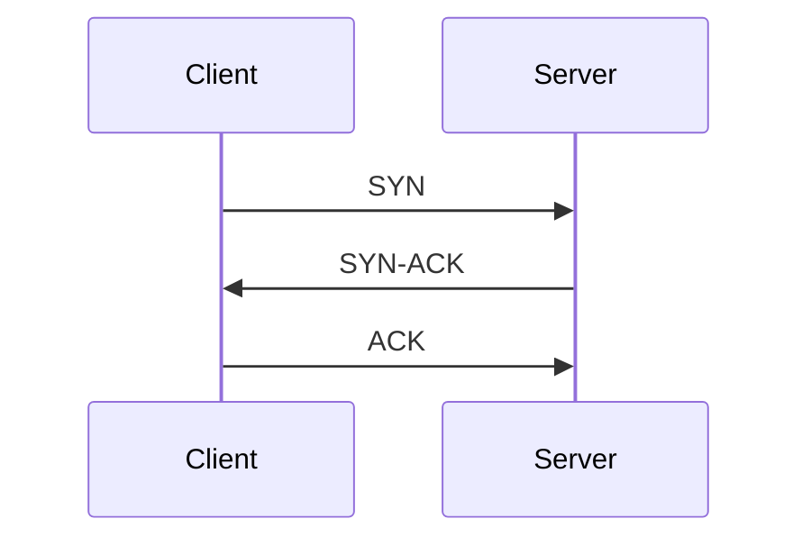

**Sample TCP Server in Python**
```python
import socket

with socket.socket(socket.AF_INET, socket.SOCK_STREAM) as s:
    s.bind(('localhost', 8080))
    s.listen()
    conn, addr = s.accept()
    with conn:
        print('Connected by', addr)
        while True:
            data = conn.recv(1024)
            if not data:
                break
            conn.sendall(data)
```

---

### UDP (User Datagram Protocol)

- **Connectionless:** No handshake; just sends datagrams.
- **Unreliable but Fast:** No guarantee of delivery or order.
- **Use Cases:** Video streaming, online gaming, VoIP, DNS.

**UDP Packet Exchange Diagram:**

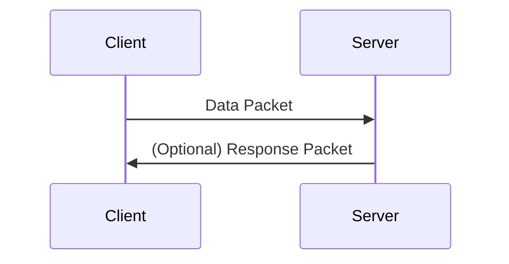

**Sample UDP Client in Python**
```python
import socket

sock = socket.socket(socket.AF_INET, socket.SOCK_DGRAM)
sock.sendto(b'Hello, World!', ('localhost', 8080))
data, addr = sock.recvfrom(1024)
print('Received:', data)
```

---

| Feature       | TCP         | UDP        |
|---------------|-------------|------------|
| Connection    | Oriented    | Less       |
| Reliability   | High        | Low        |
| Speed         | Slower      | Faster     |
| Use Case      | Web, Files  | Video, VoIP|

---

## HTTP: The Backbone of the Web

- **Stateless:** Each request is independent.
- **Text-based:** Easy to debug.
- **Methods:** GET, POST, PUT, DELETE, PATCH, etc.
- **Status Codes:** 200 (OK), 404 (Not Found), 500 (Server Error), etc.

**HTTP Request-Response Cycle:**

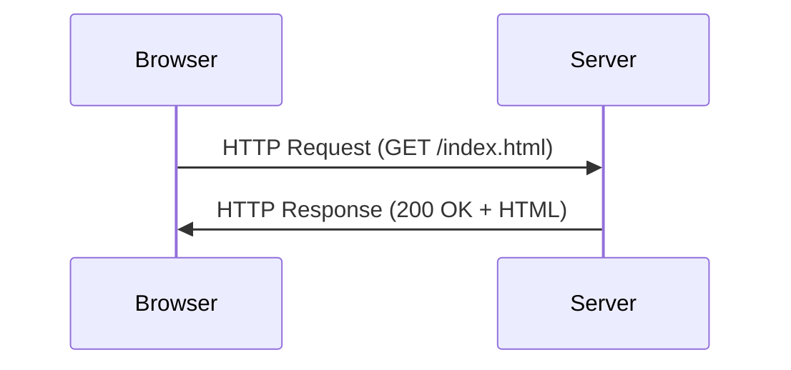

**Sample HTTP Request with `curl`:**
```bash
curl -X GET "https://api.example.com/users/123" -H "Authorization: Bearer <token>"
```

**Sample Express.js HTTP Endpoint:**
```javascript
const express = require('express');
const app = express();

app.get('/users/:id', (req, res) => {
  res.json({ id: req.params.id, name: 'Alice' });
});
```

---

### Maintaining State in Stateless HTTP

- **Cookies:** Small pieces of data stored on the client.
- **Sessions:** Server-side storage linked to session IDs.
- **Tokens (e.g., JWT):** Encoded state sent on every request.

---

## RESTful API Design Principles

- **Resource-Oriented:** Everything is a resource (nouns, not verbs).
- **HTTP Methods:** Use GET (read), POST (create), PUT (update), DELETE (remove).
- **Versioning:** `/v1/users`
- **Stateless:** Each request contains all information needed.

**REST Endpoint Examples:**

| Action        | Endpoint             | Method |
|---------------|----------------------|--------|
| Get user      | `/users/{id}`        | GET    |
| Create order  | `/orders`            | POST   |
| Delete product| `/products/{id}`     | DELETE |

**Sample RESTful API in Flask:**
```python
from flask import Flask, jsonify, request
app = Flask(__name__)

@app.route('/users/<int:user_id>', methods=['GET'])
def get_user(user_id):
    return jsonify({'id': user_id, 'name': 'Alice'})

@app.route('/orders', methods=['POST'])
def create_order():
    data = request.get_json()
    # Process order...
    return jsonify({'status': 'created'}), 201
```

---

**Best Practices:**
- Use plural nouns for collections: `/users`, `/orders`
- Avoid actions in URLs: `/users/activate` ❌ → `/users/{id}` with PATCH ✅
- Implement authentication (JWT, OAuth)
- Use proper status codes (200, 201, 400, 404, 500)
- Pagination for lists: `?page=2&limit=20`

---

## Real-Time Communication Protocols

### The Challenge

Traditional HTTP is **request-response** only. For chat, gaming, stock tickers, and collaborative tools, **real-time** updates are crucial.

#### Polling vs. Long Polling vs. WebSockets

| Protocol      | Real-Time | Bi-Directional | Persistent | Overhead |
|---------------|-----------|---------------|------------|----------|
| Polling       | No        | No            | No         | High     |
| Long Polling  | Yes       | No            | No         | Moderate |
| WebSockets    | Yes       | Yes           | Yes        | Low      |

---

### WebSockets

- **Full-duplex:** Both client and server can send messages anytime.
- **Persistent:** Connection stays open over TCP.
- **Use Cases:** Live chat, collaborative editing, real-time games.

**WebSocket Handshake (Upgrade from HTTP):**

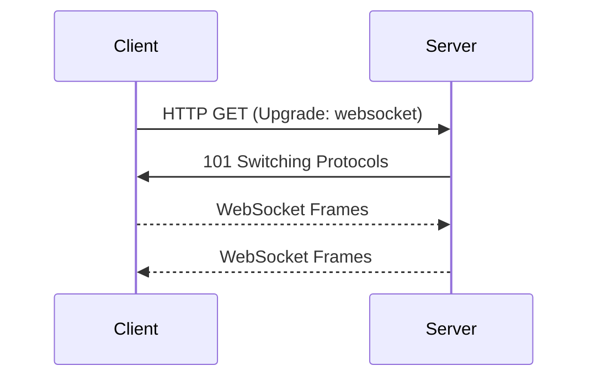

**Sample WebSocket Server in Node.js**
```javascript
const WebSocket = require('ws');
const wss = new WebSocket.Server({ port: 8080 });

wss.on('connection', ws => {
  ws.send('Hello WebSocket!');
  ws.on('message', message => {
    console.log('received:', message);
  });
});
```

---

### Long Polling

- Client sends request, server holds it open until new data is available.
- Simulates real-time updates, but more overhead than WebSockets.

**Long Polling Flow:**

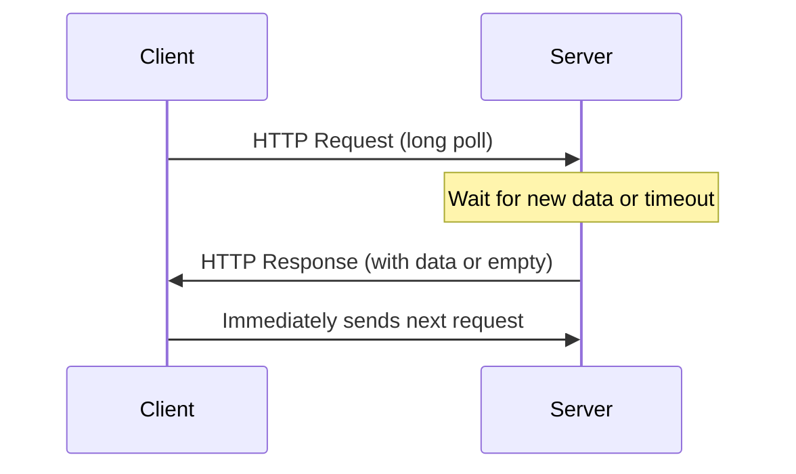

---

## Modern API Protocols: gRPC & GraphQL

### Why More Than REST?

- **Over-fetching/Under-fetching:** REST returns fixed data structures, may include unnecessary fields.
- **Multiple Requests:** Complex UI often needs multiple REST calls.
- **Real-time needs:** REST is not optimized for streaming.

---

### gRPC

- **High-Performance, Binary Protocol:** Uses Protocol Buffers (ProtoBuf) for serialization.
- **Built on HTTP/2:** Supports multiplexing, compression, full-duplex streaming.
- **Best For:** Microservices, real-time streaming, IoT, multi-language systems.

**gRPC Service Definition (ProtoBuf):**
```proto
syntax = "proto3";
service Greeter {
  rpc SayHello (HelloRequest) returns (HelloReply) {}
}
message HelloRequest {
  string name = 1;
}
message HelloReply {
  string message = 1;
}
```

**Python gRPC Server Skeleton:**
```python
import grpc
from concurrent import futures
import helloworld_pb2
import helloworld_pb2_grpc

class Greeter(helloworld_pb2_grpc.GreeterServicer):
    def SayHello(self, request, context):
        return helloworld_pb2.HelloReply(message='Hello, %s!' % request.name)

server = grpc.server(futures.ThreadPoolExecutor(max_workers=10))
helloworld_pb2_grpc.add_GreeterServicer_to_server(Greeter(), server)
server.add_insecure_port('[::]:50051')
server.start()
server.wait_for_termination()
```

---

### GraphQL

- **Flexible Queries:** Clients request exactly the data they need.
- **Single Endpoint:** Reduces number of HTTP requests.
- **Great for:** Frontend optimization, mobile apps, aggregating data from multiple sources.

**Sample GraphQL Query:**
```graphql
query {
  user(id: "1") {
    id
    name
    posts {
      title
      comments {
        text
      }
    }
  }
}
```

**Sample GraphQL Server (Node.js, Apollo):**
```javascript
const { ApolloServer, gql } = require('apollo-server');

const typeDefs = gql`
  type User { id: ID!, name: String!, posts: [Post!]! }
  type Post { title: String!, comments: [Comment!]! }
  type Comment { text: String! }
  type Query { user(id: ID!): User }
`;

const resolvers = {
  Query: {
    user: (_, { id }) => ({ id, name: "Alice", posts: [] }),
  },
};

const server = new ApolloServer({ typeDefs, resolvers });
server.listen().then(({ url }) => console.log(`Server ready at ${url}`));
```

---

## Tips and Tricks

- **Protocol Choice Matters:** Use TCP for reliability, UDP for speed, HTTP for web, WebSockets for real-time, REST for standard APIs, gRPC for microservices, GraphQL for frontend-driven needs.
- **Security First:** Always use HTTPS for sensitive data. gRPC and GraphQL need authentication and input validation.
- **Version Your APIs:** Add `/v1/` or similar in endpoints to ensure backward compatibility.
- **Handle State Properly:** Use tokens or sessions for authentication; avoid storing sensitive data in cookies without encryption.
- **Optimize for Performance:** Use caching (HTTP headers), pagination for large lists, and WebSockets or gRPC streams for real-time data.
- **Understand Trade-Offs:** WebSockets are great for speed but harder to scale; REST is simple but less flexible; gRPC is fast but requires client code generation.
- **Be Interview Ready:** Prepare to explain when and why you’d choose each protocol, and the trade-offs in terms of speed, reliability, and scalability.

---

## Conclusion

Understanding communication protocols is fundamental for designing scalable, efficient, and robust systems. Each protocol shines in different scenarios—choose wisely based on your system’s requirements!

**Next Up:** [Architectural Patterns](#) – Learn how protocols and components interact in scalable system architectures.

---

# Section 2

Certainly! Here’s a detailed Markdown blog section that integrates the transcript and slides on TCP, UDP, HTTP, REST, WebSockets, gRPC, and GraphQL. This section will cover the fundamental network protocols and API approaches every system designer must know, with code snippets, diagrams (ASCII), and a handy Tips & Tricks section.

---

# Mastering Communication Protocols for System Design

Understanding networking and API protocols is foundational for scalable and robust system design. Whether you’re architecting a real-time multiplayer game, a banking application, or a modern web API, your protocol choices directly impact speed, reliability, and user experience.

This guide breaks down the most important protocols: **TCP**, **UDP**, **HTTP**, **REST**, **WebSockets**, **gRPC**, and **GraphQL**. We’ll compare their strengths and weaknesses, see where each shines, and provide practical code snippets and diagrams.

---

## 1. TCP & UDP: The Building Blocks

### What is TCP (Transmission Control Protocol)?

- **Connection-oriented**: Establishes a session before sending data (think: phone call).
- **Reliable and ordered**: Guarantees all bytes arrive, in order, error-checked.
- **Common uses**: Web browsing (HTTP/S), file transfer (FTP/SFTP), email (SMTP, IMAP, POP3), databases.

**How TCP Works (Three-Way Handshake):**
```
Client         Server
  |   SYN   --->   |
  | <---  SYN-ACK  |
  |   ACK   --->   |
(Connection established)
```

**Code Snippet (Python TCP Client):**
```python
import socket

# Simple TCP client
s = socket.socket(socket.AF_INET, socket.SOCK_STREAM)
s.connect(('example.com', 80))
s.sendall(b"GET / HTTP/1.1\r\nHost: example.com\r\n\r\n")
response = s.recv(4096)
print(response.decode())
s.close()
```

---

### What is UDP (User Datagram Protocol)?

- **Connectionless**: No setup, just sends packets (think: postcards).
- **Fast, minimal overhead**, but **unreliable**: No guarantee packets arrive or are ordered.
- **Common uses**: Video streaming, online gaming, VoIP, DNS lookups.

**How UDP Works:**
```
Sender               Receiver
  |  ---> packet 1  --->   |
  |  ---> packet 2  --->   |
(No handshake, no acknowledgment)
```

**Code Snippet (Python UDP Client):**
```python
import socket

# Simple UDP client
s = socket.socket(socket.AF_INET, socket.SOCK_DGRAM)
s.sendto(b"Hello, UDP!", ('example.com', 12345))
data, addr = s.recvfrom(1024)
print("Received from {}: {}".format(addr, data.decode()))
s.close()
```

---

### TCP vs UDP: Key Differences

## 🔑 Key Differences Between TCP & UDP

| Feature           | TCP (Transmission Control Protocol)                                           | UDP (User Datagram Protocol)                                      |
|--------------------|-----------------------------------------------------------------------------|-------------------------------------------------------------------|
| **Reliability**     | ✅ Reliable (ensures data delivery)                                          | ❌ Unreliable (no guarantee of delivery)                           |
| **Speed**           | 🐢 Slower (due to error checking & retransmission)                          | ⚡ Faster (no retransmission overhead)                             |
| **Connection Type** | 🔗 Connection-oriented (establishes a connection before communication)      | ✈️ Connectionless (sends data without setup)                       |
| **Ordering**        | ✅ Ensures packets arrive in order                                           | ❌ No guarantee of packet order                                    |
| **Error Handling**  | 🛠️ Built-in error checking & retransmission                                 | ⚠️ Minimal error checking, no retransmission                       |
| **Overhead**        | 📦 High (due to handshaking, sequencing, and acknowledgments)                | 🪶 Low (minimal protocol overhead)                                 |
| **Use Cases**       | 🌐 Web browsing (HTTP/HTTPS), 📁 File transfers (FTP, SFTP), ✉️ Email (SMTP, IMAP, POP3), 🗄️ Database communication | 🎥 Video streaming (YouTube, Netflix), 🎮 Online gaming, 📞 VoIP calls (Skype, Zoom), 🔍 DNS lookups |


---

### When to Use Which?

- **TCP**: When **accuracy and order** matter (banking, file transfer, web pages).
- **UDP**: When **speed/latency** is critical and some loss is acceptable (streaming, gaming, calls).

---

## Tips and Tricks for Protocol Design & Interviews

- **Always start with requirements**: Is reliability or speed more important? (TCP vs UDP)
- **For critical data (banking, file transfer)**: Use TCP.
- **For low-latency, real-time (gaming, chat)**: Use UDP or WebSockets.
- **REST is great for CRUD APIs**; use GraphQL or gRPC for complex, dynamic, or high-performance needs.
- **Stateless protocols (HTTP, REST) need session management**: Use cookies, tokens, or sessions.
- **WebSockets require special infrastructure**: Load balancing and scaling can be tricky.
- **gRPC is efficient but not browser-native**: Use where clients support it (microservices).
- **GraphQL optimizes bandwidth**: Use when clients need flexibility in data fetching.
- **Use proper HTTP status codes**: They help debugging and client behavior.
- **Paginate API responses**: Never return unbounded lists in REST/GraphQL.
- **Version your APIs**: Avoid breaking changes for existing consumers.
- **Be ready to explain trade-offs** in interviews: Reliability vs speed, flexibility vs complexity, etc.

---

## 📚 Key Takeaways

- **TCP**: Reliable, ordered, slower. Use for critical data.
- **UDP**: Fast, unreliable. Use for real-time, loss-tolerant data.
- **HTTP/REST**: Foundation of the web & API communication.
- **WebSockets**: Real-time, bidirectional.
- **gRPC**: High-performance, binary, great for microservices.
- **GraphQL**: Flexible, single endpoint, client-driven data fetching.

**Choosing the right protocol is a trade-off.** Your decision will shape user experience, system reliability, and scalability.

---

**Next Up:** Deep dive into architectural patterns that define scalable systems!

---

*Happy designing! 🚀*

# Section 3

Certainly! Below is a detailed Markdown blog section integrating both the **transcript** and the **slides**. This section focuses on **HTTP: The Backbone of the Web**, with explanations, diagrams, code snippets, and a Tips & Tricks section for practical understanding.

---

# HTTP: The Backbone of the Web

HTTP (HyperText Transfer Protocol) is the foundation of data communication on the web. Whether you're loading a web page, making an API call, or streaming content, HTTP is working behind the scenes. Understanding its mechanics is crucial for designing scalable, reliable, and secure systems.

---

## What is HTTP?

**HTTP** is a **text-based**, application-layer protocol that defines how clients (like browsers or mobile apps) request resources, and how servers respond.

- **HyperText Transfer Protocol**: Foundation of web communication.
- **Text-based, stateless**: Each request is independent.
- **Runs over TCP/IP** (Port 80 for HTTP, Port 443 for HTTPS).
- **Stateless**: Each request is treated independently.
- **Human-readable**: Easy to debug.


### Statelessness & Managing State

- **Stateless**: Server does not remember previous requests.
- **State Management**: Cookies, sessions, or tokens.
---
## 🌐 How HTTP Works

### 🔹 Client-Server Model
- **Client** (browser or mobile app) makes an HTTP request  
- **Server** (web server, API, etc.) processes the request and sends back a response  

### 🔹 Components of an HTTP Request
- **Method:** Defines the action (`GET`, `POST`, etc.)  
- **URL:** The resource being requested  
- **Headers:** Metadata (e.g., `user-agent`, `content-type`)  
- **Body (optional):** Data sent in `POST`/`PUT` requests  

### 🔹 Components of an HTTP Response
- **Status Code:** Indicates success or failure (e.g., `200 OK`, `404 Not Found`)  
- **Headers:** Metadata about the response  
- **Body (optional):** The actual content returned  


### 📊 HTTP Request-Response Flow

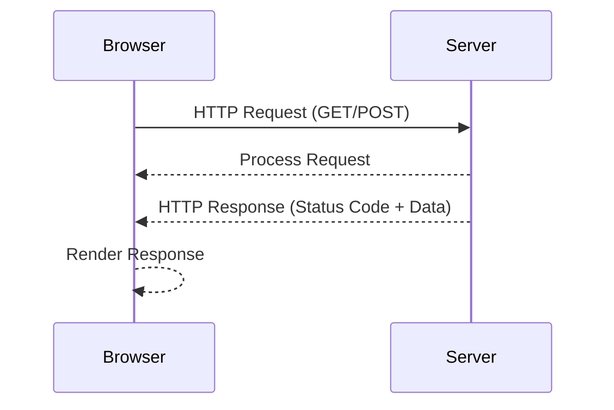
---

## HTTP in Action: The Request-Response Cycle

## 🔄 The HTTP Request-Response Cycle

1. **Step 1:** The browser (client) sends a request  
2. **Step 2:** The web server processes the request  
3. **Step 3:** The server generates a response and sends it back  
4. **Step 4:** The browser renders the response (for a web page)  

---

### 📊 Request-Response Flow

<details> 
<summary>Mermaid Diagram</summary>

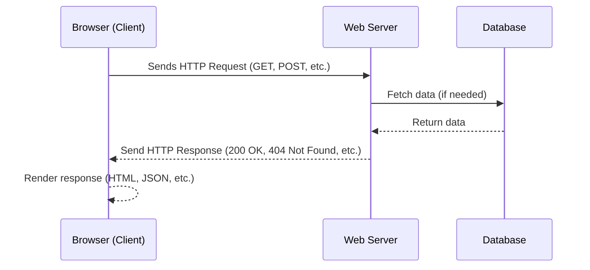


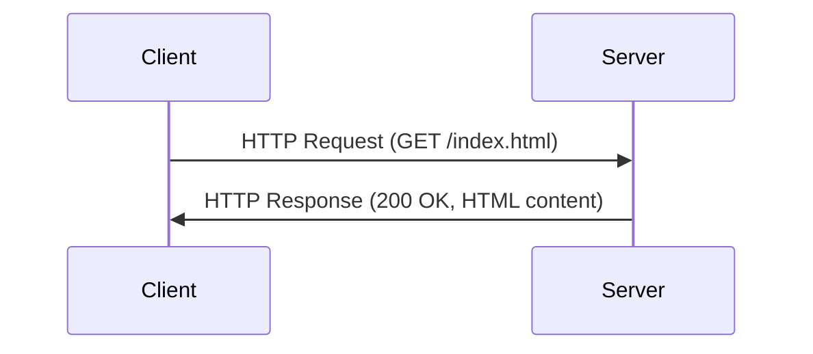
</details>

### Breakdown:

1. **Client (browser/app)** sends an HTTP request.
2. **Server** processes it, fetches/generates the resource.
3. **Server** sends back an HTTP response (status code, headers, body).
4. **Client** renders or processes the response.

---
---

### HTTP Methods & Status Codes

| Method | Use Case                  |
|--------|---------------------------|
| GET    | Retrieve data             |
| POST   | Create new resource       |
| PUT    | Update entire resource    |
| PATCH  | Partial update            |
| DELETE | Remove resource           |

| Code | Meaning                      |
|------|------------------------------|
| 200  | OK                           |
| 201  | Created                      |
| 400  | Bad Request                  |
| 401  | Unauthorized                 |
| 404  | Not Found                    |
| 500  | Internal Server Error        |

---

### HTTPS: Secure HTTP

- **Encrypts** communication (SSL/TLS).
- Essential for sensitive data (banking, e-commerce).

---
## Anatomy of HTTP Requests & Responses

### HTTP Request

```http
GET /api/products/123 HTTP/1.1
Host: example.com
User-Agent: Mozilla/5.0
Accept: application/json
Authorization: Bearer <token>
```

- **Method**: Action to perform (GET, POST, PUT, DELETE, etc.)
- **URL**: Resource identifier
- **Headers**: Metadata (User-Agent, Auth, Content-Type)
- **Body**: (Optional) Data sent (for POST/PUT)

### HTTP Response

```http
HTTP/1.1 200 OK
Content-Type: application/json
Set-Cookie: sessionId=abc123; HttpOnly

{
  "id": 123,
  "name": "Wireless Mouse",
  "price": 29.99
}
```

- **Status Code**: Numeric code (200, 404, 500, etc.)
- **Headers**: Metadata (Content-Type, Set-Cookie)
- **Body**: (Optional) Returned data (HTML, JSON, images)

---


---

## The Stateless Nature of HTTP

**Stateless** means each request is an independent transaction—no memory of previous requests.
### ⚡ What does “Stateless” mean?

- HTTP does **not** retain memory of previous requests  
- Each request is treated as an **independent transaction**

### Challenges

- Difficult to manage login sessions or user state.
- Every request must include all necessary information.

### Solutions

- **Cookies**: Stored in the browser; sent with every request.
- **Sessions**: Server stores user data; client stores session ID (usually in a cookie).
- **Tokens**: (JWT, OAuth) Sent with each request for authentication.

---

## Common HTTP Methods

| Method  | Purpose                      | Idempotent? | Example Use Case                 |
|---------|------------------------------|-------------|----------------------------------|
| GET     | Retrieve resource            | ✅ Yes      | Fetch user profile               |
| POST    | Create new resource          | ❌ No       | Submit a new blog post           |
| PUT     | Update/replace resource      | ✅ Yes      | Update user profile info         |
| PATCH   | Partial update               | ⚠️ Usually  | Update only the email address    |
| DELETE  | Remove resource              | ✅ Yes      | Delete a user account            |

**Example:**

```http
POST /api/users HTTP/1.1
Content-Type: application/json

{
  "username": "jane_doe",
  "email": "jane@example.com"
}
```

---

## HTTP Status Codes

| Range | Description             | Examples                            |
|-------|-------------------------|-------------------------------------|
| 1xx   | Informational           | 100 Continue                        |
| 2xx   | Success                 | 200 OK, 201 Created                 |
| 3xx   | Redirection             | 301 Moved Permanently, 304 Not Modified |
| 4xx   | Client Error            | 400 Bad Request, 401 Unauthorized, 404 Not Found |
| 5xx   | Server Error            | 500 Internal Server Error, 503 Service Unavailable |

---

## Securing HTTP: Enter HTTPS

## 🔐 What About HTTPS?

- **HTTPS = HTTP + SSL/TLS encryption**  
- Uses **Port 443** instead of Port 80  

### ✅ Benefits:
- 🔒 **Confidentiality:** Encrypts data to keep it private  
- 🛡️ **Integrity:** Ensures data is tamper-proof during transfer  
- ✅ **Authentication:** Verifies server identity to prevent impersonation  

💡 **Always use HTTPS for sensitive data** (logins, payments, banking, e-commerce).

---

## Example: Full HTTP Request-Response Cycle (with Python)

```python
import requests

# Sending a GET request
response = requests.get('https://api.example.com/products/123')

print(response.status_code)   # 200
print(response.headers['Content-Type'])  # application/json
print(response.json())
```

---

## Tips & Tricks

- **Use Proper HTTP Methods:**  
  Use GET for retrieval, POST for creation, PUT for full updates, PATCH for partial updates, DELETE for removal.

- **Status Codes Matter:**  
  Always return meaningful status codes (e.g., 201 for new resource creation, 400 for bad requests).

- **Statelessness = Scalability:**  
  Statelessness helps scale servers horizontally. Use cookies/tokens for session management when needed.

- **Enable Caching:**  
  Use headers like `Cache-Control` and `ETag` to reduce server load and improve client performance.

- **Always Prefer HTTPS:**  
  Modern browsers and search engines penalize plain HTTP. Use HTTPS everywhere, especially for user data.

- **Debug with Tools:**  
  Tools like [Postman](https://www.postman.com/) or browser DevTools are invaluable for inspecting HTTP traffic.

---

## Visual Summary

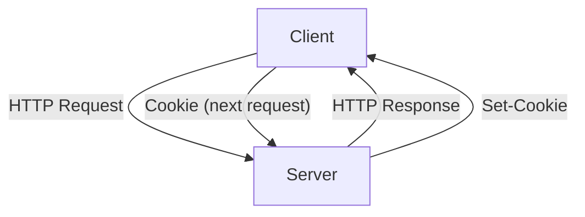
<sub>*Stateless HTTP with session management using cookies*</sub>

---

## Interview-Ready Questions

- What is HTTP and how does it work?
- Why is HTTP stateless, and how do you handle sessions?
- What are the differences between HTTP and HTTPS?
- Explain the HTTP request-response cycle with an example.
- When would you use PUT vs. PATCH?

---

## Conclusion

HTTP is the essential protocol powering the web. Its simplicity, statelessness, and extensibility make it suitable for everything from web pages to modern APIs. Mastering HTTP is a must for any backend, frontend, or system design engineer.

**Next Up:** Dive into REST and RESTfulness to learn how to build scalable and efficient APIs!

---

*References:*
- [MDN Web Docs: HTTP](https://developer.mozilla.org/en-US/docs/Web/HTTP)
- [RFC 2616: Hypertext Transfer Protocol -- HTTP/1.1](https://www.rfc-editor.org/rfc/rfc2616)

---


# Section 4

Certainly! Here’s a detailed **Markdown blog section** that integrates the transcript and slides, covering REST & RESTfulness, their context within protocols, practical code snippets, diagrams (ASCII for portability), and a ‘Tips and Tricks’ section.

---

# Mastering REST & RESTfulness: Principles, Protocols, and Practical API Design

Modern web and mobile apps rely on robust, scalable, and efficient communication protocols. At the heart of most web APIs lies **REST** (Representational State Transfer). In this guide, we’ll break down REST’s core principles, see how it fits into the broader landscape of network protocols, and learn best practices for designing high-quality RESTful APIs.

---

## 🌐 Where Does REST Fit In? (Protocols in Context)

Before diving into REST, let’s quickly review the protocol landscape:

- **TCP/UDP:** Low-level, transport protocols. TCP is reliable and connection-oriented; UDP is fast but unreliable.
- **HTTP:** Application-level protocol, stateless, built on top of TCP—powers web traffic.
- **REST:** An architectural style that builds on HTTP, defining how web APIs should be structured and behave.
- **Modern APIs (gRPC, GraphQL):** Address REST’s limitations for certain use cases—think microservices or highly dynamic frontend needs.

**Diagram: Protocol Layers**

```
+------------------------------+
|        Application Layer     |  <-- REST, GraphQL, gRPC APIs
+------------------------------+
|       HTTP/HTTPS Protocol    |
+------------------------------+
|        TCP / UDP             |
+------------------------------+
|           IP                 |
+------------------------------+
```

---

## 🤔 What is REST?

**REST** stands for **Representational State Transfer**. It’s an architectural style (not a protocol!) for designing networked applications. RESTful APIs use standard HTTP methods—GET, POST, PUT, DELETE—and are stateless, meaning the server does **not** remember anything about the client between requests.

**Key Characteristics:**

- **Statelessness:** Each request contains all information needed.
- **Resource-Based:** Everything (users, products, orders) is a _resource_, accessible via a URI.
- **Uniform Interface:** Consistent use of HTTP methods and status codes.
- **Cacheable:** Responses can be cached to improve performance.
- **Layered System:** Architecture can be composed of hierarchical layers (load balancer, proxy, etc).
- **Client-Server:** Clear separation between user interface (client) and data storage (server).

---

## 🚦 Why REST? Benefits & Use Cases

- **Simplicity & Scalability:** Standard HTTP, easy to scale stateless servers.
- **Interoperability:** Works across browsers, mobile, IoT, and more.
- **Efficiency:** Through caching, lightweight formats (e.g., JSON).
- **Real-World Use:** Powering APIs for Twitter, GitHub, Google, and countless more.

---

## 🌐 REST Constraints (Core Principles)

- **Client-Server Architecture:** Separation of concerns between client and server  
- **Statelessness:** Each request contains all necessary information, no session state stored on server  
- **Cacheability:** Responses must define themselves as cacheable or not  
- **Layered System:** Architecture composed of hierarchical layers for scalability  
- **Uniform Interface:** Standardized communication between client and server  
- **Code-on-Demand (optional):** Servers can send executable code to clients to extend functionality  

---

### 📊 REST Architecture Diagram

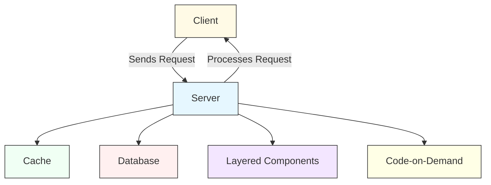
---

## 📝 RESTful API Design Principles

### 1. **Resource-Based Approach**

Design endpoints around _resources_, not _actions_.

| Resource    | Endpoint Example       |
|-------------|-----------------------|
| User        | `/users/{id}`         |
| Orders      | `/orders`             |
| Products    | `/products/{id}`      |

**Don’t:** `POST /createUser`  
**Do:** `POST /users`

### 2. **HTTP Methods**

| HTTP Method | Purpose                 | Example                  |
|-------------|-------------------------|--------------------------|
| GET         | Retrieve resource(s)    | GET `/users/123`         |
| POST        | Create new resource     | POST `/orders`           |
| PUT         | Update entire resource  | PUT `/users/123`         |
| PATCH       | Partial update          | PATCH `/users/123`       |
| DELETE      | Remove resource         | DELETE `/users/123`      |

### 3. **Stateless Interactions**

Each request is self-contained. For authentication, use tokens (e.g., JWT) rather than server-side sessions.

### 4. **Consistent URL Structure**

- Use **plural nouns**: `/users`, `/orders`
- **Avoid verbs** in URLs: `/users/activate` ❌ → Use `PATCH /users/{id}` ✅
- **Versioning**: `/v1/users` for backward compatibility

---

## ⚙️ Example: Building a Simple RESTful API (Node.js/Express)

## 🌍 Real-World REST API Examples

### 🐦 Twitter API
- **Fetch tweets:** `GET /tweets/{id}`
- **Post a tweet:** `POST /tweets`

### 🐙 GitHub API
- **Get repo details:** `GET /repos/{owner}/{repo}`
- **Create an issue:** `POST /repos/{owner}/{repo}/issues`

---

### 📊 API Request Flow Example (Twitter)

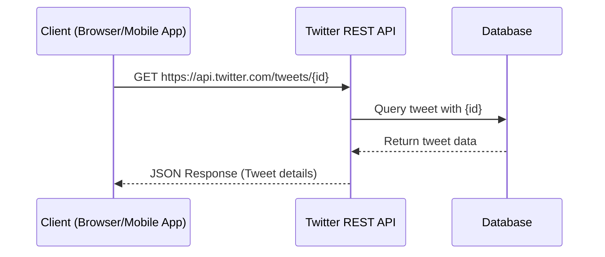
---
<details>
<summary> Below’s a mini REST API for user management: </summary>

```js
const express = require('express');
const app = express();
app.use(express.json());

let users = [{ id: 1, name: "Alice" }, { id: 2, name: "Bob" }];

// GET /users
app.get('/users', (req, res) => {
  res.json(users);
});

// GET /users/:id
app.get('/users/:id', (req, res) => {
  const user = users.find(u => u.id == req.params.id);
  if (!user) return res.status(404).json({ error: "Not Found" });
  res.json(user);
});

// POST /users
app.post('/users', (req, res) => {
  const newUser = { id: Date.now(), ...req.body };
  users.push(newUser);
  res.status(201).json(newUser);
});

// PUT /users/:id
app.put('/users/:id', (req, res) => {
  const idx = users.findIndex(u => u.id == req.params.id);
  if (idx === -1) return res.status(404).json({ error: "Not Found" });
  users[idx] = { ...users[idx], ...req.body };
  res.json(users[idx]);
});

// DELETE /users/:id
app.delete('/users/:id', (req, res) => {
  users = users.filter(u => u.id != req.params.id);
  res.status(204).send();
});

app.listen(3000, () => console.log('REST API listening on 3000'));
```
</details>

---

## 🔄 Data Formats: **JSON vs. XML**

- **JSON:** Default for modern REST APIs; lightweight, fast, readable.
- **XML:** Useful for legacy systems or strict schema validation.

**Content negotiation** (via the `Accept` header) allows clients to specify format:

```
GET /users/1
Accept: application/json
```

---

## 🚨 Best Practices & Common Pitfalls

### ✅ Use Proper HTTP Status Codes

| Code | Meaning                |
|------|------------------------|
| 200  | OK                     |
| 201  | Created                |
| 204  | No Content             |
| 400  | Bad Request            |
| 401  | Unauthorized           |
| 403  | Forbidden              |
| 404  | Not Found              |
| 500  | Internal Server Error  |

### ✅ Version Your APIs

Example: `/v1/users` vs. `/v2/users`

### ✅ Implement Authentication

Use OAuth2, JWT tokens, and always use HTTPS.

### ✅ Pagination for Large Datasets

```
GET /users?page=2&limit=50
```

### 🚫 Avoid Verbs in URLs

- `/createUser` ❌
- `POST /users` ✅

---

## 🕹️ Real-World REST API Examples

**Twitter API:**
```http
GET    /tweets/{id}       # Fetch a tweet
POST   /tweets            # Post a new tweet
```

**GitHub API:**
```http
GET    /repos/{owner}/{repo}                # Repo details
POST   /repos/{owner}/{repo}/issues         # Create an issue
```

---

## 📊 REST vs. Modern API Protocols

| Protocol  | Best For                          | Notes                                       |
|-----------|-----------------------------------|---------------------------------------------|
| REST      | General web APIs                  | Universal, simple, stateless                |
| gRPC      | Microservices, high-performance   | Binary, supports streaming, HTTP/2          |
| GraphQL   | Frontend-driven, flexible queries | Single endpoint, avoids over/under-fetching |

**Example: REST vs. GraphQL**

```http
# REST: Multiple endpoints
GET /users/1
GET /users/1/posts

# GraphQL: One endpoint, flexible query
POST /graphql
{
  user(id: 1) {
    name
    posts { title }
  }
}
```

---

## 💡 Tips and Tricks for RESTful API Design

- **Always document your API** (Swagger/OpenAPI is great!).
- **Use consistent and predictable URLs**.
- **Return helpful error messages** (but not sensitive info).
- **Support filtering, sorting, and searching via query params**.
- **Implement rate limiting and throttling** to prevent abuse.
- **Use HTTPS everywhere** to protect sensitive data.
- **Consider HATEOAS** (Hypermedia as the Engine of Application State) for discoverable APIs in advanced scenarios.
- **Log requests and errors** for monitoring and debugging.
- **Test your API** (unit, integration, and contract tests).

---

## 🔚 Conclusion & Next Steps

- **REST** is the backbone of modern API design: stateless, scalable, and easy to consume.
- **Best practices:** Resource-based endpoints, proper HTTP methods/status codes, versioning, authentication, and pagination.
- **Know when to use REST, gRPC, or GraphQL**—choose based on your system’s needs.

**Next Topics:**
- Real-Time Protocols (WebSockets, SSE, Long Polling)
- Modern API alternatives (gRPC, GraphQL)
- Architectural Patterns for Scalable Systems

---

### 📚 Further Reading & Practice

- [RESTful API Design - Best Practices in a Nutshell](https://restfulapi.net/)
- [OpenAPI Specification](https://swagger.io/specification/)
- [Postman](https://www.postman.com/) (for testing APIs)

---

**Happy Building! 🚀**

---

# Section 5

Certainly! Below is a **detailed Markdown blog section** on **Real-Time Communication Protocols** (WebSockets and Long Polling), integrating the content from your transcript and slides. The section includes explanations, code snippets, diagrams (in ASCII art), and a practical Tips & Tricks section for system design.

---

# Real-Time Communication Protocols: WebSockets vs. Long Polling

In modern system design, delivering **instant updates** to users—whether in chat apps, stock tickers, online games, or live notifications—is a critical requirement. Traditional HTTP request-response models often fall short due to their inherent latency and inefficiency. In this section, we’ll dive deep into two leading real-time communication techniques: **WebSockets** and **Long Polling**. We’ll cover how each works, their advantages, when to use them, and provide practical code examples.

---

## What is Real-Time Communication?

**Real-time communication** refers to the **continuous exchange of data** with minimal latency between clients and servers. Unlike traditional HTTP, where data is fetched only on explicit user requests, real-time systems push updates instantly, enabling interactive and responsive user experiences.

## 🔄 WebSocket Connection

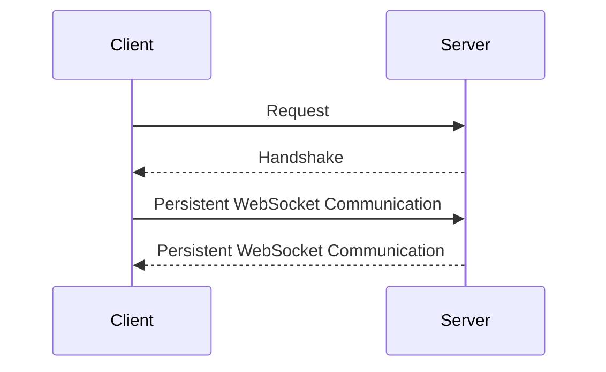
```markdown
                                               VS
```

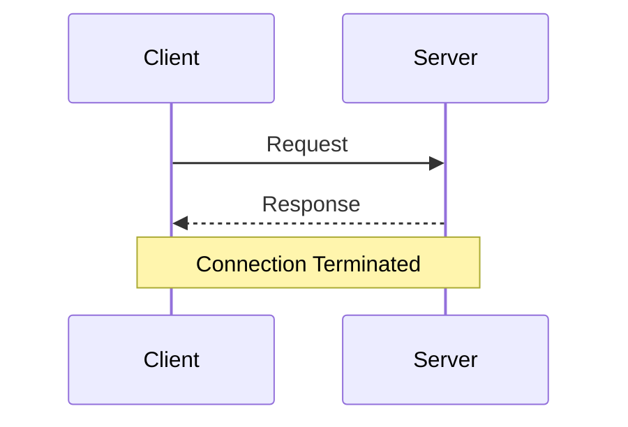

### Why Not Just Use HTTP?

HTTP follows a **request-response** model:

```
Client: --------> [Request] --------> Server
Client: <-------- [Response] <-------- Server
```
- **Drawbacks:**  
  - High latency (client must wait for updates)
  - Inefficiency (repeated requests even when no updates)
  - Scalability issues (server load increases with polling)

---

## Major Approaches to Real-Time Communication

- **Polling:** Client repeatedly asks for updates at intervals.
- **Long Polling:** Server holds client’s request open until new data is available.
- **WebSockets:** Persistent, bidirectional connection.
- **Server-Sent Events (SSE):** Unidirectional, server-to-client stream.

We’ll focus on **WebSockets** and **Long Polling**.

---

## WebSockets: Persistent, Full-Duplex Communication

### How WebSockets Work

WebSockets provide a **persistent, full-duplex TCP connection** between client and server. Once established, data can flow in both directions at any time, with minimal overhead.

#### WebSocket Handshake (Upgrade)

1. **Client initiates:** Sends an HTTP request with an `Upgrade: websocket` header.
2. **Server responds:** If it supports WebSockets, it replies with `101 Switching Protocols`.
3. **Connection established:** Both client and server can now send messages anytime.
4. **End Connection:** Either party can end connection when done.

**Diagram: WebSocket Lifecycle**
```
Client             Server
  |   HTTP Upgrade  |
  |---------------> |
  | <--- 101 SW     |
  |                 |  (Connection Open)
  | <-- Data -----> |
  | <---- Data ---- |
  |    ...          |
  |  [Close Frame]  |
  |---------------> |
  |    (Closed)     |
```

#### Code Example: WebSocket in Node.js

```js
// Server (Node.js with ws)
const WebSocket = require('ws');
const server = new WebSocket.Server({ port: 8080 });

server.on('connection', socket => {
  socket.on('message', message => {
    console.log('Received:', message);
    socket.send('Echo: ' + message);
  });
});

// Client (Browser)
const ws = new WebSocket('ws://localhost:8080');
ws.onopen = () => ws.send('Hello, Server!');
ws.onmessage = e => console.log('Server:', e.data);
```

### When to Use WebSockets?

- **High-frequency, bidirectional data exchange**
- **Low latency is critical** (e.g., multiplayer gaming, chat, live trading)
- **Use Cases:**  
  - Live chat (WhatsApp, Slack, Discord)  
  - Real-time stock price updates (NASDAQ)  
  - Online games (Fortnite, Call of Duty)  
  - Collaborative tools (Google Docs)

### Advantages

- **Persistent connection:** No need to reconnect for every message.
- **Low overhead:** Eliminates repeated HTTP requests.
- **Truly real-time:** Both sides can push data instantly.
- **Efficient:** Saves bandwidth and reduces server load.

---
## ⏱️ Long Polling: Simulating Real-Time with HTTP

### 📖 Definition
A technique where the client sends a request to the server and waits until the server has new data to respond with.

---

### 🔑 How it differs from regular polling:
- Regular polling responds immediately
- **Long polling** holds the request until new data is available

---

### 🛠️ How Long Polling Works (Step-by-Step)

1. Client makes an HTTP request  
2. Server holds the request until data is available  
3. Server responds with new data  
4. Client immediately sends another request  

---

### 📊 Long Polling Flow

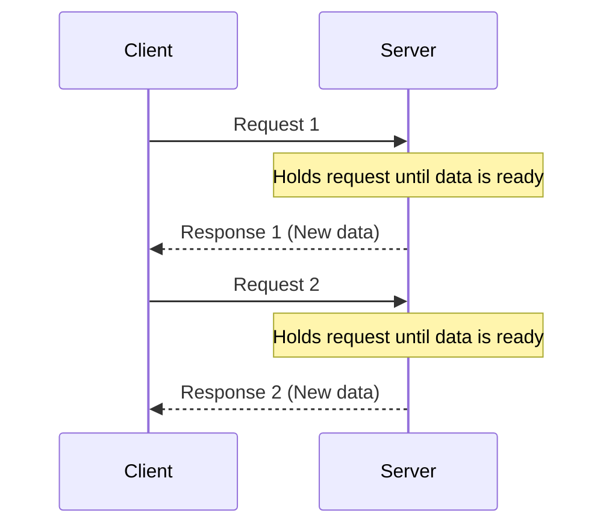


#### Code Example: Long Polling (Express.js)

```js
// Server (Node.js/Express)
const express = require('express');
const app = express();

let latestMessage = null, clients = [];

app.get('/poll', (req, res) => {
  if (latestMessage) {
    res.json({ message: latestMessage });
    latestMessage = null;
  } else {
    clients.push(res); // Hold the request
  }
});

app.post('/send', express.json(), (req, res) => {
  latestMessage = req.body.message;
  clients.forEach(c => c.json({ message: latestMessage }));
  clients = [];
  res.sendStatus(200);
});
```

```js
// Client (Browser)
async function poll() {
  const { message } = await fetch('/poll').then(r => r.json());
  display(message);
  poll(); // Immediately poll again
}
poll();
```

### When to Use Long Polling?

- **WebSockets not supported** (e.g., legacy infra, firewalls)
- **Low/periodic update frequency is acceptable**
- **Use Cases:**  
  - Notifications (Twitter, social media)
  - IoT device updates (intermittent connectivity)

### Advantages

- Works over standard HTTP
- Reduces unnecessary polling (compared to fixed-interval polling)
- Easier to implement in REST-based systems

---

## WebSockets vs. Long Polling: Comparison Table

| Feature            | WebSockets                            | Long Polling                   |
|--------------------|---------------------------------------|--------------------------------|
| Connection         | Persistent TCP (single connection)    | Multiple HTTP requests         |
| Directionality     | Bi-directional                        | Typically server-to-client     |
| Latency            | Very low                              | Low to moderate                |
| Overhead           | Minimal (after handshake)             | Higher (HTTP headers per req)  |
| Scalability        | Harder to scale, needs sticky sessions| Easier to scale horizontally   |
| Use Cases          | Chat, gaming, trading, collab docs    | Notifications, IoT, simple updates |
| Browser Support    | Modern browsers                       | Universal                      |

---

## Tips & Tricks for System Design Interviews

- **When to choose WebSockets?**  
  - High-frequency, bi-directional, low-latency requirements.
  - Both server and client can initiate communication.

- **When to choose Long Polling?**  
  - Environments where WebSockets aren’t supported (e.g., restrictive proxies).
  - Periodic, unidirectional updates are enough.

- **Scalability considerations:**  
  - **WebSockets:**  
    - Requires sticky sessions if using load balancers (tie user to a specific server).
    - Consider using message brokers (e.g., Redis Pub/Sub) for multi-node coordination.
  - **Long Polling:**  
    - Easier to scale horizontally; requests are stateless.
    - Can leverage existing RESTful infra.

- **Fallback logic:**  
  - Implement fallback: Try WebSockets, then degrade gracefully to Long Polling if not supported.

- **Security:**  
  - Always use `wss://` (WebSockets over TLS) in production.
  - Authenticate connections (JWT, OAuth).
  - Validate and sanitize all incoming data.

- **Testing:**  
  - Simulate slow clients and network interruptions.
  - Test reconnection and error handling logic.

---

## Quick Decision Guide

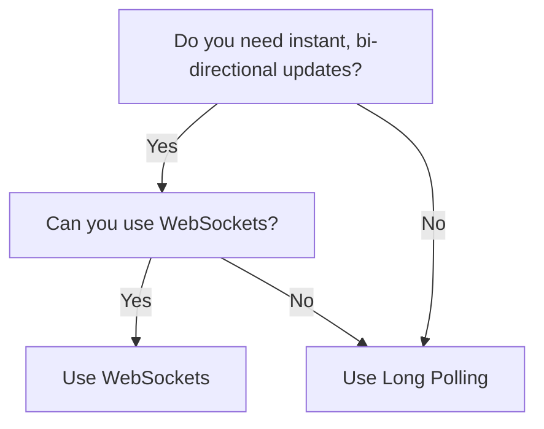

---

## Conclusion

Choosing between **WebSockets** and **Long Polling** depends on your application's latency needs, infrastructure, and scalability requirements. WebSockets shine for continuous, high-speed, two-way interactions, while Long Polling is a robust fallback for legacy or simple use cases. Understanding these trade-offs is crucial for scalable, high-performance system design.

---

**Next Up:**  
We’ll explore modern API protocols like **gRPC** and **GraphQL** for microservices and frontend-driven architectures.

---

**References:**
- [MDN - WebSockets](https://developer.mozilla.org/en-US/docs/Web/API/WebSockets_API)
- [Node.js ws Documentation](https://github.com/websockets/ws)
- [Express.js Documentation](https://expressjs.com/)

---

**Happy designing! 🚀**

---

# Section 6

Certainly! Below is a detailed **Markdown blog section** integrating the lecture transcript and slides, focused on **Modern API Protocols: Beyond REST – gRPC & GraphQL**. The post includes explanations, diagrams (using Markdown/ASCII), code snippets, and a **Tips & Tricks** section for system design and interviews.

---

# 🚀 Mastering Modern API Protocols: gRPC & GraphQL (Beyond REST)

In the ever-evolving world of system design, choosing the right API protocol is critical for meeting your application's performance, flexibility, and scalability requirements. While **REST** has been the dominant API standard, newer approaches like **gRPC** and **GraphQL** address some of REST’s limitations and are increasingly vital in modern architectures.

This guide explores:
- **Why alternatives to REST are needed**
- **How gRPC and GraphQL work**
- **Their key advantages and trade-offs**
- **When to use each one**
- **Sample code and diagrams**
- **Tips & Tricks for interviews**

---

## 🚩 Why Go Beyond REST (Limitations)?

While RESTful APIs are simple, stateless, and widely adopted, they come with limitations:

- **Over-fetching & Under-fetching:** Clients may get too much or too little data, requiring extra requests.
- **High Latency:** Multiple round trips to fetch related data increase response time.
- **Lack of Real-Time Support:** REST relies on polling for updates, which is inefficient for real-time apps.

**Example Problem:**
```http
// REST: Fetching user profile, but only need name & email
GET /users/123

{
  "id": 123,
  "name": "Alice",
  "email": "alice@example.com",
  "bio": "...",
  "created_at": "...",
  // ...lots of unused fields
}
```

---

## 🔥 Modern Solutions: **gRPC** & **GraphQL**

| Protocol       | Focus                | Serialization | Strengths                       | Best Use Case              |
| -------------- | ------------------- | ------------ | ------------------------------- | -------------------------- |
| REST           | Simplicity           | JSON/XML     | Ubiquity, easy debugging        | Public APIs                |
| **gRPC**       | Performance & Microservices | Protocol Buffers (binary) | Speed, Streaming, Multi-lang | Microservices, Real-time   |
| **GraphQL**    | Flexibility          | JSON         | Custom data queries, aggregation| Frontend, Mobile, Dashboards|

---

## 🛰️ **gRPC**: High-Performance Remote Procedure Calls

**gRPC** is a framework developed by Google for efficient, type-safe, high-speed communication. It shines in microservices architectures and real-time systems. It is a high performance, binary protocol optimized for microservices and real time communication.

### ⚡ gRPC - How It Works?

- **Built on HTTP/2**, allowing:
  - 🔀 **Multiplexed requests:** Multiple calls over one connection  
  - 🗜️ **Compression:** Smaller payload sizes  
  - 🔄 **Full-duplex streaming:** Real-time bidirectional communication  
- **Uses Protocol Buffers (protobuf):** Smaller, faster serialization than JSON.
- **Supports Full Duplex Streaming:** Both client and server can send/receive data in real-time.
- **Auto-generates code:** For many languages (Go, Java, Python, etc.).

- **Uses Protocol Buffers (ProtoBuf):**  
  - Fast serialization  
  - Smaller and faster than JSON  

---

### 📊 gRPC Communication Flow

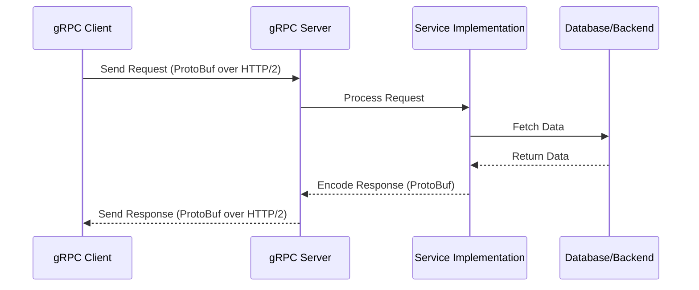

### 🖥️ Client-Server Serialization Diagram

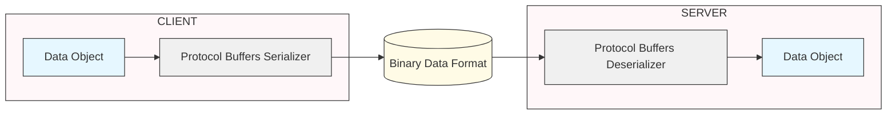

#### **gRPC Architecture Diagram**

```plaintext
+-------------+        HTTP/2 + Protobuf        +-------------+
|  Client     | <==============================>|   Server    |
| (auto-code) |          (binary, fast)         | (auto-code) |
+-------------+                                 +-------------+
         ^                                          ^
         |<--- Bidirectional Streaming ------------>|
```

### **Sample gRPC Proto File**

```protobuf
// user.proto
syntax = "proto3";

service UserService {
  rpc GetUser (UserRequest) returns (UserResponse) {}
  rpc StreamUsers (stream UserRequest) returns (stream UserResponse) {} // streaming
}

message UserRequest {
  int32 id = 1;
}

message UserResponse {
  int32 id = 1;
  string name = 2;
  string email = 3;
}
```

### **Python Client Example**

```python
import grpc
import user_pb2
import user_pb2_grpc

channel = grpc.insecure_channel('localhost:50051')
stub = user_pb2_grpc.UserServiceStub(channel)
response = stub.GetUser(user_pb2.UserRequest(id=123))
print(response.name, response.email)
```

### **When to Use gRPC?**

- **Microservices communication** (internal APIs)
- **Real-time streaming** (video, analytics)
- **IoT/low bandwidth environments** (small payloads)
- **Multi-language ecosystems**

---

## 🧩 **GraphQL**: Flexible Data Fetching

**GraphQL** is a flexible query language developed by Facebook, enabling clients to request exactly what they need—no more, no less.

## 🧩 GraphQL - How It Works?


- Instead of multiple REST endpoints, GraphQL has **one endpoint** where clients specify the data they need.  
- GraphQL **Schema** defines types and relationships between data.  
- Clients send queries → GraphQL server **resolves fields dynamically**.

- **Single endpoint**: Clients specify required fields in a query (no more multiple endpoints).
- **Schema-driven**: Strongly-typed schema defines data & relationships.
- **Dynamic responses**: Server assembles responses per request.

---

### 📊 GraphQL Communication Flow

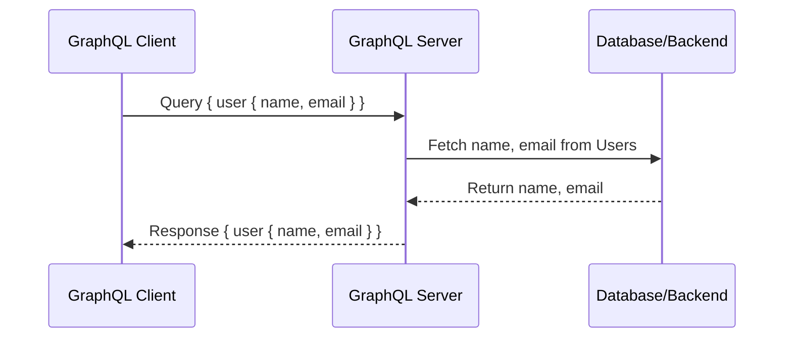

#### **GraphQL Query Example**

```graphql
query {
  user(id: 123) {
    name
    email
    recentTransactions {
      id
      amount
    }
  }
}
```

**Response:**
```json
{
  "data": {
    "user": {
      "name": "Alice",
      "email": "alice@example.com",
      "recentTransactions": [
        {"id": 1, "amount": 100},
        {"id": 2, "amount": 50}
      ]
    }
  }
}
```

### **GraphQL Schema Example (SDL)**

```graphql
type User {
  id: ID!
  name: String!
  email: String!
  recentTransactions: [Transaction]
}

type Transaction {
  id: ID!
  amount: Float!
}

type Query {
  user(id: ID!): User
}
```

### **GraphQL Server Example (Node.js/Express)**

```js
const { ApolloServer, gql } = require('apollo-server');

const typeDefs = gql`
  type User { id: ID!, name: String!, email: String! }
  type Query { user(id: ID!): User }
`;

const resolvers = {
  Query: {
    user: (_, { id }) => ({ id, name: "Alice", email: "alice@example.com" }),
  },
};

const server = new ApolloServer({ typeDefs, resolvers });
server.listen();
```

### 🚀 GraphQL - Use Cases & When to Use

- **Frontend Optimization:** Clients fetch exactly what they need.  
- **Reducing API Requests:** One query can replace multiple REST calls.  
- **Mobile & Web Apps:** Handles slow networks and multiple data sources efficiently.  
- **Aggregating Data from Multiple Services:** Simplifies fetching data from different databases or APIs.


---

## ⚖️ **gRPC vs. GraphQL vs. REST**: A Comparison

| Feature             | REST           | gRPC             | GraphQL            |
|---------------------|----------------|------------------|--------------------|
| Serialization       | JSON/XML       | Protocol Buffers | JSON               |
| Transport           | HTTP/1.1       | HTTP/2           | HTTP/1.1/2         |
| Flexibility         | Low            | Medium           | High               |
| Performance         | Medium         | High             | Medium             |
| Real-Time Support   | Poor (Polling) | Excellent        | Good (Subscriptions)|
| Language Support    | Universal      | Multi-language   | Universal          |
| Best For            | Public APIs    | Microservices, Internal APIs | Frontend, Aggregation|
| Tooling             | Mature         | Evolving         | Evolving           |

---

## 💡 Tips & Tricks

**For System Design & Interviews:**

- **Always justify your protocol choice.** Explain trade-offs: e.g., “I’d use gRPC for internal microservice comms due to its speed and low latency, but REST or GraphQL for public APIs for broader compatibility.”
- **REST is best for:** Simplicity, public APIs, broad adoption.
- **gRPC is best for:** Internal, high-throughput, low-latency services, streaming data.
- **GraphQL is best for:** Client flexibility, aggregating data, avoiding over/under-fetch.
- **Security:** All protocols require authentication. gRPC supports TLS; GraphQL needs to guard against complex queries (e.g., query depth limiting).
- **Versioning:** REST uses URL versioning (`/v1/resource`). gRPC uses proto file evolution. GraphQL often evolves the schema with deprecations.
- **Combine protocols:** It’s common to use REST/GraphQL for external APIs and gRPC for internal communication.
- **For real-time needs:** Prefer gRPC (streaming) or GraphQL subscriptions over REST.

---

## 📚 Interview Questions Cheat Sheet

- **Compare REST, gRPC, GraphQL:** Pros/cons, serialization, real-time capabilities.
- **When to use gRPC over REST?** (microservices, internal APIs, streaming)
- **Trade-offs of GraphQL in large systems?** (complexity, caching, security)
- **How does gRPC handle authentication?** (TLS, token-based, etc.)
- **Scaling GraphQL APIs?** (caching, batching, complexity analysis)

---

## 🎯 Key Takeaways

- **gRPC:** Blazing fast, ideal for microservices & real-time systems.
- **GraphQL:** Flexible, precise, perfect for frontend-driven APIs.
- **REST:** Simple, reliable, great for public APIs.
- **No one-size-fits-all:** Choose based on your project’s needs and be ready to discuss your decision in interviews!

---

**Next up:** Dive into architectural patterns and see how these protocols fit into scalable system designs!

---

**References:**
- [gRPC Docs](https://grpc.io/docs/)
- [GraphQL Docs](https://graphql.org/learn/)
- [RESTful API Design](https://restfulapi.net/)

---

*Happy designing! If you have questions or want more code samples, let us know in the comments!*

# Section 7

Certainly! Here’s a detailed Markdown blog section integrating the transcript and slides on **Protocols in System Design**. The content is organized logically, includes diagrams (as ASCII where possible), code snippets (HTTP, WebSockets, gRPC, GraphQL), and a practical ‘Tips and Tricks’ section.

---

# 📡 Protocols in System Design: The Backbone of Modern Distributed Systems

Understanding protocols is essential for anyone designing robust, scalable, and efficient systems. In this section, we’ll cover the foundational protocols used in networking and API design, compare their strengths and weaknesses, and see how they underpin everything from web browsing to real-time gaming and microservices.

---

## 1. TCP & UDP: The Building Blocks of Network Communication

### What is TCP?

**TCP (Transmission Control Protocol)** is a connection-oriented protocol that ensures reliable, ordered, and error-checked delivery of data between applications.

**Key Features:**
- Reliable transmission (resends lost packets)
- Ordered delivery
- Error checking
- Flow and congestion control

**When to use:** Web browsing, file transfer, email, database communication.

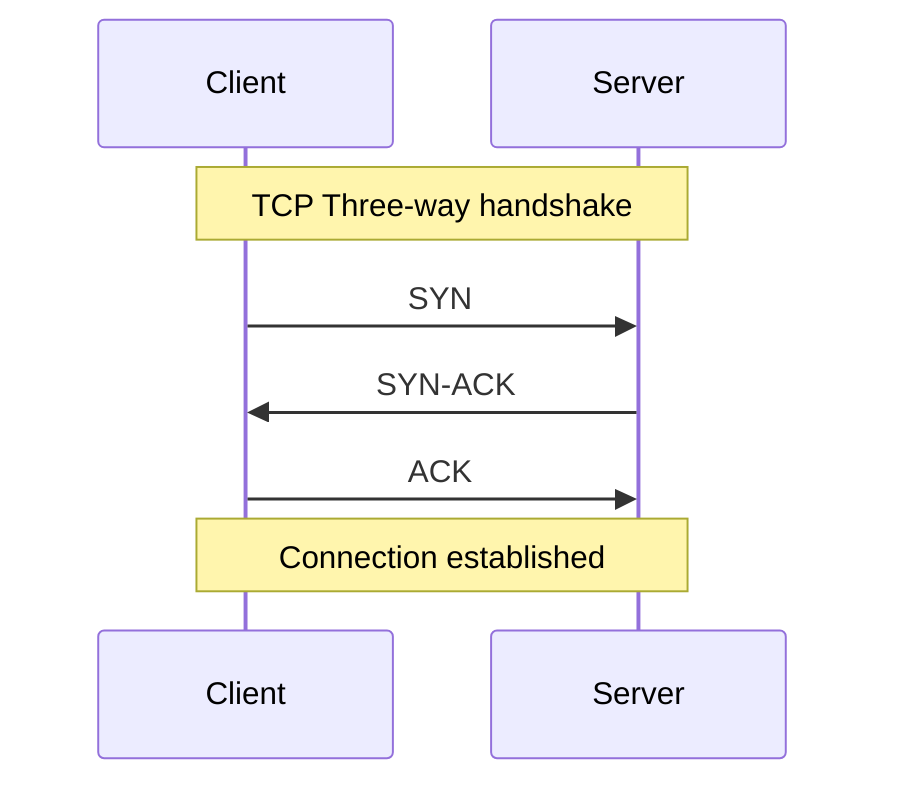

### What is UDP?

**UDP (User Datagram Protocol)** is connectionless and focuses on speed over reliability. It does not guarantee delivery, order, or error correction.

**Key Features:**
- Fast, lightweight
- No guarantee of delivery or order
- No retransmission

**When to use:** Video streaming, online gaming, VoIP, DNS lookups.

```plaintext
[Client] --UDP Packet--> [Server]
(No handshake, minimal overhead)
```

**Comparison Table:**

| Feature        | TCP                | UDP            |
| -------------- | ------------------ | -------------- |
| Reliability    | Yes                | No             |
| Order          | Yes                | No             |
| Speed          | Slower             | Faster         |
| Use Cases      | HTTP, FTP, Email   | Video, DNS, VoIP |

---

## 2. HTTP: The Foundation of Web Communication

**HTTP (HyperText Transfer Protocol)** is the protocol powering the web, built atop TCP.

### HTTP Request-Response Cycle

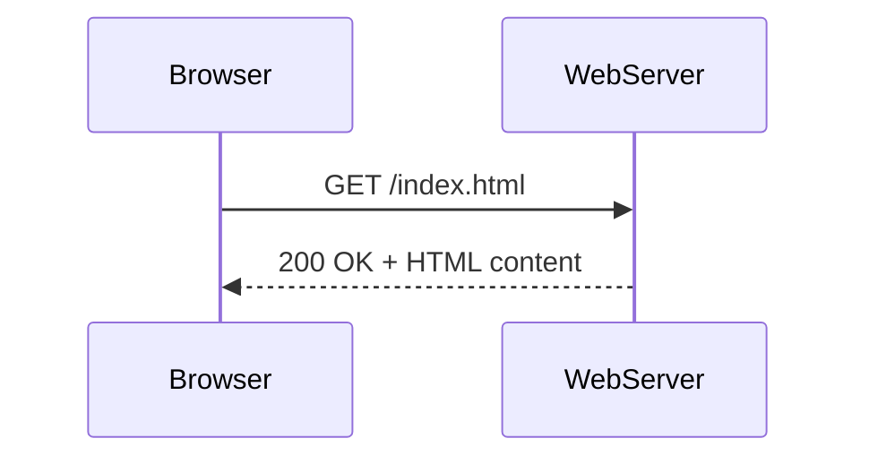

**Key Points:**
- **Stateless:** Each request is independent. Use cookies, sessions, or tokens for state.
- **Methods:** `GET`, `POST`, `PUT`, `DELETE`, `PATCH`

#### Example HTTP Request

```http
GET /users/123 HTTP/1.1
Host: api.example.com
Authorization: Bearer <token>
```

#### Example HTTP Response

```http
HTTP/1.1 200 OK
Content-Type: application/json

{
  "id": 123,
  "name": "Alice"
}
```

---

## 3. REST & RESTfulness: Modern API Design

**REST (Representational State Transfer)** is an architectural style for designing networked applications using HTTP.

### REST Constraints

- **Client-Server:** Separation of concerns.
- **Stateless:** No client context stored on the server.
- **Cacheable:** Responses can be cached.
- **Uniform Interface:** Consistent, predictable URLs and methods.
- **Layered System:** Multiple intermediaries possible.

### RESTful API Example

```http
GET /users/42        # Retrieve user with ID 42
POST /orders         # Create a new order
PATCH /users/42      # Partially update user 42
DELETE /products/10  # Delete product 10
```

**Best Practices:**
- Use plural nouns for resource collections: `/users`, `/orders`
- Avoid verbs in URLs: `POST /users`, not `/createUser`
- Implement versioning: `/v1/users`
- Use proper status codes (`200`, `201`, `400`, `404`, `500`)

---

## 4. Real-Time Communication: Beyond Request-Response

### Why Not Just Use HTTP?

Traditional HTTP is stateless and request-driven—great for web pages, but not for real-time updates like chat or live dashboards.

### WebSockets

**WebSockets** provide a persistent, full-duplex channel over a single TCP connection.

**How It Works:**

1. **Handshake:** Client requests upgrade via HTTP.
2. **Persistent Connection:** Both client and server can send messages anytime.
3. **Low Latency:** Ideal for chat, live updates, multiplayer games.

```javascript
// Client-side JavaScript
const socket = new WebSocket('ws://example.com/socket');
socket.onopen = () => socket.send('Hello server!');
socket.onmessage = (event) => console.log('Received:', event.data);
```

**Diagram:**

```plaintext
[Client] <==== Persistent TCP Connection ====> [Server]
        <=====>   Real-time, bidirectional   <====>
```

### Long Polling

If WebSockets are not available, **long polling** is a workaround using repeated HTTP requests:

1. Client requests data.
2. Server holds the request until data is available.
3. Server responds; client immediately re-requests.

**Use for:** Notifications, feeds, where instant updates are needed but not continuously.

---

## 5. Modern API Protocols: gRPC & GraphQL

### Why Move Beyond REST?

- **Over-fetching / Under-fetching:** Clients get too much or too little data.
- **Multiple requests needed for complex data.**
- **Not optimized for real-time or binary communication.**

### gRPC

**gRPC** is a high-performance, binary protocol built on HTTP/2, using Protocol Buffers for serialization.

**Use Cases:**
- Microservices communication
- Real-time streaming (full-duplex)
- IoT and bandwidth-limited environments

**Example: gRPC Service Definition (ProtoBuf)**

```proto
syntax = "proto3";

service UserService {
  rpc GetUser (UserRequest) returns (UserResponse);
}

message UserRequest {
  int32 id = 1;
}

message UserResponse {
  int32 id = 1;
  string name = 2;
}
```

**Client Call (Go Example):**

```go
resp, err := client.GetUser(ctx, &pb.UserRequest{Id: 42})
```

---

### GraphQL

**GraphQL** lets clients specify exactly what data they need, reducing over-fetching.

**Example Query:**

```graphql
query {
  user(id: 42) {
    id
    name
    posts {
      title
      date
    }
  }
}
```

**Response:**

```json
{
  "data": {
    "user": {
      "id": 42,
      "name": "Alice",
      "posts": [
        { "title": "First Post", "date": "2023-01-01" }
      ]
    }
  }
}
```

**Best For:**
- Front-end optimization (mobile/web)
- Aggregating data from multiple sources
- Reducing the number of API calls

---

## ✅ Tips and Tricks

- **TCP vs. UDP:** Use TCP if data integrity matters (web, file transfer, email). Use UDP for speed (video, games, VoIP).
- **HTTP Methods:** Use the right HTTP verb for the right action. `GET` for fetch, `POST` for create, `PUT` for update, `DELETE` for remove.
- **RESTful APIs:** Keep URLs resource-centric, use plural nouns, avoid verbs in URLs.
- **State in HTTP:** Use cookies, sessions, or tokens to handle user state in stateless HTTP.
- **WebSockets vs. Long Polling:** Prefer WebSockets where low latency and bidirectional communication are critical (chat, real-time dashboards).
- **gRPC:** Choose for high-performance, strongly-typed, binary communication, especially in microservices.
- **GraphQL:** Use when front-end flexibility and reduced requests are important, but weigh complexity at scale.
- **Versioning:** Always version your APIs to avoid breaking changes.
- **Security:** Always use HTTPS in production. Implement authentication (OAuth, JWT) and rate limiting for public APIs.

---

## 📚 Conclusion

Protocols are the invisible backbone of modern system design—choosing the right one is crucial for scalability, performance, and user experience. Mastering TCP/UDP, HTTP, REST, real-time protocols like WebSockets, and modern API protocols like gRPC and GraphQL gives you the toolbox to build anything from a simple website to a global-scale distributed application.

**Next up:** We’ll explore architectural patterns—how system components interact and how to design for scalability, fault tolerance, and performance.

---

*Stay tuned and happy designing!* 🚀

