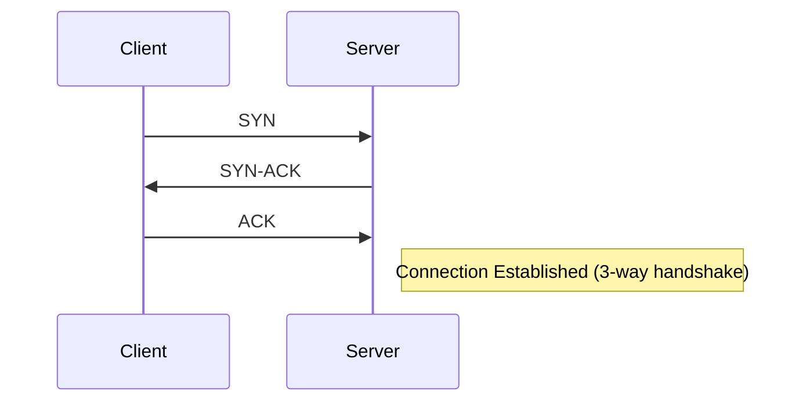
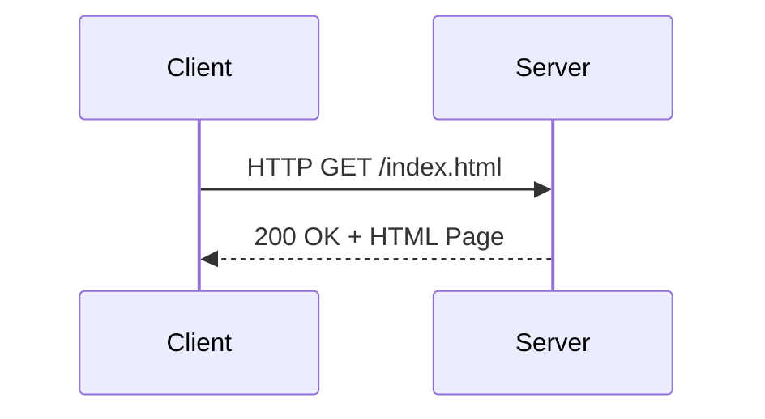
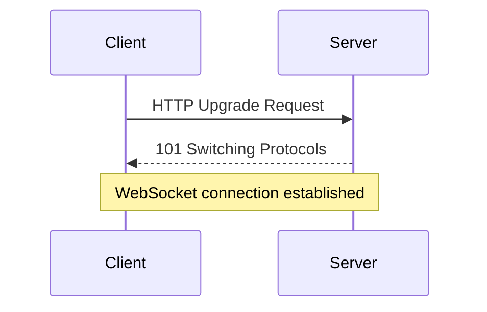
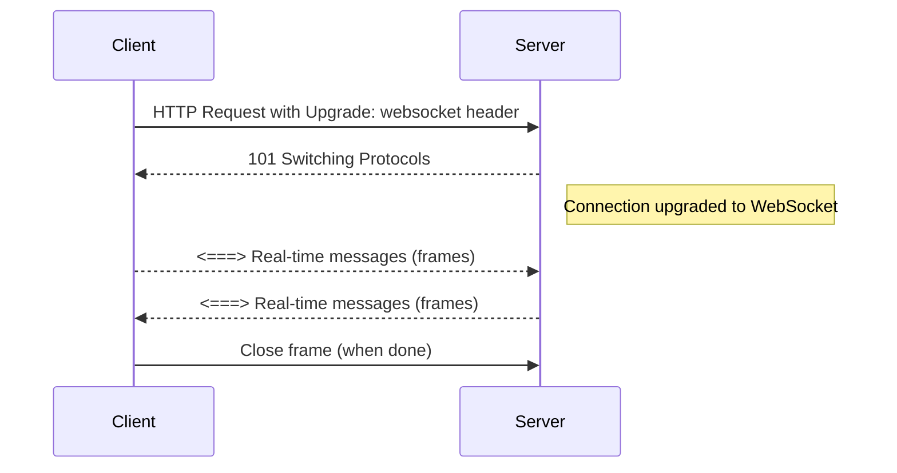
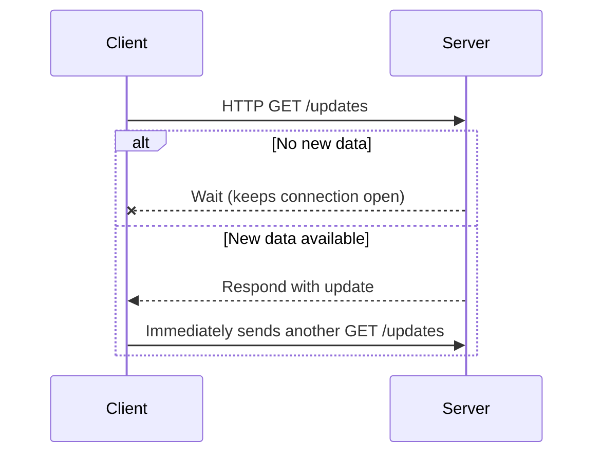

# Section 1

Certainly! Below is a detailed **blog section** that integrates the transcript and slides, enriched with explanations, diagrams (text-based for Markdown), code snippets, and a **Tips and Tricks** section. This is designed to be engaging and accessible for learners exploring protocols in system design.

---

# Section 3: Protocols – The Backbone of Modern System Design

Welcome to Section 3 of our system design journey! 🚀 In this section, we’ll unravel the core communication protocols that power modern architecture—from the basics of TCP and UDP, through HTTP and REST, all the way to real-time protocols like WebSockets and modern API paradigms such as gRPC and GraphQL.

Understanding these protocols is essential for building scalable, reliable, and efficient systems. Whether you're designing a simple web service or architecting a distributed microservices platform, the right choice of protocol can make or break your solution.

---

## 1. TCP & UDP: The Building Blocks of Network Communication

### What is TCP (Transmission Control Protocol)?

- **Connection-oriented**: Establishes a connection before data transfer.
- **Reliable, ordered, and error-checked**: Ensures all data is received correctly and in order.
- **Use cases**: Web browsing (HTTP/HTTPS), file transfers (FTP/SFTP), emails, database connections.



**TCP Example in Python:**

```python
# TCP Client
import socket

sock = socket.socket(socket.AF_INET, socket.SOCK_STREAM)
sock.connect(('example.com', 80))
sock.sendall(b"GET / HTTP/1.1\r\nHost: example.com\r\n\r\n")
response = sock.recv(4096)
print(response.decode())
sock.close()
```

---

### What is UDP (User Datagram Protocol)?

- **Connectionless**: No connection setup or teardown.
- **Unreliable & unordered**: Packets can be lost or arrive out of order.
- **Faster**: Less overhead, perfect for real-time needs.
- **Use cases**: Video streaming, online gaming, VoIP, DNS lookups.

```python
# UDP Example
import socket

sock = socket.socket(socket.AF_INET, socket.SOCK_DGRAM)
sock.sendto(b"hello", ("example.com", 12345))
data, addr = sock.recvfrom(1024)
print(data.decode())
sock.close()
```

---

### TCP vs. UDP: Key Differences

| Feature      | TCP             | UDP        |
|--------------|-----------------|------------|
| Reliability  | Yes             | No         |
| Order        | Yes             | No         |
| Speed        | Slower          | Faster     |
| Use Cases    | HTTP, FTP, Mail | Streaming, Gaming, DNS |

---

## 2. HTTP: The Backbone of the Web

**HTTP (HyperText Transfer Protocol)** is the fundamental protocol for web communication. It’s stateless, text-based, and works over TCP (port 80 for HTTP, 443 for HTTPS).

**Request-Response Model (Diagram):**



**HTTP Request Example:**

```
GET /users/1 HTTP/1.1
Host: api.example.com
Authorization: Bearer <token>
```

**HTTP Response Example:**

```
HTTP/1.1 200 OK
Content-Type: application/json

{
  "id": 1,
  "name": "Alice"
}
```

### HTTP Methods

- `GET`: Retrieve data
- `POST`: Create new resource
- `PUT`: Update entire resource
- `PATCH`: Partial update
- `DELETE`: Remove resource

```http
POST /users HTTP/1.1
Content-Type: application/json

{
  "name": "Alice"
}
```

### HTTP Status Codes

| Code | Meaning             |
|------|---------------------|
| 200  | OK                  |
| 201  | Created             |
| 400  | Bad Request         |
| 401  | Unauthorized        |
| 404  | Not Found           |
| 500  | Internal Server Error|

---

### Statelessness in HTTP

HTTP treats each request as independent. To manage state (like login sessions), we use:

- **Cookies** (browser-stored data)
- **Sessions** (server-side state)
- **Tokens** (JWT, OAuth)

---

## 3. REST & RESTfulness: API Design Principles

**REST (Representational State Transfer)** is an architectural style using standard HTTP methods for stateless communication.

### Core REST Principles

- **Client-Server**: Separation of concerns.
- **Stateless**: Each request contains all context.
- **Cacheable**: Responses can be cached for efficiency.
- **Uniform Interface**: Consistent, resource-based URLs.

**RESTful Endpoint Example:**

```http
GET /users/42         # Fetch user with ID 42
POST /orders          # Create a new order
DELETE /products/9    # Remove product with ID 9
```

**Best Practices:**
- Use plural nouns: `/users`, `/orders`
- Avoid verbs in URLs: `POST /users` (not `/createUser`)
- Implement versioning: `/v1/users`
- Use proper HTTP status codes and pagination

**JSON vs. XML:**
- JSON is lightweight and easy to parse; use XML only for legacy or strict schema needs.

---

## 4. Real-Time Communication: WebSockets and Long Polling

### Why Not Just HTTP?

Traditional HTTP is **request-response** and stateless, making true real-time updates hard.

---

### WebSockets

- **Persistent, full-duplex TCP connection**
- **Bi-directional communication**: Both client and server can send messages anytime.
- **Low latency**: Great for chat, online games, live updates.

**WebSocket Handshake (Simplified):**



**WebSocket Example (JavaScript):**

```js
const ws = new WebSocket('wss://echo.websocket.org');
ws.onopen = () => ws.send('Hello, WebSocket!');
ws.onmessage = (event) => console.log('Received:', event.data);
```

---

### Long Polling

- **Simulates real-time over HTTP**: Client sends a request, server holds it until new data is available.
- **When to use**: Legacy systems, intermittent updates, limited WebSocket support.

**Long Polling Flow:**

1. Client sends HTTP request.
2. Server waits until there's data, then responds.
3. Client immediately sends another request.

---

### WebSockets vs. Long Polling

| Feature            | WebSockets          | Long Polling   |
|--------------------|---------------------|----------------|
| Latency            | Low                 | Higher         |
| Bi-directional     | Yes                 | No             |
| Overhead           | Low (persistent)    | High (many HTTP requests) |
| Use Cases          | Gaming, chat, stock feeds | Notifications, IoT |

---

## 5. Modern API Protocols: gRPC & GraphQL

### Limitations of REST

- **Over-fetching / Under-fetching**: REST endpoints may return too much or little data.
- **Multiple requests for complex data**
- **Not optimized for real-time**

---

### gRPC

- **High-performance, binary protocol** based on HTTP/2.
- **ProtoBuf serialization**: Faster and smaller than JSON.
- **Perfect for microservices, real-time streaming, IoT.**

**gRPC Example (.proto definition):**

```proto
syntax = "proto3";

service Greeter {
  rpc SayHello (HelloRequest) returns (HelloReply) {}
}

message HelloRequest {
  string name = 1;
}

message HelloReply {
  string message = 1;
}
```

---

### GraphQL

- **Flexible query language**: Clients specify exactly what they need via a single endpoint.
- **Reduces over-fetching and multiple requests**
- **Great for mobile/web apps needing custom data shapes.**

**GraphQL Query Example:**

```graphql
query {
  user(id: 5) {
    name
    email
    posts(limit: 3) {
      title
      publishedAt
    }
  }
}
```

**Response:**

```json
{
  "data": {
    "user": {
      "name": "Alice",
      "email": "alice@example.com",
      "posts": [
        {"title": "Intro to GraphQL", "publishedAt": "2023-04-01"},
        // ...
      ]
    }
  }
}
```

---

## Tips and Tricks

- **TCP vs. UDP**: Use TCP when data must arrive intact (web, email). Use UDP when speed matters more than reliability (games, video).
- **HTTP methods**: Stick to RESTful conventions (`GET`, `POST`, `PUT`, `PATCH`, `DELETE`).
- **WebSockets**: Use for true real-time and bi-directional needs. Always handle connection failures gracefully.
- **Long Polling**: Good fallback when infra doesn’t support WebSockets.
- **GraphQL**: Use when client needs flexible, custom queries. Watch for N+1 query problems.
- **gRPC**: Excellent for microservices and high-throughput, low-latency comms. Not browser-friendly (yet).
- **Security**: Always use HTTPS for sensitive data. Use authentication tokens (JWT, OAuth) for APIs.
- **Versioning**: Implement API versioning from the start (`/v1/`), especially for public APIs.
- **Caching**: Use HTTP caching headers (`ETag`, `Cache-Control`) wisely to improve performance.
- **Interview Prep**: Be able to compare protocols and justify your choices for different scenarios.

---

## Conclusion

Mastering protocols is foundational for great system design. Choose the right protocol for your use case, understand the trade-offs, and always design for scalability and maintainability.

**Next up:** We dive into architectural patterns and how these protocols fit into the bigger system design puzzle!

---

**Happy architecting!** 🏗️

---

*Did you find this section helpful? Share your thoughts or questions below!*

# Section 2

Certainly! Here is a detailed **Markdown blog section** integrating both your transcript and slides, featuring explanatory text, code snippets, ASCII diagrams, and a practical "Tips and Tricks" section.

---

# Mastering System Design: Understanding TCP, UDP, and Beyond

## Introduction

When building scalable distributed systems, the choice of communication protocol can make or break your application’s performance and reliability. Two foundational protocols—**TCP** (Transmission Control Protocol) and **UDP** (User Datagram Protocol)—form the bedrock of networking. Let’s break down how they work, their differences, and when to use each, before looking at modern trends like HTTP, REST, WebSockets, gRPC, and GraphQL.

---

## TCP vs. UDP: The Basics

### What is TCP (Transmission Control Protocol)?

- **Connection-oriented**: Establishes a handshake before sending data.
- **Reliable, ordered, error-checked**: Guarantees data arrives intact and in order.
- **Use Case**: Critical data transfers (web browsing, emails, file transfers).

#### How TCP Works: The Three-Way Handshake

```txt
Client                Server
   |      SYN           |
   |------------------->|
   |      SYN-ACK       |
   |<-------------------|
   |      ACK           |
   |------------------->|
   |  Data Transfer...  |
```

**Explanation:**
1. **SYN**: Client asks to start a connection.
2. **SYN-ACK**: Server acknowledges and agrees.
3. **ACK**: Client confirms, and the connection is established.

#### TCP Data Transmission Example (Python)

```python
import socket

# Client Side
s = socket.socket(socket.AF_INET, socket.SOCK_STREAM)
s.connect(('example.com', 80))
s.sendall(b'GET / HTTP/1.1\r\nHost: example.com\r\n\r\n')
print(s.recv(1024))
s.close()
```

---

### What is UDP (User Datagram Protocol)?

- **Connectionless**: No handshake, just sends packets.
- **Fast, but unreliable**: No guarantee of delivery, order, or error-checking.
- **Use Case**: Real-time apps (gaming, video streaming, DNS, VOIP).

#### UDP Packet Flow (Postcard Analogy)

```txt
Sender               Receiver
   |   UDP Packet 1    |
   |------------------>|
   |   UDP Packet 2    |
   |------------------>|
   |   UDP Packet 3    |  (No guarantee all arrive, or in order)
   |------------------>|
```

#### UDP Example (Python)

```python
import socket

# Client Side
s = socket.socket(socket.AF_INET, socket.SOCK_DGRAM)
s.sendto(b'Hello, UDP Server!', ('localhost', 9999))
```

---

### TCP vs. UDP: Key Differences

| Feature         | TCP                               | UDP                         |
|-----------------|-----------------------------------|-----------------------------|
| Connection      | Connection-oriented (handshake)   | Connectionless              |
| Reliability     | Reliable (guaranteed delivery)    | Unreliable                  |
| Ordering        | Guarantees order                  | No order guarantee          |
| Speed           | Slower (more overhead)            | Faster (minimal overhead)   |
| Use Cases       | Web, Email, File Transfer         | Video, Gaming, DNS, VOIP    |

---

## Choosing the Right Protocol

### When to Use TCP

- **Web Browsing** (`HTTP`, `HTTPS`)
- **File Transfers** (`FTP`, `SFTP`)
- **Email** (`SMTP`, `IMAP`, `POP3`)
- **Database Communication**
- **Any scenario where loss or corruption of data is unacceptable**

### When to Use UDP

- **Video Streaming** (YouTube, Netflix)
- **Online Gaming** (Fortnite, Call of Duty)
- **VOIP Calls** (Skype, Zoom, WhatsApp)
- **DNS Lookups**

---

## Protocols in Modern Web & API Design

### HTTP: The Backbone of the Web

- **Text-based, stateless protocol over TCP**
- **Request–Response model**
- **Common Methods**: GET, POST, PUT, DELETE, PATCH

#### HTTP Request Example (cURL)

```bash
curl -X GET https://api.example.com/users/1
```

#### HTTP Request–Response Diagram

```txt
Browser      --->   HTTP Request    --->   Server
Browser      <---   HTTP Response   <---   Server
```

#### Statelessness Example

Every request is independent:

```http
GET /profile
Cookie: session_id=abc123

GET /profile
Cookie: session_id=abc123
```

---

### RESTful API Design

- **Uses HTTP methods and status codes**
- **Stateless, resource-oriented endpoints**

#### REST Endpoint Example

```http
GET /users/42          # Fetch user with id 42
POST /orders           # Create a new order
PUT /products/5        # Update product with id 5
DELETE /comments/99    # Delete comment with id 99
```

#### Best Practices

- Use plural nouns for resource collections (`/users`, `/orders`)
- Avoid verbs in URLs (`/createUser` → `POST /users`)
- Implement versioning (`/v1/users`)

---

### Real-Time Communication: WebSockets & Long Polling

#### WebSockets

- **Persistent, full-duplex TCP connection**
- **Ideal for instant messaging, live feeds, multiplayer games**

```txt
Client <====> Persistent TCP <====> Server
```

**Example (Node.js, ws library):**

```js
const WebSocket = require('ws');
const ws = new WebSocket('ws://localhost:8080');
ws.on('open', () => ws.send('Hello Server!'));
ws.on('message', message => console.log(message));
```

#### Long Polling

- **Simulates real-time over HTTP**
- **Client waits for server to send updates, then reconnects**

---

### Modern APIs: gRPC & GraphQL

#### gRPC

- **Binary protocol, built on HTTP/2**
- **Efficient for microservices, streaming, and low-latency**

#### GraphQL

- **Flexible, client-driven data fetching**
- **Single endpoint, fetch exactly what’s needed**

---

## Tips and Tricks

- **Trade-off is key**: Always balance reliability (TCP) with speed (UDP) based on your use case.
- **Know your application’s needs**: For critical data, favor TCP. For real-time speed, pick UDP.
- **Layer your protocols**: HTTP (and its secure variant HTTPS) rides on top of TCP, while WebSockets upgrade HTTP connections for real-time communication.
- **REST endpoint hygiene**: Use proper HTTP methods and status codes; keep URLs clean and resource-oriented.
- **Plan for scale**: WebSockets and real-time protocols need special handling for scaling (sticky sessions, load balancer support).
- **Version your APIs**: Always include versioning in REST endpoints to ensure backward compatibility.
- **Security first**: Use HTTPS/TLS for sensitive data; add authentication (OAuth/JWT) for API endpoints.

---

## Summary Table

| Protocol    | Use Case                 | Reliable | Ordered | Real-Time | Speed | Example Apps                  |
|-------------|--------------------------|----------|---------|-----------|-------|-------------------------------|
| TCP         | Web, File, Email         | Yes      | Yes     | No        | Low   | HTTP, FTP, SMTP               |
| UDP         | Video, Gaming, DNS       | No       | No      | Yes       | High  | Streaming, Gaming, DNS        |
| HTTP        | Web APIs, Sites          | Yes*     | Yes*    | No        | Med   | REST, Web Apps                |
| WebSockets  | Chat, Feeds, Games       | Yes      | Yes     | Yes       | High  | Slack, WhatsApp, Stock Ticker |
| gRPC        | Microservices            | Yes      | Yes     | Yes       | High  | Internal APIs, Streaming      |
| GraphQL     | Flexible API fetching    | Yes      | Yes     | No        | Med   | Facebook, GitHub APIs         |

\* Relies on TCP for reliability and ordering.

---

## Interview-Ready: Key Questions

- What’s the difference between TCP and UDP?
- Why is TCP considered reliable?
- When would you use UDP over TCP?
- How does TCP ensure reliable data transmission?
- What is a WebSocket handshake?
- Why is DNS implemented over UDP?
- What are the main differences between REST, gRPC, and GraphQL?

---

## Next Steps

Having mastered the essentials of TCP, UDP, and modern communication protocols, you’re ready to dive into architectural patterns and tackle real-world system design challenges. Stay tuned for the next section on **HTTP, REST, and Real-Time Communication**!

---

**Happy Designing!**

# Section 3

Certainly! Here’s a comprehensive **blog section** that integrates the transcript content and slides on **HTTP and Protocols**, including TCP/UDP, HTTP, REST, and real-time/modern API protocols. We’ll include code snippets, diagrams (using Markdown ASCII art), and a practical **Tips & Tricks** section.

---

# Mastering HTTP & Modern Communication Protocols: A System Design Primer

## Introduction

In modern system design, **networking protocols** form the backbone of communication between distributed services, web clients, and servers. From loading your favorite website, streaming videos, to making secure banking transactions—protocols like **TCP**, **UDP**, **HTTP**, and their evolutions (REST, WebSockets, gRPC, GraphQL) enable seamless and reliable data exchange.

This article is your comprehensive guide to these protocols, their inner workings, and how to leverage them for scalable, efficient systems.

---

## 1. Networking Basics: TCP & UDP

Before diving into HTTP, it’s essential to understand the underlying protocols: **TCP** and **UDP**.

### TCP (Transmission Control Protocol)

- **Connection-oriented**: Establishes a connection before transferring data.
- **Reliable & Ordered**: Ensures all packets arrive, and in the correct sequence.
- **Error-checked**: Lost or corrupted packets are retransmitted.

**Use Cases**: Web browsing (HTTP/HTTPS), File Transfers (FTP), Email (SMTP/IMAP/POP3)

### UDP (User Datagram Protocol)

- **Connectionless**: No connection establishment; just fire-and-forget.
- **Unreliable & Unordered**: No delivery or order guarantees.
- **Faster**: Less overhead, ideal for real-time scenarios.

**Use Cases**: Video streaming, Online gaming, VoIP, DNS lookups

#### TCP vs UDP: Quick Comparison

| Feature         | TCP         | UDP        |
|-----------------|-------------|------------|
| Reliability     | Yes         | No         |
| Speed           | Slower      | Faster     |
| Ordering        | Yes         | No         |
| Use Cases       | Web, Email  | Streaming, Gaming |

---

## 2. HTTP: The Backbone of the Web

### What is HTTP?

**HTTP (Hypertext Transfer Protocol)** is the protocol that powers the web. It defines how clients (browsers, apps) request resources and how servers respond.

> **Key Features:**
> - Stateless (each request is independent)
> - Text-based (human-readable)
> - Supports multiple methods (GET, POST, PUT, DELETE, PATCH, etc.)
> - Operates over TCP (usually port 80; HTTPS on port 443)

### How HTTP Works: The Request-Response Cycle

Let’s break down a typical HTTP interaction:

```ascii
Client (Browser)                Server
      |   ---- HTTP Request --->   |
      |   <--- HTTP Response ---   |
```

#### **HTTP Request Components:**

- **Method**: Action to perform (`GET`, `POST`, etc.)
- **URL**: The resource location
- **Headers**: Metadata (User-Agent, Content-Type, etc.)
- **Body**: Optional data sent (used in POST, PUT)

#### **Example HTTP Request**

```http
GET /api/users/123 HTTP/1.1
Host: example.com
User-Agent: MyApp/1.0
Accept: application/json
```

#### **HTTP Response Components:**

- **Status Code**: Indicates outcome (`200 OK`, `404 Not Found`)
- **Headers**: Response metadata (Content-Type, Cache-Control)
- **Body**: The actual data (HTML, JSON, image, etc.)

#### **Example HTTP Response**

```http
HTTP/1.1 200 OK
Content-Type: application/json

{
  "id": 123,
  "username": "alice"
}
```

---

### HTTP Request-Response Cycle: Step-by-Step

```ascii
+---------+         +---------+
| Browser |         | Server  |
+---------+         +---------+
     |                  |
     |---(1) Request--->|
     |                  |
     |<--(2) Process----|
     |                  |
     |<--(3) Response---|
     |                  |
     |---(4) Render---->|
```

1. Client sends HTTP request
2. Server processes request and fetches data
3. Server returns HTTP response
4. Client renders the response (e.g., displays a web page)

---

### Statelessness in HTTP

**Stateless** means the server does not remember previous requests. Every request must contain all the information needed for the server to process it.

#### **Why is this important?**
- Simpler, more scalable servers
- But makes maintaining user sessions (like login) tricky!

#### **How to Handle State?**
- **Cookies**: Small bits of data stored in browser, sent with each request.
- **Sessions**: Server stores user info, client holds a session ID (often in a cookie).
- **Tokens (JWT, OAuth)**: Client sends a token with each request, which the server validates.

---

### HTTP Methods

| Method | Description                           | Idempotent | Safe   |
|--------|---------------------------------------|------------|--------|
| GET    | Retrieve a resource                   | Yes        | Yes    |
| POST   | Create a new resource                 | No         | No     |
| PUT    | Update/replace a resource             | Yes        | No     |
| PATCH  | Partially update a resource           | Maybe      | No     |
| DELETE | Remove a resource                     | Yes        | No     |

#### **Example: Updating a User**

```http
PUT /api/users/123 HTTP/1.1
Content-Type: application/json

{ "email": "alice@example.com" }
```

---

### HTTP Status Codes: Key Categories

| Series | Meaning         | Examples                           |
|--------|----------------|------------------------------------|
| 1xx    | Informational  | 100 Continue                       |
| 2xx    | Success        | 200 OK, 201 Created                |
| 3xx    | Redirection    | 301 Moved Permanently, 304 Not Modified |
| 4xx    | Client Error   | 400 Bad Request, 404 Not Found     |
| 5xx    | Server Error   | 500 Internal Server Error, 503 Service Unavailable |

---

### HTTPS: Secure HTTP

**HTTPS** (HTTP Secure) uses SSL/TLS to encrypt data:

- **Confidentiality**: Prevents eavesdropping
- **Integrity**: Detects tampering
- **Authentication**: Verifies server identity

**Always use HTTPS** for sensitive data (login, payments, APIs).

```ascii
HTTP (port 80)         HTTPS (port 443, encrypted)
+-------------+        +-------------+
|  Client     |        |  Client     |
|  ---------  |        |  ---------  |
|  Server     |        |  Server     |
+-------------+        +-------------+
```

---

## 3. REST & RESTful API Design

### What is REST?

**REST (Representational State Transfer)** is an architectural style using HTTP for building stateless, scalable APIs.

#### **Core Principles (Constraints):**
- Client-Server Architecture
- Statelessness
- Cacheability
- Layered System
- Uniform Interface

### RESTful API Design: Best Practices

- **Resource-Based URLs**: `/users/123`, `/orders`
- **HTTP Methods**: Use GET, POST, PUT, DELETE appropriately
- **Versioning**: `/v1/users`
- **Use Proper Status Codes**: 200, 201, 400, 404, 500
- **Consistency in Structure**: Plural nouns for collections, no verbs in URLs

#### **Example Endpoints**

```http
GET    /users/123        # Retrieve user with id 123
POST   /orders           # Create a new order
PATCH  /users/123        # Update part of user 123
DELETE /products/456     # Remove product 456
```

---

#### JSON vs XML in REST APIs

- **JSON**: Lightweight, faster, easy for web/mobile
- **XML**: Useful for legacy systems or when strong schema validation is required

---

## 4. Real-Time Protocols: WebSockets & Long Polling

### WebSockets

- **Persistent, full-duplex communication** over a single TCP connection.
- Both client and server can send messages anytime.

```ascii
+---------+             +---------+
| Client  |<--------->  | Server  |
+---------+  (open)     +---------+
```

#### **Example: WebSocket Handshake**

```http
GET /chat HTTP/1.1
Host: server.example.com
Upgrade: websocket
Connection: Upgrade
```

Server responds and upgrades the connection. Now, both sides can exchange frames in real time.

**Use Cases:** Live chat, gaming, collaborative tools, stock updates.

---

### Long Polling

- Simulates real-time with HTTP: client sends request, server holds it until data is ready.

**Use Cases:** Notifications, when WebSockets are not available.

---

### When to Use Which?

| Requirement                | WebSockets | Long Polling |
|----------------------------|------------|--------------|
| Bi-directional, low latency| ✅         | ❌           |
| Simple notifications       | ❌         | ✅           |
| Browser support            | Most       | Universal    |

---

## 5. Modern API Protocols: gRPC & GraphQL

### Why Look Beyond REST?

**Limitations of REST:**
- Over-fetching/Under-fetching data
- Multiple requests for complex data
- Not real-time optimized

### gRPC

- Built on **HTTP/2**
- **Binary protocol** (Protocol Buffers)
- Fast, supports full-duplex streaming

**Best For:** Microservices, real-time streaming, low-bandwidth, multi-language systems

### GraphQL

- **Flexible query language** for APIs
- Client specifies exactly what data it wants
- Single endpoint replaces multiple REST endpoints

**Best For:** Frontend APIs, reducing API calls, aggregating multiple sources

---

## Tips & Tricks for System Design Interviews

**1. Know When to Use Each Protocol**
   - Use **TCP** for reliability; **UDP** for speed.
   - Use **HTTP** for web, **HTTPS** for security.
   - Use **WebSockets** for real-time, **Long Polling** only if necessary.
   - Use **gRPC** for microservices, **GraphQL** for flexible frontend APIs.

**2. Design for Statelessness**
   - Always decide how you will handle sessions (cookies, tokens, server-side sessions).
   - For REST, design endpoints to be resource-based and stateless.

**3. Use Appropriate HTTP Methods & Status Codes**
   - GET for reads, POST for creates, PUT/PATCH for updates, DELETE for removals.
   - 200, 201, 400, 401, 404, 500 are the most common status codes.

**4. Always Secure Sensitive Data**
   - Use HTTPS, validate inputs, and implement authentication/authorization (OAuth, JWT).

**5. Optimize for Performance**
   - Use caching (with correct headers), pagination, and compression.
   - For real-time, avoid polling if you can use WebSockets.

**6. Prepare Interview Scenarios**
   - Be able to explain trade-offs: TCP vs UDP, REST vs GraphQL, WebSockets vs Long Polling.
   - Practice drawing diagrams and walking through request-response cycles or protocol handshakes.

---

## Sample Code Snippets

**HTTP GET Request (Python with `requests`):**

```python
import requests

response = requests.get('https://api.example.com/users/123')
print(response.status_code)
print(response.json())
```

**WebSocket Client (JavaScript):**

```javascript
const socket = new WebSocket('wss://example.com/chat');

socket.onopen = () => {
  socket.send('Hello, server!');
};

socket.onmessage = (event) => {
  console.log('Received:', event.data);
};
```

---

## Conclusion

Mastering protocols like **HTTP**, **TCP/UDP**, and their modern evolutions is foundational for any system designer. By understanding their characteristics, strengths, and limitations, you can architect robust, scalable, and efficient distributed systems ready for the real world.

> 🚀 **Next Up:** Deep dive into REST & RESTfulness—API design principles for the modern web.

---

**Further Reading:**
- [HTTP Spec](https://developer.mozilla.org/en-US/docs/Web/HTTP)
- [RESTful API Design](https://restfulapi.net/)
- [WebSocket Protocol](https://developer.mozilla.org/en-US/docs/Web/API/WebSockets_API)
- [gRPC](https://grpc.io/)
- [GraphQL](https://graphql.org/)

---

**Happy designing!**

# Section 4

Certainly! Here’s a detailed **Markdown blog section** integrating the transcript and slides about **REST & RESTfulness – API Design Principles**, with **code snippets**, **ASCII diagrams**, and a **Tips & Tricks** section.

---

# REST & RESTfulness – API Design Principles

Modern web applications rely on efficient, scalable, and secure communication between clients and servers. **REST (Representational State Transfer)** has become the de facto standard for designing APIs powering everything from social media (Twitter, GitHub) to cloud services. In this section, we'll break down REST’s architecture, core constraints, best practices, and demonstrate how to design robust RESTful APIs.

---

## What is REST?

REST is an **architectural style** for networked applications, introduced by **Roy Fielding** in his 2000 doctoral dissertation. Unlike protocols with complex standards, REST leverages **standard HTTP methods** (GET, POST, PUT, DELETE) and stateless communication to enable simple, scalable data exchange.

### Key Idea

- Operates over HTTP (stateless, cacheable, uniform interface)
- Each client request contains all necessary information
- The server does **not** store session data between requests

---

## Why REST Matters

- **Simplicity & Scalability:** Uses standard HTTP methods; easy to understand and implement.
- **Interoperability:** Platform-agnostic; works across devices, operating systems, and languages.
- **Efficiency:** Enables caching, reduces server loads, and improves response times due to statelessness.

---

## Core REST Constraints

RESTful architecture is defined by several key constraints:

| Constraint           | Description                                                                         |
|----------------------|-------------------------------------------------------------------------------------|
| Client-Server        | Separation of concerns between client and server                                    |
| Stateless            | Each request contains all information; server keeps no session between requests     |
| Cacheable            | Responses can be cached to improve performance                                      |
| Layered System       | Multiple layers (security, load balancing) can be added without affecting the client|
| Uniform Interface    | Resources are accessed consistently using standard HTTP methods                     |

### ASCII Diagram: RESTful Client-Server Model

```ascii
  +--------+        HTTP Request        +--------+
  | Client |  ---------------------->   | Server |
  +--------+  <----------------------   +--------+
                 HTTP Response
```

---

## RESTful API Design Principles

### 1. Resource-Based Approach

Treat everything as a resource (users, orders, products) identified by **URIs**.

**Examples:**
- `GET /users/42` — Retrieve user with ID 42
- `POST /orders` — Create a new order

### 2. Proper HTTP Methods Usage

| HTTP Verb | Purpose                  | Example                  |
|-----------|--------------------------|--------------------------|
| GET       | Retrieve data            | GET /users/42            |
| POST      | Create new resource      | POST /orders             |
| PUT       | Update entire resource   | PUT /users/42            |
| PATCH     | Partial update           | PATCH /users/42          |
| DELETE    | Remove a resource        | DELETE /users/42         |

**Example Snippet (Express.js):**
```javascript
// Express.js: RESTful endpoint examples
app.get('/users/:id', (req, res) => { /* retrieve user */ });
app.post('/orders', (req, res) => { /* create order */ });
app.put('/users/:id', (req, res) => { /* update user */ });
app.delete('/users/:id', (req, res) => { /* delete user */ });
```

### 3. Stateless Interactions

Each request must be self-contained. For authentication, use stateless mechanisms like JWT tokens.

**Example:**
```http
GET /users/42 HTTP/1.1
Authorization: Bearer <jwt-token>
```

### 4. Consistent URL Structure

- Use **plural nouns**: `/users`, `/orders`
- Avoid verbs: Use `POST /users` (not `/createUser`)
- Implement versioning: `/v1/users`

---

## Choosing Data Formats: JSON vs XML

- **JSON** is lightweight, fast, and readable; ideal for modern APIs.
- **XML** is preferred in legacy systems or when strict validation (XSD) is needed.

**Content Negotiation Example:**
```http
GET /users/42 HTTP/1.1
Accept: application/json
```

**JSON Response:**
```json
{
  "id": 42,
  "name": "Alice",
  "email": "alice@example.com"
}
```

---

## Real-World REST API Examples

### Twitter API

- **Fetch Tweet:** `GET /tweets/{id}`
- **Post Tweet:** `POST /tweets`

### GitHub API

- **Get Repo Details:** `GET /repos/{owner}/{repo}`
- **Create Issue:** `POST /repos/{owner}/{repo}/issues`

---

## Best Practices & Common Pitfalls

### ✅ Best Practices

- **Use proper HTTP status codes** (`200 OK`, `201 Created`, `400 Bad Request`, `404 Not Found`, `500 Internal Server Error`)
- **Version your API** (`/v1/users`)
- **Implement authentication/authorization** (OAuth, JWT)
- **Implement pagination** (`?page=2&limit=20` for large datasets)

### 🚫 Common Pitfalls

- **Avoid verbs in URLs:**  
  Incorrect: `/createUser`  
  Correct: `POST /users`
- **Don’t ignore error handling:** Always return meaningful status codes/messages.

---

## Tips & Tricks for RESTful API Design

- **Consistency is key:** Stick to predictable, hierarchical URL patterns and naming conventions.
- **Document your API:** Use OpenAPI/Swagger for clear, interactive documentation.
- **Secure your endpoints:** Always use HTTPS, validate inputs, and limit data exposure.
- **Paginate large data:** Prevent performance bottlenecks with `limit` and `offset` query params.
- **Rate limiting:** Protect your API from abuse by implementing rate limiting.
- **Backward compatibility:** Use semantic versioning and never break existing endpoints without notice.
- **Leverage caching:** Use HTTP headers (`Cache-Control`, `ETag`) to reduce load and speed up responses.
- **Test thoroughly:** Use tools like Postman and automated test suites.
- **Monitor and log:** Track API usage and errors for maintenance and improvement.

---

## RESTful API Example: Basic CRUD (Node.js/Express)

```javascript
const express = require('express');
const app = express();
app.use(express.json());

let users = [{id: 1, name: 'Alice'}];

// Get all users
app.get('/users', (req, res) => res.json(users));

// Get a specific user
app.get('/users/:id', (req, res) => {
  const user = users.find(u => u.id === Number(req.params.id));
  return user ? res.json(user) : res.status(404).send();
});

// Create a user
app.post('/users', (req, res) => {
  const newUser = {id: Date.now(), ...req.body};
  users.push(newUser);
  res.status(201).json(newUser);
});

// Update a user
app.put('/users/:id', (req, res) => {
  const idx = users.findIndex(u => u.id === Number(req.params.id));
  if (idx === -1) return res.status(404).send();
  users[idx] = {...users[idx], ...req.body};
  res.json(users[idx]);
});

// Delete a user
app.delete('/users/:id', (req, res) => {
  users = users.filter(u => u.id !== Number(req.params.id));
  res.status(204).send();
});

app.listen(3000, () => console.log('REST API running on port 3000'));
```

---

## Interview Questions to Prepare

- What are the core constraints of REST?
- Explain the difference between PUT and PATCH.
- How do you implement authentication and authorization in REST APIs?
- How does caching work in RESTful APIs?
- Compare REST, GraphQL, and gRPC.

---

## Summary & Key Takeaways

- **REST** is a stateless, scalable, and widely adopted API design paradigm.
- Design with **resources**, use correct **HTTP methods**, and maintain **consistent endpoints**.
- Secure, version, and document your APIs.
- REST is foundational for system design and backend engineering interviews.

---

**Next up:** Real-Time Communication Protocols (WebSockets, Long Polling) – Stay tuned!

---

# Section 5

Certainly! Here’s a **detailed Markdown blog section** on **Real-Time Communication Protocols** (WebSockets & Long Polling) integrating your transcript and slides, with code snippets, diagrams, and a 'Tips & Tricks' section.

---

# Real-Time Communication Protocols: WebSockets & Long Polling

In modern system design, ensuring users receive instant updates—be it a chat message, stock tick, or live notification—is critical to a smooth, engaging experience. Traditional request-response models like HTTP can’t provide the low-latency, bidirectional data flow these applications demand. This is where **real-time communication protocols** such as **WebSockets** and **Long Polling** come into play.

---

## Table of Contents

1. [What Is Real-Time Communication?](#what-is-real-time-communication)
2. [Limitations of Traditional HTTP](#limitations-of-traditional-http)
3. [Real-Time Protocols: Polling, WebSockets, Server-Sent Events & Long Polling](#real-time-protocols)
4. [WebSockets: Persistent Full-Duplex Communication](#websockets)
   - [How WebSockets Work: Step-by-Step](#how-websockets-work)
   - [Example: Implementing WebSockets in Node.js](#websocket-code)
5. [Long Polling: Simulating Real-Time over HTTP](#long-polling)
   - [How Long Polling Works: Step-by-Step](#how-long-polling-works)
   - [Example: Long Polling in Node.js/Express](#long-polling-code)
6. [WebSockets vs. Long Polling: When to Use Which?](#websockets-vs-long-polling)
7. [Tips & Tricks for Real-Time System Design](#tips-and-tricks)
8. [Summary & Takeaways](#summary-and-takeaways)

---

## <a name="what-is-real-time-communication"></a>What Is Real-Time Communication?

**Real-time communication** means the continuous exchange of data with minimal latency. Unlike traditional HTTP where updates only happen upon user request, real-time systems push updates automatically as they happen.

> **Examples:**  
> - WhatsApp/Slack chat  
> - Live stock market prices  
> - Multiplayer gaming  
> - Live sports score streaming

---

## <a name="limitations-of-traditional-http"></a>Limitations of Traditional HTTP

| Feature        | Traditional HTTP         | Real-Time Needed      |
|----------------|-------------------------|-----------------------|
| Model          | Request-Response        | Continuous exchange   |
| Latency        | High (client waits)     | Low                   |
| Overhead       | Repeated connections    | Persistent connection |
| Server Push    | No                      | Yes                   |

**Why not just poll HTTP?**
- **High Latency:** User waits for the next poll.
- **Inefficiency:** Many unnecessary requests.
- **Scalability:** High server load from constant polling.

---

## <a name="real-time-protocols"></a>Real-Time Protocols

Several techniques exist to add real-time updates to your application:

- **Polling:** Client repeatedly asks server for updates at intervals.
- **WebSockets:** Persistent, full-duplex connection over TCP.
- **Server-Sent Events (SSE):** Unidirectional (server→client) push.
- **Long Polling:** Server holds HTTP request open until new data.

---

## <a name="websockets"></a>WebSockets: Persistent Full-Duplex Communication

**WebSockets** create a persistent, bidirectional (full-duplex) channel between client and server over a single TCP connection.

**Advantages:**
- **Low latency:** Single connection, no repeated handshakes.
- **Bidirectional:** Both server and client can send messages anytime.
- **Efficient:** Reduces bandwidth and server load.

### <a name="websockets-diagram"></a>WebSockets Diagram



---

### <a name="how-websockets-work"></a>How WebSockets Work: Step-by-Step

1. **Handshake:** Client sends HTTP request with `Upgrade: websocket` header.
2. **Server Accepts:** If supported, server replies with `101 Switching Protocols`.
3. **Persistent Connection:** Both parties send/receive messages via frames anytime.
4. **Close:** Either side can close the connection with a special close frame.

---

### <a name="websocket-code"></a>Example: Implementing WebSockets in Node.js

**Server (Node.js + ws library):**

```js
const WebSocket = require('ws');
const wss = new WebSocket.Server({ port: 8080 });

wss.on('connection', function connection(ws) {
  console.log('Client connected!');
  ws.on('message', function incoming(message) {
    console.log('received: %s', message);
    // Echo message back
    ws.send(`Echo: ${message}`);
  });
});
```

**Client (HTML/JavaScript):**

```html
<script>
const socket = new WebSocket('ws://localhost:8080');
socket.onopen = () => socket.send('Hello, server!');
socket.onmessage = (event) => {
  console.log('Received:', event.data);
};
</script>
```

---

## <a name="long-polling"></a>Long Polling: Simulating Real-Time over HTTP

**Long polling** is a fallback for real-time updates when WebSockets/SSE aren’t available.

- Client sends an HTTP request.
- Server holds the request open until there’s new data.
- Once data is available, server responds, client immediately sends a new request.

### <a name="long-polling-diagram"></a>Long Polling Diagram



---

### <a name="how-long-polling-works"></a>How Long Polling Works: Step-by-Step

1. **Client:** Sends HTTP request (e.g., GET `/updates`).
2. **Server:** Waits (holds request) until new data is ready.
3. **Server:** Responds with data.
4. **Client:** Immediately sends another request (cycle repeats).

---

### <a name="long-polling-code"></a>Example: Long Polling in Node.js/Express

**Server (Node.js + Express):**

```js
const express = require('express');
const app = express();
let lastMessage = null;

app.get('/updates', (req, res) => {
  // Simulate a delay until there's new data
  const checkForUpdate = () => {
    if (lastMessage) {
      res.json({ message: lastMessage });
      lastMessage = null;
    } else {
      setTimeout(checkForUpdate, 1000); // check again in 1s
    }
  };
  checkForUpdate();
});

// Endpoint to trigger a message (simulate push)
app.post('/send', express.json(), (req, res) => {
  lastMessage = req.body.message;
  res.sendStatus(200);
});

app.listen(3000, () => console.log('Long polling server running on 3000'));
```

**Client (JavaScript):**

```js
async function poll() {
  const res = await fetch('/updates');
  const data = await res.json();
  console.log('Received:', data.message);
  poll(); // Immediately start again
}
poll();
```

---

## <a name="websockets-vs-long-polling"></a>WebSockets vs. Long Polling: When to Use Which?

| Use Case                                      | WebSockets       | Long Polling            |
|------------------------------------------------|------------------|-------------------------|
| High-frequency, 2-way updates (chat, gaming)   | ✅ Best choice   | ❌ Not efficient        |
| Low-latency required                           | ✅               | ❌ Higher latency       |
| Server or infra doesn't support WebSockets      | ❌               | ✅ Good alternative     |
| Occasional/periodic updates (notifications)    | ❌ Overkill      | ✅ Efficient            |
| Simple HTTP infrastructure, REST API           | ❌               | ✅                      |
| Both client/server need to send at any time    | ✅ Bidirectional | ❌ Only client can start|

**Real-World Examples**
- **Slack:** WebSockets for chat
- **Twitter:** Long polling for notifications
- **Stock exchanges:** WebSockets for real-time feeds
- **IoT devices:** Long polling for intermittent updates

---

## <a name="tips-and-tricks"></a>Tips & Tricks for Real-Time System Design

- **Scalability:** WebSockets require load balancers that support sticky sessions or WebSocket proxying (e.g., Nginx with `proxy_pass` + `upgrade` headers).
- **Fallback:** Always provide a fallback (like long polling) for browsers/environments that don’t support WebSockets.
- **Security:** Use WSS (WebSocket Secure) over TLS for secure communication.
- **Resource Cleanup:** Always handle connection close events to free up server resources.
- **Rate Limiting:** Protect your endpoints from abuse, especially in long polling.
- **Testing:** Use tools like [wscat](https://github.com/websockets/wscat) for WebSocket debugging.

---

## <a name="summary-and-takeaways"></a>Summary & Takeaways

- **WebSockets** offer true real-time, bidirectional, low-latency communication—ideal for chat, gaming, collaborative apps, and financial tickers.
- **Long Polling** simulates real-time over HTTP and is useful where WebSockets aren’t supported or overkill.
- Choose the right protocol based on your app’s latency, frequency, and infrastructure constraints.
- Always think about scalability, security, and graceful degradation in your design.

---

**What’s Next?**  
Explore modern API protocols like **gRPC** (for high-performance microservices) and **GraphQL** (for flexible, frontend-optimized APIs).

---

**Further Reading:**
- [MDN WebSockets](https://developer.mozilla.org/en-US/docs/Web/API/WebSockets_API)
- [Socket.io Docs](https://socket.io/docs/)
- [RFC 6455: The WebSocket Protocol](https://datatracker.ietf.org/doc/html/rfc6455)

---

**Happy designing real-time systems! 🚀**

# Section 6

Certainly! Here’s a detailed Markdown blog section that weaves together the transcript and slides, with **code snippets**, **diagrams** (in ASCII/Markdown), and a **Tips and Tricks** section for easy recall. This is intended as a deep-dive for system design and modern API protocols, integrating both REST, gRPC, and GraphQL.

---

# Modern API Protocols: REST vs. gRPC vs. GraphQL

In today’s distributed systems and modern application development, choosing the right API protocol can make or break your system in terms of **performance**, **developer productivity**, and **scalability**. While **REST** has long been the standard, newer protocols like **gRPC** and **GraphQL** address its limitations, offering greater flexibility, efficiency, and real-time capabilities.

In this post, we'll explore:

- Why we need alternatives to REST
- How gRPC and GraphQL work (with code samples and diagrams)
- Key advantages and trade-offs
- When to use each protocol
- Tips & Tricks for interviews and real-world systems

---

## Why Go Beyond REST?

**REST** (Representational State Transfer) popularized a resource-based, stateless API style over HTTP. However, as system complexity and client demands have grown, REST shows some limitations:

- **Over-fetching & Under-fetching:** REST endpoints often return too much or too little data.
- **Multiple Round Trips:** Fetching related entities may need several requests.
- **Not Real-Time Optimized:** REST primarily uses polling for updates, which is inefficient for real-time needs.

**Example:**  
Fetching a user's profile and recent transactions in REST might require two separate calls and return a lot of unneeded fields.

---

## Modern Solutions: gRPC and GraphQL

### gRPC: High-Performance RPC Framework

**gRPC** (by Google) is a high-performance, open-source RPC framework designed for inter-service communication, especially in microservices.

**Key Features:**

- **Protocol Buffers (Protobuf):** Binary, compact, and fast serialization.
- **HTTP/2:** Multiplexing, header compression, full-duplex streaming.
- **Auto-generated code:** Multi-language support (Go, Java, Python, etc.).

####   
*(If using Markdown only, see ASCII below)*

```
Client (any language)
    |
    |  (HTTP/2 + Protobuf)
    V
gRPC Server (any language)
```

#### gRPC Service Example: Protobuf Definition

```proto
// user.proto
syntax = "proto3";

service UserService {
  rpc GetUser (UserRequest) returns (UserResponse);
  rpc StreamUpdates (UserRequest) returns (stream UserUpdate);
}

message UserRequest {
  string user_id = 1;
}

message UserResponse {
  string name = 1;
  string email = 2;
  int32 age = 3;
}

message UserUpdate {
  string update_type = 1;
  string message = 2;
}
```

#### Server Implementation (Go Example)

```go
func (s *server) GetUser(ctx context.Context, req *pb.UserRequest) (*pb.UserResponse, error) {
    // fetch user from DB
    return &pb.UserResponse{Name: "Alice", Email: "alice@example.com", Age: 30}, nil
}
```

#### Client Call (Python Example)

```python
import grpc
from user_pb2 import UserRequest
from user_pb2_grpc import UserServiceStub

channel = grpc.insecure_channel('localhost:50051')
stub = UserServiceStub(channel)
response = stub.GetUser(UserRequest(user_id='123'))
print(response.name, response.email)
```

#### **When to Use gRPC**

- **Microservices**: Efficient inter-service calls.
- **Real-time streaming**: Video, analytics, trading platforms.
- **IoT/Low-bandwidth**: Small, binary payloads.
- **Multi-language stacks**: Auto-generated clients/servers.

---

### GraphQL: Flexible Query Language for APIs

**GraphQL** (by Facebook) is a query language and runtime for APIs, allowing clients to request exactly what they need from a single endpoint.

#### How GraphQL Works

- **Single Endpoint:** `/graphql`
- **Schema-defined types and relations**
- **Client-specified queries:** Fetch only necessary fields, aggregate related data in one call.

**Diagram:**

```
[Client] --(POST /graphql { query })--> [GraphQL Server] --(resolves fields)--> [Database/APIs]
```

#### GraphQL Schema Example

```graphql
# schema.graphql
type User {
  id: ID!
  name: String!
  email: String!
  transactions: [Transaction!]
}

type Transaction {
  id: ID!
  amount: Float!
  date: String!
}

type Query {
  user(id: ID!): User
}
```

#### Query Example

```graphql
query {
  user(id: "123") {
    name
    email
    transactions {
      amount
      date
    }
  }
}
```

#### Response Example

```json
{
  "data": {
    "user": {
      "name": "Alice",
      "email": "alice@example.com",
      "transactions": [
        { "amount": 42.5, "date": "2023-11-01" },
        { "amount": 15.0, "date": "2023-11-03" }
      ]
    }
  }
}
```

#### **When to Use GraphQL**

- **Frontend optimization:** Mobile/web clients fetch only what they need.
- **Aggregating data:** Pull from multiple sources in one query.
- **Reducing requests:** One query for nested/related data.
- **Slow/unreliable networks:** Smaller payloads.

---

## REST vs. gRPC vs. GraphQL: Comparison Table

| Feature             | REST            | gRPC            | GraphQL         |
|---------------------|-----------------|-----------------|-----------------|
| Protocol            | HTTP/1.1        | HTTP/2          | HTTP/1.1/2      |
| Data Format         | JSON/XML        | Protobuf (binary)| JSON            |
| Flexibility         | Low             | Medium          | High            |
| Performance         | Moderate        | High            | Moderate        |
| Real-Time           | Polling         | Streaming       | Subscriptions*  |
| Code Generation     | Manual          | Auto            | Manual/Tools    |
| Use Case            | Public APIs,    | Microservices,  | Frontend APIs,  |
|                     | CRUD apps       | Real-time, IoT  | Aggregation     |

*\* GraphQL supports real-time via Subscriptions and WebSockets.*

---

## When Should You Use Each Protocol?

- **REST**: Best for public APIs, backward compatibility, simple CRUD resources.
- **gRPC**: High-performance microservices, real-time streaming, low-latency internal APIs.
- **GraphQL**: Client-driven data fetching, mobile/web apps, scenarios with complex/nested data needs.

---

## Tips & Tricks

### For System Design Interviews

- **Justify your choice:** Always explain *why* you’d use one over another, focusing on trade-offs (e.g., performance vs. flexibility).
- **Discuss real-world trade-offs:** E.g., gRPC is fast but not browser-friendly; GraphQL is flexible but can be complex to cache and secure.
- **Mention backward compatibility:** REST and gRPC use versioning; GraphQL must handle schema evolution.
- **Security:** REST/gRPC support standard HTTP auth (OAuth, JWT); GraphQL needs custom solutions for query depth, authorization.
- **Scalability:** gRPC connections are stateful (HTTP/2), may need special load balancing; GraphQL servers must efficiently resolve nested queries.

### In Practice

- **gRPC:** Use for internal systems, not for public APIs (browsers don’t natively support gRPC).
- **GraphQL:** Use when frontend teams change frequently, or need agility; avoid for simple CRUD APIs.
- **REST:** Still great for simple, stable, widely accessible APIs.

---

## Example: System Design Decision Tree

```
Start
 |
 +-- Does your client require flexible data fetching or aggregation from multiple sources?
 |       +-- Yes: Use GraphQL
 |       +-- No:
 |
 +-- Do you need efficient, low-latency, real-time, or microservice-to-microservice communication?
         +-- Yes: Use gRPC
         +-- No: Use REST
```

---

## Summary & Key Takeaways

- **REST** is simple, widely adopted, but can be inefficient for modern needs.
- **gRPC** is best for high-performance, real-time, internal APIs.
- **GraphQL** is ideal for frontend-driven, flexible data requirements.
- Choose based on your use case—**no one-size-fits-all**.
- Be ready to explain the trade-offs and justify your protocol choice in interviews and real-world projects.

---

**Ready for the next step?**  
Next, we’ll dive into **architectural patterns** and see how these protocols fit into scalable, real-world system designs!

---

**Further Reading:**
- [gRPC Official Docs](https://grpc.io/docs/)
- [GraphQL Official Docs](https://graphql.org/learn/)
- [RESTful API Design Guidelines (Microsoft)](https://docs.microsoft.com/en-us/azure/architecture/best-practices/api-design)

---

**Happy designing!** 🚀

# Section 7

Certainly! Below is a **detailed Markdown blog section** that **integrates the transcript and slides**, includes **code snippets**, illustrative **ASCII diagrams**, and a **'Tips and Tricks'** section. This article is designed as a comprehensive recap of the covered protocols, blending the narrative recap from the transcript with technical details and structure from the slides.

---

# Mastering System Design: Protocols Deep Dive

Welcome to our recap on **Protocols in System Design**. In this section, we explored the fundamental protocols that form the backbone of modern distributed systems—covering both classical and modern approaches to networking and API communication. Let’s walk through the essentials, supported by code examples and diagrams!

---

## 1. TCP & UDP – The Transport Layer Foundations

Before any web page loads or an API responds, transport protocols like **TCP** and **UDP** power the underlying communication.

### TCP (Transmission Control Protocol)
- **Connection-oriented**: Establishes a connection before data transfer.
- **Reliable, ordered, and error-checked**: Guarantees all packets arrive in order.
- **Use Cases**: Web browsing (HTTP/HTTPS), Email, File Transfers.

#### TCP Three-Way Handshake (Diagram)

```
Client            Server
  |  SYN  -------->
  | <--------  SYN-ACK
  |  ACK  -------->
(Data Transfer Begins)
```

#### Python Socket Example (TCP Client)
```python
import socket

s = socket.socket(socket.AF_INET, socket.SOCK_STREAM)
s.connect(('example.com', 80))
s.sendall(b'GET / HTTP/1.1\r\nHost: example.com\r\n\r\n')
print(s.recv(1024).decode())
s.close()
```

---

### UDP (User Datagram Protocol)
- **Connectionless**: No handshake. Just send!
- **Faster, but unreliable**: No guarantee of delivery/order.
- **Use Cases**: Online gaming, VoIP, DNS lookups, video streaming.

#### Python Socket Example (UDP Client)
```python
import socket

s = socket.socket(socket.AF_INET, socket.SOCK_DGRAM)
s.sendto(b'Ping', ('example.com', 12345))
data, addr = s.recvfrom(1024)
print('Received:', data.decode())
s.close()
```

#### TCP vs UDP Comparison Table

| Feature           | TCP                   | UDP            |
|-------------------|----------------------|----------------|
| Reliability       | Yes                  | No             |
| Speed             | Slower               | Faster         |
| Connection Type   | Connection-oriented  | Connectionless |
| Use Case          | Web, Email, DB       | Gaming, VoIP   |

---

## 2. HTTP – The Backbone of the Web

**HTTP** (HyperText Transfer Protocol) enables browsers and apps to communicate with servers.

### HTTP Request-Response Model

```
[Client] ---HTTP Request---> [Server]
[Client] <---HTTP Response--- [Server]
```

#### Example: HTTP GET with Python (`requests`)
```python
import requests

response = requests.get('https://api.github.com/repos/python/cpython')
print(response.status_code)
print(response.json())
```

### HTTP Methods

| Method | Use Case                  |
|--------|---------------------------|
| GET    | Retrieve resource         |
| POST   | Create resource           |
| PUT    | Update entire resource    |
| PATCH  | Partial update            |
| DELETE | Remove resource           |

#### Example HTTP Request Structure
```
GET /api/users/42 HTTP/1.1
Host: api.example.com
Authorization: Bearer <token>
```

#### Example HTTP Response
```
HTTP/1.1 200 OK
Content-Type: application/json

{
  "id": 42,
  "username": "alice"
}
```

### HTTP Status Codes

- **2xx**: Success (`200 OK`, `201 Created`)
- **3xx**: Redirection (`301 Moved Permanently`)
- **4xx**: Client errors (`400 Bad Request`, `404 Not Found`)
- **5xx**: Server errors (`500 Internal Server Error`)

---

## 3. REST & RESTfulness – API Design Principles

**REST** (Representational State Transfer) is an architectural style for networked APIs, leveraging HTTP.

### REST Constraints
- Client-Server
- Statelessness
- Cacheability
- Layered System
- Uniform Interface

### RESTful API Example (`/users` resource)
```http
GET    /users/42          # Retrieve user with ID 42
POST   /users             # Create a user
PUT    /users/42          # Update user 42
PATCH  /users/42          # Partial update
DELETE /users/42          # Delete user 42
```

#### RESTful Endpoint Example (Express.js)
```js
const express = require('express');
const app = express();

app.get('/users/:id', (req, res) => {
  // Retrieve user logic
});

app.post('/users', (req, res) => {
  // Create user logic
});
```

### JSON vs XML
- **JSON**: Lightweight, human-readable, faster parsing.
- **XML**: Used in legacy systems, supports schema validation.

---

## 4. Real-Time Communication Protocols

Traditional HTTP isn't always real-time. For instant, persistent, or high-frequency data exchange, we use:

### WebSockets: Persistent, Full-Duplex Communication

- **Persistent connection**: Stays open, minimal latency.
- **Full-duplex**: Both client and server can push data at any time.

#### WebSocket Lifecycle (Diagram)
```
[Client] --HTTP Upgrade--> [Server]
[Client] <---101 Switching Protocols-- [Server]
[Client] <== WebSocket Data ==> [Server]
```

#### WebSocket Example (JavaScript)
```js
const ws = new WebSocket('wss://echo.websocket.org');
ws.onopen = () => ws.send('Hello WebSocket!');
ws.onmessage = (event) => console.log(event.data);
```

### Long Polling: Simulated Real-Time

- Client sends HTTP request and waits.
- Server holds the request until data is available, then responds.
- Client immediately re-requests after each response.

#### Long Polling Flow (Diagram)
```
[Client] --Request--> [Server]
[Server] (waits for event)
[Server] --Response--> [Client]
[Client] --Request--> [Server] (repeat)
```

---

## 5. Modern API Protocols – Beyond REST

### gRPC

- **High-performance, binary protocol** built on HTTP/2.
- **Uses Protocol Buffers (protobuf)** for serialization.
- **Supports multiplexing** and full-duplex streaming.

#### gRPC Service Definition (Protobuf)
```proto
syntax = "proto3";

service Greeter {
  rpc SayHello (HelloRequest) returns (HelloReply) {}
}

message HelloRequest {
  string name = 1;
}

message HelloReply {
  string message = 1;
}
```

### GraphQL

- **Flexible query language** for APIs.
- Clients specify exactly what data they need in a single endpoint.
- **Reduces over-fetching/under-fetching**.

#### GraphQL Example (Query)
```graphql
query {
  user(id: "42") {
    name
    posts(limit: 3) {
      title
      comments {
        text
      }
    }
  }
}
```

---

## Tips and Tricks for Protocols in System Design

- **Choose TCP for reliability** (web, emails), **UDP for speed** (games, streaming).
- **RESTful design**: Use nouns in URLs, proper HTTP methods, and version your APIs.
- **HTTP statelessness**: Use cookies, sessions, or tokens for user state.
- **WebSockets**: Use for low-latency, bi-directional, and high-frequency data exchange.
- **gRPC**: Prefer for microservices, real-time streaming, and language-agnostic communication.
- **GraphQL**: Great for frontend-driven APIs—fetch only what you need!
- **Security**: Always use HTTPS, validate inputs, and apply authentication/authorization schemes.
- **Scalability**: Consider protocol overhead, connection management, and load balancing—especially for WebSockets and real-time APIs.

---

## What's Next?

Armed with a solid understanding of protocols, the next step is to explore **architectural patterns**—how components interact and how these protocols shape the design of scalable, robust systems.

Stay tuned for our deep dive on **Monolithic vs. Microservices vs. Event-Driven Architectures** and how to design for **scalability and performance**!

---

**Happy System Designing!** 🚀

---

