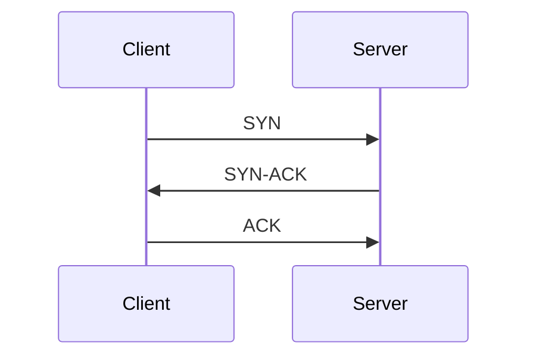
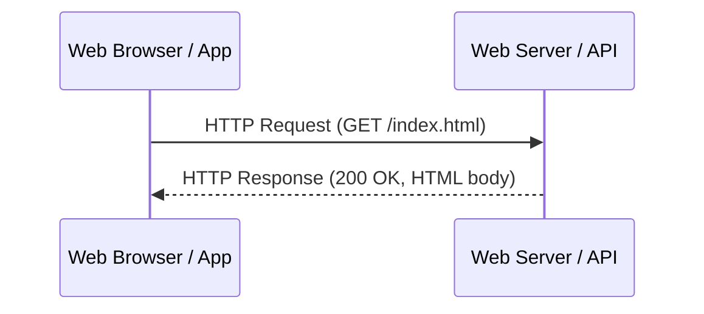
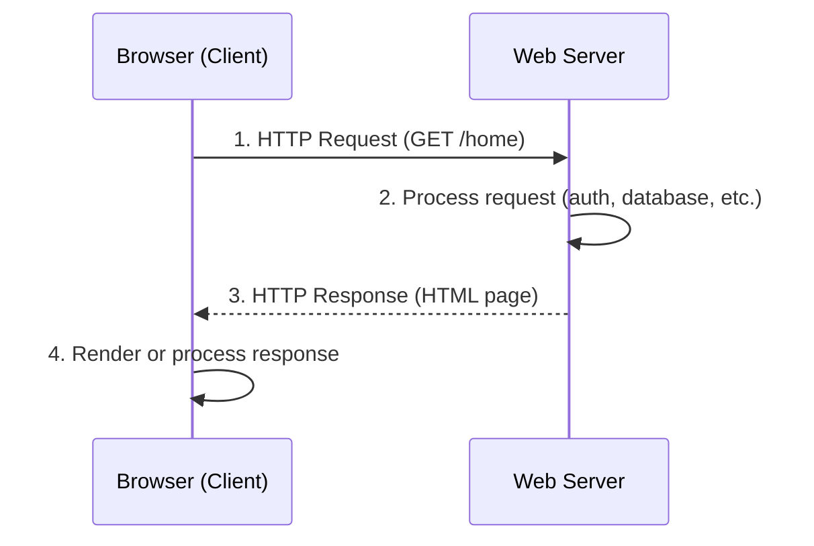
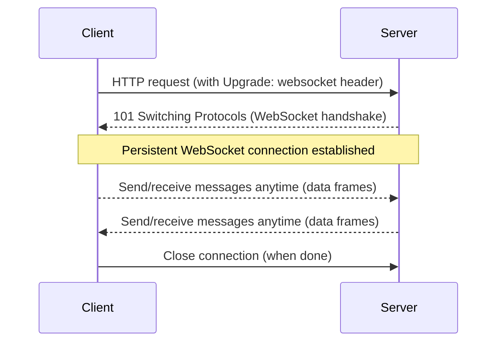
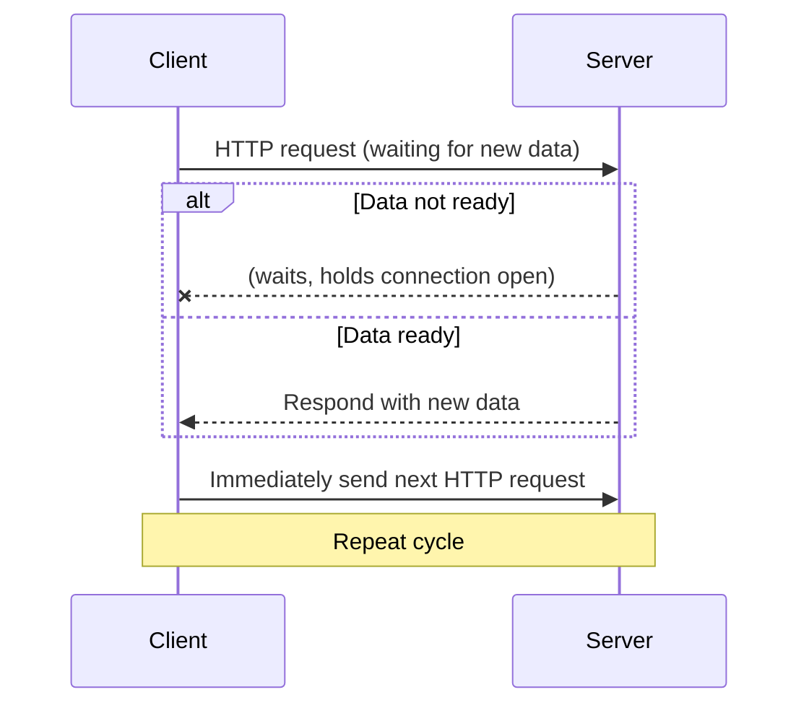

# Section 1

Certainly! Here’s a detailed **Markdown blog section** integrating the transcript and slides, enhanced with code snippets, diagrams (ASCII art), and a **Tips & Tricks** section. This blog is structured for clarity and practical learning.

---

# Mastering System Design: Section 3 – Protocols

Welcome! In this section, we'll explore the protocols that are the backbone of modern system architecture. From foundational networking (TCP/UDP) to web protocols (HTTP, REST), real-time communication (WebSockets), and modern API paradigms (gRPC, GraphQL), you’ll gain a solid understanding crucial for system design interviews and real-world engineering.

---

## Table of Contents

1. [TCP & UDP – Understanding the Basics](#tcp--udp--understanding-the-basics)
2. [HTTP – The Backbone of the Web](#http--the-backbone-of-the-web)
3. [REST & RESTfulness – API Design Principles](#rest--restfulness--api-design-principles)
4. [Real-Time Communication Protocols](#real-time-communication-protocols)
5. [Modern API Protocols – gRPC & GraphQL](#modern-api-protocols--grpc--graphql)
6. [Tips & Tricks for Protocols in System Design](#tips--tricks-for-protocols-in-system-design)
7. [Summary & Next Steps](#summary--next-steps)

---

## TCP & UDP – Understanding the Basics

**TCP (Transmission Control Protocol)** and **UDP (User Datagram Protocol)** are the foundational transport protocols of the Internet.

| Feature           | TCP                          | UDP                      |
|-------------------|------------------------------|--------------------------|
| Connection        | Connection-oriented          | Connectionless           |
| Reliability       | Reliable (guaranteed order)  | Unreliable (no order)    |
| Speed             | Slower (overhead)            | Faster (minimal checks)  |
| Use Cases         | Web, Email, File Transfer    | Video, Gaming, VoIP      |

### How TCP Works



> **Three-Way Handshake:** Establishes a reliable connection before data transfer.

### When to Use?

- **TCP:** Web browsing (HTTP/HTTPS), file transfer (FTP/SFTP), email (SMTP/IMAP), database connections.
- **UDP:** Video streaming, online gaming, VoIP, DNS lookups.

### Sample UDP & TCP Code (Python)

**TCP Client Example**
```python
import socket

client = socket.socket(socket.AF_INET, socket.SOCK_STREAM)
client.connect(('example.com', 80))
client.send(b'GET / HTTP/1.1\r\nHost: example.com\r\n\r\n')
print(client.recv(4096))
client.close()
```

**UDP Client Example**
```python
import socket

client = socket.socket(socket.AF_INET, socket.SOCK_DGRAM)
client.sendto(b'Ping', ('example.com', 12345))
data, addr = client.recvfrom(1024)
print('Received from', addr, ':', data)
client.close()
```

---

## HTTP – The Backbone of the Web

**HTTP (HyperText Transfer Protocol)** is the foundation of data communication for the World Wide Web.

### HTTP Request-Response Cycle

```ascii
Client (Browser) ---> [HTTP Request] ---> Server (Web Server)
Client (Browser) <--- [HTTP Response] <--- Server (Web Server)
```

- **Request**: Method (GET/POST), URL, Headers, Body (optional)
- **Response**: Status Code (200, 404, 500), Headers, Body

### Example HTTP Request

```http
GET /api/users/123 HTTP/1.1
Host: example.com
Accept: application/json
```

### HTTP Methods

| Method   | Use Case                        |
|----------|---------------------------------|
| GET      | Retrieve data                   |
| POST     | Create new resource             |
| PUT      | Update existing resource        |
| PATCH    | Partial update                  |
| DELETE   | Remove resource                 |

### HTTP Status Codes

- **2xx**: Success (200 OK, 201 Created)
- **3xx**: Redirection (301 Moved Permanently)
- **4xx**: Client Error (404 Not Found, 400 Bad Request)
- **5xx**: Server Error (500 Internal Server Error)

### HTTPS

- **HTTPS** is HTTP over SSL/TLS (secure).
- Port 443 instead of 80.
- Used for secure web traffic, authentication, and encryption.

---

## REST & RESTfulness – API Design Principles

**REST (Representational State Transfer)** is an architectural style for designing networked APIs using HTTP.

### REST Constraints

- **Client-Server:** Separation of concerns
- **Stateless:** No client context stored on the server
- **Cacheable:** Responses can be cached
- **Layered System:** Intermediaries possible (proxies, gateways)
- **Uniform Interface:** Standard method usage and resource representation

### RESTful Endpoints

```http
GET    /users/123       # Retrieve user with ID 123
POST   /orders          # Create a new order
PUT    /products/99     # Update product with ID 99
DELETE /products/99     # Delete product with ID 99
```

**Best Practices:**

- Use plural nouns: `/users`, `/orders`
- Avoid verbs in URLs: `POST /users` (not `/createUser`)
- Version your API: `/v1/users`

### Sample REST API using Express.js

```javascript
const express = require('express');
const app = express();

app.get('/users/:id', (req, res) => {
  // Fetch user logic here
  res.json({ id: req.params.id, name: "Alice" });
});

app.post('/orders', (req, res) => {
  // Create order logic here
  res.status(201).json({ message: "Order created!" });
});

app.listen(3000, () => console.log('API running on port 3000'));
```

### JSON vs. XML

- **JSON:** Lightweight, faster, more readable, default for REST APIs.
- **XML:** Used in legacy systems or when strict schema validation is required.

---

## Real-Time Communication Protocols

### Why Not Just HTTP?

- HTTP is stateless and request-response based—inefficient for real-time needs (chat, gaming, live data).

### WebSockets

**WebSockets** enable persistent, full-duplex connections over a single TCP connection.

```ascii
Client      Server
  |  -----> [HTTP Upgrade to WebSocket]
  | <-----  [101 Switching Protocols]
  | <---->  [Bidirectional Data Frames]
```

**Use Cases:** Chat apps, online gaming, stock tickers, collaborative editing.

#### WebSocket Example (Node.js)

```javascript
const WebSocket = require('ws');
const server = new WebSocket.Server({ port: 8080 });

server.on('connection', ws => {
  ws.send('Welcome!');
  ws.on('message', msg => {
    console.log('Received:', msg);
  });
});
```

### Long Polling

- Client sends HTTP request; server holds it until data is available, then responds.
- Simulates real-time behavior when WebSockets aren’t available.

```ascii
[Client] --HTTP Request--> [Server] --waits for new data--> [Responds]
[Client] <--HTTP Response-- [Server]
[Client] --immediately sends next request-->
```

**When to use:** Environments where WebSockets are unsupported, or for simple notifications.

---

## Modern API Protocols – gRPC & GraphQL

### Limitations of REST

- Over-fetching/under-fetching data
- Multiple round-trips for complex relationships
- Not optimized for real-time or microservice communication

### gRPC

- **gRPC** uses Protocol Buffers (binary) and HTTP/2.
- Faster, supports streaming, best for microservices, polyglot (multi-language) environments.

#### Sample gRPC Service Definition (`.proto`)
```proto
syntax = "proto3";
service UserService {
  rpc GetUser (UserRequest) returns (UserResponse);
}
message UserRequest {
  int32 id = 1;
}
message UserResponse {
  int32 id = 1;
  string name = 2;
}
```

### GraphQL

- Query language for APIs—client specifies exactly what they want.
- Single endpoint, flexible, reduces over-fetching.

#### Sample GraphQL Query

```graphql
query {
  user(id: 123) {
    id
    name
    email
  }
}
```

**Use Cases:**
- gRPC: High-performance microservices, real-time streaming.
- GraphQL: Mobile/web apps needing efficient, tailored data fetching.

---

## Tips & Tricks for Protocols in System Design

- **Always justify your protocol choice** based on use-case (speed vs. reliability, flexibility vs. performance).
- **For real-time needs:** Prefer WebSockets or gRPC streaming over polling.
- **Design RESTful APIs** using plural nouns, proper HTTP methods, and versioning.
- **Implement security:** Use HTTPS, JWT for auth, and validate inputs to prevent common attacks.
- **Optimize for scale:** Use caching (HTTP headers, CDN), pagination, and rate limiting.
- **Know trade-offs:** gRPC is fast but less browser-friendly; GraphQL is flexible but can be complex to secure and cache.
- **Prepare for interviews:** Be ready to compare protocols, discuss trade-offs, and design APIs for real-world scenarios.

---

## Summary & Next Steps

In this section, you learned:

- The differences and use-cases for **TCP** and **UDP**
- How **HTTP** underpins web communication, with methods, status codes, and statelessness
- **RESTful API** design: endpoints, best practices, and pitfalls
- Real-time communication with **WebSockets** and **long polling**
- Modern API paradigms with **gRPC** and **GraphQL**

**Up Next:** We dive into architectural patterns—how these protocols connect components in scalable, robust systems!

---

_Stay tuned for practical demos and system design scenarios using these protocols!_

---

**Have questions or want to see more code samples? Comment below!**

# Section 2

Certainly! Here’s a detailed Markdown blog section that integrates the provided transcript and slides, includes code snippets, diagrams (as Markdown text diagrams), and features a **Tips and Tricks** section.

---

# 🚀 Mastering System Design Protocols: TCP, UDP, HTTP, REST, Real-Time & Modern APIs

## Section Overview

System design isn’t just about data stores and scaling; at its core, it’s about **communication**—how data moves across networks reliably, efficiently, and in real-time. In this section, we’ll break down the protocols that make this possible: **TCP, UDP, HTTP, REST, WebSockets, gRPC, and GraphQL**.

---

## 1. TCP & UDP – The Networking Foundations

### TCP (Transmission Control Protocol)

- **Connection-oriented**: Requires a connection handshake before data transfer.
- **Reliable & Ordered**: Guarantees delivery and correct ordering.
- **Use Cases**: Web browsing (HTTP/HTTPS), file transfer (FTP/SFTP), email (SMTP/IMAP/POP3).

#### 📈 TCP Three-Way Handshake

```plaintext
Client                Server
  |     SYN (1)         |
  |-------------------->|
  |                     |
  |    SYN-ACK (2)      |
  |<--------------------|
  |                     |
  |     ACK (3)         |
  |-------------------->|
  |                     |
Data can now flow reliably!
```

#### 📦 TCP in Python

```python
import socket

# TCP Client Example
client = socket.socket(socket.AF_INET, socket.SOCK_STREAM)
client.connect(('example.com', 80))
client.send(b'GET / HTTP/1.1\r\nHost: example.com\r\n\r\n')
response = client.recv(4096)
print(response.decode())
client.close()
```

---

### UDP (User Datagram Protocol)

- **Connectionless**: No handshake; just fire-and-forget.
- **Fast, but Unreliable**: No guarantee of delivery or order.
- **Use Cases**: Online gaming, video streaming, VoIP, DNS lookups.

#### 📦 UDP in Python

```python
import socket

# UDP Client Example
client = socket.socket(socket.AF_INET, socket.SOCK_DGRAM)
client.sendto(b'Ping', ('example.com', 12345))
data, addr = client.recvfrom(4096)
print(data.decode())
client.close()
```

---

### 🔍 TCP vs UDP: Side-by-Side

| Feature     | TCP                        | UDP                       |
|-------------|----------------------------|---------------------------|
| Reliability | Yes (ack, retransmit)      | No                        |
| Order       | Yes                        | No                        |
| Connection  | Connection-oriented        | Connectionless            |
| Speed       | Slower (overhead)          | Faster (minimal overhead) |
| Use Cases   | HTTP, FTP, email           | Gaming, VoIP, DNS         |

---

## 2. HTTP – The Backbone of the Web

### What is HTTP?

- Protocol for transferring web resources.
- **Stateless**: Each request is independent.
- **Works over TCP** (ports 80/443).

### HTTP Request/Response Cycle

```plaintext
Browser        Web Server
   |---GET--->|
   |<--200 OK-|
   | Rendered |
```

#### HTTP Request Example (cURL)

```bash
curl -X GET "https://api.example.com/users/1" -H "Accept: application/json"
```

#### HTTP Response Example

```http
HTTP/1.1 200 OK
Content-Type: application/json

{
  "id": 1,
  "name": "Alice"
}
```

---

### Common HTTP Methods

| Method  | Purpose             |
|---------|---------------------|
| GET     | Retrieve resource   |
| POST    | Create resource     |
| PUT     | Update resource     |
| PATCH   | Partial update      |
| DELETE  | Remove resource     |

---

## 3. REST & RESTful API Design

### What is REST?

- **Representational State Transfer**: Architectural style for scalable APIs.
- **Stateless**, uses standard HTTP methods.
- **Resource-based**: Everything is a resource (users, orders, etc.).

#### REST Endpoint Example

```
GET /users/123
POST /orders
PATCH /products/42
```

#### RESTful API in Express.js

```javascript
const express = require('express');
const app = express();

app.get('/users/:id', (req, res) => {
  // Fetch user logic
  res.json({ id: req.params.id, name: 'Alice' });
});

app.listen(3000);
```

---

### Best Practices

- Use **plural nouns** for collections: `/users`, `/orders`
- **Avoid verbs** in endpoints: `/createUser` ❌, `POST /users` ✅
- Implement **versioning**: `/v1/users`
- Use **proper status codes**: 200 (OK), 201 (Created), 404 (Not Found), 500 (Error)

---

## 4. Real-Time Communication: WebSockets & Long Polling

### WebSockets

- **Persistent, full-duplex** communication over a single TCP connection
- **Low latency**: Ideal for chat, gaming, collaborative tools

#### WebSocket Handshake (Simplified)

```plaintext
Client:  GET /chat HTTP/1.1
         Upgrade: websocket
         Connection: Upgrade

Server:  HTTP/1.1 101 Switching Protocols
         Upgrade: websocket
         Connection: Upgrade
```

#### WebSocket Example (JavaScript)

```javascript
const ws = new WebSocket('wss://example.com/socket');
ws.onmessage = (event) => {
  console.log('Received:', event.data);
};
ws.send('Hello Server!');
```

---

### Long Polling

- **Simulates real-time** updates via repeated HTTP requests.
- Useful when WebSockets are unavailable.

#### Long Polling Diagram

```plaintext
Client      Server
  |---Request--->| (Waits)
  |<--Response---|
  |---Request--->| (Waits)
  |<--Response---|
```

---

### When to Use

| Scenario                          | Use             |
|------------------------------------|-----------------|
| High-frequency, bidirectional data | WebSockets      |
| Simple, infrequent notifications   | Long Polling    |

---

## 5. Modern API Protocols: gRPC & GraphQL

### gRPC

- **High-performance, binary protocol** (uses HTTP/2 & Protocol Buffers)
- **Full-duplex streaming**: Great for microservices, real-time comms

#### gRPC Example (Protobuf Definition)

```proto
syntax = "proto3";
service UserService {
  rpc GetUser (UserRequest) returns (UserResponse);
}
message UserRequest {
  string id = 1;
}
message UserResponse {
  string id = 1;
  string name = 2;
}
```

---

### GraphQL

- **Flexible query language**: Clients fetch exactly what they need
- **Single endpoint**: Reduces over-fetching/under-fetching

#### GraphQL Query Example

```graphql
query {
  user(id: "123") {
    name
    email
    orders {
      id
      total
    }
  }
}
```

---

## 🎯 Tips and Tricks

- **TCP vs UDP**: Use TCP for reliability (e.g., files, financial data); use UDP for speed (real-time gaming, streaming).
- **HTTP is Stateless**: Use cookies, sessions, or tokens to manage user state.
- **REST Best Practice**: Keep endpoints resource-oriented, use correct HTTP verbs, and always respond with meaningful status codes.
- **WebSockets**: Prefer for interactive apps (chat, games); ensure infrastructure supports persistent connections.
- **gRPC**: Go-to for internal microservices (fast, type-safe); less suited for public APIs due to binary format.
- **GraphQL**: Powerful for frontend teams, but requires careful schema design and security review.
- **Security**: Always use HTTPS for sensitive data. Protect APIs with authentication & authorization.
- **Versioning**: Plan API versioning from day one to support backward compatibility.

---

## 📚 Quick Reference Table

| Protocol     | Type            | Reliability | Speed   | Use Cases                             |
|--------------|-----------------|------------|---------|---------------------------------------|
| TCP          | Connection      | High       | Medium  | HTTP, FTP, Email                      |
| UDP          | Connectionless  | Low        | High    | Gaming, Streaming, DNS                |
| HTTP         | Application     | Medium     | Medium  | Web pages, APIs                       |
| WebSockets   | Real-time TCP   | High       | High    | Chat, Gaming, Live Data               |
| REST         | API Design      | N/A        | N/A     | Any web/mobile API                    |
| gRPC         | API Protocol    | High       | High    | Microservices, IoT, Streaming         |
| GraphQL      | Query Language  | N/A        | High    | Frontend APIs, Mobile/Web             |

---

## 📝 Key Takeaways

- **Trade-off** between speed and reliability is central to protocol choice.
- Choose **TCP** when data integrity matters, **UDP** when speed is critical.
- **HTTP** is the basis of web, but modern needs often demand **WebSockets, gRPC, or GraphQL**.
- **REST** brings structure and best practices to API design.
- **Practical, real-world scenarios** will often require combining multiple protocols and patterns.

---

> **Next Up:** Dive into architectural patterns and discover how to connect the protocol knowledge here with scalable, robust system architectures!

---

# Section 3

Certainly! Here's a detailed, interview-focused blog section on **HTTP: The Backbone of the Web** that integrates both your transcript and slides, with diagrams, code snippets, and actionable tips.

---

# HTTP: The Backbone of the Web

HTTP (HyperText Transfer Protocol) is the **foundation of data communication on the web**, powering everything from loading web pages to making API calls and streaming content. Whether you're building a small website or designing a massive distributed system, a solid grasp of HTTP is essential for scalable, robust, and secure applications.

---

## What is HTTP?

- **Stands for:** HyperText Transfer Protocol  
- **Role:** Defines how clients (browsers, apps) and servers communicate over the web  
- **Layer:** Application Layer protocol, works over TCP (port 80 for HTTP, port 443 for HTTPS)  
- **Key Features:**  
  - Text-based (human readable)
  - Stateless (each request is independent)
  - Supports multiple methods (GET, POST, PUT, etc.)

---

## The Client-Server Model

HTTP follows a **client-server architecture**:



- **Client:** Initiates requests (e.g., browser, mobile app)
- **Server:** Processes requests, sends responses (web server, API, etc.)

---

## Anatomy of an HTTP Request

```http
GET /api/users/123 HTTP/1.1
Host: example.com
User-Agent: Mozilla/5.0
Accept: application/json
Authorization: Bearer <token>

[Optional Body: Only in POST/PUT/PATCH]
```

| Component | Purpose                                              |
|-----------|------------------------------------------------------|
| Method    | Action to perform (GET, POST, PUT, DELETE, PATCH)    |
| URL       | Resource identifier (/api/users/123)                 |
| Headers   | Metadata (auth, content-type, cookies, etc.)         |
| Body      | Data to send (only for POST/PUT/PATCH)               |

---

## Anatomy of an HTTP Response

```http
HTTP/1.1 200 OK
Content-Type: application/json
Set-Cookie: session=abc123; HttpOnly

{
  "id": 123,
  "name": "Jane Doe"
}
```

| Component    | Purpose                                            |
|--------------|----------------------------------------------------|
| Status Code  | Numeric code (200, 404, 500) indicating outcome    |
| Headers      | Metadata (content-type, cache-control, etc.)       |
| Body         | The actual content (HTML, JSON, image, etc.)       |

---

## The HTTP Request-Response Cycle



**Steps:**
1. **Request:** Client sends an HTTP request.
2. **Processing:** Server authenticates, fetches data, generates response.
3. **Response:** Server returns status, headers, and body.
4. **Render:** Client renders web page or processes data.

---

## Statelessness in HTTP

**Definition:**  
Each HTTP request is independent. The server does **not retain memory** of previous requests.

**Implications:**
- **Pros:** Simpler server design, easier to scale.
- **Cons:** Harder to maintain user sessions (e.g., login state).

### How do we handle state in stateless HTTP?
- **Cookies:** Small data stored in browser, sent with each request.
- **Sessions:** Server stores state; client holds session ID (usually via cookie).
- **Tokens (JWT, OAuth):** Auth data sent with each request.

---

## HTTP Methods Explained

| Method  | Use Case                      | Idempotent? | Safe?           |
|---------|-------------------------------|-------------|-----------------|
| GET     | Retrieve resource              | Yes         | Yes             |
| POST    | Create new resource            | No          | No              |
| PUT     | Replace/update resource        | Yes         | No              |
| PATCH   | Partial update                 | Not always  | No              |
| DELETE  | Remove resource                | Yes         | No              |

#### Example: RESTful API Endpoints

```http
GET    /users/123        # Fetch user details
POST   /users            # Create a new user
PUT    /users/123        # Replace user data
PATCH  /users/123        # Update some user fields
DELETE /users/123        # Remove user
```

---

## HTTP Status Codes Overview

| Code Range | Meaning               | Example Codes         |
|------------|-----------------------|----------------------|
| 1xx        | Informational         | 100 Continue         |
| 2xx        | Success               | 200 OK, 201 Created  |
| 3xx        | Redirection           | 301 Moved, 304 Not Modified |
| 4xx        | Client Error          | 400 Bad Request, 401 Unauthorized, 404 Not Found |
| 5xx        | Server Error          | 500 Internal Server Error, 503 Service Unavailable |

**Common Codes:**
- **200 OK:** Success
- **201 Created:** Resource created
- **400 Bad Request:** Invalid input
- **401 Unauthorized:** Auth required
- **403 Forbidden:** No permission
- **404 Not Found:** Resource missing
- **500 Internal Server Error:** Server crashed

---

## What About HTTPS?

- **HTTPS = Secure HTTP.**
- Adds encryption using SSL/TLS.
- **Port:** 443 (vs 80 for HTTP)
- **Provides:**  
  - **Confidentiality** (encrypted data)
  - **Integrity** (data not altered)
  - **Authentication** (server identity)

> **Tip:** Always use HTTPS for any sensitive data (login, payments, user info).

---

## Hands-On: Making HTTP Requests in Code

### Using Python (`requests` library):

```python
import requests

# GET request
response = requests.get("https://jsonplaceholder.typicode.com/users/1")
print(response.status_code)      # 200
print(response.json())           # Parsed JSON body

# POST request
payload = {"name": "Alice"}
response = requests.post("https://jsonplaceholder.typicode.com/users", json=payload)
print(response.status_code)      # 201
print(response.json())
```

### Using JavaScript (Fetch API):

```javascript
// GET request
fetch('https://jsonplaceholder.typicode.com/users/1')
  .then(res => res.json())
  .then(data => console.log(data));

// POST request
fetch('https://jsonplaceholder.typicode.com/users', {
  method: 'POST',
  headers: {'Content-Type': 'application/json'},
  body: JSON.stringify({name: 'Alice'})
})
  .then(res => res.json())
  .then(data => console.log(data));
```

---

## Tips and Tricks for HTTP in System Design

- **Always use HTTPS** for public-facing or sensitive applications.
- **Cache smartly:** Use headers like `Cache-Control` and `ETag` to reduce server load.
- **Choose the right method:** Respect REST conventions—use GET for reads, POST for creating, PUT/PATCH for updates, DELETE for removals.
- **Handle errors gracefully:** Always check and handle status codes.
- **Paginate large results:** Use query params (`?page=2&limit=20`) for scalable APIs.
- **Minimize data:** Only send/receive what’s necessary—optimize payloads for faster responses.
- **Prefer idempotent methods** (GET, PUT, DELETE) where possible for safety and retry logic.
- **Set appropriate timeouts** in clients and servers to avoid hanging.
- **Rate limit and throttle** APIs to protect against abuse.
- **Leverage cookies, sessions, or tokens** appropriately for session management.
- **Understand CORS:** Cross-Origin Resource Sharing controls which domains can access your API.
- **Log requests and responses** for debugging and security audits.

---

## Common Interview Questions

- What is HTTP and how does it work?
- Why is HTTP considered stateless? How do you manage state?
- Explain the HTTP request-response cycle.
- When should you use PUT vs PATCH?
- List and explain key HTTP status codes.
- What’s the difference between HTTP and HTTPS?
- How do cookies, sessions, and tokens differ?
- How does caching work in HTTP?
- What security issues exist in HTTP, and how are they mitigated?

---

## Conclusion

HTTP is the **backbone of the modern web**. Mastering its fundamentals—methods, status codes, statelessness, and security—is crucial for designing scalable, secure, and maintainable systems. As you move forward into REST, GraphQL, gRPC, and beyond, a strong HTTP foundation will serve you in every aspect of system design.

---

**Next Steps:**  
Stay tuned for our deep dive into [REST & RESTfulness – API Design Principles](#).

---

**References & Further Reading:**
- [MDN Web Docs: HTTP](https://developer.mozilla.org/en-US/docs/Web/HTTP)
- [RFC 7230: HTTP/1.1 Message Syntax and Routing](https://tools.ietf.org/html/rfc7230)

---

*Happy designing!* 🚀

---

# Section 4

Certainly! Here’s a **detailed Markdown blog section** that seamlessly integrates both your transcript and slide content, providing a comprehensive guide to REST and RESTfulness in the context of system design. This will include code snippets (in REST and JSON), diagrams (as ASCII art, since Markdown is text-based), and a practical ‘Tips and Tricks’ section.

---

# 🚀 Mastering REST & RESTfulness: API Design Principles for System Design

REST (Representational State Transfer) is the backbone of modern web APIs, powering everything from social media to cloud services. In this section, we’ll explore REST’s core principles, design best practices, real-world examples, code snippets, and crucial system design interview insights.

---

## Table of Contents

1. [What is REST?](#what-is-rest)
2. [Why REST Matters](#why-rest-matters)
3. [Core REST Constraints (Principles)](#core-rest-constraints-principles)
4. [RESTful API Design Principles](#restful-api-design-principles)
5. [Resources, Endpoints & HTTP Methods](#resources-endpoints--http-methods)
6. [JSON vs. XML in REST APIs](#json-vs-xml-in-rest-apis)
7. [Best Practices & Common Pitfalls](#best-practices--common-pitfalls)
8. [Real-World REST API Examples](#real-world-rest-api-examples)
9. [Tips and Tricks](#tips-and-tricks)
10. [Summary & Key Takeaways](#summary--key-takeaways)

---

## What is REST?

**REST** is an architectural style for designing networked applications, introduced by [Roy Fielding in 2000](https://www.ics.uci.edu/~fielding/pubs/dissertation/rest_arch_style.htm). Instead of relying on complex protocols, REST leverages standard web protocols—primarily HTTP—to enable communication between clients and servers.

**Key Features:**
- Uses standard HTTP methods (GET, POST, PUT, DELETE, etc.)
- Stateless communication (no session stored on the server)
- Resource-based (everything is a resource: users, products, orders, etc.)

---

## Why REST Matters

- **Simplicity & Scalability:** REST APIs are easy to understand and can scale horizontally, as servers don’t retain client state.
- **Interoperability:** Platform/language independent; works with web, mobile, IoT, etc.
- **Efficiency:** Supports caching, reducing latency and server load.
- **Foundation of Modern APIs:** Twitter, GitHub, Google, and many more use REST.

---

## Core REST Constraints (Principles)

RESTful systems adhere to several architectural constraints:

### 1. Client-Server Architecture
Separates frontend (client) and backend (server), allowing independent development and scaling.

### 2. Statelessness
Each request carries all the information needed; the server does not store session data.
```
Request 1: [UserID: 123, AuthToken: XYZ, Action: GET /users/123]
Request 2: [UserID: 123, AuthToken: XYZ, Action: POST /orders]
```

### 3. Cacheability
Responses can be explicitly marked as cacheable or not, improving performance for repeated requests.

### 4. Layered System
APIs can be composed of multiple layers (load balancers, proxies, security, etc.) without the client being aware.

### 5. Uniform Interface
Standardized way of interacting with resources (predictable URLs, HTTP methods).

### 6. Code on Demand (Optional)
Servers can provide executable code (like JavaScript) to the client.

---

## RESTful API Design Principles

### 1. **Resource-Based Approach**
Treat every entity (user, order, product) as a resource, accessed via unique URLs.

**Example:**
```
GET /users/123
POST /orders
DELETE /products/456
```

### 2. **Proper Use of HTTP Methods**
- **GET**: Retrieve resources
- **POST**: Create resources
- **PUT**: Update/replace resources
- **PATCH**: Partially update resources
- **DELETE**: Remove resources

### 3. **Stateless Interaction**
No session data is stored on the server; every request is self-contained.

### 4. **Consistent URL Structure**
- Use **plural nouns** for collections: `/users`, `/orders`
- Avoid verbs in URLs: **POST** `/users` (not `/createUser`)
- Implement **versioning**: `/v1/users`

---

## Resources, Endpoints & HTTP Methods

### Diagram: RESTful Resource Structure

```text
/-------------------\
|    API ROOT       |
|    /api/v1        |
\-------------------/
        |
  ---------------
  |     |     |
/users /orders /products

Examples:
GET /users/1
POST /orders
DELETE /products/42
```

### Code Snippet: Example RESTful Endpoints

#### Get a User
```http
GET /users/123 HTTP/1.1
Host: api.example.com
Accept: application/json
```
**Response:**
```json
{
  "id": 123,
  "name": "Alice",
  "email": "alice@example.com"
}
```

#### Create a New Order
```http
POST /orders HTTP/1.1
Host: api.example.com
Content-Type: application/json

{
  "product_id": 456,
  "quantity": 2
}
```
**Response:**
```http
HTTP/1.1 201 Created
Location: /orders/789
```

---

## JSON vs. XML in REST APIs

| Feature         | JSON                                 | XML                                   |
|-----------------|--------------------------------------|----------------------------------------|
| **Lightweight** | ✅ Yes                               | ❌ No (More verbose)                   |
| **Readability** | ✅ Easy for humans/machines           | ⚠️ Less readable                       |
| **Speed**       | ✅ Faster parsing (native in JS)      | ❌ Slower                              |
| **Use Cases**   | Modern APIs, web/mobile apps         | Legacy systems, strict schema needs    |

**Pro Tip:**  
Use JSON unless integrating with legacy systems or requiring strict schema validation (where XML + XSD shines).

**Content Negotiation Example:**
```http
GET /users/123
Accept: application/xml
```
Server returns XML if supported.

---

## Best Practices & Common Pitfalls

### ✅ Best Practices

- **Use Proper HTTP Status Codes:**  
  E.g., `200 OK`, `201 Created`, `400 Bad Request`, `404 Not Found`, `500 Internal Server Error`
- **Version Your APIs:**  
  `/v1/users`, `/v2/users`
- **Implement Authentication/Authorization:**  
  Use OAuth2, JWT, etc. Always use HTTPS.
- **Pagination:**  
  For large datasets: `/users?page=2&limit=50`
- **Consistent URL Structure:**  
  Plural nouns for collections, avoid verbs in URLs.

### 🚫 Common Pitfalls

- Don’t use actions in URLs (`/createUser` ❌).  
  Use HTTP verbs with resources (`POST /users` ✅).
- Don’t expose internal data structures.
- Don’t forget input validation and error handling.

---

## Real-World REST API Examples

### Twitter API

- **Fetch a Tweet:**  
  `GET /tweets/{id}`
- **Post a Tweet:**  
  `POST /tweets`

### GitHub API

- **Get Repo Details:**  
  `GET /repos/{owner}/{repo}`
- **Create an Issue:**  
  `POST /repos/{owner}/{repo}/issues`

---

## Tips and Tricks

- **Design for Scale:**  
  Statelessness enables horizontal scaling—any request can go to any server.
- **Backward Compatibility:**  
  Use versioning to avoid breaking clients.
- **Use Pagination and Filtering:**  
  Always paginate lists and allow filters to reduce response size.
- **Support Content Negotiation:**  
  Let clients specify preferred formats with the `Accept` header.
- **Secure Your API:**  
  Require authentication, limit rates, validate input, and always use HTTPS.
- **Document Your API:**  
  Use tools like Swagger/OpenAPI for clear documentation.

---

## Summary & Key Takeaways

- **REST** is a stateless, scalable, and widely adopted API design style.
- Design around **resources** and use **standard HTTP methods**.
- Choose **JSON** as the default format; use **XML** for legacy needs.
- **Best practices** (versioning, security, pagination) are crucial for real-world success.
- **Interview Ready:**  
  Be prepared to discuss REST constraints, status codes, endpoint design, and compare REST with GraphQL/gRPC.

---

### Next Up: Real-Time Communication Protocols

Ready to take your system design skills further? Up next: **Real-Time Communication Protocols** like WebSockets and Server-Sent Events!

---

**Download the full set of REST interview questions and answers [here](#).**

---

*Happy API designing! 🚀*

# Section 5

Certainly! Here’s a detailed, self-contained **Markdown blog section** on **Real-Time Communication Protocols** (WebSockets and Long Polling), integrating both the transcript and the slides, with code snippets, diagrams, and a ‘Tips and Tricks’ section.

---

# Real-Time Communication Protocols: WebSockets vs. Long Polling

In today's digital landscape, users expect instant updates—whether it’s in a chat app, live stock prices, or multiplayer gaming. Achieving this seamless, low-latency experience is only possible with the right real-time communication protocol.

This guide deep-dives into two major approaches: **WebSockets** and **Long Polling**. You'll learn how they work, where they fit, and how to implement them in your own scalable systems.

---

## 🚦 What Is Real-Time Communication?

**Real-time communication** refers to the continuous exchange of data with minimal latency. Unlike traditional HTTP (request-response), real-time systems *push* updates instantly, without waiting for the user to refresh or request new data.

**Examples:**
- Chat apps (e.g., WhatsApp, Slack)
- Live stock market dashboards
- Multiplayer online games
- Notification systems

---

## 🚫 Why Not Traditional HTTP?

Traditional HTTP is **stateless** and **client-initiated**:
- The client requests data, the server responds.
- Updates happen only when the client requests them.

**Problems:**
- High latency for updates
- Inefficient (polling creates unnecessary load)
- Not scalable for high-frequency, real-time needs

---

## 🧰 Approaches to Real-Time Data Exchange

| Technique        | Description                                              | Bi-directional | Overhead      | Latency     |
|------------------|---------------------------------------------------------|---------------|--------------|-------------|
| Polling          | Client repeatedly requests updates at intervals         | No            | High         | High        |
| **WebSockets**   | Persistent, full-duplex TCP connection                  | Yes           | Low          | Very low    |
| Server-Sent Events (SSE) | Server pushes updates to client (unidirectional) | No            | Medium       | Low         |
| **Long Polling** | Client request held open until new data is available    | No            | Lower than polling | Medium  |

---

## 🔄 WebSockets: Persistent, Full-Duplex Communication

### **What Are WebSockets?**

WebSockets enable a persistent, bi-directional connection between client and server over a single TCP connection. This allows both parties to send/receive messages at any time.

**Analogy:** Like a phone call (continuous conversation) vs. sending letters (HTTP requests).

---

### **How WebSockets Work**



**Step-by-Step:**
1. **Handshake:** Client sends HTTP request with an `Upgrade: websocket` header.
2. **Upgrade:** Server replies with `101 Switching Protocols` if it supports WebSockets.
3. **Data Exchange:** Both client and server can send/receive messages in real time (as frames).
4. **Close:** Either party can terminate the connection.

---

### **WebSocket Example (Node.js + ws)**

```javascript
// Server (Node.js with 'ws' package)
const WebSocket = require('ws');
const wss = new WebSocket.Server({ port: 8080 });

wss.on('connection', (ws) => {
  console.log('Client connected');
  ws.on('message', (message) => {
    console.log(`Received: ${message}`);
    ws.send(`Server echo: ${message}`);
  });
});

// Client (browser)
const socket = new WebSocket('ws://localhost:8080');
socket.onopen = () => socket.send('Hello, Server!');
socket.onmessage = (event) => console.log(event.data);
```

---

### **Advantages of WebSockets**

- **Persistent connection:** No need to re-establish for every message.
- **Full-duplex:** Both sides can send/receive anytime.
- **Low latency:** Near-instant updates.
- **Efficient:** No repeated HTTP headers or handshakes.

**Use Cases:**  
Chat apps, live trading dashboards, collaborative tools (Google Docs), online gaming.

---

## ⏳ Long Polling: Simulated Real-Time over HTTP

### **What Is Long Polling?**

Long polling is a technique where the client sends an HTTP request, and the server *holds* the connection open until new data is available. Once data is sent, the client immediately re-requests, creating a loop that simulates real-time updates.

---

### **How Long Polling Works**



**Step-by-Step:**
1. Client makes an HTTP request.
2. Server holds the request open until new data is available.
3. Server responds with new data.
4. Client immediately sends another request.

---

### **Long Polling Example (Node.js + Express)**

```javascript
// Server (Node.js + Express)
const express = require('express');
const app = express();
let clients = [];

app.get('/events', (req, res) => {
  clients.push(res);
});

function sendEvent(data) {
  clients.forEach(res => res.json(data));
  clients = [];
}

// Simulate sending an event every 5 seconds
setInterval(() => sendEvent({ message: "New update!" }), 5000);

app.listen(3000, () => console.log('Long polling server on port 3000'));
```

**Client-side:**  
Use `fetch` or XMLHttpRequest to repeatedly call `/events`.

---

### **Advantages and Limitations of Long Polling**

**Pros:**
- Works with standard HTTP infrastructure (proxies, firewalls).
- No need for special protocol support.

**Cons:**
- Higher latency than WebSockets (though better than regular polling).
- Not true bi-directional; mostly server-to-client.
- Slightly more overhead due to repeated HTTP requests.

**Use Cases:**  
Notifications, social feeds, IoT devices where updates are infrequent.

---

## ⚖️ When to Use WebSockets vs. Long Polling

| Scenario                                 | WebSockets         | Long Polling      |
|-------------------------------------------|--------------------|-------------------|
| **High-frequency, bidirectional updates** | ✅ Best choice      | ❌ Not suitable    |
| **Low-latency critical (gaming, chat)**   | ✅                  | ❌                |
| **Environments without WebSocket support**| ❌                 | ✅                |
| **Periodic, low-frequency updates**       | ❌ Overkill         | ✅ Good choice     |
| **Needs to work with proxies/firewalls**  | Sometimes tricky   | ✅                |

**Real-World Examples:**
- **WebSockets:** Slack chat, Fortnite, real-time stock tickers
- **Long Polling:** Twitter notifications, IoT sensors

---

## 💡 Tips and Tricks

- **WebSockets and Load Balancers:** Not all load balancers support sticky/persistent connections. Use sticky sessions or a WebSocket-aware proxy (e.g., NGINX).
- **Handling Network Failures:** Implement reconnection logic in your client for both WebSockets and long polling.
- **Scaling WebSockets:** Use a message broker (e.g., Redis Pub/Sub) to coordinate state across multiple backend servers.
- **Fallback Strategies:** If WebSockets fail (e.g., on older browsers or restrictive corporate networks), automatically fall back to long polling.
- **Security:** Always use Secure WebSockets (`wss://`) in production to encrypt data in transit.
- **Resource Cleanup:** For long polling, ensure you properly close connections on timeouts or client disconnects to avoid resource leaks.

---

## 📌 Summary

- **WebSockets** are ideal for real-time, high-frequency, bidirectional communication—think chat, games, collaborative editing.
- **Long polling** is a practical fallback when WebSockets aren’t available, and works well for periodic or infrequent updates.
- **Choosing the right protocol** depends on your application's latency, infrastructure, and compatibility needs.

By mastering these real-time communication approaches, you’ll be equipped to design scalable, responsive, and efficient systems that keep users engaged.

---

**Next Up:** In the next section, we explore modern API protocols beyond REST—like **gRPC** and **GraphQL**—for even more powerful, flexible communication in distributed systems.

---

**References**
- [MDN WebSockets](https://developer.mozilla.org/en-US/docs/Web/API/WebSockets_API)
- [Node.js WebSocket Example](https://www.npmjs.com/package/ws)
- [Express Long Polling Tutorial](https://expressjs.com/)

---

*Happy coding, and may your data flow in real time!* 🚀

---

# Section 6

Certainly! Here’s a detailed, integrated **Markdown blog section** on **Modern API Protocols: Beyond REST (gRPC & GraphQL)**, synthesizing the transcript and slides, with code snippets, diagrams (ASCII for Markdown), and a “Tips and Tricks” section.

---

# Modern API Protocols: Beyond REST (gRPC & GraphQL)

Modern applications demand more than the classic REST API paradigm. As system complexity, data needs, and performance requirements have grown, protocols like **gRPC** and **GraphQL** have emerged to address REST's shortcomings. In this section, we’ll explore why, how, and when to use each—complete with diagrams, code snippets, and actionable tips!

---

## Why Go Beyond REST?

REST has been the backbone of web APIs due to its simplicity and wide adoption, but it comes with challenges:

- **Over-fetching/Under-fetching**: Clients often get too much or too little data, leading to inefficiency.
- **High Latency**: Multiple requests are often needed to assemble related data.
- **Real-time Limitations**: REST is not optimized for real-time, relying on polling for updates.

**Modern Solution:** Enter **gRPC** and **GraphQL**, each addressing these issues in unique ways.

---

## gRPC: High-Performance, Binary Protocol

### What is gRPC?

**gRPC** is a high-performance, open-source RPC (Remote Procedure Call) framework. It uses **Protocol Buffers (protobuf)** for serialization and is built atop **HTTP/2**, enabling multiplexed, bi-directional streaming.

### How Does gRPC Work?

```ascii
Client                      Server
  |         HTTP/2           |
  |------------------------->|
  |       (Request)          |
  |<-------------------------|
  |       (Response)         |
  |<=======================> |
  |   (Full-duplex Stream)   |
```

- **Multiplexing**: Multiple requests over one connection.
- **Compression**: Smaller payloads via protobuf (binary format).
- **Full-duplex Streaming**: Both client and server can send/receive data in real-time.

### gRPC Service Definition Example

**Defining a Service in Protobuf (`user.proto`):**

```proto
syntax = "proto3";

service UserService {
  rpc GetUser (UserRequest) returns (UserResponse);
  rpc StreamUserActivity (ActivityRequest) returns (stream ActivityEvent);
}

message UserRequest {
  string user_id = 1;
}

message UserResponse {
  string name = 1;
  string email = 2;
}

message ActivityRequest {
  string user_id = 1;
}

message ActivityEvent {
  string activity = 1;
  int64 timestamp = 2;
}
```

**Server-side Implementation (Python Example):**

```python
import grpc
from concurrent import futures
import user_pb2
import user_pb2_grpc

class UserService(user_pb2_grpc.UserServiceServicer):
    def GetUser(self, request, context):
        # Fetch user logic
        return user_pb2.UserResponse(name="Alice", email="alice@example.com")

    def StreamUserActivity(self, request, context):
        # Streaming logic
        for activity in fetch_activities(request.user_id):
            yield user_pb2.ActivityEvent(activity=activity, timestamp=int(time.time()))

server = grpc.server(futures.ThreadPoolExecutor(max_workers=10))
user_pb2_grpc.add_UserServiceServicer_to_server(UserService(), server)
server.add_insecure_port('[::]:50051')
server.start()
```

### When to Use gRPC?

- **Microservices communication**: Fast, efficient, polyglot (multi-language).
- **Real-time streaming**: Financial trading, analytics, video streaming.
- **IoT**: Efficient for low-bandwidth, binary data transfer.
- **Multi-language ecosystems**: Auto-generates client/server code for Go, Java, Python, etc.

> **Not for:** Public APIs requiring easy debugging, browser-based clients (gRPC-Web is needed, but still limited compared to REST/GraphQL).

---

## GraphQL: Flexible Data Fetching

### What is GraphQL?

**GraphQL** is a query language and runtime for APIs, allowing clients to request exactly the data they need—nothing more, nothing less.

### How Does GraphQL Work?

```ascii
Client            GraphQL Server            Data Sources
  |                  |                         |
  |--Query---------> |                         |
  |                  |--Fetch data as needed-->| (DBs, APIs)
  |                  |<----------------------- |
  |<--Response------ |                         |
```

- **Single Endpoint**: Clients query exactly what they need.
- **Schema Defined**: Types and relationships specified up front.
- **Resolves Fields Dynamically**: Server assembles custom responses per query.

### GraphQL Query Example

**Sample Query:**

```graphql
query {
  user(id: "123") {
    name
    email
    transactions(last: 5) {
      amount
      date
    }
  }
}
```

**Sample Response:**

```json
{
  "data": {
    "user": {
      "name": "Alice",
      "email": "alice@example.com",
      "transactions": [
        { "amount": 100, "date": "2024-06-10" },
        { "amount": 50, "date": "2024-06-09" }
      ]
    }
  }
}
```

### Schema Example

```graphql
type User {
  id: ID!
  name: String!
  email: String!
  transactions(last: Int): [Transaction]
}

type Transaction {
  amount: Float!
  date: String!
}

type Query {
  user(id: ID!): User
}
```

**Resolver Example (Node.js Apollo Server):**

```js
const resolvers = {
  Query: {
    user: (parent, args, context) => fetchUserById(args.id)
  },
  User: {
    transactions: (user, args) => fetchRecentTransactions(user.id, args.last)
  }
};
```

### When to Use GraphQL?

- **Frontend optimization**: Mobile/web clients fetch just what’s needed.
- **Reducing API requests**: Replace many REST calls with one query.
- **Aggregating data**: Unify multiple databases/services in a single API.
- **Slow/unstable networks**: Smaller, client-tailored payloads.

> **Not for:** Simple CRUD, where REST is sufficient; complex authorization rules can also be harder.

---

## gRPC vs. GraphQL vs. REST: Quick Comparison Table

| Feature               | gRPC            | GraphQL             | REST                |
|-----------------------|-----------------|---------------------|---------------------|
| Protocol              | HTTP/2, binary  | HTTP, JSON          | HTTP, JSON/XML      |
| Data Format           | Protobuf        | JSON                | JSON/XML            |
| Flexibility           | Rigid (contract)| Highly flexible     | Rigid (resources)   |
| Streaming             | Yes (full-duplex)| Subscription (partial)| No (polling needed)|
| Best For              | Microservices, real-time | Frontend, data aggregation | Simplicity, public APIs |
| Browser Support       | Limited         | Excellent           | Excellent           |
| Language Support      | Polyglot        | Polyglot            | Polyglot            |
| Over/Under-fetching   | No              | No                  | Yes                 |

---

## Diagrams

### REST vs GraphQL vs gRPC Data Fetching

```ascii
REST (Multiple Endpoints)
-------------------------
Client
  |
  |--GET /user/123---------------------------->|
  |<--{id, name, email, ...}-------------------|
  |
  |--GET /user/123/transactions--------------->|
  |<--[{amount, date, ...}, ...]--------------|

GraphQL (Single Query)
----------------------
Client
  |
  |--POST /graphql (user + transactions)------>|
  |<--{user: {name, email, transactions: [...]}}|

gRPC (Single Call, Binary)
--------------------------
Client
  |
  |--GetUser(user_id=123)--------------------->|
  |<--UserResponse(name, email, ...)----------|
```

---

## Tips and Tricks

### When to Choose Which Protocol

- **gRPC**
  - Use for **internal microservices** where speed and efficiency matter.
  - Great for **real-time streaming** and **IoT**.
  - Avoid for public-facing APIs or direct browser clients (unless using gRPC-Web).

- **GraphQL**
  - Use for **frontend-driven APIs** where clients need control over response shape.
  - Ideal for **aggregating multiple data sources**.
  - Be careful with deeply nested queries; use query complexity limits.

- **REST**
  - Use for **public APIs**, third-party integrations, or simple CRUD.
  - Best for **simplicity, compatibility, and easy debugging**.

### Performance & Security

- **gRPC**
  - Watch out for network proxies that may not handle HTTP/2 well.
  - Use TLS for secure communication.
- **GraphQL**
  - Implement query depth and cost analysis to prevent expensive queries (DoS risk).
  - Use authentication/authorization at resolver level.
- **REST**
  - Use pagination, caching (HTTP headers), and versioning for scalability.

### Interview-Ready Answers

- **Why gRPC over REST?**
  - "gRPC offers better performance and lower latency for service-to-service communication, thanks to binary serialization and HTTP/2 multiplexing."

- **When is GraphQL preferred?**
  - "Whenever clients need flexibility and want to avoid over-fetching/under-fetching, e.g., mobile UIs with complex data needs."

- **How do you prevent over-fetching in REST?**
  - "By introducing query parameters (fields projection) or switching to GraphQL if needs are complex."

---

## Key Takeaways

- **gRPC**: Best for high-performance, low-latency, internal service communication.
- **GraphQL**: Best for flexible, frontend-driven data fetching and aggregation.
- **REST**: Still valuable for simplicity, wide compatibility, and public APIs.
- **Choose based on system requirements**—there’s no one-size-fits-all!

---

> **Be ready to justify your choice in interviews—explain trade-offs and fit for the use case!**

---

**Next Up:** We’ll see how these protocols fit into real-world system architectures and discuss practical integration strategies.

---

**Download the attached PDF for more interview questions and deeper reference material!**

# Section 7

Certainly! Here’s a **detailed Markdown blog section** summarizing and integrating the key points from your transcript and slides. This includes **code snippets**, **ASCII diagrams**, and a **Tips & Tricks** section. You can split this into multiple posts or use as one comprehensive section in your system design blog.

---

# Mastering System Design: Protocols

## Introduction

Protocols are the backbone of all modern system design. Whether you're building a basic web app, a real-time multiplayer game, or a complex microservices architecture, understanding the right protocol for the job is essential. In this section, we'll explore the key protocols and API patterns that drive communication in distributed systems—covering the classics (TCP, UDP, HTTP), RESTful design, real-time communication, and modern API protocols like gRPC and GraphQL.

---

## 1. TCP & UDP: The Fundamentals

### What is TCP?
- **Transmission Control Protocol (TCP)** is a **connection-oriented**, reliable, and ordered protocol. It ensures that data reaches its destination correctly—ideal for applications where data integrity matters.

```plaintext
Client                  Server
   |  SYN  ------------>  |
   |  <---------  SYN+ACK |
   |  ACK  -------------> |
   |--- Data Exchange --- |
```

**Use Cases:** Web browsing, file transfers, email, database connections.

### What is UDP?
- **User Datagram Protocol (UDP)** is **connectionless** and **fast**. It offers no delivery guarantees or retransmission; some data loss is acceptable for the sake of speed.

```plaintext
Client                  Server
   |  Datagram ---------> |
   |  Datagram ---------> |
   |  Datagram ---------> |
```

**Use Cases:** Online gaming, video streaming, VoIP, DNS lookups.

### Key Differences Table

| Feature      | TCP                    | UDP                        |
|--------------|------------------------|----------------------------|
| Reliability  | Reliable (retransmits) | Unreliable (no retransmit) |
| Speed        | Slower                 | Faster                     |
| Connection   | Connection-oriented    | Connectionless             |
| Use Cases    | HTTP, Email            | Gaming, Streaming, VoIP    |

---

## 2. HTTP: The Backbone of the Web

### How HTTP Works

- **Stateless**: Each request is independent.
- **Request-Response Model**: Client sends a request, server returns a response.
- **Methods**: GET, POST, PUT, DELETE, PATCH, etc.

#### HTTP Request Example

```http
GET /users/123 HTTP/1.1
Host: api.example.com
Authorization: Bearer <token>
```

#### HTTP Response Example

```http
HTTP/1.1 200 OK
Content-Type: application/json

{
  "id": 123,
  "name": "Alice"
}
```

#### HTTP Status Codes Quick Reference
- `200 OK`: Success
- `201 Created`: Resource created
- `400 Bad Request`: Client error
- `404 Not Found`: Resource missing
- `500 Internal Server Error`: Server error

### Statelessness Diagram

```plaintext
Request 1: [Client] ---> [Server] (No memory)
Request 2: [Client] ---> [Server] (Still no memory)
```

> Use cookies, sessions, or JWT tokens to maintain user state.

---

## 3. REST & RESTfulness: API Design Principles

### What is REST?
**REST (Representational State Transfer)** is an architectural style for designing networked applications, leveraging HTTP methods and stateless communication.

#### REST Constraints
- **Client-Server** separation
- **Stateless**
- **Cacheable**
- **Layered system**
- **Uniform interface**

### RESTful API Example

```http
GET /users/42        # Retrieve user
POST /orders         # Create new order
PUT /users/42        # Update user info
PATCH /users/42      # Partial update
DELETE /orders/90    # Delete an order
```

### Resource-Oriented Endpoints

```plaintext
/users/{id}
/orders
/products/{id}
```

- **Use plural nouns for collections:** `/users`, `/orders`
- **No verbs in URLs:** `POST /users` (not `/createUser`)

### JSON vs. XML

- **JSON** is preferred for most modern APIs (lightweight, readable, fast).
- **XML** is used for legacy systems or strict validation needs.

---

## 4. Real-Time Communication Protocols

Traditional HTTP is not always suitable for real-time needs (e.g., live chat, stock updates). Here’s how to go real-time:

### Polling vs. Long Polling vs. WebSockets

#### Polling

```plaintext
[Client] --(request)--> [Server]
[Client] <--(response)-- [Server]
(repeat every X seconds)
```

- Inefficient, may miss updates.

#### Long Polling

```plaintext
[Client] ------------(request)------------> [Server]
        (waits)                             (waits for data)
[Client] <--------(response: data)---------- [Server]
[Client] ------------(new request)---------> [Server]
```

- Server holds connection until new data is available.

#### WebSockets

```plaintext
[Client] <== persistent, duplex connection ==> [Server]
(both can send data anytime)
```

- Ideal for high-frequency, low-latency bi-directional communication (e.g., games, chat).

#### ASCII Sequence Diagram: WebSocket Handshake

```plaintext
Client          Server
  |--- HTTP Upgrade --->|
  |<-- 101 Switching --->|
  |<== Data Stream ==>|   (persistent connection)
```

---

## 5. Modern API Protocols: gRPC & GraphQL

### Why Go Beyond REST?
REST can lead to over-fetching/under-fetching and inefficiency for complex or real-time data needs.

### gRPC

- **Protocol:** Binary, built on HTTP/2
- **Serialization:** Protocol Buffers (protobuf)
- **Features:** Auto-generated code, multiplexing, full-duplex streaming

#### gRPC Service Definition Example (`.proto`)

```protobuf
service UserService {
  rpc GetUser (UserRequest) returns (UserResponse);
}

message UserRequest {
  int32 id = 1;
}
message UserResponse {
  int32 id = 1;
  string name = 2;
}
```

- **Best for:** Microservices, real-time streaming, IoT

### GraphQL

- **Query Language:** Single endpoint, client specifies shape of response
- **Benefits:** Flexible, reduces multiple roundtrips

#### Example Query

```graphql
query {
  user(id: 123) {
    id
    name
    posts {
      id
      title
    }
  }
}
```

#### Example Response

```json
{
  "data": {
    "user": {
      "id": 123,
      "name": "Alice",
      "posts": [
        { "id": 1, "title": "Hello" }
      ]
    }
  }
}
```

- **Best for:** Frontend-driven APIs, mobile apps, aggregating multiple data sources

---

## Tips and Tricks

- **TCP vs. UDP:** Use TCP where data integrity matters (e.g., banking, emails). Use UDP for speed when occasional loss is tolerable (e.g., games, streaming).
- **HTTP Statelessness:** Always include authentication tokens or session identifiers in requests.
- **REST Best Practices:** Use proper HTTP methods, status codes, and nouns (not verbs) in URLs.
- **WebSockets:** Use for low-latency, bi-directional communication; ensure to handle connection drops and scaling (e.g., sticky sessions or distributed pub/sub).
- **gRPC:** Great for internal microservice communication; not ideal for public web APIs (browser support is limited).
- **GraphQL:** Avoid over-fetching/under-fetching; be mindful of query complexity and security (e.g., depth limiting).
- **Versioning:** Always version your APIs (`/v1/endpoint`) to ensure backward compatibility.
- **Security:** Use HTTPS/TLS for all sensitive communications; implement OAuth or JWT for API authentication.

---

## Conclusion

Protocols are the invisible glue connecting every part of a modern system. By mastering the strengths and trade-offs of each—TCP, UDP, HTTP, REST, WebSockets, gRPC, and GraphQL—you’ll be able to pick the right tool for any system design challenge. Next, we’ll dive into architectural patterns and discover how these protocols fit into scalable, robust system architectures.

---

**Stay tuned for the next section: Architectural Patterns—Designing for Scalability and Performance!**

