# Section 1

Certainly! Below is a detailed, **Markdown-formatted blog section** that synthesizes the transcript and slides into a cohesive, readable, and instructive article. This includes **code snippets, diagrams (using text/mermaid for Markdown)**, and a **Tips & Tricks** section. 

---

# Architectural Patterns & Styles in Modern System Design

Welcome to our deep dive into **Architectural Patterns and Styles**! Understanding architecture is fundamental for building robust, scalable, and maintainable software systems. Let’s explore the essential concepts, compare popular patterns, see practical code/diagram examples, and wrap up with actionable tips.

---

## What is Software Architecture?

At its core, **software architecture** defines the **high-level structure** of your system:  
- How components are organized  
- How they interact  
- How data flows and dependencies are managed  

### Why Does It Matter?
The architectural choices you make will directly impact:
- **Scalability**: Can the system handle more users/data?
- **Performance**: How fast does it respond under load?
- **Maintainability**: How easily can you update or fix it?

> **Key Point:** Every architectural decision shapes your system's behavior in production.

---

## Common Architectural Patterns

### 1. Monolithic Architecture

A **single, unified unit** where all components are tightly coupled.

**Pros:**
- Simple to develop and deploy
- Manageable for small apps

**Cons:**
- Hard to scale
- Difficult to maintain as codebase grows
- A single bug can crash the whole system

**Use Case:** Startups, small CRUD apps

**Diagram:**
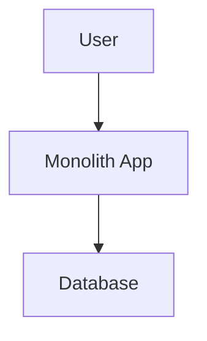

---

### 2. Layered (N-Tier) Architecture

Divides systems into **layers** (e.g., Presentation, Business Logic, Data).

**Pros:**
- Clear separation of concerns
- Easier to maintain/scale than monolithic

**Cons:**
- Potential performance overhead
- Layers may still become tightly coupled

**Use Case:** Enterprise apps, CRMs, banking

**Diagram:**
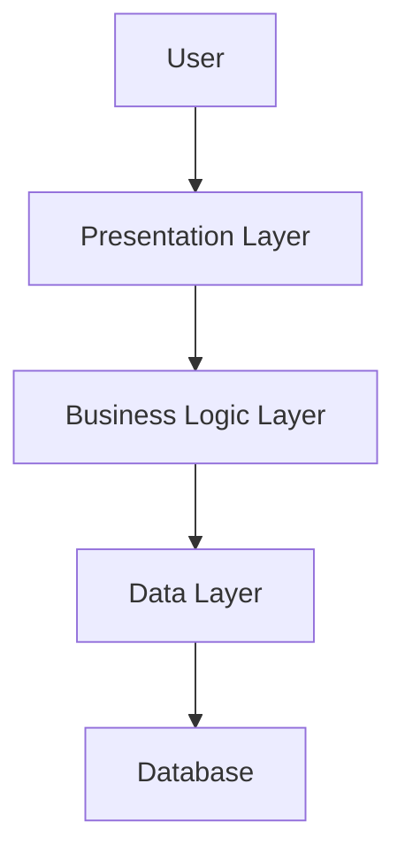

---

### 3. Microservices Architecture

**Collection of small, independent services** around business capabilities.

**Pros:**
- Independent scalability & deployment
- Fault tolerance
- Technology flexibility

**Cons:**
- Complex communication & debugging
- Needs robust DevOps/automation

**Use Case:** Large-scale apps, e-commerce, cloud-native

**Diagram:**
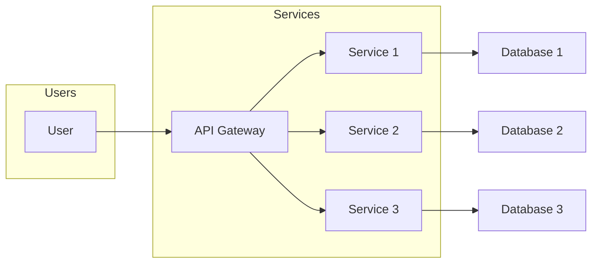

**Sample Code: Microservice (Node.js + Express)**
```js
// order-service.js
const express = require('express');
const app = express();

app.get('/orders', (req, res) => {
  res.json([{ id: 1, item: 'Apple' }]);
});

app.listen(3001, () => console.log('Order Service running'));
```

---

### 4. Event-Driven Architecture

Components **communicate via events/messages** rather than direct calls for **loose coupling** and real-time responses.

**Pros:**
- Highly decoupled
- Great for async workflows & real-time systems
- Scales well under high traffic

**Cons:**
- Debugging/tracing is harder
- Ensuring data consistency can be tough

**Use Case:** IoT, financial trading, real-time notifications

**Diagram:**
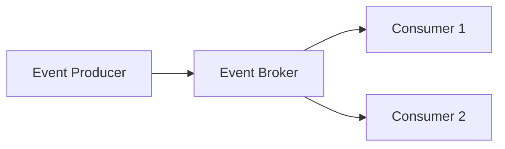

**Sample Code: Event Publishing (Node.js + Kafka)**
```js
const { Kafka } = require('kafkajs');
const kafka = new Kafka({ clientId: 'app', brokers: ['localhost:9092'] });
const producer = kafka.producer();

async function publish() {
  await producer.connect();
  await producer.send({
    topic: 'orders',
    messages: [{ value: JSON.stringify({ orderId: 42 }) }],
  });
  await producer.disconnect();
}
publish();
```

---

## Multi-Tier Architecture

**Multi-Tier** is a layered approach, often used in web/enterprise/cloud systems.

### Types

| Type      | Layers                        | Use case                        |
|-----------|------------------------------|---------------------------------|
| 2-Tier    | Client ↔ DB                   | Simple desktop apps             |
| 3-Tier    | UI ↔ Business Logic ↔ DB      | Standard web apps               |
| N-Tier    | UI ↔ API ↔ Logic ↔ Cache ↔ DB | Large-scale/cloud, microservices|

**Diagram: 3-Tier**
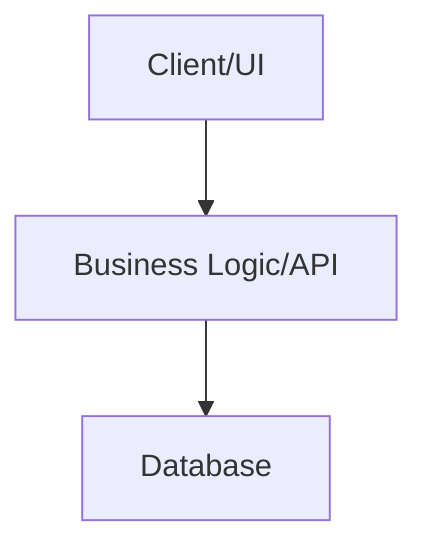

---

## Key Factors for Architecture Selection

- **Business Needs**: What problem are you solving?
- **Scalability**: Expected traffic/data growth?
- **Performance**: User response time requirements?
- **Maintainability**: How often will updates/fixes be needed?

---

## Tips & Tricks

1. **Start Simple, Scale Out**
   - Begin with monolithic or layered; refactor to microservices when growth demands.

2. **Emphasize Separation of Concerns**
   - Layered/N-tier approaches help maintain code clarity and facilitate team collaboration.

3. **Automate Everything**
   - Especially with microservices: use CI/CD, monitoring, and automated testing.

4. **Choose the Right Communication Pattern**
   - Use **REST/gRPC** for synchronous, **Kafka/RabbitMQ** for async/event-driven.

5. **Prepare for Debugging**
   - Implement distributed tracing (e.g., OpenTelemetry, Jaeger) early.

6. **Handle Failures Gracefully**
   - In event-driven designs, use **dead-letter queues** and **idempotent handlers**.

7. **Data Ownership in Microservices**
   - Each microservice should own its database. Avoid sharing schemas.

---

## Summary & Takeaways

- **Monolithic**: Simple but limited in scale.
- **Layered/N-Tier**: Standard for most businesses.
- **Microservices**: Scalability and flexibility but with added complexity.
- **Event-Driven**: Decoupling and real-time, but harder to debug.

> **Choose architecture based on business, technical, and scalability needs, not just trends.**

---

## Further Reading

- [Martin Fowler: Microservices](https://martinfowler.com/articles/microservices.html)
- [AWS Whitepapers: Modern Application Architectures](https://aws.amazon.com/architecture/)

---

**Next up:** Web Concepts in System Design 🚀

---

**Have questions or want to share your architecture experience? Drop a comment below!**

# Section 2

# Mastering System Design: Architectural Patterns & Styles

Understanding software architecture patterns is crucial for building scalable, maintainable, and high-performance systems. In this comprehensive section, we'll integrate key concepts from the transcript and slides, provide diagrams, code snippets, and practical tips for applying these patterns in real-world scenarios.

---

## Table of Contents

1. [What is Software Architecture?](#what-is-software-architecture)
2. [Common Architectural Patterns](#common-architectural-patterns)
   - [Monolithic Architecture](#monolithic-architecture)
   - [Layered (N-Tier) Architecture](#layered-n-tier-architecture)
   - [Client-Server Architecture](#client-server-architecture)
   - [Microservices Architecture](#microservices-architecture)
   - [Event-Driven Architecture](#event-driven-architecture)
3. [Factors Influencing Architecture Selection](#factors-influencing-architecture-selection)
4. [Tips and Tricks](#tips-and-tricks)
5. [Summary](#summary)

---

## What is Software Architecture?

**Definition:**  
Software architecture is the high-level structure of a software system, defining components, their relationships, and how they interact.

**Why It Matters:**  
Your architectural choices directly influence:
- **Scalability**: Ability to grow with more data/users.
- **Maintainability**: Ease of updates and bug fixes.
- **Performance**: Speed and responsiveness under load.

> _“The architecture you choose will make or break your system’s efficiency and behavior.”_

---

## Common Architectural Patterns

### 1. Monolithic Architecture

#### Overview

A **monolithic architecture** bundles all components of an application into a single, tightly-coupled unit.

#### Diagram

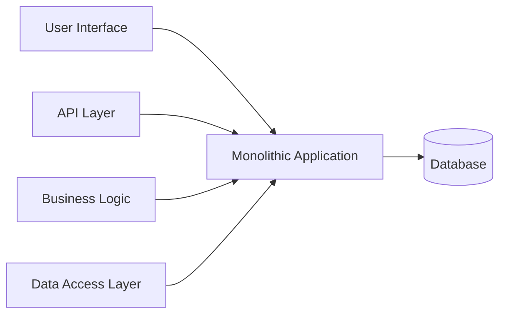

#### Example Code

```python
# Everything in one place (e.g., Flask app)
from flask import Flask, request
app = Flask(__name__)

@app.route('/user/<id>')
def get_user(id):
    # Business logic and data access mixed
    user = db.query_user(id)
    return render_template('user.html', user=user)
```

#### Pros & Cons

| Pros                                            | Cons                                                     |
|-------------------------------------------------|----------------------------------------------------------|
| Simple to develop and deploy                    | Hard to scale                                            |
| Easier management for small apps                | Difficult to maintain as codebase grows                  |
| No inter-service communication complexity       | High risk of system-wide failure due to single bug       |

#### Use Cases
- Small-scale applications
- Startups/MVPs
- Simple CRUD-based apps

---

### 2. Layered (N-Tier) Architecture

#### Overview

**Layered architecture** divides the system into layers, each with a specific responsibility, e.g., Presentation, Business Logic, Data Access.

#### Diagram

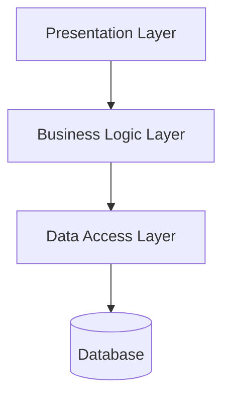

#### Example Code Structure

```plaintext
/app
  /presentation
      user_controller.py
  /business_logic
      user_service.py
  /data_access
      user_repository.py
```

#### Pros & Cons

| Pros                                      | Cons                                         |
|--------------------------------------------|----------------------------------------------|
| Clear separation of concerns               | Performance overhead due to layer traversal  |
| Easier to maintain and scale               | Layers may become tightly coupled            |

#### Use Cases
- Enterprise applications (CRM, ERP)
- Banking/financial systems
- Large web applications

---

### 3. Client-Server Architecture

#### Overview

**Client-server** divides the system into clients (requesters) and servers (responders).

#### Diagram

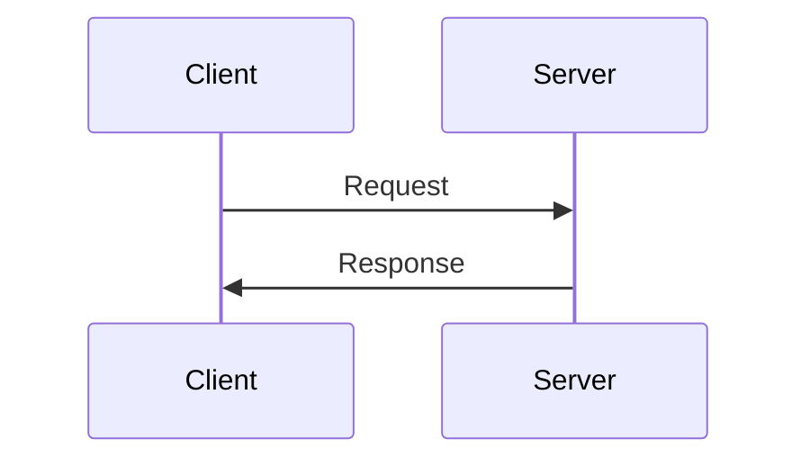

#### Example

- Web browser (client) communicates with web server (server).

#### Pros & Cons

| Pros                   | Cons                                 |
|------------------------|--------------------------------------|
| Centralized control    | Server can become a bottleneck       |
| Easier management      | Limited offline capability           |

#### Use Cases
- Web applications
- Email systems

---

### 4. Microservices Architecture

#### Overview

**Microservices** splits the application into independent services, each handling a specific business capability.

#### Diagram

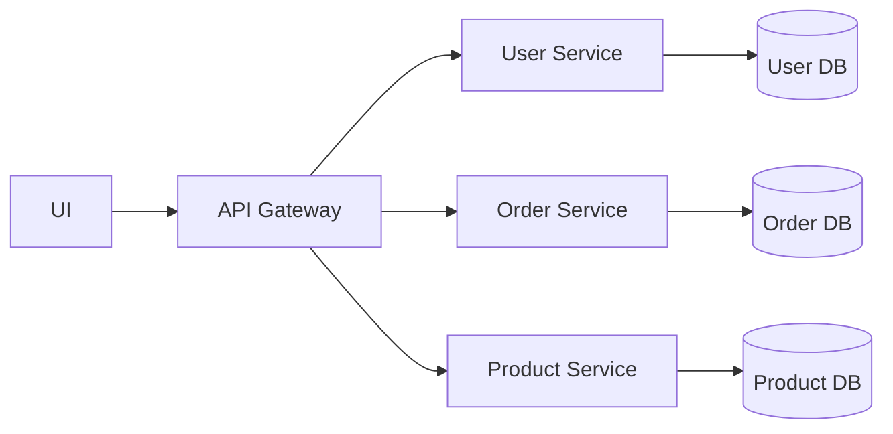

#### Example Code (Python Flask Microservice)

```python
from flask import Flask, jsonify

app = Flask(__name__)

@app.route('/users/<id>')
def get_user(id):
    # This service only knows about users
    return jsonify({'id': id, 'name': 'Alice'})

if __name__ == "__main__":
    app.run(port=5001)
```

#### Communication

- **Synchronous:** REST, gRPC
- **Asynchronous:** Message queues (Kafka, RabbitMQ)

#### Pros & Cons

| Pros                                        | Cons                                               |
|----------------------------------------------|----------------------------------------------------|
| Independent deployment/scaling               | Increased system complexity                        |
| Flexibility in technology stack              | Need for robust DevOps and monitoring              |
| Better fault isolation                       | Data consistency, distributed tracing challenges   |

#### Use Cases
- Large-scale applications
- Cloud-native apps (Netflix, Amazon, Uber)
- E-commerce platforms

---

### 5. Event-Driven Architecture

#### Overview

**Event-driven architecture** enables components to communicate via asynchronous events, decoupling producers and consumers.

#### Diagram

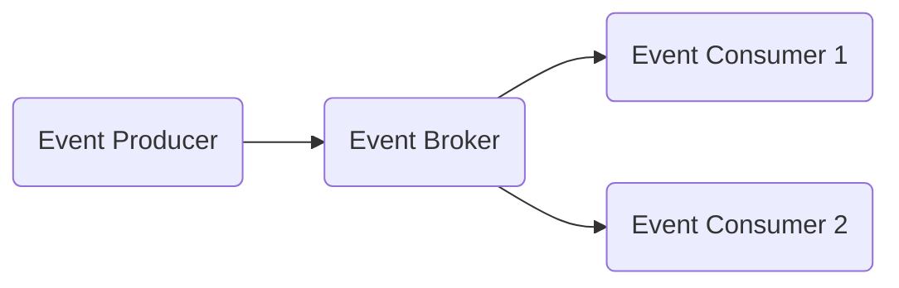

#### Example Code (Publish Event)

```python
import pika

connection = pika.BlockingConnection(pika.ConnectionParameters('localhost'))
channel = connection.channel()
channel.queue_declare(queue='events')

channel.basic_publish(exchange='', routing_key='events', body='UserRegistered')
print("Event Published")
connection.close()
```

#### Pros & Cons

| Pros                                         | Cons                                           |
|-----------------------------------------------|------------------------------------------------|
| Highly decoupled, scalable                    | Harder to debug/troubleshoot                   |
| Supports asynchronous workflows, real-time    | Eventual consistency is tricky                 |
| Flexible and resilient                        | Requires good monitoring                       |

#### Use Cases
- Real-time systems (chat, notifications)
- IoT applications
- Financial trading platforms

---

## Factors Influencing Architecture Selection

When choosing an architectural style, consider:

1. **Business Needs:** What is the system’s core purpose and requirements?
2. **Scalability:** Expected load and growth.
3. **Performance:** Latency, throughput, and responsiveness.
4. **Maintainability:** Ease of updates, fixes, and evolution.
5. **Team Skillsets:** Familiarity with distributed systems, automation, etc.
6. **Time to Market:** Speed vs. long-term scalability.

---

## Tips and Tricks

- **Start Simple:** For MVPs or small teams, begin with a monolith. Migrate to microservices only when justified by scale or domain complexity.
- **Document Boundaries:** In microservices, define clear API contracts and data ownership to avoid integration mess.
- **Automate Everything:** Use CI/CD, logging, tracing, and monitoring from day one, especially for microservices and event-driven systems.
- **Handle Failures Gracefully:** Implement retries, dead-letter queues, and idempotent processing for event-driven systems.
- **Monitor Performance:** Use tools like Prometheus, Grafana, or Datadog to track bottlenecks and system health.
- **Design for Change:** Assume requirements will change; favor modular, loosely-coupled designs.

---

## Summary

- **Monolithic:** Simple, good for small apps or prototypes; struggles at scale.
- **Layered (N-Tier):** Clear separation, maintainable; can have performance overhead.
- **Microservices:** Scalable, resilient, flexible; complex to manage.
- **Event-Driven:** Decoupled, real-time, scalable; introduces consistency and debugging challenges.
- **Client-Server:** Foundational for web/mobile; server can be a bottleneck.

> _“Choose architecture based on business needs, technical requirements, and scalability goals—not just trends.”_

---

### Next Steps

- **Deep Dive:** Multi-Tier Architecture and advanced microservices design.
- **Practice:** Try building a simple event-driven microservice using Python and RabbitMQ.
- **Interview Prep:** Review questions on architecture trade-offs, scalability, and real-world scenarios.

---

## Further Reading & Resources

- [Martin Fowler: Patterns of Enterprise Application Architecture](https://martinfowler.com/eaaCatalog/)
- [Microservices.io (Chris Richardson)](https://microservices.io/)
- [Event-Driven Architecture on AWS](https://aws.amazon.com/architecture/event-driven/)

---

**Diagrams created using [Mermaid.js](https://mermaid-js.github.io/).**

---

*Have questions or want to see more deep dives? Let us know in the comments!*

# Section 3

Certainly! Here is a detailed Markdown blog section on **Multi-Tier Architecture** that integrates both the transcript and slides, including explanations, code snippets, diagrams (using Mermaid), and a "Tips and Tricks" section.

---

# Multi-Tier Architecture: The Backbone of Scalable System Design

Multi-tier architecture is a foundational pattern in modern software engineering. It powers everything from small desktop apps to global-scale web services like Amazon and Netflix. In this blog, we’ll break down what multi-tier architecture is, why it matters, how it works, and how you can apply it in your own system designs.

---

## What is Multi-Tier Architecture?

**Multi-tier architecture** is a software design pattern that divides an application into multiple logical layers (or "tiers"), with each layer responsible for a specific set of tasks. This separation:

- **Enhances scalability**: Each layer can scale independently.
- **Improves maintainability**: Changes in one layer minimally affect others.
- **Boosts security**: Sensitive operations (like database access) are isolated.

### Key Points

- **Organizes applications into independent layers**
- **Separates concerns** (UI, business logic, data storage)
- **Enables better scalability, performance, and security**
- **Used in**: Web apps, enterprise systems, cloud architectures

---

## Comparing: 2-Tier vs 3-Tier vs N-Tier Architecture

Let’s explore the most common multi-tier patterns:

### 1. 2-Tier Architecture

#### Definition

A simple architecture with two layers:
- **Client Layer:** UI and app logic
- **Database Layer:** Data storage and retrieval

#### Diagram

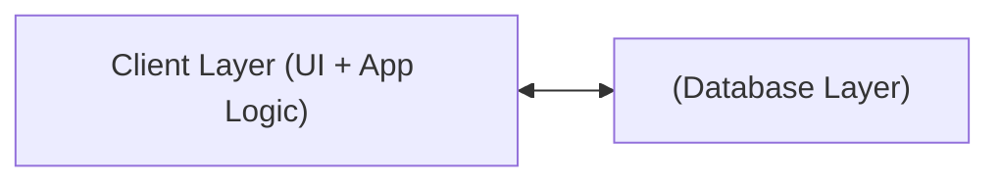

#### Pros & Cons

| Pros                  | Cons                                   |
|-----------------------|----------------------------------------|
| Simple to implement   | Poor scalability (few users)           |
| Fast for small apps   | Security risks (direct DB access)      |

#### Example Use Case

A desktop app directly querying a local SQL database.

---

### 2. 3-Tier Architecture

#### Definition

Adds a **Business Logic Layer** between the UI and the database.

#### Diagram

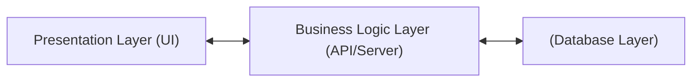

#### Pros & Cons

| Pros                               | Cons                      |
|-------------------------------------|---------------------------|
| Improved scalability & security     | Slightly higher latency   |
| Better separation of concerns       |                           |
| Easier maintenance                  |                           |

#### Example Use Case

Traditional web applications (React front-end → Node.js/Express API → PostgreSQL DB).

---

### 3. N-Tier Architecture

#### Definition

Extends 3-tier by adding specialized layers (caching, API gateway, microservices, etc.).

#### Diagram

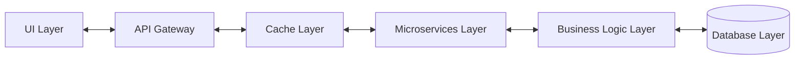

*Note: Actual order and number of layers may vary based on requirements.*

#### Pros & Cons

| Pros                                          | Cons              |
|-----------------------------------------------|-------------------|
| Handles high-traffic & complex business logic | Higher complexity |
| Independent scaling of layers                 | More moving parts |

#### Example Use Case

Large-scale enterprise software, microservices-based applications, e-commerce platforms.

---

## Performance and Scalability: How Do Tiers Impact Your System?

### Latency Considerations

- **More tiers = higher latency** (if not optimized)
- Each request passes through more processing steps

#### Solution: Caching & Load Balancing

- **Caching:** Store frequently accessed data for quick retrieval (e.g., Redis, Memcached)
- **Load Balancing:** Distribute requests across servers/layers for resilience and speed

### Scaling Strategies

- **Vertical Scaling:** Add resources to a single server (CPU, RAM)
- **Horizontal Scaling:** Add more servers (works better for high-traffic systems)

---

## Real-World Example: Simple Web App

Let’s look at a **Node.js 3-Tier Web App**:

**Directory Structure**
```
project/
│
├── frontend/      # Presentation Layer (React, Angular, etc.)
├── server/        # Business Logic Layer (Node.js/Express)
├── database/      # Data Layer (PostgreSQL, MongoDB)
```

**API Route Example (Express.js - Business Layer)**
```js
// server/routes/users.js
const express = require('express');
const router = express.Router();
const { getUserById } = require('../services/userService'); // Business logic

router.get('/:id', async (req, res) => {
  const user = await getUserById(req.params.id); // Calls data access layer
  res.json(user);
});

module.exports = router;
```

**Data Access Example**
```js
// server/data/userRepository.js
const db = require('./dbConnection');

async function getUserById(id) {
  return db.query('SELECT * FROM users WHERE id = $1', [id]);
}

module.exports = { getUserById };
```

---

## Tips and Tricks for Multi-Tier Architecture

- **Keep layers independent**: Avoid tight coupling; use clear interfaces/APIs between layers.
- **Optimize for latency**: Introduce caching and asynchronous processing where possible.
- **Secure inter-layer communication**: Use encryption (TLS), API keys, and input validation.
- **Monitor and log each layer**: Add observability (logging, tracing, metrics) to quickly identify bottlenecks.
- **Scale horizontally where possible**: Especially for API/business logic and caching layers.
- **Automate deployments and testing**: CI/CD pipelines ensure each layer is robust and can be deployed independently.

---

## Common Interview Questions

1. **What is Multi-Tier Architecture, and why is it used?**
2. **How does a 2-Tier architecture differ from a 3-Tier architecture?**
3. **What are the key components of a 3-Tier architecture?**
4. **How does scalability improve in a multi-tier system?**
5. **What strategies can reduce latency in a multi-tier app?**

---

## Summary & Key Takeaways

- **Multi-Tier = Better scalability & maintainability**
- **2-Tier** is simple but limited
- **3-Tier** is the standard for web apps
- **N-Tier** is ideal for large-scale, cloud-native systems

**Next Steps:** Dive deeper into Microservices Architecture!

---

## Further Reading

- [Martin Fowler on Layered Architecture](https://martinfowler.com/eaaCatalog/layers.html)
- [Microsoft Patterns & Practices – Multi-tier Architecture](https://docs.microsoft.com/en-us/azure/architecture/guide/architecture-styles/n-tier)

---


# Section 4


# Microservices Architecture in Modern System Design

Modern applications must be scalable, resilient, and maintainable. As businesses grow and requirements change rapidly, traditional monolithic architectures often fail to keep up. Enter **Microservices Architecture**—a proven pattern adopted by giants like Netflix, Uber, and Amazon. In this section, we’ll dive deep into microservices, how they contrast with monoliths, their communication strategies, challenges, real-world examples, and practical tips to ace your next system design interview.

---

## 1. What is Microservices Architecture?

**Microservices architecture** is a software design pattern that structures an application as a collection of small, independent services. Each service is responsible for a specific business capability and can be deployed, updated, and scaled independently.

**Key Characteristics:**
- **Independently Deployable**: Services are autonomous and can be upgraded without redeploying the entire system.
- **Loosely Coupled**: Services interact via well-defined APIs, minimizing dependencies.
- **Scalable & Fault-Tolerant**: Each microservice can be scaled horizontally and failures are isolated.

### Monolith vs. Microservices (Quick Comparison)

| Aspect          | Monolithic Architecture    | Microservices Architecture      |
|-----------------|---------------------------|--------------------------------|
| Deployment      | Single unit               | Independent services           |
| Scalability     | Whole app scales together | Each service scales separately |
| Technology      | Unified stack             | Polyglot (mixed stacks)        |
| Fault Tolerance | Single point of failure   | Isolated failures              |
| Maintainability | Hard as app grows         | Easier, modular updates        |

---

## 2. Identifying and Structuring Microservices

**How do you break down your application into microservices?**

- **Business Capabilities**: Each service aligns with a business function (e.g., Payments, Orders, Users).
- **Single Responsibility Principle**: One microservice should do one thing well.
- **Data Ownership**: Each microservice owns its own data; avoid shared databases.
- **Independent Deployment**: Updating one service should not require redeploying others.

**Domain-Driven Design (DDD)** is a useful approach:
```
[Order Service] <--> [Payment Service] <--> [User Service]
     |                    |                   |
[Order DB]          [Payment DB]           [User DB]
```

> **Diagram:** Each service has its own database and communicates with others via APIs.

### Example: Node.js Microservice Skeleton

```js
// orders-service/app.js (Express)
const express = require('express');
const app = express();
const port = 3001;

app.use(express.json());

app.get('/orders/:id', (req, res) => {
  // Fetch order from Order DB
  res.json({ orderId: req.params.id, status: 'processing' });
});

app.listen(port, () => {
  console.log(`Order service listening at http://localhost:${port}`);
});
```

---

## 3. Communication Between Microservices

Microservices must interact to fulfill business flows. There are two main models:

### Synchronous Communication

- **REST APIs**
  - Easy to implement and widely supported.
  - Uses HTTP/JSON—higher latency.
- **gRPC**
  - Uses Protocol Buffers (binary format) for faster, low-latency RPC.
  - Great for high-performance internal communication.

**Example: REST Call from Payment Service to Order Service (Python)**
```python
import requests

order = requests.get('http://orders-service:3001/orders/123').json()
```

### Asynchronous Communication

- **Event-Driven Messaging**
  - Services publish events (e.g., `OrderCreated`) to a message broker (Kafka, RabbitMQ).
  - Other services subscribe and react to these events.
- **Benefits**: Loose coupling, improved scalability, non-blocking.

**Example: Publish an Event with RabbitMQ (Node.js)**
```js
const amqp = require('amqplib');

async function publish() {
  const conn = await amqp.connect('amqp://localhost');
  const channel = await conn.createChannel();
  const queue = 'order_created';
  const msg = JSON.stringify({ orderId: 123 });

  await channel.assertQueue(queue, { durable: true });
  channel.sendToQueue(queue, Buffer.from(msg));
  console.log('Order event published');
}

publish();
```
---

## 4. Key Challenges in Microservices

| Challenge             | Description                                                                                   | Solutions                                    |
|-----------------------|----------------------------------------------------------------------------------------------|----------------------------------------------|
| Data Consistency      | Eventual consistency due to distributed databases                                            | Use compensation, idempotent operations      |
| Distributed Tracing   | Hard to trace requests across multiple services                                              | Use tracing tools (Jaeger, Zipkin)           |
| Network Overhead      | More API calls mean more latency and failure points                                          | Optimize with gRPC, caching, API Gateway     |
| Security              | Each service needs authentication, authorization, and encrypted communication                | OAuth2, JWT, mTLS, API Gateway               |

### Example: Distributed Tracing (OpenTelemetry - Node.js)
```js
// Pseudo-setup for distributed tracing
const { NodeTracerProvider } = require('@opentelemetry/sdk-trace-node');
const provider = new NodeTracerProvider();
provider.register();
```

---

## 5. Scaling Microservices

Microservices shine in scalability:

- **Horizontal Scaling**: Add more instances of a service to handle increased load.
- **Auto-Scaling (Kubernetes Example)**
  ```yaml
  apiVersion: autoscaling/v2
  kind: HorizontalPodAutoscaler
  metadata:
    name: order-service-hpa
  spec:
    scaleTargetRef:
      apiVersion: apps/v1
      kind: Deployment
      name: order-service
    minReplicas: 2
    maxReplicas: 10
    metrics:
    - type: Resource
      resource:
        name: cpu
        target:
          type: Utilization
          averageUtilization: 70
  ```
- **Database Sharding & Read Replicas**: Split data to optimize for high traffic.

---

## 6. Real-World Examples

- **Netflix**: Separate services for streaming, recommendations, personalization, scaled independently.
- **Uber**: Ride-matching, payments, navigation are different services.
- **Amazon**: Search, payments, recommendations are modular, allowing real-time updates and massive scale.

---

## 7. Tips and Tricks for Microservices Success

- **Start with clear service boundaries**: Use DDD to avoid accidental monoliths.
- **Automate everything**: CI/CD, testing, deployment, and monitoring.
- **Invest in observability**: Logging, metrics, tracing—don’t leave debugging until production.
- **Use an API Gateway**: Centralize cross-cutting concerns (authentication, rate-limiting, routing).
- **Design for failure**: Assume outages; use retries, circuit breakers, and bulkheads.
- **Document APIs**: Keep OpenAPI/Swagger specs updated.
- **Version your contracts**: Don't break clients when updating APIs.
- **Keep data isolated**: No shared databases; use events for cross-service sync.
- **Right-size your services**: Too fine-grained increases complexity, too coarse defeats the purpose.

---

## ASCII Diagram: Microservices vs. Monolith

**Monolithic Architecture:**
```
+-------------------------------+
|   User Interface              |
+-------------------------------+
|   Business Logic              |
+-------------------------------+
|   Data Access                 |
+-------------------------------+
|   Single Database             |
+-------------------------------+
```
**Microservices Architecture:**
```
+-------------------+   +--------------------+   +-------------------+
| Order Service     |   | Payment Service    |   | User Service      |
+-------------------+   +--------------------+   +-------------------+
| Order DB          |   | Payment DB         |   | User DB           |
+-------------------+   +--------------------+   +-------------------+
       |                       |                        |
       +---------API / Events--+------------------------+
```

---

## Interview Questions Cheat Sheet

- What are microservices and how do they differ from monolithic architecture?
- How do microservices communicate?
- What are the biggest challenges in microservices?
- How do you ensure data consistency?
- What is the role of an API Gateway?
- How do you structure microservices for a new project?
- How would you debug errors in a distributed microservices system?
- When would you choose microservices over N-tier or monolithic?

---

## Conclusion

Microservices architecture unlocks scalability, agility, and resilience—making it a favorite for cloud-native, large-scale systems. But it comes at the expense of increased complexity in deployment, communication, and monitoring. By following domain-driven design, automating your pipelines, investing in observability, and learning from industry leaders, you can master microservices for both interviews and real-world projects.

**Next Up:** Dive deep into Event-Driven Architecture for scalable, decoupled, real-time systems!

---

*Want more? Download the PDF with interview Q&A attached to this lecture, and stay tuned for our next post on Event-Driven Architecture!*

# Section 5

# Event-Driven Architecture: The Backbone of Modern Scalable Systems

Modern software systems demand **scalability**, **resilience**, and **real-time responsiveness**. Event-Driven Architecture (EDA) delivers these by enabling components to communicate through events, rather than direct calls. In this comprehensive section, we’ll integrate key concepts from both transcript and slides, provide real-world examples, code snippets, diagrams, and actionable tips to help you master event-driven systems.

---

## What is Event-Driven Architecture?

**Event-Driven Architecture** is a system design where components (services, modules, or microservices) communicate by emitting and responding to events. Instead of invoking each other directly, they interact via a central broker or messaging system. This enables **loose coupling**, **asynchronous processing**, and **scalability**.

<details>
<summary>📊 <strong>Diagram: Event-Driven System Overview</strong></summary>

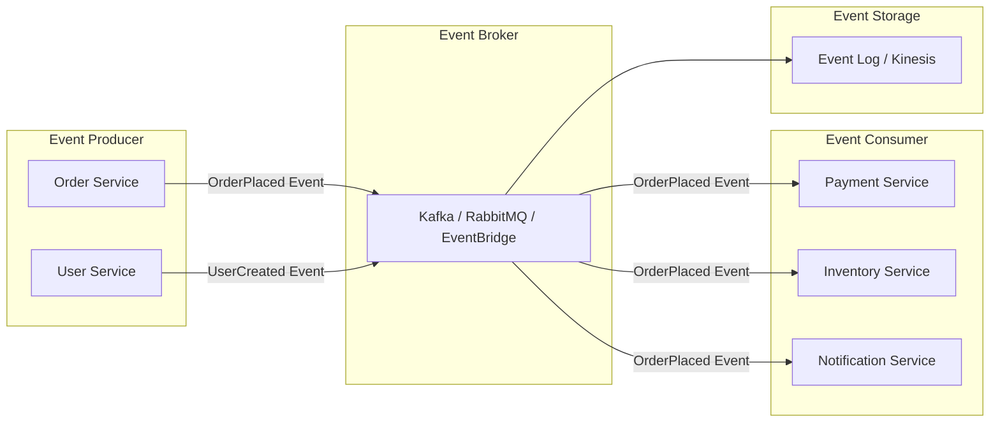
</details>

---

## Why Use Event-Driven Architecture?

- **Asynchronous Processing:** Services continue working while events are handled in the background.
- **Loose Coupling:** Components evolve independently, increasing system flexibility.
- **Scalability:** Handles spikes and high traffic with ease.
- **Real-time Responsiveness:** Ideal for finance, IoT, and notification systems.
- **Complex Workflows:** Multiple services respond to a single event, supporting sophisticated business processes.

---

## Core Components of an Event-Driven System

| Component         | Role                                                           | Example                                     |
|-------------------|---------------------------------------------------------------|---------------------------------------------|
| **Event Producer**| Generates events based on actions or changes                  | User places an order                        |
| **Event Broker**  | Routes, stores, and delivers events                           | Kafka, RabbitMQ, AWS EventBridge            |
| **Event Consumer**| Listens for events and performs actions                       | Payment service, Email notifier             |
| **Event Storage** | (Optional) Persists events for replay, auditing, or recovery  | Kafka log, AWS Kinesis                      |

---

## Synchronous vs. Asynchronous Communication

| Synchronous                                | Asynchronous (Event-Driven)               |
|--------------------------------------------|-------------------------------------------|
| Blocking calls (wait for response)         | Non-blocking (fire-and-forget)            |
| Tight coupling between components          | Decoupled; services operate independently |
| Example: HTTP REST API                     | Example: Kafka, RabbitMQ, SQS             |

---

## Messaging Patterns: Pub/Sub vs. Event Streaming

**1. Publish-Subscribe (Pub/Sub):**
- Producers send events to a “topic.”
- All subscribed consumers receive the event, usually once and in real-time.
- **Example:** Notifications to all followers when a user posts.

**2. Event Streaming:**
- Events are stored in order, consumers can replay and process at their own pace.
- Useful when replayability or ordered processing is needed.
- **Example:** Analytics, audit logs, IoT sensor data.

<details>
<summary>📝 <strong>Code Example: Simple Pub/Sub with Python & Redis</strong></summary>

```python
# Producer
import redis
r = redis.Redis()
r.publish('orders', 'order_placed:12345')

# Consumer
import redis
r = redis.Redis()
pubsub = r.pubsub()
pubsub.subscribe('orders')
for message in pubsub.listen():
    if message['type'] == 'message':
        print('Received:', message['data'])
```
</details>

---

## Event-Driven Architecture in Action: E-commerce Example

**Workflow:**

1. **Order Service:** User places an order → emits `OrderPlaced` event.
2. **Payment Service:** Listens for `OrderPlaced` → processes payment.
3. **Inventory Service:** Listens for `OrderPlaced` → updates stock.
4. **Notification Service:** Listens for `OrderPlaced` → sends email/SMS.

This enables independent scaling and failure isolation for each service.

---

## Challenges in Event-Driven Systems

| Challenge               | Description                                                                       | Solutions / Tools                                 |
|-------------------------|-----------------------------------------------------------------------------------|---------------------------------------------------|
| Eventual Consistency    | State updates are not always immediate across services                            | Idempotent processing, compensating transactions  |
| Ordering Guarantees     | Events may arrive out of sequence in distributed systems                          | Partitioning, sequence numbers, deduplication     |
| Fault Tolerance         | Handling failures without data loss                                               | Dead-letter queues, retries, event replay         |
| Debugging Complexity    | Harder to trace asynchronous flows                                                | Distributed tracing (OpenTelemetry, Jaeger)       |

---

## Best Practices

1. **Idempotent Event Processing:** Ensure consumers can safely process the same event multiple times.
2. **Dead-Letter Queues (DLQ):** Route failed messages for later inspection and manual handling.
3. **Choose the Right Broker:** Kafka for high-throughput streaming, RabbitMQ for classic queuing, AWS EventBridge for serverless event routing.
4. **Event Versioning:** Use schema registries (e.g., Avro Schema Registry) to evolve event formats without breaking consumers.

---

## Common Use Cases

- **Logging & Auditing:** Capture all system changes for compliance and debugging.
- **Real-Time Notifications:** Messaging apps, stock price updates, push notifications.
- **Microservices Decoupling:** Independent scalability and resilience.
- **IoT Systems:** High-frequency, real-time sensor data processing.
- **E-commerce Order Processing:** Orchestrate complex, multi-step order workflows.

---

## Tips & Tricks

- **Always make consumers idempotent:** Use unique event IDs or database constraints.
- **Monitor event flows:** Use distributed tracing tools (e.g., Jaeger, OpenTelemetry).
- **Plan for schema evolution:** Add new fields, never remove or change existing ones without versioning.
- **Use partitioning for ordering:** Partition events by relevant key (e.g., user ID) to maintain order where required.
- **Embrace infrastructure as code:** Use tools like Terraform or AWS CloudFormation to automate broker setup and scaling.

---

## Quick Interview Prep

- **Explain the difference between Pub/Sub and Event Streaming.**
- **How do you ensure idempotency in event consumers?**
- **What are dead-letter queues and why are they important?**
- **Describe a real-world use case for event-driven architecture.**
- **How would you handle event versioning and schema evolution?**

---

## Conclusion

Event-Driven Architecture is foundational for modern, **real-time**, **scalable**, and **resilient** systems. By decoupling components, embracing asynchronous communication, and following best practices, you can build systems ready for the demands of today’s cloud-native world.

---

> **Next up:** We'll dive deeper into architectural patterns, exploring how EDA fits with microservices and multi-tier systems—and how to choose the right approach for your use case.

---

### Further Reading

- [Building Event-Driven Microservices (AWS)](https://aws.amazon.com/architecture/event-driven-microservices/)
- [Apache Kafka Documentation](https://kafka.apache.org/documentation/)
- [Martin Fowler: Event-Driven Architecture](https://martinfowler.com/articles/201701-event-driven.html)

---

**Stay tuned for more on architectural patterns, real-world system design, and actionable engineering insights!**

# Section 6

Certainly! Here’s a detailed Markdown blog section that integrates your transcript and slides, including code snippets, diagrams (ASCII), and a ‘Tips and Tricks’ section.

---

# 📐 Mastering System Design: Architectural Patterns

Welcome to the end of our architectural patterns section! In this segment, we’ve explored how different software architecture styles impact scalability, maintainability, and performance. Let’s recap what we’ve learned, see practical applications, and prepare for what’s next in our journey—web concepts and system design.

---

## What is Software Architecture?

**Software architecture** is the high-level structure of a system, defining its components, the relationships between them, and how they interact. The architecture you choose directly influences your system’s:

- **Scalability:** Can your system handle more users or data?
- **Maintainability:** How easy is it to update, fix, or evolve your system?
- **Performance:** How responsive and efficient is your system under load?

> "Keep in mind, the architectural choices you make directly influence system behavior."

---

## Common Architectural Patterns

Let’s dive into the most prevalent architectural patterns, their pros, cons, and when to use each.

---

### 1. Monolithic Architecture

A **monolithic** application is a single unified unit where all components are tightly coupled.

#### Pros
- Simple to develop and deploy
- Great for small-scale apps

#### Cons
- Hard to scale
- Difficult to maintain as the codebase grows
- High risk: a single bug can affect the whole system

#### Use Case Example
> Small CRUD apps or startups needing fast MVPs

#### Diagram

```
+------------------+
|   Monolith App   |
+------------------+
| UI | Logic | DB  |
+------------------+
```

---

### 2. Layered (N-Tier) Architecture

**Layered architecture** splits the system into layers like Presentation, Business Logic, and Data.

#### Pros
- Clear separation of concerns
- Easier to maintain and scale than monoliths

#### Cons
- Potential performance overhead
- Possible tight coupling between layers

#### Example

**3-Tier Structure:**

```
+--------------------+
| Presentation Layer |
+--------------------+
         |
+--------------------+
| Business Logic     |
+--------------------+
         |
+--------------------+
| Data Access Layer  |
+--------------------+
```

**Code Snippet (Python Flask for 3-Tier):**

```python
# Presentation Layer
@app.route('/users')
def get_users():
    return jsonify(UserController().get_users())

# Business Logic Layer
class UserController:
    def get_users(self):
        return UserService().fetch_users()

# Data Access Layer
class UserService:
    def fetch_users(self):
        return UserModel.query.all()
```

---

### 3. Microservices Architecture

**Microservices** split applications into independent, loosely-coupled services, each aligned with a specific business capability.

#### Pros
- Independent scaling, deployment, and development
- Fault isolation
- Flexibility in tech stack

#### Cons
- Complex communication & coordination
- Requires strong DevOps
- Data consistency challenges

#### Real-World Example

- **Netflix:** Streams video via hundreds of microservices
- **Uber:** Separates payments, ride-matching, etc.

#### Diagram

```
+--------+   +--------+   +--------+
| User   |   | Order  |   | Payment|
|Service |<->|Service |<->|Service |
+--------+   +--------+   +--------+
         |         |         |
         +---API Gateway-----+
```

**Communication Example (REST call):**

```python
# User Service
@app.route('/users/<id>/orders')
def get_orders(id):
    # REST call to Order Service
    response = requests.get(f'http://orders/api/orders?user={id}')
    return response.json()
```

---

### 4. Event-Driven Architecture (EDA)

In **event-driven architecture**, components communicate asynchronously via events (messages), enabling loose coupling and responsiveness.

#### Pros
- Highly decoupled
- Great for async workflows
- Scales well under high traffic

#### Cons
- Debugging complexity
- Ensuring data consistency is hard

#### Example Use Cases
- Real-time notifications (chat, trading)
- IoT sensor data processing
- E-commerce order flows

#### Diagram

```
+-------------+        +-------------+
| Producer(s) |----->  | Event Broker|-----> [Consumer(s)]
+-------------+        +-------------+
(e.g., Kafka, RabbitMQ)
```

**Code Snippet (Producer in Python with Kafka):**

```python
from kafka import KafkaProducer
producer = KafkaProducer(bootstrap_servers='localhost:9092')
producer.send('orders', b'OrderPlaced:12345')
```

**Consumer:**

```python
from kafka import KafkaConsumer
consumer = KafkaConsumer('orders', bootstrap_servers='localhost:9092')
for msg in consumer:
    handle_order(msg.value)
```

---

## Selecting the Right Architecture

**Factors to consider:**
- **Business Needs:** What are you trying to solve?
- **Scalability & Performance:** Expected load and growth?
- **Maintainability:** How easy to update and evolve?
- **Team Skills:** Familiarity with distributed systems/DevOps?

---

## Practical Trade-offs

| Pattern        | Pros                     | Cons                              | Use Cases                  |
| -------------- | ------------------------ | --------------------------------- | -------------------------- |
| Monolithic     | Simple, fast to start    | Hard to scale, maintain           | Startups, simple apps      |
| Layered (N-Tier)| Separated concerns      | Overhead, possible coupling       | Enterprise, banking        |
| Microservices  | Scale, flexibility       | Complexity, consistency problems  | Large, cloud-native        |
| Event-Driven   | Async, decoupled         | Debugging, ordering, consistency  | IoT, real-time, logging    |

---

## Tips and Tricks

- **Start simple:** Don’t over-engineer; begin with monolithic or layered if you’re not sure.
- **Automate deployments:** For microservices, invest early in CI/CD.
- **Observability is key:** Logging, monitoring, and tracing are essential for distributed systems.
- **Use idempotency:** Especially in event-driven systems to avoid duplicate processing.
- **Choose the right communication:** Use synchronous (REST, gRPC) for immediate responses; asynchronous (Kafka, RabbitMQ) for decoupling and scalability.
- **Security first:** Isolate services, secure APIs, and encrypt inter-service communication.
- **Plan for schema changes:** Use event versioning or backward-compatible messages in EDA.

---

## What’s Next?

With a strong foundation in architectural patterns, we’re ready to dive into **web concepts and system design**! Up next:

- How the web works
- State management in web apps
- Data serialization (JSON, Protobuf, etc)
- Security best practices (e.g., CORS)
- Designing scalable web applications

These are must-have skills for building robust distributed systems.

---

> Stay tuned for the next section, where we go beyond architecture and into the building blocks of modern web systems!

---

**Let’s continue mastering system design!**

