# Section 1

Certainly! Below is a comprehensive Markdown blog section that integrates the provided transcript and slide points, enhanced with illustrative code snippets, diagrams using [Mermaid](https://mermaid-js.github.io/mermaid/#/), and a useful 'Tips and Tricks' section.

---

# Architectural Patterns and Styles in Modern Software Design

Welcome! In this article, we’ll dive deep into **Architectural Patterns and Styles**, focusing on how core architectural decisions shape the scalability, maintainability, and performance of modern systems. Whether you’re designing your first application or optimizing an enterprise solution, understanding these patterns will help you build robust and adaptable software.

---

## What is Software Architecture?

At its core, **software architecture** is the high-level structure of a system, describing how its components are organized and how they interact. It encompasses:

- **Module organization**
- **Data flow**
- **Communication patterns**
- **Component dependencies**

Why does this matter? Because architectural decisions have a **profound impact on scalability, performance, and maintainability**—the pillars that ensure your system can grow, perform, and adapt over time.

---

## Key Design Considerations

Before selecting an architecture, consider these core aspects:

- **Scalability**: Can your system handle increased users and data without performance loss?
- **Maintainability**: How easy is it to update, fix, or extend the system?
- **Performance**: How efficiently does the system process requests and handle load?

> **Remember:** Choices like monolithic vs. microservices, database structure, and communication protocols directly affect system behavior in production.

---

## Common Architectural Patterns and Styles

Let’s explore several foundational patterns and styles you’ll encounter in modern system design:

### 1. Monolithic Architecture

All components are packaged together and run as a single application.

```python
# Example: Simple Flask monolithic app
from flask import Flask, request

app = Flask(__name__)

@app.route('/users')
def users():
    return "List of users"

@app.route('/orders')
def orders():
    return "List of orders"

if __name__ == "__main__":
    app.run()
```

**Pros:**  
- Simple to develop and deploy  
- Easy to test

**Cons:**  
- Hard to scale parts independently  
- Updates require redeploying the whole app

---

### 2. Layered Architecture

Organizes code into layers (e.g., presentation, business, data) with clear responsibilities.

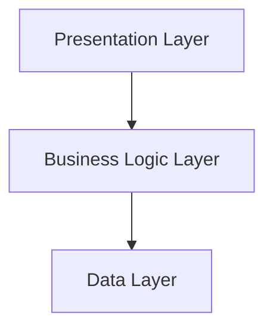

**Pros:**  
- Separation of concerns  
- Easy to maintain and test

**Cons:**  
- Can become rigid; changes in one layer may impact others

---

### 3. Client-Server Architecture

Splits the system into two parts: clients that request services, and servers that provide them.

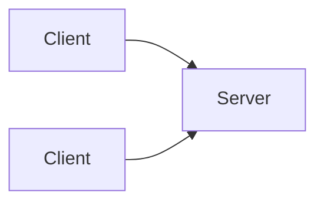

---

### 4. Microservices Architecture

Decomposes an application into small, independent services that communicate via APIs.

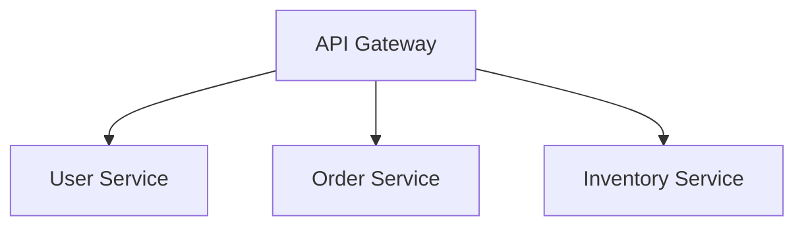

Each service can be developed, deployed, and scaled independently.

```javascript
// Example: Node.js microservice endpoint (users.js)
const express = require('express');
const app = express();

app.get('/users', (req, res) => {
  res.json([{ name: "Alice" }, { name: "Bob" }]);
});

app.listen(3001, () => console.log('User service running on port 3001'));
```

---

### 5. Event-Driven Architecture

Components communicate by emitting and responding to events, enabling loosely-coupled and reactive systems.

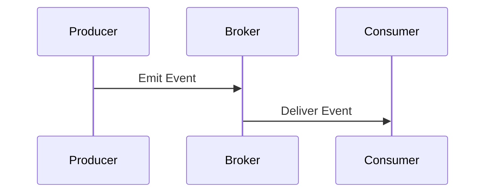

```python
# Example: Simple event handling in Python
def on_user_created(event):
    print(f"User created: {event['username']}")

# Emitting an event
event = {'username': 'alice'}
on_user_created(event)
```

---

### 6. Multi-Tier (N-Tier) Architecture

Separates the application into tiers (e.g., presentation, logic, data) for modularity and scalability.

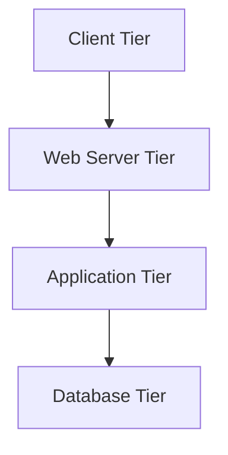

---

## How to Choose the Right Architecture

1. **Assess requirements:** Scale, team skills, deployment needs.
2. **Analyze trade-offs:** Simplicity vs. flexibility, cost vs. performance.
3. **Start simple:** Don’t over-architect; evolve as needed.
4. **Plan for change:** Favor designs that accommodate future growth.

---

## Tips and Tricks

- **Document your architecture** with diagrams and clear descriptions.
- **Automate deployments** (e.g., using CI/CD) to reduce friction in updates.
- **Monitor system performance** from day one to catch issues early.
- **Favor loose coupling** between components to ease maintenance.
- **Start with a monolith** if requirements are unclear, then refactor to microservices as the system grows.
- **Use event-driven approaches** for systems requiring real-time responses or high decoupling.

---

## Summary

Understanding architectural patterns and styles is critical for building systems that are **scalable, maintainable, and performant**. By mastering these approaches, you’ll be equipped to make informed choices, adapt to changing requirements, and deliver robust software solutions.

---

**Ready to dive deeper?** In the next articles, we’ll explore each pattern in detail, with real-world examples and implementation guides!

---

*Happy architecting!*

---

# Section 2

Certainly! Here’s a **detailed blog section** in Markdown that **integrates the transcript and slide content** (as much as possible, since slide content is not shown, I’ll infer likely content from the transcript), includes **code snippets**, **diagrams (in Markdown)**, and a **Tips and Tricks** section.

---

# Understanding Software Architecture Patterns and Styles

Software architecture is the foundation on which robust, scalable, and maintainable software systems are built. In this section, we'll explore the most common architectural patterns—**Monolithic**, **Layered (N-Tier)**, **Microservices**, and **Event-Driven**—understand their pros and cons, and see how to apply them in real-world scenarios.

---

## What is Software Architecture?

> **Software architecture** is the high-level structure of a software system. It defines the system's components, their organization, and the interactions between them—much like a blueprint for a building.

**Why does architecture matter?**
- **Scalability:** How well your system handles growth.
- **Maintainability:** Ease of modifying/extending the system.
- **Performance:** How fast and responsive the system is.
- **Resilience:** How well the system tolerates failure.

---

## Common Architectural Styles

### 1. Monolithic Architecture

A **monolithic** application is built as a single, unified unit.

**Diagram:**
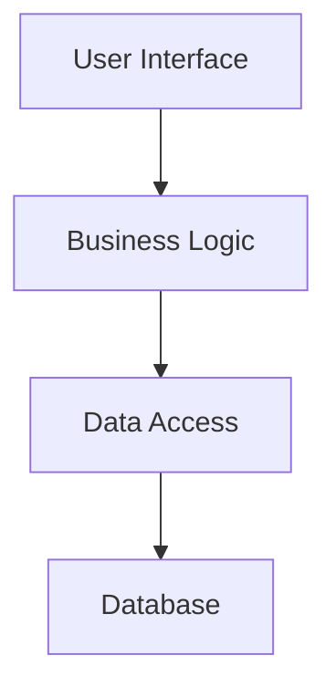

All components are tightly coupled and deployed together.

**Pros:**
- Simple to develop and deploy.
- Good for small teams or MVPs.

**Cons:**
- Hard to scale parts independently.
- Maintenance becomes difficult as codebase grows.
- One bug can bring down the whole system.

**Example Code Structure:**
```python
# app.py (Monolith)
from flask import Flask
app = Flask(__name__)

@app.route('/')
def home():
    return render_home()

def render_home():
    # UI + business logic + data access all here
    return "Welcome!"

if __name__ == '__main__':
    app.run()
```

---

### 2. Layered (N-Tier) Architecture

**Layered architecture** divides the system into layers, each with a specific responsibility.

**Common layers:**
- Presentation (UI)
- Business Logic
- Data Access

**Diagram:**
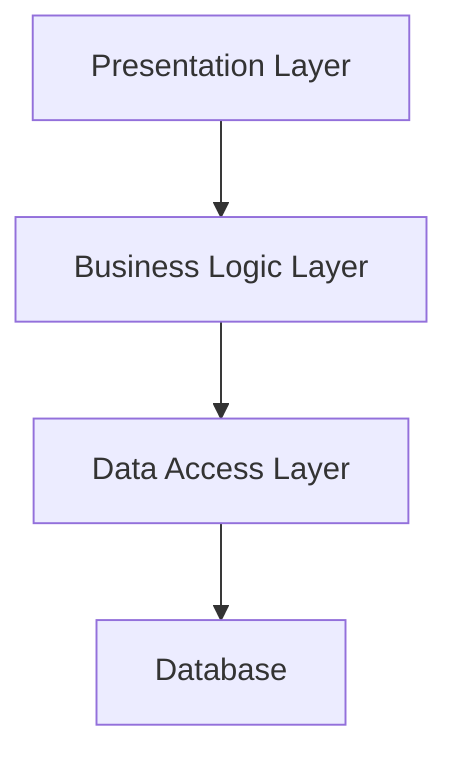

**Pros:**
- Clear separation of concerns.
- Easier to maintain and test.

**Cons:**
- Can introduce performance overhead.
- Layers may become tightly coupled in practice.

**Example Code Structure:**
```python
# presentation.py
def show_user_profile(user_id):
    data = get_user_profile(user_id)
    return render_profile(data)

# business_logic.py
def get_user_profile(user_id):
    return fetch_user_from_db(user_id)

# data_access.py
def fetch_user_from_db(user_id):
    # Fetch from database
    pass
```

---

### 3. Microservices Architecture

**Microservices** breaks the system into independent, small services, each handling a specific business domain.

**Diagram:**
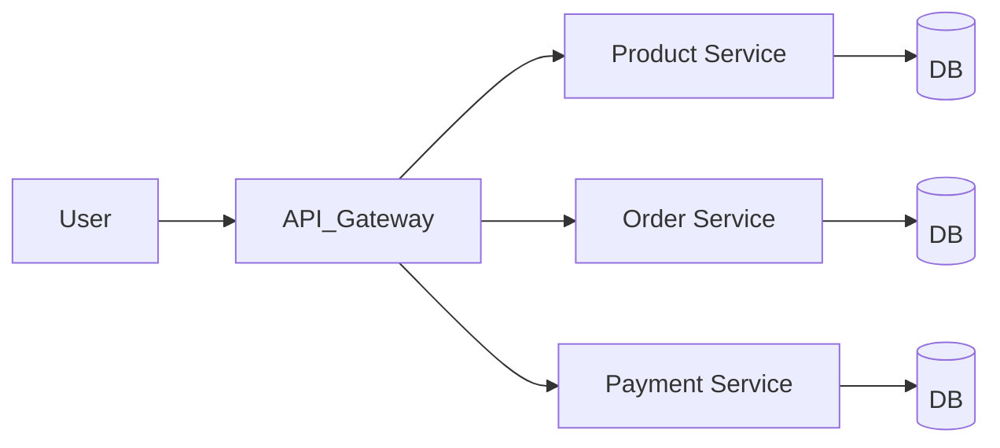

**Pros:**
- Services are loosely coupled, can be developed, deployed, and scaled independently.
- Better fault isolation.
- Technology diversity per service.

**Cons:**
- Complex inter-service communication.
- Requires strong DevOps/automation.
- Data consistency challenges.

**Example (Python Flask Service):**
```python
# product_service.py
from flask import Flask, jsonify

app = Flask(__name__)

@app.route('/products')
def get_products():
    return jsonify([{"id": 1, "name": "Book"}])

if __name__ == '__main__':
    app.run(port=5001)
```
Each service (e.g., Product, Order, Payment) runs independently, possibly using different tech stacks.

---

### 4. Event-Driven Architecture

**Event-driven architecture** uses events to communicate between decoupled components.

**Diagram:**
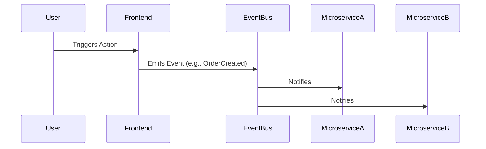

**Pros:**
- Highly decoupled and scalable.
- Asynchronous processing.
- Flexible & easy to evolve.

**Cons:**
- Complex to debug and trace.
- Eventual consistency can be tricky.

**Example (Emitting an Event):**
```python
# Using a message broker like RabbitMQ or Kafka
import pika

connection = pika.BlockingConnection(pika.ConnectionParameters('localhost'))
channel = connection.channel()
channel.queue_declare(queue='order_events')

channel.basic_publish(exchange='',
                      routing_key='order_events',
                      body='{"event": "order_created", "data": {"order_id": 123}}')
connection.close()
```

---

## Choosing the Right Architecture

**Key considerations:**
- **Business Needs:** What are you trying to solve?
- **Scalability:** How much growth is expected?
- **Performance:** Are low-latency or high-throughput requirements critical?
- **Maintainability:** How easily can you update or extend the system?

| Architecture    | Best For                                      | Avoid When                        |
|-----------------|-----------------------------------------------|-----------------------------------|
| Monolithic      | Small, simple apps, MVPs, startups            | Large/complex, needs high scale   |
| Layered         | Enterprise apps, CRMs, banking systems        | Performance-critical systems      |
| Microservices   | Large-scale, cloud-native, independent scaling| Small/simple projects             |
| Event-Driven    | Real-time, IoT, async, scalable systems       | When strong consistency is needed |

---

## Tips and Tricks

- **Start simple:** For MVPs or small apps, monolithic is often sufficient; refactor later if needed.
- **Automate everything:** Especially important for microservices (CI/CD, monitoring, testing).
- **Use API gateways:** To manage requests in microservices architectures.
- **Centralized logging:** Essential for debugging in distributed/event-driven systems.
- **Document interfaces:** Clearly specify contracts between services and layers.
- **Plan for evolution:** Choose an architecture that can evolve as your business needs change.
- **Embrace eventual consistency:** In distributed/event-driven systems, design for eventual rather than immediate consistency.

---

## Example: When to Use Which?

- **Building a CRM for a small business?**  
  Go for **Layered Architecture**.
- **Launching an MVP for a startup?**  
  Start with **Monolithic**; split into microservices if it grows.
- **Creating a real-time notification system?**  
  **Event-driven** is a strong fit.
- **Developing a large e-commerce platform?**  
  **Microservices** for independent scaling of catalog, orders, payments.

---

## Conclusion

Choosing the right architecture is pivotal. It’s not about the trendiest style, but the one that fits your business and technical needs. Weigh scalability, maintainability, and performance requirements carefully—and always be ready to adapt as your system evolves.

---

**Next:**  
In the next section, we'll dive deeper into **multi-tier (layered) architecture**, exploring real-world implementations and best practices.

---

**Got questions?**  
Check out the attached PDF for detailed interview Q&A on these patterns!

---

_Stay tuned for more deep dives into architectural patterns!_

# Section 3

Below is a detailed Markdown blog section on **Multi-Tier Architecture**, integrating the provided transcript and slides. This section covers definitions, types of tiered architectures, pros/cons, real-world examples, impact on performance and scalability, and includes code snippets, diagrams (in Markdown), plus a 'Tips and Tricks' section.

---

# Multi-Tier Architecture: A Foundation for Scalable Systems

Modern application development demands architectures that are scalable, maintainable, and secure. **Multi-tier architecture** is a time-tested pattern that addresses these needs by dividing an application into distinct layers, each with specific responsibilities. In this post, we'll explore the differences between two-tier, three-tier, and n-tier architectures, see how they impact scalability and performance, provide simple code examples, and share practical tips for system design.

---

## What is Multi-Tier Architecture?

Multi-tier architecture is a **software design pattern** that organizes an application into separate, independent layers (also called tiers). Each layer has a distinct responsibility—such as presenting data to the user, processing business logic, or managing data storage.

**Key benefits:**
- **Separation of concerns:** Each layer handles a specific role, making the codebase easier to manage and scale.
- **Improved scalability:** Layers can be scaled independently.
- **Better security:** By isolating the database and logic, you reduce attack surfaces.
- **Maintainability:** Changes in one layer have minimal impact on others.

---

## Types of Multi-Tier Architectures

### 1. Two-Tier Architecture

#### Structure

```plaintext
[Client Application] <------> [Database Server]
```

The client contains both the user interface and application logic, which communicates directly with the database.

#### Diagram


#### Example (Python + SQLite)

```python
# Two-tier example: direct database access
import sqlite3

conn = sqlite3.connect('example.db')
cursor = conn.cursor()
cursor.execute("SELECT * FROM users")
for row in cursor.fetchall():
    print(row)
conn.close()
```

#### Pros
- Simple to implement.
- Fast for small-scale applications.

#### Cons
- **Poor scalability:** Performance degrades as users grow.
- **Security risks:** Clients have direct database access.
- **Limited to small/simple apps.**

---

### 2. Three-Tier Architecture

#### Structure

```plaintext
[Presentation Layer] <--> [Business Logic Layer] <--> [Data Layer]
```

- **Presentation Layer:** Handles UI and user interactions.
- **Business Logic Layer:** Processes application logic.
- **Data Layer:** Handles data storage and retrieval.

#### Diagram


#### Example (Node.js Express API)

```js
// Business Logic Layer (API)
const express = require('express');
const app = express();
const db = require('./db'); // Assume db.js handles DB connection

app.get('/users', async (req, res) => {
  const users = await db.query('SELECT * FROM users');
  res.json(users);
});

app.listen(3000, () => console.log('API running on port 3000'));
```

#### Pros
- **Scalable and secure:** Each layer can be scaled and secured independently.
- **Separation of concerns:** Easier to maintain and evolve.
- **Common for web apps:** E.g., React frontend → Node API → SQL DB.

#### Cons
- Slightly higher latency (extra hop).
- More complex than two-tier.

---

### 3. N-Tier Architecture

#### Structure

N-tier extends three-tier by adding specialized layers (e.g., caching, API gateways, microservices).

#### Example Layers

- **API Gateway**
- **Authentication Service**
- **Caching Layer** (e.g., Redis)
- **Microservices** (e.g., User Service, Payment Service)
- **Database Layer**

#### Diagram

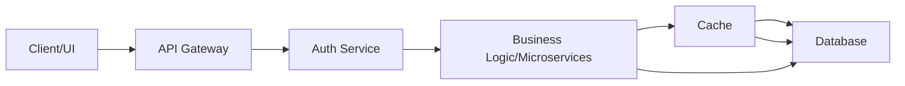

#### Example (Pseudo-code)

```python
# N-tier: API Gateway forwards to microservice, checks cache
def get_user_profile(user_id):
    cached = redis.get(f"profile:{user_id}")
    if cached:
        return cached
    profile = user_service.get_profile(user_id)
    redis.set(f"profile:{user_id}", profile)
    return profile
```

#### Pros
- **Highly scalable:** Each tier can be scaled independently.
- **Fault tolerant:** Failures in one layer don't bring the whole system down.
- **Ideal for large and complex apps** (e.g., e-commerce, banking, cloud-native apps).

#### Cons
- Increased complexity.
- More points of failure.
- Requires robust monitoring and deployment strategies.

---

## Impact on Performance and Scalability

- **Latency:** More tiers mean more hops—potentially higher latency.
- **Scalability:** N-tier enables horizontal scaling (add more servers) and vertical scaling (add resources to existing servers).
- **Optimizations:** Caching, load balancing, and asynchronous messaging can reduce bottlenecks.

#### Caching Example

```python
def get_product(product_id):
    product = cache.get(product_id)
    if not product:
        product = db.fetch(product_id)
        cache.set(product_id, product)
    return product
```

---

## Tips and Tricks for Designing Multi-Tier Systems

- **Start simple:** Begin with three-tier unless you know you'll need n-tier complexity.
- **Isolate secrets and credentials:** Never expose DB credentials in the UI/client layer.
- **Leverage caching:** Use Redis or Memcached for reducing database load.
- **Use load balancers:** For horizontal scaling, distribute API requests with load balancers.
- **Monitor each layer:** Implement logging and health checks between tiers.
- **Automate deployments:** Use CI/CD pipelines for smooth upgrades across tiers.
- **Secure APIs:** Validate and sanitize all input at the business logic layer.

---

## Conclusion

Multi-tier architecture is the backbone of scalable, maintainable, and secure applications. Whether you're building a simple desktop app or a complex cloud-native enterprise platform, choosing the right tiered architecture and optimizing each layer for performance can set your system up for success.

**Next up:** We'll dive deeper into microservices architecture—a natural evolution of multi-tier design!

---

**Further Reading:**  
- [Martin Fowler — Patterns of Enterprise Application Architecture](https://martinfowler.com/books/eaa.html)  
- [AWS Multi-Tier Architecture Guide](https://docs.aws.amazon.com/whitepapers/latest/aws-overview/multi-tier-architectures.html)  

---

*Did you find this guide useful? Share your thoughts or questions below!*


# Section 4

Certainly! Below is a detailed Markdown blog section that integrates the provided transcript and slide contents. It includes code snippets, diagrams (ASCII for compatibility), and a 'Tips and Tricks' section for readers.

---

# Introduction to Microservices Architecture

Welcome to this deep dive into **Microservices Architecture**—the backbone of scalable, resilient, and modern enterprise applications. In this post, we’ll explore the design philosophy behind microservices, how they differ from monolithic architectures, common communication patterns, deployment strategies, real-world examples, and practical tips for your journey.

---

## What is Microservices Architecture?

Microservices architecture is a **software design pattern** where applications are built as a collection of small, independent services. Each microservice focuses on a specific business capability and communicates with other services via APIs.

**Key Characteristics:**

- **Independently Deployable:** Each service can be deployed and updated without affecting others.
- **Loosely Coupled:** Services interact via well-defined APIs, remaining self-contained.
- **Scalable:** Scale individual services based on demand.
- **Resilient:** Failure in one service doesn't bring down the entire system.

---

## Microservices vs. Monolithic Architecture

| Monolithic Architecture         | Microservices Architecture                  |
|---------------------------------|---------------------------------------------|
| Single, tightly integrated app  | Multiple, independent services              |
| Centralized data storage        | Decentralized, per-service databases        |
| Hard to scale parts individually| Each service scales independently           |
| Complex to update/maintain      | Easier, as changes are isolated             |

**Diagram:**

```text
[Monolith]              [Microservices]
+-------------------+   +--------+  +--------+  +--------+
| UI | Logic | Data |   | Auth   |  | Orders |  | Payment|
+-------------------+   +--------+  +--------+  +--------+
```

---

## Identifying Microservices

**Principles to Follow:**

- **Business Capabilities:** Each service aligns with a specific function (e.g., Orders, Payments).
- **Single Responsibility:** One service = one concern. Avoid multi-purpose services.
- **Data Ownership:** Each service manages its own database.
- **Independent Deployment:** Update services without redeploying the entire app.

---

## Structuring Your Microservices

1. **Domain-Driven Design (DDD):** Break the system into logical domains.
2. **API-First:** Communicate via REST, gRPC, or event-driven APIs.
3. **Right Granularity:** Avoid too-large (monolith) or too-fine (excessive complexity) services.
4. **Observability:** Implement logging, monitoring, and distributed tracing.

**ASCII Domain Model Example:**

```text
+-------------+      +------------+      +-----------+
| Order       |<---->| Payment    |<---->| Inventory |
+-------------+      +------------+      +-----------+
```

---

## Microservices Communication Patterns

### 1. Synchronous Communication

- **REST APIs:** Simple, HTTP-based, text (JSON/XML), higher latency.
- **gRPC:** High performance, binary protocol buffers, low latency.

**Example (REST):**

```python
# Python Flask REST API snippet
from flask import Flask, jsonify, request

app = Flask(__name__)

@app.route('/order', methods=['POST'])
def create_order():
    data = request.json
    # Process order...
    return jsonify({'status': 'created'}), 201
```

**Example (gRPC):**

```protobuf
// order.proto
syntax = "proto3";
service OrderService {
  rpc CreateOrder (OrderRequest) returns (OrderResponse);
}
message OrderRequest { string item_id = 1; }
message OrderResponse { string status = 1; }
```

### 2. Asynchronous Communication

- **Event-Driven Messaging:** Via message brokers (Kafka, RabbitMQ).
- **Loose Coupling:** Services publish/subscribe to events.

**Example (Kafka):**

```python
# Python Kafka producer
from kafka import KafkaProducer
import json

producer = KafkaProducer(bootstrap_servers='localhost:9092')
producer.send('order-events', json.dumps({'order_id': 123, 'status': 'created'}).encode())
```

**Event-Driven Diagram:**

```text
[Order Service]--(order_created)-->[Kafka]--->[Payment Service]
                                                |
                                                v
                                          [Inventory Service]
```

---

## Challenges in Microservices

- **Data Consistency:** Distributed databases require *eventual consistency*.
- **Distributed Tracing:** Hard to debug across networked services.
- **Network Overheads:** Increased inter-service calls = latency.
- **Security:** Must secure each service (auth, encryption, etc.).
- **Operational Complexity:** Deployment, orchestration, and monitoring.

---

## Scaling Microservices

- **Horizontal Scaling:** Add more service instances behind a load balancer.
- **Auto-Scaling:** Use Kubernetes, AWS ECS, etc., for dynamic scaling based on load.
- **Database Sharding:** Split data across multiple nodes.
- **Read Replicas:** Improve read performance.

**Diagram:**

```text
        +----------+
        |  Client  |
        +----------+
             |
     +----------------------+
     |   Load Balancer      |
     +----------------------+
      /          |          \
+--------+  +--------+  +--------+
|Order S1|  |Order S2|  |Order S3|
+--------+  +--------+  +--------+
```

---

## Real-World Examples

- **Netflix:** Scales video, recommendations, personalization as separate services.
- **Uber:** Ride matching, payments, navigation are independent microservices.
- **Amazon:** Functions like search, payments, recommendations are all microservices.

---

## Tips & Tricks for Microservices Success

- **Start with clear business domains.**
- **Automate deployments** using CI/CD pipelines.
- **Implement centralized logging and distributed tracing** (e.g., with ELK Stack, Jaeger).
- **Use API gateways** for traffic management, authentication, and routing.
- **Monitor service health** with tools like Prometheus and Grafana.
- **Design for failure:** Use circuit breakers, retries, and graceful degradation.
- **Document APIs** and maintain strong versioning practices.
- **Secure all endpoints** and encrypt inter-service traffic.

---

## Frequently Asked Interview Questions

1. **What are the key benefits and challenges of microservices?**
2. **How do you handle data consistency in distributed systems?**
3. **When would you use synchronous vs. asynchronous communication?**
4. **How do you implement service discovery and load balancing?**
5. **What tools would you use for monitoring and observability?**

---

## Recap

Microservices deliver **scalability**, **resilience**, and **faster development** by breaking down applications into independently deployable services. However, they introduce challenges like data consistency, tracing, security, and operational complexity. With the right patterns and tools, you can unlock their full potential—just as Netflix, Uber, and Amazon have.

---

> **Next Up:** In our upcoming post, we’ll dive deep into **Event-Driven Architecture** for building scalable, loosely-coupled microservices. Stay tuned!

---

**Download:** [Microservices Interview Questions PDF](#) (Link to attached resource)

---

*Happy building! 🚀*

# Section 5

Certainly! Here’s a detailed Markdown blog section on **Event-Driven Architecture**, integrating the provided transcript and slides, complete with diagrams (using Mermaid for Markdown), code snippets, and a "Tips and Tricks" section.

---

# Event-Driven Architecture: Building Scalable and Decoupled Systems

Event-driven architecture (EDA) is a modern system design approach that enables asynchronous and decoupled communication between components. This post explores the core concepts, benefits, challenges, and best practices of EDA, helping you design scalable, resilient distributed systems.

---

## What is Event-Driven Architecture?

Event-driven architecture is a paradigm where system components communicate by emitting and reacting to **events**—records of significant changes or actions in the system. Rather than making direct, synchronous calls, services publish events (like “OrderPlaced” or “UserRegistered”) and other services consume these events to trigger their own logic.

This approach brings three key characteristics:

- **Asynchronous Processing**: Components don’t wait for responses and continue processing other work.
- **Loose Coupling**: Components interact via events, not direct calls, so they evolve independently.
- **Scalability & Flexibility**: Easily handle spikes in workload without tight dependencies.

---

## Synchronous vs. Asynchronous Communication

| Synchronous Communication               | Asynchronous Communication                       |
|-----------------------------------------|-------------------------------------------------|
| Blocking: Sender waits for response     | Non-blocking: Sender continues other work       |
| Tight coupling between components       | Loose coupling; components interact via events  |
| Example: HTTP API call                  | Example: Message queues, event brokers          |
| Can lead to bottlenecks                 | Promotes scalability and resilience             |

### Example: Synchronous (Traditional HTTP Call)
```python
# Synchronous request-response
def place_order(order):
    response = payment_service.process_payment(order)
    if response.success:
        inventory_service.update(order)
```

### Example: Asynchronous (Event-Driven)
```python
# Asynchronous event publishing
def place_order(order):
    event_broker.publish('OrderPlaced', order)
    # Continue without waiting for payment/inventory

# Payment service (subscriber)
def on_order_placed(event):
    process_payment(event.data)
```

---

## Event-Driven Messaging Patterns

### 1. Publish-Subscribe (Pub/Sub)
- **Publishers** broadcast events to all interested **subscribers**.
- Subscribers receive events in real-time but must be online.
- **Example**: Notification system where posting an update notifies all followers.

### 2. Event Streaming
- Events are stored in an ordered log, allowing consumers to process past events at their own pace.
- Useful for analytics, audit logs, and systems where event replay is needed.
- **Example**: Website analytics tracking user activity over time.

#### Mermaid Diagram: Pub/Sub vs. Event Streaming

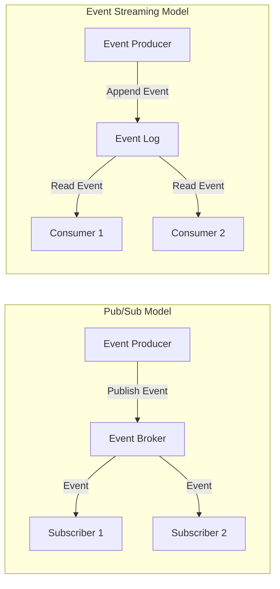

---

## Key Components of Event-Driven Architecture

| Component       | Responsibility                   | Examples                       |
|-----------------|----------------------------------|--------------------------------|
| Event Producer  | Emits events                     | User actions, microservices    |
| Event Broker    | Routes/stores events             | Kafka, RabbitMQ, AWS EventBridge |
| Event Consumer  | Reacts to events                 | Notification, analytics, etc.  |
| Event Storage   | Persists events for replay/analysis | Kafka log, AWS Kinesis         |

#### Mermaid Diagram: Event-Driven Flow

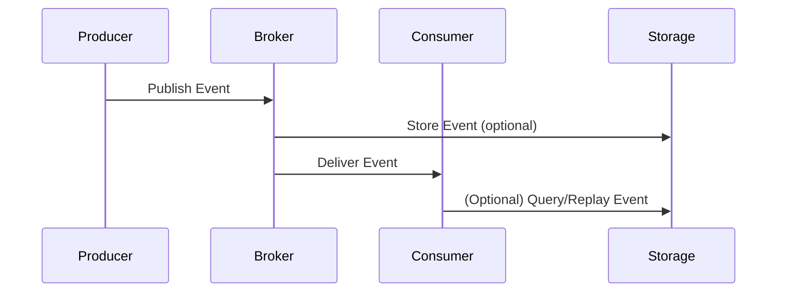

---

## Benefits of Event-Driven Architecture

- **Responsiveness**: Enables real-time event processing.
- **Scalability**: Easily handles high loads and spikes.
- **Fault Tolerance**: Decoupling allows individual components to fail/recover independently.
- **Flexibility**: Components can be added/updated without affecting others.

---

## Challenges and Solutions

| Challenge                | Solution                                    |
|--------------------------|---------------------------------------------|
| Eventual Consistency     | Idempotent processing, compensating actions |
| Ordering Guarantees      | Partitioning, sequence numbers, deduplication|
| Fault Tolerance          | Dead-letter queues, retries, reprocessing   |
| Debugging Complexity     | Distributed tracing (OpenTelemetry, etc.)   |

---

## Best Practices for Event-Driven Systems

1. **Idempotent Event Processing**: Ensure repeated event processing has no side effects.
    ```python
    # Pseudocode for idempotency
    if not already_processed(event_id):
        process_event(event)
    ```

2. **Implement Dead-Letter Queues**: Capture failed events for later inspection.
3. **Choose the Right Event Broker**: Match broker capabilities to your system’s needs.
4. **Schema Versioning**: Use tools like [Apache Avro](https://avro.apache.org/) for event schema evolution.

---

## Tips and Tricks

- **Use Partition Keys**: For event ordering, partition events by user ID or order ID.
- **Monitor Event Lag**: Track how far behind consumers are from the latest event.
- **Back Pressure Handling**: Protect slow consumers from being overwhelmed.
- **Tracing Tools**: Integrate distributed tracing like [OpenTelemetry](https://opentelemetry.io/) for easier debugging.
- **Compensating Transactions**: Use when eventual consistency isn’t enough—e.g., refund a payment if order fails.
- **Testing**: Simulate failure scenarios and duplicate events during testing.

---

## Real-World Use Cases

- **Logging and Auditing**: Capture every system action for compliance and troubleshooting.
- **Real-Time Notifications**: Instant alerts in chat, stock, or monitoring systems.
- **Microservices Decoupling**: Order, payment, and inventory services communicate via events, not direct calls.
- **IoT Systems**: Efficient processing of huge streams of sensor data.
- **E-Commerce Workflows**: Asynchronous order fulfillment pipeline (order placed → payment → inventory → shipping).

---

## Conclusion

Event-driven architecture is a powerful foundation for building responsive, scalable, and decoupled distributed systems. By understanding its patterns, components, challenges, and best practices, you can design systems that are robust, maintainable, and ready for real-world demands.

---

**Want to learn more?**  
Check out the attached PDF with detailed interview questions and answers to deepen your understanding of event-driven system design.

---

**Next Up:**  
In the next session, we’ll explore architectural patterns and see how event-driven approaches fit into the broader system design landscape.

---

**Happy architecting! 🚀**

# Section 6

Certainly! Here’s a detailed Markdown blog section that integrates your transcript and slide content. I’ll add code snippets, diagrams (using Mermaid for Markdown), and a ‘Tips and Tricks’ section as requested.

---

# Wrapping Up Architectural Patterns: What’s Next?

As we reach the end of our architectural patterns section, let’s recap what we’ve learned and preview what’s coming next in our journey toward building robust, scalable web systems.

## What We Covered: Architectural Patterns

In this section, we explored several foundational architectural patterns. Understanding these patterns is crucial—each impacts your system’s scalability, maintainability, and performance differently. 

### 1. Multi-Tier Architecture

Multi-tier (or n-tier) architecture organizes your application into logical layers, commonly:

- **Presentation Layer** (UI)
- **Business Logic Layer**
- **Data Layer**

This separation helps structure applications for maintainability and scalability.

**Diagram: Multi-Tier Architecture**

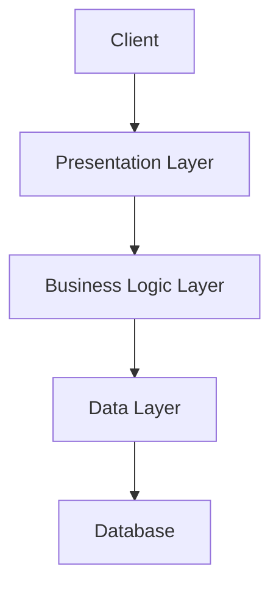

**Example:**

```python
# Presentation Layer
@app.route('/users')
def show_users():
    users = get_all_users()  # Business Logic Layer
    return render_template('users.html', users=users)

# Business Logic Layer
def get_all_users():
    return UserModel.query.all()  # Data Layer
```

---

### 2. Microservices Architecture

Microservices split your application into independently deployable services, each responsible for a specific business capability.

**Pros:**
- Flexibility in deployment and scaling
- Technology heterogeneity

**Cons:**
- Increased complexity (e.g., distributed data, observability)

**Diagram: Microservices**

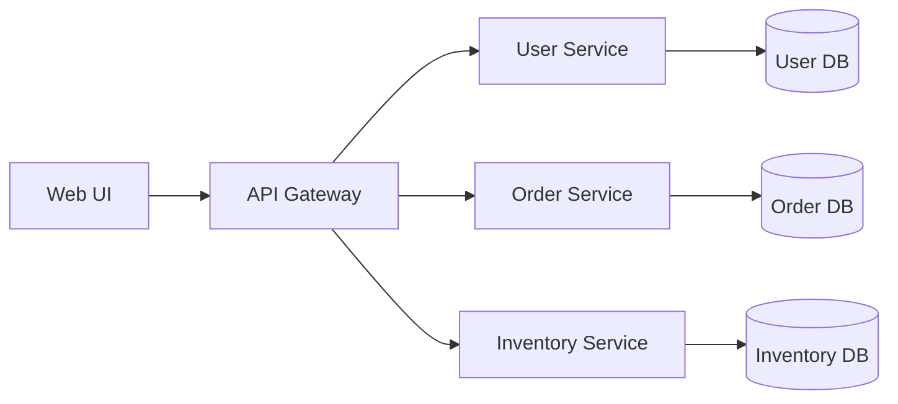

**Example: RESTful Service**

```python
# Flask Microservice Example
from flask import Flask, jsonify

app = Flask(__name__)

@app.route('/users')
def users():
    return jsonify([{"id": 1, "name": "Alice"}])

if __name__ == "__main__":
    app.run(port=5001)
```

---

### 3. Event-Driven Architecture

Event-driven systems use events to trigger and communicate between services, enabling loose coupling and asynchronous processing.

**Diagram: Event-Driven**

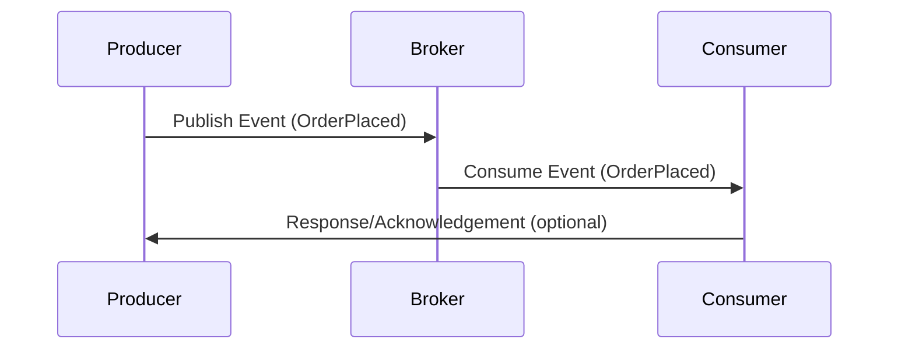

**Example: Event Publishing (Python pseudocode)**

```python
# Publish event to Kafka
producer.send('orders', {'order_id': 123, 'status': 'created'})
```

---

## Best Practices and Trade-Offs

Throughout this section, we examined real-world use cases, best practices, and the trade-offs you must consider—for example, microservices enable independent scaling but require careful handling of data consistency.

---

## Up Next: Web Concepts and System Design

In the next section, we'll dive into **web concepts and system design**—the foundation for understanding modern web applications:

- **How the web operates**
- **Managing state**
- **Data serialization (JSON, XML, etc.)**
- **Security mechanisms (like CORS)**
- **Best practices for scalable web apps**

These are essential for building reliable, efficient distributed systems.

---

## Tips and Tricks

- **Choose the Right Pattern:** Not every problem needs microservices. Start with monolithic or multi-tier, and migrate when scaling demands it.
- **Automate Testing:** Especially in event-driven and microservices systems, automated integration tests are vital.
- **Monitor and Log:** Distributed architectures need strong observability—use centralized logging and monitoring.
- **Handle Failures Gracefully:** Design for failure—use retries, circuit breakers, and graceful degradation.
- **Consistency vs. Availability:** Understand the CAP theorem and make informed trade-offs.
- **Security First:** Always consider authentication, authorization, and data protection, especially as services multiply.

---

_Stay tuned as we transition to mastering web concepts and system design!_

---

**See you in the next section!**

