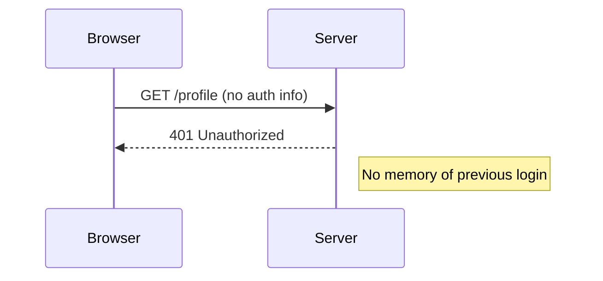
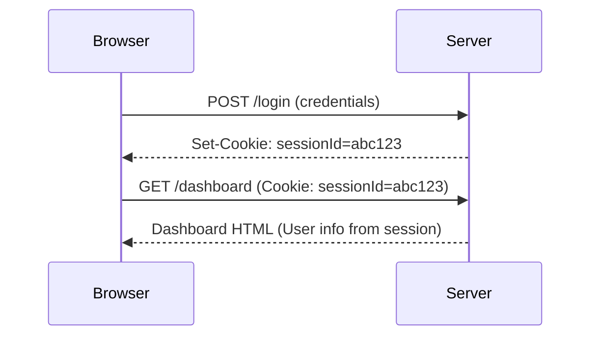
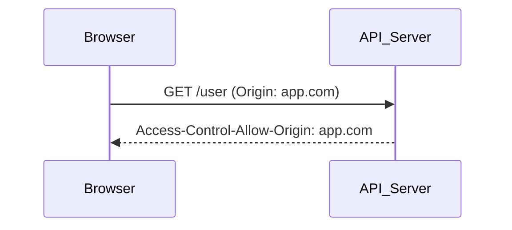
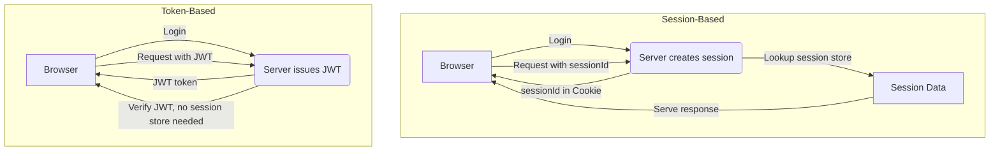
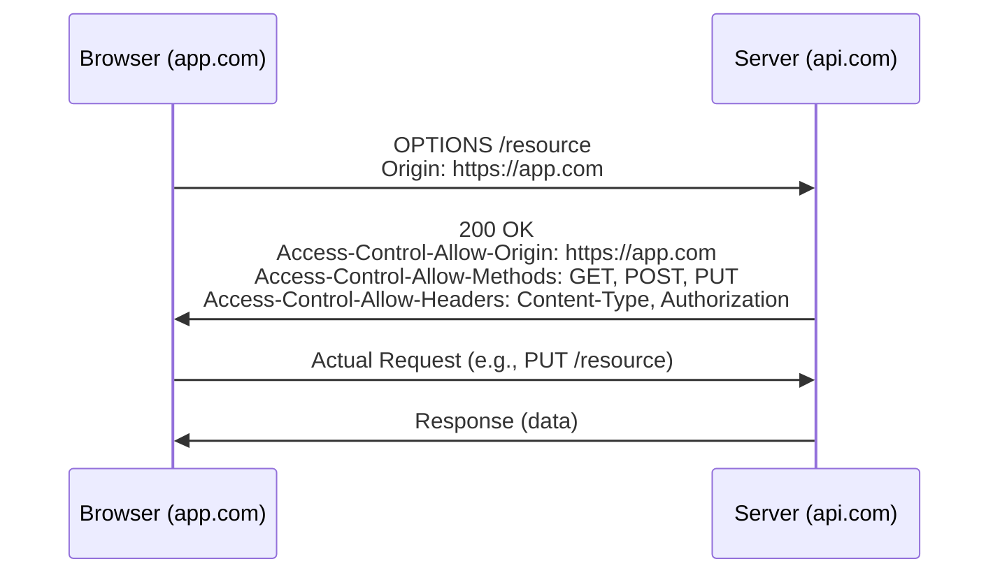

# Section 1

Certainly! Here’s a comprehensive **Markdown blog section** that integrates all the core ideas from both the transcript and slides, with code snippets, diagrams (ASCII art for Markdown), and a dedicated 'Tips and Tricks' section.

---

# Section 5: Web Concepts in System Design

Welcome to Section 5 of our system design journey: **Web Concepts in System Design**. In this section, we’ll break down the key principles that power scalable, efficient, and secure web applications—essentials not only for real-world projects but also for system design interviews.

---

## Why Web Concepts Matter

The web forms the backbone of modern applications—think social media, e-commerce, cloud platforms, and more. Most large-scale systems are built on web-based architectures, so understanding these fundamentals is critical for:

- **Scalability**: Efficiently handling millions of users.
- **Security**: Preventing unauthorized access and vulnerabilities.
- **Performance**: Ensuring seamless and fast user experiences.

**Bonus:** Mastery of these concepts gives you an edge in system design interviews, where questions often revolve around state management, data exchange, cross-origin requests, and optimizing web security.

---

## Agenda

1. **Web Sessions**: Managing State in Web Applications
2. **Serialization**: Data Exchange & Storage Formats
3. **CORS**: Cross-Origin Resource Sharing & Web Security
4. **Summary & Practical Applications**

---

## 1. Web Sessions: Managing State in a Stateless World

### The Challenge: Stateless HTTP

HTTP is **stateless**—each request is independent and carries no memory of previous interactions, which makes it tricky to implement features like user logins, shopping carts, or preferences.

#### Diagram: Stateless HTTP

```
[Browser] --(Request 1)--> [Server]
[Browser] --(Request 2)--> [Server]
(No memory of Request 1 when processing Request 2)
```

### Techniques for Maintaining State

#### 1. **Session-Based Authentication (Server-Side Sessions + Cookies)**

- The server creates a session and stores session data (like user ID) in memory or a database.
- A session ID is sent to the client (usually via a cookie).
- Client includes the session ID in subsequent requests; server uses this to retrieve session info.

**Sequence Diagram:**
```
[Client] --(POST /login)--> [Server]
                |
       [Server creates session]
                |
[Server] --(Set-Cookie: session_id)--> [Client]

[Client] --(GET /dashboard, Cookie: session_id)--> [Server]
[Server] --(Retrieve user from session_id)--> [Process]
```

**Example: Express.js Session Setup**
```javascript
const session = require('express-session');
app.use(session({
  secret: 'your-secret',
  resave: false,
  saveUninitialized: true,
  cookie: { secure: true, httpOnly: true, sameSite: 'Strict' }
}));
```

#### 2. **Token-Based Authentication (JWT, OAuth Tokens)**

- The server issues a signed token (e.g., JWT) after authentication.
- The token encodes user/session info and is sent with each request (usually in the `Authorization` header).
- No server-side session storage needed.

**JWT Example (Node.js with jsonwebtoken):**
```javascript
const jwt = require('jsonwebtoken');
const token = jwt.sign({ userId: user.id }, 'jwt-secret', { expiresIn: '1h' });
// Send token to client; client sends it in Authorization header
```

**Advantages:** Scalable (stateless), easy for microservices.

---

### Security Concerns in Session Management

- **Session Hijacking**: Stolen session IDs grant attackers access.
- **CSRF (Cross-Site Request Forgery)**: Tricking a user’s browser to perform unwanted actions.
- **Mitigations**:
  - Use `Secure`, `HttpOnly`, and `SameSite` cookie attributes.
  - Implement CSRF tokens for sensitive actions.
  - Use HTTPS everywhere.

---

### Scaling Session Management

- **Sticky Sessions**: Pin users to the same server (not ideal for scaling).
- **Distributed Sessions**: Use shared storage like Redis or Memcached for session data.
- **Stateless Auth**: JWTs are ideal for distributed, scalable systems.

**Distributed Session Example (Express + Redis):**
```javascript
const RedisStore = require('connect-redis')(session);
app.use(session({
  store: new RedisStore({ client: redisClient }),
  secret: 'secret',
  resave: false,
  saveUninitialized: false
}));
```

---

## 2. Serialization: Data Exchange & Storage Formats

### What is Serialization?

Serialization is the process of converting complex data structures (like objects) into a format suitable for transmission or storage (e.g., JSON, XML, Protobuf). **Deserialization** is the reverse.

#### Why Serialization?
- Enables APIs to exchange structured data.
- Used in caching, databases, and distributed systems.

### Common Formats

| Format          | Readability     | Efficiency  | Use Case                |
|-----------------|----------------|-------------|-------------------------|
| **JSON**        | Human-readable | Medium      | REST APIs, web apps     |
| **XML**         | Verbose        | Low         | Legacy systems, configs |
| **Protobuf**    | Not readable   | High        | gRPC, high-perf APIs    |
| **Avro**        | Not readable   | High        | Big Data                |
| **BSON**        | Not readable   | Medium      | MongoDB (NoSQL DB)      |

**Example: JSON Serialization in JavaScript**
```javascript
const user = { id: 1, name: 'Alice' };
const jsonString = JSON.stringify(user);
// '{"id":1,"name":"Alice"}'
```

**Example: Protobuf (Node.js)**
```proto
// user.proto
message User {
  int32 id = 1;
  string name = 2;
}
```
```javascript
// Usage with protobufjs in Node.js
const User = root.lookupType('User');
const buffer = User.encode({ id: 1, name: 'Alice' }).finish();
```

### Trade-offs

- **Readability**: JSON, XML are human-friendly.
- **Efficiency**: Protobuf and Avro are compact, reduce bandwidth and parsing time.
- **Compatibility**: XML supports schema evolution, JSON less so, Protobuf/Avro require schema management.

### Serialization in Practice

- **APIs**: REST uses JSON; gRPC uses Protobuf.
- **Caching**: Redis and Memcached store serialized data.
- **Big Data**: Avro/Protobuf for efficient storage and schema evolution.

---

## 3. CORS: Cross-Origin Resource Sharing & Web Security

### The Problem: Same-Origin Policy (SOP)

Browsers enforce the **Same-Origin Policy**, blocking web pages from making requests to a different domain for security reasons.

#### Diagram: SOP in Action

```
[myapp.com] --X--> [api.other.com]
(Cross-origin request blocked unless CORS is enabled)
```

### The Solution: CORS

**CORS** is a server-side mechanism that allows controlled cross-origin requests.

- **Server** sets specific HTTP headers to allow access.
- **Access-Control-Allow-Origin**: Specifies which domains can access the resource.
- **Preflight Requests**: For non-simple requests (e.g., with custom headers), the browser sends an `OPTIONS` request first.

**Example: Express.js CORS Setup**
```javascript
const cors = require('cors');
app.use(cors({
  origin: ['https://trusted.com'], // Whitelisted origins
  methods: ['GET', 'POST'],
  credentials: true
}));
```

**CORS Response Headers Example**
```
Access-Control-Allow-Origin: https://trusted.com
Access-Control-Allow-Methods: GET, POST
Access-Control-Allow-Headers: Content-Type, Authorization
```

### Common Security Risks

- **Overly Permissive Origins**: `Access-Control-Allow-Origin: *` exposes APIs to any site.
- **Credentials with Wildcard**: Never use `Access-Control-Allow-Credentials: true` with `*`.
- **Sensitive Endpoints Exposed**: Misconfigurations can leak private data.

**Mitigations:**

- Always use a whitelist of trusted origins.
- Separate public and private APIs and enforce correct CORS headers.
- Use API Gateways or Reverse Proxies (like Nginx) to centralize and standardize CORS handling.

**Nginx Reverse Proxy Example**
```nginx
location /api/ {
    proxy_pass http://backend;
    add_header Access-Control-Allow-Origin https://trusted.com;
    add_header Access-Control-Allow-Methods 'GET, POST, OPTIONS';
}
```

---

## Tips and Tricks

- **Use `HttpOnly` and `Secure` flags** for cookies to reduce XSS and session hijacking risks.
- **Leverage JWTs** for scalable authentication in microservices; but remember to handle token expiry and revocation.
- **Choose serialization formats wisely**: JSON for general APIs, Protobuf for performance-critical services, Avro for big data pipelines.
- **Never allow `Access-Control-Allow-Origin: *` with credentials** in CORS—this is a critical vulnerability.
- **Centralize session storage** (e.g., Redis) when scaling web servers to avoid sticky sessions and data loss.
- **Monitor CORS headers** in production using tools like browser dev tools or curl to ensure policies are enforced.
- **Practice with interview scenarios:** Explain how you’d handle sessions, serialization, or CORS in cloud or microservice environments.

---

## Summary & Key Takeaways

- **Web sessions**: Maintain state in a stateless protocol using cookies, server-side sessions, or token-based authentication (JWT).
- **Serialization**: Crucial for data exchange—choose the right format for your performance, readability, and compatibility needs.
- **CORS**: Enforces browser security but must be configured properly to enable legitimate cross-origin communication without exposing vulnerabilities.
- **Scalability & Security**: Design your web systems with distributed session storage, stateless authentication, and robust CORS policies.

---

**Up Next:** Diving deeper into scalability in system design!

---

*Stay tuned for more practical applications, interview scenarios, and code walkthroughs in upcoming sections!*

---

# Section 2

Certainly! Here’s a detailed Markdown blog section that integrates the ideas from your transcript and slides, including code snippets, diagrams (using Mermaid for visual explanations), and practical tips. 

---

# Mastering Web Sessions, Serialization, and CORS: Web Concepts for System Design

In today's distributed, scalable web systems, understanding how to manage state, exchange data efficiently, and secure cross-origin interactions is critical. In this section, we'll dive deep into three fundamental concepts for system design interviews and real-world architecture:

- **Web Sessions & State Management**
- **Serialization: Data Exchange & Storage Formats**
- **CORS: Cross-Origin Resource Sharing & Web Security**

---

## 1. Web Sessions: Managing State in Stateless HTTP

### Why Web Sessions Matter

Web applications often need to remember user logins, shopping carts, or preferences. But HTTP—the backbone protocol of the web—is *stateless*: each request is independent, with no memory of past interactions. Without session management, you’d have to log in on every page!

#### Statelessness in HTTP



### Techniques for Maintaining State

Two primary approaches:

#### 1. **Session-Based Authentication**

- **Server**: Stores session data (user info, cart, etc.) in memory or a database.
- **Client**: Stores only a **session ID** (usually in a cookie).



**Node.js (Express) Example:**

```js
const express = require('express');
const session = require('express-session');

const app = express();

app.use(session({
  secret: 'yourSecret',
  resave: false,
  saveUninitialized: true,
  cookie: { secure: true, httpOnly: true, sameSite: 'Strict' }
}));

app.post('/login', (req, res) => {
  // Authenticate user...
  req.session.userId = user.id; // Store in session
  res.send('Logged in!');
});
```

> **Scaling Tip:** Use session stores like Redis for distributed systems.
>
> ```js
> const RedisStore = require('connect-redis')(session);
> app.use(session({
>   store: new RedisStore({ client: redisClient }),
>   // ... other options
> }));
> ```

#### 2. **Token-Based Authentication (JWT, OAuth)**

- All session data is **encoded in a token** (e.g., JWT) that the client sends with each request.
- Server is stateless; just verifies the token.

**JWT Example (Node.js):**

```js
const jwt = require('jsonwebtoken');

const token = jwt.sign({ userId: user.id }, 'shhSecret', { expiresIn: '1h' });

// On client: store token in localStorage or an HttpOnly cookie
// On each request:
app.get('/protected', (req, res) => {
  const token = req.headers['authorization'].split(' ')[1];
  const payload = jwt.verify(token, 'shhSecret');
  // Use payload.userId ...
});
```

#### Comparison Table

| Feature            | Session-based        | Token-based (JWT/OAuth)  |
|--------------------|---------------------|--------------------------|
| Storage            | Server-side         | Client-side (self-contained) |
| Scalability        | Harder (needs shared session store) | Easier (stateless)   |
| Security           | SessionID must be protected; shorter expiry | Token can leak info if not encrypted; shorter expiry & validation needed |
| Use Cases          | Classic web apps    | APIs, microservices, mobile |

### Security Concerns & Mitigations

- **Session Hijacking**: Use HTTPS, regenerate session IDs, set short expiry.
- **CSRF**: Use CSRF tokens, SameSite cookies, require user confirmation for sensitive actions.
- **Cookie Theft**: Set cookies with `Secure`, `HttpOnly`, and `SameSite` flags.

```js
// Secure cookie example in Express
res.cookie('sessionId', 'abc123', {
  secure: true,      // Only over HTTPS
  httpOnly: true,    // Not accessible via JS
  sameSite: 'Strict' // No cross-site sending
});
```

### Best Practices for Scaling Session Management

- **Sticky Sessions**: Route a user's requests to the same server (simple, but not scalable).
- **Distributed Sessions**: Store session data in external stores like Redis/Memcached.
- **Stateless JWT**: For APIs and microservices, favor token-based stateless auth.

---

## 2. Serialization: Data Exchange & Storage Formats

### What Is Serialization?

Serialization is converting objects into a format (e.g., JSON, Protobuf) for transmission or storage. Deserialization is the reverse.

#### Why Is It Important?

- Enables APIs to transfer structured data.
- Used in caching, databases, and inter-service communication.

### Common Serialization Formats

| Format      | Readability      | Efficiency       | Compatibility      | Use Cases              |
|-------------|-----------------|------------------|--------------------|------------------------|
| JSON        | High            | Moderate         | Widespread         | REST APIs, web apps    |
| XML         | High (verbose)  | Low              | Strong (schemas)   | Legacy systems, config |
| Protobuf    | Low             | High             | Requires schema    | gRPC, big data         |
| Avro        | Low             | High             | Schema evolution   | Big data (Hadoop)      |

#### Example: JSON vs. Protobuf

**JSON:**

```json
{
  "userId": 123,
  "username": "alice"
}
```

**Protobuf (schema):**

```protobuf
message User {
  int32 userId = 1;
  string username = 2;
}
```

### Trade-offs

- **Readability**: JSON, XML are human-readable.
- **Efficiency**: Protobuf, Avro are compact (binary), faster to transmit/parse.
- **Compatibility**: XML supports complex schemas; JSON less so.

### Serialization in APIs, Caching, and Storage

- **REST APIs**: Use JSON.
- **gRPC APIs**: Use Protobuf.
- **Redis/Memcached**: Often store JSON or binary blobs.
- **MongoDB**: Uses BSON (Binary JSON).

### Performance Considerations

- **Bandwidth**: Binary formats save bandwidth.
- **CPU/Memory**: Parsing binary is faster, but needs schema definitions.
- **Ecosystem**: JSON is universal but less efficient for high-throughput systems.

---

## 3. CORS: Cross-Origin Resource Sharing & Web Security

### Why CORS Matters

Browsers enforce the **Same-Origin Policy (SOP)**: scripts on one origin (domain) can't access resources from another. But modern apps need to call APIs hosted elsewhere (e.g., frontend on `app.com`, API on `api.com`).

**CORS** is the browser/server mechanism that enables safe cross-origin requests.

#### How CORS Works



#### CORS Request Types

- **Simple Requests**: GET/POST without custom headers.
- **Preflight Requests**: OPTIONS request sent before PUT/DELETE/custom headers.

```http
OPTIONS /user HTTP/1.1
Origin: https://app.com
Access-Control-Request-Method: PUT
Access-Control-Request-Headers: Authorization
```

**Server Response:**
```http
Access-Control-Allow-Origin: https://app.com
Access-Control-Allow-Methods: GET, POST, PUT
Access-Control-Allow-Headers: Authorization
```

#### Security Risks & Mitigations

- **Overly Permissive CORS**: `Access-Control-Allow-Origin: *` is dangerous for sensitive APIs.
- **Allowing Credentials with Wildcard**: Never set `Access-Control-Allow-Credentials: true` with `*` origin.
- **Mitigation**: Whitelist trusted origins, use API gateways or reverse proxies for strict control.

**Express.js CORS Example:**
```js
const cors = require('cors');

app.use(cors({
  origin: 'https://app.com',
  credentials: true,
  allowedHeaders: ['Authorization', 'Content-Type'],
  methods: ['GET', 'POST', 'PUT']
}));
```

---

## Tips and Tricks

- **Session Management**
    - Always use HTTPS to protect session IDs and tokens.
    - Regenerate session IDs after login and logout.
    - For distributed systems, externalize session storage (e.g., Redis).
    - Prefer stateless JWTs for microservices and APIs, but invalidate tokens on password changes.

- **Serialization**
    - Use JSON for web APIs unless high efficiency is required.
    - For high-throughput APIs (e.g., gRPC), prefer Protobuf or Avro.
    - Validate and sanitize data on deserialization to prevent vulnerabilities.

- **CORS**
    - Never use `*` as allowed origin for authenticated APIs.
    - For APIs consumed by multiple frontends, use a whitelist or dynamically validate origins.
    - Handle CORS at the API gateway for centralized policy enforcement.

---

## Diagram: Web Session Flow (Session-Based vs Token-Based)



---

## Summary & Key Takeaways

- **HTTP is stateless**: Use sessions or tokens for stateful user experiences.
- **Serialization** enables efficient data exchange; choose format based on use case.
- **CORS** controls cross-origin access—configure it securely.
- **Security & Scalability**: Always assess your session, serialization, and cross-origin strategies for both.

---

**Next Up:** Dive into [Serialization: Data Exchange & Storage Formats](#) and learn how to choose the best format for your APIs and storage solutions!

---

*Stay tuned for more practical system design concepts and interview-ready explanations!*

# Section 3

Certainly! Here’s a comprehensive Markdown blog section on **Serialization: Data Exchange & Storage Formats**, integrating both the lecture transcript and the slide content, enriched with code snippets, diagrams (ASCII), and a practical ‘Tips and Tricks’ section.

---

# Serialization: Data Exchange & Storage Formats

## What is Serialization?

Serialization is the process of converting complex objects or data structures into a format that can be easily transmitted over a network or stored in a file or database. The reverse process—converting the serialized data back into an object—is called **deserialization**.

Serialization is at the core of system design, especially when building APIs, distributed systems, caching, and data storage solutions.

---

### Why Does Serialization Matter?

- **Data Exchange:** Enables structured data to move between systems, often written in different languages.
- **Storage:** Efficiently saves objects in databases or cache.
- **Performance:** Impacts bandwidth, memory, and CPU usage.
- **Interoperability:** Makes communication possible in microservices and distributed architectures.

---

## Common Serialization Formats

Let’s explore the most widely used serialization formats, their characteristics, and trade-offs.

### 1. JSON (JavaScript Object Notation)

- **Human-readable**, text-based.
- **Widely supported** across programming languages.
- **Simple key-value** structure, ideal for REST APIs and front-end applications.
- **Drawback:** Larger payloads compared to binary formats, leading to higher bandwidth usage.

**Example (Python):**

```python
import json

data = {
    'id': 123,
    'name': 'Alice',
    'roles': ['admin', 'user']
}

# Serialization
json_str = json.dumps(data)
print(json_str)  # {"id": 123, "name": "Alice", "roles": ["admin", "user"]}

# Deserialization
parsed_data = json.loads(json_str)
print(parsed_data['name'])  # Alice
```

---

### 2. XML (Extensible Markup Language)

- **Tag-based** markup language.
- **Supports complex hierarchies** and strict schema validation.
- Used in **legacy enterprise systems**, configuration files, and certain industries (e.g., finance).
- **Drawback:** Extremely verbose—larger than JSON, less efficient for data transmission.

**Example (Python with xml.etree):**

```python
import xml.etree.ElementTree as ET

data = ET.Element('user')
ET.SubElement(data, 'id').text = '123'
ET.SubElement(data, 'name').text = 'Alice'

xml_str = ET.tostring(data)
print(xml_str.decode())  # <user><id>123</id><name>Alice</name></user>
```

---

### 3. Protocol Buffers (Protobuf)

- Developed by **Google**.
- **Binary format**—compact and fast.
- **Requires a predefined schema** (IDL).
- Used in **gRPC APIs**, microservices, and high-performance systems.
- **Drawback:** Not human-readable, adds schema management complexity.

**Example `.proto` schema:**

```proto
syntax = "proto3";

message User {
  int32 id = 1;
  string name = 2;
  repeated string roles = 3;
}
```

**Python usage:**

```python
# Requires: pip install protobuf
from user_pb2 import User

user = User(id=123, name='Alice', roles=['admin', 'user'])
serialized = user.SerializeToString()
print(serialized)  # Binary data

# Deserialization
new_user = User()
new_user.ParseFromString(serialized)
print(new_user.name)  # Alice
```

---

### 4. BSON, Avro, and Others

- **BSON:** Binary JSON (used by MongoDB).
- **Avro:** Common in big data pipelines (supports schema evolution).

---

## Trade-Offs: Readability, Efficiency, Compatibility

| Format      | Readability     | Efficiency       | Compatibility               |
|-------------|----------------|------------------|-----------------------------|
| JSON        | High           | Medium           | Good, limited schema        |
| XML         | High           | Low (verbose)    | Strong schema, metadata     |
| Protobuf    | Low (binary)   | High             | Requires schema, supports versioning |
| Avro        | Low            | High             | Schema evolution            |
| BSON        | Medium         | High             | Used in NoSQL (MongoDB)     |

---

## Serialization in Action

### Where is Serialization Used?

- **APIs:** 
  - REST APIs → JSON  
  - gRPC APIs → Protobuf  
  - SOAP (legacy) → XML

- **Caching:** 
  - Redis/Memcached store JSON or Protobuf for fast retrieval.

- **Databases:** 
  - MongoDB uses BSON.
  - Big data stores (Hadoop, Kafka) use Avro/Protobuf.

---

### ASCII Diagram: Data Flow with Serialization

```
+-----------------+         (serialize)         +----------------+
|    Web Server   |  ----------------------->   |    Database    |
|   (Python obj)  |                             | (JSON/BSON)    |
+-----------------+                             +----------------+
         ^                                             |
         |          (deserialize)                      |
         +-----------------------<---------------------+
```

---

## Performance Considerations

- **JSON/XML:** Text-based, larger payload, slow parsing.
- **Protobuf/Avro:** Binary, compact, fast parsing (but needs schema).
- **Bandwidth & CPU:** Choosing the right format affects network traffic and system resources.

---

### Example: Comparing Payload Sizes

| Format   | Sample Data Size |
|----------|-----------------|
| JSON     | 150 bytes       |
| XML      | 220 bytes       |
| Protobuf | 50 bytes        |

---

## Tips and Tricks

### 1. **Choose the Right Format for the Use Case**
- **APIs:** Prefer JSON for REST; Protobuf for gRPC.
- **Performance-critical:** Use Protobuf or Avro.
- **Human inspection/debugging:** Use JSON.

### 2. **Schema Management**
- For Protobuf/Avro, maintain versioned schemas for compatibility.

### 3. **Security**
- **Never deserialize untrusted data** without validation (risk of code execution / exploits).
- Sanitize and validate data post-deserialization.

### 4. **Compression**
- For large JSON/XML payloads, use gzip or similar compression in transit.

### 5. **Testing**
- Always test serialization/deserialization logic for edge cases and compatibility across language boundaries.

### 6. **Monitoring**
- Track payload sizes and serialization/deserialization times for performance bottlenecks.

---

## Interview Questions Cheat Sheet

- What is serialization and where is it used?
- Compare JSON, XML, Protobuf, and Avro.
- Why use Protobuf in gRPC?
- How does serialization affect API performance?
- What are the security risks with serialization?
- Why does MongoDB use BSON?
- How does Avro help in big data systems?
- What are the trade-offs between readability and efficiency in serialization?

---

## Summary

- **Serialization** enables efficient transmission and storage of structured data across systems.
- **JSON** is best for web APIs (human-readable, widely supported).
- **Protobuf/Avro** are optimal for high-performance or big data use cases.
- **XML** remains in use for legacy and schema-rich enterprise applications.
- **Choosing the right serialization format impacts performance, readability, compatibility, and security.**

---

> **Next Up:**  
> Learn about CORS (Cross-Origin Resource Sharing) and web security—a crucial topic for modern web application safety and interoperability!

---

**Diagram sources:** Custom ASCII  
**Code samples:** Python, Protocol Buffers

---

**Stay tuned for more system design deep-dives, and don’t forget to review the attached PDF for detailed interview question answers!**

# Section 4

Certainly! Here’s a detailed blog section on **CORS: Cross-Origin Resource Sharing & Web Security** that integrates both your transcript and slides, including code snippets, diagram suggestions, and a ‘Tips and Tricks’ section.

---

# 🌐 CORS: Cross-Origin Resource Sharing & Web Security

Modern web applications are no longer siloed on a single domain—they often depend on APIs and services spread across different domains. But this flexibility introduces critical security challenges. Browsers enforce the **Same-Origin Policy (SOP)** to prevent malicious cross-origin requests, but legitimate use cases require controlled exceptions. That’s where **CORS (Cross-Origin Resource Sharing)** comes in.

---

## 🚧 The Problem: Same-Origin Policy

**Same-Origin Policy** is a browser security feature that restricts web pages from making requests to a different domain (origin) than the one that served the web page. This prevents unauthorized web pages (potentially malicious) from reading sensitive data from another origin.

**Example Scenario:**
- Your frontend is hosted at `https://app.com`
- Your backend API is at `https://api.com`
- By default, browser **blocks** requests from `app.com` to `api.com`

---

## 🛠️ The Solution: What is CORS?

**CORS** is a server-side mechanism that allows a server to specify who (which origins) can access its resources and how. It does so using specific HTTP headers in responses.

> **Key Point:**  
> CORS is always enforced by browsers and is entirely controlled by server-side configuration.  
> _If the server doesn’t allow it, the browser will block the request._

---

## 🔍 How CORS Works

When a browser detects a cross-origin request, it does one of two things depending on the request’s complexity:

### 1. **Simple Requests**
- Use methods like `GET`, `POST` (no custom headers or content types)
- Browser adds an `Origin` header automatically
- Server must respond with:
  ```
  Access-Control-Allow-Origin: https://app.com
  ```
- If the header is absent or incorrect, the browser blocks the response.

### 2. **Preflight Requests**
- For methods like `PUT`, `DELETE`, or requests with custom headers (e.g., `Authorization`)
- **Before** sending the actual request, the browser sends an `OPTIONS` request to the server
- The server responds with headers to indicate what’s allowed
- If approved, the browser sends the actual request

#### **Preflight Flow Diagram**


---

## 🏷️ Key CORS Headers

| Header                           | Purpose                                                                                 |
|-----------------------------------|-----------------------------------------------------------------------------------------|
| `Access-Control-Allow-Origin`     | Specifies the permitted origin(s) (e.g., `https://app.com`, or `*` for any)             |
| `Access-Control-Allow-Methods`    | Allowed HTTP methods (e.g., `GET, POST, PUT`)                                           |
| `Access-Control-Allow-Headers`    | Allowed custom headers (e.g., `Authorization, Content-Type`)                            |
| `Access-Control-Allow-Credentials`| Indicates if cookies/credentials can be sent (must **not** be used with `*` origin)     |

---

## 🧑‍💻 Implementing CORS: Code Examples

### **Node.js (Express.js) Example**

```js
const express = require('express');
const cors = require('cors');

const app = express();

// Allow only specific origins
const allowedOrigins = ['https://app.com', 'https://admin.app.com'];

app.use(cors({
  origin: function(origin, callback) {
    if (!origin || allowedOrigins.includes(origin)) {
      callback(null, true);
    } else {
      callback(new Error('Not allowed by CORS'));
    }
  },
  methods: ['GET', 'POST', 'PUT', 'DELETE'],
  allowedHeaders: ['Content-Type', 'Authorization'],
  credentials: true // Allow cookies if needed
}));

app.get('/api/data', (req, res) => {
  res.json({ message: "CORS-secured data" });
});

app.listen(3000);
```

### **Spring Boot Example**
```java
// Controller-level CORS config
@CrossOrigin(origins = "https://app.com", allowedHeaders = "*", allowCredentials = "true")
@RestController
public class ApiController {
    @GetMapping("/api/data")
    public ResponseEntity<String> getData() {
        return ResponseEntity.ok("CORS-secured data");
    }
}
```

---

## ⚠️ Security Risks & Common Misconfigurations

| Risk | Description | Example |
|------|-------------|---------|
| **Overly Permissive Origins** | Allowing `Access-Control-Allow-Origin: *` exposes your API to any website. | Any website can read sensitive API data. |
| **Allowing Credentials with Wildcard Origin** | `Access-Control-Allow-Credentials: true` **and** `Access-Control-Allow-Origin: *` is blocked by browsers, but can still be misconfigured. | May inadvertently leak cookies or tokens. |
| **Exposing Sensitive APIs** | Internal APIs exposed to the public due to lax CORS. | Data leakage or unauthorized actions. |

### **Mitigation Strategies**
- Use a **whitelist** of trusted origins.
- Set **specific CORS policies per API endpoint** (not a global wildcard).
- Use a **reverse proxy or API gateway** to centralize and manage CORS.

---

## 🚦 Handling CORS in REST & GraphQL APIs

- **REST APIs:** Use built-in CORS tools in frameworks (Express.js, Spring Boot, Django).
- **GraphQL APIs:** Also require CORS, especially since mutations often use `POST` and custom headers.
- **Preflight requests** are common for both, especially with complex or authenticated requests.

---

## 🔄 Alternatives to CORS

### **Reverse Proxy**
- Use NGINX, Apache, or similar as a reverse proxy.
- Client requests hit the frontend server, which proxies them to the backend, **appearing as same-origin**.
- **CORS is bypassed** because the browser sees the request as same-origin.

**NGINX Example:**
```nginx
server {
    listen 80;
    server_name app.com;
    
    location /api/ {
        proxy_pass http://api.com/api/;
        proxy_set_header Host $host;
        # Add any needed headers here
    }
}
```

### **API Gateway**
- AWS API Gateway, Azure API Management, etc.
- Centralized CORS policy for all microservices.
- Simplifies security and reduces misconfiguration risk.

---

## 💡 Tips and Tricks

- **Never use a wildcard (`*`) origin for sensitive APIs.** Always specify allowed origins.
- **Set `Access-Control-Allow-Credentials: true` only when absolutely necessary** (e.g., cookies for authentication), and **never with a wildcard origin**.
- **Test CORS settings in both development and production**. Misconfigurations often go unnoticed until deployment.
- **Centralize CORS management** with a proxy or API gateway in microservice architectures.
- **Use browser developer tools** (Network tab) to debug CORS errors—check the **preflight** and actual requests.
- **Automate CORS header configuration** where possible to avoid manual errors.
- **Educate your team** about the security implications of CORS. A common cause of breaches is lack of awareness.

---

## 📝 Interview Questions to Practice

1. What is the Same-Origin Policy, and why does it exist?
2. How does CORS enable cross-origin requests?
3. What is a preflight request, and when is it required?
4. How do you configure CORS headers on a server?
5. What are common security risks associated with CORS?
6. What are alternatives to CORS for handling cross-origin requests?
7. How do API Gateways and Reverse Proxies help with CORS?

---

## 🏁 Summary

- **CORS** enables secure, controlled cross-origin communication in modern web applications.
- **Proper configuration** is essential to avoid security vulnerabilities.
- **Reverse proxies and API gateways** offer robust alternatives and centralized management.
- **Always balance openness and security** by whitelisting origins and restricting credentials.

---

### 📚 Next Steps

In the next section, we’ll tie together web security, session management, and serialization to see how they fit into scalable, secure system design.

---

**References and Further Reading:**
- [MDN Web Docs: CORS](https://developer.mozilla.org/en-US/docs/Web/HTTP/CORS)
- [OWASP: CORS Security](https://owasp.org/www-community/attacks/CORS_OriginHeaderScrutiny)
- [Express.js CORS Middleware](https://expressjs.com/en/resources/middleware/cors.html)
- [AWS API Gateway CORS](https://docs.aws.amazon.com/apigateway/latest/developerguide/how-to-cors.html)

---

*Happy (and secure) coding!*

# Section 5

Certainly! Below is a **detailed Markdown blog section** that integrates the transcript and the slides. It is structured, includes diagrams (in Markdown/ASCII where possible), code snippets, and a “Tips and Tricks” section.

---

# 🕸️ Web Concepts in System Design: Foundations for Scalability and Security

Understanding web fundamentals is essential for designing robust, scalable, and secure systems. In this section, we'll cover how web applications manage state, exchange data, and enforce security boundaries, all of which are crucial for modern backend and frontend architects.

---

## Section Outline

1. [How Web Applications Work](#how-web-applications-work)
2. [Managing State: Web Sessions](#managing-state-web-sessions)
3. [Serialization: Data Exchange & Storage Formats](#serialization-data-exchange--storage-formats)
4. [CORS & Web Security](#cors--web-security)
5. [Summary & Key Takeaways](#summary--key-takeaways)
6. [Tips and Tricks](#tips-and-tricks)

---

## How Web Applications Work

Before diving into advanced topics, let’s recap the basics:

**Client-Server Model**

```plaintext
+------------+         HTTP Request         +------------+
|  Browser   |  ------------------------->  |   Server   |
| (Frontend) |  <-------------------------  | (Backend)  |
+------------+         HTTP Response        +------------+
```

- **Stateless Protocol**: HTTP doesn’t remember previous requests; every interaction is independent.
- **Stateful Needs**: Web apps often need to track information (like login state or a shopping cart) across multiple requests.
- **Security, Scalability, Performance**: These are core considerations for any design.

---

## Managing State: Web Sessions

### Why Sessions Matter

- **HTTP is stateless**, but most applications need to persist state across requests (e.g., user login).
- **Session management** is how we bridge this gap.

### Techniques for Session Management

#### 1. Session-Based Authentication (Server-Side Sessions)

- **How it works**: Server creates a session and stores state; sends a session ID to the client (usually in a cookie).
- **Client**: Stores only the session ID.

```plaintext
+--------+         Login Request         +--------+
| Client |  -------------------------->  | Server |
+--------+                              +--------+
   |                                         |
   |<----------- Set-Cookie: sessionId ------|
   |                                         |
(next requests include sessionId in cookie)
```

**Sample Express.js Code:**

```js
// Server-side session using express-session
const session = require('express-session');
app.use(session({
  secret: 'your-secret-key',
  resave: false,
  saveUninitialized: true,
  cookie: { secure: true, httpOnly: true, sameSite: 'Strict' }
}));
```

#### 2. Token-Based Authentication (Stateless, e.g., JWT, OAuth)

- **How it works**: Server issues a signed token (e.g., JWT) that contains all user info; subsequent requests include the token in headers.
- **No server memory** needed for session state.

**JWT Example:**

```js
// Creating a JWT token
const jwt = require('jsonwebtoken');
const token = jwt.sign({ userId: 123 }, 'your-secret-key', { expiresIn: '1h' });

// Verifying a JWT token
jwt.verify(token, 'your-secret-key', (err, decoded) => {
  if (err) return res.sendStatus(403);
  // decoded.userId available
});
```

---

### Security Concerns

- **Session Hijacking**: Stealing cookies/session IDs.
- **CSRF (Cross-Site Request Forgery)**: Malicious sites causing unwanted actions in authenticated sessions.
- **Cookie Flags**: Use `Secure`, `HttpOnly`, and `SameSite` attributes.

```js
// Example: Setting secure cookies
res.cookie('sessionId', value, { secure: true, httpOnly: true, sameSite: 'Strict' });
```

---

### Scaling Session Management

- **Sticky Sessions**: Route users to the same server (not scalable).
- **Distributed Sessions**: Store sessions in centralized stores (e.g., Redis, Memcached) for scalability.
- **Stateless Auth (JWT)**: No server storage required; ideal for microservices.

---

## Serialization: Data Exchange & Storage Formats

### Why Serialization?

- **Objective**: Convert complex objects into a format for network transmission or storage.
- Used in **APIs**, **databases**, **caching**, and **distributed systems**.

### Common Serialization Formats

| Format        | Readable | Efficient | Used In              | Notes                        |
|---------------|----------|-----------|----------------------|------------------------------|
| JSON          | ✔️       | ❌        | REST APIs, Web Apps  | Human-friendly, large size   |
| XML           | ✔️       | ❌        | Legacy, Config Files | Verbose, schema support      |
| Protocol Buffers (Protobuf) | ❌   | ✔️        | gRPC, Big Data         | Binary, needs schema         |
| Avro          | ❌       | ✔️        | Big Data             | Supports schema evolution    |

**JSON Example:**

```json
{ "userId": 123, "name": "Alice" }
```

**Protobuf Example:**
```proto
message User {
  int32 userId = 1;
  string name = 2;
}
```

**Trade-offs:**
- **Readability**: JSON/XML are human-readable, but less efficient.
- **Efficiency**: Protobuf/Avro are compact, but need schemas.
- **Compatibility**: XML supports schema evolution; JSON less so.

---

### Serialization in Action

- **APIs**: REST uses JSON; gRPC uses Protobuf.
- **Caching**: Redis/Memcached store serialized data.
- **Databases**: MongoDB uses BSON (Binary JSON).

---

### Performance Considerations

- Serialization format impacts **bandwidth**, **CPU**, and **memory**.
- **JSON/XML**: Larger payloads, slower parsing.
- **Protobuf**: Smaller, faster, but requires schema management.

---

## CORS & Web Security

### The Problem: Same-Origin Policy (SOP)

- Browsers **block cross-origin requests** by default for security.
- But modern apps need to call APIs on different domains.

**Diagram:**

```plaintext
+----------+      GET /api/data      +------------------+
| app.com  |  -------------------->  | api.other.com    |
+----------+   (Blocked by SOP)      +------------------+
```

### The Solution: CORS (Cross-Origin Resource Sharing)

- **CORS** is a server-driven mechanism to allow controlled cross-origin requests.

**How CORS Works**

- **CORS Headers**: Server includes headers like `Access-Control-Allow-Origin` in responses.
- **Simple Requests**: GET/POST (no custom headers).
- **Preflight Requests**: For PUT/DELETE/custom headers, browser sends an `OPTIONS` request first.

**Sample Express.js CORS Setup:**

```js
const cors = require('cors');
app.use(cors({
  origin: 'https://your-frontend.com',
  methods: ['GET', 'POST'],
  credentials: true
}));
```

**CORS Headers Example:**

```http
Access-Control-Allow-Origin: https://your-frontend.com
Access-Control-Allow-Methods: GET, POST
Access-Control-Allow-Headers: Authorization, Content-Type
```

---

### Security Risks & Misconfiguration

- **Overly Permissive (`*`)**: Lets any site access your API.
- **Allowing Credentials with `*`**: Dangerous! Never use `Access-Control-Allow-Credentials: true` with a wildcard origin.
- **Mitigations**: Use a whitelist of trusted origins, configure API gateways or reverse proxies.

---

### Alternatives to CORS

- **Reverse Proxy**: Use Nginx or similar to proxy requests, bypassing browser CORS enforcement.
- **API Gateways**: Centralized control for CORS and security (e.g., AWS API Gateway).

---

## Summary & Key Takeaways

- **HTTP is stateless**: Use sessions or tokens to track user state.
- **Session management**: Balance security and scalability (cookies, JWTs, distributed stores).
- **Serialization**: Choose a format based on your needs (readability vs. efficiency).
- **CORS**: Enforces browser security; configure carefully to avoid vulnerabilities.
- **Scaling up**: Distributed session stores, stateless auth, and efficient data formats are key to scaling.

---

## Tips and Tricks

- **Session Security**
  - Always set `HttpOnly`, `Secure`, and `SameSite` on cookies.
  - Use HTTPS everywhere.
  - Rotate and expire session tokens regularly.

- **Scaling Sessions**
  - Prefer stateless authentication (JWT) for microservices.
  - Use Redis or Memcached for distributed session storage.

- **Choosing Serialization**
  - Use JSON for REST APIs (unless bandwidth is a concern).
  - For high-performance or binary protocols, use Protobuf or Avro.
  - Match serialization format to your database/cache for efficiency.

- **CORS Configuration**
  - Never use `Access-Control-Allow-Origin: *` with credentials.
  - Maintain a whitelist of trusted domains.
  - Consider using an API Gateway or Reverse Proxy for complex setups.

- **Interview Prep**
  - Be ready to discuss trade-offs between session management strategies.
  - Know how to explain CORS, SOP, and common security pitfalls.
  - Understand how serialization impacts system performance and scalability.

---

**Next Up:** In the following section, we’ll dive into **scalability**—what it is, why it matters, and strategies like load balancing, horizontal/vertical scaling, and auto-scaling in the cloud.

Stay tuned for building truly scalable, high-availability systems! 🚀

---

