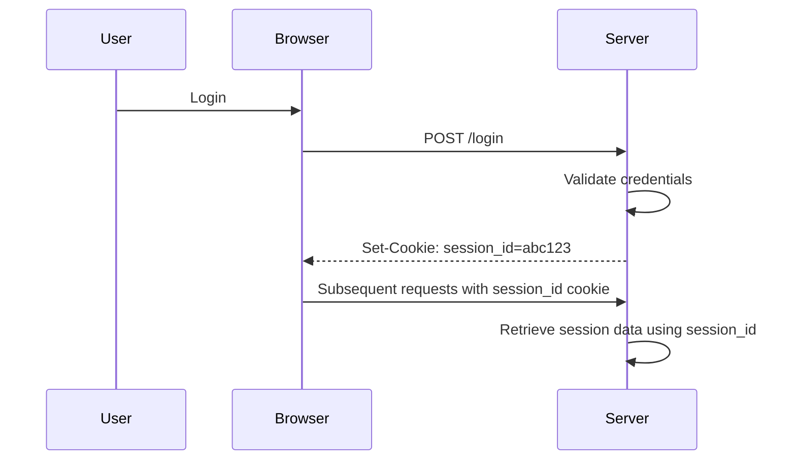
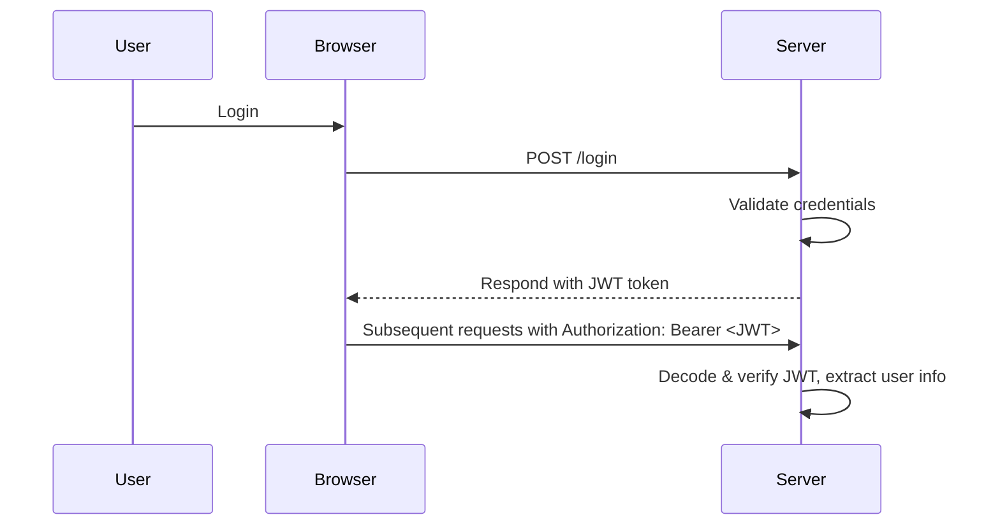
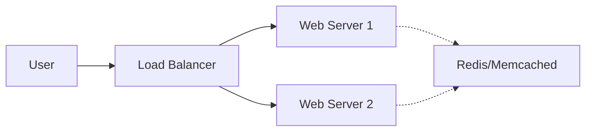
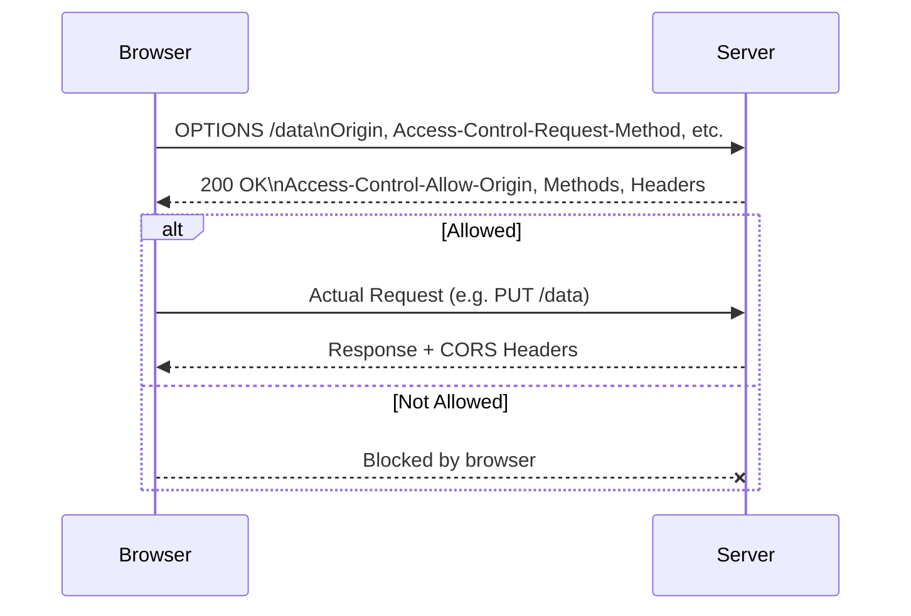
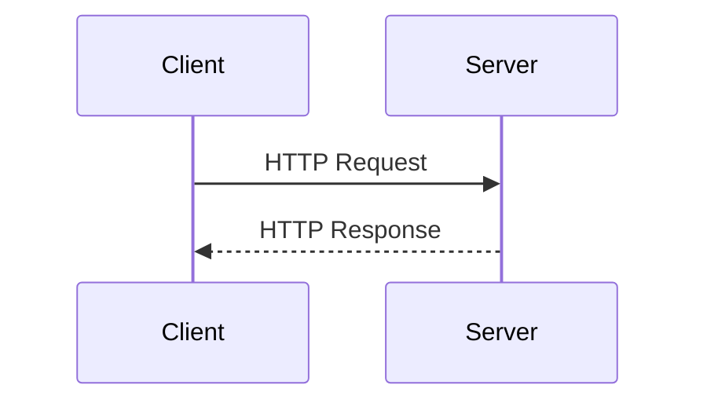

# Section 1

Certainly! I'll create a comprehensive Markdown blog section on **Web Concepts in System Design** that integrates the transcript content and anticipated slide highlights, with explanations, diagrams (in Markdown), code snippets, and a "Tips and Tricks" section.

---

# 🌐 Web Concepts in System Design

Welcome to Section 5 of our System Design series: **Web Concepts in System Design**. In this section, we'll uncover the core principles powering today's web applications, vital for both real-world software and system design interviews.

---

## Why Are Web Concepts So Important in System Design?

The web forms the backbone of modern software—be it social media, e-commerce, or cloud services, virtually every large-scale system relies on web-based architecture. A strong grasp of web concepts ensures your systems are:

- **Efficient:** Handling millions of users smoothly.
- **Scalable:** Growing seamlessly as demand increases.
- **Secure:** Preventing unauthorized access and vulnerabilities.
- **Performant:** Delivering fast responses for great user experience.

**Pro Tip:**  
Web concepts are a frequent topic in system design interviews! Expect questions on state management, cross-origin requests, or data serialization.

---

## 1. Managing State in Stateless HTTP Environments

HTTP is *stateless*. This means each request from a client to a server is independent—the server does **not** retain user state between requests. But most applications need to remember user data (think: login sessions, shopping carts).

### **Common State Management Techniques**

#### A. Cookies

- **Definition:** Small data pieces stored on the client’s browser.
- **Use Case:** Session identifiers, preferences, authentication tokens.

**Example: Setting a Cookie**
```http
Set-Cookie: sessionId=abc123; HttpOnly; Secure; SameSite=Strict
```

#### B. Sessions

- **Definition:** Server-side storage of user data, linked via a session ID (often in a cookie).
- **Scalability Challenge:** In distributed systems, session data must be shared (e.g., via Redis).

**Session Workflow Diagram:**
```
+------------+           +-------------+
|  Browser   | <-------> |   Server    |
+------------+           +-------------+
       ^                      |
       |                      v
   [sessionId in cookie]  [Session Store]
```

#### C. Token-Based Authentication (JWT)

- **Definition:** Client stores a token (often JWT) and sends it with each request.
- **Stateless:** No need for server-side session storage.

**JWT Example:**
```js
// Example JWT payload
{
  "sub": "user123",
  "role": "admin",
  "iat": 1712345678,
  "exp": 1712349278
}
```
**Sending JWT in Header:**
```http
Authorization: Bearer eyJhbGciOiJIUzI1...
```

---

## 2. Serialization: Data Exchange Formats

Serialization is about converting data structures into formats suitable for network transmission.

### **Popular Formats**

| Format         | Human-Readable | Efficient | Widely Supported | Binary / Text      |
| -------------- | -------------- | --------- | ---------------- | ------------------ |
| **JSON**       | Yes            | Good      | Yes              | Text               |
| **XML**        | Yes            | Ok        | Yes              | Text               |
| **Protocol Buffers** | No       | Excellent | Good             | Binary             |

**JSON Example:**
```json
{
  "name": "Alice",
  "age": 30
}
```

**Protocol Buffers Example (schema):**
```proto
message User {
  string name = 1;
  int32 age = 2;
}
```

**Trade-offs:**
- *JSON*: Simple, readable, but less compact.
- *XML*: Verbose, supports complex structures, but heavy.
- *Protocol Buffers*: Compact and fast, but less human-readable.

---

## 3. Web Security: CORS and the Same-Origin Policy

### **Same-Origin Policy (SOP)**
- Browsers restrict web pages from making requests to a different domain.
- Prevents malicious scripts from accessing sensitive data.

### **Cross-Origin Resource Sharing (CORS)**
- A way for servers to allow some cross-origin requests.

**CORS Workflow Diagram:**
```
+-----------+   Request   +-----------+
|  Site A   | ----------> |   API B   |
+-----------+             +-----------+
      |                       |
      |   Preflight OPTIONS   |
      | <-------------------  |
      |                       |
      |   CORS Headers        |
      | <-------------------  |
```

**CORS Headers Example:**
```http
Access-Control-Allow-Origin: https://example.com
Access-Control-Allow-Methods: GET, POST
Access-Control-Allow-Credentials: true
```

---

## 4. Best Practices for Scalable and Secure Web Systems

- **Stateless Servers:** Prefer storing minimal state on the server; use tokens.
- **Centralized Session Store:** For sessions, use distributed stores like Redis.
- **Secure Cookies:** Always use `HttpOnly`, `Secure`, and `SameSite` flags.
- **Minimal CORS:** Only allow origins you trust. Never use `*` for sensitive endpoints.
- **Efficient Serialization:** Use Protocol Buffers or similar for internal APIs.

---

## 5. System Design Interview Tips

- **Explain State Management:** Discuss cookies, sessions, and tokens. Highlight trade-offs.
- **Know Serialization Formats:** When to use JSON, XML, or Protocol Buffers.
- **Describe CORS Clearly:** Explain the same-origin policy and how CORS headers work.
- **Think Scalability:** Mention distributed session stores, stateless authentication.

---

## 💡 Tips and Tricks

- **Session Scaling:** Use sticky sessions *only* when unavoidable; prefer distributed session storage.
- **JWT Caution:** Never store sensitive data in JWT payload; always validate on the server.
- **CORS Debugging:** If facing CORS errors, inspect browser console for blocked headers and server responses.
- **Performance:** Serialize only necessary data; avoid large, nested JSON objects.
- **Security First:** Always validate and sanitize all inputs, even if requests come from "trusted" origins.

---

## 📋 Summary

Understanding web concepts—state management, serialization, and web security—is crucial for building robust, scalable, and secure systems. These are foundational in both real-world applications and interview scenarios. Master them, and you'll be well-equipped for your next design challenge!

---

**Ready to dive deeper?** Let's get started! 🚀

---

# Section 2

Certainly! Below is a detailed Markdown blog section that integrates content from both the provided transcript and slides, with explanations, code snippets, diagrams (using Mermaid for Markdown), and a "Tips and Tricks" section.

---

# Web Sessions and Managing State in Web Applications

Managing user state is foundational for building robust web applications. In this post, we’ll explore **session management**, examine the stateless nature of HTTP, compare session-based and token-based authentication, discuss security risks, and share best practices for scalable, secure systems.

---

## The Stateless Nature of HTTP

HTTP is a **stateless protocol**—each request from the client to the server is independent. The server does not inherently remember previous requests, which means every interaction starts fresh.

**Why is this a challenge?**

- Users would have to log in on every page load.
- Shopping carts and personalized experiences wouldn’t persist.
- Applications would be frustrating and less functional.

**Solution:**  
We need mechanisms to **track user sessions** and maintain state across requests.

---

## Session Management Techniques

There are two main approaches:

### 1. Session-based Authentication

- **Session data** is stored on the server.
- The **client** holds a session ID, usually in a cookie.
- Each request includes the session ID; the server fetches session data using this ID.

**Typical Flow:**



**Sample Code (Express.js + express-session):**

```js
const session = require('express-session');
app.use(session({
  secret: 'your_secret',
  resave: false,
  saveUninitialized: true,
  cookie: { secure: true }
}));

app.post('/login', (req, res) => {
  // Authenticate user
  req.session.userId = user.id;
  res.send('Logged in!');
});
```

**Scalability Concerns:**
- Storing sessions in server memory does **not scale** for distributed systems.
- **Solution:** Use sticky sessions, session replication, or external stores like **Redis**.

### 2. Token-based Authentication

- All session data is **embedded in a signed token** (e.g., JWT - JSON Web Token).
- The server does **not** store session state.
- The client stores the token and sends it with each request (often as an **Authorization** header).

**Typical Flow:**



**Sample JWT Token (decoded):**

```json
{
  "sub": "user123",
  "name": "Alice",
  "roles": ["user"],
  "exp": 1712345678
}
```

**Sample Code (Node.js + jsonwebtoken):**

```js
const jwt = require('jsonwebtoken');
const secret = 'your_jwt_secret';

app.post('/login', (req, res) => {
  // Authenticate user
  const token = jwt.sign({ userId: user.id }, secret, { expiresIn: '1h' });
  res.json({ token });
});

app.get('/profile', (req, res) => {
  const token = req.headers.authorization.split(' ')[1];
  const payload = jwt.verify(token, secret);
  // payload.userId will be available
  res.json({ userId: payload.userId });
});
```

**Scalability Advantages:**
- No server-side session storage needed.
- Ideal for **microservices** and API-driven architectures.

---

## Security Risks in Session Management

Even with the best mechanisms, session management introduces risks:

### 1. Session Hijacking

- **Description:** Stealing a valid session ID to impersonate a user.
- **Mitigation:**  
  - Always use **HTTPS**.
  - **Regenerate session IDs** after login.
  - Set **short expiration times**.

### 2. Cross-Site Request Forgery (CSRF)

- **Description:** Attacker tricks a user’s browser into making unwanted requests using the user’s session.
- **Mitigation:**  
  - Use **CSRF tokens**.
  - Set cookies with the `SameSite` flag.
  - Confirm sensitive actions with multi-factor authentication.

### 3. Secure Cookie Handling

- **Vulnerability:** Session cookies can be stolen via insecure transmission or XSS attacks.
- **Mitigation:**  
  - Use `Secure`, `HttpOnly`, and `SameSite` cookie flags.
  - Transmit cookies **only over HTTPS**.

---

## Scaling Session Management

As applications grow, **scalable session management** becomes critical.

### Sticky Sessions vs. Distributed Sessions

- **Sticky Sessions:**  
  - User is always routed to the same server.
  - Simple, but can cause uneven load.
- **Distributed Sessions:**  
  - Session data is stored in a **shared cache** (e.g., Redis, Memcached).
  - Any server can access session info, supporting load balancing and fault tolerance.

**Diagram: Distributed Session Storage**



### Stateless Authentication with JWT

- No session storage at all.
- Scales effortlessly, especially with microservices.

---

## Tips and Tricks

- **Always Use HTTPS:**  
  Prevent man-in-the-middle attacks and cookie theft.
- **Regenerate Session IDs:**  
  After login/logout to prevent fixation attacks.
- **Short Expiry Times & Idle Timeouts:**  
  Reduce window for hijacking.
- **Store Sessions in Redis/Memcached:**  
  For scalable, fast access in distributed systems.
- **Set Secure Cookie Flags:**  
  `Secure`, `HttpOnly`, `SameSite=Strict` as default for session cookies.
- **Use CSRF Tokens on State-Changing Requests:**  
  Prevent unauthorized actions.
- **JWT Blacklisting:**  
  For sensitive systems, consider token revocation strategies (e.g., blacklists) for JWTs.
- **Split Read/Write Traffic:**  
  Use dedicated servers for session reads/writes as you scale.
- **Monitor and Log Session Activity:**  
  Detect suspicious session usage or brute force attacks.

---

## Conclusion

Understanding web session management is essential for building secure, scalable web applications and acing system design interviews. From session-based to token-based authentication, and from securing cookies to scaling with distributed caches, the right strategy depends on your application’s requirements.

**Next up:**  
We’ll dive into **serialization**—how data is structured, transmitted, and stored in modern web systems.

---

*Happy coding and stay secure!*

# Section 3

Sure! Here’s a comprehensive Markdown blog section that weaves together the lecture transcript and slides, alongside code snippets, diagrams (as Markdown ASCII or [Mermaid](https://mermaid-js.github.io/)), and a practical “Tips and Tricks” section.

---

# Serialization in System Design: Formats, Trade-offs, and Best Practices

Serialization is a cornerstone of modern software architecture. Whether you're building web APIs, distributed systems, or handling massive datasets, understanding serialization allows you to create scalable, efficient, and high-performance applications.

---

## What is Serialization?

**Serialization** is the process of converting complex data objects into a format that can be easily transmitted or stored (think: sending across the network, saving in a database, or caching). The reverse—turning serialized data back into objects—is called **deserialization**.

> **Why does it matter?**
> - Enables data exchange between different systems or programming languages.
> - Crucial for APIs, databases, and caching systems.
> - Directly impacts system scalability and performance.

---

## Common Serialization Formats

Let's explore the most widely used serialization formats, their characteristics, and trade-offs.

### JSON (JavaScript Object Notation)

- **Human-readable** and text-based.
- **Simple key-value structure**.
- Supported in nearly every modern language.
- **Great for web APIs and front-end applications**.

**Example:**

```json
{
  "name": "Alice",
  "age": 30,
  "skills": ["Go", "Python", "System Design"]
}
```

### XML (Extensible Markup Language)

- **Tag-based and hierarchical** (supports complex structures).
- **Verbose**, even more so than JSON.
- **Strong schema validation** (great for strict industries like banking).
- Used in **legacy systems** and configuration files.

**Example:**

```xml
<User>
  <Name>Alice</Name>
  <Age>30</Age>
  <Skills>
    <Skill>Go</Skill>
    <Skill>Python</Skill>
    <Skill>System Design</Skill>
  </Skills>
</User>
```

### Protocol Buffers (Protobuf)

- **Binary format**—compact and fast.
- **Requires predefined schema** (a `.proto` file).
- **Ideal for high-performance, real-time, or bandwidth-constrained applications**.
- Not human-readable, but **supports versioning** for evolving data structures.

**Example: `.proto` Schema**

```proto
syntax = "proto3";
message User {
  string name = 1;
  int32 age = 2;
  repeated string skills = 3;
}
```

**Serializing in Python (using `protobuf`):**

```python
import user_pb2

user = user_pb2.User()
user.name = "Alice"
user.age = 30
user.skills.extend(["Go", "Python", "System Design"])

# Serialize to bytes
serialized = user.SerializeToString()

# Deserialize
user2 = user_pb2.User()
user2.ParseFromString(serialized)
print(user2)
```

---

## Comparing Serialization Formats

| Format     | Readability   | Efficiency  | Schema Support | Use Cases                      |
|------------|--------------|-------------|---------------|--------------------------------|
| JSON       | High         | Medium      | Low           | Web APIs, front-end            |
| XML        | High         | Low         | High          | Legacy, config, enterprise     |
| Protobuf   | Low          | High        | High          | gRPC, microservices, big data  |

---

## Serialization in Action: Diagram

```mermaid
flowchart LR
  A[Object in Memory]
  B[Serialization]
  C[Serialized Data (JSON, XML, Protobuf)]
  D[Storage/Network/Cache]
  E[Deserialization]
  F[Object in Another System]

  A -- Serialize --> B --> C --> D --> E --> F
```

---

## Code Snippets: JSON Serialization (Python)

```python
import json

# Serialize
user = {
    "name": "Alice",
    "age": 30,
    "skills": ["Go", "Python", "System Design"]
}
json_str = json.dumps(user)

# Deserialize
user_obj = json.loads(json_str)
print(user_obj)
```

---

## When to Use Each Format

- **JSON:** Default for web APIs (REST), easy debugging, wide adoption.
- **XML:** Needed for strong schema enforcement, legacy systems.
- **Protobuf:** For microservices, gRPC, or performance-critical systems.

---

## Tips and Tricks

- **Choose the Right Format for the Job:**  
  Human-readability? Go with JSON or XML. Need speed and compactness? Use Protobuf.
- **Version Your Schemas:**  
  Especially with Protobuf, always plan for schema evolution.
- **Profile Performance:**  
  For high-traffic APIs, benchmark serialization/deserialization speeds and payload sizes.
- **Use Binary Formats Carefully:**  
  Binary is efficient but not debuggable—use in internal service-to-service communication rather than client-facing APIs.
- **Validate Data:**  
  XML offers robust schema validation; Protobuf can enforce types; JSON is more permissive but use libraries to validate.
- **Security:**  
  Never deserialize untrusted data without validation—protect against exploits!

---

## Key Takeaways

- **Serialization** is crucial for efficient data exchange and storage.
- **JSON** is simple and ubiquitous; **XML** is verbose but powerful; **Protobuf** is compact and fast.
- **The right choice depends on your use case**—balance readability, efficiency, and compatibility.
- **Serialization impacts bandwidth, processing speed, and storage efficiency.**

---

**Up next:**  
We’ll dive into **CORS (Cross-Origin Resource Sharing)** and web security, essential for safe web applications and handling cross-origin requests. Stay tuned!

---

**References:**
- [Protobuf Documentation](https://developers.google.com/protocol-buffers)
- [JSON Official Website](https://www.json.org/)
- [XML Specification](https://www.w3.org/XML/)
- [Python json module](https://docs.python.org/3/library/json.html)

---

*Happy Serializing!*

# Section 4

Certainly! Here’s a detailed, well-structured Markdown blog section on **CORS (Cross-Origin Resource Sharing) and Web Security**, integrating both the transcript and the slides. This includes explanations, diagrams (using [Mermaid](https://mermaid-js.github.io/)), code snippets, and a practical "Tips and Tricks" section.

---

# Understanding CORS: Cross-Origin Resource Sharing and Web Security

Modern web applications are more distributed than ever, often separating the frontend (UI) and backend (API) across different domains. While this unlocks flexibility and scalability, it introduces new security challenges. One of the key mechanisms to manage these challenges is **CORS (Cross-Origin Resource Sharing)**. In this guide, we’ll explore why CORS exists, how it works, common pitfalls, best practices, and practical implementation tips.

---

## What Problem Does CORS Solve?

By default, browsers enforce the [**same-origin policy**](https://developer.mozilla.org/en-US/docs/Web/Security/Same-origin_policy), preventing JavaScript from making requests to a different domain than the one that served the page. This is a crucial defense against cross-site attacks but can block legitimate use cases—like when your app at `app.com` needs to fetch data from an API at `api.com`.

**CORS** is the solution: a protocol that allows servers to declare which origins can access their resources, and how.

---

## How Does CORS Work?

CORS is a **server-driven** mechanism. When the browser detects a cross-origin request, it automatically adds an `Origin` header, and expects the server to answer with specific CORS headers. Based on these, the browser either allows or blocks the response.

There are two main types of CORS requests:

### 1. Simple Requests

- Use methods like `GET`, `POST` (with standard headers and content types).
- The browser sends the request directly, with an `Origin` header.
- If the server includes appropriate CORS headers in the response, the browser allows access.

### 2. Preflight Requests

- Triggered by methods like `PUT`, `DELETE`, or custom headers.
- Before the actual request, the browser sends an `OPTIONS` request (the "preflight") to check if the actual request is permitted.
- Only if the server approves, does the browser send the real request.

#### **CORS Flow Diagram**



---

## Key CORS Headers Explained

- **Access-Control-Allow-Origin**: Specifies which origin(s) can access the resource.
- **Access-Control-Allow-Methods**: Lists allowed HTTP methods (`GET`, `POST`, `PUT`, etc).
- **Access-Control-Allow-Headers**: Lists permitted custom headers.
- **Access-Control-Allow-Credentials**: Allows cookies and credentials to be sent.

**Example Server Response:**

```http
HTTP/1.1 200 OK
Access-Control-Allow-Origin: https://app.com
Access-Control-Allow-Methods: GET, POST, PUT
Access-Control-Allow-Headers: Content-Type, Authorization
Access-Control-Allow-Credentials: true
```

---

## CORS in Practice: REST & GraphQL APIs

Both REST and GraphQL APIs often need CORS configuration.

### **Express.js REST API Example**

```js
const express = require('express');
const cors = require('cors');
const app = express();

app.use(cors({
  origin: ['https://app.com'], // whitelist your frontend domain(s)
  methods: ['GET', 'POST', 'PUT', 'DELETE'],
  allowedHeaders: ['Content-Type', 'Authorization'],
  credentials: true // if you need cookies/auth
}));

// Your API routes here
```

### **GraphQL (Apollo Server) Example**

```js
const { ApolloServer } = require('apollo-server-express');

const server = new ApolloServer({ /* ... */ });

server.applyMiddleware({
  app,
  cors: {
    origin: ['https://app.com'],
    credentials: true,
    allowedHeaders: ['Content-Type', 'Authorization'],
    methods: ['GET', 'POST']
  }
});
```

---

## Security Risks & Misconfigurations

Misconfigured CORS can expose your API to major security risks:

- **Overly Permissive Origins**:  
  Setting `Access-Control-Allow-Origin: *` exposes your API to any website.
- **Credentials with Wildcard Origins**:  
  Combining `Access-Control-Allow-Origin: *` and `Access-Control-Allow-Credentials: true` is forbidden by browsers, but can still be misused if not configured properly.
- **Exposing Sensitive APIs**:  
  Accidentally opening internal or admin APIs to external origins.

---

## Best Practices for Secure CORS

- **Whitelist Trusted Origins**:  
  Always specify trusted origins, never use `*` for sensitive APIs.
- **Granular Policies**:  
  Set different CORS rules per endpoint based on sensitivity.
- **Use Reverse Proxies or API Gateways**:  
  Centralize and standardize CORS handling.
- **Regularly Review Configurations**:  
  As your app evolves, ensure your CORS settings keep up.

---

## Alternatives to CORS: Proxies & Gateways

Sometimes, you can avoid CORS issues altogether:

### Reverse Proxy (e.g., NGINX)

A reverse proxy forwards client requests to backend servers and makes it seem like the request originated from the same domain, sidestepping CORS.

**NGINX Example:**

```nginx
server {
  listen 80;
  server_name app.com;

  location /api/ {
    proxy_pass http://api.com/;
    proxy_set_header Host api.com;
  }
}
```

### API Gateway

API gateways (AWS API Gateway, Azure API Management, etc.) can centralize CORS policies, improve security, and reduce preflight traffic.

---

## Tips and Tricks

- **Never use `Access-Control-Allow-Origin: *` for APIs that serve sensitive information or require authentication.**
- **For local development:** use a proxy or set up CORS to allow `localhost` only.
- **Test your CORS configuration** using tools like [curl](https://curl.se/) or browser dev tools.
- **Automate CORS in frameworks:** Most modern frameworks have middleware/plugins for safe CORS configuration.
- **Centralize CORS rules** at the API gateway level for large microservice systems.
- **Monitor logs** for failed preflight requests—these can signal misconfigurations.

---

## In Summary

- The **same-origin policy** is vital for web security, but modern apps often need cross-origin communication.
- **CORS** provides a secure, controlled way to allow this, but must be configured carefully.
- Alternatives like **reverse proxies** and **API gateways** can enhance both performance and security.
- Always **review and update your CORS policies** as your application evolves.

---

## Further Reading

- [MDN: CORS](https://developer.mozilla.org/en-US/docs/Web/HTTP/CORS)
- [OWASP: Cross-Origin Resource Sharing (CORS)](https://owasp.org/www-community/cors)
- [Express.js CORS Middleware](https://expressjs.com/en/resources/middleware/cors.html)

---

*Secure CORS configuration is the backbone of safe, modern web API communication. Master it, and you’ll avoid one of the most common web security pitfalls!*

---

# Section 5

Certainly! Here’s a detailed Markdown blog section that integrates the transcript and slides, adds code snippets, diagrams (in Markdown/ASCII), and a "Tips and Tricks" section.

---

# **Section 5 Wrap-Up: Web Concepts & System Design**

In this section, we’ve built a strong foundation in the core web concepts that are essential for effective system design. Let’s recap the key topics covered and set the stage for scaling your applications.

---

## **1. Understanding Web Applications**

At the heart of every web application is the **client-server model** and the **request-response cycle**.



- **Stateless vs Stateful Interactions:**
  - **Stateless:** Each request is independent (e.g., plain HTTP).
  - **Stateful:** Server retains user state between requests.

---

## **2. Managing Web Sessions**

Since HTTP is stateless, session management is crucial for user experience and security.

### **Session Management Methods**

| Method               | Where State is Stored     | Pros                        | Cons                          |
|----------------------|--------------------------|-----------------------------|-------------------------------|
| Cookies              | Client                    | Simple, widely supported    | Size limits, security risks   |
| Server-side Sessions | Server (e.g., DB, cache)  | More secure                 | Scalability, memory usage     |
| JWT                  | Client (token)            | Scalable, stateless         | Token invalidation is tricky  |

**Example: Setting a session cookie in Express.js**

```js
app.use(session({
  secret: 'mySecret',
  resave: false,
  saveUninitialized: true,
  cookie: { secure: true }
}));
```

---

## **3. Security: Session Hijacking & CSRF**

- **Session Hijacking:** Attackers steal session tokens.
- **CSRF (Cross-Site Request Forgery):** Unwanted actions performed using authenticated session.

**Preventive Measures:**

- Use HTTPS
- Set `HttpOnly` and `Secure` flags on cookies
- Implement CSRF tokens

---

## **4. Serialization & Data Exchange**

Efficient data exchange is key for APIs, caching, and databases.

| Format           | Readability | Efficiency | Compatibility |
|------------------|-------------|------------|---------------|
| JSON             | High        | Moderate   | Universal     |
| XML              | Moderate    | Low        | Universal     |
| Protocol Buffers | Low         | High       | Cross-language|

**Example: Serializing data in JSON**

```python
import json

data = {'user': 'alice', 'id': 123}
json_string = json.dumps(data)  # '{"user": "alice", "id": 123}'
```

---

## **5. CORS & Web Security**

### **Same-Origin Policy & CORS**

Browsers enforce same-origin policy to protect users. **CORS (Cross-Origin Resource Sharing)** allows controlled resource sharing across origins.

**Basic CORS Header Example:**

```http
Access-Control-Allow-Origin: https://trustedsite.com
```

**Diagram: CORS Request Flow**

```plaintext
Client (Origin A)
    |
    |---(HTTP Request with Origin header)--->
    |
Server (Origin B)
    |
    |---(CORS Headers in Response)--------->
    |
Client checks CORS headers before allowing response
```

- **Misconfigurations** can open up security vulnerabilities.
- **Alternatives:** Use reverse proxies or API gateways for cross-origin requests.

---

## **Tips and Tricks**

1. **Always Use HTTPS:** Secure all data in transit to prevent session hijacking.
2. **Set Secure Cookie Flags:** Use `HttpOnly`, `Secure`, and `SameSite` attributes.
3. **Scalable Sessions:** For distributed systems, store sessions in scalable stores like Redis.
4. **Optimize Serialization:** Use Protocol Buffers when efficiency matters and JSON when readability is key.
5. **Strict CORS Config:** Only allow necessary domains and HTTP methods in your CORS settings.
6. **API Gateway:** Centralize cross-origin management and authentication.

---

## **Next Up: Scalability**

With these fundamentals in place, we’re ready to tackle **scalability**—handling growing traffic and data. In the next section, we’ll explore:

- What is scalability and why it matters
- Load balancing
- Horizontal & vertical scaling
- Auto-scaling and cloud-based solutions
- High availability and best practices

Stay tuned for strategies to build robust, scalable systems!

---

