# Section 1

---

# 🚀 Mastering Scalability in System Design

Scalability is the backbone of robust modern systems—enabling web applications, APIs, and microservices to gracefully handle growth in users, data, and workload. In this section of our *Mastering System Design* series, we’ll explore the **core principles, strategies, common pitfalls, and best practices** for designing scalable systems.

---

## 📈 What is Scalability?

> **Scalability** is the capability of a system to handle an increasing load without sacrificing performance, reliability, or availability.

A scalable system won’t break, slow down, or become unreliable as more users come online or data volumes grow. Whether it’s 1,000 users or 1 million, a well-designed system maintains its SLAs and keeps user experience smooth.

**Key properties:**
- Maintains throughput and latency under growing traffic
- Avoids downtime or service degradation
- Grows efficiently without massive re-engineering

---

## ⚡ Why Systems Need to Scale

- **User Base Growth:** Viral success or global expansion increases the number of users dramatically.
- **Data Volume Explosion:** IoT, analytics, and sensors can generate data that grows exponentially.
- **Peak Events:** Black Friday, ticket sales, or news spikes cause sudden traffic surges.
- **Service Level Agreements (SLAs):** Meet strict performance (e.g., <200ms response) and uptime targets (e.g., 99.99%).
- **Avoid Downtime:** Unscalable systems crash or slow down under pressure, causing user churn.

---

## 🏗️ Types of Scalability

### 1. Vertical Scaling ("Scaling Up")

Increase resources (CPU, RAM, Disk) on a single server.

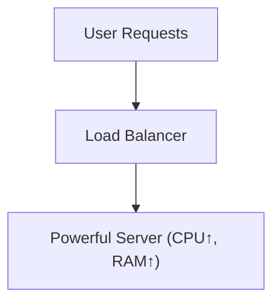

**Pros:** Simple to implement  
**Cons:** Physical limits, single point of failure, costly at scale

---

### 2. Horizontal Scaling ("Scaling Out")

Add more servers, distributing traffic and workload.

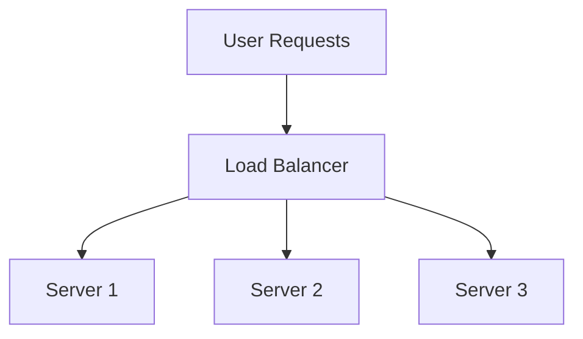

**Pros:** High resilience, can scale indefinitely  
**Cons:** Requires stateless design, coordination, load balancers

---

### 3. Diagonal Scaling

Hybrid: Start vertical, then go horizontal as needed. Common in cloud-native apps.

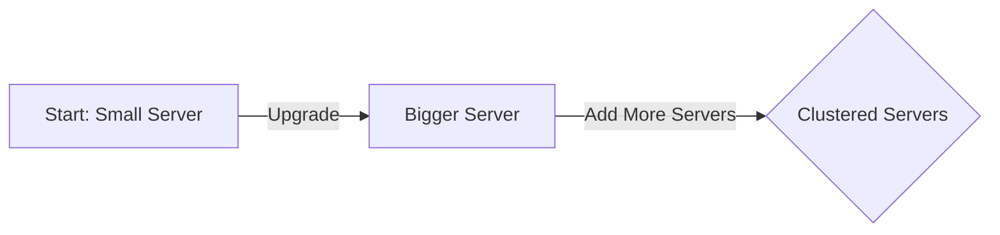

---

## ⚠️ Common Challenges in Scaling

| Challenge   | Description                                              | Example                        |
|-------------|---------------------------------------------------------|--------------------------------|
| Latency     | Delay in response due to distributed components         | Microservices, DB hops         |
| Bottlenecks | Slowest service limits overall throughput               | Locked DB, single-threaded job |
| Downtime    | More servers = more potential failure points            | Outages during deployments     |
| Cost        | More resources = higher bills (especially in cloud)     | Over-provisioned instances     |

---

## 🛠️ Scaling Strategies: Real-World Choices

| Approach         | When to Use                           | Real-World Example            |
|------------------|--------------------------------------|-------------------------------|
| Vertical         | MVPs, startups, low initial traffic   | Early-stage SaaS, blogs       |
| Horizontal       | High-scale apps, resilience needed    | Twitter, Facebook             |
| Diagonal         | Cloud-native with uncertain workloads | AWS Lambda, GCP Cloud Run     |

---

## ⚙️ Load Balancers: The Unsung Heroes

Load balancers distribute incoming requests to multiple backend servers, ensuring high availability, reliability, and performance.

**Why load balancing matters:**
- Even traffic distribution
- Prevents overload on any one server
- Handles server failures gracefully
- Reduces latency for users

### 🧱 Types of Load Balancers

| Type                | Layer               | Examples                                |
|---------------------|---------------------|-----------------------------------------|
| Layer 4 (Transport) | TCP/UDP             | AWS NLB, HAProxy (TCP), F5              |
| Layer 7 (App)       | HTTP/HTTPS/GRPC     | AWS ALB, Nginx, Envoy, Google L7 LB     |
| Hardware            | Appliance           | F5 Big-IP, Citrix NetScaler             |
| Software            | Deployed on VMs     | Nginx, HAProxy, Envoy                   |
| Cloud-based         | Managed             | AWS ELB, Azure Load Balancer, GCP LBs   |

### 🔄 Load Balancing Algorithms

- **Round Robin:** Sequential distribution
- **Least Connections:** Server with fewest active connections
- **IP Hash:** Consistent routing based on client IP
- **Weighted:** Some servers get more requests based on capacity
- **Least Response Time:** Fastest responding server

```python
# Pseudocode: Simple Round Robin Load Balancer
servers = [srv1, srv2, srv3]
next_server = 0

def get_server():
    global next_server
    srv = servers[next_server]
    next_server = (next_server + 1) % len(servers)
    return srv
```

---

## ☁️ Autoscaling in Cloud Environments

Autoscaling automatically adjusts resources to match demand—crucial for cost savings and reliability in cloud-native systems.

### How Autoscaling Works

- **Triggers:** CPU usage, memory, request rate, queue length
- **Types:** Horizontal (add/remove instances), Vertical (resize existing)
- **Policies:** Reactive (thresholds), Predictive (trend-based)

### Across Major Clouds

| Provider | Autoscaling Services                 |
|----------|-------------------------------------|
| AWS      | EC2 Auto Scaling, Lambda, ECS, EKS  |
| Azure    | VM Scale Sets, App Services, AKS    |
| GCP      | MIGs, Cloud Run, GKE, Functions     |

---

## 📊 Monitoring & Proactive Scaling

- **Metrics:** CPU, memory, network, queue depth, custom KPIs
- **Proactive:** Predictive algorithms, scheduled scaling for known patterns
- **Tools:** AWS CloudWatch, Prometheus, Azure Monitor, GCP Operations

---

## 💡 Tips and Tricks for Scalable System Design

- **Start Simple:** Use vertical scaling for MVPs; switch to horizontal as needs grow.
- **Design Stateless Services:** Easier to distribute and scale horizontally.
- **Automate Monitoring:** Track key metrics and set up alerts.
- **Avoid Over-Provisioning:** Use auto-pausing and scale-to-zero features in serverless/cloud.
- **Limit Autoscaling:** Set quotas to avoid runaway costs.
- **Plan for Failure:** Implement health checks and graceful failover in load balancers.
- **Optimize Cost:** Use spot/preemptible instances for batch workloads.
- **Test Under Load:** Use chaos engineering and load testing to surface bottlenecks early.
- **Document Scaling Decisions:** Record why/when you chose vertical, horizontal, or diagonal scaling to aid future maintenance.

---

## 📝 Interview Questions to Practice

1. What does scalability mean in system design?
2. Compare vertical and horizontal scaling. When would you use each?
3. Explain diagonal scaling and why it’s useful in cloud-native apps.
4. What are common bottlenecks, and how do you identify them?
5. How does a load balancer improve availability and performance?
6. What is autoscaling, and how is it implemented in AWS/Azure/GCP?
7. How do you optimize for cost while scaling in the cloud?

---

## 📚 Summary

- **Scalability is essential** for growth, reliability, and performance in modern architectures.
- **Vertical, horizontal, and diagonal scaling** serve different needs; choose wisely based on workload and growth patterns.
- **Load balancers** are key to distributing traffic and ensuring uptime.
- **Autoscaling** enables agility and cost efficiency in the cloud.
- **Continuous monitoring and optimization** keep your system healthy as it grows.


*Happy scaling!* 🚀

---

# Section 2

---
# Scaling Strategies in System Design: Vertical, Horizontal & Diagonal

Modern applications must be designed to gracefully handle increasing traffic, data, and complexity. This is where **scalability** comes in—a fundamental property ensuring that your system can grow to meet new demands without breaking, slowing down, or costing a fortune.

In this section, we’ll break down the three core scaling strategies: **Vertical Scaling (Scaling Up)**, **Horizontal Scaling (Scaling Out)**, and **Diagonal Scaling (Hybrid)**. We’ll explore when to use each, the trade-offs, and how real-world systems evolve their scaling architecture over time.

---

## What is Scalability?

> **Scalability** is the ability of a system to handle an increasing amount of work or its potential to accommodate growth. It ensures that performance, reliability, and availability remain high—even as load increases.

**Why do systems need to scale?**
- User base growth (e.g., expanding to new regions)
- Increasing data volume (IoT, analytics)
- Handling peak events (Black Friday, product launches)
- Avoiding service degradation or downtime
- Meeting strict performance SLAs

---

## The Three Types of Scaling

Let’s quickly revisit the main strategies:

| Scaling Type      | Approach                                  | Pros                | Cons                           |
|-------------------|-------------------------------------------|---------------------|--------------------------------|
| Vertical Scaling  | Upgrade single machine (CPU/RAM/Disk)     | Simple, fast        | Physical limits, SPOF*         |
| Horizontal Scaling| Add more machines/nodes                   | Resilient, scalable | Complex architecture           |
| Diagonal Scaling  | Start vertical, then add horizontal nodes | Flexible, cost-wise | Hybrid (must manage both)      |

> *SPOF: Single Point of Failure

---

### 1. Vertical Scaling (Scaling Up)

**Definition:**  
Add more resources (CPU, RAM, Disk) to a single server.

**Example:**
```bash
# Upgrading an AWS EC2 instance from t3.medium to t3.2xlarge
aws ec2 modify-instance-attribute --instance-id i-1234567890abcdef0 --instance-type "{\"Value\": \"t3.2xlarge\"}"
```

**Diagram:**
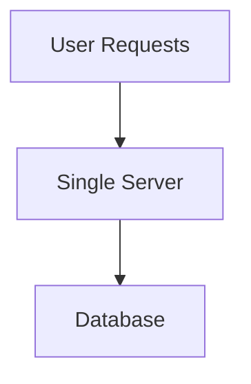

**Advantages:**
- Simple to implement
- No need for distributed coordination

**Limitations:**
- Physical hardware caps
- Single point of failure

---

### 2. Horizontal Scaling (Scaling Out)

**Definition:**  
Add more servers/nodes to distribute the load.

**Example:**
```yaml
# Kubernetes Horizontal Pod Autoscaler YAML
apiVersion: autoscaling/v2
kind: HorizontalPodAutoscaler
metadata:
  name: web-app-hpa
spec:
  scaleTargetRef:
    apiVersion: apps/v1
    kind: Deployment
    name: web-app
  minReplicas: 2
  maxReplicas: 10
  metrics:
  - type: Resource
    resource:
      name: cpu
      target:
        type: Utilization
        averageUtilization: 70
```

**Diagram:**
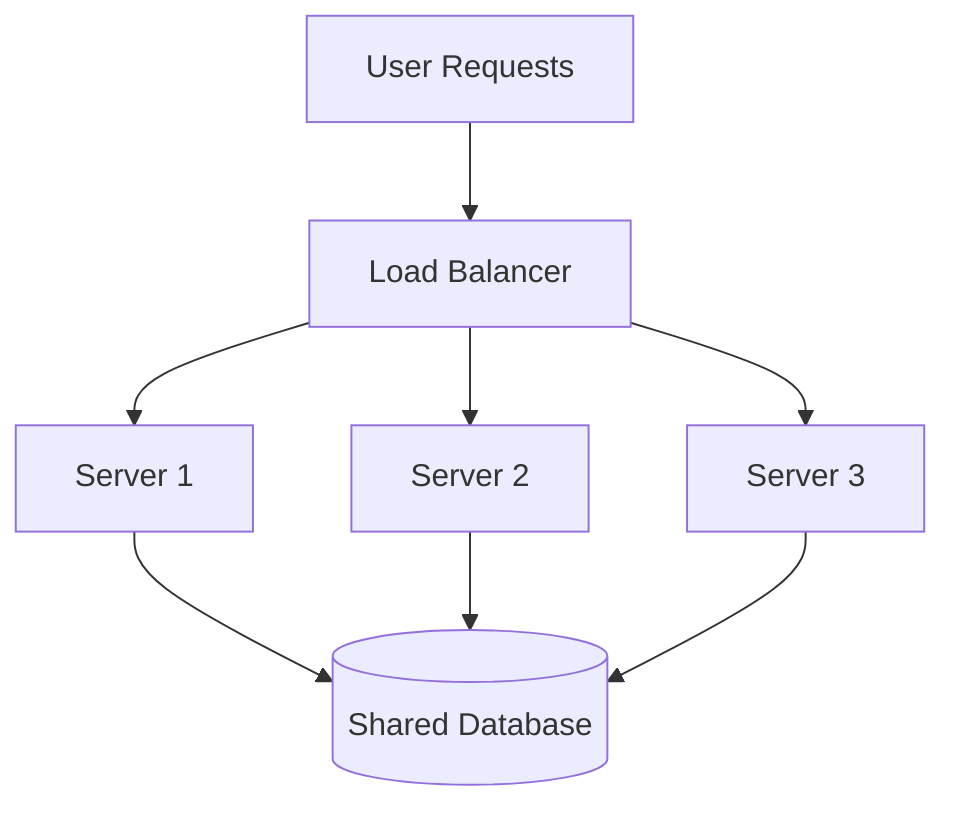

**Advantages:**
- High availability
- Parallelism, redundancy

**Challenges:**
- Load balancing required
- Data consistency, replication, and coordination
- Stateless or well-coordinated stateful design
- Complex setup (coordination, replication)

---

### 3. Diagonal Scaling (Hybrid Approach)

**Definition:**  
Begin with vertical scaling for simplicity; when limits are reached, transition to horizontal scaling.
- Cost effective + long term ready

**Diagram:**
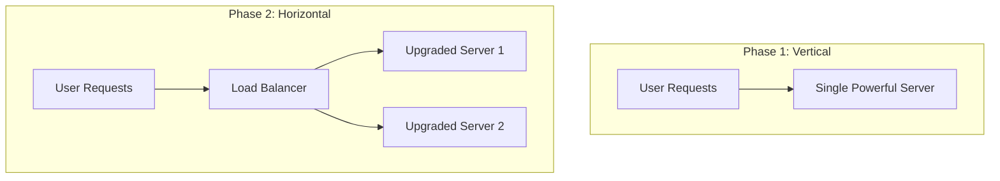
*Start vertical, then scale horizontally as needed.*

**Real World Example:**  
- **AWS Lambda**: Starts small (vertical), but can auto-scale (horizontal) based on demand.
- **Twitter**: From monolith (vertical) to microservices (horizontal) as user base grew.

---

## Trade-Offs: Cost, Complexity, and Performance

|   Strategy   | Cost (Initial) | Cost (Growth) | Complexity | Performance |
|--------------|:--------------:|:-------------:|:----------:|:-----------:|
| Vertical     | Low            | High          | Low        | High (initial) |
| Horizontal   | Medium         | Linear        | High       | High (scalable) |
| Diagonal     | Balanced       | Balanced      | Medium     | Balanced      |

- **Vertical scaling** is easy and cheap to start, but gets expensive and risky at scale.
- **Horizontal scaling** is robust and future-proof, but requires orchestration, monitoring, and stateless patterns.
- **Diagonal scaling** gives early simplicity and long-term scalability, favored by modern cloud-native architectures.

---

## Practical Tips and Tricks

- **Start Simple:** Early-stage startups or MVPs should favor vertical scaling to keep things simple and cost-effective.
- **Know When to Switch:** Monitor system metrics. When you approach hardware limits or need high availability, start planning horizontal or diagonal scaling.
- **Embrace Statelessness:** For horizontal scaling, design services to be stateless. Use shared databases or distributed caches for state.
- **Use Managed Services:** Cloud providers offer powerful auto-scaling and load balancing solutions (e.g., AWS ELB, Azure Load Balancer).
- **Don’t Over-Engineer:** Avoid building distributed systems too early. Scale complexity with actual demand.
- **Implement Load Balancers:** Distribute traffic, prevent overload, and increase reliability.
- **Monitor Proactively:** Use tools like CloudWatch, Prometheus, or Grafana to anticipate scaling needs before issues arise.

---

## Example Code: Autoscaling with AWS

Here’s how you can set up an **Auto Scaling Group** in AWS for horizontal scaling:

```bash
aws autoscaling create-auto-scaling-group \
  --auto-scaling-group-name my-asg \
  --launch-configuration-name my-launch-config \
  --min-size 2 \
  --max-size 10 \
  --desired-capacity 2 \
  --vpc-zone-identifier "subnet-12345678,subnet-23456789"
```

---

## Interview Questions to Practice

1. **What is the difference between horizontal and vertical scaling?**
2. **What is diagonal scaling and when would you use it?**
3. **Describe a scenario where horizontal scaling wouldn’t help.**
4. **How do you balance cost and complexity in scaling strategies?**
5. **What challenges arise in horizontal scaling and how would you solve them?**

---

## Key Takeaways

- **Vertical scaling**: Great for simplicity and early growth; limited by hardware.
- **Horizontal scaling**: Powers large, resilient, scalable systems; introduces complexity.
- **Diagonal scaling**: Combines both for flexibility and cost-effectiveness.
- **Your scaling strategy should evolve** with your system’s growth and requirements.

---

> **Next Up:**  
> Dive deeper into **Load Balancers**—the key enablers of horizontal and diagonal scaling. Learn about types, algorithms, and how to pick the right one for your architecture!

---

**Stay tuned for more on mastering system design!**

---

**Diagram rendering note:**  
To view the Mermaid diagrams, use a Markdown viewer with Mermaid support (e.g., VSCode with Mermaid plugin, GitHub, HackMD).

---

### References

- [AWS Auto Scaling Documentation](https://docs.aws.amazon.com/autoscaling/)
- [Google Cloud Load Balancing](https://cloud.google.com/load-balancing)
- [Azure Load Balancer](https://azure.microsoft.com/en-us/services/load-balancer/)
- [Nginx Load Balancing Guide](https://docs.nginx.com/nginx/admin-guide/load-balancer/)

---

# Section 3

# 🚦 Mastering Load Balancing in Scalable System Design

Scalability is at the heart of robust system design. As user bases and data volumes grow, ensuring your application remains fast, available, and cost-effective becomes critical. One of the key enablers for scalable, resilient systems is **load balancing**—the art and science of distributing incoming traffic across a pool of servers.

In this section, we’ll dive deep into:
- Why load balancing is essential
- Types of load balancers (with network layers and deployment models)
- Common load balancing strategies (static and dynamic)
- Real-world scenarios
- How to choose the right load balancer
- Code examples and diagrams
- Tips & Tricks for interviews and production

---

## 🏗️ Why Load Balancing is Essential

Imagine a high-traffic e-commerce website during Black Friday. Without load balancing, a single server could get overwhelmed, causing slowdowns or outages. With a load balancer, incoming requests are automatically and intelligently spread across multiple backend servers for maximum uptime and minimum latency.

### **Key Benefits:**
- **High Availability:** Keeps your app running even during server failures or traffic spikes.
- **Traffic Distribution:** Prevents overload by spreading requests evenly.
- **Improved Performance:** Routes requests to the least-busy or fastest server.
- **Graceful Failure Handling:** Detects and bypasses failed servers.
- **Scalability:** Makes it easy to add or remove servers as demand changes.

> **Real-World Example:**  
> During a flash sale, Amazon’s load balancers distribute millions of requests per second across a massive fleet of servers, ensuring shoppers never see a 503 error.

---

## 🧩 Types of Load Balancers

Load balancers can be categorized **by the network layer** they operate on and **their deployment model**.

### **1. By Network Layer**
- **Layer 4 (Transport Layer):**  
  - Operates at TCP/UDP level.
  - Routes based on IP address and port (e.g., AWS Network Load Balancer, HAProxy L4).
  - **Pros:** Blazing fast, efficient, low overhead.
  - **Cons:** No content-based routing.

- **Layer 7 (Application Layer):**  
  - Operates at HTTP/HTTPS.
  - Routes based on HTTP headers, cookies, URLs, etc. (e.g., AWS Application Load Balancer, Nginx).
  - **Pros:** Intelligent content-aware routing.
  - **Cons:** Slightly more processing overhead.

> #### Diagram: Layer 4 vs Layer 7 Load Balancer

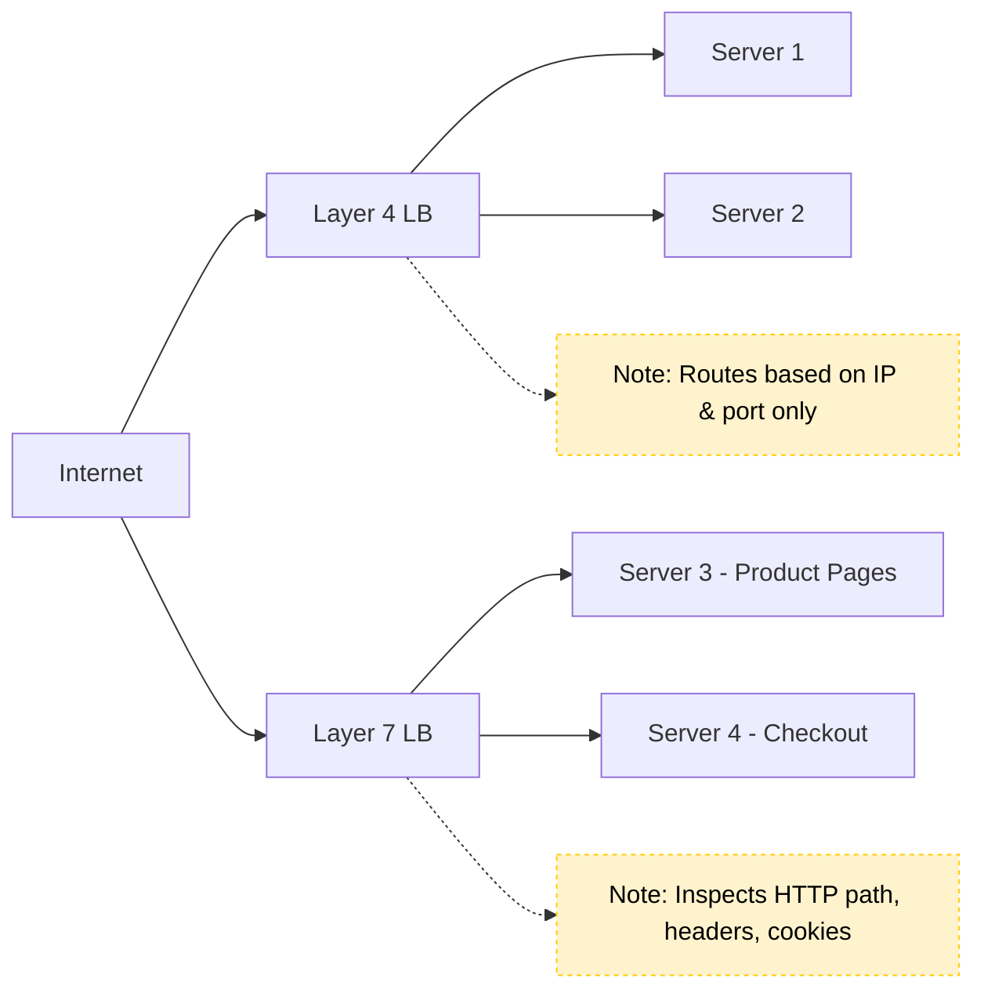

### **2. By Deployment Model**
- **Hardware Load Balancers:**  
  - Specialized devices (e.g., F5 BIG-IP, Citrix NetScaler).
  - Used in large data centers, often with features like SSL termination and DDoS protection.

- **Software Load Balancers:**  
  - Apps running on commodity servers (Nginx, HAProxy, Envoy).
  - Flexible, cost-effective, popular in microservices and Kubernetes.

- **Cloud-based Load Balancers:**  
  - Managed services provided by cloud vendors (AWS ELB, Google Cloud Load Balancer, Azure LB).
  - Handles scaling, failover, and security out-of-the-box.

---

## 🧮 Load Balancing Strategies

### **A. Static Load Balancing**
- **Round Robin:**  
  Requests are distributed sequentially to each server in a repeating cycle.

    ```python
    # Simple Round Robin in Python
    servers = ['A', 'B', 'C']
    idx = 0

    def get_next_server():
        global idx
        server = servers[idx]
        idx = (idx + 1) % len(servers)
        return server
    ```

- **Least Connections:**  
  Routes new requests to the server with the fewest active connections.

    ```python
    # Least Connections mockup
    connections = {'A': 3, 'B': 1, 'C': 2}

    def get_least_connections():
        return min(connections, key=connections.get)
    ```

- **IP Hashing:**  
  Uses a hash of the client IP to consistently route a user to the same backend (supports sticky sessions).

    ```python
    import hashlib

    def ip_hash(ip, servers):
        idx = int(hashlib.md5(ip.encode()).hexdigest(), 16) % len(servers)
        return servers[idx]
    ```

### **B. Dynamic Load Balancing**
- **Least Response Time:**  
  Sends requests to the server providing the fastest real-time response.

- **Adaptive Load Balancing:**  
  Continuously analyzes CPU, memory, and health metrics to optimize routing.

- **Weighted Load Balancing:**  
  Assigns each server a weight according to its capacity.

    ```python
    # Weighted Round Robin
    servers = [('A', 3), ('B', 1)]  # (server, weight)
    weighted_list = [s for s, w in servers for _ in range(w)]
    idx = 0

    def get_weighted_server():
        global idx
        server = weighted_list[idx]
        idx = (idx + 1) % len(weighted_list)
        return server
    ```

---

## ⚙️ Load Balancer in Action

Consider a **web application** running on 3 backend servers behind a load balancer.

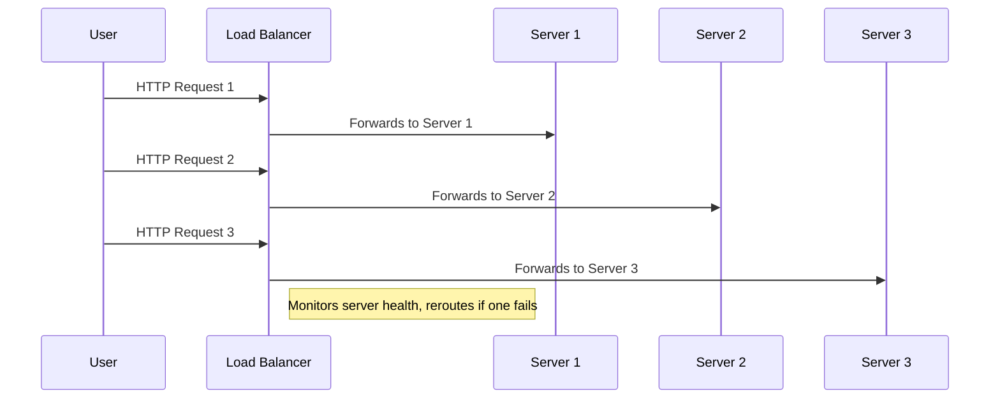

### **Handling Failures Gracefully**
If Server 2 crashes, the load balancer detects this via health checks and reroutes all new traffic to Server 1 and Server 3 only, preserving high availability.

---

## 🧠 Choosing the Right Load Balancer

- **Layer 4:** Choose for raw speed and lower-level TCP/UDP traffic.
- **Layer 7:** Choose for intelligent routing (e.g., APIs, microservices).
- **Software:** Great for flexible, cost-effective deployments.
- **Hardware:** Enterprise-grade performance, in data centers.
- **Cloud:** Seamless scaling, built-in security, minimal management.

**Other Considerations:**
- **SSL Termination:** Offload CPU-heavy encryption from backend servers.
- **DDoS Protection:** Many cloud/hardware LBs provide built-in attack mitigation.
- **Session Persistence:** Use IP Hashing or sticky sessions if needed.

---

## 💡 Tips & Tricks

- **Interview Prep:**  
  - Be able to explain Layer 4 vs Layer 7 with examples.
  - Compare Round Robin vs Least Connections with pros/cons.
  - Discuss when to use software, hardware, or cloud-based LBs.
  - Know how to handle failover and high availability.

- **Production Best Practices:**  
  - Always set up **health checks** for your backend servers.
  - Prefer **stateless** backend design for easier load balancing.
  - Monitor metrics like connection counts, response times, error rates.
  - For microservices, consider using a **service mesh** (e.g., Istio, Linkerd) for advanced L7 routing.
  - Enable SSL termination at the load balancer to reduce backend CPU load.
  - Use **autoscaling** in conjunction with load balancing for elastic capacity.

---

## 📝 Sample Nginx Load Balancer Config

```nginx
http {
    upstream backend {
        server backend1.example.com weight=3;
        server backend2.example.com weight=2;
        server backend3.example.com weight=1;
    }

    server {
        listen 80;
        location / {
            proxy_pass http://backend;
        }
    }
}
```

---

## 🏁 Key Takeaways

- Load balancing is essential for scalability, reliability, and performance.
- Choose the right type (L4/L7, hardware/software/cloud) for your needs.
- Pick the right strategy based on your traffic patterns and backend capabilities.
- Combine load balancing with autoscaling for true elasticity in the cloud.
- Monitor, test, and iterate—don’t “set and forget” your load balancer.

---

## 📚 What's Next?

Now that you have a solid grasp on load balancing, you’re ready to tackle **autoscaling**—how to dynamically adjust resources in real-time as load changes. Next, we’ll explore best practices for implementing autoscaling in cloud environments, integrating with load balancers for truly resilient and cost-effective architectures.

---

**Further Reading & Resources:**
- [NGINX Load Balancing Docs](https://docs.nginx.com/nginx/admin-guide/load-balancer/http-load-balancer/)
- [AWS Elastic Load Balancing](https://aws.amazon.com/elasticloadbalancing/)
- [Google Cloud Load Balancing](https://cloud.google.com/load-balancing)
- [HAProxy Documentation](https://www.haproxy.org/)

---

**Stay tuned for the next section: 🚀 Autoscaling & Best Practices in the Cloud!**

# Section 4

# 🚀 Autoscaling & Best Practices in Cloud Environments

In modern cloud architecture, **autoscaling** is a core technique for building highly available, cost-effective, and resilient systems. Let’s dive deep into how autoscaling works, its types, how major cloud providers implement it, and best practices to maximize its benefits.

---

## What is Autoscaling?

**Autoscaling** is the **automatic adjustment of compute resources** (like servers, containers, or functions) in response to real-time demand.

- **Objective:** Maintain performance and availability while optimizing costs.
- **Common Use Cases:** Microservices, web applications, event-driven systems, batch processing.

> *"Autoscaling plays a critical role in keeping system performance available and cost efficient, especially where demand can vary drastically and unpredictably."*

---

## How Autoscaling Works

Autoscaling decisions are **triggered by metrics** such as:

- **CPU usage**
- **Memory consumption**
- **Request rate**
- **Queue length**
- **Custom business KPIs**

### Autoscaling Types

| Type               | Description                                                      | Example                |
|--------------------|------------------------------------------------------------------|------------------------|
| **Horizontal**     | Add/remove instances (scale out/in)                              | Add EC2 VMs/Pods       |
| **Vertical**       | Resize a single instance (scale up/down)                         | Add CPU/RAM to server  |
| **Diagonal**       | Start vertical, then add horizontal as needed (hybrid approach)  | Cloud-native workloads |

**Diagram: Scaling Types**

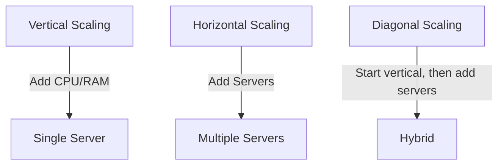

---

### Scaling Policies

- **Reactive Scaling:** Triggers when specific metrics cross thresholds (e.g., CPU > 80%).
- **Predictive Scaling:** Uses historical trends and ML to forecast and scale _before_ demand spikes.
- **Scheduled Scaling:** Scales resources at set times based on known traffic patterns (e.g., daily peaks).

---

## Autoscaling Across Cloud Providers

All major clouds offer first-class autoscaling features. Here’s a quick reference:

| Cloud  | Compute Autoscaling           | Container Autoscaling          | Monitoring / Metrics     |
|--------|------------------------------|-------------------------------|-------------------------|
| **AWS**   | EC2 Auto Scaling Groups, Lambda | ECS, EKS (Kubernetes) Autoscaling | CloudWatch              |
| **Azure** | VM Scale Sets, App Service Plans | AKS (Kubernetes) Autoscaling | Azure Monitor           |
| **GCP**   | Managed Instance Groups, Functions | Cloud Run, GKE Autoscaling | Stackdriver/Operations  |

### Example: AWS EC2 Auto Scaling Group (Infrastructure as Code)

```yaml
# AWS CloudFormation snippet for Auto Scaling Group
Resources:
  MyAutoScalingGroup:
    Type: AWS::AutoScaling::AutoScalingGroup
    Properties:
      MinSize: '2'
      MaxSize: '10'
      DesiredCapacity: '2'
      LaunchConfigurationName: !Ref MyLaunchConfig
      TargetGroupARNs:
        - !Ref MyTargetGroup
      MetricsCollection:
        - Granularity: "1Minute"
```

### Example: Azure VM Scale Set (CLI)

```bash
az vmss create \
  --resource-group myResourceGroup \
  --name myScaleSet \
  --image UbuntuLTS \
  --upgrade-policy-mode automatic \
  --custom-data cloud-init.txt \
  --admin-username azureuser
az vmss autoscale create \
  --resource-group myResourceGroup \
  --name myAutoscaleSetting \
  --vmss-name myScaleSet \
  --min-count 2 --max-count 10 --count 2
```

### Example: GCP Managed Instance Group (gcloud)

```bash
gcloud compute instance-groups managed create my-group \
  --base-instance-name my-instance \
  --template my-instance-template \
  --size 2 \
  --zone us-central1-a

gcloud compute instance-groups managed set-autoscaling my-group \
  --max-num-replicas 10 \
  --min-num-replicas 2 \
  --target-cpu-utilization 0.75 \
  --cool-down-period 90
```

---

## Monitoring and Proactive Scaling

**Effective autoscaling depends on robust monitoring.**

- **Key Metrics:** CPU, memory, network, queue depth, custom KPIs.
- **Tools:** AWS CloudWatch, Azure Monitor, GCP Operations, Prometheus + Grafana.

**Proactive Scaling:** Use ML/trends to **forecast** demand, not just react.

**Scheduled Scaling:** Predefine scaling windows for known peak times (e.g., Black Friday).

---

## Cost Optimization Strategies

Cloud costs can spiral if autoscaling is not managed carefully. Here are best practices:

| Strategy                       | Description                                                          |
|--------------------------------|----------------------------------------------------------------------|
| **Avoid Over-provisioning**    | Scale just enough for demand; avoid idle resources.                  |
| **Use Spot/Preemptible VMs**   | For batch/non-critical workloads; up to 80% cheaper.                 |
| **Set Resource Limits/Quotas** | Prevent runaway scaling, especially in dev/test environments.        |
| **Rightsize Regularly**        | Analyze actual usage and adjust resource size accordingly.           |
| **Auto-pausing/Scale-to-zero** | Use features that pause/stop idle services (e.g., Cloud Run, Lambda) |

---

## Tips and Tricks for Effective Autoscaling

- **Choose the right scaling strategy:** Horizontal for resilience, vertical for simplicity, diagonal for flexibility.
- **Monitor both technical and business KPIs:** E.g., queue depth, orders per minute.
- **Set conservative thresholds at first, then tune:** Avoid thrashing (rapid scaling in/out).
- **Test autoscaling in staging with simulated traffic spikes.**
- **Combine reactive and predictive scaling for best results.**
- **Document your scaling policies and update them as usage patterns evolve.**
- **For serverless, check for concurrency limits and cold start implications.**
- **Always review cloud provider pricing calculators to forecast cost under peak loads.**

---

## Sample Interview Questions

- What is autoscaling and why is it important?
- Explain the difference between horizontal and vertical scaling.
- How does predictive autoscaling work?
- How would you set up autoscaling for a containerized app?
- What challenges arise with autoscaling in real-time systems?
- How can you ensure cost optimization when implementing autoscaling?

---

## Key Takeaways

- **Autoscaling** is essential for building systems that are agile, highly available, and cost efficient.
- **Choose the right scaling strategy** for your workload and traffic patterns.
- **Proactive monitoring** enables you to stay ahead of demand.
- **Align autoscaling with cost optimization goals** to avoid budget overruns.

---

**Next up:** We’ll tie everything together in the summary and explore how scalability fits into the broader system design landscape.

---

**References and Further Reading:**
- [AWS Auto Scaling Documentation](https://docs.aws.amazon.com/autoscaling/)
- [Azure Autoscale Documentation](https://learn.microsoft.com/en-us/azure/azure-monitor/autoscale/autoscale-overview)
- [GCP Autoscaling Documentation](https://cloud.google.com/compute/docs/autoscaler/)
- [Cloud Cost Optimization Guide](https://cloud.google.com/solutions/cost-optimization)

---

*Happy scaling! 🚀*

# Section 5

Certainly! Below is a **detailed Markdown blog section** integrating your provided transcript and slides, suitable for a technical audience. This section covers **Scalability in System Design** with explanations, code snippets, diagrams (using Mermaid), and a 'Tips and Tricks' section.

---

# Section 6: Scalability in System Design

Scalability is at the heart of reliable, high-performance system design. In this section, we'll break down the **fundamentals, strategies, and best practices** for building scalable architectures, drawing from both theory and real-world cloud solutions.

---

## 🚀 What is Scalability?

> **"Scalability is the ability of a system to handle an increasing amount of work, or its potential to accommodate growth."**

A scalable system maintains **performance, reliability, and availability** even as demand grows—whether that’s more users, data, or traffic spikes.

**Why do systems need to scale?**

- **User base growth:** Expanding into new regions or markets.
- **Increasing data volume:** IoT, analytics, multimedia.
- **Peak events:** Black Friday, ticket sales, viral trends.
- **Avoiding service degradation/downtime:** Ensuring SLAs.
- **Meeting performance SLAs:** For business-critical apps.

---

## 🔥 Types of Scalability

There are three main ways to scale a system:

| Type              | Description                              | Pros                        | Cons                       |
|-------------------|------------------------------------------|-----------------------------|----------------------------|
| **Vertical**      | Add resources (CPU/RAM) to a single node | Simple, fast upgrades       | Physical limits, SPOF      |
| **Horizontal**    | Add more nodes/servers                   | High resilience, big scale  | Complex, needs LB/replica  |
| **Diagonal**      | Start vertical, then go horizontal       | Flexible, cost-efficient    | Coordination complexity    |

### **Diagram: Types of Scaling**

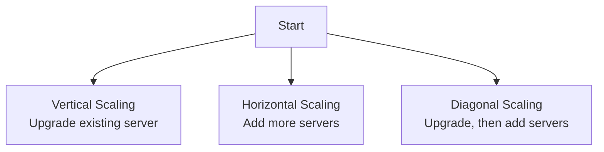

---

## ⚙️ Scaling Strategies: When and How?

- **Vertical Scaling:**  
  Upgrade a server’s specs (CPU, RAM, Disk).  
  Great for MVPs and small startups due to simplicity, but has hard limits.

- **Horizontal Scaling:**  
  Add more servers, distribute load via a **load balancer**.  
  Enables massive scale, but requires stateless design and orchestration.

- **Diagonal Scaling:**  
  Start with vertical, then switch to horizontal as growth demands.  
  Popular in cloud-native apps for flexibility and cost savings.

**Real-World Choices:**
- Twitter: Monolith → microservices (horizontal)
- AWS Lambda: Diagonal + autoscaling
- Startups: Vertical first, then horizontal as needed

---

## 🧩 Load Balancing: The Backbone of Scalability

Load balancers distribute incoming requests across servers, ensuring **high availability, better performance, and fault tolerance**.

### **Types of Load Balancers**

- **Layer 4 (TCP/UDP):**  
  Distributes traffic based on network data.
- **Layer 7 (HTTP/HTTPS):**  
  Routes based on content; supports smart routing.

| Deployment Type      | Examples                                 |
|----------------------|------------------------------------------|
| Hardware             | F5, Citrix NetScaler                     |
| Software             | Nginx, HAProxy, Envoy                    |
| Cloud-based          | AWS ELB, Google Cloud Load Balancing     |

### **Load Balancing Algorithms**

- **Round Robin:** Sequentially assigns requests.
- **Least Connections:** To the server with the fewest active connections.
- **IP Hashing:** Routes based on client IP.
- **Weighted:** Assigns more traffic to more capable servers.
- **Least Response Time:** Picks the server that responds fastest.

#### **Code Example: Simple Round Robin in Python**

```python
class RoundRobinLB:
    def __init__(self, servers):
        self.servers = servers
        self.index = 0

    def get_server(self):
        server = self.servers[self.index]
        self.index = (self.index + 1) % len(self.servers)
        return server

# Usage
lb = RoundRobinLB(['server1', 'server2', 'server3'])
for _ in range(6):
    print(lb.get_server())
```
_Output:_
```
server1
server2
server3
server1
server2
server3
```

### **Diagram: Load Balancer in Action**

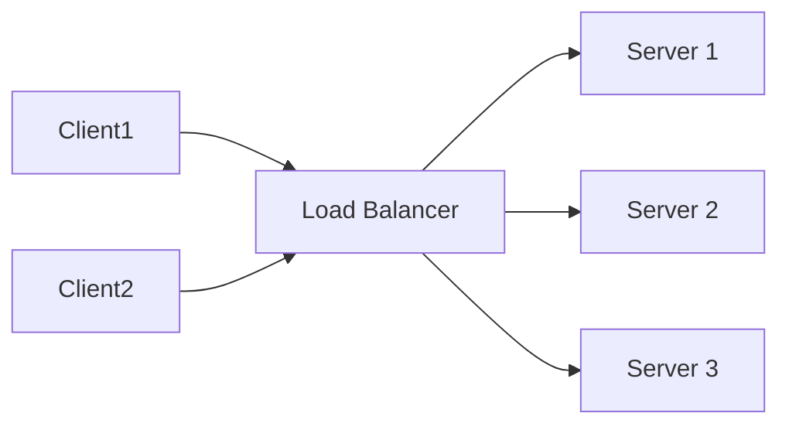

---

## 🤖 Autoscaling & Cloud Best Practices

**Autoscaling** automates the adjustment of compute resources in response to load, ensuring performance and cost efficiency.

### **How Autoscaling Works**

- **Triggers:** CPU, memory, request rate, queue length, custom KPIs.
- **Types:**
    - **Horizontal:** Add/remove instances.
    - **Vertical:** Resize instances.
- **Policies:** Reactive (thresholds) vs. Predictive (trend-based, ML-driven).

**Supported by all major clouds**:
- **AWS:** Auto Scaling for EC2, Lambda, ECS, EKS
- **Azure:** VM Scale Sets, App Services, AKS
- **GCP:** Managed Instance Groups, GKE, Cloud Run

#### **Sample AWS Auto Scaling Group (CloudFormation YAML)**

```yaml
Resources:
  MyAutoScalingGroup:
    Type: AWS::AutoScaling::AutoScalingGroup
    Properties:
      MinSize: 2
      MaxSize: 10
      DesiredCapacity: 4
      LaunchConfigurationName: !Ref MyLaunchConfig
      TargetGroupARNs:
        - !Ref MyTargetGroup
      MetricsCollection:
        - Granularity: "1Minute"
      Tags:
        - Key: Name
          Value: MyASGInstance
          PropagateAtLaunch: true
```

### **Monitoring & Proactive Scaling**

- Use metrics: CPU, memory, network, queue depth, custom KPIs.
- Proactive scaling: Predictive algorithms, scheduled scaling.
- Tools: AWS CloudWatch, Prometheus, Azure Monitor, GCP Operations.

### **Cost Optimization**

- Avoid over-provisioning.
- Use spot/preemptible instances for batch tasks.
- Regularly rightsize instances.
- Apply resource limits and quotas.
- Scale-to-zero for idle services.

---

## 💡 Tips and Tricks for Scalability

1. **Design for statelessness:** Easier to scale horizontally.
2. **Set autoscaling limits:** Prevent runaway costs.
3. **Monitor everything:** Use dashboards and alerts.
4. **Test for failure:** Simulate node/server loss (Chaos Engineering).
5. **Choose the right load balancing strategy:** Match to traffic patterns.
6. **Start simple, scale as you grow:** Don’t overengineer.
7. **Document scaling policies:** So they can be tuned as requirements evolve.

---

## 📝 Key Takeaways

- **Scalability** allows systems to grow without breaking.
- **Vertical, horizontal, and diagonal scaling** each have trade-offs.
- **Load balancing** is essential for distributing traffic and achieving high availability.
- **Autoscaling** in the cloud keeps costs low and performance high.
- **Proactive monitoring and cost controls** are critical for sustainable scaling.

---

**Next Up:**  
In the next section, we’ll explore **Database and Storage**—how databases are structured, stored, and scaled in distributed systems.

---

**Stay tuned for more system design deep-dives!**

---

*Did you find this guide useful? Share your own scalability tips in the comments below!* 🚀

