# Section 1


# Mastering System Design: Database and Storage Deep Dive

Welcome to this in-depth blog section on **Databases and Storage**—crucial pillars of modern system design. Whether you're building a small app or architecting a global platform, your storage choices directly impact performance, scalability, and reliability. In this guide, we'll integrate key concepts from both a comprehensive lecture transcript and a set of slides, providing code snippets, diagrams, and actionable tips.

---

## Table of Contents

1. [Why Storage Matters](#why-storage-matters)
2. [Structured vs. Unstructured Data](#structured-vs-unstructured-data)
3. [Storage Categories and Properties](#storage-categories-and-properties)
4. [Trade-offs: Scalability, Reliability, and Performance](#trade-offs-scalability-reliability-and-performance)
5. [The CAP Theorem: Consistency, Availability, Partition Tolerance](#the-cap-theorem)
6. [Database Models: SQL vs. NoSQL](#database-models-sql-vs-nosql)
7. [Advanced Database Topics: Replication, Sharding, Polyglot Persistence](#advanced-database-topics)
8. [Object, File, and Distributed Storage](#object-file-and-distributed-storage)
9. [Big Data Fundamentals](#big-data-fundamentals)
10. [Tips and Tricks](#tips-and-tricks)
11. [Summary and Key Takeaways](#summary-and-key-takeaways)

---

## Why Storage Matters

> **All systems generate and consume data—storing it effectively is essential.**

**Storage** is foundational to every system, powering features such as user profiles, watch histories, analytics, recommendations, and more. The right choice affects:

- **Performance:** Fast data access = better user experience.
- **Reliability:** Durable storage ensures data isn't lost.
- **Cost:** Efficient storage saves resources at scale.

**Example:**
- A messaging app’s history, a banking platform’s accounts, and a content delivery network’s cache—all rely on robust storage solutions.

---

## Structured vs. Unstructured Data

### Structured Data

- **Format:** Rows and columns, predefined schema (e.g., SQL tables)
- **Example:** User table in a relational database

```sql
CREATE TABLE users (
  id SERIAL PRIMARY KEY,
  email VARCHAR(255) NOT NULL,
  created_at TIMESTAMP DEFAULT NOW()
);
```

### Unstructured Data

- **Format:** No fixed schema, flexible format (e.g., images, logs, videos)
- **Example:** Product images, chat logs, user-uploaded files

**Diagram: Structured vs. Unstructured**
```
+-------------------+          +--------------------------+
|  Structured Data  |          |   Unstructured Data      |
|-------------------|          |--------------------------|
| id | email | date |          | image1.jpg, video.mp4,   |
|-------------------|          | log_2024-06-01.txt, ...  |
+-------------------+          +--------------------------+
```

---

## Storage Categories and Properties

### Categories

| Category         | Examples              | Use Case                                 |
|------------------|----------------------|------------------------------------------|
| Database         | PostgreSQL, MongoDB  | Structured/semi-structured data          |
| Object Storage   | Amazon S3, GCS       | Unstructured data (media, logs, backups) |
| File Storage     | NFS, SMB             | Shared file access, legacy systems       |
| Block Storage    | EBS, SAN             | Low-latency, high-performance (DB disks) |

### Core Storage Properties

- **Durability:** Data persists even after failures (e.g., power loss, crashes)
- **Availability:** Data accessible when needed, even during outages
- **Consistency:** Every read returns the most recent write
- **Atomicity (Transactional):** Operations are all-or-nothing

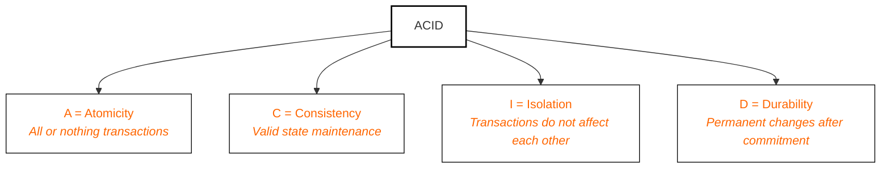

---

## Trade-offs: Scalability, Reliability, and Performance

No storage system is perfect! Real-world solutions must **trade off** between:

- **Scalability:** Can handle data/user/request growth.
- **Reliability:** Continues functioning despite failures.
- **Performance:** Fast reads/writes.

**Triangle Diagram:**

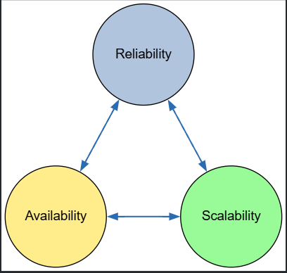

*Optimizing one often impacts the others!*

---

## The CAP Theorem

**CAP:** In a distributed system, you can only fully guarantee **two** of:

- **Consistency (C):** Every read gets the latest write
- **Availability (A):** Every request receives a response
- **Partition Tolerance (P):** System functions despite network splits
- **No system can have all 3 at the same time**

**Diagram: CAP Triangle**

```
         Consistency
            /\
           /  \
          /----\
Partition      Availability
Tolerance
```


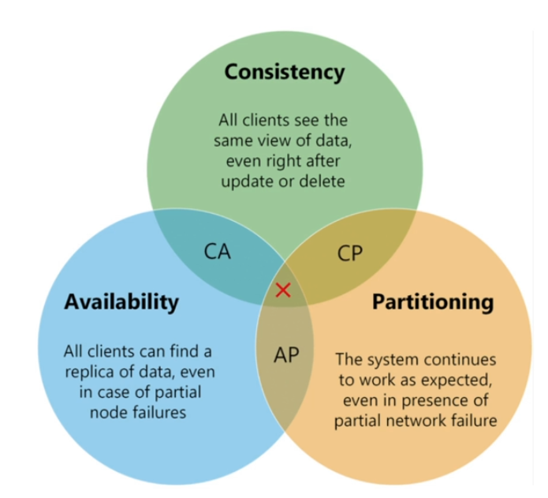


- **CP (Consistency + Partition Tolerance):** Prioritizes correctness (e.g., HBase)
- **AP (Availability + Partition Tolerance):** Prioritizes uptime, eventual consistency (e.g., DynamoDB)
- **CA (Consistency + Availability):** Only possible without partitions (e.g., standalone PostgreSQL)


---

## **Types of Systems Based on CAP Trade-offs**

### • CP (Consistency + Partition Tolerance)

* Prioritizes data correctness over availability
* During a partition, the system may reject requests to avoid inconsistent reads
* Not always available, but when it is — data is guaranteed to be correct
* **Example:** HBase — strongly consistent. If a node can’t confirm a write across replicas, it won’t serve it — even if it means being unavailable briefly.
* **When to use:** Financial systems, banking apps, anything where data integrity is critical

---

### • AP (Availability + Partition Tolerance)

* Prioritizes system uptime over consistency
* During a partition, the system will serve requests, even if they return stale or eventually consistent data
* **Example:** DynamoDB — inspired by Amazon’s Dynamo model, which uses eventual consistency by default for high availability
* **When to use:** Social media feeds, product catalogs, content delivery — where being up is more important than perfect accuracy

---

### • CA (Consistency + Availability) — The “Unicorn”

* Only possible if no network partitions ever occur — i.e., in single-node or tightly coupled systems
* In practice, not achievable in distributed systems that need to tolerate network faults
* **Example:** Relational databases (like PostgreSQL) in standalone mode (not distributed) could be considered CA

---

**Key Takeaway:**  
*At scale, network partitions are inevitable—real-world systems must choose between Consistency and Availability during a partition.*

---

## Database Models: SQL vs. NoSQL

### Relational Databases (SQL)

- **Schema:** Fixed, structured tables
- **Query Language:** SQL
- **ACID Properties:** Atomicity, Consistency, Isolation, Durability
- **Examples:** MySQL, PostgreSQL, Oracle

```sql
SELECT users.email, orders.total
FROM users
JOIN orders ON users.id = orders.user_id
WHERE orders.date > '2024-06-01';
```

#### When to Use SQL:
- Complex queries & relationships
- Strong consistency needed
- Well-known, structured schema

### NoSQL Databases

- **Schema:** Schema-less or dynamic
- **Types:** Document, Key-Value, Columnar, Graph
- **BASE Properties:** Basically Available, Soft state, Eventually consistent

| NoSQL Type   | Example        | Use Case                    |
|--------------|---------------|-----------------------------|
| Document     | MongoDB       | Content, user profiles      |
| Key-Value    | Redis, DynamoDB | High-speed cache, sessions |
| Columnar     | Cassandra, HBase | Analytics, event logs     |
| Graph        | Neo4j         | Social networks, relationships |

```javascript
// MongoDB document insert
db.users.insertOne({
  name: "Alice",
  email: "alice@example.com",
  preferences: { theme: "dark", notifications: true }
});
```

#### When to Use NoSQL:
- High scalability needed
- Flexible/evolving data structures
- Low-latency or high-volume ops

---

## Advanced Database Topics

### Scaling: Vertical vs. Horizontal

- **Vertical (Scale-Up):** Add resources to a single node (RAM, CPU)
  - Simpler, but limited by hardware
- **Horizontal (Scale-Out):** Add more nodes, distribute data/load
  - Complex, but enables massive scale

### Replication

- **Leader-Follower:** Writes go to a leader, reads from followers
- **Read Replicas:** Used for scaling read-heavy workloads
- **Trade-offs:** Asynchronous replication may cause lag; CAP theorem applies

**Diagram: Simple Leader-Follower Replication**
```
           +------------+
           |  Leader    |
           +-----+------+
                 |
         +-------+--------+
         |                |
     +---+----+      +----+---+
     |Follower|      |Follower|
     +--------+      +--------+
```

### Sharding

- **Definition:** Splitting data across multiple databases (shards)
- **Methods:** Range-based, Hash-based, Consistent Hashing, Geo-based
- **Why:** Overcome limits of single-node performance/storage

```python
# Example: Hash-based sharding decision (Python-style pseudo-code)
def get_shard(user_id, num_shards):
    return hash(user_id) % num_shards
```

### Polyglot Persistence

- **Definition:** Using multiple database types in one architecture
- **Why:** Each DB excels at different tasks (search, analytics, relationships)
- **Benefit:** Better performance, optimized storage

---

## Object, File, and Distributed Storage

### Object Storage

- **Data managed as objects:** Each has data, unique key, and metadata
- **Platforms:** Amazon S3, Google Cloud Storage, Azure Blob Storage, MinIO
- **Ideal for:** Media, backups, data lakes, unstructured data

```python
# Python: Uploading a file to S3 using boto3
import boto3
s3 = boto3.client('s3')
s3.upload_file('photo.jpg', 'mybucket', 'photos/photo.jpg')
```

### File Systems vs. Distributed File Systems (DFS)

- **Traditional File System:** Hierarchical, local to one machine (ext4, NTFS)
- **DFS:** Spans multiple machines, appears as one file system, provides redundancy and fault-tolerance (e.g., HDFS, CephFS)

**DFS Architecture Example (HDFS):**
```
+-----------+       +----------+      +----------+
| NameNode  | <-->  | DataNode | ...  | DataNode |
+-----------+       +----------+      +----------+
        |                     (stores replicated blocks)
    (metadata)
```

---

## Big Data Fundamentals

### The 6 V’s of Big Data

1. **Volume:** Massive data amounts (TBs–EBs)
2. **Velocity:** Speed of data generation/processing
3. **Variety:** Structured, semi-structured, unstructured
4. **Veracity:** Quality and trustworthiness
5. **Value:** Usefulness of data insights
6. **Variability:** Inconsistency/unpredictability of data

### Why Traditional Storage Fails

- Can't scale to petabyte-level
- Single-node bottlenecks
- Expensive vertical scaling
- Lack of distributed fault tolerance

### Batch vs. Stream Processing

- **Batch:** Large data chunks, high throughput, higher latency (Hadoop, Spark)
- **Stream:** Real-time, low latency, continuous (Kafka, Flink)

---

## Tips and Tricks

- **Always know your data!**—Structured or unstructured? This guides storage and DB choice.
- **Design for scale from day one:** Use distributed storage and sharding for growth.
- **Embrace polyglot persistence:** Combine SQL and NoSQL for best-fit scenarios.
- **Monitor trade-offs:** Optimize for the property (scalability, reliability, or performance) that aligns with your business needs.
- **Use object storage for unstructured, growing data:** Images, backups, logs belong here.
- **Choose storage class wisely:** For S3, select Standard, Infrequent Access, or Glacier based on retrieval needs and cost.
- **Test failover and replication regularly:** Don’t just set it and forget it!
- **Automate lifecycle management:** Set up archiving/deletion policies to control costs.

---

## Summary and Key Takeaways

- **Storage is foundational:** Impacts every system’s performance, reliability, and cost.
- **Understand your data:** Structured vs. unstructured shapes your architecture.
- **No one-size-fits-all:** Use the right combination of storage types.
- **CAP theorem drives trade-offs:** Know where your system stands.
- **SQL and NoSQL both matter:** Choose based on access patterns, schema, and scale.
- **Scale smart:** Use sharding, replication, and polyglot persistence for modern workloads.
- **Object and distributed file storage:** Power unstructured data and big data analytics.
- **Plan for big data:** Use distributed storage and batch/stream processing for large, fast data.

---

## Further Reading

- [AWS Storage Services Overview](https://aws.amazon.com/products/storage/)
- [Google Cloud Storage Documentation](https://cloud.google.com/storage/docs/)
- [CAP Theorem Explained (Martin Kleppmann)](https://martin.kleppmann.com/2012/05/14/cap-theorem.html)
- [Polyglot Persistence Patterns](https://martinfowler.com/bliki/PolyglotPersistence.html)

---

## Interview Questions for Practice

1. Why is storage a critical component in system design?
2. How do you differentiate between structured and unstructured data?
3. What are the different types of storage systems and their use cases?
4. Explain the CAP theorem with real-world examples.
5. When would you use SQL vs. NoSQL?
6. How would you architect storage for a photo-sharing app?
7. What are the pros and cons of sharding and replication?
8. How do object, file, and block storage differ in access patterns and scalability?

---

**Ready to dive deeper? Next up: Advanced database topics—sharding, replication, and making the most of polyglot persistence!**


---

**Note:**  
- For diagrams, you can use tools like [draw.io](https://app.diagrams.net/) or [Mermaid.js](https://mermaid-js.github.io/) for more sophisticated visuals in Markdown.
- Code snippets are illustrative and can be adapted to specific frameworks or use cases.
- For a PDF of detailed interview answers, refer to the attached resources or create your own notes based on the above questions.

---

**Stay tuned for the next part: [Advanced Database Topics →](#advanced-database-topics)**


# Section 2

Certainly! Here’s a detailed **Markdown blog section** that synthesizes your transcript and slides on the topic of **Database Models: SQL vs. NoSQL**, integrating explanations, diagrams (in text/mermaid), code snippets, and a Tips & Tricks section.

---

# Database Models Deep Dive: SQL vs. NoSQL — Choosing the Right Approach

Databases are the unsung heroes powering nearly every modern application, from your favorite social network to massive analytics platforms. As a system designer, picking the *right* database model is a critical architectural decision. In this post, we'll break down the two dominant paradigms: **Relational (SQL)** and **Non-Relational (NoSQL)**. We'll cover their core properties, trade-offs, when to use each, and practical system design strategies.

---

## What is a Database?

At its core, a **database** provides a structured way to store, retrieve, and manage data persistently—even across restarts or failures. It enables efficient querying, ensures data durability, and forms the backbone of back-end systems: from simple apps to global-scale platforms.

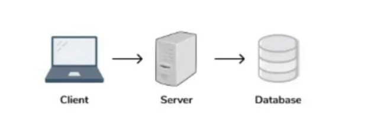
---

## Structured vs. Unstructured Data

- **Structured Data:** Organized into rows/columns with a predefined schema.  
  _Example: User accounts, orders, products (SQL tables)._

- **Unstructured Data:** No fixed schema; flexible formats.  
  _Example: Images, videos, logs, documents (often stored in object storage or NoSQL)._

---

## Relational Databases (SQL): The Traditional Powerhouse

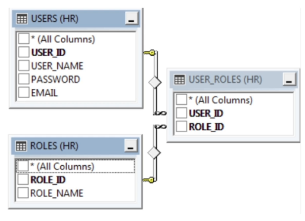

**Examples:** MySQL, PostgreSQL, Oracle, SQL Server

**Core Concepts:**

- **Schema-based:** Structure (tables, columns, data types) is defined upfront.
- **Rows and Columns:** Data organized like a spreadsheet.
- **Joins:** Combine data across tables.
- **ACID Transactions:** Atomicity, Consistency, Isolation, Durability.

### Example: Table Schema in SQL

```sql
CREATE TABLE users (
    id SERIAL PRIMARY KEY,
    username VARCHAR(50) NOT NULL,
    email VARCHAR(255) UNIQUE NOT NULL,
    created_at TIMESTAMP DEFAULT CURRENT_TIMESTAMP
);

CREATE TABLE orders (
    id SERIAL PRIMARY KEY,
    user_id INT REFERENCES users(id),
    total DECIMAL(10,2),
    created_at TIMESTAMP DEFAULT CURRENT_TIMESTAMP
);
```

### ACID Properties Recap

| Property    | Description                                                           |
|-------------|-----------------------------------------------------------------------|
| Atomicity   | All steps in a transaction succeed or none do (all-or-nothing)        |
| Consistency | Data must always be valid according to all defined rules/constraints  |
| Isolation   | Transactions do not interfere with each other                         |
| Durability  | Once committed, data survives crashes/failures                        |

> **Use Case:** Banking, inventory, ERP, CRM — where consistency and complex queries are critical.

---

## Limitations of Relational Databases

- **Rigid Schema:** Not ideal when data structure changes frequently.
- **Scaling:** Typically scale *vertically* (bigger server), which has limits and cost challenges.
- **Nested Data:** Handling deeply nested or variable data (e.g., JSON blobs) is clunky.

---

## Non-Relational Databases (NoSQL): Designed for Scale and Flexibility

**NoSQL** is a broad family of databases optimized for horizontal scaling, flexibility, and high performance. They're often schema-less or have a dynamic schema, making them suitable for rapidly evolving data.

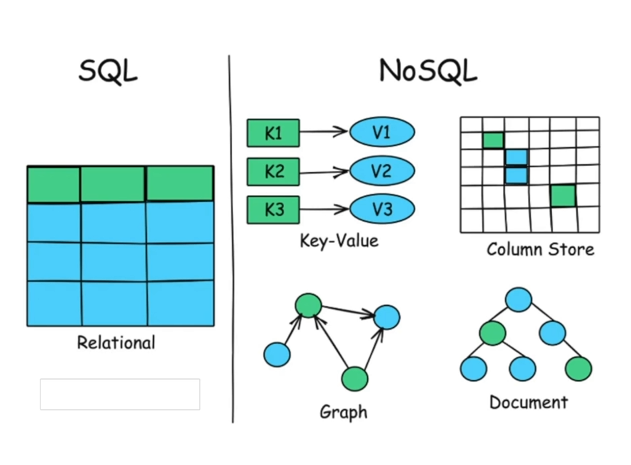

**Main Types:**

| Type             | Example DBs          | Best For                            |
|------------------|---------------------|-------------------------------------|
| Document         | MongoDB             | Nested/flexible data, CMS, profiles |
| Key-Value        | Redis, DynamoDB     | Caching, sessions, fast lookups     |
| Columnar         | Cassandra, HBase    | Analytics, time-series, big writes  |
| Graph            | Neo4j               | Social networks, recommendations    |

Here’s the text from your image formatted in clean **Markdown** 👇

---

## **NoSQL – Deep Dive**

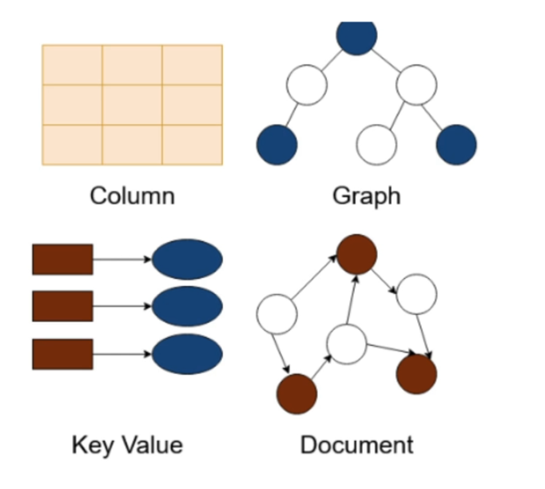
### **• Document Databases**

* JSON-like structure (key-value pairs, nesting supported)
* Ideal for content management, user profiles
* **Example:** MongoDB

---

### **• Key-Value Databases**

* Simple, fast, key-based lookups
* High performance, low latency
* **Example:** Redis, DynamoDB

---

### **• Columnar Databases**

* Store data by column, not row
* Optimized for analytical queries over large datasets
* **Example:** Cassandra, HBase

---

### **• Graph Databases**

* Store entities and relationships as nodes and edges
* Efficient for highly connected data (e.g., social networks)
* **Example:** Neo4j

---


### Example: Document Store (MongoDB)

```json
{
    "user_id": "12345",
    "username": "jane_doe",
    "profile": {
        "bio": "Engineer. Coffee lover.",
        "social": ["twitter", "github"]
    },
    "created_at": "2024-06-20T15:32:00Z"
}
```

#### Querying in MongoDB (NoSQL)

```js
db.users.find({ "profile.social": "github" })
```

---

## BASE Properties in NoSQL

NoSQL systems often relax ACID guarantees in favor of scalability and availability, summarized as **BASE**:

- **Basically Available:** System always returns a response (even if stale)
- **Soft state:** State may change over time, even without input (due to eventual sync)
- **Eventually consistent:** System guarantees data consistency... eventually

---

## The CAP Theorem: The Fundamental Trade-off

In any distributed system, you can fully guarantee only **2 of 3**:

- **Consistency:** Every read returns the latest write
- **Availability:** Every request gets a response (not always up-to-date)
- **Partition Tolerance:** System works despite network splits

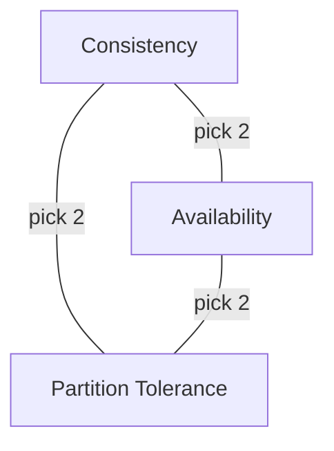

**At scale, partition tolerance is non-negotiable—so you must choose between consistency and availability.**

#### Database Models in CAP

| Model   | Tends Toward | Example Use Case                     | DB|
|---------|--------------|--------------------------------------|------|
| **CP**  | Consistency + Partition Tolerance | Financial, banking, critical systems | SQL|
| **AP**  | Availability + Partition Tolerance | Social media, product catalogs       | NoSQL|

---

## SQL vs. NoSQL: When to Use What?

| Use SQL (Relational) When...              | Use NoSQL (Non-Relational) When...                     |
|-------------------------------------------|--------------------------------------------------------|
| Complex queries, joins, relationships     | High scalability, massive traffic/data volume           |
| Strong consistency is required            | Flexible, evolving, or nested data                     |
| Data is structured & predictable          | Low-latency/high-throughput writes, caching, analytics |
| Examples: Banking, ERP, inventory         | Examples: IoT, social feeds, logs, recommendations     |

---

## Scaling Approaches: Vertical vs. Horizontal

| Vertical Scaling (Scale-Up)      | Horizontal Scaling (Scale-Out)      |
|----------------------------------|-------------------------------------|
| Add more CPU/RAM to one server   | Add more nodes; distribute data     |
| Simpler, but hardware limited    | Elastic, fault-tolerant, scalable   |
| SQL DBs (MySQL, PostgreSQL)      | NoSQL DBs (MongoDB, Cassandra)      |

---

## Polyglot Persistence: Best of Both Worlds

Many modern architectures use multiple database types for different components — e.g., using SQL for billing, NoSQL for activity feeds, and a graph DB for recommendations.

**Definition:**  
_Using different databases in the same application, choosing the best tool for each job._

---

## Diagrams

### NoSQL Database Types

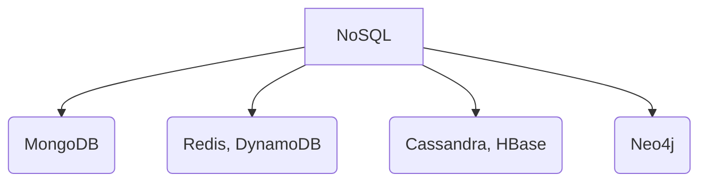

### CAP Theorem Venn Diagram

```mermaid
venn
    title CAP Theorem
    Consistency
    Availability
    PartitionTolerance
    Consistency & PartitionTolerance
    Availability & PartitionTolerance
```

---

## Tips and Tricks for Choosing and Using Databases

- **Know your data:** If your schema is known and relationships are complex, lean SQL. If data is unpredictable or nested, consider NoSQL.
- **Plan for scale:** If you expect massive growth, design for horizontal scaling — favor NoSQL or distributed SQL solutions.
- **Understand your consistency needs:** Financial or mission-critical systems need strong consistency (ACID/CP). For social feeds or caching, availability (AP/BASE) is often more valuable.
- **Mix and match:** Polyglot persistence lets you optimize each subsystem. Don’t force all your data into a single DB model.
- **Monitor and revisit:** As your system grows, periodically reassess data models, scaling strategies, and storage trade-offs.
- **Utilize managed services:** Cloud databases (e.g., AWS RDS, DynamoDB, Google Cloud Firestore) can offload maintenance and scalability headaches.

---

## Summary

Both SQL and NoSQL databases are foundational in system design. The best choice depends on your data structure, access patterns, scalability needs, and consistency requirements. Most production systems today use a combination of both, optimizing each part of the system for its unique data and workload.

---

**Next up:** We'll dive deeper into advanced database topics — sharding, replication, and polyglot persistence — to help you build truly scalable, resilient systems.

---

**Have more questions?**  
Check out our [interview questions section](#) for practice, or download the full PDF with detailed answers!

---

**References:**
- [CAP theorem on Wikipedia](https://en.wikipedia.org/wiki/CAP_theorem)
- [ACID vs. BASE Explained](https://www.ibm.com/cloud/blog/acid-vs-base)

---

*Happy designing! 🚀*

# Section 3

Certainly! Below is a detailed **Markdown blog section** integrating both the **transcript** and **slides** on **advanced database topics**. The section is written for a technical audience, includes code snippets, diagrams (using ASCII and Mermaid for Markdown compatibility), and a practical **Tips & Tricks** section.

---

# Advanced Database Topics: Scaling, Replication, Sharding, and Polyglot Persistence

Designing systems that are scalable, resilient, and high-performing is a core demand in today’s software architecture. In this section, we’ll go beyond CRUD operations to explore how advanced database strategies—**scaling, replication, sharding, and polyglot persistence**—empower global, production-grade systems.

---

## 1. Scaling Strategies: Vertical vs. Horizontal

Choosing how you scale your database determines your architecture’s evolution. The two primary strategies are:

### Vertical Scaling (Scale-Up)

- **Definition**: Boost the capacity of a single server (more CPU, RAM, SSD).
- **Typical With**: Relational/SQL databases (e.g., MySQL, PostgreSQL).
- **Pros**:
  - Simpler setup and management.
  - Strong consistency via ACID properties.
- **Cons**:
  - Limited by hardware ceilings.
  - Cost grows non-linearly.
  - Single point of failure.

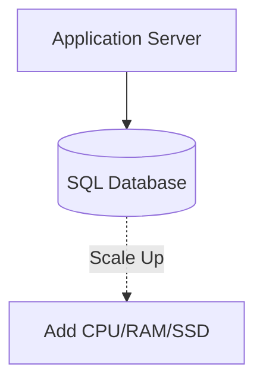

### Horizontal Scaling (Scale-Out)

- **Definition**: Add more servers/nodes to distribute load and data.
- **Typical With**: NoSQL databases (e.g., MongoDB, Cassandra).
- **Pros**:
  - Elastic scalability.
  - Handles large-scale traffic and big data
  - Better fault tolerance.
- **Cons**:
  - Increased operational complexity (Complex architecture).
  - Weaker consistency (Often eventual).

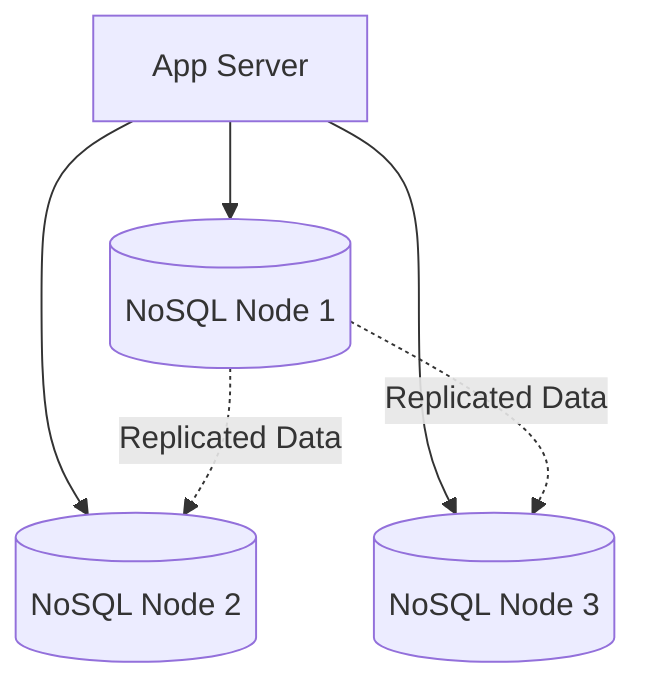

**When to use which?**
- **SQL/Vertical**: Banking, ERP, transactional systems.
- **NoSQL/Horizontal**: Social feeds, product catalogs, IoT, analytics.

---

## 2. Replication: Enhancing Availability and Performance

**Replication** means copying data across multiple database nodes for redundancy and increased throughput.

### Benefits

- **Fault Tolerance:** If one node fails, others can serve data.
- **Read Scalability:** Distribute read load across replicas.
- **Data Availability:** Users access data despite node failures.

### Common Models

#### Leader-Follower (Primary-Replica) Replication

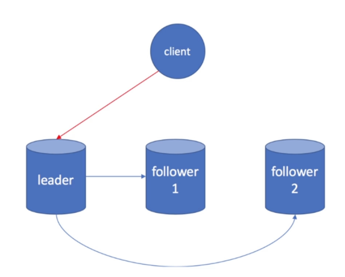

- **All writes** go to the **Leader**.
- **Reads** can go to **Followers** (replicas).
- **Asynchronous Replication** may cause followers to lag (eventual consistency).

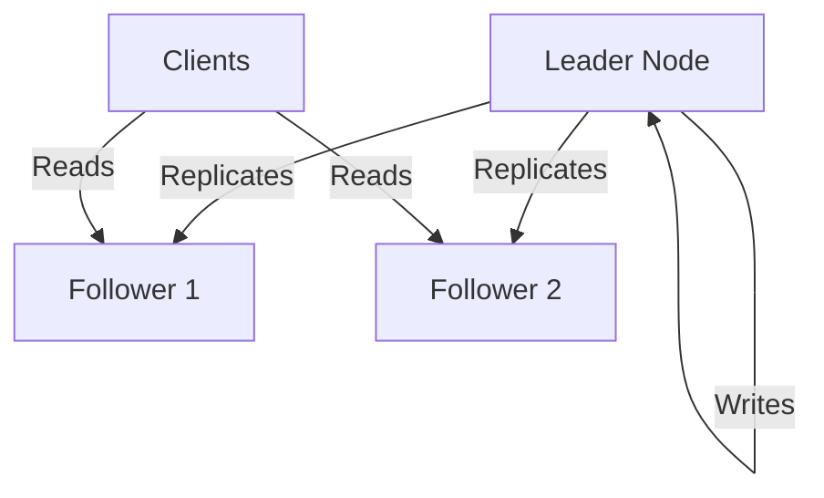

#### Read Replicas

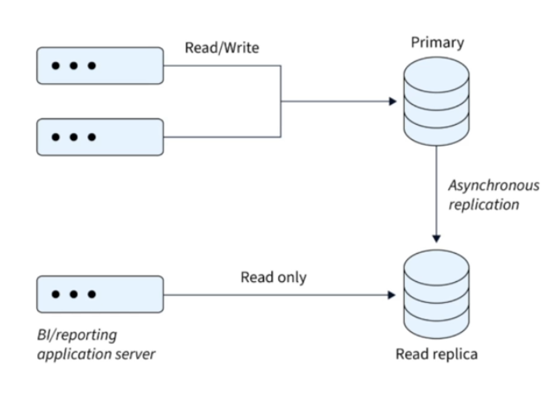

- **Purpose**: Scale read-heavy workloads.
- **All writes** go to the primary; **reads** are balanced across replicas.
- **Trade-off**: Potential for stale reads if replication lags.

---

**Example: Configuring Read Replicas in PostgreSQL**

```bash
# On the primary server (postgresql.conf)
wal_level = replica
max_wal_senders = 10
hot_standby = on

# On the replica server
standby_mode = 'on'
primary_conninfo = 'host=primary_ip user=replicator password=secret'
```

---

## 3. Sharding: Partitioning Data for Massive Scale

As systems outgrow the capacity of a single node, **sharding** divides data across multiple databases or nodes.

### Types of Sharding

- **Horizontal Sharding:** Split data by rows—e.g., user_id ranges.
- **Vertical Sharding:** Split by feature/domain—e.g., profiles vs. analytics.

### Sharding Strategies

#### a) Range-Based Sharding

- **How**: Data split by value ranges (e.g., user_id 1-1000 ⇒ Shard A).
- **Pro**: Simple, intuitive.
- **Con**: Risk of hotspots if data is skewed.

#### b) Hash-Based Sharding

- **How**: Apply a hash function to a key (e.g., user_id) for shard assignment.
- **Pro**: Even distribution.
- **Con**: Range queries are hard; re-sharding is painful.

**Example: Hash-Based Sharding in Python**
```python
def get_shard(user_id, num_shards):
    return hash(user_id) % num_shards

# Usage Example
shard_index = get_shard(12345, 4)  # returns shard index 0-3
```

#### c) Consistent Hashing

Solves the re-sharding problem: only a small subset of keys move when adding/removing nodes.

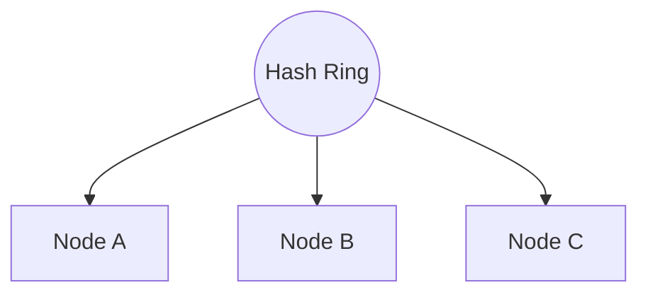

#### d) Geo-Based Sharding

- **How**: Shard by geographic region for latency/compliance.
- **Use Case**: Social media, CDN, regionally regulated data.

---

## 4. Polyglot Persistence: The Right Tool for Every Job

**Polyglot persistence** means using multiple database types in a single system, optimizing for the use-case.

| Data Need           | Recommended DB          | Example Use Case          |
|---------------------|------------------------|---------------------------|
| Relationships       | Relational (PostgreSQL) | User profiles, transactions|
| Flexible Documents  | Document (MongoDB)     | Product catalogs          |
| Fast Key Access     | Key-Value (Redis)      | Caching, session storage  |
| Full-Text Search    | Search Engine (ES)     | Search functionality      |
| Analytics           | Columnar (Cassandra)   | Log/metrics pipelines     |

**Example: Microservices with Polyglot Persistence**

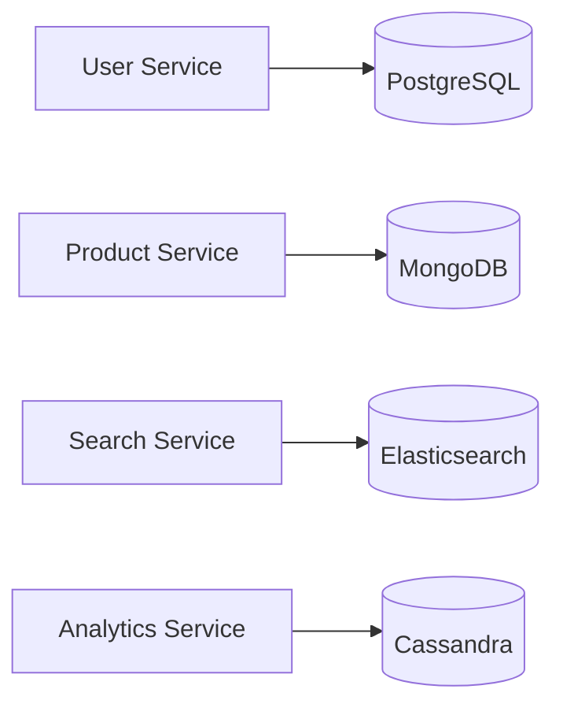

---

## 5. CAP Theorem: The Trade-offs Triangle

**You can only guarantee two out of three in a distributed system:**

- **Consistency (C)**: Every read gets latest write.
- **Availability (A)**: Every request receives a response.
- **Partition Tolerance (P)**: System works during network splits.

**No distributed system can be CA and P at the same time.**

| System Type | Guarantees     | Example          | When to Use                |
|-------------|---------------|------------------|----------------------------|
| CP          | Consistency + Partition | HBase, Zookeeper | Financial, critical data   |
| AP          | Availability + Partition | DynamoDB, Cassandra | Feeds, catalogs           |
| CA          | Consistency + Availability | Standalone SQL | Non-distributed, small scale|

---

## Tips & Tricks

**Designing for Scale and Resilience**

1. **Always anticipate growth**: Use horizontal scaling and sharding from the beginning if you expect rapid user/data growth.
2. **Replication for read-heavy systems**: Deploy read replicas to distribute load but monitor replication lag.
3. **Mix and match (polyglot) for best results**: Use the right database for the right task. Don’t force your transactional DB to also be your search engine!
4. **Monitor the CAP trade-offs**: Decide early if your system values consistency over availability, or vice versa.
5. **Use consistent hashing for dynamic clusters**: Especially if you expect nodes to be added/removed frequently.
6. **Document your sharding key choices**: Poorly chosen sharding keys can lead to hotspots or unbalanced data.
7. **Automate failover and recovery**: Use managed database services or robust orchestration for quick failover.
8. **Simulate failures**: Test your replication and failover strategies (e.g., using [Chaos Engineering](https://principlesofchaos.org/)).

---

## Conclusion

Mastering advanced database topics like scaling, replication, sharding, and polyglot persistence is essential for designing modern, resilient systems that can handle real-world growth and complexity. Make architecture choices based on your **data access patterns, consistency needs, and scale expectations**—and always be ready to evolve as your system grows.

---

**Next Up:** In the following section, we’ll dive into **Object Storage**—how it works, where it fits in modern architectures, and why it’s a must-have for managing unstructured, large-scale data.

---

**Further Reading & Practice:**
- [Jepsen: Consistency Models](https://jepsen.io/)
- [Martin Fowler – Polyglot Persistence](https://martinfowler.com/bliki/PolyglotPersistence.html)
- [AWS Architecture Blog: Scaling Databases](https://aws.amazon.com/architecture/databases/)

---

**Interview Prep:**  
Review the questions listed above and try to answer them for your favorite system design scenario!

---

**Diagram Key:**  
- Mermaid diagrams can be rendered in supported Markdown viewers (e.g., GitHub, VSCode).
- ASCII diagrams convey structure if Mermaid is not available.

---

*Happy scaling!* 🚀

# Section 4

Certainly! Here’s a detailed blog section about **Object Storage in Modern System Design**, integrating the transcript and slide content, with code snippets, diagrams (in Markdown/ASCII), and a “Tips & Tricks” section.

---

# Object Storage in Modern System Design

> Modern applications—from photo sharing to big data analytics—need to store and retrieve massive amounts of unstructured data reliably, affordably, and at scale. Enter *object storage*: the backbone of cloud-native storage systems.

---

## Table of Contents

- [What is Object Storage?](#what-is-object-storage)
- [Key Concepts & Architecture](#key-concepts--architecture)
- [Popular Object Storage Platforms](#popular-object-storage-platforms)
- [Common Use Cases](#common-use-cases)
- [Performance and Cost Considerations](#performance-and-cost-considerations)
- [Sample Code: Using Amazon S3](#sample-code-using-amazon-s3)
- [Interview Questions](#interview-questions)
- [Tips and Tricks](#tips-and-tricks)
- [Summary & Key Takeaways](#summary--key-takeaways)

---

## What is Object Storage?

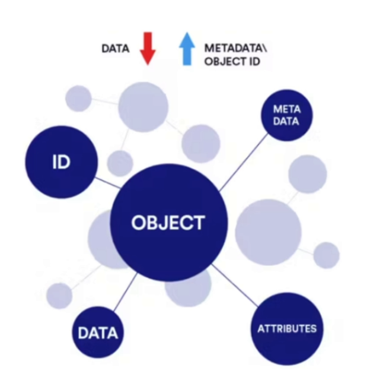

**Object storage** is a storage architecture that manages data as *objects*, rather than as files in a hierarchy (file storage) or blocks (block storage). It stores data as flat namespace.

- **Each object** contains:
  - The data itself (e.g., an image, video, or document)
  - A unique identifier (object key)
  - Metadata (extra info: content-type, tags, timestamps, etc.)

Unlike traditional file or block storage, object storage systems are:
- **Scalable**: Billions of objects, petabytes+ of data
- **Distributed**: Spans servers, data centers, regions, even continents
- **Optimized for Unstructured Data**: Handles images, videos, logs, backups, etc.

---

<details>
<summary><b>💡 What Does "Flat Namespace" Mean in Object Storage?</b></summary>

---

### 🧱 Explanation

When we say **object storage uses a flat namespace**, it means there are **no hierarchical folders or directories** —  
every object is stored in a **single logical container (bucket)** and identified by a **unique key (name or ID)**.

---

### 🧩 Example Comparison

#### 🗂️ File Storage (Hierarchical)
```

/images/2025/travel/beach.png
/images/2025/travel/mountains.png

```

Here, files exist inside real folders (`images/`, `travel/`).

#### 🪣 Object Storage (Flat)
```

images/2025/travel/beach.png
images/2025/travel/mountains.png

```

There are **no real folders** — the slashes (`/`) are *just part of the object name*.  
Everything exists in **one big flat space**.

---

### 🪣 AWS S3 Example

In an S3 bucket:
```

my-bucket/photos/beach.jpg
my-bucket/docs/report.pdf
my-bucket/backups/2025/jan.zip

```

Under the hood:
- S3 does **not** create real directories.
- It simply stores object keys:
```

"photos/beach.jpg"
"docs/report.pdf"
"backups/2025/jan.zip"

```
- The folder view in the AWS Console is **just a visual convenience**.

---

### ⚙️ Why Flat Namespace?

| Advantage | Explanation |
|------------|--------------|
| **Scalability** | Easier to distribute data across nodes — no directory hierarchy to manage. |
| **Simplicity** | Each object has a globally unique key — easy to retrieve directly. |
| **Performance** | Ideal for billions of objects — key-based lookup is faster than path traversal. |

---

### ⚖️ Analogy

- **File storage** → like a *folder tree* on your computer.  
- **Object storage** → like a *key-value store* — each object is fetched by its **key**, not its folder path.

---

### ✅ Summary

> A **flat namespace** in object storage means:
> - All objects exist at the same logical level inside a bucket.  
> - Each object is identified by a **unique key**, not a directory path.  
> - Folders you see are only **naming conventions**, not actual directories.

---

</details>

---

## Key Concepts & Architecture

Let’s break down the main building blocks of object storage:

### 1. **Object**

- **Definition**: The fundamental unit, a self-contained package of data + metadata + identifier.
- **Analogy**: Like a ZIP file with all relevant info bundled inside.

### 2. **Bucket**

- **Definition**: A logical container for objects (similar to folders, but flat—not hierarchical).
- **Role**: Organizes objects; every object must belong to a bucket.

### 3. **Metadata**

- **Definition**: Flexible, extensible info about the object.
- **Examples**: MIME type, creation date, owner, custom tags, access controls.

#### ASCII Diagram: Object Storage Structure

```plaintext
+-------------------+             +-------------------+
|    Bucket: photos |             |    Bucket: videos |
+-------------------+             +-------------------+
|  +-------------+  |             |  +-------------+  |
|  | Object:     |  |             |  | Object:     |  |
|  | dog.jpg     |  |             |  | movie.mp4   |  |
|  | Key: 123abc |  |             |  | Key: 456xyz |  |
|  | Metadata:   |  |             |  | Metadata:   |  |
|  |  - type     |  |             |  |  - type     |  |
|  |  - tags     |  |             |  |  - tags     |  |
|  +-------------+  |             |  +-------------+  |
+-------------------+             +-------------------+
```
---

## Popular Object Storage Platforms

- **Amazon S3**: Industry gold standard, highly durable, vast ecosystem.
- **Google Cloud Storage (GCS)**: Simple tiers, ML/data-lake friendly.
- **Azure Blob Storage**: Deep Microsoft stack integration, flexible tiers.
- **On-prem/Hybrid (Open Source)**: MinIO, Ceph—cloud-native APIs in your datacenter.

---

## Common Use Cases

- **Media Storage**: Store images, videos, design files (e.g., YouTube, asset management).
- **Backups & Archives**: Durable, cheap, long-term backup and compliance storage.
- **Data Lakes**: Massive raw-data repositories for analytics/AI (e.g., S3 Data Lake).
- **Static Website Hosting**: Host HTML/CSS/JS directly from S3/GCS buckets.
- **IoT & ML Data Pipelines**: Sink for sensor/model data, high-throughput ingestion.

---

## Performance and Cost Considerations

### Performance

- **Latency**: Higher than block/file storage; not ideal for rapid small reads/writes.
- **Throughput**: Designed for massive parallel access—great for large data sets.
- **Consistency**: Often eventual (e.g., S3), so changes may not be instantly visible.
- **Access Patterns**: Best for “write-once, read-many” workloads; not optimized for frequent updates/appends.

### Cost

- **Storage Tiers**: Standard, Infrequent Access, Archive (e.g., S3 Glacier).
- **Pricing**: Pay for storage used, *and* for API requests (PUT, GET), and data egress.
- **Best Practices**:
  - Use lifecycle rules to move stale data to cheaper tiers or delete it.
  - Monitor usage, adjust storage classes as access patterns change.

---

## Sample Code: Using Amazon S3

Let’s upload and retrieve a file using Python and [boto3](https://boto3.amazonaws.com/v1/documentation/api/latest/index.html):

```python
import boto3

# Initialize S3 client
s3 = boto3.client('s3')

# Upload a file
s3.upload_file('local_photo.jpg', 'my-photo-bucket', 'photos/dog.jpg',
               ExtraArgs={'Metadata': {'uploaded_by': 'alice', 'project': 'pets'}})

# Download a file
s3.download_file('my-photo-bucket', 'photos/dog.jpg', 'downloaded_dog.jpg')

# Get object metadata
response = s3.head_object(Bucket='my-photo-bucket', Key='photos/dog.jpg')
print(response['Metadata'])
```

---

## Interview Questions

- What is object storage and how is it different from file or block storage?
- When would you choose object storage over a traditional file system?
- Explain the structure of an object in object storage. What role does metadata play?
- Design a media hosting platform (e.g., YouTube). How would you use object storage for video uploads and streaming?
- What are the performance trade-offs of using object storage for real-time access?

---

## Tips and Tricks

- **Use Metadata Wisely**: Tag objects for easier search, access control, and automation.
- **Lifecycle Rules**: Automate moving old data to cheaper storage or deletion to control costs.
- **Monitor Usage**: Use built-in analytics to spot unused or rarely-accessed data.
- **Secure Your Buckets**: Enforce least-privilege, use bucket policies, and enable object versioning.
- **Optimize for Access Patterns**: Use Standard tier for hot data, Archive/Glacier for cold data.
- **Batch Operations**: When possible, batch uploads/downloads to reduce request costs.

---

## Summary & Key Takeaways

- **Object storage** is the go-to solution for scalable, distributed management of unstructured data.
- **Core concepts**: objects (data + metadata + key), buckets (containers), and flexible metadata.
- **Best fit** for media, backups, analytics data lakes, and static website hosting.
- **Choose the right tier** for your access pattern to optimize both performance and cost.
- **Embrace** metadata and lifecycle management for efficient, organized storage.

---

**Next Up:** In the next section, we’ll explore how traditional and modern distributed file systems (like HDFS) work, and how they compare to object storage.

---

*(Want more code samples or have a use case question? Drop them in the comments!)*

# Section 5

Certainly! Here’s a detailed blog section on **File Systems and Distributed Storage** that integrates both your lecture transcript and slides, with code snippets, diagrams as markdown, and a practical ‘Tips & Tricks’ section.

---

# File Systems and Distributed Storage: Foundations for Scalable Data Systems

Modern applications, from cloud platforms to big data analytics, rely on robust storage solutions. While object storage (like S3) often gets the spotlight, the underlying file system and distributed storage architectures are just as critical. Understanding these concepts is essential for anyone designing reliable, high-throughput, and scalable data systems.

---

## Table of Contents

1. [What is a File System?](#what-is-a-file-system)
2. [Traditional File Systems: Strengths & Limitations](#traditional-file-systems-strengths--limitations)
3. [Distributed File Systems (DFS): The Need for Scale](#distributed-file-systems-dfs-the-need-for-scale)
4. [DFS Architecture: NameNode & DataNodes](#dfs-architecture-namenode--datanodes)
5. [Scalability, Fault Tolerance, and Performance](#scalability-fault-tolerance-and-performance)
6. [Code Snippet: Accessing HDFS in Python](#code-snippet-accessing-hdfs-in-python)
7. [Diagram: DFS Architecture](#diagram-dfs-architecture)
8. [Tips & Tricks](#tips--tricks)
9. [Key Takeaways](#key-takeaways)

---

## What is a File System?

A **file system** is the foundational layer that defines how data is stored, organized, and accessed on storage media (like hard drives, SSDs, or removable disks).

- **Responsibilities:**
  - Stores files and manages metadata (name, timestamps, permissions, size)
  - Manages directory hierarchy (folders/subfolders)
  - Handles read/write operations and access control

**Common file systems:**  
- `ext4` (Linux), `NTFS` (Windows), `XFS` (high-performance Linux)

> File systems are crucial for performance, reliability, and compatibility in any computing infrastructure.

---

## Traditional File Systems: Strengths & Limitations

Traditional file systems (ext4, NTFS) use a **hierarchical structure**—folders and files arranged in a tree:

```
/ (root)
└── home/
    ├── user/
    │   ├── docs/
    │   └── photos/
```

**Key limitations:**

- **Single-node design:** All storage is managed on one machine
- **Limited scalability:** Cannot easily scale across multiple servers
- **Not fault tolerant:** Hardware failure = data loss unless external backups are used

**Best suited for:**  
Personal computers, small servers, or workloads not requiring distributed, parallel access or massive scale.

---

## Distributed File Systems (DFS): The Need for Scale

As data volumes and reliability requirements grow, traditional file systems fall short. Enter the **Distributed File System (DFS)**.

> **Definition:**  
> A DFS allows files to be **stored and accessed across multiple nodes/servers**, but appears as a single file system to users and applications.

### Key Benefits

- **Redundancy & Fault Tolerance:** Data is replicated across nodes; hardware failure does not mean data loss.
- **Horizontal Scalability:** Add more nodes to increase capacity and throughput.
- **High Throughput:** Parallel read/write operations across the cluster.

**Real-world examples:**  
- **HDFS (Hadoop Distributed File System):** Powers Hadoop and Spark analytics.
- **CephFS, GlusterFS:** Enterprise and scientific storage.

---

## DFS Architecture: NameNode & DataNodes

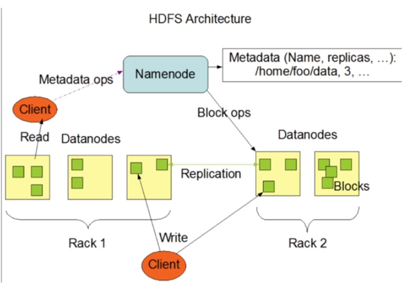

Let's break down a classic DFS architecture (like HDFS):

**Components:**

- **NameNode:**  
  The "brain" of DFS. Manages metadata (file names, directories, permissions, and block locations).

- **DataNodes:**  
  The "workhorses." Store actual data blocks.

**How it works:**

1. **File upload:** Split into fixed-size blocks (e.g., 128MB).
2. **Block distribution:** Blocks are distributed across DataNodes.
3. **Replication:** Each block is stored on multiple DataNodes (default: 3 copies).
4. **Metadata:** NameNode keeps track of where each block lives.

**Block size & striping:**
- Larger blocks = fewer metadata entries, but less flexibility.
- Striping enables parallel access and higher throughput.

---

## Scalability, Fault Tolerance, and Performance

### Scalability

- **Horizontal scaling:** Add more DataNodes to increase capacity & speed.
- **Automatic rebalancing:** DFS redistributes data as nodes are added/removed.

### Fault Tolerance

- **Replication factor:** (e.g., 3) ensures that if one node fails, data is available from another replica.
- **Self-healing:** DFS automatically copies data to healthy nodes if a node goes offline.

### Performance

- **Parallel IO:** Multiple nodes serve read/write requests simultaneously.
- **High throughput:** Ideal for analytics, machine learning, and backup workloads.

---

## Code Snippet: Accessing HDFS in Python

Interacting with HDFS can be done using the [`hdfs`](https://hdfscli.readthedocs.io/en/latest/) Python library:

```python
from hdfs import InsecureClient

# Connect to HDFS (assumes NameNode at localhost:9870)
client = InsecureClient('http://localhost:9870', user='hadoop')

# List files in a directory
print(client.list('/user/data'))

# Write a file to HDFS
with client.write('/user/data/example.txt', encoding='utf-8') as writer:
    writer.write('Hello, HDFS!')

# Read a file from HDFS
with client.read('/user/data/example.txt', encoding='utf-8') as reader:
    content = reader.read()
    print(content)
```

---

## Diagram: DFS Architecture

Here’s a simple ASCII diagram of the DFS architecture:

```
                +----------------------+
                |      NameNode        |
                | (Metadata manager)   |
                +----------+-----------+
                           |
       +-------------------+-------------------+
       |                   |                   |
+---------------+   +---------------+   +---------------+
|   DataNode    |   |   DataNode    |   |   DataNode    |
| (Stores data) |   | (Stores data) |   | (Stores data) |
+---------------+   +---------------+   +---------------+
       |                   |                   |
    [Block 1]          [Block 2]           [Block 3]
    [Block 3]          [Block 1]           [Block 2]
 (Replication ensures each block is on multiple nodes)
```

---

## Tips & Tricks

- **Tune Block Size:**  
  Adjust block size (e.g., from 64MB to 256MB+) based on workload. Larger files → larger blocks.

- **Monitor Replication:**  
  Avoid under- or over-replication. Too few = risk of data loss; too many = wasted space.

- **Automate Rebalancing:**  
  Enable DFS’s built-in rebalancer to redistribute data as nodes are added/removed.

- **Secure Your Cluster:**  
  Use Kerberos or other authentication for NameNode/DataNodes in production to prevent unauthorized access.

- **Optimize for Access Patterns:**  
  For analytics, use striping and partitioning to maximize parallel access.

- **Plan for NameNode Failure:**  
  In HDFS, the NameNode is a single point of failure (unless using HA mode). Always configure NameNode HA for production.

---

## Key Takeaways

- **File systems** are foundational for data storage; traditional ones (ext4, NTFS) are best for single-node, small-scale systems.
- **Distributed File Systems (DFS)** like HDFS enable high-throughput, reliable storage across many nodes.
- **DFS architecture** (NameNode/DataNodes, block-based storage, replication) supports fault tolerance and horizontal scalability.
- **Choosing the right storage** (traditional FS vs. DFS) depends on scale, workload, and reliability needs.
- **DFS is critical** for big data, analytics, and any environment where data must be stored and accessed across multiple machines.

---

**Next Up:**  
We’ll dive deeper into big data workloads and see how distributed file systems like HDFS power analytics, machine learning, and modern cloud data platforms.

---

**Further Reading:**
- [HDFS Architecture Guide (Apache)](https://hadoop.apache.org/docs/current/hadoop-project-dist/hadoop-hdfs/HdfsDesign.html)
- [CephFS Documentation](https://docs.ceph.com/en/latest/cephfs/)
- [GlusterFS Overview](https://docs.gluster.org/en/latest/)

---

*Have questions or tips from your own experience with file systems and DFS? Share in the comments below!*

# Section 6


# Big Data Fundamentals in System Design: Concepts, Architecture & Best Practices

Modern software systems—from Netflix recommendations to IoT-driven smart factories—are fueled by data. But as data grows in **volume**, **speed**, and **complexity**, traditional storage and processing systems struggle to keep up. In this section, we’ll explore Big Data fundamentals: what makes data ‘big’, why classic databases are insufficient, and how distributed architectures, storage, and processing paradigms enable high-performance, data-driven systems.

---

## Table of Contents

1. [What is Big Data? The 6 V's](#what-is-big-data-the-6-vs)
2. [Why Traditional Storage Fails at Scale](#why-traditional-storage-fails-at-scale)
3. [Distributed Storage for Big Data](#distributed-storage-for-big-data)
4. [Big Data Workloads: Real-World Examples](#big-data-workloads-real-world-examples)
5. [Batch vs. Stream Processing](#batch-vs-stream-processing)
6. [Code Example: Simple Batch & Stream Processing](#code-example-simple-batch--stream-processing)
7. [Diagrams: Big Data Architecture](#diagrams-big-data-architecture)
8. [Tips & Tricks for Big Data System Design](#tips--tricks-for-big-data-system-design)
9. [Summary & Key Takeaways](#summary--key-takeaways)

---

## What is Big Data? The 6 V's

Big Data describes datasets **too large, too fast, or too complex** for traditional data tools (like relational databases) to handle efficiently. To frame the challenges and characteristics of Big Data, remember the **6 V's**:

| V         | Description                                                         | Example                                 |
|-----------|---------------------------------------------------------------------|-----------------------------------------|
| **Volume**    | Massive data quantities (TBs, PBs, or more)                         | Social media, IoT, transaction logs     |
| **Velocity**  | High speed of data generation and processing                        | Clickstreams, sensor feeds, stock data  |
| **Variety**   | Diverse formats: structured, semi/unstructured                      | Tables, JSON, images, videos, logs      |
| **Veracity**  | Data quality: accuracy, noise, trustworthiness                      | Incomplete, noisy, or ambiguous data    |
| **Value**     | Business or analytical value derived from data                      | Insights, decisions, model training     |
| **Variability**| Inconsistency and unpredictability in data meaning/structure       | Changing context, evolving schemas      |

> **Tip:** In interviews, referencing the 6 V’s demonstrates deep understanding of Big Data challenges!

---

## Why Traditional Storage Fails at Scale

Traditional systems (like relational databases or single-server file storage) break down for Big Data due to:

- **Limited Scalability**: Vertical scaling (adding CPU/RAM to one server) hits physical and cost limits.
- **Performance Bottlenecks**: Not optimized for parallel reads/writes.
- **Cost Inefficiency**: Scaling up is expensive; maintenance is labor-intensive.
- **Lack of Fault Tolerance**: No built-in redundancy—data loss risk on hardware failure.

> **Example:** Imagine storing petabytes of logs from millions of sensors on a single server—simply infeasible.

---

## Distributed Storage for Big Data

Modern Big Data solutions rely on **distributed file systems** and **cloud-native object storage**:

| Storage Type          | Example             | Best For                            | Key Features                        |
|----------------------|---------------------|-------------------------------------|-------------------------------------|
| **Distributed File System** | HDFS, CephFS, GlusterFS | Analytics, high-throughput workloads | Replication, horizontal scale, fault tolerance |
| **Object Storage**   | Amazon S3, GCS, Azure Blob | Unstructured data, backups, data lakes | Scalable, metadata-rich, API-driven |

**How Distributed Storage Works:**

- Data is split into blocks/objects and distributed across many nodes.
- **Replication** ensures that if one node fails, data is safe elsewhere.
- **Horizontal scaling**: Add more nodes to grow storage and throughput.

---

## Big Data Workloads: Real-World Examples

- **Logs & Events:** Application/system logs, server metrics (monitoring & auditing).
- **Clickstreams:** Tracks user navigation on websites/apps (personalization, analytics).
- **IoT Data:** Streams from sensors, smart meters, wearables.
- **Machine Learning Pipelines:** Model training, feature extraction, data versioning.

> **Commonality:** All require infrastructure that is scalable, flexible, and can handle both _large volumes_ and _high velocity_.

---

## Batch vs. Stream Processing

### Batch Processing
- **Definition:** Processes large data chunks at intervals (e.g., hourly, nightly).
- **Use Cases:** Historical analysis, ETL jobs, aggregations.
- **Tools:** Hadoop, Apache Spark (batch mode).
- **Trade-offs:** High throughput, but higher latency.

### Stream Processing
- **Definition:** Processes data in real-time as it arrives.
- **Use Cases:** Monitoring, fraud detection, real-time recommendations.
- **Tools:** Apache Kafka, Spark Streaming, Apache Flink.
- **Trade-offs:** Low latency, continuous insights, but may need more complex infrastructure.

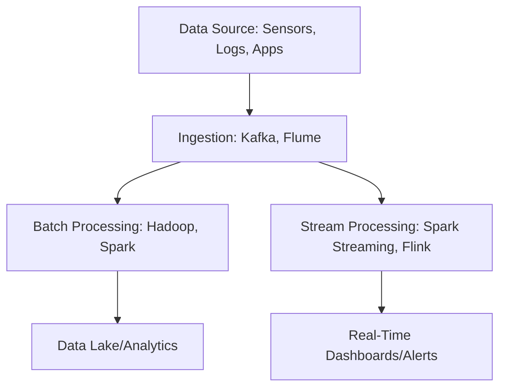

---

## Code Example: Simple Batch & Stream Processing

**Batch Example – Apache Spark (PySpark)**

```python
from pyspark.sql import SparkSession

spark = SparkSession.builder.appName("BatchExample").getOrCreate()
df = spark.read.json("logs/2024-06-01.json")
agg = df.groupBy("event_type").count()
agg.show()
```

**Stream Example – Kafka Consumer (Python)**

```python
from kafka import KafkaConsumer

consumer = KafkaConsumer('iot-stream', bootstrap_servers='localhost:9092')
for msg in consumer:
    process(msg.value)   # Custom function for real-time processing
```

---

## Diagrams: Big Data Architecture

### 1. Big Data Storage & Processing Pipeline

```mermaid
flowchart LR
    DataSource1[IoT Sensors]
    DataSource2[Web Logs]
    DataSource3[App Clickstreams]
    DataSource1 --> Ingestion[Ingestion Layer<br/>(Kafka, Flume)]
    DataSource2 --> Ingestion
    DataSource3 --> Ingestion
    Ingestion --> Storage[Distributed Storage<br/>(HDFS, S3)]
    Storage --> Batch[Batch Processing<br/>(Spark, Hadoop)]
    Ingestion --> Stream[Stream Processing<br/>(Flink, Spark Streaming)]
    Batch --> Analytics[Analytics/BI]
    Stream --> Realtime[Real-Time Dashboards]
```

### 2. Distributed File System (HDFS) Architecture

```mermaid
flowchart TB
    subgraph HDFS Cluster
        NameNode[NameNode<br/>(Metadata Manager)]
        DataNode1[DataNode 1]
        DataNode2[DataNode 2]
        DataNode3[DataNode 3]
    end
    NameNode <---> DataNode1
    NameNode <---> DataNode2
    NameNode <---> DataNode3
    DataNode1 <---> DataNode2
    DataNode2 <---> DataNode3
    DataNode3 <---> DataNode1
```

---

## Tips & Tricks for Big Data System Design

- **Know your 6 V’s:** Always consider volume, velocity, variety, veracity, value, and variability when evaluating requirements.
- **Choose Storage Wisely:** Use distributed file/object storage for unstructured or high-scale data; avoid monolithic databases.
- **Design for Failure:** Plan for node failures—replication and redundancy are non-negotiable.
- **Optimize Cost:** Leverage storage class tiers (e.g., S3 Standard, Glacier) for hot vs. cold data.
- **Hybrid Processing:** Combine batch (for large-scale analytics) and stream (for real-time actions) for robust solutions.
- **Consistency vs. Availability:** Use CAP theorem to guide trade-offs. For analytics, eventual consistency is often fine; for financial transactions, prefer stronger consistency.
- **Processing Tool Selection:** Use Spark/Hadoop for batch, Kafka/Flink/Spark Streaming for real-time.
- **Monitor and Clean Data:** Poor veracity (quality) can taint downstream analytics—invest in data validation and cleansing pipelines.
- **Scalability First:** Assume your data will grow—design horizontally scalable systems from the start.

---

## Summary & Key Takeaways

- **Big Data** is defined not just by size, but by its speed, diversity, quality, and business value.
- **Traditional storage** systems can’t handle Big Data demands—**distributed, scalable storage** is essential.
- **Batch and Stream Processing** are the two pillars for analyzing Big Data, each with their strengths.
- **System design** for Big Data is about managing trade-offs: scale, reliability, consistency, and cost.

> **In the next section:** We’ll explore how to match storage solutions to specific scenarios and recap the entire storage landscape for system design interviews!

---

### Further Reading & Practice

- [Hadoop Distributed File System (HDFS)](https://hadoop.apache.org/docs/r1.2.1/hdfs_design.html)
- [Amazon S3 Overview](https://aws.amazon.com/s3/)
- [Apache Spark Streaming](https://spark.apache.org/streaming/)
- [CAP Theorem Deep Dive](https://en.wikipedia.org/wiki/CAP_theorem)

---

*Feel free to copy/modify this Markdown for your own blog or study notes!*


# Section 7


# Mastering System Design: Storage and Databases

## Introduction

In modern system design, **storage and databases** form the backbone of reliable, scalable, and high-performing applications. Whether you’re building a social media platform, an analytics pipeline, or an IoT framework, the right storage solution determines your system’s **performance, reliability, and cost**. In this section, we’ll synthesize core concepts, practical trade-offs, and advanced techniques, integrating insights from both a comprehensive transcript and course slides.

---

## Section Agenda

1. [Introduction to Storage in System Design](#introduction-to-storage-in-system-design)
2. [Understanding Database Models: SQL vs. NoSQL](#understanding-database-models-sql-vs-nosql)
3. [Advanced Database Topics: Sharding, Replication & Polyglot Persistence](#advanced-database-topics-sharding-replication--polyglot-persistence)
4. [Object Storage in Modern Systems](#object-storage-in-modern-systems)
5. [File Systems and Distributed Storage](#file-systems-and-distributed-storage)
6. [Big Data Fundamentals](#big-data-fundamentals)
7. [Choosing the Right Storage Solution](#choosing-the-right-storage-solution)
8. [Tips and Tricks](#tips-and-tricks)
9. [Summary and Key Takeaways](#summary-and-key-takeaways)

---

## Introduction to Storage in System Design

All systems generate and consume data—**storing it efficiently is essential**. The type of storage you choose impacts not only **performance** but also **cost** and **reliability**. 

### Structured vs Unstructured Data

- **Structured**: Predefined schema (e.g., SQL tables, rows, columns)
- **Unstructured**: No schema, flexible format (e.g., images, videos, logs)

### Categories of Storage

| Category         | Example            | Use Case                                   |
|------------------|--------------------|--------------------------------------------|
| Database Storage | MySQL, MongoDB     | User data, transactional systems           |
| Object Storage   | S3, GCS, MinIO     | Media, backups, logs, analytics data lakes |
| File Storage     | NFS, SMB           | Shared files, small-scale file storage     |
| Block Storage    | EBS, SAN           | VM disks, databases needing low latency    |

### Storage Properties

- **Durability**: Data persists after failures.
- **Availability**: Data is accessible when needed.
- **Consistency**: Every read returns the latest write.
- **Atomicity**: (optional, for transactions) Operations are all-or-nothing.

> **Trade-off:** It’s impossible to maximize scalability, reliability, and performance simultaneously. The [CAP theorem](#the-cap-theorem) formalizes this.

---

## The CAP Theorem

**Diagram: CAP Triangle**

```
          Consistency
           /      \
          /        \
         /          \
    Partition    Availability
     Tolerance
```

- **Consistency:** All nodes see the same data at the same time.
- **Availability:** Every request receives a (non-error) response.
- **Partition Tolerance:** The system continues to operate despite network splits.

> **Rule:** In distributed systems, you can only fully guarantee two out of the three at any time.

### System Types

- **CP (Consistency + Partition Tolerance):** Financial systems (e.g., HBase)
- **AP (Availability + Partition Tolerance):** Social media feeds (e.g., DynamoDB)
- **CA (Consistency + Availability):** Only possible in single-node or tightly-coupled systems

---

## Understanding Database Models: SQL vs. NoSQL

### What is a Database?

A **database** is a structured way to store, retrieve, and manage data, supporting persistent storage and efficient querying.

### Relational (SQL) Databases

- **Examples:** MySQL, PostgreSQL, Oracle
- **Strengths:** Strict schema, ACID transactions, complex queries, relationships
- **Weaknesses:** Hard to scale horizontally, rigid schemas

**Code Example: SQL Table Creation**

```sql
CREATE TABLE users (
    id SERIAL PRIMARY KEY,
    username VARCHAR(50) UNIQUE,
    email VARCHAR(100),
    created_at TIMESTAMP DEFAULT CURRENT_TIMESTAMP
);
```

### NoSQL Databases

- **Types:** Document (MongoDB), Key-Value (Redis), Columnar (Cassandra), Graph (Neo4j)
- **Strengths:** Schema-less, horizontal scalability, diverse data types
- **Weaknesses:** Weaker consistency (often eventual), complex joins are hard

**Code Example: MongoDB Document Insert**

```js
db.users.insertOne({
  username: "alice",
  email: "alice@example.com",
  created_at: new Date()
});
```

### ACID vs BASE

- **ACID (SQL):** Atomicity, Consistency, Isolation, Durability
- **BASE (NoSQL):** Basically Available, Soft state, Eventually consistent

---

## Advanced Database Topics: Sharding, Replication & Polyglot Persistence

### Scaling Strategies

- **Vertical Scaling (Scale-Up):** Add resources to a single server (typical for SQL)
- **Horizontal Scaling (Scale-Out):** Add more servers/nodes (typical for NoSQL)

### Replication

Replicates data across nodes for **fault tolerance** and **read performance**.

**Leader-Follower Replication Diagram:**

```
      +-------+         +--------+      +--------+
      |Leader |  --->   |Follower| ...  |Follower|
      +-------+         +--------+      +--------+
        (writes)           (reads)         (reads)
```

- **Asynchronous replication** may result in lag; **synchronous** offers strong consistency but can impact availability.

### Sharding

Splits data across databases for scalability.

- **Range-based:** By value ranges (user_id 1–1000)
- **Hash-based:** Hash function distributes rows
- **Geo-based:** By user region/location

**Consistent Hashing Diagram:**

```
[Node1]---[Node2]---[Node3]---[Node1]
   |          |        |        |
[Key1]    [Key2]   [Key3]   [Key4]
```

> Only a subset of keys are remapped when nodes are added/removed.

### Polyglot Persistence

Using different database types for different components.

- **Example:** SQL for transactions, NoSQL for logs, Graph DB for relationships

---

## Object Storage in Modern Systems

**Object storage** manages data as objects (not files or blocks), each with a unique key and metadata, ideal for unstructured data at scale.

### Key Concepts

- **Object:** Data + Key + Metadata
- **Bucket:** Logical container for objects

**Diagram:** (Conceptual)
```
Bucket: "user-photos"
    ├── photo1.jpg (metadata: {uploaded_by: "alice", tags: ["vacation"]})
    ├── photo2.jpg (metadata: {uploaded_by: "bob", tags: ["profile"]})
```

### Example: Upload to Amazon S3 with Python

```python
import boto3

s3 = boto3.client('s3')
s3.upload_file('photo1.jpg', 'mybucket', 'photos/photo1.jpg', ExtraArgs={'Metadata': {'uploaded_by': 'alice'}})
```

### When to Use Object Storage

- Media files (images, videos)
- Backups and archives
- Data lakes for analytics
- IoT and ML data pipelines

> **Performance:** Higher latency than block/file storage, but supports massive parallel access and scalability.

---

## File Systems and Distributed Storage

### Traditional File Systems

- **Examples:** ext4, NTFS
- **Use Case:** Local, single-node storage

### Distributed File Systems (DFS)

- **Examples:** HDFS, CephFS, GlusterFS
- **Properties:** Redundancy, scalability, fault tolerance

**HDFS Architecture Diagram:**

```
+-------------------+
|     NameNode      |  (metadata, file hierarchy)
+-------------------+
         |
    +----------+
    | DataNode |  (stores blocks)
    +----------+
    | DataNode |
    +----------+
    | DataNode |
    +----------+
```

- **Replication:** Data is split into blocks and stored across multiple DataNodes (default replication factor = 3).

---

## Big Data Fundamentals

### The 6 V's of Big Data

1. **Volume** – Scale of data (terabytes, petabytes)
2. **Velocity** – Speed of data in/out
3. **Variety** – Different forms (structured, unstructured)
4. **Veracity** – Quality and trustworthiness
5. **Value** – Usefulness for business/insights
6. **Variability** – Changing data meaning or structure

### Why Traditional Storage Fails

- Limited scalability
- Performance bottlenecks
- Expensive to scale up
- Lacks fault tolerance

### Batch vs Stream Processing

| Batch Processing  | Stream Processing   |
|-------------------|--------------------|
| Large data chunks | Real-time, continuous |
| High throughput   | Low latency          |
| Example: Hadoop   | Example: Kafka, Flink |

---

## Choosing the Right Storage Solution

| Requirement                        | Best Storage Type                                      |
|-------------------------------------|--------------------------------------------------------|
| Structured, relational data         | SQL (e.g., PostgreSQL, MySQL)                          |
| Flexible, large-scale, evolving     | NoSQL (e.g., MongoDB, Cassandra)                       |
| Unstructured, large media/files     | Object Storage (e.g., S3, GCS)                         |
| High throughput, analytics          | Distributed File Systems (e.g., HDFS, CephFS)          |
| Real-time or batch big data         | Distributed Storage + Processing (HDFS, S3, Delta Lake)|

---

## Tips and Tricks

- **Hybrid Approach:** Use polyglot persistence—mix SQL, NoSQL, and object stores as needed.
- **CAP Theorem:** Know your trade-offs. For critical data, favor consistency; for user content feeds, favor availability.
- **Data Modeling:** For SQL, design normalized schemas. For NoSQL, optimize for access patterns.
- **Sharding:** Use consistent hashing for easier scaling and node management.
- **Replication:** Use read replicas to scale reads; be mindful of lag in asynchronous setups.
- **Object Storage Cost:** Use lifecycle policies to move old data to cheaper storage classes (e.g., S3 Glacier).
- **DFS for Analytics:** Choose HDFS or similar for big data processing pipelines, ensuring replication and scalability.
- **Batch vs Stream:** Use batch for historical analysis; use stream for real-time needs (fraud detection, alerts).
- **Security:** Implement access controls and encryption, especially for object and distributed storage.
- **Backup:** Regularly backup critical data, and test restoration procedures.

---

## Summary and Key Takeaways

- **Storage is foundational**—choose based on your data type, access pattern, and scale.
- **SQL** is best for structured, transactional data requiring strong consistency.
- **NoSQL** shines for scalability, flexibility, and unstructured data.
- **Sharding, replication, and polyglot persistence** are must-know techniques for scaling and reliability.
- **Object storage** is essential for modern, unstructured data at scale.
- **Distributed file systems** power high-throughput analytics and big data workloads.
- **Big data** requires new storage and processing paradigms—embrace distributed architectures.
- **No one-size-fits-all:** Real-world systems often combine several storage types for optimal results.

---

### What’s Next

In the next section, we’ll focus on **performance**—how to make systems not just work, but work **fast and efficiently**. We’ll explore concepts, tools, and techniques that enable high-performance applications.

**Stay tuned! 🚀**
```
---

