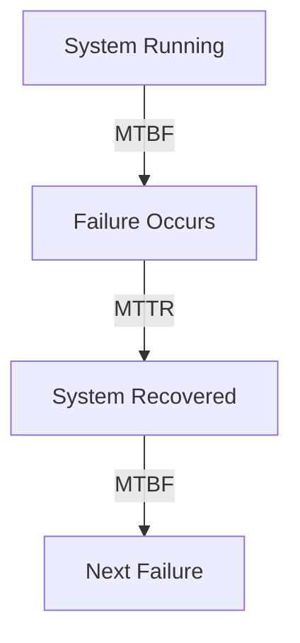
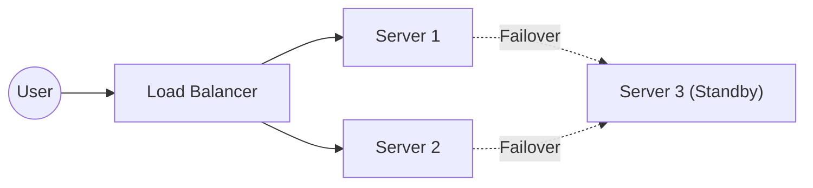
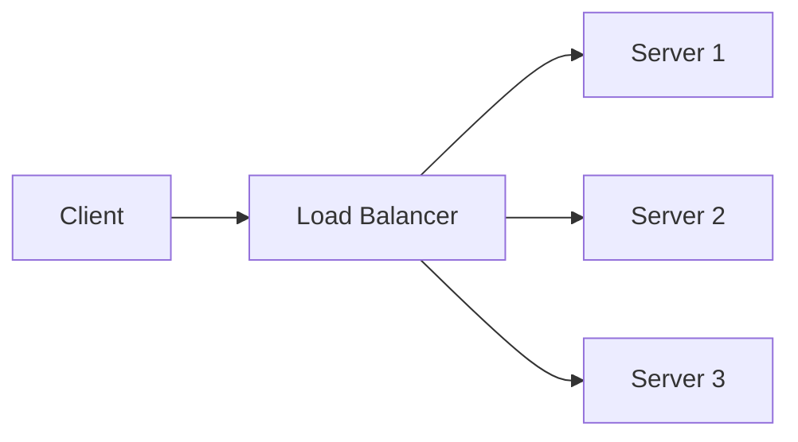
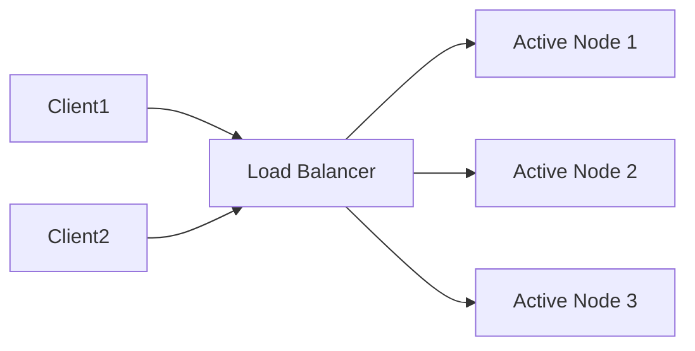
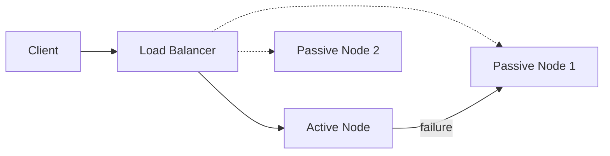
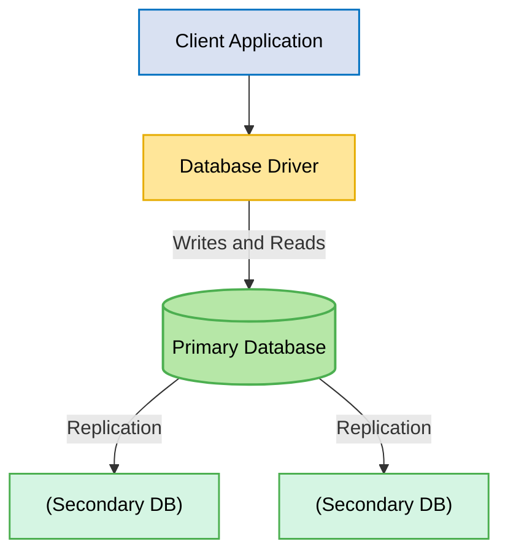
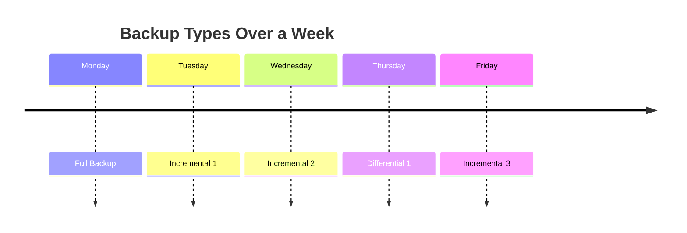
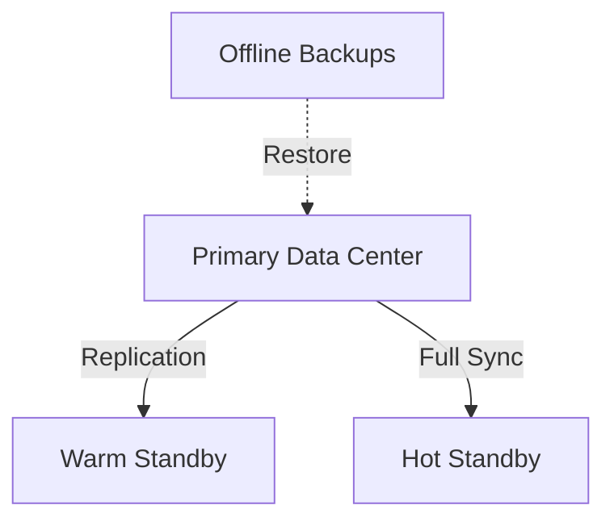

# Section 1


# Mastering System Design: Reliability, Availability & Disaster Recovery

Welcome to our deep dive into one of the most critical aspects of modern system design: **Reliability, Availability, and Disaster Recovery**. Whether you’re designing a high-traffic web application, building cloud-native microservices, or architecting distributed platforms at scale, ensuring your systems can withstand failures and recover gracefully is paramount.

This section covers:

- Core concepts of system reliability (MTBF, MTTR, SLAs)
- High availability, fault tolerance, and failover mechanisms
- Backup and recovery strategies
- Disaster recovery in practice
- Real-world patterns, trade-offs, and actionable tips

Let's get started!

---

## 1. Introduction to System Reliability

Modern users expect systems to be **always available, consistent, and trustworthy**. Any downtime can result in financial loss, reputational damage, and erosion of user trust. Reliability isn’t just about preventing failures — it’s about how quickly and gracefully a system can recover when something does go wrong.

> **"Systems fail. Reliability is how gracefully they handle it."**

### What is System Reliability?

Reliability is a system’s ability to **operate continuously without failure**. It encompasses:

- **Correctness** – The system performs its intended function without errors.
- **Consistency** – Predictable, repeatable behavior across requests and over time.
- **Fault Tolerance** – The ability to withstand failures without total disruption.
- **Availability/Uptime** – The percentage of time the system is working and accessible.

#### Key Metrics

- **MTBF (Mean Time Between Failures)**  
  Average time a system runs before encountering a failure.  
  _Higher MTBF = More stable system._

- **MTTR (Mean Time To Recovery)**  
  Average time to recover from a failure.  
  _Lower MTTR = Faster recovery._



- **SLAs (Service Level Agreements)**  
  Contractual guarantees on system performance (e.g., 99.9% uptime, response time, error rate).  
  > 99.9% uptime = ~8.76 hours downtime/year.

##### Availability vs. Durability

| Concept       | Description                                     | Example                                 |
|---------------|-------------------------------------------------|-----------------------------------------|
| **Availability** | System is accessible and responsive              | Can query a database anytime            |
| **Durability**   | Data is safe and not lost (even after failures)  | Data remains after system crash         |

---

## **Impact of Reliability on System Design**

### **Design decisions that affect reliability**

* **Redundancy:** Multiple instances, failover setups
* **Health checks and monitoring**
* **Retry mechanisms and circuit breakers**
* **Distributed design patterns:** Replication, quorum


---

## **Reliability in Distributed Systems**

### **Challenges**

* **Network partitions**
* **Node failures**
* **Eventual consistency**

---

### **Solutions**

* Use **CAP-aware design**
* Ensure **fault isolation**
* Implement **replication** & **consensus algorithms** (e.g., Paxos, Raft)

---


## **Reliability in Cloud-Native Systems**

### **Cloud infrastructure is inherently unreliable**

### **Design for:**

* **Transient failures**
* **Auto-scaling and self-healing**
* **Chaos engineering** to test resilience


> 💡 “**Design for failure**” is the **cloud-native mindset**

---

## 2. High Availability, Fault Tolerance & Failover

### Redundancy

Redundancy prevents single points of failure. Types include:

- **Hardware** (multiple servers/storage devices)
- **Network** (multiple routes/paths)
- **Services** (replicated microservices/databases)

#### Redundancy Strategies

| Strategy        | Description                                      | Use Case                         |
|-----------------|--------------------------------------------------|----------------------------------|
| **N+1**         | One extra instance for failover                  | 3 servers for 2 needed           |
| **Active-Active** | Multiple nodes handle requests together           | Load balancing across regions    |
| **Active-Passive** | One active node, standby nodes activated on failure | Standby backup DB or service     |

#### Graceful Degradation

Even during partial failures, provide reduced service rather than a total outage.

```python
def handle_request(request):
    if not essential_feature_available():
        # Disable non-essential feature
        return minimal_viable_response(request)
    return full_feature_response(request)
```

#### High Availability Patterns

- **Load Balancers**: Distribute traffic across healthy nodes.
- **Replication**: Copy data across nodes/regions.
- **Failover**: Auto-switch to backup on failure.



---

## 3. Backup & Recovery Strategies

#### What and Why

- **Backup**: Creating copies of data to protect against loss.
- **Recovery**: Restoring data after failure/corruption.
- Critical for: disaster recovery, ransomware protection, compliance, human error.

#### Backup Types

| Type         | Description                          | Pros                | Cons                 |
|--------------|--------------------------------------|---------------------|----------------------|
| **Full**     | Copies all data                      | Simple restore      | High storage & time  |
| **Incremental** | Changes since last backup             | Fast backup         | Slower restore       |
| **Differential** | Changes since last full backup         | Faster restore      | Larger than incremental|

#### Recovery Models

| Model        | Description          | Downtime | Cost    |
|--------------|----------------------|----------|---------|
| **Cold**     | Backups offline      | High     | Low     |
| **Warm**     | Some resources ready | Medium   | Medium  |
| **Hot**      | Fully redundant      | Minimal  | High    |

#### RTO & RPO

- **RTO (Recovery Time Objective)**: How quickly can you recover?
- **RPO (Recovery Point Objective)**: How much data loss is acceptable?

```mermaid
gantt
    dateFormat  HH:mm
    title Backup and Recovery Timeline
    section Normal operation
    Uptime                :done,    des1, 00:00, 04:00
    section Failure and Recovery
    Failure Detected      :active,  des2, 04:00, 00:30
    Recovery In Progress  :         des3, 04:30, 01:00
```



---

## 4. Disaster Recovery in Practice

#### Why DR Matters

- Downtime is expensive, especially for mission-critical systems.
- DR protects against regional outages, data loss, and cyber attacks.
- Complements backups with system-level resilience.

#### DR Strategies

- **Combine failover and backup**:  
    - Backup for data corruption/deletion.  
    - Failover for infrastructure/region failure.
- **Automate**: Failover switching, data validation, notifications.
- **Test regularly**: Run DR drills — _“If you haven’t tested it, you don’t have it.”_

#### Challenges

- **Geo-distributed systems**: Data consistency, latency, regulatory/data locality, coordinating multi-region failovers.
- **Quorum-based design**:  
    - Quorum = minimum nodes needed for agreement.
    - Ensures safe failover and consistency.

---

## 5. Tips and Tricks

> Here are some actionable tips for building reliable, highly available, and resilient systems:

- **Design for Failure**: Assume components will fail — build redundancy, automate failover, and monitor health.
- **Automate Everything**: Backups, failover, restores, and health checks.
- **Implement the 3-2-1 Backup Rule**:  
    - 3 copies of data  
    - 2 different media  
    - 1 offsite/off-cloud
- **Use Circuit Breakers and Retries**: Prevent cascading failures due to repeated calls to failing services.

```python
class CircuitBreaker:
    def __init__(self, failure_threshold):
        self.failure_threshold = failure_threshold
        self.failure_count = 0
        self.open = False

    def call(self, func, *args, **kwargs):
        if self.open:
            raise Exception("Circuit is open!")
        try:
            return func(*args, **kwargs)
        except Exception:
            self.failure_count += 1
            if self.failure_count >= self.failure_threshold:
                self.open = True
            raise

    def reset(self):
        self.failure_count = 0
        self.open = False
```

- **Test Regularly**: Run DR drills, test backups, and simulate failures (chaos engineering).
- **Monitor Key Metrics**: Track MTBF, MTTR, availability, error rates, and backup status.
- **Balance Cost vs. Risk**: Higher SLAs and lower RTO/RPO mean higher cost and complexity. Align with business needs.
- **Leverage Cloud-Native Features**: Use managed backups, auto-scaling, and self-healing features where possible.
- **Document and Review**: Keep disaster recovery and backup plans up to date and review them periodically.

---

## Summary

* **Reliability** is foundational to user trust.
* Metrics like **MTBF**, **MTTR**, and **SLAs** are vital to quantify it.
* **Design choices** must anticipate and tolerate failure.
* In **distributed/cloud systems**, reliability is an active design challenge.
* **What’s next:**

  * High Availability, Fault Tolerance & Failover

Reliability, availability, and disaster recovery are the backbone of resilient system design. By understanding core concepts, leveraging redundancy and automation, and preparing for failures, you can ensure your systems remain trustworthy and performant — even under pressure.

**Next Up:**  
We’ll explore security in system design — how to protect your systems and data from modern threats.

---

> _Want to practice? Try answering:_
> - How would you design a system for 99.99% availability?
> - What’s the difference between backup and failover?
> - How do you optimize RTO and RPO in a distributed environment?

---

Stay tuned for more system design deep dives!

---

**Note:**  
- Diagrams use [Mermaid](https://mermaid-js.github.io/) syntax — supported in many Markdown renderers and GitHub.
- Code snippets are illustrative and can be adapted to your stack.
- For more real-world interview questions, see the section after each major topic.


# Section 2

# Building Highly Available, Fault-Tolerant Systems: Redundancy, Failover, and Disaster Recovery

Designing systems that are **reliable**, **highly available**, and **resilient** is a foundational skill for any software architect or engineer. In this post, we’ll integrate core insights from both a comprehensive lecture and supporting slides, covering redundancy strategies, failover mechanisms, graceful degradation, backup and disaster recovery, and practical design tips. We’ll include diagrams and code snippets to bring these concepts to life.

---

## Table of Contents

1. [Why Reliability Matters](#why-reliability-matters)
2. [Core Concepts: Reliability, Availability, and Durability](#core-concepts-reliability-availability-and-durability)
3. [Redundancy Strategies](#redundancy-strategies)
    - [Hardware, Network, and Service Redundancy](#hardware-network-and-service-redundancy)
    - [N+1, Active-Active, and Active-Passive Architectures](#n1-active-active-and-active-passive-architectures)
4. [Graceful Degradation](#graceful-degradation)
5. [High Availability Patterns](#high-availability-patterns)
    - [Load Balancing](#load-balancing)
    - [Replication](#replication)
    - [Failover](#failover)
6. [Redundant Design in the Real World](#redundant-design-in-the-real-world)
    - [Geographical Redundancy](#geographical-redundancy)
    - [Automated Failover](#automated-failover)
7. [Health Monitoring & Self-Healing Systems](#health-monitoring--self-healing-systems)
8. [Backup & Recovery Strategies](#backup--recovery-strategies)
    - [Backup Types](#backup-types)
    - [Recovery Models: Cold, Warm, Hot](#recovery-models-cold-warm-hot)
    - [RTO & RPO](#rto--rpo)
9. [Disaster Recovery in Practice](#disaster-recovery-in-practice)
10. [Tips and Tricks](#tips-and-tricks)
11. [Summary](#summary)

---

## Why Reliability Matters

> "Systems fail. Reliability is how gracefully they handle it."

- **User Expectations:** Always available, consistent, and trustworthy systems.
- **Business Impact:** Downtime costs money, reputation, and user trust.
- **Metric Goals:** High reliability means fewer failures (high MTBF) and rapid recovery (low MTTR).

---

## Core Concepts: Reliability, Availability, and Durability

- **Reliability:** The ability of a system to operate continuously without failure (correctness, consistency, fault tolerance, uptime).
- **Availability:** The system is accessible and responsive to users.
- **Durability:** Data is retained and not lost, even in the face of failures.

#### Key Metrics

- **MTBF (Mean Time Between Failures):** Average operational time before a failure occurs.
- **MTTR (Mean Time To Recovery):** Average time to restore the system after a failure.

```text
High MTBF + Low MTTR = High Reliability
```

#### SLAs (Service Level Agreements)

- Contractual guarantees about system performance, e.g., 99.9% uptime means ~8.76 hours/year downtime.
- Common metrics: availability, response time, error rate.

---

## Redundancy Strategies

Redundancy is at the core of high availability and fault tolerance. It **prevents single points of failure** by adding extra components or paths.

### Hardware, Network, and Service Redundancy

- **Hardware:** Multiple servers/storage devices.
- **Network:** Multiple data centers, network connections, or routers.
- **Service:** Replicated microservices or database instances.



---

### N+1, Active-Active, and Active-Passive Architectures
 
Stratergies for Availability

#### N+1 Redundancy

- One more instance than needed (e.g., 3 servers for a 2-server load).
- If any one fails, the system remains available.

```text
Required = N
Provisioned = N+1
If one fails, N remain to serve traffic.
```

#### Active-Active

- All nodes are active, sharing the workload.
- High availability and load distribution.
- Requires robust load balancing and state synchronization.



#### Active-Passive

- Only one node is active; others are on standby.
- On failure, a passive node becomes active.
- Simpler, but less load-efficient and has failover latency.



---

## Graceful Degradation

Graceful degradation is about keeping **core functionality alive** during partial failures, even if some features are unavailable.

* **Definition:** System still operates at a reduced capacity during failures.

  * **Example:** During high traffic, disable non-essential features.
* Helps maintain **user experience** even when full service isn’t possible.
* Critical for ensuring users still benefit from some **functionality during outages**.


**Example:**  
If a recommendation engine fails on an e-commerce site, the main shopping and checkout features remain operational.

```python
# Pseudocode for graceful degradation in a Flask app
@app.route('/recommendations')
def recommendations():
    try:
        return get_recommendations(user_id)
    except RecommendationServiceError:
        # Degrade gracefully: show popular items instead
        return get_popular_items()
```

---

## High Availability Patterns

### * Load Balancing

Distributes traffic evenly across backend nodes. Essential for removing bottlenecks and handling node failures.

```python
# Example: NGINX load balancing config
upstream backend {
    server backend1.example.com;
    server backend2.example.com;
    server backend3.example.com;
}
server {
    listen 80;
    location / {
        proxy_pass http://backend;
    }
}
```

### * Replication

Replicate data across nodes/data centers for availability and durability.  
- **Synchronous Replication:** Zero data loss, but higher latency.
- **Asynchronous Replication:** Lower latency, but possible data loss on failure.

### * Failover

Automatically switches to a backup node if a primary fails.

```yaml
# Kubernetes deployment with readiness/liveness probes for failover
livenessProbe:
  httpGet:
    path: /healthz
    port: 8080
  initialDelaySeconds: 3
  periodSeconds: 3
```

---

## **Designing for Redundancy**

### **• Redundant Components**

* Design with multiple instances of key components (e.g., **servers**, **databases**, etc.) to avoid single points of failure.

---

### **• Geographical Redundancy**

* Use **multiple data centers** or **cloud regions** for disaster recovery.
* Ensures high availability and resilience during regional outages.

---

### **• Automated Failover**

* Ensure **failover happens automatically** without manual intervention.
* Enables seamless service continuity when a primary system fails.

---

### **🧠 Example Architecture**

A **client application** connects to a **database driver**, which handles connections to a **primary database**.
The primary replicates data to **secondary databases**, ensuring redundancy and quick recovery during failure.

---

### Geographical Redundancy

Distribute components across multiple regions to handle data center/region outages.



### Automated Failover

Automate detection and routing to healthy resources.

- **Health checks:** Regularly monitor all nodes.
- **Orchestration:** Use tools like Kubernetes, AWS Auto Scaling, Azure Availability Sets.

---

## Health Monitoring & Self-Healing Systems

### Health Monitoring

- Track server uptime, API responses, error rates, CPU/memory usage.
- Alert on anomalies before users notice.

### Self-Healing

- Systems that **automatically recover** (restart, redeploy, reroute).
- E.g., Kubernetes restarts crashed pods automatically.

```yaml
# Kubernetes pod auto-restart example
restartPolicy: Always
```

---

## Backup & Recovery Strategies

### Backup Types

- **Full Backup:** All data; simplest restore; most storage/time.
- **Incremental:** Changes since last backup; fast, but all increments needed to restore.
- **Differential:** Changes since last full backup; bigger than incremental, but faster to restore.

### Recovery Models: Cold, Warm, Hot

| Model         | Resources Provisioned | Downtime | Cost      |
|---------------|----------------------|----------|-----------|
| Cold          | None                 | High     | Low       |
| Warm          | Some                 | Moderate | Moderate  |
| Hot           | Full (always ready)  | Minimal  | High      |

### RTO & RPO

- **RTO (Recovery Time Objective):** How quickly can systems recover?
- **RPO (Recovery Point Objective):** How much data loss is acceptable?

---

## Disaster Recovery in Practice

- **Combine failover and backup** for true resilience.
- **Automate and regularly test** your DR plans.
- **Geo-redundancy:** Deploy across geographically separate locations.
- **Quorum-based design:** Ensure a majority of nodes confirm changes for safe failover and consistency.

```mermaid
graph TD
A[Primary Region] -.sync.-> B[Secondary Region]
A --> Quorum[Quorum (majority nodes)]
```

---

## Tips and Tricks

- **Design for failure:** Assume components/services will fail; plan accordingly.
- **Automate everything:** Backups, failover, health checks, restore tests.
- **Use the 3-2-1 backup rule:** 3 copies, 2 different media, 1 offsite.
- **Monitor and alert:** Don’t just collect metrics—act on them.
- **Test your DR plan:** If you haven’t tested it, you don’t have it.
- **Document SLAs and recovery objectives:** Explicitly define and communicate RTO/RPO.
- **Balance cost vs. risk:** Not every system needs “five nines” (99.999%)—match redundancy to business needs.
- **Gracefully degrade:** Prioritize core features, and design for partial service during failures.

---

## Summary

- **Reliability** is foundational—measured by metrics like MTBF, MTTR, and SLAs.
- **Redundancy** (hardware, network, service) prevents single points of failure.
- Patterns like **N+1, active-active, and active-passive** support high availability.
- **Graceful degradation** keeps core user experience intact during partial failures.
- **Load balancing, replication, automated failover, and self-healing** are critical patterns in real-world HA systems.
- **Backup and disaster recovery** strategies require regular testing, automation, and a clear understanding of RTO/RPO trade-offs.
- **Geographical redundancy and quorum-based designs** support resilience in distributed and cloud-native environments.


- **High Availability (HA)** ensures systems remain operational even in the event of failures through **redundancy** and **failover**.
- **Fault Tolerance** involves designing systems to continue functioning despite partial failures, using strategies like **N+1 redundancy** and **graceful degradation**.
- **Failover systems** provide automatic switching to backup systems to maintain service availability.
- **Load Balancers** play a crucial role in distributing traffic and ensuring HA across servers.
- **Health Monitoring** and **Self-Healing Systems** are critical for ensuring that systems can detect failures and recover autonomously.
- Designing systems with **redundancy** and **resilience** is essential to ensure **availability** and **performance**.

---

Want to learn more? In our next section, we’ll dive deeper into **security in system design**, ensuring your reliable systems are also protected from threats!

---

**Further Reading:**
- [Google SRE Book: Reliability](https://sre.google/sre-book/reliability/)
- [AWS Well-Architected Framework: Reliability Pillar](https://docs.aws.amazon.com/wellarchitected/latest/reliability-pillar/welcome.html)
- [Kubernetes Documentation: Self-Healing](https://kubernetes.io/docs/concepts/workloads/pods/pod-lifecycle/#pod-lifetime)

---

**Diagrams generated with [Mermaid](https://mermaid-js.github.io/mermaid/).**  
**Code snippets are illustrative; adapt for your production environment.**

# Section 3


# Mastering System Design: Backup & Recovery Strategies for Reliable Systems

---

Modern systems must be resilient—not just in uptime, but in their ability to recover gracefully from failures. Backup and recovery strategies are foundational pillars of reliability, availability, and disaster recovery in system design. In this post, we’ll dive deep into backup types, recovery models, RTO/RPO metrics, and practical trade-offs, integrating key concepts from both lecture and slides. You'll also find code snippets, architectural diagrams, and actionable best practices.

---

## Table of Contents

1. [Why Backup & Recovery Matter](#why-backup--recovery-matter)
2. [Backup Types: Full, Incremental, Differential](#backup-types)
3. [Recovery Models: Cold, Warm, Hot](#recovery-models)
4. [Key Metrics: RTO & RPO](#key-metrics)
5. [Designing Your Backup & Recovery Strategy](#designing-your-backup--recovery-strategy)
6. [Best Practices (The 3-2-1 Rule, Automation, Encryption)](#best-practices)
7. [Tips and Tricks](#tips-and-tricks)
8. [Sample Backup Automation Code](#sample-backup-automation-code)
9. [Summary & Key Takeaways](#summary--key-takeaways)

---

<a name="why-backup--recovery-matter"></a>
## Why Backup & Recovery Matter

Systems fail. Hardware dies, software glitches, users make mistakes, and sometimes disaster strikes. Reliable systems aren’t just those that run well—they’re the ones that can **recover quickly and correctly**.

**Scenarios demanding backup & recovery:**
- Hardware or software failure
- Human error (accidental deletion)
- Cyber attacks (e.g., ransomware)
- Natural disasters (fire, flood)
- Compliance & legal retention requirements

> **Remember:** Backup and recovery **complement** redundancy and replication; they’re not substitutes.

---

<a name="backup-types"></a>
## Backup Types: Full, Incremental, Differential

| Backup Type         | What It Does                                | Pros                         | Cons                          |
|---------------------|---------------------------------------------|------------------------------|-------------------------------|
| **Full**            | Copies all data every time                  | Simple restore, reliable     | Storage heavy, slow to run    |
| **Incremental**     | Backs up only changes since last backup     | Fast, storage-efficient      | Slower restore (needs chain)  |
| **Differential**    | Backs up changes since last *full* backup   | Faster restore than incr.    | Larger than incremental       |

### **Diagram: Backup Types**



- **Hybrid Approach Example:** Weekly full backups, daily incremental backups.

---

<a name="recovery-models"></a>
## Recovery Models: Cold, Warm, Hot

| Recovery Type | Infrastructure | Downtime         | Cost   | Use Case                |
|---------------|----------------|------------------|--------|-------------------------|
| **Cold**      | Backups offline| Hours to days    | Low    | Non-critical apps       |
| **Warm**      | Pre-provisioned| Minutes to hours | Medium | Business apps           |
| **Hot**       | Fully redundant| Seconds or less  | High   | Mission-critical systems|

### **Diagram: Recovery Models**



---

<a name="key-metrics"></a>
## Key Metrics: RTO & RPO

- **RTO (Recovery Time Objective):** How quickly must the system recover? (e.g., 1 hour)
- **RPO (Recovery Point Objective):** How much data loss is acceptable? (e.g., 15 mins)

> **Shorter RTO/RPO = higher cost and complexity**

### Real-World Mapping

- **Banking system:** RTO = 5 minutes, RPO = near zero
- **Internal tool:** RTO = 1 day, RPO = 12 hours

---

<a name="designing-your-backup--recovery-strategy"></a>
## Designing Your Backup & Recovery Strategy

**Key Trade-offs:**
- **Cost vs. Recovery Speed:** Faster recovery usually means more redundancy and higher storage/infra spend.
- **Complexity:** More frequent backups = more management overhead.
- **Business Criticality:** Mission-critical? Invest more.
- **Compliance:** Are there legal retention or encryption needs?
- **Infrastructure Maturity:** Can your team automate and manage complex strategies?

### Sample Hybrid Strategy

- **Full backup:** Sunday 2 AM
- **Incremental:** Daily at 2 AM
- **Retention:** 30 days on disk, 1 year in cloud cold storage

---

<a name="best-practices"></a>
## Best Practices

### **The 3-2-1 Rule**

- **3** copies of your data (primary + 2 backups)
- **2** different storage media (e.g., disk, cloud)
- **1** backup offsite (remote/cloud)

### **Automate Everything**

- Automate both backup creation and restore testing.
- Monitor backup jobs and alert on failures.

### **Encrypt Data**

- Use strong encryption at rest and in transit:
    - At rest: AES-256
    - In transit: TLS

---

<a name="tips-and-tricks"></a>
## Tips and Tricks

- **Test Restores Regularly:** A backup you’ve never restored is a backup you don’t have!
- **Monitor Success & Failures:** Set up dashboards/alerts.
- **Cloud Backups:** Use object storage with lifecycle policies for cost savings.
- **Immutable Backups:** Protect against ransomware by making backups write-once, read-many (WORM).
- **Geo-Redundancy:** For mission-critical data, store backups in different regions.
- **Automate Cleanup:** Use scripts or cloud policies to prune old backups.

---

<a name="sample-backup-automation-code"></a>
## Sample Backup Automation Code

### **Automated Daily Database Backup with AWS S3 (Python Example)**

```python
import boto3
import subprocess
import datetime

def backup_postgres(db_name, s3_bucket, s3_prefix):
    timestamp = datetime.datetime.now().strftime("%Y%m%d_%H%M%S")
    filename = f"/tmp/{db_name}_backup_{timestamp}.sql.gz"
    # Dump and compress the database
    subprocess.run([
        "pg_dump", db_name, 
        "--no-owner", "--no-acl"
    ], stdout=subprocess.PIPE)
    subprocess.run(["gzip", "-c"], stdin=subprocess.PIPE, stdout=open(filename, 'wb'))
    
    # Upload to S3
    s3 = boto3.client('s3')
    s3.upload_file(filename, s3_bucket, f"{s3_prefix}/{filename}")
    print(f"Backup uploaded to s3://{s3_bucket}/{s3_prefix}/{filename}")

# Usage
backup_postgres("mydb", "my-backup-bucket", "db-backups")
```

**Restore Example:**

```sh
# Download from S3
aws s3 cp s3://my-backup-bucket/db-backups/mydb_backup_20230601_020000.sql.gz .
gunzip mydb_backup_20230601_020000.sql.gz
psql mydb < mydb_backup_20230601_020000.sql
```

---

<a name="summary--key-takeaways"></a>
## Summary & Key Takeaways

- **Backups are vital** for disaster recovery and system resilience.
- **Choose the right backup type** (full, incremental, differential) and **recovery model** (cold, warm, hot) for your needs.
- **Understand RTO/RPO** to design solutions aligned with business risk tolerance.
- **Cloud backup solutions** make automation and geo-redundancy easier, but require strict governance and compliance checks.
- **Automate, encrypt, and test** your backups regularly.
- **Apply the 3-2-1 rule** for maximum resiliency.

---

> **Next up:** Disaster Recovery in Practice—applying these principles to real-world scenarios, including geo-distributed systems, failover, and resilience testing.

---

**References:**
- [AWS Backup Best Practices](https://docs.aws.amazon.com/backup/latest/devguide/best-practices.html)
- [PostgreSQL Backup & Restore Docs](https://www.postgresql.org/docs/current/backup.html)
- [Google Cloud: Disaster Recovery Planning Guide](https://cloud.google.com/architecture/disaster-recovery-cookbook)

---
```
*You can further enhance this post with custom diagrams, cloud architecture blueprints, or links to backup scripts for your stack.*
```

# Section 4

Certainly! Below is a **detailed Markdown blog section** on **Disaster Recovery in Practice**, integrating the provided transcript and slide content. It features explanations, diagrams (as ASCII art for Markdown), code snippets, and a practical “Tips and Tricks” section.

---

# 🚨 Disaster Recovery in Practice: Building Truly Resilient Systems

In today’s digital world, downtime is expensive—not just in dollars, but also in lost trust and missed opportunities. Mission-critical systems in finance, healthcare, e-commerce, and beyond must be designed to recover gracefully from disasters—be they hardware failures, cyberattacks, or entire regional outages.

In this section, we’ll go beyond backup strategies and dive into **designing end-to-end disaster recovery (DR) plans** for real-world, high-stakes systems. You’ll learn about:

- Failover mechanisms
- Recovery automation
- Geo-redundancy
- Quorum-based designs
- Testing and automation
- Real-world challenges

Let’s get started!

---

## Why Disaster Recovery (DR) REALLY Matters

- **Downtime Costs Money & Trust**: Even a few minutes of outage can mean lost revenue and broken user trust.
- **Beyond Backups**: DR is not just about saving data; it's about keeping the *whole system* resilient and available.
- **Compliance**: For regulated industries (e.g., finance, healthcare), DR is a legal requirement, not just a best practice.

**Key Point:**  
> DR builds on your backup strategy but focuses on *system-level* recovery—bringing apps, services, and infrastructure *all back online*.

---

## DR for Mission-Critical Applications

**Mission-critical systems** (e.g., banking, hospitals, online stores) must meet *strict* RTO and RPO targets.

- **RTO (Recovery Time Objective):** How *quickly* must you recover?
- **RPO (Recovery Point Objective):** How *much data loss* is acceptable?

**Example Table:**

| System Type     | Target RTO  | Target RPO    |
|-----------------|-------------|--------------|
| Bank Core       | < 5 minutes | < 1 minute   |
| E-commerce Cart | < 15 min    | < 5 minutes  |
| Social Media    | < 1 hour    | < 15 minutes |

### DR Architecture: Key Layers of Redundancy

- **Compute Redundancy:** Multiple servers/VMs/containers
- **Storage Redundancy:** Replicated databases, distributed storage
- **Network Redundancy:** Multiple paths, routers, ISPs
- **Geo-Redundancy:** Multiple regions/data centers

---

## Backup *vs* Failover: Why You Need Both

- **Backup:** Restores *data* after corruption, deletion, or ransomware.
- **Failover:** Keeps *services* running by switching to healthy infrastructure during a failure.

**Diagram: DR Coverage**

```plaintext
+-----------------------------+
|        Disaster Event       |
+-----------------------------+
         |               |
         |               |
    Data Loss      Infra Outage
         |               |
     +---v---+       +---v----+
     |Backup |       |Failover|
     +-------+       +--------+
         \             /
          \           /
          +----+-----+
               |
      Complete Resilience
```

**Combine both strategies in your DR plan for *full* coverage!**

---

## Recovery Automation and Testing

> “If you haven’t tested your DR plan, you don’t really have one.”

- **Automate key actions:**
  - Failover switching (primary <-> secondary)
  - Data validation after restore
  - Notifications and logging
- **Regularly run DR drills:** Simulate failures to test team readiness and system behavior.
- **Monitor and log:** Track what happened, when, and why.

**Sample Pseudocode: Automated Failover**

```python
def disaster_recovery_monitor():
    while True:
        if not is_primary_healthy():
            promote_secondary()
            notify_team()
            log_event("Failover occurred at {}".format(datetime.now()))
        sleep(10)

def promote_secondary():
    # Switch DNS, reconfigure load balancer, etc.
    # Example for AWS Route53:
    subprocess.run([
        "aws", "route53", "change-resource-record-sets",
        "--hosted-zone-id", "<zone-id>",
        "--change-batch", "file://failover.json"
    ])
```

---

## Geo-Distributed Systems: DR Challenges

**Geo-distribution** increases resilience but also complexity:

- **Data Consistency Across Regions:**  
  Updates must be synchronized without conflict.

- **Latency:**  
  Failover to distant regions can introduce delays.

- **Regulatory Constraints:**  
  Laws like GDPR may restrict where data can be stored.

- **Coordinated Multi-Region Failover:**  
  Avoiding split-brain and ensuring quorum is vital.

---

## Geo-Redundancy & Quorum-Based Design

### Geo-Redundancy

Deploy services across multiple physical locations/regions.

**Example:**
```plaintext
+----------+       +----------+       +----------+
|  RegionA |<----->|  RegionB |<----->|  RegionC |
+----------+       +----------+       +----------+
      |                 |                  |
  [Users]           [Users]            [Users]
```

If one region fails, others continue serving requests.

### Quorum-Based Design

**Quorum:** Minimum number of nodes that must agree for an operation to be considered successful.

**Why**: Prevents "split-brain" scenarios and ensures consistency.

**Example: Write Operation in a Distributed DB**
- 5 nodes, quorum = 3
- Operation succeeds if at least 3 nodes acknowledge the write

```python
def write_with_quorum(data, nodes, quorum=3):
    acks = 0
    for node in nodes:
        if node.write(data):
            acks += 1
        if acks >= quorum:
            return True
    return False
```

---

## Testing Your DR Plan: Example DR Drill

1. **Simulate Failure:**  
   Shut down a region or primary database.
2. **Observe Automation:**  
   Ensure failover scripts trigger; monitoring and alerting fire.
3. **Validate Data:**  
   Run integrity checks on restored data.
4. **Review Logs:**  
   Confirm timelines, actions, and gaps.

---

## Tips and Tricks: Designing Rock-Solid DR

- **Automate Everything:** Reduce manual error during high-stress incidents.
- **DR Drills:** Schedule regular “game days” to simulate disasters.
- **Use 3-2-1 Backup Rule:** 3 copies, 2 different media, 1 offsite.
- **Monitor RTO/RPO:** Set, measure, and re-evaluate as your system grows.
- **Test Across Regions:** Don’t assume multi-region just “works”—validate failover and data consistency.
- **Document Your DR Plan:** Ensure everyone knows the process and their role.
- **Consider Cost vs. Recovery:** Hot standby = fast recovery, higher cost; cold backup = slow, cheaper.

---

## Interview Questions You Should Be Able to Answer

- What's the difference between failover and backup?
- How would you design DR for a high-traffic web app?
- What are RTO and RPO, and how do you optimize them?
- What are the challenges with geo-distributed DR systems?
- Explain quorum-based design in distributed recovery.

---

## Key Takeaways

- **DR is more than backups:** It’s about *system continuity*.
- **Combine failover + backup** for true resilience.
- **Automate and test** your recovery processes—regularly!
- **Design for geo-redundancy** and data consistency using quorum.
- **DR is core architecture** for mission-critical systems, not an afterthought.

---

🛡️ **Next up:** We’ll recap everything we’ve learned about reliability, availability, and disaster recovery—then move on to security in system design.

---

**References:**
- [AWS Disaster Recovery Whitepaper](https://aws.amazon.com/whitepapers/disaster-recovery/)
- [Google SRE Book: Reliability and Recovery](https://sre.google/sre-book/)
- [CAP Theorem in Distributed Systems](https://en.wikipedia.org/wiki/CAP_theorem)

---

*Stay resilient, design for failure, and practice your recovery!*

---

# Section 5

Certainly! Here’s a detailed, cohesive **Markdown blog section** for "Reliability, Availability & Disaster Recovery" in system design, integrating the transcript, slide details, diagrams (ASCII where possible), code snippets, and a **Tips and Tricks** section.

---

# Reliability, Availability & Disaster Recovery in System Design

Building large-scale, distributed, and cloud-native systems is never just about features and performance. At the core of long-lived, successful applications are three foundational pillars: **reliability**, **availability**, and **disaster recovery (DR)**. In this section, we’ll explore their significance, deep-dive into practical strategies, and equip you with code patterns and actionable tips needed to build robust, resilient systems.

---

## 1. Introduction: Why Reliability Matters

Modern users expect systems to be **always available**, **consistent**, and **trustworthy**. Downtime doesn’t just cost money—it erodes reputation and user trust. Remember:

> “Systems fail. Reliability is how gracefully they handle it.”

**Reliability** is the system’s ability to function **correctly and continuously**, even in the face of failures.

---

## 2. Key Concepts and Metrics

### Core Metrics

- **MTBF (Mean Time Between Failures):** Average uptime between failures.
- **MTTR (Mean Time To Recovery):** Average time to recover from a failure.
- **SLA (Service Level Agreement):** Contractual guarantees of system performance (e.g., 99.9% uptime, <1% error rate).

**High reliability = High MTBF + Low MTTR**

```python
# Example: Simple MTBF/MTTR Calculation
import statistics

failure_times = [100, 120, 95, 110]    # uptime between failures in hours
recovery_times = [2, 1.5, 3, 2.5]      # recovery durations in hours

mtbf = statistics.mean(failure_times)
mttr = statistics.mean(recovery_times)

print(f"MTBF: {mtbf} hrs, MTTR: {mttr} hrs")
```

### Availability vs. Durability

- **Availability:** System can respond to requests.
- **Durability:** Data stays safe and is never lost.

**Example Diagram:**

```
+----------------+        +----------------+
|   User Query   | -----> |   System Up?   | ----> [Available?]
+----------------+        +----------------+
                                    |
                                    v
                        [Data Safe? (Durability)]
```

---

## 3. High Availability, Fault Tolerance, and Failover

### Redundancy Strategies

- **N+1 Redundancy:** One extra instance beyond the minimum required.
- **Active-Active:** All nodes serve traffic (better load balancing, higher availability).
- **Active-Passive:** One node is active; others are on standby (simpler, but can have failover lag).

**Diagram: Active-Active vs. Active-Passive**

```
Active-Active:
User --> [LB] --> Node A (active)
                    |--> Node B (active)
                    |--> Node C (active)

Active-Passive:
User --> [LB] --> Node A (active)
                    |--> Node B (standby)
```

### Graceful Degradation

Design the system to **reduce functionality** rather than fail completely during outages.

```python
def handle_request():
    try:
        return full_service()
    except ServiceOverloadError:
        return degraded_service()  # e.g., disable image uploads
```

### Health Monitoring & Self-Healing

- **Health checks:** Monitor component status and alert on failures.
- **Self-healing:** Auto-restart failed services, replace unhealthy nodes (common in cloud).

**Kubernetes Example:**

```yaml
livenessProbe:
  httpGet:
    path: /health
    port: 8080
  initialDelaySeconds: 30
  periodSeconds: 10
```

---

## 4. Backup & Recovery Strategies

### Types of Backup

- **Full Backup:** All data. Simple restore, costly to run.
- **Incremental Backup:** Only changed data since *any* last backup. Efficient but needs all increments to restore.
- **Differential Backup:** Changes since last full backup. Quicker restore, more storage.

### Recovery Types

- **Cold:** Backups offline. High downtime, low cost.
- **Warm:** Some resources pre-provisioned. Moderate downtime/cost.
- **Hot:** Fully redundant, instant failover. Minimal downtime, highest cost.

### RTO & RPO

- **RTO (Recovery Time Objective):** How quickly must the system recover?
- **RPO (Recovery Point Objective):** How much data loss is tolerable?

**Backup Automation Example (Linux):**

```bash
# Automated daily backup (cronjob)
0 2 * * * tar -czf /backups/app-$(date +\%F).tar.gz /data/app
```

### Best Practices

- Automate backups and test restores.
- Encrypt backups at rest and in transit.
- Use the 3-2-1 rule: 3 copies, 2 mediums, 1 offsite.

---

## 5. Disaster Recovery in Practice

### Why DR Matters

- Protects against **regional outages**, **cyber attacks**, **natural disasters**.
- Essential for regulated industries (finance, healthcare).

### Combining Backup and Failover

| Backup Only         | Failover Only         | Combined (Best)               |
|---------------------|----------------------|-------------------------------|
| Data recovery, but no service continuity | Service continuity, but not data loss | Both service continuity and data integrity |

### DR Automation and Testing

- Automate failover and data validation.
- Simulate DR scenarios regularly.

### Challenges in Geo-Distributed Systems

- Data consistency across regions
- Latency and failover coordination
- Regulatory constraints (data locality)

**Quorum-Based Design:**

To ensure safe failover and consistency, use a majority (quorum) of nodes to validate changes.

---

## 6. Section Recap

- **Reliability**: MTBF, MTTR, SLAs; anticipate and tolerate failures.
- **High Availability**: Redundancy models (N+1, active-active/passive), graceful degradation, health monitoring.
- **Backup & Recovery**: Types, automation, RTO/RPO, cloud strategies.
- **Disaster Recovery**: Combine failover and backup, automate/test, handle geo-distribution and consistency.

---

## Tips and Tricks

- **Design for Failure**: Assume everything can break—use retries, circuit breakers, and fallback logic.
- **Monitor Everything**: Health checks and proactive alerting are your first defense.
- **Automate Testing**: If you haven’t tested your DR plan, you don’t have one!
- **Prioritize SLAs**: Map business needs to technical SLAs for informed trade-offs.
- **Cloud-Native Mindset**: Leverage managed services’ redundancy and auto-healing (e.g., AWS RDS Multi-AZ, GCP Cloud SQL HA).
- **Apply the 3-2-1 Rule**: For robust backups, always keep multiple copies across different media and locations.
- **Graceful Degradation**: Design for partial outages—maintain some functionality under duress.
- **Start with RTO/RPO**: Let business needs drive architecture—shorter RTO/RPO means higher cost and complexity.

---

Next up: **Security in System Design**—how to protect your platforms against vulnerabilities, attacks, and threats. Stay tuned!

---

